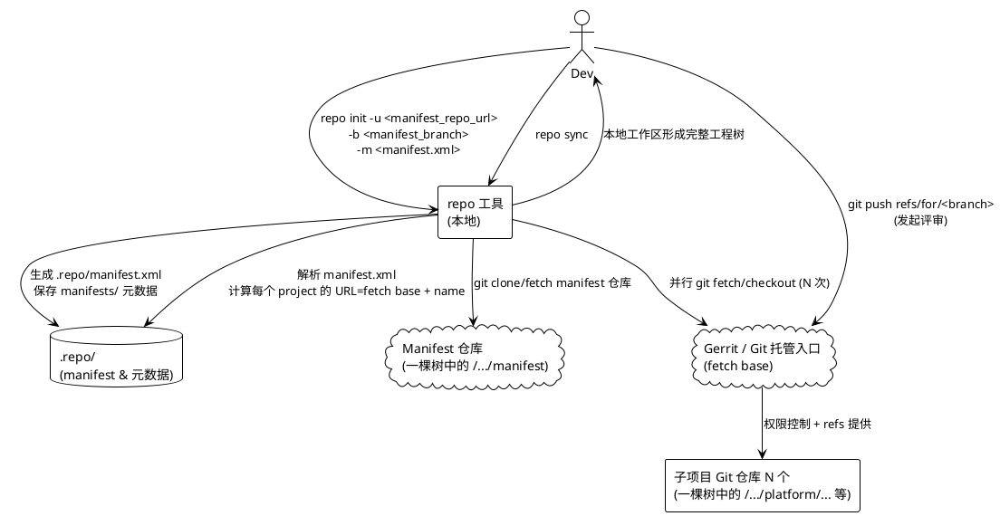
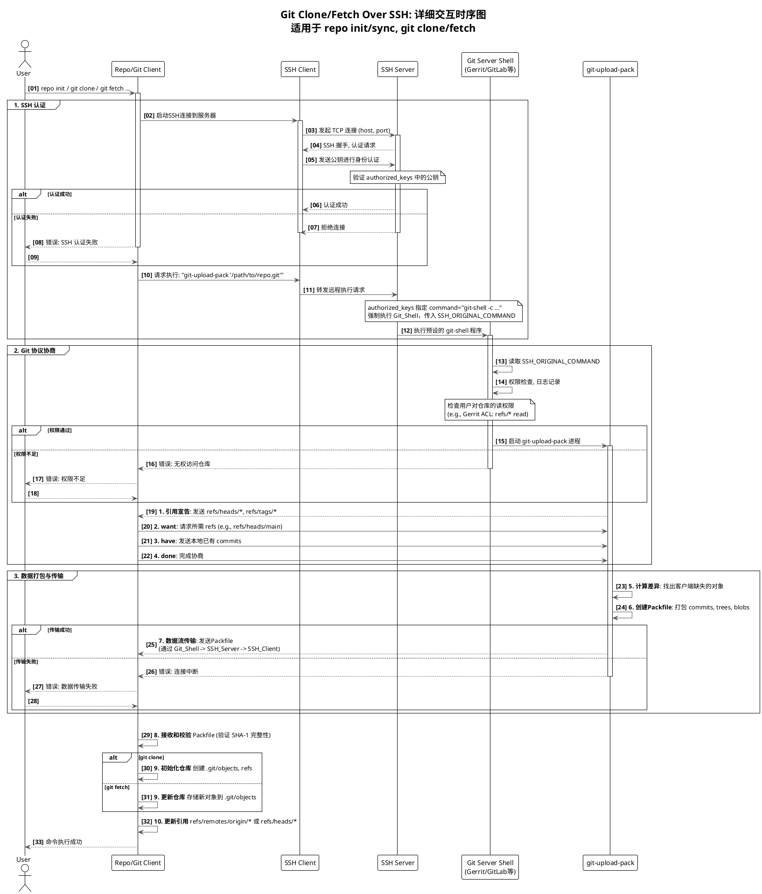
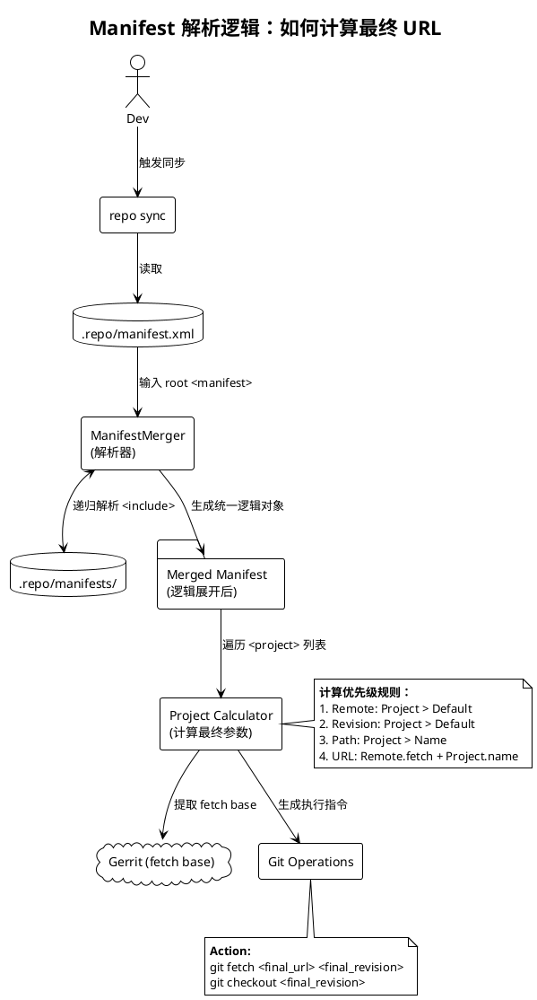

+++
date = '2025-09-27T17:17:50+08:00'
draft = false
title = '多仓库代码树管理'
+++

> **适用场景**：高通平台 / Android（QSSI / QSSI+Vendor）这类由 **上百/上千 Git 仓库** 组成的工程；公司内网采用 **“一棵树”式命名空间** 托管仓库；开发日常通过 `repo init` / `repo sync` 拉取与更新代码，通过 **Gerrit** 走评审与提交。
>
> 本文目标：**从概念到落地**，把“多仓库代码树是如何被管理、如何被拉取、如何被评审与集成”的链路讲清楚，并用 PlantUML 图解关键过程。

---

## 目录

1. 基础概念速览（Git / Gerrit / Manifest / repo）
2. 为什么需要 repo（多仓库工程的现实）
3. “一棵树”式内网 Git 托管模型（命名空间 vs 物理路径）
4. Manifest：工程蓝图（remote / fetch base / project / revision）
5. repo：多仓库批量驱动器（init / sync 的真实行为）
6. Gerrit：评审闸口与权限中心（Change-Id / refs/for / submit）
7. 实操链路：取码 → 开发 → 评审 → 集成
8. 常用命令工具箱（建议收藏）
9. Troubleshooting：常见问题与定位路径
10. 团队工程化建议：可控、可追溯、可复现

---

## 1. 基础概念速览：你到底在用什么

* **Git**：单仓库的分布式版本管理工具（commit / branch / tag / fetch / merge）。
* **Gerrit**：代码评审 + 权限控制 + 提交闸口；在多数企业内网中同时承担**权威入口**（你日常 fetch/push 的就是它）。
* **Manifest（清单）**：一个 XML（或一组 XML），描述“这个工程由哪些 Git 仓库组成、每个仓库取哪个版本、放到本地哪个路径”。
* **repo**：面向 AOSP 生态的多仓库管理器；它读取 manifest，批量执行 `git fetch` / `git checkout`，并提供跨仓库的批量操作。

**一句话总结**：

> **repo = 批量驱动 Git**；**manifest = 工程蓝图**；**Gerrit = 托管/权限/评审入口**；**Git = 实际承载版本历史与对象数据的底座**。

---

## 2. 为什么我们需要 repo：多仓库工程的现实

在 Android/座舱平台里，代码通常拆成大量独立仓库（便于权限隔离、分层演进、复用与供应商协作），常见目录族：

* `platform/`、`frameworks/`、`system/`、`vendor/`、`device/`、`kernel/` …

如果只用 Git，你需要：

* 手工 clone 100+ 次（甚至上千）
* 手工切分支、对齐版本
* 手工保证每个仓库在正确 commit 上
* 手工处理路径与依赖一致性

这会直接导致：**效率低、出错率高、版本不可复现、团队协作成本高**。

repo 的价值在于把上面的“手工劳动”系统化为：

1. **repo init**：先拿到“蓝图”（manifest 仓库 + 目标分支 + 具体 XML）
2. **repo sync**：按蓝图批量拉取所有仓库并对齐版本
3. **批量工具**：跨仓库 status / diff / forall / start 等，显著提升日常效率

---

## 3. “一棵树”式内网 Git 托管：命名空间的真实含义

我们内网常见仓库命名类似：

```text
ssh://user@10.82.64.202:8787/8397/DLS-Qualcomm-U/manifest
```

### 3.1 关键点：它首先是“命名空间”，不等于磁盘目录

> URL 里的 `/8397/DLS-Qualcomm-U/...` **优先理解为仓库命名空间（namespace）**。
> 它看起来像目录树，但对客户端而言本质是“仓库名路径”；至于服务器磁盘怎么存，是实现细节（可能映射，也可能不一一对应）。

你可以把它抽象成一棵逻辑树（便于理解与沟通）：

```text
(代码托管入口：10.82.64.202:8787)
└── 8397/
    └── DLS-Qualcomm-U/
        ├── manifest
        ├── platform/...
        ├── frameworks/...
        ├── system/...
        └── vendor/...
```

其中 **manifest** 仓库是“蓝图仓库”：里面存放 `default.xml` / `qssi.xml` 等清单文件与分支。

---

## 4. Manifest：工程“蓝图”

### 4.1 Manifest 解决的三件事

manifest 中每个 `<project>` 都回答三个问题：

1. **取哪个仓库**：`name="..."`（仓库名/命名空间路径）
2. **取哪个版本**：`revision="..."`（分支、tag 或 commit hash）
3. **放到本地哪里**：`path="..."`（工作区相对路径）

此外：

* `<remote>`：定义远程“拉取基址”与名字
* `<default>`：给项目默认 remote / revision（减少重复配置）
* `<include>`：拆分与组合 manifest（复杂工程常用）

### 4.2 “fetch 基址（fetch base）”是什么

你经常听到的“fetch 基址”，就是 `<remote fetch="...">` 提供的 **URL 前缀**。repo 在 sync 时会做拼接：

```text
最终 fetch URL = remote.fetch + project.name
```

示意：

```xml
<remote name="gerrit" fetch="ssh://user@10.82.64.202:8787/" />
<project name="8397/DLS-Qualcomm-U/system/core"
         path="system/core"
         remote="gerrit"
         revision="dev_rc16_3.1_20250730"/>
```

repo sync 时等价于在该 project 执行（语义等价）：

```bash
git fetch ssh://user@10.82.64.202:8787/8397/DLS-Qualcomm-U/system/core <revision>
```

**结论（务必区分清楚）**：

* `repo init -u .../manifest` 指向的是 **manifest 仓库地址**（拿蓝图）
* `<remote fetch="...">` 才是 **子仓库拉取时使用的 fetch 基址**（拿代码）

> 这也是很多新人最容易混淆的点：
> **manifest 仓库 ≠ 子仓库的统一入口**，它只是“蓝图的来源”。

### 4.3 revision：可复现 vs 可漂移（团队必须统一口径）

manifest 的 revision 写法决定工程是否“可复现”：

* **Pin 到 commit hash / tag**：可复现（发布基线/交付版本推荐）
* **指向分支名**：会漂移（适合日常开发集成，但不适合作为交付快照）

实操建议：

* **发布/交付**：必须产出 `repo manifest -r` 的 “全量 pin”存档（证据链）
* **开发/集成**：可允许部分仓库使用浮动分支，但要明确“这不是快照”

---

## 5. repo：多仓库的“批量遥控器”

### 5.1 repo init 做了什么（从实现行为看）

以你的命令为例：

```bash
repo init \
  -u ssh://user@10.82.64.202:8787/8397/DLS-Qualcomm-U/manifest \
  -b dev_rc16_3.1_20250730 \
  -m qssi.xml
```

它做的事情（面向工程可理解）：

* 创建 `.repo/` 元数据目录
* 把 **manifest 仓库** clone 到 `.repo/manifests/`
* checkout 到 `-b` 指定的 manifest 分支
* 选择 `-m` 指定的 xml 文件作为入口清单（生成/链接 `.repo/manifest.xml`）

> **repo init 只拿蓝图，不拉取业务源码。**
> 真正拉取工程树是在下一步 `repo sync`。

### 5.2 repo sync 做了什么（本质：对每个 project 执行 Git 操作）

repo sync 的内部步骤可以抽象为：

1. 读取 `.repo/manifest.xml`
2. 遍历每个 `<project>`：

   * 计算远程 URL：`remote.fetch + project.name`
   * 在本地 `path` 初始化/更新一个 Git 仓库
   * `git fetch` 对应 revision 所需对象
   * `git checkout` 到 manifest 指定版本（常见为 detached HEAD）

你可以把它理解成对 N 个仓库并行执行：

* `git init` / `git remote add`
* `git fetch`
* `git checkout <revision>`

---

## 6. Gerrit：为什么我们不直接 push 到仓库（评审闸口）

### 6.1 Gerrit 在体系里的角色

企业研发流程中，Gerrit 通常承担：

* **统一入口**：clone/fetch/push 的地址集中在 Gerrit
* **权限控制**：读写权限、分支保护、ACL
* **评审流程**：Code-Review / Verified 等打分与门禁
* **提交闸口**：满足规则才能 submit 合入目标分支

> 很多人以为 Gerrit 只是 proxy。
> 在更常见的落地形态里：**Gerrit 就是权威入口**（决定你是否能读/写/提交）。

### 6.2 Gerrit 与 Git 的关键机制（必须掌握）

1. **Change-Id**
   Gerrit 用 Change-Id 关联同一变更的多次 patchset。通常由 `commit-msg` hook 自动生成。

2. **push 到 refs/for/**
   评审不是直接 push 到 `refs/heads/<branch>`，而是 push 到 `refs/for/<branch>` 发起评审。

3. **Submit 才真正落分支**
   Review + CI 门禁通过后，Gerrit 才允许 submit，把变更写入目标分支历史。

---

## 7. 实操链路：取码 → 开发 → 评审 → 集成

### 7.1 取码（第一次拉取工程）

```bash
repo init -u <manifest_repo_url> -b <manifest_branch> -m <manifest.xml>
repo sync -j16
```

建议按需使用：

* `repo sync -c`：只同步当前分支（减少 refs）
* `repo sync --force-sync`：仓库异常时强制重建（谨慎）
* `repo init --reference <mirror_dir>`：共享缓存/镜像（大幅提速）

### 7.2 开发（多仓库批量起分支）

```bash
repo start my_feature_branch --all
# 或仅对某些仓库
repo start my_feature_branch path/to/project
```

### 7.3 提交（单仓库标准 Git 流程）

```bash
cd frameworks/base
git status
git add -A
git commit -m "Fix xxx"
```

检查 Change-Id（Gerrit 必需）：

```bash
git show -s | grep Change-Id
```

### 7.4 评审（推到 Gerrit）

```bash
git push origin HEAD:refs/for/dev_rc16_3.1_20250730
```

### 7.5 集成（submit 后，其他人 repo sync 获取新基线）

```bash
repo sync
```

---

## 8. repo 常用命令“工具箱”

### 8.1 查看与定位

```bash
repo status
repo diff
repo forall -c 'git status -sb'
repo list
```

### 8.2 同步与切换

```bash
repo sync -j16
repo sync -c
repo sync -d
repo rebase
```

### 8.3 导出“可复现快照”（关键证据链）

```bash
repo manifest -r -o pinned.xml
```

* `-r` 会把每个 project 的 revision 导出为具体 commit hash（pin）
* `pinned.xml` 用于：复现问题、发布追溯、交付归档

---

## 9. 常见误区与正确口径（内部统一认知用）

### 误区 1：`repo init` 后代码就全下来了

✅ `repo init` 只拿蓝图；`repo sync` 才拉源码。

### 误区 2：`-b` 是整个工程的“代码分支”

✅ `-b` 是 **manifest 仓库分支**；子仓库版本由 manifest 的 revision 决定。

### 误区 3：URL path 一定对应服务器真实目录

✅ 它是命名空间/仓库名；物理存储是服务端实现细节。

### 误区 4：manifest 分支 = 工程快照

✅ 只有当 manifest pin 到 commit/tag 才是严格快照；浮动分支不是严格可复现。

---

## 10. Troubleshooting：常见问题与定位路径

1. **SSH 认证失败**

   * 现象：Permission denied / Could not read from remote repository
   * 排查：`ssh -p 8787 user@host`；SSH key；Gerrit ACL

2. **manifest 拉取失败**

   * 现象：repo init 报仓库不存在/无权限
   * 排查：URL、`-b` 分支、`-m` 文件

3. **project 不存在**

   * 现象：404/Project not found
   * 排查：`<project name>` 是否写错；仓库是否迁移；remote fetch 是否匹配

4. **revision 不存在**

   * 现象：couldn't find remote ref
   * 排查：revision 分支/tag 是否真的在该仓库存在

5. **本地仓库损坏**

   * 现象：sync 失败/对象缺失
   * 处理：单仓库 `git fsck` / `git fetch --all`；最后手段 `repo sync --force-sync`

6. **本地修改阻塞 sync**

   * 处理：`repo status` 找脏仓库；stash/commit/丢弃后再 sync

7. **只同步部分仓库**

   * 使用 group（`repo init -g`）或 `repo sync path/to/project`

8. **对齐同事环境（复现）**

   * 使用对方的 `pinned.xml` 重建（最可靠）

---

## 11. 团队工程化建议：可控、可追溯、可复现

### 11.1 Manifest 管理规范（建议写进流程）

* manifest 仓库必须有清晰分支策略：`dev` / `release` / `hotfix`
* 关键里程碑必须归档：`repo manifest -r -o pinned.xml`
* manifest 变更必须走 Gerrit 评审（它决定整棵树版本）

### 11.2 版本可追溯

* 发布基线：尽量 pin 到 commit/tag
* 开发集成：允许浮动但要声明“非快照”
* 重要问题复现：必须用 pinned manifest

### 11.3 性能与体验

* 团队共享 mirror/reference（跨网段/大仓库收益巨大）
* 统一建议并行度 `repo sync -jN`（结合带宽/CPU/磁盘）

---

# 附录 A：管理拓扑图

> 这张图描述 **repo init/sync** 与 **manifest / Gerrit / 子仓库** 之间的关系：
> repo 先从 manifest 仓库取蓝图，再用 fetch base 去 Gerrit 批量拉取子仓库。



**图解要点**：

* **ManRepo（manifest 仓库**只负责“蓝图”，不直接承载所有业务源码
* **Gerrit（fetch base）** 是 repo sync 进行批量 `git fetch` 的入口
* `.repo/` 目录是 repo 的“控制中枢”：保存 manifest、project 列表与映射关系
* 开发提交时，最终仍然是 **对某个具体子仓库执行 git push**（只不过入口是 Gerrit）

---

# 附录 B：Git Clone/Fetch over SSH 时序图

> 这张时序图解释：当 repo/git 通过 `ssh://...` 拉取代码时，**SSH 只负责认证与远程进程拉起**，真正的数据协商与 packfile 传输由 **git-upload-pack** 完成。
> 在 Gerrit/GitLab 等系统里，服务端通常会把用户限制在 `git-shell` 之类的受控命令环境中。



**图解要点（按 4 个 group 解释）**：

* **Group 1：SSH 认证**

  * repo/git 先建立 SSH 连接（host+port）
  * 通过公钥认证确认身份
  * 认证成功后，客户端请求“远程执行 git-upload-pack …”
  * 服务端通常用 `authorized_keys` 强制指定受控命令（如 `git-shell`），避免用户拿到任意 shell

* **Group 2：Git 协议协商**

  * `git-upload-pack` 向客户端宣告 refs（heads/tags）
  * 客户端用 want/have/done 计算“差异集”（只传缺的对象）
  * 同时 Gerrit/Git Server Shell 会进行权限检查（是否能读该 repo/refs）

* **Group 3：打包与传输**

  * 服务端把缺失对象打成 packfile
  * packfile 通过 SSH 连接传输（SSH 负责安全通道，Git 负责内容协议）

* **Group 4：客户端落盘**

  * 客户端接收并校验对象
  * clone 会初始化仓库结构；fetch 会把对象追加到 objects 并更新 refs

---

## 结语

* repo 并不是替代 Git；它是批量调度器
* manifest 不是代码本体；它是工程版本“蓝图”
* Gerrit 不是简单 proxy；它常常是企业研发的权限与评审中心
* 真正的源码版本历史，永远在各个 Git 仓库对象库中

---

## 附录 C：Manifest 解析细节图（remote / default / project / include）

> 这张图的核心目的：把 repo 在 `repo sync` 时对 manifest 的解析逻辑“显式化”。
> **重点看三条最终输出**：
>
> 1. `final_fetch_url`（fetch base + project.name）
> 2. `final_revision`（project 覆盖 default）
> 3. `final_path`（本地落目录）



#### 1) `include` 的意义：把“一个巨型 manifest”拆成模块化

* 复杂工程往往不会只靠一个 `qssi.xml` 或 `default.xml`，而是：

  * 主文件做框架
  * 其他文件按平台 / 产品 / vendor 分层
  * 用 `<include name="xxx.xml"/>` 组合
* repo sync 时会先把 include 全部展开并合并成“统一逻辑 manifest”（图中 **Merged**）。

#### 2) `remote.fetch` 就是“fetch 基址（fetch base）”

* `<remote fetch="ssh://host:port/">` 提供统一 URL 前缀
* 每个 `<project name="...">` 提供仓库在“一棵树”中的逻辑名称
* repo 计算 `final_fetch_url = remote.fetch + project.name`
  这就是你在日常口语里听到的：**“remote 的 fetch 基址 + project name 拼成最终仓库地址”**。

#### 3) `default` 是“批量省略项”，`project` 是“精确覆盖项”

* `<default remote="gerrit" revision="dev_xxx"/>` 相当于给所有 project 提供默认 remote/revision
* 某个 `<project>` 如果显式写了 `remote=` 或 `revision=`，就覆盖 default
* 这就是图中“优先级规则”的来源（**project 优先，default 兜底**）。

#### 4) 为什么经常看到 detached HEAD

* 如果 manifest 把 revision pin 到 **commit hash / tag**：
  checkout 结果多是 detached HEAD —— 这是“可复现快照”的典型形态
* 如果 revision 是 **分支名**：
  repo 会尽量让工作区跟随该分支（但本质仍由 manifest 决定）

---


