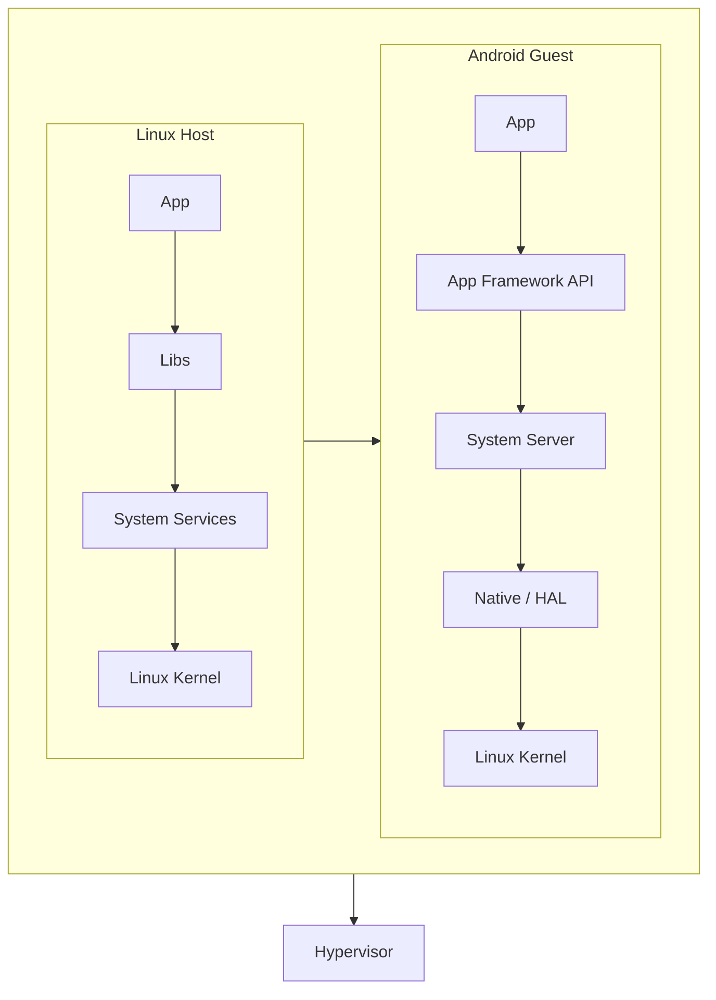

+++
date = '2025-08-03T17:17:50+08:00'
draft = true
title = 'software architecture template'
+++

```mermaid
flowchart TB

%% =======================
%% Top: Host & Guest
%% =======================
subgraph TOP[" "]
    direction LR

    %% -------- Linux Host --------
    subgraph LINUX_HOST["Linux Host"]
        direction TB
        LH_APP[App]
        LH_LIBS[Libs]
        LH_SS[System Services]
        LH_KERNEL[Linux Kernel]

        LH_APP --> LH_LIBS --> LH_SS --> LH_KERNEL
    end

    %% -------- Android Guest --------
    subgraph ANDROID_GUEST["Android Guest"]
        direction TB
        AG_APP[App]
        AG_API[App Framework API]
        AG_SS[System Server]
        AG_NATIVE[Native / HAL]
        AG_KERNEL[Linux Kernel]

        AG_APP --> AG_API --> AG_SS --> AG_NATIVE --> AG_KERNEL
    end

    LINUX_HOST --> ANDROID_GUEST
end

%% =======================
%% Bottom: Hypervisor
%% =======================
HYP["Hypervisor"]

TOP --> HYP

```