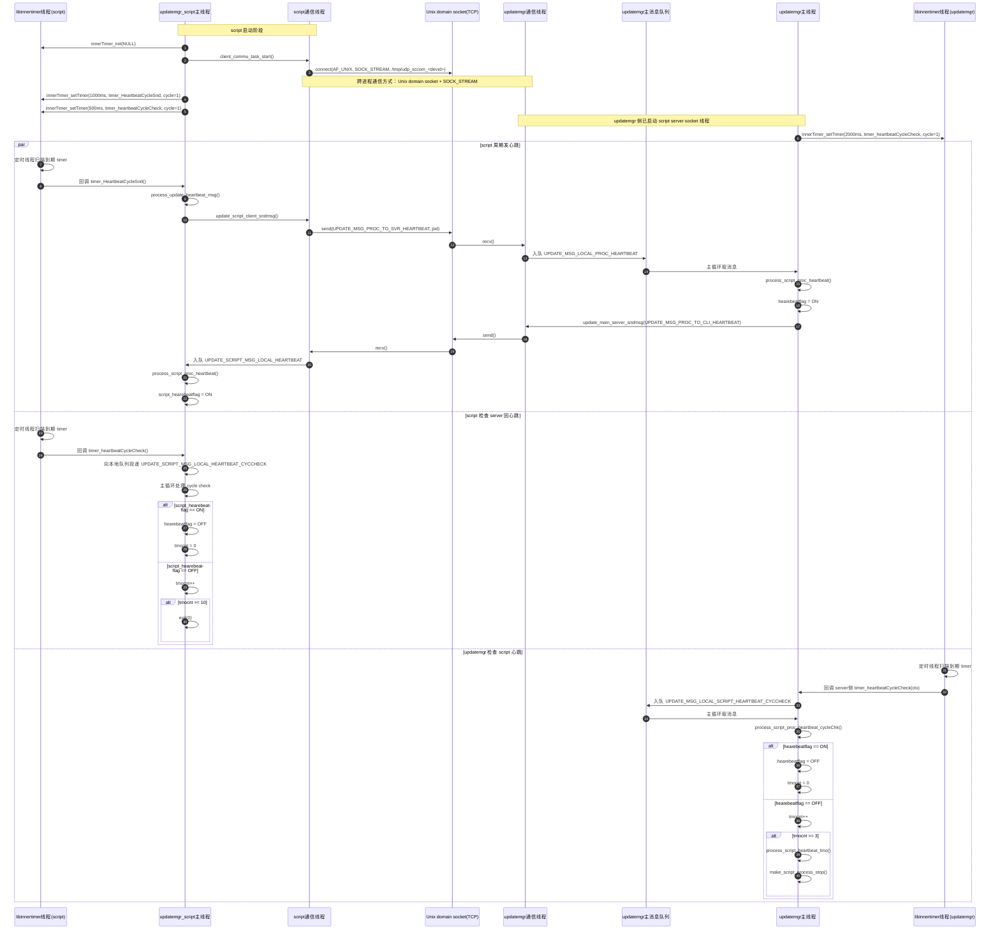

+++
date = '2025-08-08T11:36:11+08:00'
draft = true
+++

# updatemgr 与 updatemgr_script 心跳机制分析

## 1. 总结

`updatemgr` 和 `updatemgr_script` 之间的心跳不是通过 pmonitor 完成的，也不是靠主循环里手写 sleep 轮询完成的。

它的实际实现是两层：

1. `updatemgr` 与 `updatemgr_script` 之间，使用 Unix domain socket 互发心跳消息。
2. 两边各自使用 `libinnertimer` 创建周期定时器，驱动“发心跳”和“检查对端是否按时回复”。

同时还要区分两套“心跳”：

- `updatemgr <-> updatemgr_script` 之间的进程间心跳
- `updatemgr -> pmonitor` 的 watchdog/pmonitor 心跳

这篇文档只分析前者。

## 2. 代码级流程概览

### 2.1 script 侧

`updatemgr_script` 在启动时会做四件与心跳直接相关的事：

1. `innerTimer_init(NULL)` 初始化 `libinnertimer`
2. `client_commu_task_start()` 启动与 `updatemgr` 通信的 socket 线程
3. 启动发送心跳的周期 timer：`HEART_TIMEOUT = 1000ms`
4. 启动检查 server 回心跳的周期 timer：`HEARTCK_TIMEOUT = 500ms`

对应代码在：

- [`updatemgr/src_script/updatemgr_script_local.c`](/home/ethen/workspace/voyah/projects/8397/code/linux/apps/apps_proc/voyah-cluster/updatemgr/src_script/updatemgr_script_local.c)

关键常量：

- `HEART_TIMEOUT = 1000` ms
- `HEARTCK_TIMEOUT = 500` ms
- `HEARTBEAT_RETRY_NUM = 10`

因此 script 侧的 server 超时退出阈值约为：

- `500ms * 10 = 5s`

### 2.2 server 侧

`updatemgr` 在 script 启动流程中，会为对应 `dev_index` 启动一条独立的 script 通信线程，以及一条 script 心跳检查 timer。

- 通信线程：`process_main_svr_commu_server_task()`
- 检查 timer 周期：`HEARTBEAT_TIMEOUT = 2000ms`
- 超时重试：`HEARTBEAT_RETRY_NUM = 3`

对应代码在：

- [`updatemgr/src/updatemgr_inner_common.c`](/home/ethen/workspace/voyah/projects/8397/code/linux/apps/apps_proc/voyah-cluster/updatemgr/src/updatemgr_inner_common.c)
- [`updatemgr/src/updatemgr_mtx_event.c`](/home/ethen/workspace/voyah/projects/8397/code/linux/apps/apps_proc/voyah-cluster/updatemgr/src/updatemgr_mtx_event.c)

因此 server 侧的 script 超时判定阈值约为：

- `2000ms * 3 = 6s`

## 3. Mermaid 时序图



## 4. 定时器是如何实现的

`updatemgr` 和 `updatemgr_script` 用的都是同一个库：

- [`libinnertimer/inc/inner_timer.h`](/home/ethen/workspace/voyah/projects/8397/code/linux/apps/apps_proc/voyah-cluster/libinnertimer/inc/inner_timer.h)
- [`libinnertimer/src/inner_timer.c`](/home/ethen/workspace/voyah/projects/8397/code/linux/apps/apps_proc/voyah-cluster/libinnertimer/src/inner_timer.c)

### 4.1 初始化模型

`innerTimer_init()` 会：

1. 初始化 `g_timerMutex`
2. 清空全局 timer 数组 `g_innerTimer[MAX_TIMER_NUM]`
3. 创建一条后台线程 `TimerThreadProc`
4. 把线程名设置为 `innertimer`

也就是说，`innerTimer` 不是基于 `timerfd`、`SIGALRM`、`epoll` 或应用主线程轮询，而是：

- 一个库内常驻后台线程
- 一个内存 timer 数组
- 周期扫描到期项并直接调用回调函数

### 4.2 定时线程如何工作

`TimerThreadProc()` 的核心逻辑是：

1. `mseconds_sleep(TIMER_BASIC_UNIT)`，基本扫描周期是 `5ms`
2. 获取当前 `CLOCK_MONOTONIC` 毫秒计数 `getTickCount()`
3. 遍历 `g_innerTimer[]`
4. 对每个激活 timer 判断 `endtickcount <= nowtick`
5. 到期后：
   - 周期 timer：重置下一次 `endtickcount = now + ms`
   - 单次 timer：把 `activeFlag` 清掉
6. 最后在 **定时线程上下文** 中直接调用回调：
   - `g_innerTimer[i].pFuncCallback(g_innerTimer[i].context, i)`

这个实现有两个很重要的性质：

- 回调不是自动切回应用主线程执行的
- 回调执行时仍然持有 `g_timerMutex`

因此，timer 回调里不适合做耗时工作；更稳妥的做法是：

- 回调里只做轻量操作
- 然后投递消息到主线程队列

这也是 `updatemgr_script` 和 `updatemgr` 当前代码采用的模式：

- 检查型 timer 回调只投递本地消息
- 真正状态机处理在主循环里完成

### 4.3 `innerTimer_setTimer()` 做了什么

`innerTimer_setTimer(ms, cb, context, isCycleFlag)` 会：

1. 检查 timer 主线程是否已运行
2. 找到一个空闲 timer slot
3. 设置：
   - `endtickcount = getTickCount() + ms`
   - `ms = 周期`
   - `isCycle = 是否循环`
   - `pFuncCallback = 回调`
   - `context = 上下文`
4. 返回 `timerID`

因此 `updatemgr_script` 里的：

- `innerTimer_setTimer(1000, ..., 1)`
- `innerTimer_setTimer(500, ..., 1)`

都是真正的周期 timer，不是主循环自己 sleep 出来的。

## 5. 为什么当前实现是“定时器回调 + 主队列”混合模型

代码里有一个明显设计取舍：

- 发心跳 timer：回调里直接发 socket 消息
- 检查心跳 timer：回调里只投递本地消息，再由主循环更新 `hearebeatflag/tmocnt`

这样做的原因很实际：

1. 发心跳逻辑很短，只是构造一个小消息并 `send()`。
2. 检查逻辑会修改状态机变量，甚至触发 `exit()`、`make_script_process_stop()`、重启脚本等重操作，不适合直接在 `innertimer` 线程上下文里做。
3. 因为 `innerTimer` 回调是在定时线程里直接执行，所以把复杂逻辑投递回主循环是更安全的做法。

## 6. 需要特别注意的几个点

### 6.1 文档里容易画错的一点

`updatemgr_script` 发送心跳时，不是“先把心跳消息塞到 updatemgr 主队列，再由 updatemgr 侧线程发送”。

真正实现是：

- script 的 timer 回调
- script 自己调用 `update_script_client_sndmsg()`
- 直接通过 Unix domain socket 发给 updatemgr server thread

### 6.2 通信线程和主线程是分离的

在 `updatemgr` 里：

- `process_main_svr_commu_server_task()` 只负责 socket accept/recv/send
- 收到心跳后再转成 `UPDATE_MSG_LOCAL_PROC_HEARTBEAT` 投递到主消息队列
- 最终由 updatemgr 主线程做状态处理

因此，如果主线程长时间阻塞，可能出现：

- 通信线程已经收到了心跳
- 但主线程还没来得及消费队列并置位 `hearebeatflag`
- 心跳检查 timer 又先一步触发
- 于是误判 timeout

这也是分析 heartbeat 误超时问题时必须把“通信线程收包时间”和“主线程消费时间”拆开看的原因。

### 6.3 `innerTimer` 不是高精度实时定时器

因为它本质上是：

- 5ms 基本扫描周期
- 一个普通 pthread 后台线程
- `CLOCK_MONOTONIC` 比较到期时间

所以它是一个轻量软件 timer，不是硬实时定时器。

在 CPU 忙、锁竞争、主线程阻塞时，timer 回调和后续消息处理都可能延迟。

## 7. innerTimer 的实现原理与风险点

这一节不再只从 `updatemgr` 的使用方视角描述，而是直接按 [`libinnertimer/src/inner_timer.c`](/home/ethen/workspace/voyah/projects/8397/code/linux/apps/apps_proc/voyah-cluster/libinnertimer/src/inner_timer.c) 的实现拆开看。

### 7.1 全局模型

`innerTimer` 的模型很简单，核心只有五个全局对象：

- `g_innerTimer[MAX_TIMER_NUM]`
  - 固定长度 timer 表，最大只支持 `15` 个 timer
- `g_timerMutex`
  - 保护整张 timer 表
- `g_api_mutex`
  - 串行化 `init/set/stop/deinit` 这类 API
- `g_mainThreadRunFlg`
  - 定时线程是否运行
- `g_mainThreadPid`
  - 定时线程 `pthread_t`

也就是说，这不是一个“每个 timer 一个线程”的模型，而是：

- 一个后台线程
- 一张固定大小的 timer 数组
- 每轮扫描整张表

### 7.2 初始化阶段发生了什么

`innerTimer_init()` 的实际动作是：

1. 初始化 `g_timerMutex`
2. `memset(g_innerTimer, 0, sizeof(g_innerTimer))`
3. 置 `g_mainThreadRunFlg = 1`
4. `pthread_create(&pid, NULL, TimerThreadProc, NULL)`
5. 保存 `g_mainThreadPid` 和日志回调

所以 `innerTimer` 的所有 timer 最终都依赖这一条后台线程。只要这条线程调度延迟、被阻塞，所有 timer 都会一起受影响。

### 7.3 定时线程如何扫描和触发 timer

`TimerThreadProc()` 的每轮循环是：

1. `mseconds_sleep(TIMER_BASIC_UNIT)`
2. `pthread_mutex_lock(&g_timerMutex)`
3. `nowtick = getTickCount()`
4. 从 `0` 到 `MAX_TIMER_NUM-1` 扫描每个 slot
5. 如果 `activeFlag == ON` 且 `endtickcount <= nowtick`，就认为 timer 到期
6. 周期 timer 先重装下一次 `endtickcount = getTickCount() + ms`
7. 单次 timer 直接 `activeFlag = OFF`
8. 如果有回调，就直接执行 `pFuncCallback(context, timerID)`
9. 全表扫描结束后再 `pthread_mutex_unlock(&g_timerMutex)`

这里有两个实现细节非常关键：

- 回调是在 `innertimer` 线程里直接执行的
- 执行回调时 `g_timerMutex` 仍然持有

这两个点决定了它不是一个“高并发、安全隔离”的 timer 框架，而是一个很轻量、但容易互相拖累的软件 timer。

### 7.4 时间基准和周期精度

它的时间基准是 [`getTickCount()`](/home/ethen/workspace/voyah/projects/8397/code/linux/apps/apps_proc/voyah-cluster/libinnertimer/src/inner_timer.c#L76) 里的 `CLOCK_MONOTONIC`，单位是毫秒。

优点是：

- 不受 wall time 改变影响
- 比 `gettimeofday()` 更适合做超时判断

但周期精度仍然受三层因素限制：

- 基本扫描粒度只有 `5ms`
- 线程是否被调度到 CPU
- 本轮是否被前一个回调拖慢

因此它天然只能提供“近似到期后尽快执行”，而不是严格的 deadline 语义。

### 7.5 `mseconds_sleep()` 为什么会明显超时

[`mseconds_sleep()`](/home/ethen/workspace/voyah/projects/8397/code/linux/apps/apps_proc/voyah-cluster/libinnertimer/src/inner_timer.c#L57) 用的是：

```c
select(0, NULL, NULL, NULL, &tv)
```

这类 sleep 方式只能保证“不会早于 timeout 返回”，不能保证“刚好在 timeout 时运行到用户代码”。

出现“本来想睡 5ms/100ms，结果下一轮晚了 2s 多”的常见原因有三类：

1. 定时线程已经从 `select()` 返回，但长时间没被调度到
2. 上一轮某个回调本身阻塞了很久
3. 回调执行期间一直持有 `g_timerMutex`，导致后续 `setTimer/stopTimer` 和下一轮扫描都被拖住

所以很多时候表面看像“`select()` 超时 2s”，本质上其实是“`innertimer` 线程的运行时机晚了 2s”。

### 7.6 为什么回调里的耗时操作风险很大

因为当前实现是在持锁状态下直接调用回调：

```c
pthread_mutex_lock(&g_timerMutex);
...
g_innerTimer[i].pFuncCallback(g_innerTimer[i].context, i);
...
pthread_mutex_unlock(&g_timerMutex);
```

这会带来一条很硬的串行化链：

- 一个回调慢
- 整个 timer 线程慢
- 其它 timer 的触发全部一起晚
- 期间 `innerTimer_setTimer()` / `innerTimer_stopTimer()` 也会争用同一把 `g_timerMutex`

对 `updatemgr` 这种 heartbeat 场景来说，这意味着：

- 某个无关 timer 回调阻塞
- script/server 的 heartbeat timer 都可能一起漂移
- 最终表现成“明明系统没死，但心跳检查晚了，甚至误超时”

### 7.7 当前实现的主要风险点

结合代码，可以把风险点明确列成下面几条。

#### 风险 1：单线程扫描，所有 timer 天然互相影响

整个库只有一条 `innertimer` 线程。任何一个 timer 回调、调度延迟、锁等待，都会影响同进程内所有 timer。

#### 风险 2：回调在持锁状态下执行

这是当前实现里最危险的一点。它会放大：

- 慢回调
- 阻塞回调
- 回调里再次触发 timer API 的重入风险

虽然当前 `updatemgr` 代码比较克制，检查型回调主要是投递消息，但发送型回调仍然会直接走 socket 发送路径。

#### 风险 3：固定大小 timer 表，容量只有 15

`MAX_TIMER_NUM = 15`。如果未来同一进程里 timer 数量继续增长，`innerTimer_setTimer()` 会直接失败。这个库没有动态扩容，也没有优先级隔离。

#### 风险 4：周期 timer 使用“当前时间 + 周期”重装，会累积抖动

代码是：

```c
g_innerTimer[i].endtickcount = getTickCount() + g_innerTimer[i].ms;
```

这表示下一次触发时间是“本次真正处理到这个 timer 的时刻 + 周期”，而不是“上一个理论 deadline + 周期”。

结果就是：

- 如果某一轮晚了 300ms
- 后续周期也会整体向后漂
- 它不会自动追赶理论节拍

对 heartbeat 来说，这会让“发送周期”和“检查周期”的相位关系变得更脆弱。

#### 风险 5：deinit 依赖线程自然醒来退出

`innerTimer_deinit()` 只是把 `g_mainThreadRunFlg = 0`，然后 `pthread_join()`。如果定时线程此时正卡在长回调里，`deinit` 也会一起卡住。

### 7.8 为什么 `updatemgr` 现在还能基本工作

因为使用方做了两层缓冲：

- 心跳检查回调不直接改复杂状态，而是投递到主消息队列
- 超时判定不是“一次不到就判死”，而是有重试次数

具体就是：

- script 侧：`500ms` 检查一次，连续 `10` 次失败才退出
- server 侧：`2000ms` 检查一次，连续 `3` 次失败才停 script

这在一定程度上吸收了 `innerTimer` 抖动带来的误差，但并没有消除根因。

### 7.9 对 heartbeat 问题分析的实际意义

分析 `updatemgr` / `updatemgr_script` 心跳误超时时，不能把问题简单理解成“对端没发”。还要同时考虑三层时间：

- timer 线程什么时候真正执行回调
- 通信线程什么时候真正收发 socket
- 主线程什么时候真正消费消息并置位 `hearebeatflag`

这也是为什么现场经常会出现一种现象：

- 抓包或 trace 看起来心跳包已经发出/收到
- 但主线程仍然因为 `hearebeatflag` 没及时更新而判了 timeout

## 8. 结论

`updatemgr_script` 的心跳包定时器实现方式可以概括成一句话：

> `updatemgr_script` 在本进程内调用 `innerTimer_setTimer()` 创建 1s 周期发送 timer 和 500ms 周期检查 timer；`libinnertimer` 内部有一条 `innertimer` 后台线程，每 5ms 扫描一次 timer 表，到期后直接在定时线程上下文中调用回调。发送回调会直接通过 Unix domain socket 向 `updatemgr` 发 `UPDATE_MSG_PROC_TO_SVR_HEARTBEAT`，检查回调则向 script 主队列投递本地检查消息，再由主循环更新 `hearebeatflag/tmocnt` 并决定是否退出。`

而 server 侧对应实现则是：

> `updatemgr` 通过每个设备独立的 Unix domain socket server thread 接收 script 心跳，并通过自己的 2s 周期检查 timer 在主循环中判断 script 是否超时；连续 3 次未按时置位时，会进入 `process_script_heartbeat_tmo()` 并停止 script 进程。`
