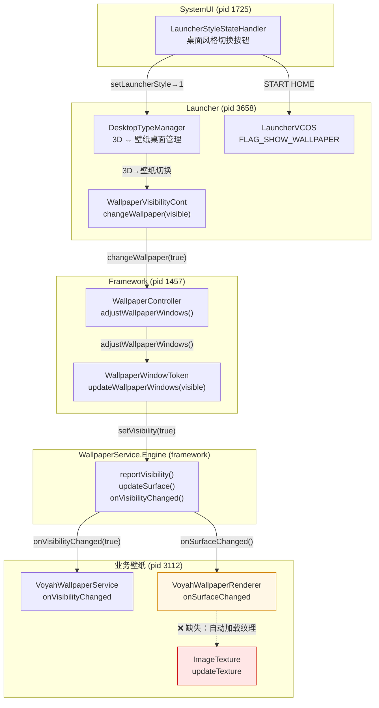
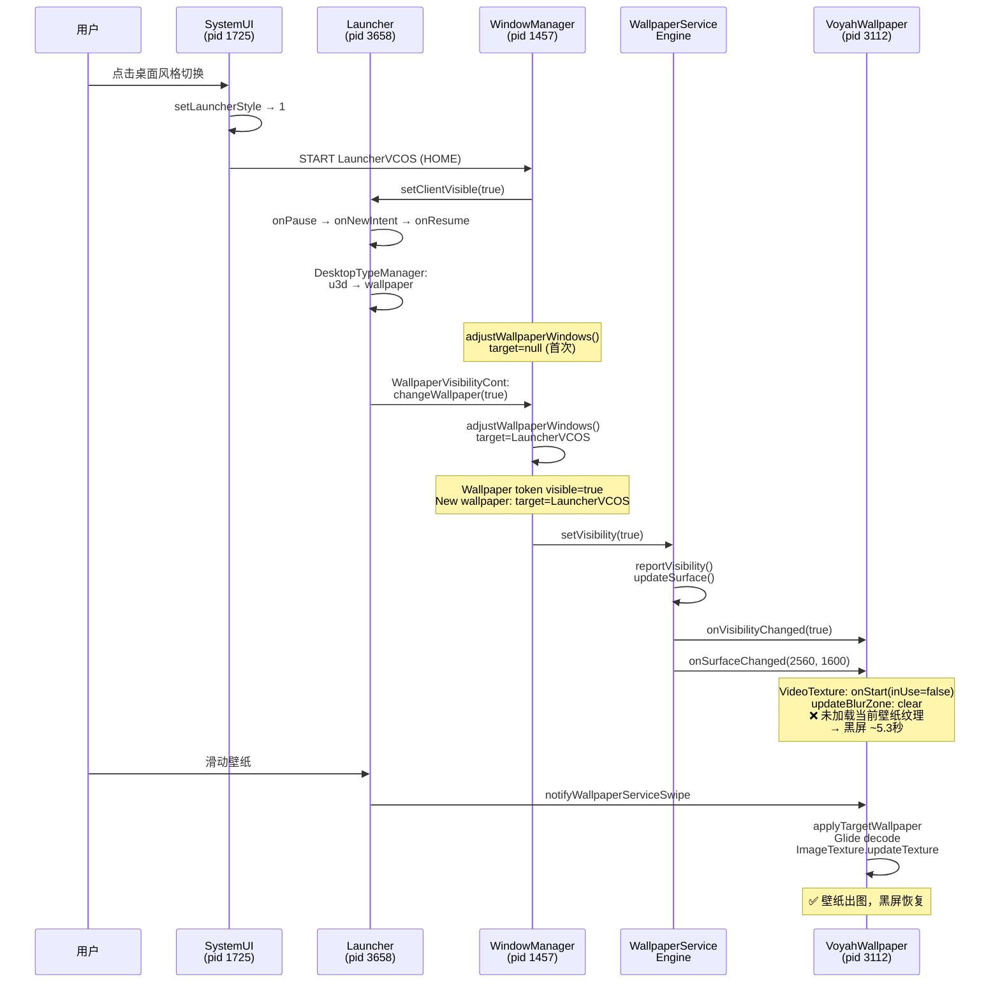

+++
date = '2025-08-08T11:36:11+08:00'
draft = true
+++

# Wallpaper 黑屏问题分析

## 概述

2026-03-23 13:57 左右，座舱主屏（displayId=0, 2560x1600）在 3D 桌面切换到壁纸桌面后出现黑屏，持续约 5.3 秒，直至用户手动滑动壁纸才恢复显示。本文从 framework 代码出发介绍壁纸工作原理，再基于 logcat 梳理完整事件时间线，最后交叉验证定位根因。

### 证据范围

| 类型 | 来源 | 可信度 |
|------|------|--------|
| Framework 源码 | `WallpaperController.java`, `WallpaperWindowToken.java`, `WallpaperService.java` | 确定 |
| 日志 | `logcat.log.040_2026_03_23_13_58_52`（覆盖 13:57:05 ~ 13:58:52） | 确定 |
| 业务壁纸源码 | `VoyahWallpaperService` / `VoyahWallpaperRenderer`（工作区未找到源码，仅有日志推断） | 高相关但未证实 |

---

## 一、壁纸渲染链路原理

### 1.1 整体架构

壁纸显示涉及三层组件：

```
WindowManager（WallpaperController）
    ↓ 决定 wallpaper 是否可见
WallpaperService.Engine（framework 基类）
    ↓ 驱动 surface 生命周期
VoyahWallpaperService / VoyahWallpaperRenderer（业务实现）
    ↓ 负责实际内容渲染
```

此外，Launcher 侧有两个关键组件参与桌面类型管理：

- **DesktopTypeManager**（pid 3658, Launcher 进程）：管理 3D 桌面 ↔ 壁纸桌面切换。`useU3D=true` / `LauncherStyle=0` 表示 3D 桌面（TuanjieView/Unity 渲染），`useU3D=false` / `LauncherStyle=1` 表示壁纸桌面。
- **WallpaperVisibilityCont**（pid 3658, Launcher 进程，非 AOSP framework 组件）：在桌面类型切换后调用 `changeWallpaper(visible)` 控制壁纸可见性。

### 1.2 WallpaperController：计算壁纸目标与可见性

**源码位置**：`frameworks/base/services/core/java/com/android/server/wm/WallpaperController.java`

核心入口是 `adjustWallpaperWindows()`（line 766），执行以下三步：

```
adjustWallpaperWindows()
  ├── findWallpaperTarget()           // 从窗口树中选出 wallpaper target
  ├── updateWallpaperWindowsTarget()  // 更新 mWallpaperTarget
  └── updateWallpaperTokens(visible)  // visible = (mWallpaperTarget != null)
      └── token.updateWallpaperWindows(visible)  // 对每个 WallpaperWindowToken
```

**wallpaper target 的选取逻辑**（`mFindWallpaperTargetFunction`, line 122）：
- 从窗口树自顶向下遍历
- 跳过 `TYPE_WALLPAPER` 类型窗口本身
- 跳过不可见且未在动画中的 Activity
- 选取条件：`w.hasWallpaper()` 且 `w.isOnScreen()`，其中 `hasWallpaper()` 对应窗口的 `FLAG_SHOW_WALLPAPER` 标志位

**关键点**：`adjustWallpaperWindows()` 中的 `visible` 完全由 `mWallpaperTarget != null` 决定（line 776），不经过 `shouldWallpaperBeVisible()` 函数。日志中 `New wallpaper: target=%s prev=%s` 即由该函数最后一行打印（line 809）。

### 1.3 WallpaperWindowToken：可见性状态管理

**源码位置**：`frameworks/base/services/core/java/com/android/server/wm/WallpaperWindowToken.java`

`updateWallpaperWindows(boolean visible)`（line 105）在 `mVisibleRequested != visible` 时：
1. 打印 `Wallpaper token %s visible=%b`
2. 调用 `setVisibility(visible)` → `commitVisibility(visible)`
3. 最终通过 `setVisible(visible)` 更新 client 可见性

### 1.4 WallpaperService.Engine：surface 生命周期与可见性回调

**源码位置**：`frameworks/base/core/java/android/service/wallpaper/WallpaperService.java`

**可见性回调链路**：

```
IWallpaperEngineWrapper.setVisibility(visible)
  → MSG_VISIBILITY_CHANGED
  → Engine.doVisibilityChanged(visible)     // line 1544
    → mVisible = visible
    → reportVisibility()                     // line 1554
      → if (visible):
          doOffsetsChanged(false)
          updateSurface(false, false, false)  // 可能触发 onSurfaceChanged()
      → onVisibilityChanged(visible)          // line 1577, 子类可覆写
```

**关键点**：当 `visible=true` 时，framework 会在调用 `onVisibilityChanged(true)` **之前**先执行 `updateSurface()`。如果 surface 尺寸有变化，会触发 `onSurfaceChanged()`。这解释了日志中 `onVisibilityChanged` 和 `onSurfaceChanged` 几乎同时出现的现象。

**首次 attach 流程**：

```
IWallpaperServiceWrapper.attach()
  → IWallpaperEngineWrapper.doAttachEngine()
    → onCreateEngine() → engine.attach()
      → onCreate(mSurfaceHolder)
      → updateSurface()
        → mSession.addToDisplay()   // 创建 TYPE_WALLPAPER 窗口
        → mSession.relayout()       // 获取 surface
        → onSurfaceCreated()
        → onSurfaceChanged()
```

### 1.5 VoyahWallpaperRenderer：业务渲染管线（日志推断）

> **注意**：以下内容基于日志行为推断，工作区中未找到 VoyahWallpaperService / VoyahWallpaperRenderer 的源码。

日志表明的渲染管线：

| 步骤 | 组件 | 关键日志 |
|------|------|----------|
| 1. 可见性通知 | VoyahWallpaperService | `onVisibilityChanged: visible -> true` |
| 2. Surface 回调 | VoyahWallpaperRenderer | `onSurfaceChanged: width -> 2560, height -> 1600` |
| 3. 视频纹理状态 | VideoTexture | `onStart: inUse -> false, isPlaying -> false` |
| 4. 模糊区域清除 | WallpaperControl | `updateBlurZone: clear blur zones` |
| 5. 壁纸加载 | WallpaperControl | `applyTargetWallpaper: Wallpaper{mIndex=N ...}` |
| 6. 图片解码 | Glide/Downsampler | `Decoded [2560x1600] ARGB_8888` |
| 7. 纹理上传 | ImageTexture | `setInUse: mInUse -> false, inUse -> true` |
| 8. 纹理更新 | ImageTexture | `updateTexture:` |

**问题关键**：步骤 1-4 在每次 `onVisibilityChanged(true)` 后都会自动执行，但步骤 5-8（实际图片加载和纹理更新）只有在用户滑动壁纸时才被触发，不会在可见性恢复时自动执行。

---

## 二、事件时间线

### 阶段 1：vehiclesettings 快速启动/退出（13:57:09 ~ 13:57:13）

此阶段 vehiclesettings 被两次快速启动又立即 `finish()`，不影响壁纸状态但导致 Activity 栈变化。

| 时间 | 事件 | 来源 |
|------|------|------|
| 13:57:09.772 | 用户点击 dock 栏 vehiclesettings 图标 | SystemUI DockDynamicAppsView0 |
| 13:57:09.780 | `START vehiclesettings/.activity.MainActivity` | ActivityTaskManager |
| 13:57:09.787 | `wm_task_to_front: [0,1056]` | system_server |
| 13:57:09.930 | `wm_activity_launch_time: ... 146ms` | system_server |
| 13:57:10.774 | `wm_finish_activity: ... app-request`（第一次自行退出） | system_server |
| 13:57:12.472 | 第二次 vehiclesettings 启动完成，`launch_time: 179ms` | system_server |
| 13:57:13.062 | `wm_finish_activity: ... app-request`（第二次自行退出） | system_server |

**状态**：两次启动后都立即 `app-request` 退出。退出后 Map（com.mega.map）恢复为前台 Activity。桌面模式仍为 **3D 桌面**（useU3D=true）。

### 阶段 2：稳定期 — Map 前台 + 3D 桌面（13:57:13 ~ 13:57:48）

Map 持续作为 top resumed activity，3D 桌面正常显示，无异常事件。

### 阶段 3：用户切换到壁纸桌面 — 黑屏开始（13:57:48 ~ 13:57:52）

这是问题发生的关键时段。用户通过负一屏（HiBoard）的桌面风格切换按钮，将 3D 桌面切换为壁纸桌面。

| 时间 | 事件 | 来源 |
|------|------|------|
| 13:57:48.988 | `getCurDesktopType: useU3D = true`（切换前状态） | DesktopTypeManager (pid 3658) |
| 13:57:48.989 | `LauncherStyleStateHandler: getState: type = 0`（当前 3D 模式） | SystemUI (pid 1725) |
| 13:57:51.463 | `StateItemStyle2: updateState: NORMAL`（开始切换） | SystemUI |
| 13:57:51.465 | `setLauncherStyle -> 1`（设置为壁纸风格） | SystemUI |
| 13:57:51.467 | `START LauncherVCOS`（SystemUI 发起，重新启动 Launcher HOME） | ActivityTaskManager |
| 13:57:51.468 | `setClientVisible: LauncherVCOS, clientVisible=true` | WindowManager |
| 13:57:51.473 | LauncherVCOS onPause → onNewIntent → onResume（快速重入） | LauncherVCOS (pid 3658) |
| 13:57:51.475 | `c2sRegisterViewToDisplay DisplayIndex 1`（TuanjieView 尝试注册，失败） | TuanjieRenderService |
| 13:57:51.484 | `New wallpaper: target=null prev=null`（首次 adjustWallpaperWindows，无 target） | WindowManager |
| 13:57:51.487 | `setDesktopType set: 1` → `u3d desk switch to wallpaper, do exit anim` | DesktopTypeManager |
| 13:57:51.488 | `changeDesktopTypeInternal: desktopType=1, u3d_desktop=0` | DesktopTypeManager |
| **13:57:51.534** | **`WallpaperVisibilityCont: changeWallpaper: visible = true`** | Launcher (pid 3658) |
| **13:57:51.546** | **`Wallpaper token ... visible=true`** | WindowManager |
| **13:57:51.546** | **`New wallpaper: target=Window{LauncherVCOS} prev=null`** | WindowManager |
| **13:57:51.546** | **`VoyahWallpaperService: onVisibilityChanged: visible -> true`** | pid 3112 |
| **13:57:51.547** | **`VoyahWallpaperRenderer: onSurfaceChanged: width -> 2560, height -> 1600`** | pid 3112 |
| 13:57:51.547 | `wm_wallpaper_surface: [0,1,Window{LauncherVCOS}]` | WindowManager |
| 13:57:51.550 | `VideoTexture: onStart: inUse -> false`（×2） | pid 3112 |
| 13:57:52.038 | `WallpaperControl: updateBlurZone: clear blur zones`（多次） | pid 3112 |

**关键观察**：从 13:57:51.547（wallpaper surface ready）开始，**没有**出现以下日志：
- `applyTargetWallpaper`（加载当前壁纸）
- `ImageTexture: setInUse -> true`（纹理激活）
- `ImageTexture: updateTexture`（纹理上传到 GPU）

**结论**：wallpaper 的窗口和 surface 生命周期已走通，但 VoyahWallpaperRenderer **未在 `onVisibilityChanged(true)` / `onSurfaceChanged()` 时加载当前壁纸纹理**。此时用户看到的是黑色的 wallpaper surface。

### 阶段 4：用户滑动壁纸 — 黑屏恢复（13:57:56）

| 时间 | 事件 | 来源 |
|------|------|------|
| **13:57:56.697** | **`WallpaperHelper.notifyWallpaperServiceSwipe`**（用户滑动） | Launcher (pid 3658) |
| 13:57:56.700 | `onSwipeStateChanged: isSwiping -> true` | VoyahWallpaperRenderer |
| 13:57:56.700 | `applyTargetWallpaper: Wallpaper{mIndex=1, mType=0, ...85ca3e2a...png}` | WallpaperControl |
| 13:57:56.701 | Glide 开始加载壁纸图片（从磁盘缓存命中） | Engine/DiskLruCacheWrapper |
| 13:57:56.837 | `Decoded [2560x1600] ARGB_8888`（解码完成，耗时 ~125ms） | Downsampler |
| **13:57:56.876** | **`ImageTexture: setInUse: mInUse -> false, inUse -> true`** | ImageTexture |
| **13:57:56.876** | **`ImageTexture: updateTexture:`**（纹理上传，壁纸可见） | ImageTexture |

**黑屏持续时间**：13:57:51.547 → 13:57:56.876 ≈ **5.3 秒**

### 阶段 5 ~ 8：后续桌面切换验证（13:58:35 ~ 13:58:52）

后续又发生了多次 3D↔壁纸切换，**每次都复现相同模式**：

| 时间 | 操作 | wallpaper visible | applyTargetWallpaper | ImageTexture |
|------|------|------------------|---------------------|--------------|
| 13:58:35.090 | 壁纸→3D（`setLauncherStyle→0`） | — | — | — |
| 13:58:35.921 | `changeWallpaper: visible = false` | false | — | — |
| 13:58:36.990 | 3D→壁纸（`setLauncherStyle→1`） | — | — | — |
| 13:58:37.014 | `changeWallpaper: visible = true` | true | **未出现** | **未出现** |
| 13:58:37.033 | `onVisibilityChanged: visible -> true` | — | — | — |
| 13:58:37.033 | `onSurfaceChanged: 2560x1600` | — | — | — |
| 13:58:45.373 | 壁纸→3D（`setLauncherStyle→0`） | — | — | — |
| 13:58:46.221 | `changeWallpaper: visible = false` | false | — | — |
| 13:58:47.373 | 3D→壁纸（`setLauncherStyle→1`） | — | — | — |
| 13:58:47.415 | `changeWallpaper: visible = true` | true | **未出现** | **未出现** |
| 13:58:47.433 | `onVisibilityChanged: visible -> true` | — | — | — |
| 13:58:47.433 | `onSurfaceChanged: 2560x1600` | — | — | — |

**结论**：这不是单次偶发问题，而是每次 3D→壁纸切换后都会复现的 **系统性缺陷**。

---

## 三、问题分析

### 3.1 Framework 侧：一切正常

代码与日志交叉验证表明，framework 侧的壁纸链路完全正常：

1. **wallpaper target 计算正确**：`LauncherVCOS` 窗口带有 `FLAG_SHOW_WALLPAPER`，被 `findWallpaperTarget()` 正确选为 target。日志 `New wallpaper: target=Window{LauncherVCOS}` 证实。

2. **可见性传递完整**：
   - `WallpaperController.adjustWallpaperWindows()` → `updateWallpaperTokens(visible=true)` — 源码 line 776, 800
   - `WallpaperWindowToken.updateWallpaperWindows(true)` → `setVisibility(true)` — 日志 `Wallpaper token ... visible=true`
   - `WallpaperService.Engine.doVisibilityChanged(true)` → `reportVisibility()` → `updateSurface()` + `onVisibilityChanged(true)` — 日志 `VoyahWallpaperService: onVisibilityChanged: visible -> true`

3. **Surface 生命周期正常**：
   - `reportVisibility()` 中 `updateSurface()` 被调用，触发 `onSurfaceChanged()` — 日志 `VoyahWallpaperRenderer: onSurfaceChanged: width -> 2560, height -> 1600`
   - `wm_wallpaper_surface: [0,1,Window{LauncherVCOS}]` 证实 wallpaper surface 已附着到正确 target

### 3.2 业务侧：可见性恢复时未加载当前壁纸纹理

**根因**：`VoyahWallpaperRenderer` 在收到 `onVisibilityChanged(true)` + `onSurfaceChanged()` 后，**不会自动加载并渲染当前壁纸图片**。只有用户滑动壁纸时，才会通过 `WallpaperHelper.notifyWallpaperServiceSwipe` → `applyTargetWallpaper` → Glide 加载 → `ImageTexture.updateTexture` 完成纹理恢复。

**证据链**：

```
每次 visible=true 后的日志序列：

  VoyahWallpaperService: onVisibilityChanged: visible -> true
  VoyahWallpaperRenderer: onSurfaceChanged: width -> 2560, height -> 1600
  VideoTexture: onStart: inUse -> false                    ← 视频纹理未使用
  WallpaperControl: updateBlurZone: clear blur zones       ← 仅清除模糊区域
  ❌ 缺少: applyTargetWallpaper / ImageTexture.setInUse / ImageTexture.updateTexture

用户滑动后的日志序列：

  WallpaperHelper.notifyWallpaperServiceSwipe              ← 触发条件：用户滑动
  WallpaperControl: applyTargetWallpaper: Wallpaper{...}   ← 加载壁纸
  Glide: Decoded [2560x1600] ARGB_8888                     ← 图片解码
  ImageTexture: setInUse: true                             ← 纹理激活
  ImageTexture: updateTexture                              ← GPU 纹理上传，此刻才出图
```

### 3.3 触发链路完整还原

```
用户操作：点击负一屏桌面风格切换按钮
    ↓
SystemUI (pid 1725): setLauncherStyle → 1
    ↓
SystemUI → startActivity(LauncherVCOS, HOME)    ← 重新 START Launcher
    ↓
LauncherVCOS: onPause → onNewIntent → onResume  ← 快速重入
    ↓
DesktopTypeManager: u3d desk switch to wallpaper
    ↓
WallpaperVisibilityCont: changeWallpaper(visible=true)     ← Launcher 侧组件
    ↓
Framework: Wallpaper token visible=true                    ← WallpaperWindowToken
    ↓
Framework: New wallpaper target=LauncherVCOS               ← WallpaperController
    ↓
WallpaperService.Engine: reportVisibility → updateSurface → onVisibilityChanged(true)
    ↓
VoyahWallpaperService: onVisibilityChanged(true)           ← 到达业务进程
VoyahWallpaperRenderer: onSurfaceChanged(2560, 1600)       ← surface 就绪
    ↓
❌ 未触发 applyTargetWallpaper → 壁纸 surface 无内容 → 黑屏
    ↓
用户滑动壁纸（约 5.3 秒后）
    ↓
WallpaperHelper.notifyWallpaperServiceSwipe
    ↓
applyTargetWallpaper → Glide decode → ImageTexture.updateTexture → 出图
```

---

## 四、结论与修复建议

### 4.1 结论

| 项目 | 结论 |
|------|------|
| 问题现象 | 3D 桌面切换到壁纸桌面后，壁纸区域黑屏约 5.3 秒 |
| 根因 | VoyahWallpaperRenderer 在 `onVisibilityChanged(true)` / `onSurfaceChanged()` 时未自动加载当前壁纸纹理 |
| 问题范围 | 系统性缺陷，每次 3D→壁纸切换均可复现（日志中 13:57:51、13:58:37、13:58:47 三次均复现） |
| Framework 状态 | 正常，壁纸窗口和 surface 生命周期完整传递到业务进程 |
| 恢复条件 | 用户手动滑动壁纸触发 `applyTargetWallpaper` |

### 4.2 修复建议

**核心修复**：在 `VoyahWallpaperRenderer` 的 `onVisibilityChanged(true)` 或 `onSurfaceChanged()` 回调中，主动加载并渲染当前壁纸（index=0）的纹理。等价于自动执行一次 `applyTargetWallpaper(current)` → Glide 加载 → `ImageTexture.updateTexture`。

> 由于 VoyahWallpaperService / VoyahWallpaperRenderer 的源码不在当前工作区，以上修复建议需要持有该源码的团队实施。

---

## 附录

### A. 不确定项

以下内容当前无法作为确定事实写入：

- **VoyahWallpaperService 的继承声明**：预期很可能是 `extends WallpaperService`，但工作区未找到源码。
- **VoyahWallpaperRenderer 与 VoyahWallpaperService 的持有关系**：日志能证明二者在同一进程（pid 3112），且 renderer 紧跟 service 回调发生，但无法确定 renderer 是 Engine 内部对象、字段还是其他转发对象。
- **WallpaperVisibilityCont 的实现细节**：日志证实它在 Launcher 进程（pid 3658）中触发 `changeWallpaper(visible)` 调用，但其与 framework 侧 `WallpaperController` 的交互路径未完全展开。

### B. 关键进程标识

| PID | 进程 | 角色 |
|-----|------|------|
| 1457 | system_server | ActivityTaskManager, WindowManager, WallpaperController |
| 1725 | SystemUI | 负一屏（HiBoard）、桌面风格切换按钮 |
| 3658 | com.voyah.cockpit.launcher | LauncherVCOS, DesktopTypeManager, WallpaperVisibilityCont |
| 3112 | wallpaper service | VoyahWallpaperService, VoyahWallpaperRenderer |
| 4608 | com.mega.map | 地图应用（前台 Activity） |
| 4758 | com.voyah.cockpit.vehiclesettings | 车辆设置（快速启动/退出） |

### C. 架构图



### D. 时序图


