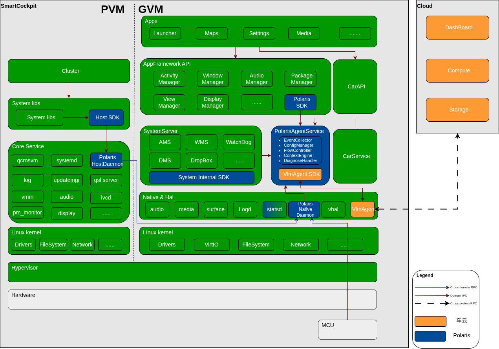

+++
date = '2025-12-24T17:17:50+08:00'
draft = true
title = '智能座舱端云一体性能与稳定性平台 (Polaris 1.0) 系统设计文档'
+++

# 智能座舱端云一体性能与稳定性平台 (Polaris 1.0) 系统设计文档

## 版本信息

| 序号 | 版本 | 修订内容 | 状态 | 修订人 | 日期 |
| --- | --- | --- | --- | --- | --- |
|1|0.1|First draft||操权力|2025/12/31|

## 文档目的

本文档旨在全面定义 智能座舱端云一体性能与稳定性平台 (代号 Polaris 1.0) 的系统架构、功能需求及实施路径。本文档将服务于以下核心场景：
- 管理层决策：清晰阐述项目背景、痛点、目标及资源需求，作为立项审批与资源调度的依据。
- 跨部门协同：作为座舱平台部与车云平台部沟通数据协议、接口规范及边界划分的“蓝本”，确保端云技术方案的一致性。
- 工程落地指导：作为项目启动后的核心输入，指导研发团队进行端侧 Agent 开发、埋点设计及测试验收。
  
## 背景与问题定义

### 背景

当前智能座舱的数据建设存在数据维度失衡与底层感知缺失的问题，具体表现在以下三个方面：
- 应用质量量化手段缺失：目前虽已具备应用层的业务埋点能力（如页面点击流），能支撑产品运营分析；但对于应用技术质量（如 Crash率、ANR率）及 核心性能指标（如启动耗时、页面响应延迟）尚缺乏系统性的监控与度量手段，导致软件交付质量缺乏客观数据支撑。
- 平台侧缺乏云端可观测性：作为座舱底座的平台研发部门，目前缺乏专属的云端观测平台。对于线上车辆的系统级健康度（如 SystemServer 重启、关键服务存活、资源水位），研发团队缺乏实时获取线上运行时状态的能力，往往只能在故障发生后进行被动回溯。
- 系统稳定性保障体系亟待构建：随着智能座舱软件规模与复杂度的提升，单纯依赖线下测试已难以覆盖所有边缘场景。为了保障用户体验，亟需构建一套严谨的、标准化的端云一体性能与稳定性监控平台，实现对线上真实运行质量的精准监测与闭环管理。

### 当前痛点

| 痛点 | 描述 | 业务影响 |
|---|---|---|
| 跨端故障排查成本较高 | 当前缺乏跨端（Android-Linux-MCU）的自动化关联数据，面对复杂的跨域交互问题，排查过程往往需要人工拼接多端日志。 | 研发效率受限：故障定位往往需要多方协同与多次排查，拉长了问题的解决周期。 |
| 性能量化数据覆盖不足 | 现有的性能评估主要依赖线下测试或有限样本，缺乏全量用户场景下的启动速度、流畅度等自动化量化数据。 | 版本评价受限：难以精确捕捉版本迭代中的细微性能波动，线上实际体验的评估数据不够丰满。 |
| 偶发异常现场回溯困难 | 对于线上偶发的非必现问题，目前主要依赖事后尝试复现，缺乏异常发生瞬间的自动“快照”捕获机制。 | 闭环周期较长：部分偶发性稳定性问题（如随机黑屏、卡顿）因缺乏现场数据支持，难以快速彻底根除。 |
| 资源效能优化缺乏支撑 | 缺乏进程级的 CPU、内存、IO 历史趋势画像，在进行精细化资源管控时缺乏足够的数据颗粒度。 | 性能与稳定性优化方向不精准，缺乏线上真实数据的量化支撑；前期硬件资源规划不精准，主要依赖线下模拟环境或经验值。 |


## 目标与范围

### 项目目标

本项目旨在基于 “端侧深度探针 + 云端聚合分析 + 全链路追踪” 的技术理念，构建 Polaris 1.0 端云一体化平台，实现以下三个核心目标：
1. 全链路可观测：打破 Android、Linux Host、MCU 的数据孤岛，建立统一的 全局事件标准 (Global Event ID)，将分散在不同系统的故障与状态数据聚合至同一平台，实现跨端事件的追踪，为后续的可视化链路分析奠定数据基础。
2. 故障现场自动聚合与关联：突破现有“日志碎片化”及“事后拉取不全”的局限。建立 “事件驱动” 的现场快照机制，在异常发生瞬间，自动聚合与该事件强相关的全维度上下文信息（如 Trace、系统 Log、进程状态等）并生成完整的故障证据包。这不仅实现了 Event 与 Log 的精准索引，更确保了现场信息的完整性，能有效解决因关键日志缺失导致无法定位的难题。
3. 数据驱动治理：建立系统级的性能与稳定性基线，通过量化数据驱动版本质量改善与硬件资源优化，将质量管理从“定性”转向“定量”。

### 核心 KPI 指标

| 维度 | 指标名称 | 目标值 (示例) | 说明 |
|---|---|---|---|
| 稳定性 | 故障主动捕获率 | > 90% | 指系统发生崩溃（如 SurfaceFlinger Crash）、重启后，平台能自动感知识别，无需依赖用户反馈。 |
| 诊断效率 | 故障取证自动化率 | 100% | 针对严重异常事件，实现 Event 与 Log 的自动关联，确保研发直接获取现场数据。 |
| 性能体验 | 核心页面流畅度检测达标率 | > 95% | 监测核心 App 在全量车辆中的掉帧情况，量化用户感知的卡顿程度。 |
| 资源能效 | 高功耗场景识别产出 | TOP 5/季度 | 识别并输出高资源占用的异常场景，支撑性能治理。 |


### 项目范围

#### 范围内

1. 端侧全栈感知体系：
  - Android 深度探针：构建系统级监控服务 PolarisAgentService，实现对应用生命周期、核心服务状态、底层资源（CPU/Memory/IO/Binder）的全维度深度监听。
  - Linux/MCU 异构覆盖：建设 Linux Host 侧的系统健康守护进程，负责关键服务（Service）存活检测与系统指标采集；适配 MCU 通信协议，实现异构芯片间的故障透传。
  - 边缘智能处理：在端侧实现数据的预处理与清洗，包含事件聚合、流控防爆、日志现场的智能截取与压缩，减轻车云带宽压力。
  - 标准化基础设施：建立《全局事件注册表》及自动化工具链，统一多端的数据定义与协议标准。
2. 云端分析能力需求:
  - 元数据管理能力：要求云端支持同步《全局事件注册表》，实现对上报事件的自动化解析、分类与标签化管理。
  - 自动化关联引擎：要求云端具备 “事件-日志” 自动匹配能力，将结构化的 Event 数据与非结构化的 Log 文件在存储层自动关联，形成完整的故障证据包。
  - 趋势与模式识别：要求云端支持基于时间窗口的聚合计算，能够显示异常爆发趋势及性能指标（CPU/内存/IO）的长期演进趋势。
3. 可视化与运营平台
  - 数字化质量驾驶舱：建设多维度的质量仪表盘（Dashboard），支持按版本、车型、时间段分析千车故障率、性能基线达标率。
  - 智能排查工作台：提供“一站式”问题分析界面，支持通过 EventID/TraceID 检索故障，直接浏览关联的日志及设备状态，支持远程诊断指令的下发与结果展示。

#### 范围外

1. 可视化的全链路拓扑分析：1.0 阶段聚焦于跨端链路数据的 标准化采集与逻辑串联，优先夯实数据底座能力；全链路图形化的调用链拓扑展示规划在后续版本迭代中实现。
2. 业务代码修复：Polaris 平台负责精准“定位”并“指派”问题，不负责 具体业务 APP 内部的代码逻辑修复。
3. 交互体验设计：本项目专注于性能数据的量化，不包含 HMI 界面（UI/UE）的主观交互设计与优化。

## 业务流程与核心场景

### 角色定义

| 角色 | 主要工作 | 关注点 |
|---|---|---|
| 研发工程师 | 接收告警，分析堆栈与日志，修复 Bug；针对疑难客诉问题，远程下发特定诊断指令 | 故障堆栈的完整性，日志关联的准确性，是否需要补充更多运行时信息。 |
| 质量工程师 | 配置告警阈值，监控线上大盘水位，识别版本质量风险 | 故障率趋势是否劣化，性能指标是否符合预期。 |
| 产品经理 | 查看应用活跃度与性能体验趋势 | 核心功能的响应速度趋势，用户使用过程中的卡顿频率。 |


### 核心作业流程图

1. 故障主动发现闭环流程:描述从异常发生到研发接入的处理路径
  - 捕获 (Capture): Polaris Agent 监听到异常（如 ANR），记录运行时状态，抓取 Trace/Logcat，并生成唯一 EventID。
  - 处理 (Process): 端侧进行流量控制检查，通过 logf 索引将 Event 与 Log 文件进行逻辑组合。
  - 上报 (Report): Event 数据实时上报，大文件 Log 在网络空闲时段异步上传（支持云端按需拉取）。
  - 通知 (Notify): 云端检测到异常数据，向 责任模块负责人 发送通知。
  - 分析 (Analyze): 研发工程师查看通知，进入平台查看关联的上下文数据，确认问题根因并修复。
2. 疑难问题排查流程:描述针对复杂客诉处理路径
  - 检索: 研发工程师在平台输入车辆 VIN 码或 EventID 检索相关记录。
  - 查看: 系统展示该事件的发生时间、设备信息、以及已自动关联的 Log 文件下载链接。
  - 诊断: 针对区域技术支持无法处理的复杂客诉，若现有日志不足以定位，研发工程师 通过控制台下发诊断指令，端侧执行后回传结果，以获取更深度的运行时信息。

### 典型用户故事

#### 场景一：风险预警

背景: 某车型灰度推送 v1.5 OTA 版本。
事件: 上线 24 小时内，Polaris 平台监测到 GVM_SYS_STORAGE_LOW（磁盘空间不足）事件在特定批次车辆上的上报。
行动:
1. 平台自动触发 风险预警，即时通知研发负责人。
2. 研发工程师通过平台获取存储分布数据，精准定位到某应用私有目录占用空间急剧膨胀。
3. 分析: 结合自动关联采样的 Log，确认该应用在特定异常分支下陷入数据库高频重复写入死循环。
4. 结果: 研发团队在磁盘被完全耗尽导致系统挂死（System Hang）前，紧急输出修复补丁并推送 OTA，成功拦截了批量重大事故。

#### 场景二：稳定性治理

背景: 某应用发布 v2.0 灰度版本。
事件: 灰度发布期间，平台监测到应用出现偶发性 GVM_APP_ANR（无响应）告警，且线下测试难以复现。
行动:
1. 研发工程师点击告警详情，查看聚合后的故障样本。
2. 系统已通过 logf 字段自动关联了故障时刻 perflog (性能日志)。
3. 分析: 工程师通过日志文件发现应用主线程阻塞在 Binder IPC 调用中；进一步联合分析 perflog，定位到是对端 Service 在高并发场景下因锁竞争导致处理耗时过长，拖累了客户端。
4. 结果: 确认根因为服务端卡顿。研发工程师针对服务端逻辑进行异步化优化，彻底解决了这一隐蔽的跨进程阻塞问题。

#### 场景三：性能监控

背景: 某版本上线后，产品经理关注核心应用在复杂交互场景下的滑动流畅度。
事件: Polaris 仪表盘显示 GVM_APP_JANK (掉帧/卡顿) 指标出现劣化趋势。
行动:
1. 查询掉帧期间主线程的MessageQueue事件。
2. 发现: 在卡顿发生的时间段内，主线程 MessageQueue 待处理消息数量显著激增。
3. 分析: 研发工程师通过分析采集到的 Looper 统计数据，发现是一次性加载过多列表项导致并在主线程频繁 Post UI 刷新消息，引发主线程消息队列积压，从而阻塞了渲染信号（Vsync）的处理。
4. 结果: 研发工程师引入消息合并与节流机制，消除了主线程拥堵，恢复了滑动流畅性。

#### 场景四：远程指令下发

背景: 用户反馈方控按键（下一曲）失效，或错误地控制了不显示在屏幕上的后台音乐应用，常规 Logcat 无法体现系统内部的分发逻辑。
行动:
1. 研发工程师怀疑是 MediaSession 焦点抢占或状态同步异常。
2. 工程师通过 Polaris 控制台，向目标车辆下发 dumpsys media_session 指令。
3. 分析: 回传的诊断结果显示，Media button session 仍被后台应用 com.reachauto.clouddesk 占用（尽管其状态为 active=false），导致按键事件未正确分发给前台亮屏的com.tencent.wecarflow。
4. 结果: 确认根因是后台应用未正确释放焦点，研发工程师将 Bug 准确指派给相关应用团队，无需现场抓包。

## 需求拆解

本章节将 Polaris 1.0 平台的核心需求拆解为四大关键能力域。这些能力定义了系统的边界与核心价值，是后续详细功能设计的基础。
本章节采用能力域拆解方法，以系统应具备的核心能力为中心，每一能力域仅定义目标、适用范围与责任边界，不涉及接口设计、数据结构或技术选型细节。具体功能点将在后续《功能性需求》中展开，质量与约束要求将在《非功能性需求》中统一定义。

### 稳定性全栈感知能力

**目标**：构建覆盖 Android 应用层、系统框架层以及 Linux Host/MCU 异构计算单元的异常捕获体系，实现全栈、全维度的故障感知与现场数据留存。

| 能力名称 | 能力描述与目标 | 适用范围 | 责任边界 |
| --- | --- | --- | --- |
| **应用层稳定性监控**| **描述**：具备对 Android **应用层 (APK)** 致命异常的实时监测能力。涵盖 Java Crash、App Native Crash (JNI)、ANR 及 App OOM；在异常触发时同步执行现场冻结与堆栈抓取。<br>**目标**：确保应用级崩溃能被捕捉和上报。 | Android Framework<br>Third-party Apps<br>System Apps (Launcher等) | **负责**：捕获应用堆栈、页面栈及进程状态；<br>**不负责**：分析应用内部具体的业务逻辑错误。 |
| **系统框架稳定性监控**| **描述**：具备对 **Android 核心服务**及**关键守护进程**的存活状态监测能力；识别系统级资源耗尽风险（如 Binder 耗尽、句柄泄漏、LMK）。<br>**目标**：准确识别 SystemServer 死锁 (Watchdog)、核心服务崩溃、系统异常重启及严重资源拥堵事件。 | SystemServer<br>Binder Driver<br>Native Daemons (SurfaceFlinger等) | **负责**：识别导致系统不稳定的服务异常和资源瓶颈；<br>**不负责**：介入 Linux Kernel 内部调度机制的调试。 |
| **异构运行环境监控**<br>(Heterogeneous Env Monitoring) | **描述**：具备对 **Linux Host (PVM)** 及 **MCU** 运行状态的独立监测能力。通过 Native Daemon 标准化采集 Linux 侧服务状态、系统重启事件以及 MCU 侧的心跳与硬件故障码。<br>**目标**：实现对底层虚拟化环境与硬件外设健康状况的统一视图监控。 | Linux Host (PVM)<br>MCU<br>Hypervisor | **负责**：异构数据的标准化接入、协议对齐及状态监测；<br>**不负责**：异构系统内部具体业务逻辑的监控实现。 |


### 性能与资源度量能力

**目标**：建立可量化的性能基线，从“主观体验”转向“客观数据”，实现对计算资源（CPU/Mem/IO）及系统启动效率的精细化审计。

| 能力名称 | 能力描述与目标 | 适用范围 | 责任边界 |
| :--- | :--- | :--- | :--- |
| **交互体验量化**| **描述**：具备对用户核心交互体验的监测能力。重点涵盖**应用启动耗时**、**主线程健康度 (MessageQueue)** 以及**界面流畅度 (FPS/Jank)**。<br>**目标**：量化 App 启动速度，识别主线程阻塞与掉帧现象。 | Top 核心应用<br>Launcher<br>SystemUI | **负责**：采集启动耗时、MessageQueue 调度延迟及绘制帧率；<br>**不负责**：应用页面内部的数据加载逻辑。 |
| **资源水位画像**| **描述**：具备对**进程级**资源消耗（CPU使用率、内存占用、IO吞吐量、句柄数）的周期性采样与 TOP 排行识别能力。<br>**目标**：识别**高资源消耗进程**与内存/句柄泄漏，绘制 24h 资源趋势图。 | Android GVM 进程<br>Native 守护进程 | **负责**：资源数据的统计、归因与异常阈值判定；<br>**不负责**：操作系统的资源调度策略 (Scheduler)。 |
| **系统级性能监控**| **描述**：具备对**操作系统级**关键性能指标的监测能力，重点涵盖系统启动耗时及磁盘整体负载。<br>**目标**：确保座舱冷启动（Cold Boot）时间达标，监控存储设备寿命与性能衰减。 | Android Boot Process<br>Storage Device (UFS/eMMC) | **负责**：各启动阶段（BootLoader/Kernel/UserSpace）的耗时分解；<br>**不负责**：缩短硬件初始化时间。 |


### 现场还原与协同能力

**目标**：解决“有报警无日志”的痛点，构建端云协同的自动化取证与远程诊断通道。

| 能力名称 | 能力描述与目标 | 适用范围 | 责任边界 |
| --- | --- | --- | --- |
| **标准化事件协议体系** | **描述**：基于《全局事件注册表》构建统一的事件定义、序列化与解析能力。<br>**目标**：确保端侧上报数据与云端解析引擎的语义一致性，支持协议动态扩展。 | 端侧 Agent, 车云 SDK, 云端解析服务 | 负责协议的定义与维护工具链；不限制业务 Payload 的具体内容。 |
| **智能现场快照** | **描述**：具备“事件驱动”的自动化日志聚合能力，在异常发生瞬间关联并打包 Trace、Logcat 及系统状态信息。<br>**目标**：实现 Event 与 Log 文件的 1:1 精准索引。 | 本地日志系统, 文件系统 | 负责日志的定位、截取与压缩；不负责日志内容的语义分析。 |
| **远程诊断执行** | **描述**：具备安全可控的云端指令接收与本地执行能力，支持下发 Shell 脚本或调试命令。<br>**目标**：在不打扰用户的前提下获取更深度的运行时信息。| Shell 环境, Debug 接口 | 负责指令通道的建立与执行结果回传；严禁执行未授权的高危写操作，不支持批量执行、默认灰度单车、需显式授权、强审计。  |

### 数据智能与运营能力

**目标**：将海量原始数据转化为可行动的洞察（Actionable Insights），支撑研发与质量团队的决策。

| 能力名称 | 能力描述与目标 | 适用范围 | 责任边界 |
| --- | --- | --- | --- |
| **端云数据自动关联** | **描述**：具备在海量存储中，根据索引自动将结构化事件与非结构化日志文件进行绑定的能力。<br>**目标**：消除人工查找日志的成本。 | 云端存储层 | 负责数据的逻辑关联与存储生命周期管理。 |
| **实时风险预警** | **描述**：具备基于时间窗口的流式计算能力，识别线上故障的爆发趋势并触发告警。<br>**目标**：实现故障感知。 | 计算引擎| 负责告警策略的计算与推送；不负责告警后的工单流转。 |
| **多维质量可视化** | **描述**：具备多维度（版本/车型/时间/地区）的数据聚合与图表展示能力。<br>**目标**：提供从“宏观大盘”到“微观个案”的钻取分析视图。 | 数据仓库, 可视化前端 | 负责数据的可视化呈现。 |


## 系统总体方案

### 总体设计概述

Polaris 1.0 基于 Hypervisor 虚拟化架构 设计，旨在构建跨越 GVM (Android)、PVM (Linux) 及 MCU 的端云一体化全栈监控系统。
系统采用 分层架构 与 模块化服务设计。在控制面上，通过 注册表驱动机制实现业务埋点定义与底层采集逻辑的解耦；在数据面上，通过 双守护进程机制打通异构芯片与系统的通信壁垒。系统将计算能力前置至端侧，通过 PolarisAgentService 实现数据的实时清洗、流控与现场关联，仅将高价值的结构化数据与诊断日志同步至云端。

### 系统总体架构图



### 架构分层详解

#### 业务应用与接口层

本层负责定义数据采集的标准接口，通过自动代码生成技术屏蔽底层通信细节：
- Polaris SDK: 面向上层业务应用（如 Launcher, Maps）。该组件由《全局事件注册表》编译生成，提供强类型的事件对象封装与校验逻辑，负责将业务数据序列化并传递给 Framework 层。
- System Internal SDK: 面向 SystemServer 内部服务（如 AMS, WMS），专门用于系统关键服务内部的插桩（Instrumentation），以捕获服务级异常与状态变更。
- Host SDK: 面向 PVM 侧的 Linux 应用程序（如 Cluster HMI）、系统核心服务，提供 C++ 标准上报接口，负责将 PVM 侧业务数据发送至 Host Daemon。

#### 框架传输与核心服务层

本层位于 Android GVM，是数据汇聚、策略执行与处理的核心区域：
- Polaris SDK (Framework API): 部署于 AppFramework API 层。作为系统级的传输接口实现，它承接来自上层业务的调用请求，并维护与PolarisAgentService的 IPC 通信链路，确保数据的可靠投递。
- PolarisAgentService: 常驻系统服务，内部包含五个核心功能模块：
  - EventCollector: 统一接入模块。作为 Binder 服务端接收 Polaris SDK 请求；同时作为 LocalSocket 客户端，在服务启动时主动连接 Native Daemon 建立长连接通道，并通过后台线程实时拉取 Native 侧上报的事件流。
  - ConfigManager: 配置管理模块。负责加载本地注册表文件的配置，解析采样率、阈值及采集开关策略。
  - FlowController: 流量控制模块。对输入事件进行频率限制，防止异常爆发导致系统资源耗尽。
  - ContextEngine: 现场聚合模块。在事件通过流控后，负责生成唯一 EventID，挂载系统时间戳，并根据事件类型关联 Logcat、Trace 文件及进程快照，生成索引信息。
  - DiagnoseHandler: 诊断执行模块。负责校验并执行来自云端的诊断指令（Shell Command），并管理执行结果的回传。

#### 原生与异构跨域层

本层负责 Android底层环境、PVM环境监测以及跨虚拟机通信：
- Polaris Native Daemon (GVM):
  - 本地采集: 负责监控 Native 进程崩溃（Tombstone）、系统资源、及 HAL 层状态。
  - 跨域网关: 作为 GVM 侧的通信端点，维护与 PVM/MCU 的连接，接收跨域透传的数据。
- Polaris Host Daemon (PVM):
  - 宿主监控: 负责监控 PVM 侧的 systemd 服务状态、关键驱动状态及虚拟机管理服务（qcrosvm/VMM）。

#### 传输通道与云平台

- VlmAgent: 统一传输网关。作为端侧唯一的数据出口，负责接收来自 PolarisAgentService 的结构化事件,以及日志文件（按需拉取），执行事件、文件上传云端。同时也负责接收云端下发指令，透传指令给 PolarisAgentService。
- Cloud Platform: 负责数据的计算、存储与可视化。

### 核心设计原则

1. 进程级隔离与服务化：PolarisAgentService 设计为独立系统进程，而非 SystemServer 的内部线程。这种设计带来了两大优势：
  - 稳定性：监控服务的异常（如 OOM）不会导致系统核心服务（SystemServer）崩溃，反之亦然。
  - 高性能：独立的进程空间避免了与 AMS/WMS 争抢主线程资源，确保了监控逻辑的独立调度。
2. 系统核心即客户端：确立 SystemServer 在监控体系中的 Client 身份。AMS、WMS 等核心服务通过 System Internal SDK，以跨进程调用（IPC）的方式向 Polaris 上报数据。这种“旁路监控”模式确保了对系统原有逻辑的最小侵入。
3. 异构接入抽象化：针对 MCU 等异构单元，系统采用 "HAL 适配 + Daemon 统一采集" 的接入原则。不强依赖特定的物理连接方式，而是通过 Native 层的适配层屏蔽硬件连接差异，确保架构在不同车型硬件拓扑下的通用性与兼容性。

## 功能性需求

### 稳定性全栈感知能力

#### 应用层稳定性监控

##### FR-STAB-001 应用 Java 崩溃 (Java Crash) 捕获

| 属性 | 内容 |
| --- | --- |
| **优先级** | P0 |
| **前置条件** | 1.系统层已部署全局监控探针。<br>2. 监控功能的配置开关处于开启状态。 |
| **输入** | **触发源**：<br>应用运行环境（Android Runtime）抛出的**未捕获异常信号**（Uncaught Exception）。<br>**数据**：<br>1. 异常堆栈信息（StackTrace）。<br>2. 异常类型与描述消息（Exception Message）。 |
| **处理逻辑** | 1. **异常拦截**：<br>在应用进程因异常即将终止前，拦截异常信号，挂起当前线程以确保有足够的 CPU 时间片执行数据采集。<br>2. **上下文捕获**：<br>提取崩溃时刻的运行时环境信息，包括但不限于：<br> - 进程名称、线程名称及 ID。<br> - 应用的前后台状态。<br> - 当前 Activity 页面栈信息（用于还原用户路径）。<br>3. **流控策略**：<br>执行本地频次控制策略。检查该进程在设定时间窗口（如 10 分钟）内的崩溃次数，若超限则降级处理（仅记录统计计数，不抓取详细堆栈），防止日志写入引发 IO 阻塞。<br>4. **透传退出**：<br>数据采集完成后，**必须**将异常信号交还给系统默认处理程序，确保应用能够按照 Android 系统规范正常退出，防止应用界面假死或进程僵滞。 |
| **输出** | 1. **结构化事件**：生成包含完整上下文信息的 `GVM_APP_CRASH` 事件对象。<br/>2. **本地日志**：在本地持久化存储区保留一份异常日志备份（作为兜底）。 <br/>3. 结构化事件以及本地日志存储目录参考《Polaris 1.0 全局事件ID与注册表规范》|

##### FR-STAB-002 应用无响应 (ANR) 捕获

| 属性 | 内容 |
| --- | --- |
| **优先级** | P0 |
| **前置条件** | 1. 系统层已部署全局监控探针。<br>2. 监控功能的配置开关处于开启状态。 |
| **输入** | **触发源**：系统框架层（Framework）识别到的**应用无响应信号**（AppNotResponding）。<br>**数据**：<br>1. 目标应用进程标识（PID/ProcessName）。<br>2. 系统生成的**堆栈跟踪文件**（Trace File，通常位于 `/data/anr/` 目录）。 |
| **处理逻辑** | 1. **信号识别**：<br>实时接收系统 ActivityManagerService 发出的 ANR 通知。<br>2. **目标过滤**：<br>根据配置白名单判断是否采集该进程，过滤非关注应用的 ANR 事件。<br/>3. **堆栈截取**：<br>读取系统生成的 Trace 文件，根据目标 PID **精准截取**该进程及其子线程的堆栈片段（需剔除文件中的其他无关进程数据，以减少数据体积）。<br>4. **快照关联**：<br>获取 ANR 发生时刻的系统负载信息（Load Avg / CPU Usage / IO Wait）并与堆栈信息打包。<br>5. **流控策略**：<br>执行本地频次控制策略。检查该进程在设定时间窗口（如 10 分钟）内的 ANR 次数，若超限则仅记录计数，不再执行堆栈截取操作。 |
| **输出** | 1. **结构化事件**：生成包含 Trace 附件索引（Reference）的 `GVM_APP_ANR` 事件对象。<br>2. **本地日志**：在本地持久化存储区生成关联的证据包（包含截取的 Trace 片段与系统负载快照）。<br>3. 结构化事件以及本地日志存储目录参考《Polaris 1.0 全局事件ID与注册表规范》 |


##### FR-STAB-003 应用 Native 库崩溃 (App JNI Crash) 捕获

| 属性 | 内容 |
| :--- | :--- |
| **优先级** | P0 |
| **前置条件** | 1. 系统层已部署全局监控探针（Native Daemon）。<br>2. 监控功能的配置开关处于开启状态。 |
| **输入** | **触发源**：<br>应用进程（APP）加载的 JNI 动态库触发致命信号（SIGSEGV/SIGABRT）。<br>**数据**：<br>1. 系统生成的 Tombstone 崩溃文件（通常位于 `/data/tombstones/`）。<br>2. 进程退出信号（Signal Code）。 |
| **处理逻辑** | 1. **监听与解析**：<br>实时监听系统 Tombstone 文件的生成事件，读取文件头部信息。<br>2. **身份识别**：<br>检查崩溃进程的 UID 或进程名称。若属于**非系统核心进程**（即普通 App），则执行应用级采集逻辑；若为系统服务则忽略（交由系统框架监控处理）。<br>3. **指纹去重**：<br>基于“应用名称 + 崩溃堆栈关键帧”生成唯一指纹，在端侧聚合重复的崩溃事件，防止日志风暴。<br>4. **事件生成**：<br>将非结构化的 Tombstone 数据转换为标准化的事件对象。 |
| **输出** | 1. **结构化事件**：生成 `GVM_APP_NATIVE_CRASH` 事件对象。<br>2. **本地日志**：建立事件 ID 与原始 Tombstone 文件的索引关联。<br>3. 结构化事件以及本地日志存储目录参考《Polaris 1.0 全局事件ID与注册表规范》 |


##### FR-STAB-004 应用 OOM (App OOM) 事件监控

| 属性 | 内容 |
| :--- | :--- |
| **优先级** | P0 |
| **前置条件** | 1. 系统层已部署全局监控探针。<br>2. 监控功能的配置开关处于开启状态。<br>3. 具备获取应用进程退出详细原因的能力（如 ApplicationExitInfo 或类似机制）。 |
| **输入** | **触发源**：<br>应用进程**意外终止信号**。<br>**数据**：<br>1. 进程退出原因描述（Exit Reason，需区分系统回收/异常崩溃）。<br>2. 进程终止前的内存使用统计数据（如 PSS/RSS/VSS）。 |
| **处理逻辑** | 1. **原因甄别**：<br>在进程退出后，识别退出原因。准确区分是**系统低内存查杀 (LMK)**（通常表现为 `REASON_LOW_MEMORY`）还是**Java 堆内存耗尽**（通常表现为 `OutOfMemoryError` 导致的 Crash）引发的异常。<br>2. **内存快照回溯**：<br>尝试关联该进程在终止前最近一次采集的内存统计数据（如 PSS/RSS），以辅助判断是否存在内存泄漏。<br>3. **风暴抑制**：<br>针对前台应用因 OOM 导致的反复重启进行检测。若同一应用在短时间内（如 5 分钟）连续触发 OOM，则实施指数退避策略，减少上报频次。<br>4. **事件生成**：<br>组装 OOM 事件负载，标记明确的 OOM 类型（System LMK / Java OOM）。 |
| **输出** | 1. **结构化事件**：生成包含内存快照信息的 `GVM_APP_OOM` 事件对象。<br>2. **本地日志**：记录关联的系统内存水位信息（MemInfo）。<br>3. 结构化事件以及本地日志存储目录参考《Polaris 1.0 全局事件ID与注册表规范》 |


#### 系统框架稳定性监控

##### FR-STAB-005 SystemServer Watchdog (死锁) 监控

| 属性 | 内容 |
| :--- | :--- |
| **优先级** | P0 |
| **前置条件** | 1. 监控探针已植入系统看门狗（Watchdog）模块或具备监听能力。<br>2. 监控功能的配置开关处于开启状态。 |
| **输入** | **触发源**：<br>系统关键锁或核心线程（如 UI Thread, IoThread）**等待超时信号**（通常阈值为 60秒）。<br>**数据**：<br>1. 阻塞线程的完整堆栈信息（Stack Traces）。<br>2. 持锁状态与锁竞争信息（Lock Contention）。 |
| **处理逻辑** | 1. **重启前拦截**：<br>在系统触发看门狗复位（Soft Reboot / Restart）流程前，优先执行监控逻辑，确保有短暂的时间窗口进行数据转存。<br>2. **现场固化**：<br>立即将当前的系统全量线程堆栈（Traces.txt）复制或转存至持久化存储区，**防止系统重启过程清理现场文件**，导致关键证据丢失。<br>3. **异常标记**：<br>在磁盘特定位置写入“非正常重启”标志位（Flag），以便系统下次启动时进行归因统计，区分正常关机与异常重启。<br>4. **事件上报**：<br>尝试通过 Native 通道（因为 Java 层可能已挂死）发送死锁事件。 |
| **输出** | 1. **结构化事件**：生成包含死锁堆栈索引的 `GVM_SYS_WATCHDOG` 事件对象。<br>2. **本地日志**：在持久化目录保留死锁现场的 Trace 文件。<br>3. 结构化事件以及本地日志存储目录参考《Polaris 1.0 全局事件ID与注册表规范》 |

##### FR-STAB-006 Android 系统(SystemServer)异常重启监控

| 属性 | 内容 |
| :--- | :--- |
| **优先级** | P0 |
| **前置条件** | 1. 系统完成启动初始化流程（Boot Completed）。<br>2. 具备读取系统启动属性（Boot Reason）及持久化存储的权限。 |
| **输入** | **触发源**：<br>系统**启动完成广播** (Boot Completed) 或同等时机的初始化信号。<br>**数据**：<br>1. 系统启动原因属性（如 `sys.boot.reason` 或 `ro.boot.bootreason`）。<br>2. 持久化存储中的**历史状态标记**（包含上一次启动时间戳、Watchdog/Crash 遗留的异常标志位）。 |
| **处理逻辑** | 1. **原因推断**：<br>对比本次启动原因与上一次运行状态进行逻辑仲裁：<br> - **已知异常**：若存在 Watchdog 或 Core Crash 遗留的标记，判定为对应的系统级故障重启。<br> - **内核恐慌**：若启动属性标识为 Kernel Panic 或 WDT（硬件看门狗），判定为内核级重启。<br> - **正常重启**：若标识为用户主动关机、OTA 升级或常规电源管理操作，判定为正常重启。<br> - **掉电/未知**：若无任何异常标记且非正常重启，判定为异常掉电或未知原因重启。<br>2. **时长计算**：<br>基于上一次记录的启动时间戳，计算上一次系统正常运行的时长（Uptime），用于评估系统平均无故障时间（MTBF）。<br>3. **状态重置**：<br>分析完成后，清除历史异常标记，更新本次启动时间戳，为下一次监控周期做准备。 |
| **输出** | 1. **结构化事件**：生成包含重启原因分类（Category）及运行时长（Duration）的 `GVM_SYS_RESTART` 事件对象。<br>2. 结构化事件以及本地日志存储目录参考《Polaris 1.0 全局事件ID与注册表规范》 |

##### FR-STAB-007 全路径系统重启归因监控

| 属性 | 内容 |
| :--- | :--- |
| **优先级** | P0 |
| **目标** | 建立跨越 Host、GVM、Kernel、Framework 四层架构的重启感知能力，提供统一的重启归因数据源。 |
| **前置条件** | 1. 监控服务具备获取 Hypervisor 状态及 SOC 硬件复位标志的权限。<br>2. 已集成 **FR-STAB-006** 的 Android 内部重启判定结果。 |
| **处理逻辑** | 1. **全路径层次判定**：<br>系统启动后，根据硬件寄存器、Bootloader 传参及 Android 属性进行综合仲裁，确定重启发生的最高级别：<br> - **Linux Host层**：检测到 SOC 硬件复位或宿主机 Kernel Panic，判定为 Host 重启。<br> - **GVM层**：Host 未重启，但虚拟机管理器（Hypervisor）强制拉起 Android 域，判定为 GVM 重启。<br> - **Android Kernel层**：基于 **FR-STAB-006** 判定，若为内核崩溃且 GVM 未重启，归类于此层。<br> - **Android Framework层**：仅 SystemServer 进程重启，底层 Linux 内核连续运行，归类于此层。<br>2. **异常分类同步**：<br> - 读取 `sys.boot.reason.last` 等关键属性，识别是 [异常:死锁/崩溃/掉电] 还是 [正常:用户重启/OTA]。 |
| **输出** | 1. **结构化事件**：`GVM_SYSTEM_REBOOT_EVENT` <br> - **boot_reason**: 原始启动原因字符串<br> - **is_unexpected**: 布尔值，用于云端统计严重故障率。<br>2. 关联日志路径及 ID 注册参考《Polaris 1.0 全局事件ID与注册表规范》。 |

##### FR-STAB-008 核心服务崩溃监控

| 属性 | 内容 |
| :--- | :--- |
| **优先级** | P0 |
| **前置条件** | 1. 监控进程具备监听系统服务管理器（ServiceManager）或 init 进程状态的能力。<br>2. 核心进程白名单配置已加载。 |
| **输入** | **触发源**：<br>1. Native 守护进程崩溃产生的 Tombstone 文件。<br>2. ServiceManager 发出的 `DeathRecipient` 通知。<br>3. init 进程发出的 `SIGCHLD` 信号。<br>**数据**：<br>1. 崩溃进程名称（Process Name）及 PID。<br>2. 进程退出状态码或终止信号。 |
| **处理逻辑** | 1. **核心识别**：<br>匹配崩溃进程名称是否在**核心白名单**中（如 `surfaceflinger`, `audioserver`, `netd`, `lmkd`）。若不在白名单，则视为普通 Native Crash 处理（参考 FR-STAB-003）。<br>2. **多源仲裁**：<br>优先使用 Tombstone 信息（包含详细堆栈），若未生成 Tombstone（如被系统强杀或 Watchdog 处决），则使用 ServiceManager 通知作为补充来源。<br>3. **等级判定**：<br>根据服务重要性标记故障等级（例如 SurfaceFlinger 崩溃标记为“致命”，会导致屏幕黑屏或系统软重启）。<br>4. **事件生成**：<br>组装核心服务崩溃事件，记录服务名称、崩溃时间及退出原因。 |
| **输出** | 1. **结构化事件**：生成包含服务名及影响等级的 `GVM_CORE_CRASH` 事件对象。<br>2. **本地日志**：关联该时间点附近的系统日志（Logcat）与崩溃堆栈。<br>3. 结构化事件以及本地日志存储目录参考《Polaris 1.0 全局事件ID与注册表规范》 |

##### FR-STAB-009 系统低内存 (LMK) 事件监控

| 属性 | 内容 |
| :--- | :--- |
| **优先级** | P0 |
| **前置条件** | 1. 系统启用 Low Memory Killer 机制（如 Userspace LMKD）。<br>2. 监控组件具备接收系统内存管理模块通知的权限。 |
| **输入** | **触发源**：<br>系统内存管理守护进程（lmkd）执行的**进程查杀动作**。<br>**数据**：<br>1. 目标进程信息（PID、UID、Process Name）。<br>2. 查杀时的决策依据（OOM Score Adj）。<br>3. 触发查杀时的系统内存压力状态（Memory Pressure State / PSI）。 |
| **处理逻辑** | 1. **动作捕获**：<br>实时感知 LMK 的查杀行为。**推荐方案**：采用源码插桩（Instrumentation）方式，在 `lmkd` 执行 kill 操作的原子逻辑处植入通知钩子，以获取零延迟、高精度的上下文信息；（备选方案：监听 EventLog 中的 `lmk_kill` 标签）。<br>2. **水位快照**：<br>同步记录系统当前的内存水位详情（MemTotal, MemFree, SwapUsed, Cached），用于后续分析是物理内存耗尽还是虚拟内存（Swap）耗尽。<br>3. **聚合去噪**：<br>执行时间窗口聚合策略。由于内存压力常导致短时间内连续查杀多个进程，需将同一压力波峰内（如 1 秒）的一组查杀事件聚合，避免产生告警风暴。<br>4. **严重性判定**：<br>识别被杀进程的类型。若被杀进程为前台可见应用或关键服务，标记为“高影响”事件。 |
| **输出** | 1. **结构化事件**：生成包含被杀进程列表及内存水位的 `GVM_SYS_LMK` 事件对象。<br>2. **本地日志**：保留查杀时刻的 `meminfo` 快照。<br>3. 结构化事件以及本地日志存储目录参考《Polaris 1.0 全局事件ID与注册表规范》 |

##### FR-STAB-010 Binder 通信异常监控

| 属性 | 内容 |
| :--- | :--- |
| **优先级** | P1 |
| **前置条件** | 1. 监控探针具备访问内核 Binder 驱动节点或 Hook `libbinder` 的能力。<br>2. 监控配置已定义 Binder 线程池水位的告警阈值。 |
| **输入** | **触发源**：<br>1. Binder 驱动层的**事务失败信号**（如 `BR_FAILED_REPLY`, `BR_DEAD_REPLY`）。<br>2. 进程 Binder 线程池的**资源耗尽状态**。<br>**数据**：<br>1. 通信双方身份（Caller PID/UID, Callee PID/UID）。<br>2. 接口描述符（Interface Descriptor）或事务代码（Transaction Code）。<br>3. 失败原因（如 `TransactionTooLarge`, `DeadObject`, `Timeout`）。 |
| **处理逻辑** | 1. **异常捕获**：<br>监测 IPC 通信链路健康度。**推荐方案**：在 Native `libbinder` 层进行插桩，拦截 `IPCThreadState` 中的错误返回码，从而在第一现场捕获异常。<br>2. **资源枯竭识别 (Starvation)**：<br>周期性或事件驱动地检查关键进程的 Binder 线程池状态。若活跃线程数达到上限（默认 16）且仍有请求积压，判定为 **Binder 线程耗尽**。<br>3. **大负载识别**：<br>识别 `TransactionTooLargeException`，记录传输过大数据的接口名称，辅助排查跨进程传输大图或大列表导致的性能问题。<br>4. **链路还原**：<br>在异常发生时，自动解析并记录“谁调用谁”（Client -> Server），明确责任方。 |
| **输出** | 1. **结构化事件**：生成包含通信双方及错误类型的 `GVM_BINDER_ERROR` 事件对象。<br>2. **本地日志**：记录 `/sys/kernel/debug/binder/transaction_log` (若可用) 或相关 Logcat 片段。<br>3. 结构化事件以及本地日志存储目录参考《Polaris 1.0 全局事件ID与注册表规范》 |

##### FR-STAB-011 文件句柄 (FD) 泄漏监控

| 属性 | 内容 |
| :--- | :--- |
| **优先级** | P1 |
| **前置条件** | 1. 监控探针具备读取 `/proc/[pid]/fd` 目录或执行 `lsof` 类指令的权限。<br>2. 针对不同类型的进程（System/App）配置了相应的 FD 数量告警阈值。 |
| **输入** | **触发源**：<br>1. **周期性采样**：定时检查系统内进程的资源占用情况。<br>2. **被动触发**：捕获到系统日志中抛出的 `EMFILE` ("Too many open files") 错误信号。<br>数据：<br>1. 目标进程当前打开的文件句柄总数。<br>2. 具体的句柄指向路径（Symlinks in `/proc/pid/fd/`）。 |
| **处理逻辑** | 1. **水位监测**：<br>对关键进程进行周期性（如每 5 分钟）的 FD 数量扫描。对比系统设定的软限制（Soft Limit）与硬限制（Hard Limit）。<br>2. **超限识别**：<br>当某进程 FD 数量超过预警阈值（例如 > 800 或占比 > 80%）时，判定为存在泄漏风险。<br>3. **现场快照**：<br>在检测到超限瞬间，遍历该进程的 `/proc/[pid]/fd/` 目录，生成句柄分布快照。**智能分类**：统计不同类型句柄的占比（如 Socket, Anon_inode, Regular File），快速定位是网络连接泄漏还是文件未关闭。<br>4. **趋势分析**：<br>结合历史数据，识别 FD 数量是否呈“持续上升且不回落”的阶梯状趋势，以排除正常的业务并发高峰。<br> |
| **输出** | 1. **结构化事件**：生成包含 FD 总数及分类统计的 `GVM_FD_LEAK` 事件对象。<br>2. **本地日志**：保留 top N 的句柄路径列表（Evidence List）。<br>3. 结构化事件以及本地日志存储目录参考《Polaris 1.0 全局事件ID与注册表规范》 |

#### 异构运行环境监控

##### FR-STAB-012 Linux Host (PVM) 重启与状态监控

| 属性 | 内容 |
| :--- | :--- |
| **优先级** | P0 |
| **前置条件** | 1. PVM (Linux Host) 侧已部署 Host Daemon 并具备读取系统启动日志（如 `/sys/fs/pstore` 或 systemd journal）的权限。<br>2. PVM 与 GVM 之间的跨域通信通道在启动后能够建立连接。 |
| **输入** | **触发源**：<br>1. **PVM 启动完成**：Host Daemon 随系统启动初始化。<br>2. **连接建立**：PVM 与 GVM 建立首次握手成功。<br>**数据**：<br>1. PVM 本次启动原因（Boot Reason）。<br>2. 历史持久化日志（上一周期的 Kernel Panic Log 或 Watchdog 记录）。<br>3. 实时心跳报文。 |
| **处理逻辑** | 1. **启动回溯（Post-Boot Analysis）**：<br>Host Daemon 在 PVM 启动初期，检查持久化存储中的上一次关机状态。识别是**正常关机**、**掉电**还是**异常重启**（如 Kernel Panic 导致的 WDT Reset）。<br>2. **事件缓存**：<br>若判定为异常重启，Host Daemon 生成重启事件对象并暂存于本地内存或磁盘队列中，等待跨域通道就绪。<br>3. **延迟同步（Delayed Sync）**：<br>当监测到 GVM (Android) 侧的 `PolarisNativeDaemon` 上线并建立连接后，立即将缓存的“上一次重启事件”发送给 GVM。<br>4. **运行时状态监测**：<br>在连接建立后的运行期间，Host Daemon 周期性向 GVM 发送心跳包与健康度状态（如 Systemd Failed Units），供 GVM 侧记录实时趋势。 |
| **输出** | 1. **结构化事件**：生成 `PVM_SYS_RESTART`（携带重启原因的历史事件）。<br>2. **本地日志**：在 PVM 侧保留原始的重启原因分析日志。<br>3. 结构化事件以及本地日志存储目录参考《Polaris 1.0 全局事件ID与注册表规范》 |

##### FR-STAB-013 MCU 故障码与心跳监控

| 属性 | 内容 |
| :--- | :--- |
| **优先级** | P1 |
| **前置条件** | 1. 硬件抽象层（HAL）或驱动层已完成 MCU 通信协议适配。<br>2. 监控守护进程（Native Daemon）具备读取 MCU 状态接口的权限。 |
| **输入** | **触发源**：<br>1. MCU 周期性上报的**状态报文**（Status Message）。<br>2. 硬件中断或底层驱动回调。<br>**数据**：<br>1. 存活心跳计数器（Rolling Counter）。<br>2. 硬件诊断故障码（DTC - Diagnostic Trouble Code）。<br>3. 外设关键状态字（如电源模式、复位原因）。 |
| **处理逻辑** | 1. **存活判定**：<br>通过监测心跳计数器的连续性和变化率来判断 MCU 状态。若计数器在设定时间窗口（**TBD**）内停止跳变或非法跳变，判定为 **MCU 挂死或通信中断**。<br>2. **协议映射**：<br>建立 MCU 原始故障码与平台统一错误定义的映射表。将厂商特定的十六进制 DTC（如 `0x1234`）转换为可读的平台标准错误码（如 `ERR_MCU_PMIC_FAIL`）。<br>3. **信号去抖**：<br>对偶发的故障信号进行软件滤波（De-bounce）。只有在连续 N 帧报文中确认同一故障码，或故障持续时长超过阈值时，才确认为有效故障，防止因总线干扰导致的误报。|
| **输出** | 1. **结构化事件**：生成 `MCU_HEARTBEAT_LOST`（失联）或 `MCU_HARDWARE_FAULT`（硬件故障）事件对象。<br>2. **本地日志**：记录原始报文数据（Raw Data）以便后续校验。<br>3. 结构化事件以及本地日志存储目录参考《Polaris 1.0 全局事件ID与注册表规范》 |

##### FR-STAB-014 异构关键进程 (PVM Critical Process) 稳定性监控

| 属性 | 内容 |
| :--- | :--- |
| **优先级** | P0 |
| **前置条件** | 1. 目标关键进程（如 Audio Server, Display Composer, GSL HAL 等）已在 Host 侧启动。<br>2. Polaris Host Daemon 具备对目标进程状态的查询或监听权限。 |
| **输入** | **触发源**：<br>1. 操作系统（Linux Host）发出的**进程终止信号**（如 SIGCHLD）。<br>2. 服务管理框架（如 Systemd）抛出的**服务状态变更通知**（Service Unit Status Change）。<br>3. 目标进程输出到标准错误流（Stderr）的**致命错误日志**。<br>**数据**：<br>1. 进程标识（PID, Process Name, Unit Name）。<br>2. 退出状态码（Exit Code）或终止信号（Signal）。 |
| **处理逻辑** | 1. **通用监听**：<br>采用非侵入式手段实时感知关键进程的生命周期。针对受 Systemd 托管的服务，订阅其 D-Bus 状态变更信号；针对独立进程，采用 PID 存活轮询或父进程信号监听机制。<br>2. **状态判定**：<br> - **异常退出**：识别进程非预期的终止（Exit Code != 0）。<br> - **僵死/挂起**：若具备条件，监测进程是否长时间处于 D 状态（Uninterruptible Sleep）或对心跳接口无响应。<br>3. **抖动抑制 (Flapping Detection)**：<br>针对具有“自动重启”机制的关键服务，在设定时间窗口内（如 10秒）若检测到多次反复重启，应将其聚合为单次“服务抖动”事件上报，防止告警风暴。<br>4. **现场记录**：<br>在进程崩溃瞬间，尝试捕获其最后输出的标准错误日志（Stderr）或 Journalctl 片段，作为归因线索。 |
| **输出** | 1. **结构化事件**：生成包含进程名、退出码及故障频次的 `PVM_PROCESS_CRASH` 事件对象。<br>2. **本地日志**：Host 侧保留相关的系统日志片段。<br>3. 结构化事件以及本地日志存储目录参考《Polaris 1.0 全局事件ID与注册表规范》 |

##### FR-STAB-015 温度监控

| 属性 | 内容 |
| :--- | :--- |
| **优先级** | P1 |
| **前置条件** | 1. 系统底层具备热管理子系统（Thermal HAL / Thermal Daemon）。<br>2. 监控探针具备读取 `/sys/class/thermal` 节点或订阅 `IThermalService` 回调的权限。 |
| **输入** | **触发源**：<br>1. **被动接收**：Thermal HAL 上报的热状态变更回调（如 `onStatusChanged`）。<br>2. **主动采样**：周期性读取关键热区（Thermal Zone）的温度传感器数值。<br>**数据**：<br>1. 热区名称（Zone Name, 如 `cpu`, `gpu`, `battery`, `soc`）。<br>2. 当前温度值（Temperature in m°C）。<br>3. 热状态等级（Thermal Status: NONE, LIGHT, MODERATE, SEVERE, CRITICAL, SHUTDOWN）。 |
| **处理逻辑** | 1. **状态监听**：<br>实时订阅系统热管理服务的状态变更通知。一旦热状态跨越阈值（例如从 `NONE` 变为 `SEVERE`），立即触发记录逻辑。<br>2. **降频关联**：<br>当检测到温度过高触发温控策略（Throttling）时，尝试关联当前的 CPU/GPU 频率限制状态，以解释可能伴随发生的卡顿或掉帧现象（辅助性能分析）。<br>3. **危急保护记录**：<br>当收到 `SHUTDOWN` 级别的热信号时，视为“过热关机前兆”，必须以最高优先级将当前温度快照写入持久化存储，作为系统异常重启（FR-STAB-006）的直接归因证据。<br>4. **趋势采样**：<br>在非危急状态下，按低频（如每 5 分钟）采样 SoC 核心温度，用于绘制温度变化趋势图。 |
| **输出** | 1. **结构化事件**：生成 `GVM_SYS_THERMAL_EVENT`（包含热区名称、温度值及温控等级）。<br>2. **本地日志**：保留过热时刻的 `thermalservice` 状态或相关节点快照。<br>3. 结构化事件以及本地日志存储目录参考《Polaris 1.0 全局事件ID与注册表规范》 |

##### FR-STAB-016 电源管理状态监控 (Power State Management)

| 属性 | 内容 |
| :--- | :--- |
| **优先级** | P1 |
| **前置条件** | 1. Polaris Daemon 具备读取内核电源状态（`/sys/power/state`）及 Android PowerManager 状态的权限。<br>2. 系统已集成休眠/唤醒的时间戳打点机制。 |
| **输入** | **触发源**：电源状态切换事件（STR Suspend/Resume, Shutdown, QuickBoot）。<br>**数据源**：<br> - **内核态**：Kernel Suspend/Resume 回调日志。<br> - **用户态**：`PowerManagerService` 发出的状态变更广播及内部打点。 |
| **处理逻辑** | **1. 状态流转监控**：<br> - 实时记录电源状态切换的起点与终点时间戳。针对每次切换生成一个完整的“状态变迁记录”。<br>**2. 异常判定逻辑**：<br> - **休眠挂死 (Suspend Hang)**：若发出休眠指令后，系统在 **15秒** 内未进入真正的低功耗模式，触发异常上报。<br> - **唤醒异常 (Wakeup Failure)**：若检测到硬件唤醒信号但 Android 界面在 **10秒** 内未响应，判定为唤醒路径阻塞。<br> - **非法唤醒 (Spurious Wakeup)**：记录并识别非用户操作（如因驱动 Bug 或网络抖动）导致的静默唤醒。<br>**3. 异常现场固化**：<br> - 一旦判定状态切换异常，立即采集最近 1 分钟内的 `dmesg` (重点查看 PM 锁、驱动回调耗时) 及 `PowerManagerService` 的 Dump 信息。 |
| **输出** | **1. 结构化事件：GVM_PWR_STATE_EVENT**<br> - `action`: 事件类型 (SUSPEND / RESUME / SHUTDOWN)<br> - `status`: 执行结果 (SUCCESS / TIMEOUT / ABORTED)<br> - `duration`: 本次状态切换的总耗时 (ms)<br> - `wakeup_source`: 触发唤醒的源 (仅在 Resume 时填充，如 CAN / RTC / BT)<br> - `logf`: 异常时的内核与电源管理日志附件。<br>**2. 本地日志**：存储在 `/log/stability/pwr/` 目录下，保留最近 10 次电源切换的详细 Trace。 |

### 性能与资源度量能力

#### 交互体验量化

##### FR-PERF-001 应用启动耗时 (App Launch Time) 监控

| 属性 | 内容 |
| :--- | :--- |
| **优先级** | P1 |
| **前置条件** | 1. 监控探针已 Hook 或插桩至 AMS 启动流程及 Activity 生命周期关键回调。<br>2. 目标应用白名单已配置。 |
| **输入** | **触发源**：<br>应用进程创建及 Activity 界面绘制完成信号。<br>**数据**：<br>1. **启动类型**：冷启动 (Cold)、热启动 (Hot/Warm)。<br>2. **关键时间戳**（仅采集内存中的系统时钟 `SystemClock.uptimeMillis()`）：<br> - `T0`: Intent 发送/用户点击图标时刻。<br> - `T1`: 进程创建成功 (Process Forked)。<br> - `T2`: 应用页面初始化 (`Activity.onCreate/onStart`)。<br> - `T3`: 首帧绘制完成 (ReportFullyDrawn / Window Focus)。 |
| **处理逻辑** | 1. **零干扰采集**：<br>在启动的关键路径上，**严禁**执行任何文件读取、复杂的字符串处理或 IPC 调用。仅在内存中记录长整型时间戳，确保监控逻辑对应用启动速度的影响趋近于零。<br>2. **端到端计算**：<br>启动结束后，异步计算总耗时及分段耗时：<br> - **系统调度耗时 (T1 - T0)**：反映系统资源紧张程度或 Zygote 响应速度。<br> - **应用初始化耗时 (T2 - T1)**：反映 Application 级初始化逻辑耗时。<br> - **页面渲染耗时 (T3 - T2)**：反映 Activity 布局加载与渲染耗时。<br>3. **异常判定与分级上报**：<br> - **正常启动**：总耗时未超过基线。上报事件，但留空诊断字段。<br> - **慢启动**：总耗时超过基线。标记 `status=SLOW`，并触发关联逻辑。<br>4. **关联归因 (Correlation)**：<br>仅针对“慢启动”事件进行事后时间窗口匹配：<br> - **主线程阻塞**：检索启动期间是否触发了 **FR-PERF-002** (主线程卡顿) 事件。<br> - **资源竞争**：检索启动期间系统整体 LoadAvg 或 IO 负载是否处于高位 (由 **FR-PERF-004** 采集)。 |
| **输出** | 1. **结构化事件**：生成 `GVM_APP_LAUNCH` 事件。<br> - **必选字段**：应用名、启动类型、总耗时、分段耗时、状态(Normal/Slow)。<br> - **可选字段**（仅 Slow 状态填充）：关联的异常事件 ID (Ref_Event_ID)、Trace 索引。 |

##### FR-PERF-002 主线程响应与健康度监控

| 属性 | 内容 |
| :--- | :--- |
| **优先级** | P1 |
| **前置条件** | 1. 监控探针已集成至目标应用主线程 Looper。<br>2. 监控配置中定义了卡顿阈值（如 `BlockThreshold = 200ms`）。 |
| **输入** | **触发源**：<br>主线程 Looper 分发消息（Message Dispatch）的开始与结束时刻。<br>**数据**：<br>1. **消息执行耗时**：墙钟耗时 (Wall Duration) 与 线程 CPU 耗时 (Thread CPU Duration)。<br>2. **消息签名**：目标 Handler 类名、Runnable 类名或 Message.what 标识。<br>3. **队列状态**：MessageQueue 当前积压的消息数量 (Pending Count)。 |
| **处理逻辑** | 1. **双重计时监测**：<br>在消息分发前后打点。**关键逻辑**：同时记录“墙钟时间”和“CPU 时间”。<br> - 若墙钟时间长且 CPU 时间长 $\rightarrow$ **计算密集型卡顿** (算法复杂、大循环)。<br> - 若墙钟时间长但 CPU 时间短 $\rightarrow$ **IO/锁等待型卡顿** (主线程读写磁盘、Binder 阻塞、等锁)。<br>2. **堆栈抓取 (Sample & Dump)**：<br>采用“看门狗”机制。当检测到当前消息执行已超过阈值（如 > 200ms）但在结束前，**主动抓取**主线程瞬时堆栈。避免等消息执行完再抓取导致“现场已过”的问题。<br>3. **拥堵识别 (Congestion)**：<br>即使单条消息未超时，若 MessageQueue 待处理消息数持续超过阈值（如 > 50个），判定为**调度拥堵**。记录拥堵期间的“头部分发者” (Top Senders)。<br>4. **聚合去噪**：<br>对短时间内连续发生的相同堆栈/相同签名的卡顿事件进行聚合，仅上报一次并附带发生次数 (Count)。 |
| **输出** | 1. **结构化事件**：生成 `GVM_APP_MAIN_THREAD_BLOCK` 事件。<br> - **字段**：应用名、卡顿类型(CPU/Wait)、耗时、消息签名、堆栈摘要(StackHash)。<br>2. **本地日志**：记录完整的卡顿堆栈 (Full Stack Trace) 及当时的消息队列快照。 <br> 3. 结构化事件以及本地日志存储目录参考《Polaris 1.0 全局事件ID与注册表规范》|

##### FR-PERF-003 界面流畅度 (UI Jank/FPS) 监控

| 属性 | 内容 |
| :--- | :--- |
| **优先级** | P1 |
| **前置条件** | 1. 监控探针已通过 `Window.addOnFrameMetricsAvailableListener` 注册监听。<br>2. 目标应用处于前台可见状态。 |
| **输入** | **触发源**：<br>系统 `FrameMetrics` 回调。<br>**数据**：<br>1. **核心耗时**：`TOTAL_DURATION`, `DEADLINE`。<br>2. **归因耗时**：UI 相关 (`LAYOUT`, `DRAW`...), GPU 相关 (`GPU_DURATION`, `SWAP`...)。 |
| **处理逻辑** | 1. **生命周期聚合**：<br>以页面会话（例如onResume -> onPause）为单位进行统计。<br>2. **轻量级计算**：<br> - **计数**：统计总帧数 (`total`)、掉帧数 (`jank`)、冻结帧数 (`frozen`)。<br> - **极值**：记录会话期间的最大帧耗时。<br> - **均值**：累加 UI 耗时与 GPU 耗时，计算平均每帧的 CPU/GPU 开销分布。<br>3. **异常判定**：<br>若掉帧率超过阈值或存在冻结帧，此时需要上报事件。 |
| **输出** | 1. **结构化事件**：`GVM_APP_JANK_STATS`。<br> - **字段**：`activity_name`, `total_frames`, `jank_count`, `frozen_count` (冻结帧数), `max_frame_ms`, `avg_ui_ms`, `avg_gpu_ms`。 <br> 2. 结构化事件以及本地日志存储目录参考《Polaris 1.0 全局事件ID与注册表规范》|

#### 资源水位画像

##### FR-PERF-004 进程级 CPU 负载监控

| 属性 | 内容 |
| :--- | :--- |
| **优先级** | P1 |
| **前置条件** | 1. Android/Host 端监控进程具备 `/proc` 读取权限。<br>2. 跨域通信通道正常，支持 PVM 数据向 GVM 透传。 |
| **输入** | **触发源**：定时器触发（端侧采样周期：15秒）。<br>**数据源**：<br> - 解析 `/proc/stat` (获取系统整体负载)。<br> - 解析 `/proc/[pid]/stat` (获取特定进程负载)。<br> - **约束**：严禁直接调用 `top` 命令，以降低监控自身资源开销。 |
| **处理逻辑** | **1. 端侧高频采样**：<br> - 每 **15秒** 采集一次快照，计算瞬时系统总负载及各进程负载。数据暂存于内存缓冲区中。<br>**2. 长周期聚合 (Routine)**：<br> - 每 **30分钟** 为一个常规上报周期（汇总 120 个采样点）。<br> - **计算均值**：计算该 30 分钟窗口内的系统平均负载。<br> - **锁定峰值**：筛选该周期内总负载最高的采样点，并提取该时刻的 **Top 5 进程列表**。<br>**3. 异常快速通道 (Immediate Alert)**：<br> - **判定规则**：若检测到系统总负载 > 80% 且持续 **4 个采样周期**（即连续 1 分钟满载）。<br> - **动作**：绕过 30 分钟上报等待，立即触发异常告警事件。<br> - **数据固化**：触发告警时，必须将这 4 个采集周期内的详细 CPU 使用率数据持久化保存至本地存储，以便后续远程拉取分析。<br>**4. 跨域打包**：<br> - Linux Host (PVM) 数据通过跨域通道透传至 Android (GVM)，由 `PolarisAgentService` 统一封装。 |
| **输出** | **1. 结构化事件**：`GVM_PROC_CPU_TOP`<br> - **上报频率**：30分钟/次 (常规) 或 满足阈值立即上报 (异常)。<br> - **核心字段**：<br>   * `domain`: 区分数据源 (ANDROID / HOST)<br>   * `timestamp`: 采样/峰值发生的时间戳<br>   * `sys_load_avg`: 30分钟内的平均负载<br>   * `sys_load_peak`: 周期内的负载峰值数值<br>   * `top_processes`: 峰值时刻消耗最高的 Top 5 进程详情 (Name/PID/Usage)<br>**2. 本地日志**：异常时刻的 4 帧快照数据存储参考《Polaris 1.0 全局事件ID与注册表规范》。 |

##### FR-PERF-005 内存资源与异常增长监控

| 属性 | 内容 |
| :--- | :--- |
| **优先级** | P1 |
| **前置条件** | 1. Android/Host 端监控进程具备 `/proc` 读取权限。<br>2. 本地日志目录 `/log/perf/meminfo/` 已创建并具备写权限。 |
| **输入** | **触发源**：定时器触发（端侧采样周期：30秒）。<br>**数据源**：<br> - **全局水位**：读取 `/proc/meminfo`（重点关注 `MemAvailable`）。<br> - **进程水位**：读取 `/proc/[pid]/statm`（获取 `RSS` 驻留内存）。 |
| **处理逻辑** | **1. 双轨采样逻辑**：<br> - **全局**：每 30s 记录一次 `MemAvailable` 状态值。<br> - **进程**：每 30s 记录活跃进程 RSS，并实时维护 `ΔRSS`（当前值 - 窗口起始值）。<br>**2. 长周期聚合 (30min Window)**：<br> - 统计并记录该周期内系统可用的最低内存 `sys_mem_available_min`。<br> - 锁定 `rss_peak` 最高的 Top 5 进程，并记录其周期内的内存净增量 `rss_growth_mb`。<br>**3. 异常快速通道 (实时触发)**：<br> - **系统级高压**：`MemAvailable / MemTotal < 20%` 且持续时长 > 3min。<br> - **进程级溢出**：非白名单进程 `RSS > 1GB` 或 `ΔRSS > 200MB` (持续 3min)。<br> - **防误报机制**：判定逻辑需联动应用状态，自动识别并排除核心进程处于“应用启动中”或“前台剧烈交互”导致的正常物理内存波动。<br> - **执行动作**：立即触发 Event 上报。根据 Domain 环境执行 `dumpsys meminfo` (Android) 或 `cat /proc/[pid]/smaps_rollup` (Linux) 固化现场快照。 |
| **输出** | **1. 本地日志 (Local Dump)**：<br> - **存储路径**：`/log/perf/meminfo/`<br> - **文件命名**：`{process_name}_{pid}_{timestamp}.txt` (特殊字符如 `:` 需替换为 `_`)。<br> - **日志内容**：包含 Java/Native Heap、Graphics、Stack 等详细 PSS 分布信息的文本快照。<br>**2. 结构化事件：GVM_PROC_MEM_TOP**：<br> - `domain`: 数据来源域 (ANDROID / HOST)<br> - `timestamp`: 事件触发/快照时间戳<br> - `sys_mem_available_min`: 统计窗口内最低可用内存 (MB)<br> - `top_processes`: 峰值时刻 Top 5 进程列表 `[{name, pid, rss_peak, rss_growth}]`<br> - `type`: 异常类型枚举 (NONE / SYS_LOW / PROC_LEAK)<br> - `logf`: 关联日志文件名 (仅在 type != NONE 时填充，常规上报为空)<br>**3. 规范定义**：事件 ID、字段映射及存储标准参考《Polaris 1.0 全局事件ID与注册表规范》。 |


##### FR-PERF-006 进程磁盘 I/O 吞吐量与系统压力监控

| 属性 | 内容 |
| :--- | :--- |
| **优先级** | P1 |
| **前置条件** | 1. Android/Host 端监控进程具备读取 `/proc/[pid]/io` 及 `/proc/stat` 的权限。<br>2. 内核配置已开启 `TASK_IO_ACCOUNTING` 选项。 |
| **输入** | **触发源**：定时器触发（端侧采样周期：30秒）。<br>**数据源**：<br> - **进程 I/O**：读取 `/proc/[pid]/io`（关键字段：`read_bytes`, `write_bytes`）。<br> - **系统 I/O 压力**：读取 `/proc/stat`（获取 `iowait` 时间点）。 |
| **处理逻辑** | **1. 双轨采样逻辑**：<br> - **系统层**：每 30s 采集系统 `iowait` 快照，用于评估 CPU 等待 I/O 的阻塞程度。<br> - **进程层**：每 30s 计算活跃进程的 I/O 吞吐增量（`ΔRead` / `ΔWrite`）。<br>**2. 长周期聚合 (30min Window)**：<br> - **系统压力**：计算该 30 分钟窗口内的平均 `iowait` 占比。<br> - **累计总量**：统计该周期内所有进程累计写入的总字节数，用于评估存储寿命消耗。<br> - **Top 进程**：识别周期内 I/O 吞吐量（读+写）峰值最高的 Top 5 进程。<br>**3. 异常快速通道 (实时触发)**：<br> - **高负载写入**：某进程写速度 > 10MB/s 且持续 1min，判定为 `ABNORMAL_WRITE`。<br> - **高负载读取**：某进程读速度 > 50MB/s 且持续 1min，判定为 `HEAVY_READ`。<br> - **I/O 阻塞 (System Hang Risk)**：系统全局 `iowait` > 40% 且持续 1min，判定为 `IO_BLOCK`。<br> - **防误报机制**：自动识别应用启动、地图离线包解压、系统 OTA 升级等高负载合法场景，通过白名单或状态联动减少此类场景下的异常告警。<br> - **执行动作**：立即上报 Event，并采集该进程的 I/O 统计细节及堆栈状态固化至本地。 |
| **输出** | **1. 本地日志 (Local Dump)**：<br> - **存储路径**：`/log/perf/io/`<br> - **内容**：触发时刻的 `/proc/[pid]/io` 完整快照、`/proc/stat` 详情，以及关联的应用前后台状态。<br>**2. 结构化事件：GVM_PROC_IO_TOP**：<br> - `domain`: 数据来源域 (ANDROID / HOST)<br> - `timestamp`: 事件触发时间戳<br> - `type`: 异常类型枚举 (NONE / ABNORMAL_WRITE / HEAVY_READ / IO_BLOCK)<br> - `sys_iow_avg`: 统计窗口内平均 IO 等待率 (%)<br> - `total_write_mb`: 周期内全系统总写入数据量 (MB)<br> - `top_processes`: 峰值时刻 Top 5 进程列表 `[{name, pid, read_rate_mbps, write_rate_mbps}]`<br> - `logf`: 关联日志文件名 (仅在 type != NONE 时填充)<br>**3. 规范定义**：参考《Polaris 1.0 全局事件ID与注册表规范》。 |

#### 系统级性能监控

##### FR-PERF-007 系统冷启动耗时 (Cold Boot) 监控

| 属性 | 内容 |
| :--- | :--- |
| **优先级** | P2 |
| **前置条件** | 1. **Host 端**: 集成 `bootchart`，并将解析出的内核/用户态启动耗时传递给 Android。<br>2. **Android 端**: 能够接收 Host 数据，且能访问本地日志目录。 |
| **输入** | **触发源**：<br>接收到 `BOOT_COMPLETED` 广播。<br>**数据源**：<br>1. **Linux**: Host 侧 `bootchart` 统计时长。<br>2. **Android**: `SystemClock.uptimeMillis()`。 |
| **处理逻辑** | 1. **计算总耗时**：<br> $Total = T_{Linux} + T_{Android}$。<br>2. **本地落盘**：<br>无论是否超时，将本次启动的耗时数据记录在本地数据库/日志中，并保留 Host 传输过来的 `bootchart.tgz` 文件。<br>3. **异常上报**：<br>若 $Total >$ **30s**，触发云端上报，并携带 bootchart 日志路径。 |
| **输出** | 1. **结构化事件**：`GVM_BOOT_COLD`<br> - **字段 (极简)**：<br>   - `dur` (Int): 总耗时 (ms)<br>   - `lin` (Int): Linux Host 耗时 (ms)<br>   - `logf` (Str): 关联的日志文件名 (如 `bootchart_20251020.tgz`)<br>2. **本地日志**：保留 Linux 生成的 bootchart 压缩包。<br> 3. 结构化事件以及本地日志存储目录参考《Polaris 1.0 全局事件ID与注册表规范》 |

##### FR-PERF-008 系统热唤醒耗时 (STR Resume) 监控

| 属性 | 内容 |
| :--- | :--- |
| **优先级** | P2 |
| **前置条件** | 1. 监控服务有权限读取 Kernel 唤醒中断时间戳。<br>2. 监控服务能捕获 Android 界面首帧绘制信号 (First Frame)。 |
| **输入** | **触发源**：<br>STR 唤醒流程结束，屏幕点亮。<br>**数据源**：<br>1. **起点**: Kernel 接收到唤醒中断 (IRQ) 的时间戳。<br>2. **终点**: Android 界面第一帧绘制完成 (SurfaceFlinger/WindowManager) 的时间戳。 |
| **处理逻辑** | 1. **计算耗时**：<br> $Duration = T_{FirstFrame} - T_{WakeupIRQ}$。<br>2. **异常上报**：<br>若 $Duration >$ **5s**，判定为唤醒过慢，触发云端上报。<br>3. **现场固化**：<br>仅在超时时，抓取当前的 Kernel Log (`dmesg`) 和 Android Log (`logcat -b events`) 片段写入文件，用于分析是驱动阻塞还是应用渲染慢。 |
| **输出** | 1. **结构化事件**：`GVM_BOOT_STR`<br> - **字段 (极简)**：<br>   - `dur` (Int): 唤醒总耗时 (ms)<br>   - `logf` (Str): 关联的日志文件名 (如 `str_trace_20251020.txt`)<br>2. **本地日志**：包含唤醒时间段内的 `dmesg` 和关键系统日志。 <br> 3. 结构化事件以及本地日志存储目录参考《Polaris 1.0 全局事件ID与注册表规范》|

##### FR-PERF-009 全局存储健康度与多分区空间监控

| 属性 | 内容 |
| :--- | :--- |
| **优先级** | P1 |
| **前置条件** | 1. **配置白名单**：监控服务持有分区白名单及报警阈值（如 `/data` > 90%, `/log` > 95%）。<br>2. **系统权限**：具备执行 `statfs` 系统调用及读取 UFS/eMMC 硬件寿命寄存器（如 `/sys/class/block/mmcblk0/device/life_time`）的权限。 |
| **输入** | **触发源**：<br> - **空间检查**：定时器触发（采样周期：15分钟）。<br> - **寿命检查**：定时器触发（采样周期：24小时）。<br>**数据源**：<br> 1. **硬件寿命**：UFS/eMMC Life Time Estimation (Type A/B)。<br> 2. **分区空间**：遍历白名单挂载点，获取 Total/Used/Free 数据。 |
| **处理逻辑** | **1. 空间写满判定 (Event-Driven)**：<br> - **初次采样**：每 15 分钟检查一次各分区使用率。<br> - **防抖机制**：若某分区使用率 > 预设阈值，立即在 **60秒后** 进行第二次采样，以排除临时文件写入导致的波动。<br> - **异常确诊**：若两次采样均超过阈值，立即触发上报，不再等待长周期聚合。<br>**2. 硬件寿命监测**：<br> - 每天进行一次寿命对标。若 Life A 或 Life B 数值 ≥ `0x09` (即已消耗 90% 寿命)，立即触发告警上报。<br>**3. 策略变更说明**：<br> - **取消常规上报**：除发生异常（空间不足或寿命告警）外，端侧仅在本地记录日志，不向云端发送常规状态报文。 |
| **输出** | **1. 结构化事件：GVM_DISK_STAT**<br> - **type**: 异常类型枚举 (1=ALERT_FULL / 2=ALERT_EOL)。<br> - **la / lb**: Type A/B 硬件寿命等级数值。<br> - **target_part**: 触发报警的分区挂载点名称。<br> - **usage_val**: 触发报警时的具体空间使用率 (%)。<br> - **logf**: 关联的磁盘分析日志文件名。<br>**2. 本地日志 (仅在异常时生成)**：<br> - **路径**：`/log/perf/disk/`<br> - **内容**：执行 `df -h`（查看全部分区）及在该异常分区根目录下执行 `du -sh * --max-depth=1`（识别是大文件还是目录堆积）。 |

### 现场还原与协同能力

#### FR-DIAG-001 标准化事件协议体系

系统对于上报事件应该具有统一规范的编码，具体编码规则参考 《Polaris 1.0 全局事件ID与注册表规范》。

#### FR-DIAG-002 智能现场快照

上报事件所产生的日志文件应该按照类型存放在指定的目录，参考 《Polaris 1.0 全局事件ID与注册表规范》。

#### FR-DIAG-003 远程诊断执行

| 属性 | 内容 |
| :--- | :--- |
| **优先级** | P1 |
| **目标** | 在不打扰用户的前提下，通过云端下发安全指令获取更深度的系统运行时信息。 |
| **前置条件** | 1. 端云建立安全加密指令通道。<br>2. **密钥预置**：端侧 Agent 已预置用于验签的云端公钥。<br>3. **安全状态**：部分交互类指令仅允许在非行车状态下执行。 |
| **输入** | **触发源**：<br>云端下发的诊断指令包 `CMD_EXEC_DIAG`。<br>**参数**：<br>`cmd_code` (指令码), `params` (参数列表), `request_id` (云端生成的唯一追踪ID), `timestamp`, `sign` (数字签名)。 |
| **处理逻辑** | 1. **安全沙箱校验**：<br> - **验签策略**：Agent 使用内置公钥验证 `sign`，确保指令未被篡改。<br> - **防重放**：校验 `timestamp` 有效性，并检查 `request_id` 是否已处理过。<br> - **白名单过滤**：**严禁**直接执行 `eval(raw_shell)`。仅允许执行预埋的**标准化指令集**。<br>2. **指令执行**：<br>在独立的子进程中执行对应逻辑，设置硬性超时时间（如 5s）。<br>3. **结果截取与落盘**：<br>捕获标准输出 (`stdout`) 和标准错误 (`stderr`)。<br> - **数据**：输出内容写入本地文件。<br>   - **存储目录**：`/log/perf/diag/`<br>   - **命名规则**：`diag_{cmd_code}_{request_id}_{timestamp}.txt`<br>   - **返回数据**：Payload 中**仅返回生成的文件名**（如 `diag_PING_req123_170982.txt`），后续由 VlmAgent 根据文件名及预置路径策略进行拉取。<br>4. **审计记录**：<br>将执行记录写入本地安全审计日志。 |
| **输出** | 1. **结构化事件**：`GVM_DIAG_RESULT`<br> - **字段**：`req_id` (回传云端下发的ID), `code` (0=Success, 1=Fail), `output` (小数据结果内容), `logf` (大数据结果的文件名)。<br>2. **本地日志**：`/log/perf/diag/` 下的诊断结果文件。<br>3. 详细结构化事件以及本地日志存储目录参考《Polaris 1.0 全局事件ID与注册表规范》 |


### 数据智能与运营能力

#### FR-DATA-001 端云数据关联与检索

| 属性 | 内容 |
| :--- | :--- |
| **优先级** | P0 |
| **目标** | 消除人工查找日志的成本。确保研发人员在查看报警详情时，能够直接获取到故障现场的日志文件，实现“所见即所得”。 |
| **输入数据** | 1. **结构化事件**：包含 `evid` (事件ID), `vin`, `timestamp`, `logf` (关联的日志文件名) 等字段。<br>2. **日志文件**：端侧 VlmAgent 上传至对象存储的 ZIP/TXT 文件。 |
| **业务处理规则** | 1. **自动关联逻辑**：<br>平台需建立自动化索引机制。当接收到结构化事件时，读取其 `logf` 字段，以此为 Key 在存储桶中查找对应的文件。无论“事件先到”还是“文件先到”，最终必须在界面上实现绑定。<br>2. **生命周期管理**：<br>普通日志文件默认保留 **30天**，高危/严重级别的故障日志保留 **180天**。过期后自动清理以节省存储成本。 |
| **功能/展示要求** | **Event详情页**：<br> - **日志区域**：在事件详情页必须包含显著的“关联日志附件”板块。<br> - **状态展示**：<br> 若文件尚未上传完毕，显示状态为 `上传中...` <br>若文件已就绪，显示文件大小（如 5MB），并提供 **[下载]** 按钮。|


##### FR-DATA-004 故障现场自动关联与诊断检索

| 属性 | 内容 |
| :--- | :--- |
| **优先级** | P0 |
| **目标** | 消除人工查找日志的成本。确保研发人员在查看报警详情时，能直接获取故障现场日志，实现“所见即所得”。 |
| **页面入口与检索** | **1. 报警通知直达**：告警通知（飞书/邮件）中必须包含直跳该事件详情页的 URL。<br>**2. 全局诊断检索页**：<br> - 提供独立检索入口，支持按 `VIN`、`EventID`、`时间范围`、`事件类型 (Crash/Mem/IO)` 进行组合筛选。<br> - 检索结果列表需直观展示：事件发生时间、车辆状态、以及**日志就绪状态**（已就绪/传输中/无日志）。 |
| **业务处理规则** | **1. 自动关联机制**：平台建立自动化索引。接收结构化事件时，以 `logf` 字段为 Key 关联对象存储中的文件。支持“数据先到”或“文件先到”的异步绑定。<br>**2. 日志生命周期**：故障现场日志文件在云端至少保留 **15天**，过期自动清理以节省存储成本。 |
| **详情页展示要求** | **1. 核心看板**：展示该事件发生时的所有结构化字段（如 CPU 峰值、内存增长量等）。<br>**2. 关联日志板块 (重点)**：<br> - **状态展示**：<br>   * 若文件传输中：显示 `[传输中...]` 及预计剩余时间（可选）。<br>   * 若文件已就绪：显示 `文件名.zip`、`文件大小`。<br> - **操作支持**：提供 `[下载]` 按钮及 `[在线预览]` (仅限文本类日志)。<br> - **异常处理**：若端侧因网络或空间原因上传失败，需展示具体的失败原因。 |


#### FR-DATA-002 实时预警与消息推送

| 属性 | 内容 |
| :--- | :--- |
| **优先级** | P0 |
| **目标** | 建立从“故障发生”到“责任人获知”的分钟级自动化闭环，确保高危问题被即时响应。 |
| **业务处理规则** | 1. **灵活阈值策略**：<br> - 支持自定义报警规则（固定阈值或环比突增）。<br>2. **智能路由**：<br> - 自动读取《全局事件注册表》中的 `Owner` 字段。<br> - 维护“Owner - 飞书群/个人ID”映射关系表，实现报警精准派单。 <br> 3. 支持研发通过EventID或者VIN码查询事件详情。 |

#### FR-DATA-003 核心指标统计与报表

| 属性 | 内容 |
| :--- | :--- |
| **优先级** | P0 |
| **目标** | 提供多维度的质量大盘报表，支持日报、周报、月报的自动统计与趋势分析，覆盖**千车严重故障率**与**应用崩溃率**。 |
| **统计维度** | 支持按 **车型**、**系统版本**、**时间周期** (日/周/月) 进行交叉筛选。 |
| **业务处理规则** | **1. 千车严重故障率**<br> - **定义**：每 1000 辆活跃车中，发生严重故障的车辆数。<br> - **严重故障集**：EventID 在开发过程中提供。<br> - **公式**：$$(\text{发生严重故障的去重VIN数} / \text{活跃去重VIN数}) \times 1000$$<br> - **精度**：保留整数。<br><br>**2. 应用崩溃率**<br> - **定义**：衡量应用运行的稳定性。<br> - **公式**：$$(\text{Crash事件总数} / \text{App启动事件总数}) \times 100\%$$<br> - **精度**：保留两位小数。 |
| **功能/展示要求** | **质量驾驶舱 (Dashboard)**：<br> - **核心卡片**：展示上述指标的当前值。<br> - **趋势分析**：展示 日环比趋势箭头（红色代表劣化，绿色代表改善）。 |


#### FR-DATA-004 稳定性专项分析工作台

| 属性 | 内容 |
| :--- | :--- |
| **优先级** | P1 |
| **目标** | 1. 提供 **应用稳定性黑榜**，快速识别 Crash/ANR 严重的组件。<br>2. 提供 **系统重启原因分析**，定位导致系统非预期重启的根因（如 Watchdog、Kernel Panic）。 |
| **业务处理规则** | **1. 应用稳定性聚合**：<br> - 以 `PackageName` (包名) 为维度，统计选定系统版本下的 Crash/ANR 总数与影响车数。<br>**2. 系统重启分类逻辑**：<br> - 依据 `boot_reason` 字段进行自动化分类。 boot_reason的详细分类在开发过程中提供。<br>**3. 排序策略**：<br> - 默认按 **“影响车数” 降序** 排列。<br>**4. 数据清洗**：<br> - 自动过滤白名单内的测试车辆数据。 |
| **功能/展示要求** | **一、 应用稳定性排行榜**：<br> - **列定义**：排名 \| 应用名称 \| 归属部门 \| Crash 影响车数 \| Crash 次数 \| ANR 影响车数 \| ANR 次数。<br><br>**二、 系统重启分析视图**：<br> - **分布饼图**：直观展示“正常重启”与“异常重启”的比例；点击“异常”扇区可联动下方列表。<br> - **重启原因列表**：<br>   * **列定义**：重启分类 (如 Watchdog) \| 具体原因 (boot_reason) \| **影响车数** \| 累计发生次数。<br><br>**三、 交互交互**：<br> - 点击应用或重启原因，跳转至对应的 **Event 详情页**，以便直接下载关联的日志文件。 |

#### FR-DATA-005 性能与体验专项分析工作台

| 属性 | 内容 |
| :--- | :--- |
| **优先级** | P1 |
| **目标** | 量化用户交互体验，通过 **应用掉帧 (Jank)** 与 **冻结 (Freeze)** 指标识别核心场景的性能瓶颈。 |
| **输入数据** | **源事件**：`GVM_APP_JANK_STATS`<br>**关键字段**：<br> - `package_name` (应用名)<br> - `total_frames` (总帧数)<br> - `jank_count` (掉帧数)<br> - `frozen_count` (冻结帧数)<br>  |
| **业务处理规则** | 1. **核心指标计算**：<br> - **平均异常帧率 (Jank Rate)**：$$(\sum \text{jank\_count+frozen\_count} / \sum \text{total\_frames}) \times 100\%$$<br> - **页面冻结率 (Freeze Session Rate)**：衡量有多少次页面浏览发生了严重卡死。<br>   $$(\text{Count(Events where frozen\_count > 0)} / \text{Count(Total Events)}) \times 100\%$$ |
| **功能/展示要求** | **流畅度视图**：以图形化的方式（例如柱状图）显示核心应用的异常帧率和页面冻结率。|

#### FR-DATA-006 单车资源画像与趋势分析

| 属性 | 内容 |
| :--- | :--- |
| **优先级** | P2 |
| **目标** | 提供基于 VIN 码的深度诊断能力，通过可视化曲线回溯单车历史资源消耗趋势。 |
| **输入数据** | 1. **数据源**：`GVM_PROC_CPU_TOP` (CPU 负载) 与 `GVM_PROC_MEM_TOP` (内存消耗) 的历史记录。<br>2. **查询条件**：VIN 码、起止时间（支持回溯最近 7 天）。 |
| **业务处理规则** | 1. **时序数据重组**：<br> - 云端需将该 VIN 码下分散的 30 分钟采样点连接成连续的时间序列曲线。<br>2. **多维关联展示**：<br> - **双轴对比**：支持在同一时间轴上叠加 CPU 和内存曲线，分析两者是否存在正相关性（如内存泄漏导致系统频繁 LMK 引起的 CPU 波动）。<br>3. **异常锚点标注**：<br> - 若该时段内发生过 `GVM_APP_CRASH`、`GVM_SYS_WATCHDOG`等事件，需在曲线上方自动标注“异常图标”，点击图标可跳转至对应事件详情。 |
| **功能/展示要求** | **单车诊断视图**：<br>1. **资源趋势图**：<br> - **CPU 轴**：展示系统总负载曲线，并显示峰值时刻的 Top 5 进程名。<br> - **Memory 轴**：展示 `MemAvailable` (可用内存) 变化曲线及 Top 5 进程 RSS 占用。<br>2. **数据交互**：<br> - **缩放平移**：支持对时间轴进行缩放（Zoom-in/out），查看分钟级或小时级的细微变化。<br> - **悬停详情**：鼠标悬停在曲线某点时，弹出 Tooltip 显示该时刻具体的进程资源排行快照。 |

## 非功能需求

本章节定义了 Polaris 1.0 平台在资源占用、性能、安全性及可靠性方面的约束指标。

### 资源消耗约束
> **目标**：确保 Agent 运行时对座舱核心业务（如仪表渲染、语音交互）的影响趋近于零。

| 维度 | 指标要求 | 说明 |
| :--- | :--- | :--- |
| CPU 占用 | 静态采样时平均 < 5%；异常捕获瞬间峰值 < 10% (持续 < 5s) | 严禁在主线程执行复杂运算，确保不引起系统卡顿。 |
| 内存占用 (PSS) | 静态常驻 < 150MB；日志聚合瞬间峰值 < 250MB | 需严格控制缓存缓冲区大小，防止触发系统 LMK。 |
| 磁盘空间占用 | 离线日志存储上限：(TBD) | 采用循环覆盖策略，达到阈值后自动清理旧日志。 |
| 网络流量 | 结构化数据：< 1MB/车/天(TBD)；大日志上传： (TBD) | 关键告警走高优先级通道，大文件需在网络空闲时异步拉取。 |

### 系统性能与实时性
> **目标**：确保从故障发生到研发获知的链路尽可能短，实现快速响应。

| 维度 | 指标要求 | 说明 |
| :--- | :--- | :--- |
| 实时告警延迟 | P0 级事件从端侧发出到云端推送（飞书）延迟 < 10 分钟 | 针对重启等致命问题。 |
| 常规数据延迟 | 性能指标、资源水位数据延迟 < 30 分钟 | 符合 30min 一个统计窗口的设计。 |
| 日志关联成功率 | Event 与 Log 的自动关联成功率 > 99% | 排除网络极端断连情况。 |
| 云端并发支撑 | 支持同时在线车辆数：100,000 辆 (TBD) | 需考虑灰度及全量推广后的并发峰值。 |

### 可靠性与稳定性
> **目标**：监控系统自身必须比被监控系统更稳健。

| 维度 | 指标要求 | 说明 |
| :--- | :--- | :--- |
| 服务自愈 | 若 PolarisAgent 非预期崩溃，需在 5s 内被守护进程自动拉起 | 确保监控不长时间掉线。 |
| 数据防丢失 | 断网期间，结构化事件需在端侧持久化缓存，恢复连接后补发 | 支持本地 FIFO 队列存储，容量 TBD。 |
| 容错性 | Polaris 内部异常不应触发任何系统级弹窗或 ANR 提示 | 采用旁路监控设计，对业务流程无侵入。 |

### 安全与隐私
> **目标**：符合国家车联网安全标准及个人隐私保护条例。

| 维度 | 指标要求 | 说明 |
| :--- | :--- | :--- |
| 数据脱敏 | 日志及事件中严禁包含车主姓名、手机号、实时经纬度等 PII 数据 | 需对上报 Payload 进行自动脱敏扫描或正则过滤。 |
| 传输安全 | 端云通信全程采用 HTTPS/TLS 1.2+ 加密 | 防止指令被劫持。 |
| 远程诊断权限 | 指令下发需双重鉴权：操作人权限校验 + 终端数字签名验签 | 参考远程操作安全校验规则。 |
| 审计跟踪 | 所有远程提数和诊断操作必须 100% 留存审计日志 | 支持 180 天操作回溯与合规检查。 |

### 可维护性与扩展性
> **目标**：适应座舱业务逻辑的快速演进。

| 维度 | 指标要求 | 说明 |
| :--- | :--- | :--- |
| 配置动态更新 | 支持在不升级版本的情况下，动态下发采样率和阈值配置 | 云端下发策略包，端侧 Polaris Agent 实时生效。 |
| 协议扩展性 | 《全局事件注册表》支持热更新及向后兼容 | 新增字段不应导致旧版云端解析引擎崩溃。 |

## 端云交互协议设计

### 接口定义
参考：VlmWrapper接口说明文档
```java
public native int init(String ecu,String appname,String ver)
public native int sendWcLog(long evid, byte etype, short elevel, long eTime, String edesc);
```
### 参数描述

| 中文名 | 英文名 | 是否必填 | 参数名 | 数据类型 | 数据项说明 | 备注 |
|------|------|--------|------|--------|------------|------|
| 任务序号 | sn | 必填 |  | string | 当前维测日志流水号（取 ECU IP 地址最后一字节 + 时间戳） | 由 vlmagent 自动填充 |
| 产品类别 | ProductCat | 必填 |  | string | 产品类别，即域控名称，比如 s32g、tbox、adas、8295and、8295qnx；部署在各个域控上的应用此字段填对应域控名称即可 | 初始化传入 |
| 应用名称 | ProductName | 必填 |  | string | 应用名称 | 区分跟 vlmagent 建立的不同连接，初始化传入 |
| 版本号 | Version | 必填 |  | string | 应用软件版本号 | 如 Android / Linux 系统版本号，初始化传入 |
| 进程ID | PID | 必填 |  | int | 进程 ID | vlmagent pid，用于区分不同进程；由 vlmagent 自动填充 |
| 事件ID | EventID | 必填 | evid | long | EventID 采用 6 开头 10 位长度编码，整车统一分配各域码段，各域内部自行分配应用子码段；同一故障在不同车型需保持相同 EventID。<br/>S32G/VCM：6880000000–6889999999<br/>TBOX：6860000000–6869999999<br/>VIU：6850000000–6859999999<br/>8295Android：6660000000–6669999999<br/>8295QNX：6680000000–6689999999<br/>ADAS：6690000000–6699999999 | `[Prefix(3位)] + [Scope(1位)] + [Sequence(6位)]`<br/>666：GVM（Android 系统）<br/>668：PVM（Linux Host 系统）<br/>685：MCU 子系统<br/>示例：`GVM_FRAMEWORK_WATCHDOG_RESET` → `6660000001`<br/>映射到 Logical_Module / Owner |
| 事件类型 | EventType | 必填 | etype | byte | 1. **KEYINFO**：关键信息记录，由特定事件累计产生的效应；<br/>2. **KEYEXCEPTION**：进程或系统捕获的异常：<br/> 1）影响有限、可自动恢复；<br/> 2）严重问题，功能不可用（如 ANR、Crash、tombstone）；<br/>3. **SYSERROR**：操作系统层异常：<br/> 1）严重影响系统性能（内存异常、systemserver 死锁等）；<br/> 2）系统崩溃（minidump、黑屏卡死、非预期重启等） | 映射 SDK_Type |
| 事件等级 | EventLevel | 必填 | elevel | short | 等级按对用户功能影响程度划分；各事件类型下有 0、1 两个等级：0 为业务级，1 为系统基础级 | 映射 SDK_Level |
| 事件发生时间 | HappenTime | 必填 | eTime | long | 事件发生时间，时间戳（毫秒） |  |
| 事件描述 | EventDescription | 必填 | edesc | string | JSON 字符串，限制 1000 字节 | 由 Common 字段 和 Desc_Schema 字段组成（key: value） |


### edesc 字段组成

| 字段 | 类型   | 字节估算    | 说明 |
|------|--------|-------------|------|
| tid  | string | ~32 bytes   | Trace ID。全链路追踪 ID，用于串联跨端 / 跨进程调用。 |
| pid  | int    | ~4 bytes    | Process ID。结合 logcat / tombstone 时定位具体进程实例。 |
| proc | string | ~20 bytes   | Process Name。明确是谁出的事（如 `com.map.app`）。 |
| ver  | string | ~10 bytes   | Version。应用 / 模块自身的版本号（如 `1.2.0`）。 |
| logf | string | ~20 bytes   | Log Filename。大文件文件名（不含路径）；默认为空，手动设置。 |
| ...  | ...    | ...         | 注册表 `Desc_Schema` 中定义的其他业务字段。 |


## 安全与隐私

本章节定义了 Polaris 1.0 平台在数据采集、传输、存储及远程控制全生命周期中的安全防护要求，确保符合车联网数据安全国家标准。

### 远程诊断安全架构
> **目标**：防止远程诊断接口被恶意利用或误操作导致车辆受损。

| 策略名称 | 详细要求 |
| :--- | :--- |
| **指令白名单** | 端侧仅允许执行预埋在 `PolarisAgent` 中的标准化指令集。严禁执行 `eval`、`rm -rf` 等具有破坏性的原始 Shell 命令。 |
| **双重身份校验** | 1. **云端权限校验**：操作人必须具备特定安全证书。 <br> 2. **端侧验签**：指令包必须携带数字签名，Agent 使用内置公钥验证指令来源的真实性。 |
| **行车状态限制** | 部分涉及交互或高资源消耗的指令，必须在车辆处于 **非行车状态 (P档/车速为0)** 时方可执行，防止分散驾驶员注意力或干扰实时性要求。 |
| **强制审计留痕** | 所有远程执行请求（无论成功与否）必须在端侧审计日志和云端数据库中同步记录，包含：操作人、VIN、指令内容、时间戳及返回码。 |

### 用户隐私保护
> **目标**：在故障排查的同时，严格保护车主个人敏感信息（PII）。

| 策略名称 | 详细要求 |
| :--- | :--- |
| **静态脱敏** | 结构化事件 Payload 中禁止采集：车主姓名、手机号、家庭住址、车牌号。 |
| **动态脱敏过滤** | 在截取日志文件（如 Logcat/Perflog）时，通过正则表达式自动过滤敏感信息。例如，对 MAC 地址、IP 地址、部分 VIN 码进行掩码处理（如：`123****890`）。 |
| **按需采集原则** | 严禁采集与性能/稳定性无关的数据。禁止抓取：摄像头实时画面、麦克风录音、短消息内容或通讯录数据。 |
| **用户授权 (TBD)** | 针对特定的深度调试指令（可能涉及部分应用路径数据），需根据合规要求触发 HMI 弹窗询问，获取用户显式授权后方可提数。 |

### 数据传输安全
> **目标**：确保端云通信链路不可被监听或篡改。

| 策略名称 | 详细要求 |
| :--- | :--- |
| **加密传输** | 全量数据（包括 Event 和 Log 文件）必须通过加密通道传输，强制使用 TLS 1.2 或更高版本协议。 |
| **双向认证** | 车端 VlmAgent 与云端网关之间采用双向数字证书认证，防止伪造云端或非法车辆接入。 |
| **防重放攻击** | 指令包中必须包含一次性 `nonce` (随机数) 或 毫秒级时间戳，端侧记录最近处理的 ID，超时或重复的指令自动丢弃。 |

### 存储与生命周期管理
> **目标**：防止数据因过期或未授权访问而泄露。

| 策略名称 | 详细要求 |
| :--- | :--- |
| **存储加密** | 存储在云端对象存储（OSS/S3）中的原始日志文件，必须处于加密存储状态。 |
| **访问控制** | 云端管理平台采用 RBAC（基于角色的权限访问控制），研发人员仅能查看其负责的应用/模块相关的故障数据。 |
| **自动销毁机制** | 严格执行生命周期策略：<br> - 普通日志：30 天自动物理删除。<br> - 严重故障日志：180 天自动清理。<br> - 审计日志：根据法律要求保留 1-3 年。 |

## 风险 & 限制 & 依赖

### 1. 风险点
> **目标**：识别可能导致项目进度延期、功能失效或系统不稳定的不确定因素。

| 风险类别 | 描述 | 应对策略 |
| :--- | :--- | :--- |
| 性能干扰风险 | 监控插件（尤其是插桩逻辑）若存在性能缺陷，可能导致被监控的应用出现卡顿或 ANR。 | 建立端侧 Agent 专项压力测试；引入“熔断机制”，当检测到 Agent 自身资源超限时自动降级或自杀。 |
| 日志风暴风险 | 在极端故障（如系统级死锁并反复重启）下，可能会产生海量日志，导致存储占满或流量激增。 | 实施本地流量限额及“相同故障聚合”策略；仅在网络空闲下同步大型日志文件。 |
| 数据合规风险 | 国家对车联网数据出境及隐私保护政策的动态调整，可能导致现有的采集方案不合规。 | 保持与法务合规团队同步；系统架构设计支持“脱敏规则”的云端动态下发和快速调整。 |

### 2. 系统限制
> **目标**：明确 Polaris 1.0 平台“不做”什么，以及受限于当前技术环境的边界。

| 限制类别 | 描述 |
| :--- | :--- |
| 硬件故障捕获限制 | 本阶段暂不具备对纯硬件物理层故障的直接捕获与诊断能力（如 PCB 短路、传感器物理损坏、屏幕背光模组失效等）。平台目前侧重于软件稳定性、系统逻辑及软硬交互层面的监控。 |
| 深度日志追溯限制 | 由于 EMMC/UFS 擦写寿命及存储空间限制，离线日志仅能保留最近 10G (TBD) 的数据，超过部分将被循环覆盖。 |
| 网络依赖性 | 远程诊断及实时告警功能强依赖于车辆的 4G/5G 连接状态；在地下车库等信号盲区，数据仅能本地缓存，延迟上报。 |
| 代码修复限制 | Polaris 平台仅提供“故障定位”与“证据收集”能力，不具备对业务 App 或系统内核进行自动代码修复（Hotfix）的功能。 |

### 3. 外部依赖 (Dependencies)
> **目标**：明确项目成功落地所需的跨部门协同及软硬件支撑。

| 依赖对象 | 需求描述 | 关键影响 |
| :--- | :--- | :--- |
| 车云网关 (VlmAgent) | 依赖车云现有网关支持断点续传、大文件分片上传以及 TLS 1.2 加密通道。 | 关系到日志文件能否稳定、安全地回传至云端。 |
| BSP/底层固件 | 需底层提供解析硬件复位原因（PMIC Reset Reason）的接口。 | 关系到“Linux Host 重启”原因判定的准确性。 |
| 云端基础设施 | 依赖 IT/车云部门提供高可用的对象存储 (OSS) 以及大数据计算集群支持。 | 关系到海量结构化数据的实时计算处理与可视化。 |

## 实施计划

本项目采用“核心功能先行，增量指标迭代”的敏捷模式，总周期预计 **8 个月**。

### 阶段划分与里程碑

| 阶段 | 阶段名称 | 关键任务 (Focus) | 交付物 |
| :--- | :--- | :--- | :--- |
| T | 立项准备 | 完成项目立项、资源协调（座舱平台部 + 车云平台部）、权限申请。 | 立项申请书 |
| T ~ T+1| 方案定义期 | 1. 协议定标：完成端云交互协议关键字段定义。2. 注册规范：发布《全局事件 ID 注册表 1.0》草案。3. 技术攻关：完成跨域通信等关键方案调研。4. 详细设计：输出端侧 Agent 分层架构与功能实现方案。 | 《全局事件注册表》<br>《系统详细设计文档》 |
| T+1 ~ T+3 | 核心能力构建 (Sprint 1) | 1. 框架搭建：开发 PolarisAgent 核心常驻服务与跨域数据通道。2. 故障捕获：集成基础异常（Crash、ANR、Watchdog、Reboot）感知与快照逻辑。3. 云端对接：打通事件解析引擎，实现“事件-日志”自动关联检索功能。 | Polaris Alpha 版 端云联调问题单 基础性能测试报告 |
| T+3 ~ T+6 | 能力增量迭代 (Sprint 2) | 性能 Event 补齐：分步开发 CPU、内存、I/O、冷启动、热唤醒等性能专项监控|
| T+6 ~ T+8 | 全量上线与运维 | 1. 全量推送：全量版本发布| Polaris 1.0 正式版 |


### 资源需求计划 (Resource Allocation)

#### 人力资源
> 预计投入总人力：**XX 人/月**。

| 职能角色 | 预估人数 | 核心职责 |
| :--- | :--- | :--- |
| 端侧开发工程师 | 3-4 名 | 负责 Android Framework 插桩、Native Daemon 及异构数据采集。 |
| 云端开发工程师 | TBD | 负责大数据流式计算、API 开发及规则引擎构建。 |
| 前端开发工程师 | TBD | 负责可视化驾驶舱、单车画像及诊断工作台页面。 |
| 测试/质量工程师 | 1-2 名 | 负责端侧资源消耗专项测试、数据准确性验证。 |
| 系统架构师 | 1 名 | 负责端云协议统筹、跨域通信架构及安全策略设计。 |

#### 基础设施与硬件
| 资源类别 | 规格/描述 | 用途 |
| :--- | :--- | :--- |
| 对象存储 (OSS) | TBD| 用于存储非结构化日志文件（Logcat, Trace, Bootchart）。 |
| 云端数据库 | TBD  | 用于存储高性能/资源水位等结构化指标数据。 |
| 测试样车 | 3~5 辆 (含高通 8155/8295 平台) | 用于端侧采集能力的实车验证及压测。 |
| 边缘计算配额 | TBD | 用于远程诊断指令下发。 |

#### 外部协同依赖
* **OTA 团队**：负责 Polaris Agent 插件的差分分发与静默安装支持。
* **IT 网络团队**：负责配置端云通信的专用域名及 TLS 证书安全准入。

## 附录