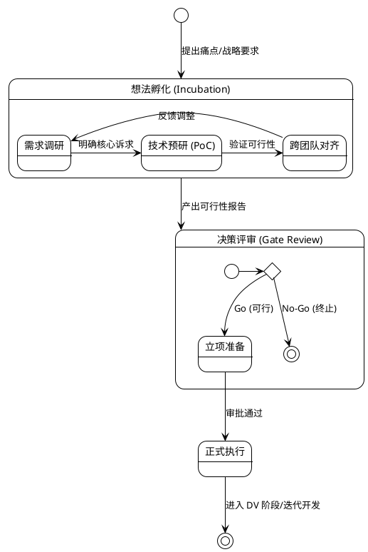

+++
date = '2025-08-03T17:17:50+08:00'
draft = true
title = '项目关键活动跟踪单'
+++

> **用途**：记录从“最初想法”到“项目正式落地”的全过程，支撑立项决策与价值回顾。
> **原则**：保持简洁，关键活动后 48h 内更新，结论先行。

## 一、项目基础信息

| 字段 | 内容 |
| :--- | :--- |
| **项目名称** | **智能座舱稳定性与性能全链路平台** |
| **发起人/部门** | [发起人姓名] / 智能座舱平台部 |
| **项目类型** | ☑ 平台/系统软件 &nbsp; ☐ 工具 &nbsp; ☐ 预研 |
| **当前状态** | ☐ 想法 &nbsp; ☐ 预研中 &nbsp; ☐ 立项审批中 &nbsp; ☑ 执行中 |
| **关键时间点** | 首次提出：`YYYY-MM-DD` \| 预计立项：`YYYY-MM-DD` |

---

## 二、为什么要做？（核心问题与价值）

### 2.1 问题来源 (Root Cause)
* **来源类型**：(例如：线上事故 / 长期痛点 / 战略规划)
* **背景描述**：
    > *在此简述问题是如何被发现的。例如：近三个月发生 X 起稳定性问题，平均定位耗时 Y 小时，严重影响版本交付节奏。*

### 2.2 初始假设与目标
* **初始假设**：
    > 如果我们构建一套[全链路监控与分析平台]，就能解决[日志碎片化导致定位难]的问题。
* **预期价值 (ROI)**：
    1.  **(定性)**：解决跨端日志对齐痛点，提升研发排查体验。
    2.  **(定量)**：预计降低故障平均定位时长 (MTTR) **XX%**。

---

## 三、前期调研与预研记录 (Pre-study)

### 3.1 关键活动流水账
*在此记录所有的需求调研、技术攻关会议和跨组对齐。*

| 时间 | 活动类型 | 参与人 | 核心议题/目的 | **关键结论/产出** (必填) |
| :--- | :--- | :--- | :--- | :--- |
| MM-DD | 需求调研 | A, B | 收集业务线痛点 | 业务方痛点集中在 Log 抓取不全，**确认需求高优先级**。 |
| MM-DD | 技术预研 | C, D | 方案可行性分析 | 方案 A 对性能损耗过大，**决定采用方案 B**。 |
| MM-DD | 跨组对齐 | 云端组 | 数据上报接口对齐 | 接口协议已敲定，详见附件会议纪要。 |

### 3.2 技术方案预研究 (PoC)
* **研究目标**：验证关键技术路径的可行性及风险。
* **涉及系统**：Android / Linux / Cloud
* **初步方案描述**：
    > *（可简述或引用架构图）*
* **关键风险与应对**：
    * **风险 1**：(例如：端侧数据量过大影响 CPU) -> **应对**：(引入采样与边缘计算策略)
* **预研结论**：
    > **[ 可行 / 有条件可行 / 不建议推进 ]**
    > *理由摘要：技术路径已闭环，关键风险可控。*

---

## 四、决策与立项 (Gate Review)

### 4.1 阶段性结论
* **是否建议立项**：**是 / 否**
* **核心依据**：
    1. 技术方案已通过 PoC 验证。
    2. 业务方 (座舱应用组) 已确认接入意愿。

### 4.2 决策记录
| 日期 | 决策会议/事项 | 决策人 | 结论 |
| :--- | :--- | :--- | :--- |
| MM-DD | 内部立项预审 | [Leader] | **通过**，建议补充资源投入估算。 |

---

## 五、落地衔接 (Delivery)

*证明项目已顺利从“纸面”转入“执行”。*

* **项目负责人 (PM)**：[姓名]
* **Design Verification (DV) 规划**：
    * 首个 DV 版本 (MVP) 预计完成时间：`YYYY-MM-DD`
    * DV 阶段核心验证点：数据通路上报的实时性与准确性。
* **任务拆解**：
    * [ ] 已拆解 Feature / Story 并录入 Jira/项目管理系统。
    * [ ] 已建立迭代排期。

---

## 六、附件与流程图

### 6.1 项目孵化流程视图

### 6.2 引用材料

* [需求调研原始文档链接]
* [详细技术架构设计图]
* [风险清单]

---

## 七、使用说明

1. **持续维护**：本文档不是一次性的，应伴随项目孵化过程持续更新。
2. **事实依据**：在立项评审或年终复盘时，本文档将作为核心事实依据。
