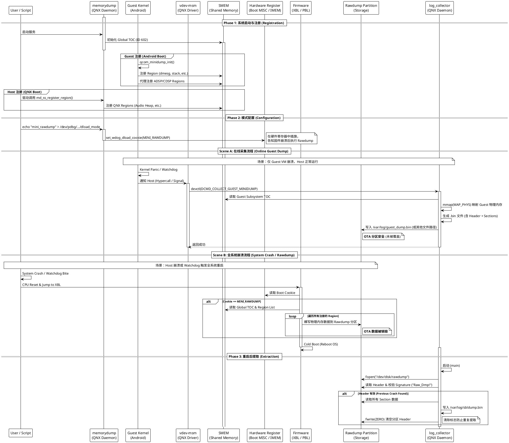

+++
date = '2025-08-28T16:25:03+08:00'
draft = false
title = 'QNX/Android Rawdump 机制完全原理解析'
+++


本文档基于系统源码（QNX/Android/Bootloader）及实际配置分析，详细阐述了智能座舱系统中的内存转储（Crash Dump）机制。

## 1. 全系统生命周期与时序总览

此图描述了从系统启动注册、模式配置，到发生崩溃（分两种场景），最后到重启提取的完整闭环流程。



## 2. 核心组件架构详解

整个 Rawdump 机制跨越了 Bootloader、Host OS (QNX)、Guest OS (Android) 和 硬件层。

| 组件名称 | 运行环境 | 核心源码 | 职责与作用 |
| --- | --- | --- | --- |
| **SMEM (Shared Memory)** | Hardware | `smem_type.h` | **数据中心**<br>存储 ID 为 `602` 的 Global TOC。它是所有子系统注册内存区域（Region）的共享账本，XBL 和 log_collector 都依据此表工作。 |
| **`memorydump`** | QNX Host | `ss_minidump_main.c` | **Host 侧登记处**<br>负责维护 Host 侧的 SMEM 表，提供接口供 QNX 驱动注册内存。同时负责向硬件寄存器写入 Magic Cookie (`MINI_RAWDUMP`)。 |
| **`vdev-msm`** | QNX Host | `vdev-msm.c` | **Guest 吹哨人**<br>监听 Android 虚拟机的看门狗状态。当 Guest Panic 时，它负责触发在线采集流程 (`DCMD_COLLECT_GUEST_MINIDUMP`)。 |
| **`log_collector`** | QNX Host | `log_collect_resmgr.c` | **搬运工**<br>1. **在线模式**：响应 `vdev-msm` 请求，通过 `mmap` 读取 Guest 内存并存为文件。<br>2. **离线模式**：系统重启后，检查 Rawdump 分区头，提取 XBL 写入的数据。 |
| **XBL Firmware** | Bootloader | `XBLRamDump` | **离线执行者**<br>仅在**全系统重启**（System Crash）时工作。它无视文件系统，直接将物理内存“裸写”到 Rawdump 分区。 |

---

## 3. 存储架构：OTA 分区复用机制

系统采用了 **Rawdump 与 OTA 分区复用** 的策略。

* **物理层**：QNX 侧存在一个约 **10GB** 的物理分区 `/dev/disk/rawdump`。
* **透传层**：通过 `vdev-virtio-blk` 将该物理分区透传给 Android 虚拟机。
* **Android 侧**：被重命名为 `/dev/block/by-name/ota`。
* **冲突与共存**：
* **正常运行**：Android 挂载为 `ext4` 文件系统，用于存储 OTA 升级包。
* **Guest Crash**：`log_collector` 写入普通文件，**OTA 数据安全**。
* **System Crash**：XBL 固件直接覆盖写入，**OTA 文件系统被销毁**。

---

## 4. 关键路径决策分析

系统在崩溃时会根据情况进入两条不同的路径，这也是排查“OTA 损坏”或“Log 丢失”问题的关键依据。

### 路径 A：Guest VM Crash (在线采集)

* **特征**：QNX 不重启，仅 Android 重启。
* **流程**：`vdev-msm` -> `log_collector` -> `mmap` -> 写文件 (`/var/log/guest_dump.bin`)。
* **结果**：速度快，保留 OTA 包。

### 路径 B：System Crash (离线转储)

* **特征**：整机黑屏重启，XBL 介入。
* **流程**：硬件看门狗复位 -> XBL -> 读取 SMEM -> **覆盖 Rawdump 分区**。
* **结果**：速度慢，**销毁 OTA 包**。

---

## 5. Android 侧的避让策略 (`init.mount_ota.sh`)

为了处理路径 B 带来的分区污染，Android 启动脚本实现了以下逻辑：

1. **触发**：`sys.boot_completed=1`（开机完成后）。
2. **检测**：`dd` 读取分区头，检查是否存在 `Raw_Dmp!`。
3. **避让**：如果发现签名，脚本会循环等待（Time-wait），给 QNX `log_collector` 提取数据留出时间。
4. **格式化**：提取完成或等待超时后，强制格式化分区，恢复 OTA 功能。


## 6. DEBUG

手动触发 Ramdump 主要分为两种场景：**触发 Guest（Android）崩溃** 和 **触发全系统（System）崩溃**。

这两种方式会分别走不同的数据采集路径，你可以根据测试目的选择。

### 方法一：触发 Android Guest 崩溃 (在线采集)

**目的**：测试 `vdev-msm` -> `log_collector` -> `mmap` 的路径。
**结果**：QNX 不重启，仅 Android 重启。生成的 Dump 文件通常位于 QNX 文件系统中（不破坏 OTA 分区）。

#### 1. 通过 Android Shell (最推荐)

这是最标准的 Linux Kernel Panic 触发方式。

1. 进入 Android Shell (ADB 或 串口)：
```bash
adb shell
su

```


2. 开启 SysRq 功能 (如果未开启)：
```bash
echo 1 > /proc/sys/kernel/sysrq

```


3. **触发 Panic**：
```bash
echo c > /proc/sysrq-trigger

```


**现象**：

* Android 界面卡死或立即黑屏。
* QNX 串口会打印检测到 Guest 崩溃的日志 (`vdev-msm: Guest ... watchdog bite` 或类似)。
* Android 随后会自动重启。

#### 2. 通过 QNX Shell (如果 Android 已死锁)

如果 Android 已经完全无响应（连 adb 都进不去），你可以在 QNX 侧强制杀掉 Android 虚拟机进程来模拟崩溃。

1. 找到 Android 虚拟机进程 (通常叫 `qvm` 且参数包含 `la` 或 `android`)：
```bash
pidin ar | grep qvm

```


2. **发送信号触发异常**：
* 注意：直接 `kill` 可能只会导致虚拟机退出而不产生 Dump。
* 尝试发送 `SIGABRT` (Signal 6) 或 `SIGSEGV` (Signal 11)：


```bash
# 假设 PID 为 12345
slay -s SIGABRT 12345

```


* *注意：这取决于 QNX `vdev` 驱动如何捕获信号，不如方法 1 可靠。*


---

### 方法二：触发全系统崩溃 (离线 Rawdump)

**目的**：测试 XBL 固件 -> 覆盖 Rawdump (OTA) 分区 -> `init.mount_ota.sh` 恢复的路径。
**警告**：**此操作会销毁 OTA 分区中的数据！**

#### 1. 通过 QNX Shell 设置 DLOAD 模式

我们需要手动设置 Magic Cookie，告诉固件“下次重启时抓 Dump”，然后强制重启。

1. **设置 Cookie**：
在 QNX 串口中执行：
```bash
# 写入 mini_rawdump 或 full_rawdump (取决于你们的策略配置)
echo mini_rawdump > /dev/utils/dload_mode

# 如果没有 /dev/utils/dload_mode，尝试 memorydump 的调试节点
# (根据 memorydump 源码，可能有特定的 devctl 工具)

```


2. **强制重启**：
```bash
shutdown -S reboot

```

#### 2. 物理按键 (如果支持)

很多开发板或量产车机支持组合键触发。

* 通常是 **“音量下 + 电源键”** 长按 10秒以上。
* 或者在开机状态下长按 **Reset** 键。
* 这种硬件复位通常会被 PMIC 捕获，如果配置了 `PON_RESIN` 触发 Dload，也会进入 XBL Rawdump 流程。

---

### 如何验证触发成功？

#### 验证场景 A (Android 崩溃)

Android 重启后，去 QNX 的存储目录检查：

```bash
# 在 QNX Shell 中
ls -l /var/log/  # 或者你们配置的 dump 路径

```

看是否有新生成的 `guest_dump.bin` 或类似文件。

#### 验证场景 B (全系统崩溃)

系统完全重启后，在 **Android 启动过程中**（此时 Android 还未挂载 OTA 分区），在串口观察日志：

1. **QNX `log_collector` 日志**：
应该看到类似 `Found Raw_Dmp! signature`, `Extracting dump...` 的打印。
2. **Android `init.mount_ota.sh` 日志**：
应该看到：
```text
ramdump exist
normal mount, ramdump exist please wait...

```


或者如果 QNX 已经提走了：
```text
mke2fs -t ext4 ...
mount ota 0

```


### 总结建议

* **日常调试**：使用 **`echo c > /proc/sysrq-trigger`**。这是最安全、最快捷的方式，且不破坏 OTA 分区。
* **验证 OTA 鲁棒性**：使用 **全系统崩溃** 方法，验证系统重启后 OTA 分区是否能被脚本正确格式化并恢复使用。