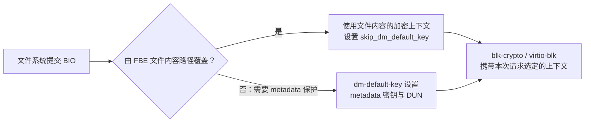
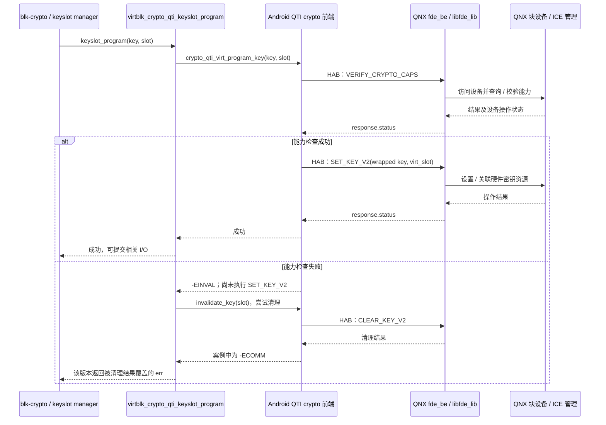
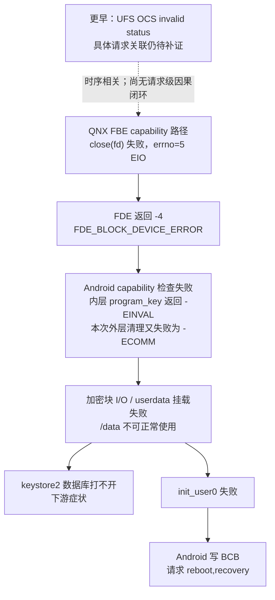

+++
date = '2026-09-16T00:00:00+08:00'
draft = false
title = 'QNX + Android 加密存储：软件架构、工作原理与 Recovery 故障调试'
description = '介绍 QNX + Android 加密存储中 FBE、metadata encryption、HAB、virtio-blk 与 UFS/ICE 的协作，并通过匿名案例分析重启压力测试触发 Recovery 的故障链。'
tags = ['QNX', 'Android', 'Hypervisor', 'Storage', 'FBE', 'UFS', 'Debug']
ShowToc = true
TocOpen = false
+++

本文回答三个问题：Android 运行在 QNX Hypervisor 上时，谁管理密钥、谁传输数据、谁执行加解密？为什么加密后端异常会表现为 Android 数据库打不开，甚至进入 Recovery？如何把这些现象沿源码和日志串起来？

> **适用范围**：本文围绕 QNX host + Android guest 的 Qualcomm 加密存储虚拟化方案展开，不是所有 QNX 产品的通用实现。`fde_be`、HAB、ICE 和相关 `devctl` 属于平台相关组件；纯 QNX 文件系统、其他 SoC 或其他 BSP 的加密方案不能直接套用。接口及错误处理行为以目标版本为准。
>
> **证据边界**：Android 前端与部分 QNX 适配层有源码；FDE 核心库和 UFS 驱动的部分实现只有预编译产物。本文区分“源码确认”“日志确认”和“待验证推断”，不把错误传播路径等同于底层缺陷已经查明。
>
> **案例说明**：附录保留真实故障的技术现象与分析结论，已去除项目、产品、内部目录、构建标识及原始日志文件名；时间线采用相对时间。

## 1. 先建立正确的整体认识

这套方案是多个组件协作，而不是“QNX 上有一个进程把所有 Android 文件加密后写盘”：

- **Android 决定保护策略**：哪些目录使用哪个用户的密钥、什么时候解锁、如何挂载 `/data`。
- **Android 内核给块请求附加加密上下文**：包括密钥关联、算法、数据单元编号等。
- **HAB 控制通路管理加密能力和密钥槽**：Android 前端向 QNX `fde_be` 发起请求。
- **virtio-blk 数据通路传输读写请求**：QNX 虚拟块设备后端把请求送往宿主存储栈。
- **UFS/ICE 硬件路径执行内联加解密**：数据经过存储 I/O 路径时完成变换，而不是逐块交给 `fde_be` 做软件 AES。

最重要的分界是：**HAB 上的密钥控制请求，与 virtio-blk 上的文件数据请求，是两条相互依赖但不同的通路。**

本文重点是 **QNX 为 Android guest 提供的加密存储后端**。QNX 自身 userdata/qnx6 的 FDE 方案与 Android userdata/ext4 `/data` 是不同的保护对象。看到相同的 `userdata` 或 `fde` 名称时，必须先确认属于哪个 OS、哪个分区和哪条加密路径。

## 2. 软件架构图

上层将 **QNX host 与 Android guest 左右并列**，下层依次为 **Hypervisor** 与 **Hardware**。虚线表示加密控制与生命周期操作，实线表示数据请求通路；箭头展示请求发起方向，应答和读数据的返回方向未展开。

<figure id="qnx-storage-architecture" aria-labelledby="qsa-caption">
<style>
#qnx-storage-architecture { margin: 24px 0; }
@media (min-width: 1200px) { #qnx-storage-architecture { width: 1120px; margin-left: calc(50% - 560px); } }
#qnx-storage-architecture .qsa-scroll { overflow-x: auto; border: 1px solid #cbd5e1; border-radius: 10px; background: #fff; }
#qnx-storage-architecture svg { display: block; width: 100%; min-width: 1000px; height: auto; background: #fff; }
#qnx-storage-architecture text { fill: #172b45; font-family: system-ui, -apple-system, "Noto Sans CJK SC", "Microsoft YaHei", sans-serif; }
#qnx-storage-architecture .qsa-title { font-size: 23px; font-weight: 700; }
#qnx-storage-architecture .qsa-head { font-size: 19px; font-weight: 700; }
#qnx-storage-architecture .qsa-name { font-size: 17px; font-weight: 600; }
#qnx-storage-architecture .qsa-detail { font-size: 14px; fill: #40546b; }
#qnx-storage-architecture .qsa-label { font-size: 14px; fill: #245d8d; }
#qnx-storage-architecture .qsa-control-label { font-size: 14px; fill: #7f632d; }
#qnx-storage-architecture .qsa-os { fill: #eff6ff; stroke: #a9bfd5; stroke-width: 1.4; }
#qnx-storage-architecture .qsa-android { fill: #f0f9f4; stroke: #aacdb8; stroke-width: 1.4; }
#qnx-storage-architecture .qsa-process { fill: #fff; stroke: #7088a1; stroke-width: 1.4; }
#qnx-storage-architecture .qsa-library { fill: #fff5e7; stroke: #d6b783; stroke-width: 1; }
#qnx-storage-architecture .qsa-hypervisor { fill: #f3f4fa; stroke: #abb5cd; stroke-width: 1.4; }
#qnx-storage-architecture .qsa-hardware { fill: #fff8f0; stroke: #c7b18e; stroke-width: 1.4; }
#qnx-storage-architecture .qsa-flow { fill: none; stroke: #245d8d; stroke-width: 2; marker-end: url(#qsa-arrow); }
#qnx-storage-architecture .qsa-call { fill: none; stroke: #7f632d; stroke-width: 1.6; stroke-dasharray: 5 4; marker-end: url(#qsa-call-arrow); }
#qnx-storage-architecture figcaption { margin-top: 10px; font-size: 14px; line-height: 1.7; }
</style>
<div class="qsa-scroll" role="region" aria-label="加密存储架构图，窄屏可横向滚动" tabindex="0">
<svg viewBox="0 0 1120 1265" width="1120" height="1265" role="img" aria-labelledby="qsa-title qsa-desc" xmlns="http://www.w3.org/2000/svg">
<title id="qsa-title">QNX 与 Android 加密存储架构</title>
<desc id="qsa-desc">上层左侧是 QNX host，右侧是 Android guest，下方依次为 Hypervisor 和 Hardware。Android 文件系统与块加密层分出两条通路：QTI crypto 经 HAB 向 QNX fde_be 发起加密控制请求；virtio-blk 经 virtqueue 向 qvm 后端提交块请求。fde_be 进程内的 libfde_lib 与存储驱动及安全服务协作。qvm 将数据请求交给 UFS 驱动，再由 UFS Controller 和 ICE 执行内联加解密，介质保存密文。TEE 的内部调用未展开。</desc>
<defs>
<marker id="qsa-arrow" viewBox="0 0 10 10" markerWidth="7" markerHeight="7" refX="9" refY="5" orient="auto"><path d="M0 0 L10 5 L0 10 Z" fill="#245d8d"/></marker>
<marker id="qsa-call-arrow" viewBox="0 0 10 10" markerWidth="7" markerHeight="7" refX="9" refY="5" orient="auto"><path d="M0 0 L10 5 L0 10 Z" fill="#7f632d"/></marker>
</defs>
<text class="qsa-title" x="40" y="35">加密存储：控制通路与数据通路</text>
<path class="qsa-flow" d="M670 29 H710"/>
<text class="qsa-detail" x="724" y="34">数据 I/O</text>
<path class="qsa-call" d="M840 29 H880"/>
<text class="qsa-detail" x="894" y="34">控制 / 生命周期</text>

<!-- OS 边界：QNX 与 Android 并列，前后端位于各自 OS 中。 -->
<rect class="qsa-os" x="40" y="70" width="450" height="780" rx="9"/>
<text class="qsa-head" x="65" y="104">QNX · Host</text>
<text class="qsa-detail" x="65" y="129">存储后端与平台服务</text>
<rect class="qsa-android" x="640" y="70" width="460" height="780" rx="9"/>
<text class="qsa-head" x="665" y="104">Android · Guest</text>
<text class="qsa-detail" x="665" y="129">文件策略与块请求</text>

<!-- QNX：生命周期与 FDE 服务；动态库嵌套在进程内部。 -->
<rect class="qsa-process" x="70" y="155" width="390" height="85" rx="6"/>
<text class="qsa-name" x="265" y="185" text-anchor="middle">VMM · guest 生命周期</text>
<text class="qsa-detail" x="265" y="215" text-anchor="middle">启停、重启通知与资源回收</text>
<rect class="qsa-process" x="70" y="310" width="390" height="180" rx="8"/>
<text class="qsa-name" x="265" y="339" text-anchor="middle">fde_be · 加密控制服务</text>
<text class="qsa-detail" x="265" y="364" text-anchor="middle">HAB 请求处理 / 安全服务适配</text>
<rect class="qsa-library" x="90" y="382" width="350" height="85" rx="5"/>
<text class="qsa-name" x="265" y="410" text-anchor="middle">libfde_lib</text>
<text class="qsa-detail" x="265" y="434" text-anchor="middle">能力检查 · wrapped key · 虚拟槽位</text>
<text class="qsa-detail" x="265" y="456" text-anchor="middle">清槽 / 派生秘密 · 块设备 devctl</text>
<path class="qsa-call" d="M265 240 V310"/>
<text class="qsa-control-label" x="278" y="281">guest 重启 / 资源清理</text>

<!-- Android：文件系统与块加密层；在驱动侧分开控制与数据。 -->
<rect class="qsa-process" x="670" y="155" width="410" height="85" rx="6"/>
<text class="qsa-name" x="875" y="182" text-anchor="middle">应用 / init / vold / KeyMint</text>
<text class="qsa-detail" x="875" y="207" text-anchor="middle">文件读写 · 挂载 /data · FBE 密钥与策略</text>
<text class="qsa-detail" x="875" y="228" text-anchor="middle">KeyMint 提供安全密钥接口</text>
<rect class="qsa-process" x="670" y="300" width="410" height="110" rx="6"/>
<text class="qsa-name" x="875" y="333" text-anchor="middle">ext4 + fscrypt / dm-default-key</text>
<text class="qsa-detail" x="875" y="361" text-anchor="middle">按请求选择 FBE 或 metadata 加密上下文</text>
<text class="qsa-detail" x="875" y="386" text-anchor="middle">普通文件内容不重复叠加两次加密</text>
<path class="qsa-flow" d="M875 240 V300"/>
<text class="qsa-label" x="889" y="277">文件 I/O</text>
<rect class="qsa-process" x="670" y="465" width="410" height="75" rx="6"/>
<text class="qsa-name" x="875" y="495" text-anchor="middle">blk-crypto + keyslot manager</text>
<text class="qsa-detail" x="875" y="521" text-anchor="middle">密钥槽管理 · 算法 · DUN</text>
<path class="qsa-flow" d="M875 410 V465"/>
<text class="qsa-label" x="889" y="443">加密上下文</text>
<rect class="qsa-process" x="670" y="600" width="190" height="90" rx="6"/>
<text class="qsa-name" x="765" y="629" text-anchor="middle">QTI crypto + HAB</text>
<text class="qsa-detail" x="765" y="652" text-anchor="middle">crypto-qti-virt</text>
<text class="qsa-detail" x="765" y="675" text-anchor="middle">能力查询 / 设置密钥</text>
<rect class="qsa-process" x="890" y="600" width="190" height="90" rx="6"/>
<text class="qsa-name" x="985" y="629" text-anchor="middle">virtio-blk</text>
<text class="qsa-detail" x="985" y="652" text-anchor="middle">块数据前端</text>
<text class="qsa-detail" x="985" y="675" text-anchor="middle">slot / DUN 扩展</text>
<path class="qsa-call" d="M765 540 V600"/>
<text class="qsa-control-label" x="687" y="578">密钥操作</text>
<path class="qsa-flow" d="M985 540 V600"/>
<text class="qsa-label" x="999" y="578">块 I/O</text>

<!-- QNX：qvm 数据后端与存储驱动独立于 FDE 控制服务。 -->
<rect class="qsa-process" x="150" y="600" width="310" height="90" rx="6"/>
<text class="qsa-name" x="305" y="629" text-anchor="middle">qvm · 虚拟块设备后端</text>
<text class="qsa-detail" x="305" y="655" text-anchor="middle">接收 guest 块 I/O</text>
<text class="qsa-detail" x="305" y="678" text-anchor="middle">转交 host 存储栈</text>
<rect class="qsa-process" x="150" y="745" width="310" height="80" rx="6"/>
<text class="qsa-name" x="305" y="775" text-anchor="middle">devb_ufs_qualcomm</text>
<text class="qsa-detail" x="305" y="802" text-anchor="middle">UFS 驱动 · I/O 与加密上下文</text>
<path class="qsa-flow" d="M305 690 V745"/>
<text class="qsa-label" x="319" y="723">块请求</text>
<path class="qsa-call" d="M105 490 V785 H150"/>
<text class="qsa-control-label" x="117" y="543">块设备 devctl</text>

<!-- 跨 OS 链路直接连接前后端；两条线分开布线，不穿过无关组件。 -->
<path class="qsa-call" d="M670 645 H570 V355 H460"/>
<text class="qsa-control-label" x="515" y="340" text-anchor="middle">HAB</text>
<text class="qsa-control-label" x="515" y="380" text-anchor="middle">加密控制</text>
<path class="qsa-flow" d="M985 690 V725 H530 V645 H460"/>
<text class="qsa-label" x="690" y="714">virtqueue · 块请求 + slot / DUN</text>
<text class="qsa-name" x="670" y="780">两条通路，职责分离</text>
<text class="qsa-detail" x="670" y="804">HAB 管密钥，virtio 传块请求。</text>
<text class="qsa-detail" x="670" y="827">文件数据不交给 fde_be 做软件 AES。</text>

<!-- Hypervisor 是共享基础层，不是文件数据的 AES 处理节点。 -->
<rect class="qsa-hypervisor" x="40" y="885" width="1060" height="120" rx="9"/>
<text class="qsa-head" x="70" y="920">Hypervisor</text>
<text class="qsa-name" x="330" y="920">VM 隔离 · vCPU / 中断虚拟化 · 内存映射与访问控制</text>
<text class="qsa-detail" x="70" y="951">共享内存与通知机制支撑前后端协作；HAB / virtio 协议由对应前后端实现。</text>
<text class="qsa-detail" x="70" y="977">虚拟化基础层，不执行文件 AES，也不管理 Android 用户密钥策略。</text>

<!-- Hardware：存储 I/O 路径与其他计算 / 隔离硬件。 -->
<rect class="qsa-hardware" x="40" y="1040" width="1060" height="145" rx="9"/>
<text class="qsa-head" x="70" y="1071">Hardware</text>
<text class="qsa-detail" x="330" y="1070">存储内联加解密、计算与隔离；硬件安全能力支撑安全世界</text>
<rect class="qsa-process" x="70" y="1090" width="390" height="75" rx="6"/>
<text class="qsa-name" x="265" y="1119" text-anchor="middle">UFS Controller + ICE</text>
<text class="qsa-detail" x="265" y="1146" text-anchor="middle">依密钥槽与 DUN 执行内联加解密</text>
<rect class="qsa-process" x="550" y="1090" width="215" height="75" rx="6"/>
<text class="qsa-name" x="657" y="1119" text-anchor="middle">UFS 存储介质</text>
<text class="qsa-detail" x="657" y="1146" text-anchor="middle">持久化保存密文</text>
<path class="qsa-flow" d="M460 1125 H550"/>
<text class="qsa-label" x="505" y="1112" text-anchor="middle">密文</text>
<rect class="qsa-process" x="810" y="1090" width="265" height="75" rx="6"/>
<text class="qsa-name" x="942" y="1119" text-anchor="middle">CPU / MMU / 内存</text>
<text class="qsa-detail" x="942" y="1146" text-anchor="middle">计算、隔离与共享缓冲区</text>

<!-- host 驱动的设备 I/O 绕过 Hypervisor 内容框，避免暗示其执行加密。 -->
<path class="qsa-flow" d="M305 825 V875 H20 V1125 H70"/>
<text class="qsa-label" x="130" y="869">宿主设备 I/O</text>
<text class="qsa-detail" x="40" y="1220">安全世界（图外）：TEE 是依托硬件的软件 / 固件；KeyMint 与 FDE 通过平台接口访问。</text>
<text class="qsa-detail" x="40" y="1245">图中省略安全世界内部调用、应答与读数据返回方向；共享内存并非天然的密文通道。</text>
</svg>
</div>
<figcaption id="qsa-caption">QNX 与 Android 并列，下方依次为 Hypervisor 和 Hardware。浅色大框表示架构层次，橙色模块为进程内动态库；虚线连接控制与生命周期操作，实线连接块请求路径。窄屏可横向滚动查看。</figcaption>
</figure>

图中的“块请求”可能携带尚未由 ICE 变换的内存数据，不能把 guest 与 host 之间的共享内存理解成天然的密文通道。KeyMint 到安全世界、FDE 到安全服务以及安全世界到 ICE 的内部调用与密钥装载细节，应由目标 BSP/安全固件文档确认。

### 2.1 组件职责速查

| 组件 | 主要职责 | 不应混淆的概念 |
|---|---|---|
| `vold`、`FsCrypt.cpp` | 管理用户存储、FBE 密钥、目录策略、用户 0 初始化 | 不是 UFS 驱动，也不逐块加密文件内容 |
| `MetadataCrypt.cpp` | 获取 metadata 密钥、创建 default-key DM 设备、挂载 `/data` | metadata encryption 不是整个 `/metadata` 分区都被同一方案加密 |
| `fscrypt` | 实现文件系统级内容与文件名保护，配合内联加密 | 文件名处理与文件内容块 I/O 并非完全相同的执行路径 |
| `dm-default-key` | 为需要 metadata 保护的块请求设置默认加密上下文 | 不应把 FBE 文件内容再用 metadata 密钥重复加密 |
| `blk-crypto` / keyslot manager | 管理块加密上下文及槽位使用，调用驱动操作 | keyslot 是有限硬件/虚拟资源，不是一把永久保存的文件密钥 |
| `crypto-qti-virt` | 把前端加密能力与密钥操作转为 HAB 请求 | 不是文件数据传输通道 |
| `fde_be` / `libfde_lib` | QNX 侧处理 FBE 控制请求，与存储/安全接口协作 | 进程名称带 `fde`，不意味着 Android 使用旧式全盘加密 FDE |
| qvm 虚拟块设备后端 | 接收 guest 块请求并转交 host 存储栈 | 不是 Android 文件系统实现 |
| `devb_ufs_qualcomm` / ICE | 存储请求、硬件能力与内联加密资源协作 | capability 查询失败不等于已经证明密钥内容错误 |
| VMM | guest 启停、重启通知、启动模式与失败重试管理 | 不负责 Android 用户 CE/DE 策略 |

## 3. 三个加密概念必须分开

### 3.1 FBE：文件级策略与用户隔离

FBE（File-Based Encryption）使不同用户、不同存储类别能够使用不同密钥。DE（Device Encrypted）存储支持 Direct Boot；CE（Credential Encrypted）存储在相应用户解锁后可用。Android 中由 `vold` 管理相关密钥和策略，内核 `fscrypt` 执行文件系统侧处理。[AOSP：File-based encryption](https://source.android.com/docs/security/features/encryption/file-based)

一种使用硬件包装密钥的 fstab 配置示例是：

```text
fileencryption=aes-256-xts:aes-256-cts:v2+inlinecrypt_optimized+wrappedkey_v0
```

其中内容与文件名使用不同加密模式；`inlinecrypt_optimized` 配合有限的内联加密槽位优化密钥使用。**不能把“一个文件对应一个永久 ICE 槽位”作为分析前提。** 车机还可能采用 headless system user 等用户模型；本文的 `init_user0` 指系统用户 0 初始化，不等于当前驾驶员必须手工输入密码。

### 3.2 Metadata encryption：补足 FBE 未覆盖的文件系统信息

FBE 不独自覆盖所有文件系统元数据。Metadata encryption 使用另一套卷级密钥，保护没有被 FBE 覆盖的内容，例如文件系统结构信息。该密钥在 `/data` 可读之前就需要可用，因此其受保护的密钥材料位于单独的 `/metadata` 路径。[AOSP：Metadata encryption](https://source.android.com/docs/security/features/encryption/metadata)

与 metadata encryption 相关的配置示例为：

```text
/dev/block/by-name/metadata -> /metadata
/dev/block/by-name/userdata -> /data

mount option:       inlinecrypt
fs_mgr option:      metadata_encryption=aes-256-xts:wrappedkey_v0
key directory:      /metadata/vold/metadata_encryption
```

以上是配置项的分项说明，不是可直接替换的完整 fstab。使用 ext4 的 `/data` 配置还可能包含 `latemount`、`check`、`checkpoint=block` 等选项，应结合目标系统确认。见[源码索引 S1](#source-index)。

**对普通加密文件的内容，FBE + metadata encryption 不是简单串联两次 AES。** 在本文所述实现中，`fs/crypto/inline_crypt.c` 会给相关文件 BIO 设置 `skip_dm_default_key`；`dm-default-key.c` 看到该标记就跳过默认密钥，对需要它保护的其他请求才设置 metadata 加密上下文。

这个结论不能扩大成“任何字节都不会叠加保护”：文件名由 fscrypt 加密后，其所在目录块仍可能受到 metadata encryption 覆盖。应区分普通文件内容、文件名和其他文件系统元数据。



图中省略无数据的 discard 等请求；这些请求有独立处理分支。

### 3.3 Hardware-wrapped key：保护密钥本身

`wrappedkey_v0` 表示使用相应版本的硬件包装密钥接口。包装后的密钥可以作为数据结构在普通软件之间传递，但不能因此把它当作裸 AES 内容密钥。硬件包装机制的目标是让实际内联加密密钥不以可直接使用的明文形式暴露给普通软件；为文件名等软件操作派生的秘密是另一类材料。[AOSP：Hardware-wrapped keys](https://source.android.com/docs/security/features/encryption/hw-wrapped-keys)

这不意味着“普通内存里没有任何敏感信息”：已解密文件内容、文件名及某些派生材料仍有各自的保护边界。因此调试时不要转储密钥、HAB 密钥请求的原始载荷，或把完整密钥目录打进普通日志包。

本文以采用 `wrappedkey_v0` 和 keyslot-manager 的实现说明原理。不要跨版本直接套用配置字段或内核 API 名称，更不能未经迁移设计修改已有 userdata 的加密格式。

所分析版本的 `block/blk-crypto.c` 对硬件包装密钥不提供普通软件加密 fallback：如果相应硬件路径不可用，会返回失败。因此不能假定“ICE 异常后 CPU 自动接管，最多变慢”。

## 4. 两条通路如何协同

### 4.1 控制通路：能力检查和密钥槽管理

所分析版本的 `crypto-qti-virt.c` 定义了以下请求：

| 请求 | ID | 目的 |
|---|---:|---|
| `FBE_GET_MAX_SLOTS` | 7 | 查询可用虚拟槽位数量 |
| `FBE_SET_KEY_V2` | 8 | 为虚拟槽位设置密钥 |
| `FBE_CLEAR_KEY_V2` | 9 | 清理槽位密钥 |
| `FBE_DERIVE_RAW_SECRET` | 10 | 请求派生软件侧需要的秘密；不能等同于导出内容密钥 |
| `FBE_GET_CRYPTO_CAPABILITIES` | 11 | 查询支持的加密能力 |
| `FBE_VERIFY_CRYPTO_CAPS` | 12 | 检查指定算法及 data unit size 是否可用 |

一次槽位编程大致如下：



这里有一个重要的调试陷阱：**`program key failed` 不保证实际“写密钥”步骤已经执行。** 所分析实现的 `crypto_qti_virt_program_key()` 先调用 `verify_crypto_capabilities()`；前置检查失败就返回 `-EINVAL`。因此必须继续追查前面那条 capability 错误，不能只看最后的 keyslot 日志。

所分析版本还有一个实现细节：外层 `virtblk_crypto_qti_keyslot_program()` 会在编程失败后尝试 invalidate，并把清理结果重新赋给 `err` 后返回。因此内层 −22 不一定是 keyslot 回调的最终返回值；附录案例清理失败后为 −70。若清理成功，原始编程错误甚至可能被覆盖为 0。这是应单独审查的错误传播问题，不能将该行为当作标准 blk-crypto 契约。

控制返回值也有多层：HAB 调用返回值、FBE `response.status`、QNX `devctl()` 返回值、驱动输出参数以及 `errno` 不属于同一个错误码空间。应按具体调用点解码，不可统一套用 Linux errno。

### 4.2 数据通路：请求携带槽位和 DUN

文件读写转换为 BIO/request 后，内联加密框架将密钥及 DUN（Data Unit Number，数据单元编号）等关联到请求；DUN 参与数据单元的加密位置区分，不是密钥。[Linux：Inline Encryption](https://docs.kernel.org/block/inline-encryption.html)

该虚拟化方案中的 virtio-blk 扩展 `virtio_blk_ice_info` 包含：

```c
u8  ice_slot;
u8  activate;
u16 reserved;
u32 reserved1;
u64 data_unit_num;
```

`virtblk_get_ice_info()` 从请求的 `crypt_keyslot` 获取槽位编号，从 `crypt_ctx->bc_dun[0]` 获取 DUN。它们与块请求一起送往 host；**并不是每次文件读写都把裸密钥放进请求。** guest 虚拟槽位与硬件槽位的具体关联由平台后端管理，不能未经验证假定编号相同。

内联加密让数据在存储路径上经过 ICE 完成加解密，减少由通用 CPU 逐块做同等变换的需要，但不意味着零 CPU 开销。文件系统、块层、virtqueue、host 后端、驱动以及控制请求仍需 CPU 执行。

### 4.3 两条通路为何会一起影响挂载

ext4 要挂载文件系统，首先必须读取其超级块等结构。即使存储介质上的密文没有损坏，只要 metadata 密钥无法使用、能力查询失败或槽位无法建立，加密读请求就可能失败，最终出现：

```text
Can't read superblock: I/O error
EXT4-fs: unable to read superblock
```

所以“读不到超级块”不等于“超级块内容已经损坏”。必须先区分：请求未能完成、解密配置不可用，还是成功读取后文件系统校验发现内容损坏。

## 5. 启动、挂载与重启生命周期

### 5.1 正常启动的关键依赖

正常启动可按以下依赖理解，而不是要求所有线程严格串行执行：

1. QNX 建立存储服务、FBE 后端和 guest 运行环境。
2. Android 发现虚拟块设备及其加密能力。
3. Android 挂载 `/metadata`，通过安全密钥能力获取可用的 metadata 密钥材料。
4. `vold` 创建 userdata 的 default-key DM 映射，并挂载 `/data`。
5. 建立系统与用户的 FBE 存储；`init_user0` 完成用户 0 所需初始化。
6. 后续用户解锁流程使相应 CE 存储可用。

`/dev/block/dm-10`、`dm-11` 等名字是运行时编号，**不能写死为 userdata**。同理，`vdd` 也不能只凭名称认定为某个分区；应结合 `/dev/block/by-name`、DM 名称和 sysfs 的依赖关系确认。

### 5.2 Guest 重启与整机重启不是一回事

- **Guest 重启**：QNX host 和部分存储后端仍在运行，需要处理旧 guest 的请求、槽位和资源清理，再为新 guest 初始化。
- **整机重启**：host/VMM 软件上下文重新建立；但是否伴随 UFS、控制器、安全域完整复位，要看重启方式与平台时序，不能仅凭“整机重启”判断其电气复位范围。

所分析的 `fde.h` 提供 VM 重启时清除该 VM 全部 ICE keys 的接口，FDE 后端产物也包含 VMM 事件关联。这证明清理机制存在，**不证明每次清理都成功，更不能反过来在没有证据时认定槽位泄漏**。

## 6. 安全与工程边界

| 常见说法 | 更准确的理解 |
|---|---|
| “QNX 已经加密，所以 Android 不需要 fscrypt” | host 硬件路径与 Android 文件级策略解决不同问题，需要协作 |
| “HAB 在搬运加密文件” | 本文这条 HAB FBE 接口主要是能力与密钥控制；文件块数据走 virtio-blk |
| “FBE + metadata 必然把文件内容加密两遍” | 所述 default-key 路径按标记跳过 FBE 覆盖的文件内容 |
| “wrapped key 就可以随便打印” | 包装密钥仍是敏感材料，不应输出原始载荷 |
| “program key failed 就是密钥错了” | 可能在能力校验阶段已失败，根本没走到 SET_KEY |
| “`ret=0` 就是成功” | 还需检查协议状态；所述传输函数还涉及关闭返回值，不能只看一个数字 |
| “数据库打不开，删数据库即可” | 可能是整个 `/data` 不可访问，删文件既不能修复上游，也会破坏现场 |

<a id="source-index"></a>

## 7. 源码索引与核对方式

下表仅保留技术组件、标准相对路径和函数名，不包含内部工程目录。Android 路径相对于 Android 源码根目录，内核路径相对于对应 Linux 内核根目录；厂商 BSP 仅列文件或组件名，实际位置及实现因版本而异。定位时应以函数名和设备实际运行版本为准。

| 索引 | 路径 / 函数 | 核对内容 |
|---|---|---|
| S1 | 设备 `fstab.<hardware>` | `/metadata`、`/data`、FBE 与 metadata 配置 |
| S2 | `system/vold/MetadataCrypt.cpp`：`mount_via_fs_mgr()`、`fscrypt_mount_metadata_encrypted()` | default-key 映射和挂载 |
| S3 | `system/vold/FsCrypt.cpp`：`fscrypt_init_user0()` | 用户 0 初始化与失败返回 |
| S4 | `fs/crypto/inline_crypt.c`：`fscrypt_set_bio_crypt_ctx()` | BIO 的文件加密上下文、skip-default-key 标记 |
| S5 | `drivers/md/dm-default-key.c` | 跳过 FBE 文件内容，设置 metadata 上下文 |
| S6 | `drivers/block/virtio_blk.c`：`virtblk_get_ice_info()` | ICE request 扩展、slot 与 DUN |
| S7 | `drivers/block/virtio_blk_qti_crypto.c` | keyslot 回调、失败后的清理尝试 |
| S8 | `drivers/soc/qcom/crypto-qti-virt.c` | HAB 请求、能力检查、编程与错误翻译 |
| S9 | BSP：`fde.h` | FDE 错误码与 VM key 清理接口 |
| S10 | BSP disk accessor：`drvr.c`、`drvr_devb.c` | `drvr_close_lun()` → `devb_close_lun()` → `close()` |
| S11 | BSP：`libfde_lib.so.1` | FDE 核心预编译库；部分分支由反汇编核对 |
| S12 | `system/core/init/builtins.cpp`：`ExecVdcRebootOnFailure()`、`do_init_user0()` | `init_user0` 失败后的 Recovery 请求 |
| S13 | BSP：`lcm_utils.c`：`check_for_recovery_boot_slot_info()` | 案例实现中的 Recovery 参数白名单 |
| S14 | BSP：`vmm_fsm.c`：`get_gvm_boot_slot_info()` | Recovery 模式与启动失败计数 |
| S15 | BSP：`vmm_drv.h`、`vmm_drv.c` | `MAX_RETRY_CNT` 及计数初始化；案例版本为 7 |
| S16 | `bootable/recovery/bootloader_message/bootloader_message.cpp` | BCB 生成、写入与同步 |

## 附录 A：Debug——重启压力测试后进入 Recovery

### A.1 故障背景与结论分层

- 场景：**反复整机重启测试**，随后 Android 无法正常启动并进入 Recovery。
- 时间基准：以首次 UFS 异常为 **T0**，用相对时间保留事件顺序。
- 直接触发：`cryptfs init_user0` 失败，Android init 主动请求 `reboot,recovery`。
- 上游故障：QNX FBE 后端块设备操作返回 `EIO`，Android 加密存储访问失败。
- 额外问题：QNX 启动管理器不接受 Android 写入的 `--prompt_and_wipe_data` 参数，导致若干次普通启动重试。
- 尚未闭环：是什么导致 UFS/块设备在这次整机重启后进入异常状态。

**这不是已确认的 QNX kernel crash，也不是已确认的 UFS 介质损坏或密钥槽耗尽。** “故障链已串起”与“底层根因已查明”是两种不同结论。

### A.2 证据类型与相对时间线

| 证据 | 用途 |
|---|---|
| 故障启动的 QNX host 日志 | 关联 UFS、FDE、VMM 状态 |
| 同次启动的 Android guest 串口日志 | 关联内核、vold、keystore2、重启及 Recovery 行为 |
| 前次正常启动日志 | 排除长期存在、与此次故障无直接关系的告警 |

guest 早期日志使用 UTC，host 使用本地时间，可通过带时区的 tombstone 时间进行对齐，再转换成下表的相对时间。Recovery 内部时钟后来回到初始纪元，不能按其墙上时间直接排序。表中秒级日志只表达近似时序，不虚构毫秒精度。

| 相对时间 | 关键证据 | 来源 |
|---|---|---|
| T0 | `ufshc_transfer_rsp_status: OCS - INVAL STATUS (0xf)` | QNX UFS 日志 |
| T0 + 约 0.3 秒 | `FBE_VERIFY_CRYPTO_CAPABILITIES` 关闭 fd 失败：返回 −1、error code 5 | QNX FDE 日志 |
| 随后 | `verify_crypto_capabilities … status = -4`，随后 program key −22、invalidate key −70 | Android 内核日志 |
| 随后 | DM 设备读取 I/O 错误，无法读取超级块 | Android 内核 / vold 日志 |
| T0 + 约 1.1 秒 | keystore2 无法打开 `persistent.sqlite`，SIGABRT | Android tombstone |
| 紧接着 | `cryptfs init_user0 Failed`，接着 `Restarting system with command 'recovery'` | Android 串口日志 |
| T0 + 约 1.3 秒起 | VMM 多次打印 `No recovery command found`，继续普通 guest 启动 | QNX VMM 日志 |
| T0 + 约 23.1 秒 | 第 8 次 guest launch 标记 `is_recovery:1` | QNX VMM 日志 |
| Recovery 启动约 3.65 秒 | `Boot command: boot-recovery`、`Got 3 arguments from boot message` | Recovery 日志 |

### A.3 已确认的错误传播链



QNX `EIO` 的来源比“加密失败”更具体：

```text
fbe_verify_crypto_capabilities()
  -> drvr_close_lun()
  -> devb_close_lun()
  -> close(alun->fd) 返回 -1，errno=5
  -> FDE_BLOCK_DEVICE_ERROR (-4)
```

用于分析的 `libfde_lib.so.1` 带有 DWARF 信息：`fbe_verify_crypto_capabilities()` 调用关闭函数，失败分支打印与现场一致的错误，并赋值 −4。**尚未完成分析样本与故障设备该库的 BuildID 一致性比对**，所以这只是分析样本中已核实的传播路径，不应声称已完成设备二进制一致性验证。

Android 内层前端把 capability 失败转成 `-EINVAL`（−22）；后续清理失败又可能转成 `-ECOMM`（−70），且案例版本的外层回调会返回被清理结果覆盖的 `err`。这两个 Linux 错误都是经过翻译的结果，不是最初的 QNX 错误。

同时要避免四种误判：

1. UFS 的 OCS 异常比 FBE 报错更早，但当前缺少同一请求 ID 的关联，不能把某个控制器缺陷当成已证明根因。
2. `Can't read superblock` 说明读取失败，并不直接证明 ext4 元数据已损坏。
3. SQLite code 14 表示无法打开数据库；`keystore2` 的退出是后续现象，不能据此认定数据库内容损坏。
4. `DCMD_CAM_MAP_ICE_SLOT` 日志中的 `error code` 是具体调用的驱动输出参数，不一定是 errno；案例中相应日志出自 `fbe_clear_key()` 清理密钥路径，不能只看命令名字认定是密钥设置失败或槽位耗尽。

### A.4 为什么 Android 请求了 Recovery，仍反复普通启动？

Android `do_init_user0()` 使用 `ExecVdcRebootOnFailure("init_user0")`。在本例适用的 native FBE、非 GSI 分支，失败后写入的 BCB（Bootloader Control Block，启动控制消息）等效为：

```text
command = boot-recovery
recovery = recovery\n--prompt_and_wipe_data\n--reason=init_user0_failed\n
```

它随后触发 `reboot,recovery`。因此 **Android 第一次失败就请求 Recovery，不需要等到某个连续崩溃阈值**。

但案例版本的 QNX `check_for_recovery_boot_slot_info()` 只接受：

```text
command 以 boot-recovery 开头，并且满足以下之一：
  recovery 以 recovery\n--wipe_data 开头
  recovery 以 recovery\n--fastboot 开头
  recovery 为空
```

`--prompt_and_wipe_data` 不在白名单中，于是代码打印 `No recovery command found` 并将 `recovery_flag` 置 0。

**这条日志不能解读为“Android 没写 recovery”或“QNX 读 misc 失败”。** 根据该分支位置，它恰好说明已读到 `boot-recovery`，但 recovery 参数不被接受。Android 写入参数与 QNX 白名单存在明确的兼容问题。

案例版本的 VMM 另有兜底：动态分区模式下，`bootable_status == 'y'` 会把重试计数重置到 7；否则递减，归零后强制 `recovery_flag=1`。同一个 VMM 进程生命周期内，出现 7 条上述拒绝日志，前 7 次 guest launch 为普通启动，第 8 次为 Recovery，**与该兜底机制一致**。该阈值是具体实现的配置，不是所有 QNX 系统的统一规则。

现场计数日志因空字符打印而未保留后面的完整字段，未直接读到每轮 `retry_cnt`，不能把推导写成“日志明确显示从 7 倒数到 0”。更不能把压力测试此前的整机重启次数与这次 host 内的 guest 重试计数混为一谈。

`--prompt_and_wipe_data` 是进入提示/恢复交互的参数，不等于日志已经证明发生清数据。加载 `erasing_text` 图片等 UI 资源同样不能作为已经执行 wipe 的证据。

### A.5 另一个错误传播问题：挂载失败返回值被忽略

案例版本的 `MetadataCrypt.cpp` 中，`mount_via_fs_mgr()` 会在挂载失败时返回 `false`，但调用处直接忽略返回值，最后仍返回 `true`：

```cpp
mount_via_fs_mgr(mount_point.c_str(), crypto_blkdev.c_str());
// ...
return true;
```

这会让该路径上的挂载失败无法准确传到上层，是独立的错误处理缺陷。它不是 UFS/FBE 最初异常的原因，也不能拿来解释所有 `mountFstab` 失败：例如创建 DM 设备阶段还存在更早的失败返回。本次后续某轮启动就明确出现 `DM_TABLE_LOAD failed` 和 `mountFstab ... /data Failed`。

### A.6 可复用的 Debug 流程

#### 第一步：保留现场，先分清重启类型

- 保存首个错误之前和之后的 QNX syslog、guest 串口、Android 可用日志，以及前一次正常启动日志。
- 记录测试动作是正常关机重启、强制复位、断电还是仅 guest 重启，以及重启间隔。
- 用 host uptime、VMM PID、qvm PID 和 guest boot 序列判断生命周期；不要只看墙上时间或日志文件名。
- 不要先 wipe userdata、删除 `/metadata`、删除 keystore 数据库，或重新格式化分区。

#### 第二步：从已有日志定位第一个上游错误

在分析机上对已经解出的日志执行只读检索，例如：

```bash
rg -n 'OCS|FBE_VERIFY_CRYPTO|FBE_GET_CRYPTO|Failed in closing|DCMD_CAM_' QNX_BOOT.log
rg -n 'verify_crypto_capabilities|keyslot|Buffer I/O|superblock|mountFstab|init_user0|Restarting system' ANDROID_UART.log
rg -n 'No recovery command|is_recovery:|VDEV_CTRL_TERMINATE|target_slot:' QNX_BOOT.log
```

`QNX_BOOT.log` 和 `ANDROID_UART.log` 是分析机上的占位文件名。优先保存原始错误上下文，再按时间对齐；不要只摘最后一条数据库或应用错误。

#### 第三步：读取设备状态与实际映射

若设备仍允许访问，可用以下只读 Android 查询。权限不足时记录限制，不自动改 SELinux、重启 adbd 或切换启动模式：

```bash
adb shell getprop ro.build.fingerprint
adb shell getprop ro.boot.bootreason
adb shell getprop ro.crypto.state
adb shell getprop ro.crypto.type
adb shell getprop ro.crypto.metadata.enabled
adb shell cat /proc/uptime
adb shell cat /proc/mounts
adb shell ls -l /dev/block/by-name/userdata /dev/block/by-name/metadata
adb shell 'for dm_node in /sys/block/dm-*; do echo "$dm_node"; cat "$dm_node/dm/name"; ls -l "$dm_node/slaves"; done'
adb shell dmesg
adb logcat -b all -d
```

这些命令是排查示例，本文未因此在故障设备上执行操作。属性只能表示配置/阶段，不足以证明数据可读；设备映射要结合 `/proc/mounts` 和 sysfs 判断。不要为获取映射而使用导出密钥的工具选项。

QNX 侧应保留 UFS、FDE、VMM 日志，并确认相关二进制、BSP 与安全固件版本。若需读取 BCB，使用已审核的只读解析方法，记录 command、recovery、bootable status；不要使用会清空、重写或确认 wipe 的工具操作。

#### 第四步：交由存储/BSP 侧补齐底层证据

| 待回答的问题 | 需要补充的证据 |
|---|---|
| 哪个请求首次返回 OCS invalid？ | UFS 请求 tag、opcode、LUN、完成描述符、超时/复位状态；与块请求的关联 |
| 为什么 `close()` 返回 EIO？ | 对应设备、fd 生命周期、close 内部是否触发 flush/同步、先前错误是否在关闭时上报 |
| 是重启时序问题还是持续设备故障？ | 明确复位范围的对照测试、host/guest 生命周期、UFS/ICE/安全域初始化与恢复日志 |
| 是否有密钥资源泄漏？ | 虚拟槽位分配/释放计数、VM 清理结果、硬件槽位映射；不记录密钥内容 |
| 为什么未立即进入 Recovery？ | BCB 已解析字段、白名单判定、VMM bootable status 与完整 retry count |

控制器/固件寄存器诊断应由对应负责人使用已验证流程采集，避免未经确认的寄存器访问或侵入式工具影响现场。读写压力、断电、故障注入测试需要另行安排安全台架与数据备份，不属于现场只读采证。

### A.7 修复方向与验收边界

以下是排查和整改方向，**不是已实施或已验证的修复**：

1. **主故障：修复底层存储错误。** 优先查明 UFS 异常及 close EIO 的来源；不能简单忽略关闭失败，或把 FBE −4 强制改成成功。
2. **Recovery 兼容性：统一 Android 与 QNX 的 BCB 协议。** 让 QNX 正确识别目标 Android 发出的合法恢复请求，并保留其参数语义。不能把 `--prompt_and_wipe_data` 粗暴改成会直接清数据的 `--wipe_data`。
3. **错误传播：检查并向上返回 `mount_via_fs_mgr()` 的失败，保留 keyslot 原始编程错误。** 后者不能被 invalidate 的返回值覆盖；清理错误应另行记录。同时审查后续 init 行为与错误分类，避免把错误传播修正误认为已经修复存储后端。
4. **可观测性：记录非敏感的原始错误与生命周期。** 区分传输结果、FBE status、devctl 返回和 errno；用可打印形式输出空 slot，避免日志在 NUL 字符处截断；记录 VM 清理结果和 retry count。

验收应分别覆盖正常整机重启、仅 guest 重启、能力检查失败、槽位操作失败、userdata 挂载失败和 Recovery 参数兼容。修复 Recovery 分支后，应能在首次合法请求时进入对应恢复流程；但只有底层加密存储在受控重复测试中恢复稳定、且首错证据消失，才能认为主故障得到解决。

本案例的最终定位是：**已确认加密存储错误到 Recovery 的传播链，也确认了启动参数兼容和挂载返回值处理问题；UFS/块设备最初异常的底层原因仍待 BSP/存储侧补证。**
