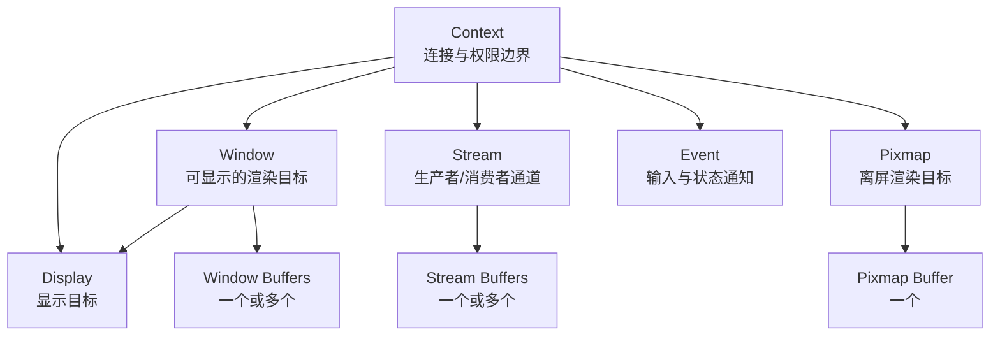
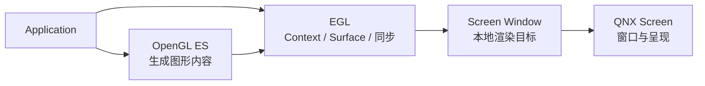
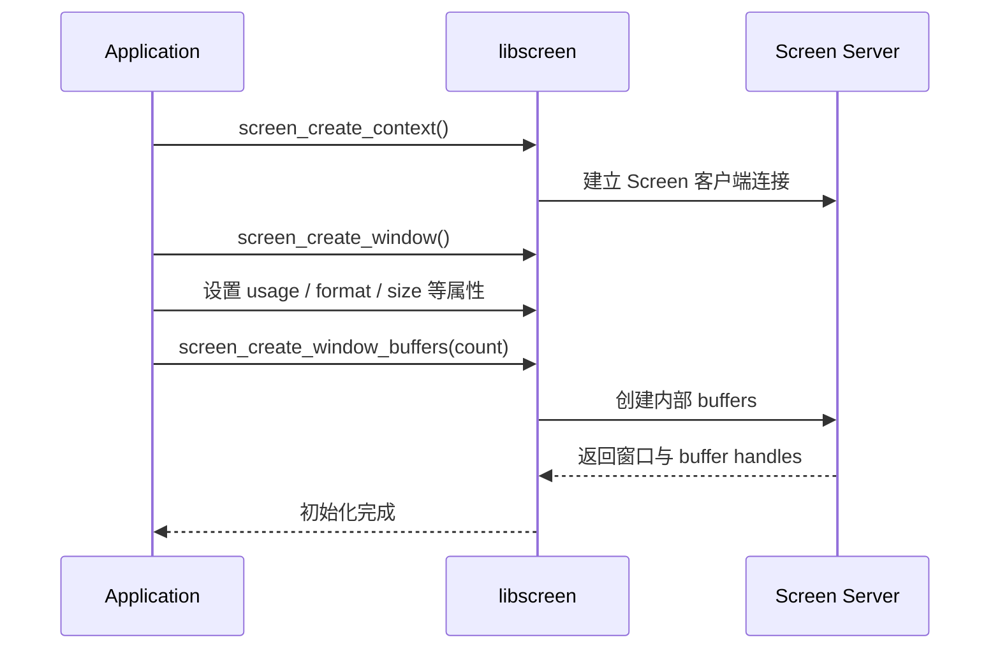
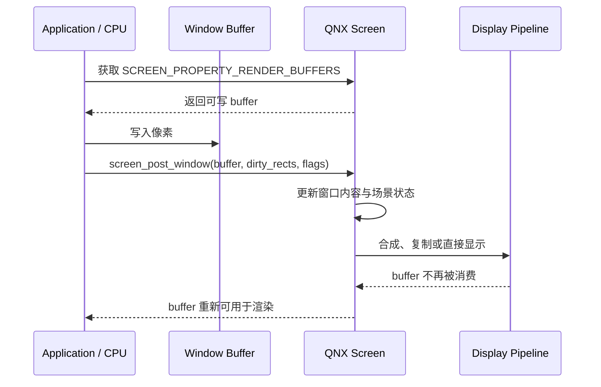
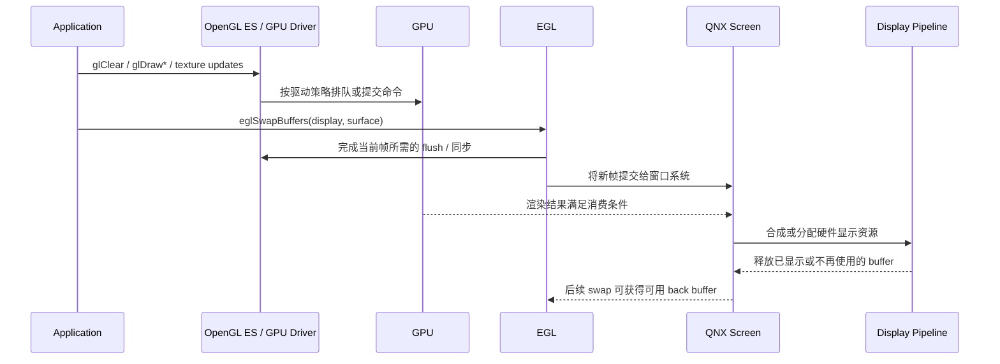
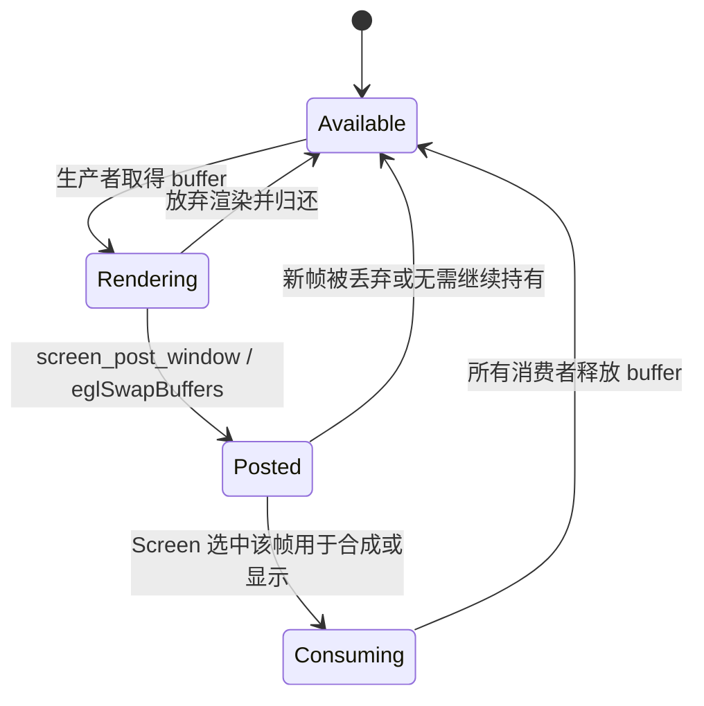

+++
date = '2026-08-27T00:00:00+08:00'
draft = false
title = 'QNX Screen 图形子系统：对象模型、缓冲区生命周期与显示流程'
tags = ['QNX', 'Screen', 'EGL', 'OpenGL ES', 'OpenWFD', 'Graphics']
+++

本文从应用开发者视角说明 QNX Screen 的对象模型，以及一帧图像从渲染缓冲区进入物理显示器的完整生命周期。内容以 QNX Screen 公共 API 契约为主，同时单独讨论 EGL/OpenGL ES 硬件渲染和 Qualcomm/OpenWFD 类平台的实现边界。

> **适用范围**：本文主要依据 QNX SDP 7.1 与 QNX OS 8.0 的 Screen 文档整理。不同 SDP 版本、GPU 厂商和 BSP 可能具有不同的内部实现；使用前应以目标 SDK 的头文件、`graphics.conf`、BSP 源码及设备运行态为准。

## 1. 核心结论

QNX Screen 是客户端/服务端图形框架。应用通过 `libscreen` 创建窗口和缓冲区，使用 CPU、Screen blit、OpenGL ES 或 Vulkan 等方式生成内容，再将完成的帧提交给 Screen。Screen 根据窗口状态和平台能力选择合成、复制或硬件直显，最终由显示控制器扫描输出。

理解这条链路，需要先区分四件事：

1. **渲染（rendering）**：生产像素，执行者可以是 CPU、GPU 或 blitter。
2. **提交（post）**：生产者声明某个 buffer 已完成，可交给 Screen 或其他消费者。
3. **呈现（presentation）**：Screen 选择合成或直显策略，使新内容进入显示管线。
4. **扫描输出（scanout）**：显示控制器按时序读取最终图像并发送到物理面板。

<figure id="qnx-screen-frame-architecture" style="margin:1.5rem 0">
<div style="overflow-x:auto">
<svg class="qnx-screen-overview" width="1180" height="940" viewBox="0 0 1180 940" role="img" aria-labelledby="qso-title qso-desc" xmlns="http://www.w3.org/2000/svg" font-family="Noto Sans CJK SC,Microsoft YaHei,sans-serif" fill="#0f172a" style="display:block;min-width:900px;max-width:100%;height:auto;margin:0 auto;background:#ffffff;border:1px solid #cbd5e1;border-radius:12px">
  <title id="qso-title">QNX Screen 单帧渲染与显示架构</title>
  <desc id="qso-desc">图中区分控制流、像素数据流、同步信号和缓冲区释放路径，展示应用、EGL、QNX Screen、GPU 驱动、OpenWFD、显示驱动、共享缓冲区、GPU、显示控制器和物理屏之间的一帧完整交互。</desc>
  <defs>
    <marker id="qso-arrow-control" viewBox="0 0 10 10" markerWidth="10" markerHeight="10" refX="9" refY="5" orient="auto" markerUnits="userSpaceOnUse">
      <path d="M0,0 L10,5 L0,10 Z" fill="#2563eb"/>
    </marker>
    <marker id="qso-arrow-data" viewBox="0 0 10 10" markerWidth="10" markerHeight="10" refX="9" refY="5" orient="auto" markerUnits="userSpaceOnUse">
      <path d="M0,0 L10,5 L0,10 Z" fill="#ea580c"/>
    </marker>
    <marker id="qso-arrow-sync" viewBox="0 0 10 10" markerWidth="10" markerHeight="10" refX="9" refY="5" orient="auto" markerUnits="userSpaceOnUse">
      <path d="M0,0 L10,5 L0,10 Z" fill="#7c3aed"/>
    </marker>
    <marker id="qso-arrow-release" viewBox="0 0 10 10" markerWidth="10" markerHeight="10" refX="9" refY="5" orient="auto" markerUnits="userSpaceOnUse">
      <path d="M0,0 L10,5 L0,10 Z" fill="#059669"/>
    </marker>
    <style>
      .qnx-screen-overview text { fill:#0f172a; font-family:Inter,"Noto Sans CJK SC","Microsoft YaHei",sans-serif; }
      .qnx-screen-overview .title { font-size:24px; font-weight:700; }
      .qnx-screen-overview .lane-title { font-size:16px; font-weight:700; }
      .qnx-screen-overview .node { fill:#ffffff; stroke:#475569; stroke-width:1.5; }
      .qnx-screen-overview .node-title { font-size:16px; font-weight:700; }
      .qnx-screen-overview .node-detail { font-size:13px; fill:#475569; }
      .qnx-screen-overview .edge-label { font-size:12.5px; font-weight:600; }
      .qnx-screen-overview .small { font-size:11.5px; fill:#64748b; }
      .qnx-screen-overview .control { fill:none; stroke:#2563eb; stroke-width:2.4; marker-end:url(#qso-arrow-control); }
      .qnx-screen-overview .data { fill:none; stroke:#ea580c; stroke-width:3.2; marker-end:url(#qso-arrow-data); }
      .qnx-screen-overview .sync { fill:none; stroke:#7c3aed; stroke-width:2.2; stroke-dasharray:7 5; marker-end:url(#qso-arrow-sync); }
      .qnx-screen-overview .release { fill:none; stroke:#059669; stroke-width:2.2; stroke-dasharray:4 5; marker-end:url(#qso-arrow-release); }
      .qnx-screen-overview .association { fill:none; stroke:#64748b; stroke-width:1.6; stroke-dasharray:3 4; }
      .qnx-screen-overview .badge { fill:#0f172a; }
      .qnx-screen-overview .badge-text { fill:#ffffff; font-size:11px; font-weight:700; text-anchor:middle; dominant-baseline:middle; }
    </style>
  </defs>

  <rect x="0" y="0" width="1180" height="940" rx="12" fill="#ffffff"/>
  <text class="title" x="590" y="34" text-anchor="middle">QNX Screen：一帧图像的控制流、数据流与同步关系</text>

  <!-- Legend -->
  <line x1="250" y1="59" x2="300" y2="59" class="control" stroke="#2563eb" stroke-width="2.4" marker-end="url(#qso-arrow-control)"/>
  <text class="small" x="310" y="63">控制流 / API 调用</text>
  <line x1="445" y1="59" x2="495" y2="59" class="data" stroke="#ea580c" stroke-width="3.2" marker-end="url(#qso-arrow-data)"/>
  <text class="small" x="505" y="63">像素数据流</text>
  <line x1="625" y1="59" x2="675" y2="59" class="sync" stroke="#7c3aed" stroke-width="2.2" stroke-dasharray="7 5" marker-end="url(#qso-arrow-sync)"/>
  <text class="small" x="685" y="63">同步 / 完成信号</text>
  <line x1="825" y1="59" x2="875" y2="59" class="release" stroke="#059669" stroke-width="2.2" stroke-dasharray="4 5" marker-end="url(#qso-arrow-release)"/>
  <text class="small" x="885" y="63">Buffer 释放 / 复用</text>

  <!-- Layer backgrounds -->
  <rect x="20" y="82" width="1140" height="172" rx="10" fill="#eff6ff" stroke="#60a5fa" stroke-width="1.5"/>
  <text class="lane-title" x="38" y="107" fill="#1d4ed8">① 应用与图形 API（User Space）</text>

  <rect x="20" y="270" width="1140" height="174" rx="10" fill="#f0fdf4" stroke="#4ade80" stroke-width="1.5"/>
  <text class="lane-title" x="38" y="295" fill="#15803d">② QNX Screen 窗口系统</text>

  <rect x="20" y="460" width="1140" height="188" rx="10" fill="#fff7ed" stroke="#fb923c" stroke-width="1.5"/>
  <text class="lane-title" x="38" y="485" fill="#c2410c">③ 图形与显示服务（平台实现层）</text>
  <rect x="374" y="493" width="756" height="132" rx="8" fill="none" stroke="#f97316" stroke-width="1.3" stroke-dasharray="7 5"/>
  <text class="small" x="1120" y="511" text-anchor="end">OpenWFD / IPC / 进程边界由 BSP 决定</text>

  <rect x="20" y="664" width="1140" height="202" rx="10" fill="#f8fafc" stroke="#94a3b8" stroke-width="1.5"/>
  <text class="lane-title" x="38" y="689">④ Hardware 与共享图形内存</text>

  <!-- Nodes: application layer -->
  <rect class="node" x="70" y="132" width="280" height="82" rx="8" fill="#ffffff" stroke="#475569" stroke-width="1.5"/>
  <text class="node-title" x="210" y="160" text-anchor="middle">QNX Application</text>
  <text class="node-detail" x="210" y="183" text-anchor="middle">HMI / Qt / Native Screen Client</text>
  <text class="node-detail" x="210" y="201" text-anchor="middle">窗口配置、业务逻辑、帧生产</text>

  <rect class="node" x="465" y="132" width="300" height="82" rx="8" fill="#ffffff" stroke="#475569" stroke-width="1.5"/>
  <text class="node-title" x="615" y="160" text-anchor="middle">Graphics API</text>
  <text class="node-detail" x="615" y="183" text-anchor="middle">OpenGL ES + EGL</text>
  <text class="node-detail" x="615" y="201" text-anchor="middle">GL 命令、Context、EGLSurface、Swap</text>

  <rect class="node" x="880" y="132" width="220" height="82" rx="8" fill="#ffffff" stroke="#475569" stroke-width="1.5"/>
  <text class="node-title" x="990" y="160" text-anchor="middle">Software / Blit</text>
  <text class="node-detail" x="990" y="183" text-anchor="middle">CPU 写像素或 Screen blit</text>
  <text class="node-detail" x="990" y="201" text-anchor="middle">与 EGL 路径二选一或混合</text>

  <!-- Nodes: Screen layer -->
  <rect class="node" x="390" y="316" width="400" height="94" rx="8" fill="#ffffff" stroke="#475569" stroke-width="1.5"/>
  <text class="node-title" x="590" y="345" text-anchor="middle">QNX Screen（libscreen + Screen Server）</text>
  <text class="node-detail" x="590" y="369" text-anchor="middle">Window / Buffer Queue / Scene State</text>
  <text class="node-detail" x="590" y="390" text-anchor="middle">可见性、z-order、合成或硬件直显决策</text>

  <rect class="node" x="865" y="316" width="245" height="94" rx="8" fill="#ffffff" stroke="#475569" stroke-width="1.5"/>
  <text class="node-title" x="987" y="345" text-anchor="middle">Present Scheduler</text>
  <text class="node-detail" x="987" y="369" text-anchor="middle">Swap Interval / VSYNC</text>
  <text class="node-detail" x="987" y="390" text-anchor="middle">选择待显示帧与提交时机</text>

  <!-- Nodes: implementation layer -->
  <rect class="node" x="75" y="522" width="245" height="82" rx="8" fill="#ffffff" stroke="#475569" stroke-width="1.5"/>
  <text class="node-title" x="197" y="550" text-anchor="middle">GPU Driver</text>
  <text class="node-detail" x="197" y="573" text-anchor="middle">命令队列、内存映射、同步</text>
  <text class="node-detail" x="197" y="591" text-anchor="middle">厂商 EGL / GLES 实现</text>

  <rect class="node" x="405" y="522" width="250" height="82" rx="8" fill="#ffffff" stroke="#475569" stroke-width="1.5"/>
  <text class="node-title" x="530" y="550" text-anchor="middle">OpenWFD Client</text>
  <text class="node-detail" x="530" y="573" text-anchor="middle">Device / Port / Pipeline API</text>
  <text class="node-detail" x="530" y="591" text-anchor="middle">平台存在时的显示适配层</text>

  <rect class="node" x="755" y="522" width="335" height="82" rx="8" fill="#ffffff" stroke="#475569" stroke-width="1.5"/>
  <text class="node-title" x="922" y="550" text-anchor="middle">OpenWFD Server / Display Driver</text>
  <text class="node-detail" x="922" y="573" text-anchor="middle">绑定 Source 与 Pipeline，提交图层状态</text>
  <text class="node-detail" x="922" y="591" text-anchor="middle">硬件资源分配、格式/缩放/混合配置</text>

  <!-- Nodes: hardware/data layer -->
  <rect class="node" x="80" y="724" width="210" height="82" rx="8" fill="#ffffff" stroke="#475569" stroke-width="1.5"/>
  <text class="node-title" x="185" y="754" text-anchor="middle">GPU</text>
  <text class="node-detail" x="185" y="778" text-anchor="middle">执行 shader 与光栅化</text>
  <text class="node-detail" x="185" y="796" text-anchor="middle">异步生成像素</text>

  <rect class="node" x="370" y="714" width="285" height="102" rx="8" fill="#ffffff" stroke="#475569" stroke-width="1.5"/>
  <text class="node-title" x="512" y="744" text-anchor="middle">Shared Graphics Buffers</text>
  <text class="node-detail" x="512" y="768" text-anchor="middle">screen_buffer_t / EGL Back Buffer</text>
  <text class="node-detail" x="512" y="789" text-anchor="middle">双缓冲或三缓冲；保存最终像素</text>
  <text class="small" x="512" y="806" text-anchor="middle">分配器、连续性与 DMA 映射由平台决定</text>

  <rect class="node" x="755" y="724" width="255" height="82" rx="8" fill="#ffffff" stroke="#475569" stroke-width="1.5"/>
  <text class="node-title" x="882" y="754" text-anchor="middle">Display Controller / DPU</text>
  <text class="node-detail" x="882" y="778" text-anchor="middle">Layer Mixer / Overlay / Scanout</text>
  <text class="node-detail" x="882" y="796" text-anchor="middle">按显示时序读取像素</text>

  <rect class="node" x="1050" y="724" width="90" height="82" rx="8" fill="#ffffff" stroke="#475569" stroke-width="1.5"/>
  <text class="node-title" x="1095" y="754" text-anchor="middle">Panel</text>
  <text class="node-detail" x="1095" y="779" text-anchor="middle">DSI / DP</text>
  <text class="node-detail" x="1095" y="797" text-anchor="middle">HDMI</text>

  <!-- 1: create window and buffers -->
  <path class="control" d="M210 214 C210 270 390 269 445 316" fill="none" stroke="#2563eb" stroke-width="2.4" marker-end="url(#qso-arrow-control)"/>
  <circle class="badge" cx="243" cy="250" r="11"/><text class="badge-text" x="243" y="250">1</text>
  <text class="edge-label" x="260" y="246" fill="#2563eb">创建 Window、设置属性</text>
  <text class="small" x="260" y="264">screen_create_window_buffers(n)</text>

  <!-- 2: return handles -->
  <path class="control" d="M390 345 C320 326 283 272 273 214" fill="none" stroke="#2563eb" stroke-width="2.4" marker-end="url(#qso-arrow-control)"/>
  <circle class="badge" cx="322" cy="306" r="11"/><text class="badge-text" x="322" y="306">2</text>
  <text class="edge-label" x="108" y="304" fill="#2563eb">返回 Window / Buffer Handle</text>

  <!-- Buffer ownership association -->
  <path class="association" d="M590 410 L590 675 Q590 695 570 714" fill="none" stroke="#64748b" stroke-width="1.6" stroke-dasharray="3 4"/>
  <text class="small" x="600" y="649">Screen 管理 Window 与 Buffer 的关联</text>

  <!-- 3: application issues GL calls -->
  <path class="control" d="M350 173 L465 173" fill="none" stroke="#2563eb" stroke-width="2.4" marker-end="url(#qso-arrow-control)"/>
  <circle class="badge" cx="385" cy="153" r="11"/><text class="badge-text" x="385" y="153">3</text>
  <text class="edge-label" x="375" y="196" fill="#2563eb">glDraw* / eglSwapBuffers()</text>

  <!-- 4: GL/EGL to GPU driver -->
  <path class="control" d="M535 214 C505 385 265 385 218 522" fill="none" stroke="#2563eb" stroke-width="2.4" marker-end="url(#qso-arrow-control)"/>
  <circle class="badge" cx="410" cy="358" r="11"/><text class="badge-text" x="410" y="358">4</text>
  <text class="edge-label" x="210" y="438" fill="#2563eb">提交/刷新 GPU 命令</text>

  <!-- 5: driver programs GPU -->
  <path class="control" d="M185 604 L185 724" fill="none" stroke="#2563eb" stroke-width="2.4" marker-end="url(#qso-arrow-control)"/>
  <circle class="badge" cx="202" cy="648" r="11"/><text class="badge-text" x="202" y="648">5</text>
  <text class="edge-label" x="213" y="683" fill="#2563eb">执行命令</text>

  <!-- 6: GPU writes pixels -->
  <path class="data" d="M290 765 L370 765" fill="none" stroke="#ea580c" stroke-width="3.2" marker-end="url(#qso-arrow-data)"/>
  <circle class="badge" cx="330" cy="743" r="11"/><text class="badge-text" x="330" y="743">6</text>
  <text class="edge-label" x="303" y="794" fill="#ea580c">写入像素</text>

  <!-- 7A: EGL path posts frame -->
  <path class="control" d="M615 214 L615 316" fill="none" stroke="#2563eb" stroke-width="2.4" marker-end="url(#qso-arrow-control)"/>
  <circle class="badge" cx="632" cy="260" r="11"/><text class="badge-text" x="632" y="260">7</text>
  <text class="edge-label" x="648" y="252" fill="#2563eb">EGL 窗口表面提交</text>
  <text class="small" x="648" y="270">eglSwapBuffers()</text>

  <!-- 7B: software path posts frame -->
  <path class="control" d="M930 214 C915 268 790 278 742 316" fill="none" stroke="#2563eb" stroke-width="2.4" marker-end="url(#qso-arrow-control)"/>
  <circle class="badge" cx="849" cy="270" r="11"/><text class="badge-text" x="849" y="270">7</text>
  <text class="edge-label" x="875" y="291" fill="#2563eb">screen_post_window()</text>

  <!-- Screen to scheduler -->
  <path class="control" d="M790 363 L865 363" fill="none" stroke="#2563eb" stroke-width="2.4" marker-end="url(#qso-arrow-control)"/>
  <text class="small" x="802" y="350">场景更新 / present 请求</text>

  <!-- 8: Screen to OpenWFD -->
  <path class="control" d="M530 410 L530 522" fill="none" stroke="#2563eb" stroke-width="2.4" marker-end="url(#qso-arrow-control)"/>
  <circle class="badge" cx="547" cy="458" r="11"/><text class="badge-text" x="547" y="458">8</text>
  <text class="edge-label" x="560" y="472" fill="#2563eb">显示提交</text>

  <!-- 9: OpenWFD client to server -->
  <path class="control" d="M655 563 L755 563" fill="none" stroke="#2563eb" stroke-width="2.4" marker-end="url(#qso-arrow-control)"/>
  <circle class="badge" cx="705" cy="542" r="11"/><text class="badge-text" x="705" y="542">9</text>
  <text class="edge-label" x="675" y="590" fill="#2563eb">绑定 Source / Pipeline</text>

  <!-- 10: display service to controller -->
  <path class="control" d="M882 604 L882 724" fill="none" stroke="#2563eb" stroke-width="2.4" marker-end="url(#qso-arrow-control)"/>
  <circle class="badge" cx="899" cy="650" r="11"/><text class="badge-text" x="899" y="650">10</text>
  <text class="edge-label" x="912" y="683" fill="#2563eb">提交硬件状态</text>

  <!-- 11: buffer scanout data -->
  <path class="data" d="M655 765 L755 765" fill="none" stroke="#ea580c" stroke-width="3.2" marker-end="url(#qso-arrow-data)"/>
  <circle class="badge" cx="705" cy="743" r="11"/><text class="badge-text" x="705" y="743">11</text>
  <text class="edge-label" x="674" y="794" fill="#ea580c">读取图层像素</text>

  <!-- 12: pixel stream to panel -->
  <path class="data" d="M1010 765 L1050 765" fill="none" stroke="#ea580c" stroke-width="3.2" marker-end="url(#qso-arrow-data)"/>
  <circle class="badge" cx="1030" cy="743" r="11"/><text class="badge-text" x="1030" y="743">12</text>
  <text class="edge-label" x="1005" y="827" fill="#ea580c">扫描输出到物理屏</text>

  <!-- Synchronization: render complete before consumption -->
  <path class="sync" d="M272 724 C315 655 420 642 486 604" fill="none" stroke="#7c3aed" stroke-width="2.2" stroke-dasharray="7 5" marker-end="url(#qso-arrow-sync)"/>
  <text class="edge-label" x="300" y="640" fill="#7c3aed">渲染完成 / Acquire Fence</text>
  <text class="small" x="333" y="657">具体同步对象由平台决定</text>

  <!-- Present/release and buffer reuse -->
  <path class="release" d="M1008 724 C1142 687 1138 390 1110 364" fill="none" stroke="#059669" stroke-width="2.2" stroke-dasharray="4 5" marker-end="url(#qso-arrow-release)"/>
  <text class="edge-label" x="1000" y="654" fill="#059669">Present / Release</text>
  <path class="release" d="M865 390 C824 432 785 433 742 410" fill="none" stroke="#059669" stroke-width="2.2" stroke-dasharray="4 5" marker-end="url(#qso-arrow-release)"/>
  <path class="release" d="M420 410 C342 435 205 342 197 214" fill="none" stroke="#059669" stroke-width="2.2" stroke-dasharray="4 5" marker-end="url(#qso-arrow-release)"/>
  <text class="edge-label" x="87" y="420" fill="#059669">Buffer 释放后重新进入可渲染集合</text>

  <!-- Footer -->
  <rect x="38" y="884" width="1104" height="36" rx="6" fill="#f1f5f9"/>
  <text x="590" y="907" text-anchor="middle" class="node-detail">步骤 1–2 为初始化；步骤 3–12 为每帧循环。OpenWFD、IPC、Fence 与硬件 Pipeline 均需以目标 BSP 为准。</text>
</svg>
</div>
<figcaption style="margin-top:.65rem;text-align:center;color:#64748b;font-size:.9rem">图 1　QNX Screen 单帧总览：蓝色表示 API/控制流，橙色表示真实像素数据流，紫色虚线表示渲染同步，绿色虚线表示显示完成后的 Buffer 释放与复用。</figcaption>
</figure>

需要特别注意：

- `screen_post_window()` 表示“请求使窗口内容可见”，不等同于立即显示。
- `eglSwapBuffers()` 是 EGL 窗口表面的帧提交接口，不意味着 GPU 一定从此刻才开始执行。
- Screen 可能复制 buffer，也可能切换 buffer；不能将所有呈现都描述成 pointer flip。
- buffer 的分配器、物理连续性、DMA 映射、Fence 和驱动 IPC 都属于平台实现，不能从公共 API 名称直接推导。

## 2. QNX Screen 对象模型

### 2.1 核心对象

| 对象 | 类型 | 主要职责 | 常用操作 |
|---|---|---|---|
| Context | `screen_context_t` | 应用与 Screen 服务之间的连接，也是对象发现和事件处理的作用域 | `screen_create_context()`、`screen_destroy_context()` |
| Display | `screen_display_t` | 表示物理或虚拟显示设备，提供分辨率、刷新模式和亮度等属性 | `screen_get_display_property_*()` |
| Window | `screen_window_t` | 面向显示的渲染目标，保存位置、尺寸、格式、可见性和 z-order 等状态 | `screen_create_window()`、`screen_set_window_property_*()` |
| Buffer | `screen_buffer_t` | 保存像素内容的内存对象 | `screen_get_buffer_property_*()` |
| Stream | `screen_stream_t` | 在生产者与一个或多个消费者之间传递 buffer | `screen_create_stream()`、`screen_post_stream()` |
| Pixmap | `screen_pixmap_t` | 单 buffer 的离屏渲染目标，本身不直接显示 | `screen_create_pixmap()`、`screen_create_pixmap_buffer()` |
| Event | `screen_event_t` | 传递输入、对象生命周期和显示变化等事件 | `screen_get_event()` |

### 2.2 对象关系



Window 和 Stream 通常可以关联多个 buffer，以支持多缓冲；Pixmap 只关联一个 buffer。一个 buffer 是否能被 CPU 访问、GPU 渲染、用作视频输入或进入显示管线，取决于创建前设置的 `SCREEN_PROPERTY_USAGE` 以及平台能力。

## 3. 图形栈分层与职责

### 3.1 通用分层

| 层次 | 典型组件 | 职责 |
|---|---|---|
| 应用层 | HMI、仪表、Qt 或原生 Screen 应用 | 创建窗口、生成内容、提交帧、处理事件 |
| 渲染 API | OpenGL ES、Vulkan、Screen blit、软件渲染器 | 将业务内容转换为像素 |
| 平台接口 | EGL、Vulkan WSI | 将渲染上下文和 Screen 渲染目标连接起来 |
| 窗口系统 | QNX Screen、`libscreen` | 管理对象、buffer、窗口状态、合成与呈现 |
| 显示实现 | 合成器、显示驱动、厂商显示服务 | 选择 GPU 合成或硬件 plane，配置显示管线 |
| 硬件 | GPU、blitter、Display Controller、Panel | 渲染、搬运、混合、扫描输出 |

### 3.2 OpenGL ES、EGL 与 Screen 的关系

- **OpenGL ES** 定义如何绘制，包括 shader、texture、blend 和 draw call。
- **EGL** 管理渲染上下文、EGLSurface，以及渲染 API 与本地窗口系统之间的连接。
- **QNX Screen** 提供本地窗口、buffer、显示目标和呈现服务。



可以将三者概括为：OpenGL ES 决定“画什么、怎样画”，EGL 决定“在哪个上下文和表面上画”，Screen 决定“窗口内容如何进入系统显示场景”。

## 4. 窗口与 Buffer 初始化

初始化发生在创建窗口或重建显示资源时，不属于每帧都重复执行的渲染循环。

### 4.1 初始化顺序



典型步骤如下：

1. 使用 `screen_create_context()` 创建具有适当权限的 Context。
2. 使用 `screen_create_window()` 创建 Window。
3. 设置 `SCREEN_PROPERTY_USAGE`、`SCREEN_PROPERTY_FORMAT`、尺寸、位置和 swap interval 等属性。
4. 使用 `screen_create_window_buffers()` 创建一个或多个内部 buffer，或使用 attach API 关联外部 buffer。
5. 若采用 OpenGL ES，再创建 EGLDisplay、EGLConfig、EGLContext 和绑定 Screen Window 的 EGLSurface。

### 4.2 Buffer 数量

| 模式 | 特点 | 典型影响 |
|---|---|---|
| 单缓冲 | 生产者和消费者竞争同一 buffer | 容易发生等待或撕裂，适用范围有限 |
| 双缓冲 | 一块用于渲染，一块由消费者使用 | 延迟与吞吐的常见平衡 |
| 三缓冲 | 在生产者和消费者之间增加排队余量 | 可减少等待，但可能增加排队延迟和内存占用 |

应用不应假定创建了 N 个 buffer 就始终有 N 个 buffer 可写。应通过 `SCREEN_PROPERTY_RENDER_BUFFER_COUNT` 和 `SCREEN_PROPERTY_RENDER_BUFFERS` 获取当前可用于渲染的集合；一次 post 可能改变该集合。

### 4.3 内部 Buffer 与外部 Buffer

- `screen_create_window_buffers()` 创建由 Screen 管理内存的内部 buffer。
- 应用或驱动也可以自行创建并分配外部 buffer，再使用 `screen_attach_window_buffers()` 关联到 Window。
- 外部 buffer 必须满足格式、尺寸、stride、usage 和硬件访问等约束。

公共 API 不保证所有 buffer 都物理连续，也不保证所有窗口都能直接 scanout。可通过相应属性查询 buffer 的实际特征；具体内存 heap、IOMMU 和 DMA 映射路径由 BSP 决定。

## 5. 单帧生命周期

### 5.1 软件渲染路径

软件渲染由 CPU 直接写入 Window Buffer。每一帧的基本循环为：

1. 获取当前可渲染 buffer。
2. 获取 buffer 的 CPU 地址与 stride。
3. 写入像素。
4. 调用 `screen_post_window()` 提交完整 buffer 或 dirty rectangles。
5. 重新获取下一块可用 render buffer。



### 5.2 EGL/OpenGL ES 路径

OpenGL ES 路径由 EGLSurface 包装 Screen Window。应用调用 GL API 产生绘制工作，并使用 `eglSwapBuffers()` 提交新帧。



`eglSwapBuffers()` 不是“把整批 GL 命令第一次发送给 GPU”的同义词。GL 命令何时开始执行、swap 何时返回以及 post 何时实际发生，取决于 GPU 架构、EGL 驱动和 Screen 实现。

如果应用需要提交局部更新，基础 `eglSwapBuffers()` 没有 dirty rectangle 参数；可在目标实现支持时使用 `EGL_EXT_swap_buffers_with_damage` 或等效扩展。

### 5.3 Buffer 状态机

从生产者视角，可以将 buffer 生命周期抽象为以下状态：



关键约束是：调用 post 后，生产者不得继续写入已经交给消费者的 buffer。只有当该 buffer 再次进入可渲染集合后，生产者才能覆盖其内容。

## 6. `screen_post_window()` 语义

### 6.1 API 原型

```c
int screen_post_window(screen_window_t win,
                       screen_buffer_t buf,
                       int count,
                       const int *dirty_rects,
                       int flags);
```

该函数请求 Screen 将 `buf` 中发生变化的内容用于窗口显示。窗口至少成功 post 一次后才可能可见。

| 参数 | 含义 |
|---|---|
| `win` | 目标 Window |
| `buf` | 包含本次更新内容的渲染 buffer |
| `count` | dirty rectangle 数量；`0` 表示整个 buffer 发生变化 |
| `dirty_rects` | `{x, y, width, height}` 数组；`count == 0` 时可为 `NULL` |
| `flags` | 控制等待、非阻塞和显式入队行为 |

### 6.2 Dirty Rectangle

Dirty rectangle 是优化提示，而不是“Screen 只会读取这些像素”的安全边界。Screen 仍可能使用完整 buffer，因此应用必须保证整个 buffer 在任何一次 post 时都包含可显示内容。

### 6.3 返回与阻塞行为

| flags | 主要语义 | 应用注意事项 |
|---|---|---|
| `0` | 遵守窗口 swap interval；存在可用 render buffer 时可以返回 | 返回后重新查询可用 buffer，不复用刚提交的 handle |
| `SCREEN_WAIT_IDLE` | 等待显示更新，并等待至少一个 render buffer 可用 | 适合需要确定完成点的场景，但可能增加延迟 |
| `SCREEN_DONT_BLOCK` | 无论当前是否有可用 render buffer 都立即返回 | 后续应使用 dequeue API 等待或取得 buffer |
| `SCREEN_EXPLICIT_ENQUEUE` | post 后保持 buffer 为 dequeued，直到生产者显式 enqueue 且消费者释放 | 适合生产者 post 后仍需只读访问 buffer 的流程 |

不同 QNX 版本支持的 flags 和细节可能不同，应以目标 SDK 的 `screen.h` 为准。

### 6.4 Copy、Composition 与 Flip

`screen_post_window()` 的结果可能包括：

- Screen 将窗口内容合成到系统 framebuffer；
- 硬件 blitter 完成复制、缩放或格式转换；
- 窗口 buffer 被分配到硬件 overlay/pipeline；
- 显示实现执行 buffer flip 或等效的原子提交；
- 当前帧由于场景更新或节奏控制而未被最终显示。

因此，“post 等于修改显示控制器物理地址”只能作为特定硬件路径的实现说明，不能作为 API 语义。

## 7. 同步、VSYNC 与时序

### 7.1 三个并行主体

图形系统中通常存在三个相互并行的主体：

- CPU 产生应用逻辑和渲染命令；
- GPU 或 blitter 生成、合成或搬运像素；
- Display Controller 以固定显示时序扫描输出。

多缓冲让三者能够流水执行，但也引入了两个必要条件：

1. 消费者读取 buffer 前，生产者必须完成写入。
2. 生产者再次覆盖 buffer 前，所有消费者必须完成读取或释放。

### 7.2 Fence 的正确表述

平台可以使用 EGL 同步对象、native fence、驱动私有同步原语或隐式同步来满足上述约束。但 QNX Screen 的通用 post 流程不能仅凭 API 名称推导出固定的 Fence 创建者、句柄格式和传递链。

描述某个平台的 Fence 时，应至少回答：

- 哪个 API 或驱动创建 acquire/release fence；
- fence 句柄存放在哪个对象或协议字段中；
- Screen、合成器和显示驱动分别等待哪个 fence；
- buffer 在哪个事件后重新归还生产者；
- 结论来自头文件、源码、符号分析还是运行态 trace。

### 7.3 VSYNC 与 Swap Interval

VSYNC 表示显示刷新时序事件；swap interval 表示应用希望帧交换与刷新间隔之间的关系。二者会影响帧 pacing 和接口等待时间，但不能保证每次 swap 都对应一帧实际显示。生产速度高于消费速度时，系统可能让生产者等待、排队或丢弃中间帧，具体策略由实现决定。

## 8. Qualcomm/OpenWFD 平台实现边界

部分 Qualcomm 座舱 BSP 使用 OpenWF Display/OpenWFD 风格的 Device、Port 和 Pipeline 对象，将多个显示客户端的 buffer 提交给 DPU。[图 1](#qnx-screen-frame-architecture) 中的步骤 8～10 表示这条平台控制流：Screen 发起显示提交，OpenWFD Client 绑定 Source 与 Pipeline，OpenWFD Server 或 Display Driver 再将图层状态提交给 DPU。步骤 11～12 表示独立于控制命令的像素数据流：DPU 从共享图形 buffer 读取像素并扫描输出到面板。

OpenWFD、IPC、buffer allocator 和硬件 Pipeline 位于平台实现层，不是 QNX Screen 公共 API 的固定组成。不同项目可能使用不同的进程模型、IPC、DPU 抽象或硬件所有权设计。

## 9. 最小软件渲染示例

下面的代码展示 Screen Window 的基本生命周期。为突出流程，省略了错误处理、事件循环和资源销毁细节；生产代码必须检查每个 API 的返回值。

```c
#include <screen/screen.h>
#include <string.h>

int main(void)
{
    screen_context_t ctx = NULL;
    screen_window_t win = NULL;
    screen_buffer_t buffers[2] = { NULL, NULL };

    int usage = SCREEN_USAGE_WRITE;
    int format = SCREEN_FORMAT_RGBX8888;
    int size[2] = { 1280, 720 };

    screen_create_context(&ctx, SCREEN_APPLICATION_CONTEXT);
    screen_create_window(&win, ctx);

    screen_set_window_property_iv(win, SCREEN_PROPERTY_USAGE, &usage);
    screen_set_window_property_iv(win, SCREEN_PROPERTY_FORMAT, &format);
    screen_set_window_property_iv(win, SCREEN_PROPERTY_BUFFER_SIZE, size);
    screen_create_window_buffers(win, 2);

    screen_get_window_property_pv(
        win,
        SCREEN_PROPERTY_RENDER_BUFFERS,
        (void **)buffers);

    void *pixels = NULL;
    int stride = 0;
    screen_get_buffer_property_pv(
        buffers[0], SCREEN_PROPERTY_POINTER, &pixels);
    screen_get_buffer_property_iv(
        buffers[0], SCREEN_PROPERTY_STRIDE, &stride);

    /* 示例：将整个 buffer（包括每行 padding）填充为白色。 */
    memset(pixels, 0xff, stride * size[1]);

    screen_post_window(win, buffers[0], 0, NULL, 0);

    /* 实际应用在此进入事件与渲染循环。 */

    screen_destroy_window(win);
    screen_destroy_context(ctx);
    return 0;
}
```

持续渲染时，不应永久缓存 `buffers[0]` 并反复覆盖。每轮都应根据目标版本推荐的 buffer 管理方式重新查询或 dequeue 可用 buffer。

## 10. EGL/OpenGL ES 初始化骨架

下面只展示 Screen 与 EGL 的连接关系，不包含完整的 EGLConfig 选择和 shader 初始化：

```c
screen_context_t screen_ctx;
screen_window_t screen_win;

screen_create_context(&screen_ctx, SCREEN_APPLICATION_CONTEXT);
screen_create_window(&screen_win, screen_ctx);

int usage = SCREEN_USAGE_OPENGL_ES2;
int format = SCREEN_FORMAT_RGBA8888;
int interval = 1;

screen_set_window_property_iv(
    screen_win, SCREEN_PROPERTY_USAGE, &usage);
screen_set_window_property_iv(
    screen_win, SCREEN_PROPERTY_FORMAT, &format);
screen_set_window_property_iv(
    screen_win, SCREEN_PROPERTY_SWAP_INTERVAL, &interval);
screen_create_window_buffers(screen_win, 2);

EGLDisplay egl_display = eglGetDisplay(EGL_DEFAULT_DISPLAY);
eglInitialize(egl_display, NULL, NULL);

/* 选择与 Screen Window 匹配的 EGLConfig，创建 EGLContext。 */
EGLSurface egl_surface = eglCreateWindowSurface(
    egl_display,
    egl_config,
    (EGLNativeWindowType)screen_win,
    NULL);

eglMakeCurrent(
    egl_display,
    egl_surface,
    egl_surface,
    egl_context);

while (running) {
    glClear(GL_COLOR_BUFFER_BIT);
    /* glUseProgram(), glDraw*(), ... */
    eglSwapBuffers(egl_display, egl_surface);
}
```

EGLConfig 至少应与 Window 的 surface 类型、颜色格式和目标 OpenGL ES 版本匹配。不能简单地选择返回列表中的第一个配置；颜色位数、depth/stencil、MSAA 和格式都会影响兼容性、内存占用与带宽。

## 11. 诊断方法

### 11.1 分层定位

| 现象 | 优先检查 |
|---|---|
| Window 从未显示 | 是否成功 post、可见性、尺寸、位置、z-order、目标 Display |
| 画面全黑或颜色异常 | pixel format、stride、alpha、颜色通道顺序、buffer 是否完整初始化 |
| 首帧正常，后续闪烁 | 是否写入仍被消费的 buffer、是否每帧重新获取可用 buffer |
| 帧率低或 swap 阻塞 | buffer 数、swap interval、GPU 时间、合成路径和消费者释放时延 |
| 局部更新出现残影 | dirty rectangles 是否正确、buffer 其他区域是否保持有效 |
| GL API 正常但没有画面 | EGLConfig、EGLSurface、`eglMakeCurrent()`、swap 返回值及 Screen Window 状态 |
| Screen 场景正常但物理屏异常 | 显示驱动、mode、pipeline、panel link 和硬件时序 |

### 11.2 QNX 工具

目标镜像包含相应组件时，可以使用：

```sh
# 查看 Screen 系统日志
slog2info

# 解码 Screen 请求环形缓冲区
screeninfo /dev/screen/requests

# 查看指定显示 framebuffer 的 blit 记录；实际编号以设备为准
screeninfo /dev/screen/0/blt-1

# 枚举 EGL 配置
egl-configs

# 抓取显示输出；参数以目标版本为准
screenshot
```

还可以通过 `SCREEN_PROPERTY_METRICS`、`SCREEN_PROPERTY_DEBUG`、`gltracelogger` 和 `gltraceprinter` 分析窗口提交、GPU 调用及合成行为。部分调试能力依赖 `screen-debug.so` 或 `graphics.conf` 中开启的日志项，不应假设量产镜像默认具备。

### 11.3 推荐核验记录

为了让分析结果可以复现，应记录：

- QNX SDP、Screen 和 GPU 驱动版本；
- SoC、GPU、DPU 与显示接口；
- `graphics.conf` 关键配置；
- Window 的 usage、format、size、buffer count 和 swap interval；
- 应用使用的软件、blit、OpenGL ES、Vulkan 或混合渲染路径；
- 日志和 trace 的采集时间、命令与原始文件；
- OpenWFD、DMA-BUF、Fence 等平台结论的证据来源。

## 12. 常见误区

### 12.1 `Framebuffer` 是否就是物理屏的最终帧？

不一定。文章中的 framebuffer 应明确指 EGL/OpenGL framebuffer、Window render buffer，还是 Screen 合成后的 display framebuffer。硬件 overlay 存在时，某个软件 framebuffer 可能并不包含物理屏上的所有图层。

### 12.2 `eglSwapBuffers()` 是否一定交换两个物理地址？

不一定。它是 EGL 的窗口表面提交操作。底层可以采用多种 buffer 管理和呈现策略，实际行为由 EGL、Screen 和显示驱动共同决定。

### 12.3 `screen_post_window()` 返回是否表示画面已经显示？

不一定。返回条件受 flags、swap interval、可用 render buffer 和显示路径影响。需要确定显示完成语义时，应查阅目标版本文档并选择适当的同步接口。

### 12.4 Double Buffer 是否始终不会阻塞？

不会。若一块 buffer 正在渲染、另一块仍被消费者持有，则生产者没有可用 buffer，相关 API 仍可能等待。

### 12.5 所有 Window 是否都会由 GPU 合成？

不一定。Screen 或平台显示实现可能使用 GPU 合成、blitter、硬件 overlay/pipeline，或几种方式的组合。选择结果通常受格式、缩放、旋转、透明度、z-order、安全属性及硬件资源限制影响。

## 13. 术语表

| 术语 | 含义 |
|---|---|
| Render Target | 接收渲染结果的目标，例如 Window、Stream 或 Pixmap |
| Render Buffer | 当前可供生产者写入的 buffer |
| Front Buffer | 已提交并可供消费者访问的 buffer；不一定已经被物理显示 |
| Post | 将完成的 buffer 提交给 Screen 或 Stream 消费者 |
| Composition | 将多个图层组合成最终图像的过程 |
| Overlay/Pipeline | 显示控制器可独立读取和混合的一路硬件输入抽象 |
| Scanout | 显示控制器按显示时序读取像素并输出到接口 |
| Swap Interval | EGL/窗口提交相对于显示刷新间隔的节奏设置 |
| Dirty Rectangle | 描述本帧发生变化区域的矩形优化提示 |
| Fence | 表示异步生产或消费完成状态的同步对象，具体实现依平台而定 |
| OpenWFD | Khronos OpenWF Display API，部分平台用于显示设备、Port 和 Pipeline 管理 |

## 14. 参考资料

- [QNX 8.0 Screen：About Screen](https://www.qnx.com/developers/docs/8.0/com.qnx.doc.screen/topic/manual/cscreen_about.html)
- [QNX 8.0 Screen：Getting started](https://www.qnx.com/developers/docs/8.0/com.qnx.doc.screen/topic/manual/cscreen_getting_started.html)
- [QNX 8.0 Screen：Rendering](https://www.qnx.com/developers/docs/8.0/com.qnx.doc.screen/topic/manual/cscreen_rendering.html)
- [QNX 8.0 Screen：Buffers](https://www.qnx.com/developers/docs/8.0/com.qnx.doc.screen/topic/manual/cscreen_buffers_create-attach.html)
- [QNX 8.0 API：screen_create_window_buffers()](https://www.qnx.com/developers/docs/8.0/com.qnx.doc.screen/topic/screen_create_window_buffers.html)
- [QNX 8.0 API：screen_post_window()](https://www.qnx.com/developers/docs/8.0/com.qnx.doc.screen/topic/screen_post_window.html)
- [QNX 7.1 Screen：OpenGL ES rendering APIs](https://www.qnx.com/developers/docs/7.1/com.qnx.doc.screen/topic/manual/cscreen_rendering-hardware-opengles.html)
- [QNX 8.0 Screen：Debugging](https://www.qnx.com/developers/docs/8.0/com.qnx.doc.screen/topic/manual/cscreen_screen-debugging.html)
- [Khronos EGL Registry](https://registry.khronos.org/EGL/)
- [Khronos OpenWF Display Registry](https://registry.khronos.org/openwfd/)
