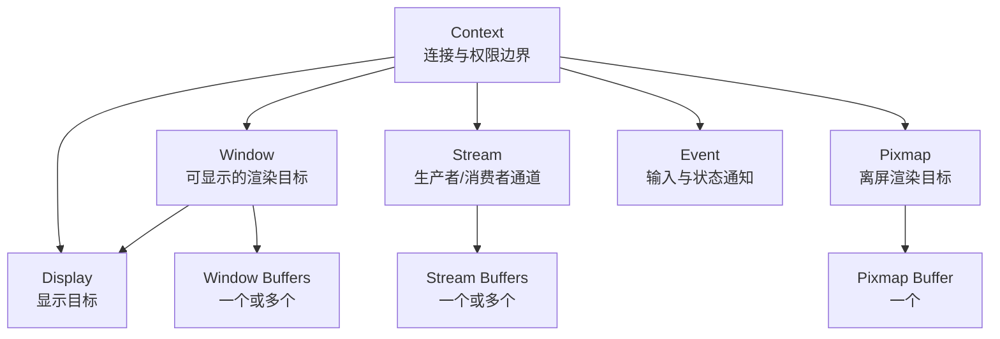
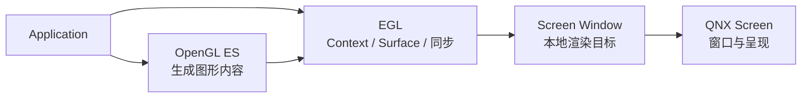
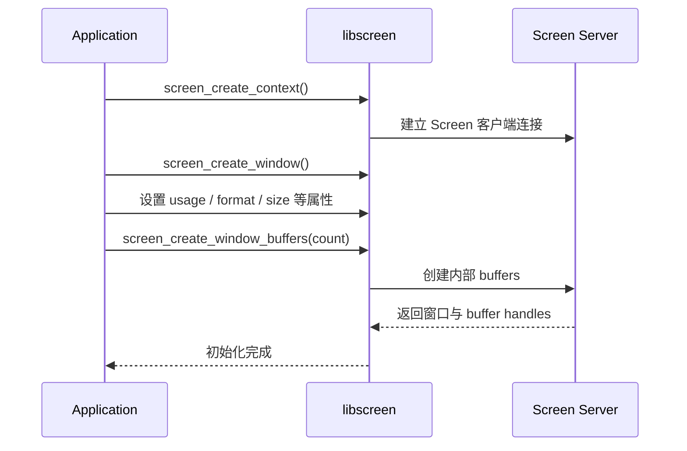
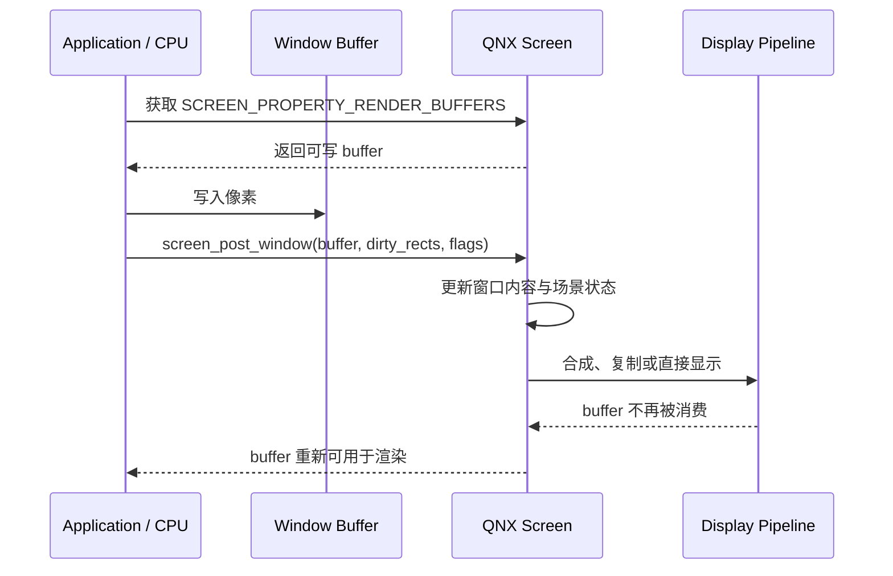
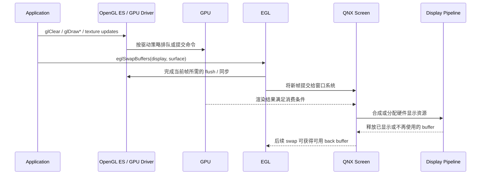
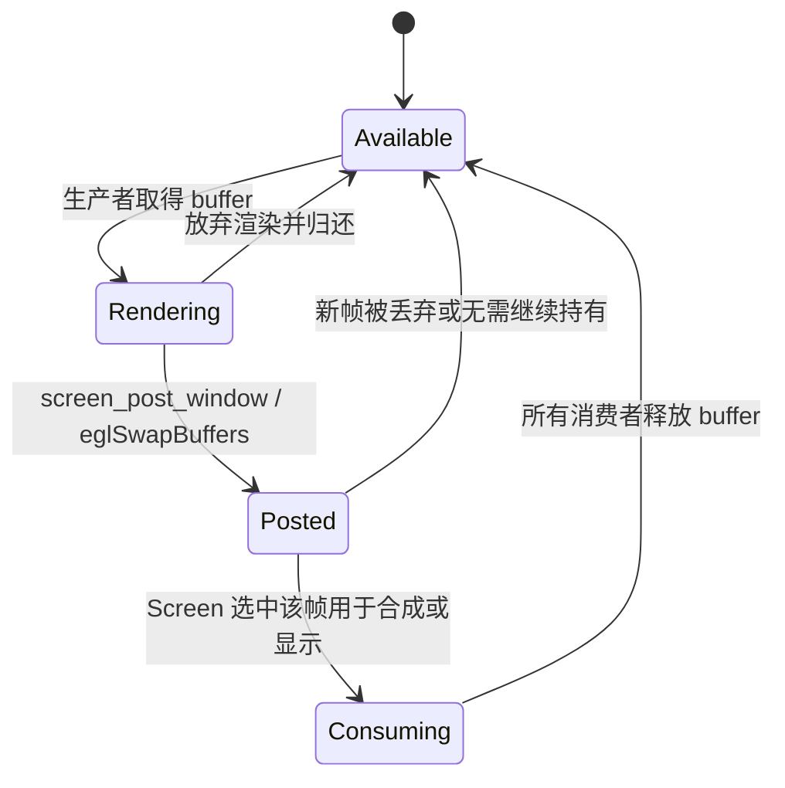

+++
date = '2026-08-27T00:00:00+08:00'
draft = false
title = 'QNX Screen 图形子系统：对象模型、缓冲区生命周期与显示流程'
tags = ['QNX', 'Screen', 'EGL', 'OpenGL ES', 'OpenWFD', 'Graphics']
+++

本文从应用开发者视角说明 QNX Screen 的对象模型，以及一帧图像从渲染缓冲区进入物理显示器的完整生命周期。内容以 QNX Screen 公共 API 契约为主，同时单独讨论 EGL/OpenGL ES 硬件渲染和 Qualcomm/OpenWFD 类平台的实现边界。

> **适用范围**：本文主要依据 QNX SDP 7.1 与 QNX OS 8.0 的 Screen 文档整理。不同 SDP 版本、GPU 厂商和 BSP 可能具有不同的内部实现；使用前应以目标 SDK 的头文件、`graphics.conf`、BSP 源码及设备运行态为准。

## 1. 核心结论

QNX Screen 是客户端/服务端图形框架。应用通过 `libscreen` 创建窗口和缓冲区，使用 CPU、Screen blit、OpenGL ES 或 Vulkan 等方式生成内容，再将完成的帧提交给 Screen。Screen 根据窗口状态和平台能力选择合成、复制或硬件直显，最终由显示控制器扫描输出。

理解这条链路，需要先区分四件事：

1. **渲染（rendering）**：生产像素，执行者可以是 CPU、GPU 或 blitter。
2. **提交（post）**：生产者声明某个 buffer 已完成，可交给 Screen 或其他消费者。
3. **呈现（presentation）**：Screen 选择合成或直显策略，使新内容进入显示管线。
4. **扫描输出（scanout）**：显示控制器按时序读取最终图像并发送到物理面板。

<figure id="qnx-screen-frame-architecture" style="margin:1.5rem 0">
<div id="qnx-screen-slide-viewport" style="position:relative;box-sizing:border-box;width:100%;aspect-ratio:16/9;overflow:hidden;border:1px solid #dadce0;border-radius:8px;background:#fff;">
<iframe id="qnx-screen-graphics-subsystem-slide" src="../../diagrams/qnx-screen-graphics-subsystem-slide.html" title="QNX Screen 图形架构：QNX 8.0 OpenWFD Server 路径" loading="lazy" style="display:block;position:absolute;top:0;left:0;width:1280px;height:720px;max-width:none;max-height:none;border:0;transform-origin:0 0;"></iframe>
</div>
<script>
(() => {
  const viewport = document.getElementById('qnx-screen-slide-viewport');
  const frame = document.getElementById('qnx-screen-graphics-subsystem-slide');
  // 固定幻灯片在文章栏内等比缩放，iframe 内仍使用 1280×720 视口。
  const fitSlide = () => {
    const scale = viewport.clientWidth / 1280;
    if (scale <= 0) return;
    frame.style.transform = `scale(${scale})`;
    viewport.style.height = `${Math.ceil(720 * scale) + 2}px`;
  };
  new ResizeObserver(fitSlide).observe(viewport);
  fitSlide();
})();
</script>
<figcaption style="margin-top:.65rem;text-align:center;color:var(--secondary);font-size:.9rem;">图 1　QNX Screen 图形架构（16:9）：上方按应用、screen 和 wfd-server 进程分列，下方为内核、硬件与图像内存；蓝色实线表示调用与返回，蓝色点线表示中断与完成，绿色实线表示像素数据，灰色虚线表示配置。</figcaption>
</figure>

[独立打开架构图（1280×720）](../../diagrams/qnx-screen-graphics-subsystem-slide.html)

需要特别注意：

- `screen_post_window()` 表示“请求使窗口内容可见”，不等同于立即显示。
- `eglSwapBuffers()` 是 EGL 窗口表面的帧提交接口，不意味着 GPU 一定从此刻才开始执行。
- Screen 可能复制 buffer，也可能切换 buffer；不能将所有呈现都描述成 pointer flip。
- buffer 的分配器、物理连续性、DMA 映射、Fence 和驱动 IPC 都属于平台实现，不能从公共 API 名称直接推导。

## 2. QNX Screen 对象模型

### 2.1 核心对象

| 对象 | 类型 | 主要职责 | 常用操作 |
|---|---|---|---|
| Context | `screen_context_t` | 应用与 Screen 服务之间的连接，也是对象发现和事件处理的作用域 | `screen_create_context()`、`screen_destroy_context()` |
| Display | `screen_display_t` | 表示物理或虚拟显示设备，提供分辨率、刷新模式和亮度等属性 | `screen_get_display_property_*()` |
| Window | `screen_window_t` | 面向显示的渲染目标，保存位置、尺寸、格式、可见性和 z-order 等状态 | `screen_create_window()`、`screen_set_window_property_*()` |
| Buffer | `screen_buffer_t` | 保存像素内容的内存对象 | `screen_get_buffer_property_*()` |
| Stream | `screen_stream_t` | 在生产者与一个或多个消费者之间传递 buffer | `screen_create_stream()`、`screen_post_stream()` |
| Pixmap | `screen_pixmap_t` | 单 buffer 的离屏渲染目标，本身不直接显示 | `screen_create_pixmap()`、`screen_create_pixmap_buffer()` |
| Event | `screen_event_t` | 传递输入、对象生命周期和显示变化等事件 | `screen_get_event()` |

### 2.2 对象关系


```mermaid
flowchart TB
    Context["Context<br/>连接与权限边界"]
    Display["Display<br/>显示目标"]
    Window["Window<br/>可显示的渲染目标"]
    Stream["Stream<br/>生产者/消费者通道"]
    Pixmap["Pixmap<br/>离屏渲染目标"]
    WB["Window Buffers<br/>一个或多个"]
    SB["Stream Buffers<br/>一个或多个"]
    PB["Pixmap Buffer<br/>一个"]
    Event["Event<br/>输入与状态通知"]

    Context --> Display
    Context --> Window
    Context --> Stream
    Context --> Pixmap
    Context --> Event
    Window --> WB
    Window --> Display
    Stream --> SB
    Pixmap --> PB
```

Window 和 Stream 通常可以关联多个 buffer，以支持多缓冲；Pixmap 只关联一个 buffer。一个 buffer 是否能被 CPU 访问、GPU 渲染、用作视频输入或进入显示管线，取决于创建前设置的 `SCREEN_PROPERTY_USAGE` 以及平台能力。

## 3. 图形栈分层与职责

### 3.1 通用分层

| 层次 | 典型组件 | 职责 |
|---|---|---|
| 应用层 | HMI、仪表、Qt 或原生 Screen 应用 | 创建窗口、生成内容、提交帧、处理事件 |
| 渲染 API | OpenGL ES、Vulkan、Screen blit、软件渲染器 | 将业务内容转换为像素 |
| 平台接口 | EGL、Vulkan WSI | 将渲染上下文和 Screen 渲染目标连接起来 |
| 窗口系统 | QNX Screen、`libscreen` | 管理对象、buffer、窗口状态、合成与呈现 |
| 显示实现 | 合成器、显示驱动、厂商显示服务 | 选择 GPU 合成或硬件 plane，配置显示管线 |
| 硬件 | GPU、blitter、Display Controller、Panel | 渲染、搬运、混合、扫描输出 |

### 3.2 OpenGL ES、EGL 与 Screen 的关系

- **OpenGL ES** 定义如何绘制，包括 shader、texture、blend 和 draw call。
- **EGL** 管理渲染上下文、EGLSurface，以及渲染 API 与本地窗口系统之间的连接。
- **QNX Screen** 提供本地窗口、buffer、显示目标和呈现服务。


```mermaid
flowchart LR
    App["Application"]
    GLES["OpenGL ES<br/>生成图形内容"]
    EGL["EGL<br/>Context / Surface / 同步"]
    Window["Screen Window<br/>本地渲染目标"]
    Screen["QNX Screen<br/>窗口与呈现"]

    App --> GLES
    App --> EGL
    GLES --> EGL
    EGL --> Window --> Screen
```

可以将三者概括为：OpenGL ES 决定“画什么、怎样画”，EGL 决定“在哪个上下文和表面上画”，Screen 决定“窗口内容如何进入系统显示场景”。

## 4. 窗口与 Buffer 初始化

初始化发生在创建窗口或重建显示资源时，不属于每帧都重复执行的渲染循环。

### 4.1 初始化顺序


```mermaid
sequenceDiagram
    participant App as Application
    participant Lib as libscreen
    participant Screen as Screen Server

    App->>Lib: screen_create_context()
    Lib->>Screen: 建立 Screen 客户端连接
    App->>Lib: screen_create_window()
    App->>Lib: 设置 usage / format / size 等属性
    App->>Lib: screen_create_window_buffers(count)
    Lib->>Screen: 创建内部 buffers
    Screen-->>Lib: 返回窗口与 buffer handles
    Lib-->>App: 初始化完成
```

典型步骤如下：

1. 使用 `screen_create_context()` 创建具有适当权限的 Context。
2. 使用 `screen_create_window()` 创建 Window。
3. 设置 `SCREEN_PROPERTY_USAGE`、`SCREEN_PROPERTY_FORMAT`、尺寸、位置和 swap interval 等属性。
4. 使用 `screen_create_window_buffers()` 创建一个或多个内部 buffer，或使用 attach API 关联外部 buffer。
5. 若采用 OpenGL ES，再创建 EGLDisplay、EGLConfig、EGLContext 和绑定 Screen Window 的 EGLSurface。

### 4.2 Buffer 数量

| 模式 | 特点 | 典型影响 |
|---|---|---|
| 单缓冲 | 生产者和消费者竞争同一 buffer | 容易发生等待或撕裂，适用范围有限 |
| 双缓冲 | 一块用于渲染，一块由消费者使用 | 延迟与吞吐的常见平衡 |
| 三缓冲 | 在生产者和消费者之间增加排队余量 | 可减少等待，但可能增加排队延迟和内存占用 |

应用不应假定创建了 N 个 buffer 就始终有 N 个 buffer 可写。应通过 `SCREEN_PROPERTY_RENDER_BUFFER_COUNT` 和 `SCREEN_PROPERTY_RENDER_BUFFERS` 获取当前可用于渲染的集合；一次 post 可能改变该集合。

### 4.3 内部 Buffer 与外部 Buffer

- `screen_create_window_buffers()` 创建由 Screen 管理内存的内部 buffer。
- 应用或驱动也可以自行创建并分配外部 buffer，再使用 `screen_attach_window_buffers()` 关联到 Window。
- 外部 buffer 必须满足格式、尺寸、stride、usage 和硬件访问等约束。

公共 API 不保证所有 buffer 都物理连续，也不保证所有窗口都能直接 scanout。可通过相应属性查询 buffer 的实际特征；具体内存 heap、IOMMU 和 DMA 映射路径由 BSP 决定。

## 5. 单帧生命周期

### 5.1 软件渲染路径

软件渲染由 CPU 直接写入 Window Buffer。每一帧的基本循环为：

1. 获取当前可渲染 buffer。
2. 获取 buffer 的 CPU 地址与 stride。
3. 写入像素。
4. 调用 `screen_post_window()` 提交完整 buffer 或 dirty rectangles。
5. 重新获取下一块可用 render buffer。


```mermaid
sequenceDiagram
    participant App as Application / CPU
    participant Buffer as Window Buffer
    participant Screen as QNX Screen
    participant Display as Display Pipeline

    App->>Screen: 获取 SCREEN_PROPERTY_RENDER_BUFFERS
    Screen-->>App: 返回可写 buffer
    App->>Buffer: 写入像素
    App->>Screen: screen_post_window(buffer, dirty_rects, flags)
    Screen->>Screen: 更新窗口内容与场景状态
    Screen->>Display: 合成、复制或直接显示
    Display-->>Screen: buffer 不再被消费
    Screen-->>App: buffer 重新可用于渲染
```

### 5.2 EGL/OpenGL ES 路径

OpenGL ES 路径由 EGLSurface 包装 Screen Window。应用调用 GL API 产生绘制工作，并使用 `eglSwapBuffers()` 提交新帧。


```mermaid
sequenceDiagram
    participant App as Application
    participant GL as OpenGL ES / GPU Driver
    participant GPU as GPU
    participant EGL as EGL
    participant Screen as QNX Screen
    participant Display as Display Pipeline

    App->>GL: glClear / glDraw* / texture updates
    GL->>GPU: 按驱动策略排队或提交命令
    App->>EGL: eglSwapBuffers(display, surface)
    EGL->>GL: 完成当前帧所需的 flush / 同步
    EGL->>Screen: 将新帧提交给窗口系统
    GPU-->>Screen: 渲染结果满足消费条件
    Screen->>Display: 合成或分配硬件显示资源
    Display-->>Screen: 释放已显示或不再使用的 buffer
    Screen-->>EGL: 后续 swap 可获得可用 back buffer
```

`eglSwapBuffers()` 不是“把整批 GL 命令第一次发送给 GPU”的同义词。GL 命令何时开始执行、swap 何时返回以及 post 何时实际发生，取决于 GPU 架构、EGL 驱动和 Screen 实现。

如果应用需要提交局部更新，基础 `eglSwapBuffers()` 没有 dirty rectangle 参数；可在目标实现支持时使用 `EGL_EXT_swap_buffers_with_damage` 或等效扩展。

### 5.3 Buffer 状态机

从生产者视角，可以将 buffer 生命周期抽象为以下状态：


```mermaid
stateDiagram-v2
    [*] --> Available
    Available --> Rendering: 生产者取得 buffer
    Rendering --> Posted: screen_post_window / eglSwapBuffers
    Posted --> Consuming: Screen 选中该帧用于合成或显示
    Posted --> Available: 新帧被丢弃或无需继续持有
    Consuming --> Available: 所有消费者释放 buffer
    Rendering --> Available: 放弃渲染并归还
```

关键约束是：调用 post 后，生产者不得继续写入已经交给消费者的 buffer。只有当该 buffer 再次进入可渲染集合后，生产者才能覆盖其内容。

## 6. `screen_post_window()` 语义

### 6.1 API 原型

```c
int screen_post_window(screen_window_t win,
                       screen_buffer_t buf,
                       int count,
                       const int *dirty_rects,
                       int flags);
```

该函数请求 Screen 将 `buf` 中发生变化的内容用于窗口显示。窗口至少成功 post 一次后才可能可见。

| 参数 | 含义 |
|---|---|
| `win` | 目标 Window |
| `buf` | 包含本次更新内容的渲染 buffer |
| `count` | dirty rectangle 数量；`0` 表示整个 buffer 发生变化 |
| `dirty_rects` | `{x, y, width, height}` 数组；`count == 0` 时可为 `NULL` |
| `flags` | 控制等待、非阻塞和显式入队行为 |

### 6.2 Dirty Rectangle

Dirty rectangle 是优化提示，而不是“Screen 只会读取这些像素”的安全边界。Screen 仍可能使用完整 buffer，因此应用必须保证整个 buffer 在任何一次 post 时都包含可显示内容。

### 6.3 返回与阻塞行为

| flags | 主要语义 | 应用注意事项 |
|---|---|---|
| `0` | 遵守窗口 swap interval；存在可用 render buffer 时可以返回 | 返回后重新查询可用 buffer，不复用刚提交的 handle |
| `SCREEN_WAIT_IDLE` | 等待显示更新，并等待至少一个 render buffer 可用 | 适合需要确定完成点的场景，但可能增加延迟 |
| `SCREEN_DONT_BLOCK` | 无论当前是否有可用 render buffer 都立即返回 | 后续应使用 dequeue API 等待或取得 buffer |
| `SCREEN_EXPLICIT_ENQUEUE` | post 后保持 buffer 为 dequeued，直到生产者显式 enqueue 且消费者释放 | 适合生产者 post 后仍需只读访问 buffer 的流程 |

不同 QNX 版本支持的 flags 和细节可能不同，应以目标 SDK 的 `screen.h` 为准。

### 6.4 Copy、Composition 与 Flip

`screen_post_window()` 的结果可能包括：

- Screen 将窗口内容合成到系统 framebuffer；
- 硬件 blitter 完成复制、缩放或格式转换；
- 窗口 buffer 被分配到硬件 overlay/pipeline；
- 显示实现执行 buffer flip 或等效的原子提交；
- 当前帧由于场景更新或节奏控制而未被最终显示。

因此，“post 等于修改显示控制器物理地址”只能作为特定硬件路径的实现说明，不能作为 API 语义。

## 7. 同步、VSYNC 与时序

### 7.1 三个并行主体

图形系统中通常存在三个相互并行的主体：

- CPU 产生应用逻辑和渲染命令；
- GPU 或 blitter 生成、合成或搬运像素；
- Display Controller 以固定显示时序扫描输出。

多缓冲让三者能够流水执行，但也引入了两个必要条件：

1. 消费者读取 buffer 前，生产者必须完成写入。
2. 生产者再次覆盖 buffer 前，所有消费者必须完成读取或释放。

### 7.2 Fence 的正确表述

平台可以使用 EGL 同步对象、native fence、驱动私有同步原语或隐式同步来满足上述约束。但 QNX Screen 的通用 post 流程不能仅凭 API 名称推导出固定的 Fence 创建者、句柄格式和传递链。

描述某个平台的 Fence 时，应至少回答：

- 哪个 API 或驱动创建 acquire/release fence；
- fence 句柄存放在哪个对象或协议字段中；
- Screen、合成器和显示驱动分别等待哪个 fence；
- buffer 在哪个事件后重新归还生产者；
- 结论来自头文件、源码、符号分析还是运行态 trace。

### 7.3 VSYNC 与 Swap Interval

VSYNC 表示显示刷新时序事件；swap interval 表示应用希望帧交换与刷新间隔之间的关系。二者会影响帧 pacing 和接口等待时间，但不能保证每次 swap 都对应一帧实际显示。生产速度高于消费速度时，系统可能让生产者等待、排队或丢弃中间帧，具体策略由实现决定。

## 8. OpenWFD 显示路径与平台实现边界

[图 1](#qnx-screen-frame-architecture) 采用 QNX 8.0 的 OpenWF Display Server 路径：`screen` 通过 `libWFDclient.so` 与 `wfd-server` 通信，后者加载平台显示驱动 `libWFD<platform>.so`，将 Source、Port 和 Pipeline 状态提交给显示控制器。`libwfdcfg-<platform>.so` 提供平台显示配置。这里的 `<platform>` 表示 BSP 名称占位符，不是目标设备上的字面文件名。

图中的绿色像素路径独立于显示提交命令：CPU 或 GPU 写入图像 buffer，显示控制器读取图层并扫描输出到面板。“图像 Buffer”表示窗口 buffer 与可能使用的合成目标这一资源集合，不表示它们是同一块物理内存。GPU 厂商库、具体内核设备接口、合成内部路径和 Fence 协议未在这张总览图中展开。

部分 Qualcomm 座舱 BSP 同样使用 OpenWF Display/OpenWFD 风格的 Device、Port 和 Pipeline 对象，将多个显示客户端的 buffer 提交给 DPU，但不能据此假定其库名、IPC 和服务进程与图中的 QNX 8.0 Server 路径相同。

OpenWFD、IPC、buffer allocator 和硬件 Pipeline 位于平台实现层，不是 QNX Screen 公共 API 的固定组成。不同项目可能使用不同的进程模型、IPC、DPU 抽象或硬件所有权设计。

## 9. 最小软件渲染示例

下面的代码展示 Screen Window 的基本生命周期。为突出流程，省略了错误处理、事件循环和资源销毁细节；生产代码必须检查每个 API 的返回值。

```c
#include <screen/screen.h>
#include <string.h>

int main(void)
{
    screen_context_t ctx = NULL;
    screen_window_t win = NULL;
    screen_buffer_t buffers[2] = { NULL, NULL };

    int usage = SCREEN_USAGE_WRITE;
    int format = SCREEN_FORMAT_RGBX8888;
    int size[2] = { 1280, 720 };

    screen_create_context(&ctx, SCREEN_APPLICATION_CONTEXT);
    screen_create_window(&win, ctx);

    screen_set_window_property_iv(win, SCREEN_PROPERTY_USAGE, &usage);
    screen_set_window_property_iv(win, SCREEN_PROPERTY_FORMAT, &format);
    screen_set_window_property_iv(win, SCREEN_PROPERTY_BUFFER_SIZE, size);
    screen_create_window_buffers(win, 2);

    screen_get_window_property_pv(
        win,
        SCREEN_PROPERTY_RENDER_BUFFERS,
        (void **)buffers);

    void *pixels = NULL;
    int stride = 0;
    screen_get_buffer_property_pv(
        buffers[0], SCREEN_PROPERTY_POINTER, &pixels);
    screen_get_buffer_property_iv(
        buffers[0], SCREEN_PROPERTY_STRIDE, &stride);

    /* 示例：将整个 buffer（包括每行 padding）填充为白色。 */
    memset(pixels, 0xff, stride * size[1]);

    screen_post_window(win, buffers[0], 0, NULL, 0);

    /* 实际应用在此进入事件与渲染循环。 */

    screen_destroy_window(win);
    screen_destroy_context(ctx);
    return 0;
}
```

持续渲染时，不应永久缓存 `buffers[0]` 并反复覆盖。每轮都应根据目标版本推荐的 buffer 管理方式重新查询或 dequeue 可用 buffer。

## 10. EGL/OpenGL ES 初始化骨架

下面只展示 Screen 与 EGL 的连接关系，不包含完整的 EGLConfig 选择和 shader 初始化：

```c
screen_context_t screen_ctx;
screen_window_t screen_win;

screen_create_context(&screen_ctx, SCREEN_APPLICATION_CONTEXT);
screen_create_window(&screen_win, screen_ctx);

int usage = SCREEN_USAGE_OPENGL_ES2;
int format = SCREEN_FORMAT_RGBA8888;
int interval = 1;

screen_set_window_property_iv(
    screen_win, SCREEN_PROPERTY_USAGE, &usage);
screen_set_window_property_iv(
    screen_win, SCREEN_PROPERTY_FORMAT, &format);
screen_set_window_property_iv(
    screen_win, SCREEN_PROPERTY_SWAP_INTERVAL, &interval);
screen_create_window_buffers(screen_win, 2);

EGLDisplay egl_display = eglGetDisplay(EGL_DEFAULT_DISPLAY);
eglInitialize(egl_display, NULL, NULL);

/* 选择与 Screen Window 匹配的 EGLConfig，创建 EGLContext。 */
EGLSurface egl_surface = eglCreateWindowSurface(
    egl_display,
    egl_config,
    (EGLNativeWindowType)screen_win,
    NULL);

eglMakeCurrent(
    egl_display,
    egl_surface,
    egl_surface,
    egl_context);

while (running) {
    glClear(GL_COLOR_BUFFER_BIT);
    /* glUseProgram(), glDraw*(), ... */
    eglSwapBuffers(egl_display, egl_surface);
}
```

EGLConfig 至少应与 Window 的 surface 类型、颜色格式和目标 OpenGL ES 版本匹配。不能简单地选择返回列表中的第一个配置；颜色位数、depth/stencil、MSAA 和格式都会影响兼容性、内存占用与带宽。

## 11. 诊断方法

### 11.1 分层定位

| 现象 | 优先检查 |
|---|---|
| Window 从未显示 | 是否成功 post、可见性、尺寸、位置、z-order、目标 Display |
| 画面全黑或颜色异常 | pixel format、stride、alpha、颜色通道顺序、buffer 是否完整初始化 |
| 首帧正常，后续闪烁 | 是否写入仍被消费的 buffer、是否每帧重新获取可用 buffer |
| 帧率低或 swap 阻塞 | buffer 数、swap interval、GPU 时间、合成路径和消费者释放时延 |
| 局部更新出现残影 | dirty rectangles 是否正确、buffer 其他区域是否保持有效 |
| GL API 正常但没有画面 | EGLConfig、EGLSurface、`eglMakeCurrent()`、swap 返回值及 Screen Window 状态 |
| Screen 场景正常但物理屏异常 | 显示驱动、mode、pipeline、panel link 和硬件时序 |

### 11.2 QNX 工具

目标镜像包含相应组件时，可以使用：

```sh
# 查看 Screen 系统日志
slog2info

# 解码 Screen 请求环形缓冲区
screeninfo /dev/screen/requests

# 查看指定显示 framebuffer 的 blit 记录；实际编号以设备为准
screeninfo /dev/screen/0/blt-1

# 枚举 EGL 配置
egl-configs

# 抓取显示输出；参数以目标版本为准
screenshot
```

还可以通过 `SCREEN_PROPERTY_METRICS`、`SCREEN_PROPERTY_DEBUG`、`gltracelogger` 和 `gltraceprinter` 分析窗口提交、GPU 调用及合成行为。部分调试能力依赖 `screen-debug.so` 或 `graphics.conf` 中开启的日志项，不应假设量产镜像默认具备。

### 11.3 推荐核验记录

为了让分析结果可以复现，应记录：

- QNX SDP、Screen 和 GPU 驱动版本；
- SoC、GPU、DPU 与显示接口；
- `graphics.conf` 关键配置；
- Window 的 usage、format、size、buffer count 和 swap interval；
- 应用使用的软件、blit、OpenGL ES、Vulkan 或混合渲染路径；
- 日志和 trace 的采集时间、命令与原始文件；
- OpenWFD、DMA-BUF、Fence 等平台结论的证据来源。

## 12. 常见误区

### 12.1 `Framebuffer` 是否就是物理屏的最终帧？

不一定。文章中的 framebuffer 应明确指 EGL/OpenGL framebuffer、Window render buffer，还是 Screen 合成后的 display framebuffer。硬件 overlay 存在时，某个软件 framebuffer 可能并不包含物理屏上的所有图层。

### 12.2 `eglSwapBuffers()` 是否一定交换两个物理地址？

不一定。它是 EGL 的窗口表面提交操作。底层可以采用多种 buffer 管理和呈现策略，实际行为由 EGL、Screen 和显示驱动共同决定。

### 12.3 `screen_post_window()` 返回是否表示画面已经显示？

不一定。返回条件受 flags、swap interval、可用 render buffer 和显示路径影响。需要确定显示完成语义时，应查阅目标版本文档并选择适当的同步接口。

### 12.4 Double Buffer 是否始终不会阻塞？

不会。若一块 buffer 正在渲染、另一块仍被消费者持有，则生产者没有可用 buffer，相关 API 仍可能等待。

### 12.5 所有 Window 是否都会由 GPU 合成？

不一定。Screen 或平台显示实现可能使用 GPU 合成、blitter、硬件 overlay/pipeline，或几种方式的组合。选择结果通常受格式、缩放、旋转、透明度、z-order、安全属性及硬件资源限制影响。

## 13. 术语表

| 术语 | 含义 |
|---|---|
| Render Target | 接收渲染结果的目标，例如 Window、Stream 或 Pixmap |
| Render Buffer | 当前可供生产者写入的 buffer |
| Front Buffer | 已提交并可供消费者访问的 buffer；不一定已经被物理显示 |
| Post | 将完成的 buffer 提交给 Screen 或 Stream 消费者 |
| Composition | 将多个图层组合成最终图像的过程 |
| Overlay/Pipeline | 显示控制器可独立读取和混合的一路硬件输入抽象 |
| Scanout | 显示控制器按显示时序读取像素并输出到接口 |
| Swap Interval | EGL/窗口提交相对于显示刷新间隔的节奏设置 |
| Dirty Rectangle | 描述本帧发生变化区域的矩形优化提示 |
| Fence | 表示异步生产或消费完成状态的同步对象，具体实现依平台而定 |
| OpenWFD | Khronos OpenWF Display API，部分平台用于显示设备、Port 和 Pipeline 管理 |

## 14. 参考资料

- [QNX 8.0 Screen：About Screen](https://www.qnx.com/developers/docs/8.0/com.qnx.doc.screen/topic/manual/cscreen_about.html)
- [QNX 8.0 Screen：Getting started](https://www.qnx.com/developers/docs/8.0/com.qnx.doc.screen/topic/manual/cscreen_getting_started.html)
- [QNX 8.0 Screen：Rendering](https://www.qnx.com/developers/docs/8.0/com.qnx.doc.screen/topic/manual/cscreen_rendering.html)
- [QNX 8.0 Screen：Buffers](https://www.qnx.com/developers/docs/8.0/com.qnx.doc.screen/topic/manual/cscreen_buffers_create-attach.html)
- [QNX 8.0 API：screen_create_window_buffers()](https://www.qnx.com/developers/docs/8.0/com.qnx.doc.screen/topic/screen_create_window_buffers.html)
- [QNX 8.0 API：screen_post_window()](https://www.qnx.com/developers/docs/8.0/com.qnx.doc.screen/topic/screen_post_window.html)
- [QNX 7.1 Screen：OpenGL ES rendering APIs](https://www.qnx.com/developers/docs/7.1/com.qnx.doc.screen/topic/manual/cscreen_rendering-hardware-opengles.html)
- [QNX 8.0 Screen：Debugging](https://www.qnx.com/developers/docs/8.0/com.qnx.doc.screen/topic/manual/cscreen_screen-debugging.html)
- [QNX 8.0：Introduction to the OpenWF Display Server](https://www.qnx.com/developers/docs/8.0/com.qnx.doc.screen.wfd-server/topic/manual/cwfd-server_intro.html)
- [QNX BSP 8.0：Getting Started with BSP Screen](https://www.qnx.com/developers/docs/BSP8.0/com.qnx.doc.bsp.referencenotes/topic/bsp_graphics.html)
- [Khronos EGL Registry](https://registry.khronos.org/EGL/)
- [Khronos OpenWF Display Registry](https://registry.khronos.org/openwfd/)
