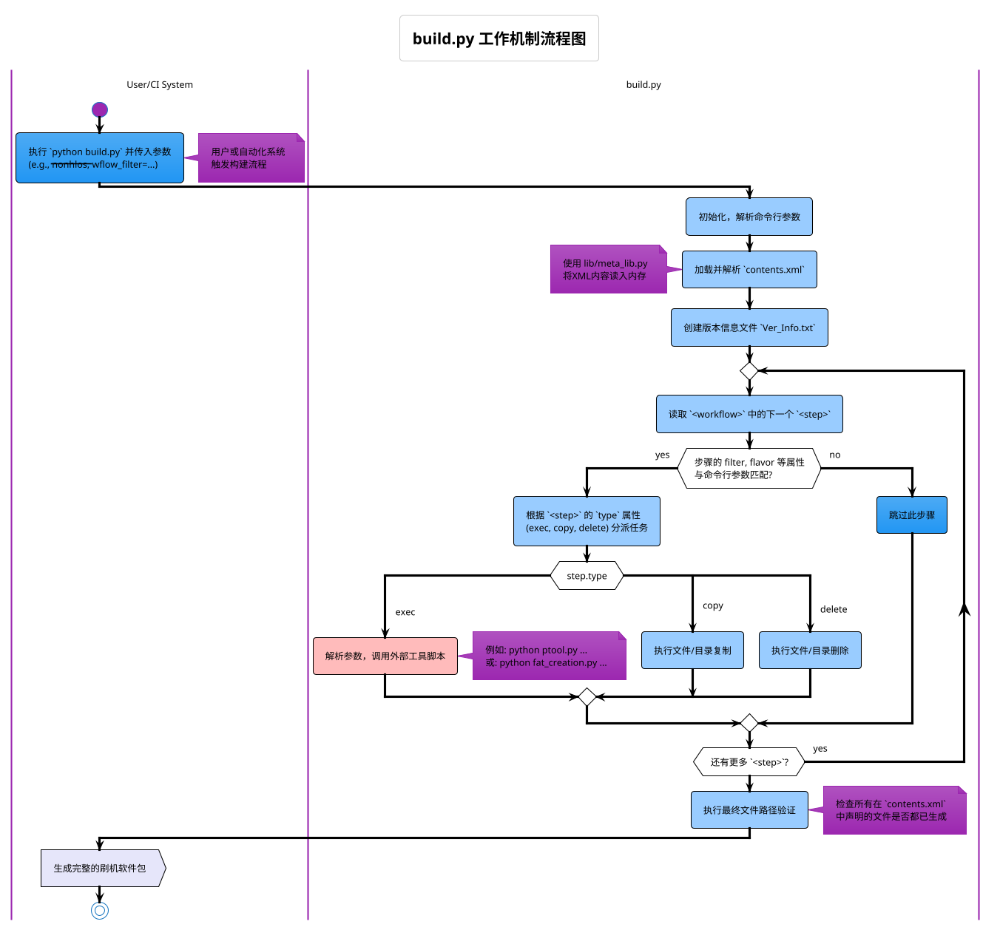

+++
date = '2025-09-22T12:11:50+08:00'
draft = false
title = 'build.py 技术原理详解'
+++

## `build.py` 技术原理详解

### 核心定位：声明式构建的执行引擎

`build.py` 脚本是高通平台 Meta-Build 系统的核心**自动化执行引擎**。它本身不包含具体的构建逻辑（如编译哪个文件、打包哪些固件），而是作为一个通用的**任务调度器和执行器**。

它的核心设计哲学是**声明式驱动**：开发者在 `contents.xml` 文件中以声明的方式（“我需要什么”）定义好所有的构建需求，而 `build.py` 脚本则负责读取这份“蓝图”，并将其转化为一系列实际的文件操作和命令执行，最终完成复杂的打包任务。

-----

### 1\. 输入 (Inputs)

`build.py` 的正常运行依赖于以下几类输入：

#### **主要输入**

  * **`contents.xml`**: 这是最核心的输入，是整个构建过程的**配置清单和指令集**。`build.py` 的所有行为都由该文件驱动。

#### **次要输入**

  * **命令行参数**: 用户在执行脚本时传入的参数，用于控制脚本的行为模式。
      * `--nonhlos`, `--hlos`: 过滤器，让脚本只执行与 NON-HLOS 或 HLOS 相关的任务。
      * `--wflow_filter=<filter_name>`: 更精细的过滤器，让脚本只执行 `<workflow>` 中具有特定 `filter` 属性的步骤。
      * `--clean`: 模式切换，让脚本执行清理任务而非构建任务。
      * `--imf`: 模式切换，忽略文件路径验证。

#### **隐式输入**

  * **各组件的编译产物**: 脚本运行前，各个独立的软件模块（如 `boot_images`, `tz_images`, `mpss`, `apps` 等）必须已经完成各自的编译，并将其产物放置在 `contents.xml` 中指定的路径下。`build.py` 会去消费这些产物。
  * **配置文件**: 如 `partition_la.xml`，它定义了分区布局，是生成 `gpt_*.bin` 和 `rawprogram.xml` 的输入源。

-----

### 2\. 输出 (Outputs)

脚本成功执行后，会生成一个结构化、可直接用于刷机的软件包。

#### **核心产物**

  * 一个**完整的、按产品风味（Flavor）和存储类型（Storage Type）组织的刷机包**。

#### **具体文件清单**

  * **刷机指令文件**:
      * `rawprogram*.xml`: 核心的 EDL 刷机脚本。
      * `patch*.xml`: 动态修补脚本。
  * **分区表文件**:
      * `gpt_*.bin`: 二进制的 GUID 分区表文件。
  * **复合固件镜像**:
      * `NON-HLOS.bin`: 包含 Modem, aDSP, CDSP, WLAN 等固件的 FAT 格式镜像。
      * `BTFM.bin`: 蓝牙固件镜像。
      * `dspso.bin`: DSP 动态库镜像。
  * **签名与分割固件**:
      * `multi_image.mbn`: 经过安全签名的复合镜像。
      * `pil_split_bins/` 目录: 被 `pil-splitter.py` 分割后的固件，用于运行时加载。
  * **辅助与调试文件**:
      * `Ver_Info.txt`: JSON 格式的版本信息文件。
      * `gen_buildflavor.cmm`: Trace32 调试器使用的脚本。

-----

### 3\. 依赖 (Dependencies)

`build.py` 的依赖可以分为四类：

  * **环境依赖**:
      * 一个能够运行脚本的 **Python 环境**。
  * **文件依赖**:
      * **`contents.xml`** 必须存在且语法正确。
      * `contents.xml` 中引用的所有**组件编译产物**和**配置文件**必须存在于正确的路径。
  * **模块依赖**:
      * 脚本同目录下的 **`lib/` 库**，特别是 `meta_lib.py`，它提供了读写和解析 `contents.xml` 的核心功能。
  * **工具依赖**:
      * `contents.xml` 的 `<workflow>` 中调用的所有**外部工具**必须存在，例如：
          * `ptool.py` (用于处理分区)
          * `fat_creation.py`, `fatadd.py` (用于创建 FAT 镜像)
          * `pil-splitter.py` (用于分割 PIL 固件)
          * `sectools.py` (用于安全签名)
          * `checksparse.py` (用于处理稀疏镜像)

-----

### 4\. 具体工作流程

`build.py` 的工作流程严谨而清晰，可以概括为以下几个步骤：

1.  **初始化与参数解析**:

      * 脚本启动，首先使用 Python 的 `OptionParser` 模块解析用户传入的命令行参数（如 `--nonhlos`），确定本次运行的模式和过滤器。

2.  **加载配置清单**:

      * 调用 `lib/meta_lib.py` 库，加载并解析 `contents.xml` 文件，将其内容读入内存，形成一个易于操作的数据对象（`mi`）。

3.  **预处理任务**:

      * 创建输出目录结构（如 `bin/8155_la`, `ufs/8155_la`）。
      * 从 `mi` 对象中读取所有组件的 `build_id`，生成 `Ver_Info.txt` 文件。

4.  **遍历并执行工作流 (核心)**:

      * 脚本定位到 `contents.xml` 中的 `<workflow>` 标签，并开始遍历其中的每一个 `<step>`。
      * **对于每一个 `<step>`**：
        a. **过滤**: 检查该步骤的 `filter`, `flavor`, `storage_type` 等属性是否与用户传入的命令行参数或当前环境匹配。如果不匹配，则跳过此步骤。
        b. **分派**: 根据步骤的 `type` 属性（`exec`, `copy`, `delete`），决定调用哪个内部处理函数（`workflow_exec`, `workflow_copy` 等）。
        c. **执行**: 对应的处理函数会：
        i.  解析 `<params>` 等标签中的变量（如 `@tool_name`, `@src_file`）。
        ii. 准备好完整的命令行指令。
        iii.调用 Python 的 `subprocess` 模块，执行该指令（例如 `python ptool.py -x ...`）。

5.  **后处理与验证**:

      * 在所有匹配的工作流步骤执行完毕后，脚本会执行一次文件路径验证（除非被 `--imf` 禁用），确保 `contents.xml` 中声明的所有最终产物都已成功生成。
      * 如果验证失败，脚本会报错并以失败状态退出。

-----

### 5\. 流程图 (PlantUML)

以下是使用 PlantUML 绘制的 `build.py` 工作机制流程图：

-----

### 6\. 其他关键点

#### **常用命令行参数**

  * `build.py --nonhlos`: 仅打包 `NON-HLOS.bin` 及相关固件，速度快，常用于底层固件开发。
  * `build.py --hlos`: 仅处理 `system`, `userdata` 等高层系统的镜像，如进行稀疏镜像转换。
  * `build.py`: 不带参数，执行所有工作流步骤，进行一次完整的打包。
  * `build.py --clean`: 清理 `bin/` 和 `ufs/` 目录中所有生成的文件，用于重新构建。

#### **如何定制与调试**

  * **核心原则**: **永远不要直接修改 `build.py`**。它的通用性保证了其稳定性。所有的定制化需求都应该通过修改 `contents.xml` 来实现。
  * **添加新固件**: 要将一个新的固件（如 `new_fw.bin`）打包进 `NON-HLOS.bin`，只需在 `contents.xml` 的 `<build>` 部分添加一个指向该文件的 `<file_ref fat_file_*="true">` 标签即可。
  * **调试技巧**: 如果某个步骤失败，`build.py` 的日志会打印出它尝试执行的确切命令行。可以将该命令复制出来手动执行，以排查是工具本身的问题还是参数问题。

### 总结

`build.py` 是一个设计精良的自动化脚本，它通过将\*\*“做什么”（What）**与**“怎么做”（How）\*\*彻底分离，实现了高度的灵活性和可维护性。开发者通过编写声明式的 `contents.xml` 来定义需求（What），而 `build.py` 则负责高效、可靠地执行这些需求（How），最终将复杂的软件组件整合成一个统一、规范的交付产物。