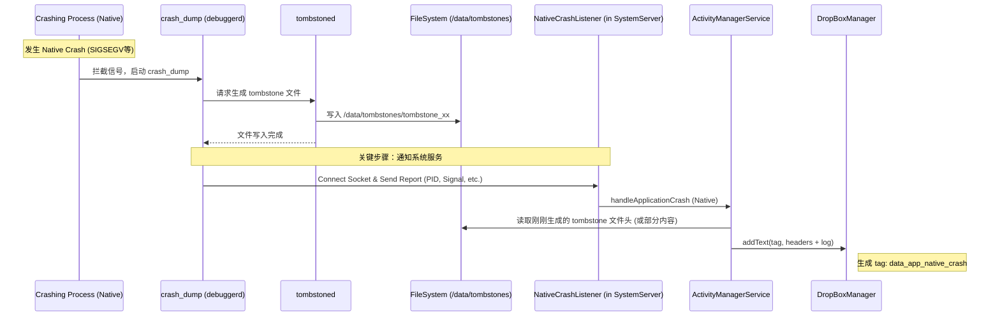
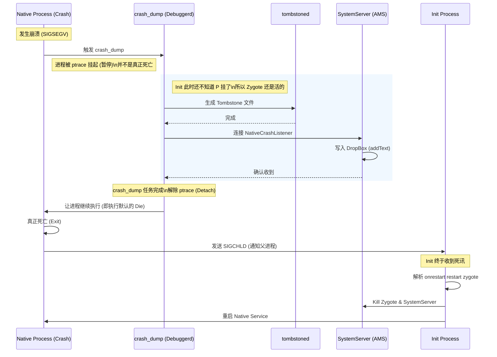

这是一个非常底层的 Android 系统机制问题，问得很有深度。

简单来说，**`tombstone` 文件生成后，并不会自动“变”进 DropBox。** 这是一个由 **`debuggerd` (crash\_dump)** 和 **`SystemServer`** 配合完成的主动上报过程。

其中的关键桥梁是一个叫 **`NativeCrashListener`** 的组件。

以下是完整的技术链路分析：

### 核心流程概览

整个过程可以概括为：**“写文件 -\> 通知 AMS -\> 读文件 -\> 写入 DropBox”**。

### 详细步骤解析

#### 1\. 案发现场：`debuggerd` 介入

当一个 C/C++ 进程崩溃时，内核会发送信号（如 SIGSEGV）。Android 的 linker 预先设置了信号处理函数，这会唤起 `crash_dump` (属于 debuggerd 架构)。

  * **动作：** `crash_dump` 通过 ptrace 附着到崩溃进程，抓取寄存器、堆栈信息。
  * **写文件：** `crash_dump` 将抓取的数据发送给 `tombstoned` 守护进程，由它负责将内容写入磁盘上的 `/data/tombstones/tombstone_xx` 文件。

#### 2\. 关键桥梁：`NativeCrashListener`

这是很多人容易忽略的一步。`crash_dump` 作为一个底层的 Linux 进程，它是如何通知 Java 层的 `SystemServer` 的呢？

  * **监听者：** `SystemServer` 启动时，`ActivityManagerService` (AMS) 会启动一个辅助线程类，叫做 **`NativeCrashListener`**。
  * **机制：** 这个 Listener 会创建一个 **UNIX Domain Socket**（通常是抽象命名空间）。
  * **握手：** 当 `crash_dump` 完成 tombstone 文件的写入后，它会主动尝试连接这个 Socket，向 AMS 汇报：“嘿，PID 为 XXX 的进程刚死掉了，因为信号 YYY”。

> **源码参考：** 可以在 AOSP 的 `frameworks/base/services/core/java/com/android/server/am/NativeCrashListener.java` 中看到这个 Socket 的监听逻辑。

#### 3\. 搬运工：AMS 写入 DropBox

收到 Socket 通知后，`NativeCrashListener` 唤醒 AMS 的主逻辑。

  * **读取：** AMS 根据汇报的 PID 和 Process Name，找到对应的 tombstone 文件。为了节省内存，AMS 通常不会把几 MB 的 tombstone 全部读进内存，而是读取**头部关键信息**（Build fingerprint, Revision, ABI, 崩溃堆栈的头几行）。
  * **写入：** AMS 调用 `DropBoxManager.addText()` 或 `addFile()`。
  * **Tag 命名：**
      * 如果是系统应用：Tag 通常是 `system_app_native_crash`。
      * 如果是普通应用：Tag 通常是 `data_app_native_crash`。

-----

### 对你的 "CockpitPerformanceSentinel (CPS)" 的启示

既然你需要做日志采集和 DashBoard 展示，理解这个流程对你的架构设计非常重要：

1.  **不要去监控 `/data/tombstones` 目录：**

      * 这是笨办法。因为你需要处理文件权限（SELinux）、文件轮转（rotate）、并发写入等问题。
      * 而且，只有具备 root 权限或特定的 system group 才能列出那个目录。

2.  **利用 DropBox 广播 (推荐方案)：**

      * 当 AMS 把数据写入 DropBox 后，系统会发出一个广播：`DropBoxManager.ACTION_DROPBOX_ENTRY_ADDED`。
      * 你的 **CPS (CockpitPerformanceSentinel)** 服务应该注册这个广播接收器。
      * 收到广播后，检查 Tag 是否为 `*_native_crash`，然后通过 `DropBoxManager` API 读取内容。这是最干净、最符合 Android 规范的做法。

3.  **为什么这种方式好？**

      * **权限正规：** 你只需要申请 `android.permission.READ_LOGS` (或相关系统权限)。
      * **数据已清洗：** AMS 放入 DropBox 的数据通常已经包含了一些基础的上下文信息（Package Name, Version），比你自己去解析原始 tombstone 文件要容易得多。

**总结：**
Tombstone 进入 DropBox 并不是文件系统的自动同步，而是 **`crash_dump` (C++) 通过 Socket 告诉 `NativeCrashListener` (Java)，然后由 `AMS` 主动读取并写入 DropBox** 的结果。