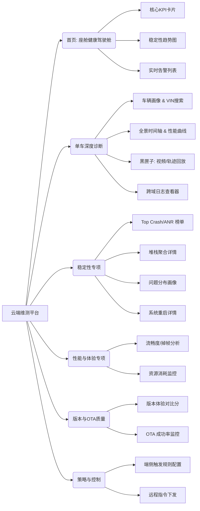

```mermaid
graph LR
A[云端维测平台] --> B(首页: 座舱健康驾驶舱)
B --> B1[核心KPI卡片]
B --> B2[稳定性趋势图]
B --> B3[实时告警列表]
A --> C(单车深度诊断)
C --> C1[车辆画像 & VIN搜索]
C --> C2[全景时间轴 & 性能曲线]
C --> C3[黑匣子: 视频/轨迹回放]
C --> C4[跨域日志查看器]
A --> D(稳定性专项)
D --> D1[Top Crash/ANR 榜单]
D --> D2[堆栈聚合详情]
D --> D3[问题分布画像]
D --> D4[系统重启详情]
A --> E(性能与体验专项)
E --> E1[流畅度/掉帧分析]
E --> E2[资源消耗监控]
A --> F(版本与OTA质量)
F --> F1[版本体验对比分]
F --> F2[OTA 成功率监控]
A --> G(策略与控制)
G --> G1[端侧触发规则配置]
G --> G2[远程指令下发]
```

