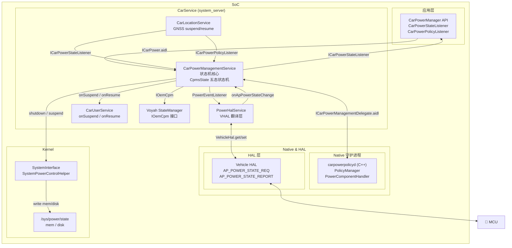
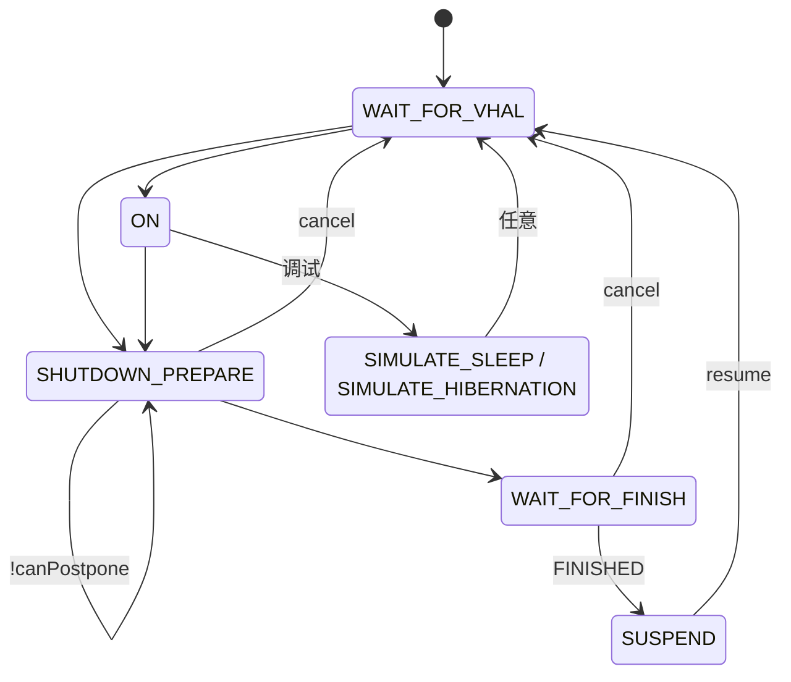

# AAOS Car Power Management 电源状态与 Suspend 流程

> 基于源码分析，文件路径均相对于 `/home/voyah/workspace/8397/qssi/`。

---

## 一、总体架构



> **图中 AIDL 接口说明:**
> - `ICarPower.aidl` — App 与 CPMS 之间的电源状态/策略接口
> - `ICarPowerManagementDelegate.aidl` — CPMS 与 C++ daemon 之间的电源策略代理接口
> - `IOemCpm` — Voyah OEM 电源管理扩展接口 (needIgnoreVHalOnState / checkState)
> - PowerHalService 通过 `VehicleHal.get()` 读写 VHAL 属性，非 AIDL 通信

### 已读取的关键源文件

| 文件 | 说明 |
|------|------|
| `frameworks/hardware/interfaces/automotive/power/aidl/android/frameworks/automotive/power/CarPowerState.aidl` | 标准电源状态枚举 (AIDL) |
| `packages/services/Car/car-lib/src/android/car/hardware/power/CarPowerManager.java` | 客户端 API + 状态常量 |
| `packages/services/Car/service/src/com/android/car/power/CarPowerManagementService.java` | CPMS 主服务 (状态机核心) |
| `packages/services/Car/service/src/com/android/car/hal/PowerHalService.java` | VHAL 电源事件翻译层 |
| `packages/services/Car/service/src/com/android/car/systeminterface/SystemStateInterface.java` | 系统状态接口 (suspend/shutdown) |
| `packages/services/Car/service/src/com/android/car/systeminterface/SystemPowerControlHelper.java` | 写 `/sys/power/state` 触发休眠 |
| `packages/services/Car/service/src/com/android/car/power/oem/StateManager.java` | Voyah OEM 状态管理器 |
| `packages/services/Car/cpp/power/server/src/CarPowerPolicyServer.cpp` | C++ 电源策略守护进程 |
| `packages/services/Car/cpp/power/aidl/android/automotive/power/internal/ICarPowerManagementDelegate.aidl` | CPMS-C++ daemon 桥接接口 |

---

## 二、电源状态定义

### 2.1 CPMS 内部状态机状态 (CpmsState)

文件: `CarPowerManagementService.java:3666-3675`

```java
private static final class CpmsState {
    public static final int WAIT_FOR_VHAL      = 0;  // 等待 VHAL 发来 ON 信号
    public static final int ON                 = 1;  // 正常运行
    public static final int SHUTDOWN_PREPARE   = 2;  // 关机/休眠准备
    public static final int WAIT_FOR_FINISH    = 3;  // 等待 VHAL 确认 FINISHED
    public static final int SUSPEND            = 4;  // 最终执行 suspend/shutdown
    public static final int SIMULATE_SLEEP     = 5;  // 模拟 Suspend-to-RAM (调试用)
    public static final int SIMULATE_HIBERNATION = 6; // 模拟 Hibernation (调试用)
}
```

### 2.2 标准电源状态 (CarPowerState / CarPowerManager.STATE_*)

文件: `CarPowerState.aidl:26-48` 和 `CarPowerManager.java:99-296`

| ID | 状态名 | 说明 |
|----|--------|------|
| 0 | `INVALID` | 无效/未知状态 |
| 1 | `WAIT_FOR_VHAL` | Android 已启动，等待 VHAL 发来 ON 信号 |
| 2 | `SUSPEND_ENTER` | 进入 Suspend-to-RAM (deep sleep) |
| 3 | `SUSPEND_EXIT` | 从 Suspend-to-RAM 唤醒 |
| 5 | `SHUTDOWN_ENTER` | 进入关机 |
| 6 | `ON` | 正常运行状态 |
| 7 | `SHUTDOWN_PREPARE` | 关机/休眠准备，应用应清理并准备休眠 (最长 15 分钟 Garage Mode) |
| 8 | `SHUTDOWN_CANCELLED` | 关机被取消，返回正常 |
| 9 | `HIBERNATION_ENTER` | 进入 Suspend-to-Disk (hibernation) |
| 10 | `HIBERNATION_EXIT` | 从 Hibernation 唤醒 |
| 11 | `PRE_SHUTDOWN_PREPARE` | 关机已发起，但显示屏仍亮，可展示"即将关机" UI |
| 12 | `POST_SUSPEND_ENTER` | CPMS/VHAL 完成 Suspend-to-RAM 处理，即将休眠 |
| 13 | `POST_SHUTDOWN_ENTER` | CPMS/VHAL 完成关机处理，即将断电 |
| 14 | `POST_HIBERNATION_ENTER` | CPMS/VHAL 完成 Hibernation 处理，即将休眠 |

### 2.3 Voyah 定制电源状态

文件: `CarPowerState.aidl:42-46` (AIDL: 15-19) 和 `CarPowerManager.java:250-295` (Java: 15-19, 25)

| ID | 状态名 | 来源 | 说明 |
|----|--------|------|------|
| 15 | `ABANDONED` | AIDL + Java | 待机状态 (低功耗待机) |
| 16 | `BOOT_ANIMATION` | AIDL + Java | 冷启动中，播放开机动画 |
| 17 | `OTA` | AIDL + Java | OTA 固件升级中 |
| 18 | `SENTRY` | AIDL + Java | 哨兵模式 |
| 19 | `NORMAL` | AIDL + Java | 正常模式，外设全开 |
| 25 | `STANDBY` | **仅 Java** | 待机状态 (灭屏，但可快速唤醒)，未在 AIDL 中暴露，仅 framework 侧扩展 |

### 2.4 VHAL 请求状态 (AP_POWER_STATE_REQ)

文件: `PowerHalService.java:188-198`

```
VehicleApPowerStateReq.ON                → MCU 要求 AP 进入 ON 状态
VehicleApPowerStateReq.SHUTDOWN_PREPARE  → MCU 要求 AP 准备关机/休眠
VehicleApPowerStateReq.CANCEL_SHUTDOWN   → MCU 要求取消关机
VehicleApPowerStateReq.FINISHED          → MCU 确认 AP 可以执行最终动作
```

### 2.5 VHAL 上报状态 (AP_POWER_STATE_REPORT)

文件: `PowerHalService.java:170-186`

```
VehicleApPowerStateReport.WAIT_FOR_VHAL      → AP 告诉 MCU 正在等待 VHAL
VehicleApPowerStateReport.ON                 → AP 告诉 MCU 已进入 ON
VehicleApPowerStateReport.SHUTDOWN_PREPARE   → AP 告诉 MCU 正在关机准备
VehicleApPowerStateReport.SHUTDOWN_POSTPONE  → AP 告诉 MCU 需要延后关机
VehicleApPowerStateReport.SHUTDOWN_START     → AP 告诉 MCU 开始执行关机
VehicleApPowerStateReport.SHUTDOWN_CANCELLED → AP 告诉 MCU 关机已取消
VehicleApPowerStateReport.DEEP_SLEEP_ENTRY   → AP 告诉 MCU 即将进入 Deep Sleep
VehicleApPowerStateReport.DEEP_SLEEP_EXIT    → AP 告诉 MCU 已从 Deep Sleep 唤醒
VehicleApPowerStateReport.HIBERNATION_ENTRY  → AP 告诉 MCU 即将进入 Hibernation
VehicleApPowerStateReport.HIBERNATION_EXIT   → AP 告诉 MCU 已从 Hibernation 唤醒
```

### 2.6 ShutdownType 关机类型

文件: `PowerHalService.java:235-239` (PowerState 内部类的 SHUTDOWN_TYPE_* 常量)

```
SHUTDOWN_TYPE_POWER_OFF   = 1  → 直接关机
SHUTDOWN_TYPE_DEEP_SLEEP  = 2  → Suspend-to-RAM
SHUTDOWN_TYPE_HIBERNATION = 3  → Suspend-to-Disk
SHUTDOWN_TYPE_EMERGENCY   = 4  → 紧急关机 (不等待 Listener)
```

---

## 三、状态迁移规则

文件: `CarPowerManagementService.java:1971-2021`, 方法 `needPowerStateChangeLocked()`

下图为 `CpmsState` 七态状态机，每条转换边对应 `needPowerStateChangeLocked()` switch 中允许的 `(currentState → newState)` 组合。



> **图例说明**
> - `!canPostpone` 自环：VHAL 在 `SHUTDOWN_PREPARE` 中再次发来 `SHUTDOWN_IMMEDIATELY` / `SLEEP_IMMEDIATELY` / `HIBERNATE_IMMEDIATELY` / `EMERGENCY_SHUTDOWN`，跳过 Garage Mode 立即收尾。
> - `cancel` 边：VHAL 发来 `CANCEL_SHUTDOWN`，回到 `WAIT_FOR_VHAL`。
> - `SIM` 状态在源码中 `transitionAllowed = true`，可转入任意状态（仅调试用），图中只画回 `WAIT_FOR_VHAL` 以保持简洁。

源码对应 (`needPowerStateChangeLocked()`):

| current → new (允许) | 源码片段 |
|---|---|
| `WAIT_FOR_VHAL` → `ON` / `SHUTDOWN_PREPARE` | `case CpmsState.WAIT_FOR_VHAL` |
| `ON` → `SHUTDOWN_PREPARE` / `SIMULATE_SLEEP` / `SIMULATE_HIBERNATION` | `case CpmsState.ON` |
| `SHUTDOWN_PREPARE` → `SHUTDOWN_PREPARE`(!canPostpone) / `WAIT_FOR_FINISH` / `WAIT_FOR_VHAL` | `case CpmsState.SHUTDOWN_PREPARE` |
| `WAIT_FOR_FINISH` → `SUSPEND` / `WAIT_FOR_VHAL` | `case CpmsState.WAIT_FOR_FINISH` |
| `SUSPEND` → `WAIT_FOR_VHAL` | `case CpmsState.SUSPEND` |
| `SIMULATE_SLEEP` / `SIMULATE_HIBERNATION` → 任意 | `transitionAllowed = true` |

---

## 四、Suspend 完整流程

### 4.1 正常 Suspend 流程图 (Mermaid 时序图)

```mermaid
sequenceDiagram
    participant MCU as 🚗 MCU
    participant VHAL as PowerHalService<br/>(VHAL 翻译层)
    participant CPMS as CPMS Handler<br/>(状态机线程)
    participant Daemon as carpowerpolicyd<br/>(C++ 策略守护进程)
    participant Listener as PowerState<br/>Listeners
    participant UserSvc as CarUser<br/>Service
    participant SysIf as SystemInterface<br/>(/sys/power/state)

    Note over MCU,SysIf: ═══ Phase 1: MCU 发起关机准备 ═══

    MCU->>VHAL: AP_POWER_STATE_REQ<br/>SHUTDOWN_PREPARE(CAN_SLEEP)
    VHAL->>VHAL: 构造 PowerState(state, param)<br/>canPostpone=true, shutdownType=DEEP_SLEEP
    VHAL->>CPMS: onApPowerStateChange(PowerState)

    CPMS->>CPMS: 构造 CpmsState(halPowerState)<br/>mState=SHUTDOWN_PREPARE<br/>mCarPowerStateListenerState=PRE_SHUTDOWN_PREPARE
    CPMS->>CPMS: mPendingPowerStates.addFirst(CpmsState)
    CPMS->>CPMS: mHandler.handlePowerStateChange()

    Note over MCU,SysIf: ═══ Phase 2: PRE_SHUTDOWN_PREPARE ═══

    CPMS->>CPMS: doHandlePowerStateChange()<br/>从 mPendingPowerStates 弹出新状态<br/>needPowerStateChangeLocked() → true<br/>检查转换: ON→SHUTDOWN_PREPARE ✓
    CPMS->>CPMS: mCurrentState = newState<br/>mShutdownStartTime = elapsedRealtime()
    CPMS->>CPMS: updateShutdownPrepareStatus()<br/>mActionOnFinish = DEEP_SLEEP<br/>mGarageModeShouldExitImmediately = !canPostpone

    CPMS->>Daemon: notifyPowerStateChangeToDaemon()<br/>STATE_PRE_SHUTDOWN_PREPARE
    CPMS->>Listener: notifyListeners() → onStateChanged()<br/>STATE_PRE_SHUTDOWN_PREPARE (timeout=5s)
    CPMS-->>CPMS: waitForCompletionWithShutdownPostpone()<br/>mHal.sendShutdownPostpone() 定期发送
    Note right of CPMS: taskAtCompletion 触发下一步

    Note over MCU,SysIf: ═══ Phase 3: SHUTDOWN_PREPARE (Garage Mode) ═══

    CPMS->>CPMS: onApPowerStateChange(<br/>SHUTDOWN_PREPARE, STATE_SHUTDOWN_PREPARE)
    CPMS->>CPMS: doHandlePowerStateChange()<br/>currentState=SHUTDOWN_PREPARE → 再次进入 handleShutdownPrepare()

    CPMS->>Daemon: makeSureNoUserInteraction()<br/>applyPreemptivePowerPolicy(NO_USER_INTERACTION)
    CPMS->>Daemon: notifyPowerStateChangeToDaemon()<br/>STATE_SHUTDOWN_PREPARE
    CPMS->>Listener: notifyListeners() → onStateChanged()<br/>STATE_SHUTDOWN_PREPARE (timeout=15min)
    CPMS->>VHAL: mHal.sendShutdownPrepare()<br/>AP_POWER_STATE_REPORT=SHUTDOWN_PREPARE
    VHAL->>MCU: SHUTDOWN_PREPARE 上报

    CPMS-->>CPMS: waitForShutdownPrepareListenersToComplete()<br/>Garage Mode 运行中<br/>定期 mHal.sendShutdownPostpone()
    CPMS->>UserSvc: mUserService.onSuspend()

    Note over MCU,SysIf: ═══ Phase 4: WAIT_FOR_FINISH ═══

    CPMS->>CPMS: finishShutdownPrepare()<br/>检查: mLastSleepEntryTime ≯ mShutdownStartTime
    CPMS->>CPMS: mHandler.handleProcessingComplete()
    CPMS->>CPMS: doHandleProcessingComplete()<br/>clearWaitingForCompletion()<br/>决定 listenerState:
    Note right of CPMS: DEEP_SLEEP → SUSPEND_ENTER<br/>SHUTDOWN → SHUTDOWN_ENTER<br/>HIBERNATION → HIBERNATION_ENTER

    CPMS->>CPMS: onApPowerStateChange(<br/>WAIT_FOR_FINISH, SUSPEND_ENTER)
    CPMS->>CPMS: doHandlePowerStateChange()<br/>检查转换: SHUTDOWN_PREPARE→WAIT_FOR_FINISH ✓

    CPMS->>Daemon: notifyPowerStateChangeToDaemon()<br/>STATE_SUSPEND_ENTER
    CPMS->>Listener: notifyListeners() → onStateChanged()<br/>STATE_SUSPEND_ENTER (timeout=5s)
    CPMS->>VHAL: mHal.sendSleepEntry(wakeupSec)<br/>AP_POWER_STATE_REPORT=DEEP_SLEEP_ENTRY
    VHAL->>MCU: DEEP_SLEEP_ENTRY 上报

    CPMS-->>CPMS: waitForCompletionWithShutdownPostpone()

    Note over MCU,SysIf: ═══ Phase 5: MCU 确认 FINISHED ═══

    MCU->>VHAL: AP_POWER_STATE_REQ<br/>FINISHED
    VHAL->>CPMS: onApPowerStateChange(FINISHED)
    CPMS->>CPMS: 构造 CpmsState(halPowerState)<br/>mState=SUSPEND<br/>mCarPowerStateListenerState=SUSPEND_ENTER
    CPMS->>CPMS: doHandlePowerStateChange()<br/>检查转换: WAIT_FOR_FINISH→SUSPEND ✓

    CPMS->>CPMS: handleFinish()<br/>根据 mActionOnFinish 决定:
    Note right of CPMS: DEEP_SLEEP → POST_SUSPEND_ENTER<br/>SHUTDOWN → POST_SHUTDOWN_ENTER<br/>HIBERNATION → POST_HIBERNATION_ENTER

    CPMS->>Daemon: notifyPowerStateChangeToDaemon()<br/>STATE_POST_SUSPEND_ENTER
    CPMS->>Listener: notifyListeners() → onStateChanged()<br/>STATE_POST_SUSPEND_ENTER (timeout=5s)
    CPMS-->>CPMS: waitForCompletion()

    Note over MCU,SysIf: ═══ Phase 6: 最终执行 Suspend ═══

    CPMS->>CPMS: doHandleFinish()
    CPMS->>Daemon: applyPowerPolicy(SUSPEND_PREP)<br/>或 applyPreemptivePowerPolicy()
    CPMS->>SysIf: switchToPartialWakeLock()<br/>(所有 display)

    alt mActionOnFinish == SHUTDOWN
        CPMS->>SysIf: mSystemInterface.shutdown()
    else mActionOnFinish == DEEP_SLEEP or HIBERNATION
        CPMS->>CPMS: doHandleSuspend(simulated=false)
        loop suspendWithRetries() 指数退避重试
            alt Suspend-to-RAM
                CPMS->>SysIf: mSystemInterface.enterDeepSleep()
                SysIf->>SysIf: write "mem" → /sys/power/state
            else Suspend-to-Disk
                CPMS->>SysIf: mSystemInterface.enterHibernation()
                SysIf->>SysIf: write "disk" → /sys/power/state
            end
            break SUCCESS
                SysIf-->>CPMS: SUSPEND_RESULT_SUCCESS
            end
            break RETRY (间隔 10→20→40→100ms, 最长3min)
                SysIf-->>CPMS: SUSPEND_RESULT_RETRY
            end
            break ABORT (hibernation 失败)
                SysIf-->>CPMS: SUSPEND_RESULT_ABORT
                CPMS->>SysIf: shutdown()
            end
        end
    end

    rect rgb(200, 220, 240)
        Note over MCU,SysIf: ══════════ Kernel Suspend ══════════
        Note over MCU,SysIf: SoC 进入 STR, 所有进程冻结
    end

    Note over MCU,SysIf: ═══ Phase 7: 唤醒 — WAIT_FOR_VHAL ═══

    CPMS->>CPMS: suspendWithRetries() 返回 true
    CPMS->>CPMS: nextListenerState = SUSPEND_EXIT
    CPMS->>CPMS: mLastSleepEntryTime = elapsedRealtime()
    CPMS->>CPMS: onApPowerStateChange(<br/>WAIT_FOR_VHAL, SUSPEND_EXIT)
    CPMS->>CPMS: doHandlePowerStateChange()<br/>mState=WAIT_FOR_VHAL

    CPMS->>Daemon: applyDefaultPowerPolicyForState(<br/>WAIT_FOR_VHAL, INITIAL_ON)
    CPMS->>Daemon: cancelPreemptivePowerPolicy()<br/>恢复 SUSPEND 前的策略
    CPMS->>Listener: notifyListeners() → onStateChanged()<br/>STATE_SUSPEND_EXIT
    CPMS->>VHAL: mHal.sendSleepExit()<br/>AP_POWER_STATE_REPORT=DEEP_SLEEP_EXIT
    VHAL->>MCU: DEEP_SLEEP_EXIT 上报

    Note over MCU,SysIf: ═══ Phase 8: 唤醒 — ON ═══

    MCU->>VHAL: AP_POWER_STATE_REQ<br/>ON
    VHAL->>CPMS: onApPowerStateChange(ON)
    CPMS->>CPMS: 构造 CpmsState: mState=ON<br/>mCarPowerStateListenerState=ON
    CPMS->>CPMS: doHandlePowerStateChange()<br/>检查转换: WAIT_FOR_VHAL→ON ✓

    CPMS->>CPMS: handleOn()
    CPMS->>Daemon: applyDefaultPowerPolicyForState(<br/>ON, ALL_ON)
    CPMS->>Daemon: cancelPreemptivePowerPolicy()<br/>(no-op: 已被 cancel)
    CPMS->>VHAL: mHal.sendOn()<br/>AP_POWER_STATE_REPORT=ON
    VHAL->>MCU: ON 上报
    CPMS->>UserSvc: mUserService.onResume()
```



> **图中 waitForCompletion 的机制**: 使用独立线程 + Semaphore 等待。Listener 调用 `future.complete()` → Semaphore release。所有 Listener 完成或超时后执行 `taskAtCompletion` 推进状态机。

### 4.2 VHAL SHUTDOWN_PREPARE 参数说明

文件: `PowerHalService.java:257-307` (PowerState 内部类)

VHAL 发送 `SHUTDOWN_PREPARE` 时携带 `param` 决定最终动作:

| Param 值 | 含义 | canPostpone | canSuspend |
|----------|------|-------------|------------|
| `CAN_SLEEP` | 允许 Suspend-to-RAM | true | true |
| `SLEEP_IMMEDIATELY` | 立即 Suspend-to-RAM | false | true |
| `CAN_HIBERNATE` | 允许 Hibernation | true | true |
| `HIBERNATE_IMMEDIATELY` | 立即 Hibernation | false | true |
| `SHUTDOWN_ONLY` | 仅关机 | false | false |
| `SHUTDOWN_IMMEDIATELY` | 立即关机 | false | false |
| `EMERGENCY_SHUTDOWN` | 紧急关机 | false | false |

- `canPostpone = false` 时，跳过 Garage Mode，不等待 Listener
- `canSuspend = true` 时，最终执行 suspend，否则执行 shutdown

### 4.3 关键步骤详解

#### 步骤① PRE_SHUTDOWN_PREPARE

文件: `CarPowerManagementService.java:1327-1352`, 方法 `handlePreShutdownPrepare()`

- 发送 `STATE_PRE_SHUTDOWN_PREPARE` 给所有 Listener
- 默认超时 5 秒 (`config_preShutdownPrepareTimeout`)
- Listener 完成或超时后 → 进入步骤②

#### 步骤② SHUTDOWN_PREPARE (Garage Mode)

文件: `CarPowerManagementService.java:1365-1402`, 方法 `doShutdownPrepare()`

- 发送 `STATE_SHUTDOWN_PREPARE` 给所有 Listener
- 向 VHAL 上报 `SHUTDOWN_PREPARE`
- 进入 Garage Mode:
  - 最大持续时间: 默认 15 分钟, 可通过 `maxGarageModeRunningDurationInSecs` 配置
  - 可通过 `android.car.garagemodeduration` 系统属性覆盖
- 调用 `CarUserService.onSuspend()` 切换用户
- 支持 `VHAL_SHUTDOWN_POSTPONE` 延长 Garage Mode 时间
- 若是紧急关机 (`EMERGENCY_SHUTDOWN`), timeoutMs=0, 不等待 Listener

#### 步骤③ finishShutdownPrepare

文件: `CarPowerManagementService.java:2459-2482`, 方法 `finishShutdownPrepare()`

- 调用 `doHandleProcessingComplete()` → `onApPowerStateChange(CpmsState.WAIT_FOR_FINISH, listenerState)`

#### 步骤④ WAIT_FOR_FINISH

文件: `CarPowerManagementService.java:1404-1461`, 方法 `handleWaitForFinish()`

- 向所有 Listener 发送 `SUSPEND_ENTER` / `SHUTDOWN_ENTER` / `HIBERNATION_ENTER`
- 默认超时 5 秒 (`config_shutdownEnterTimeout`)
- 向 VHAL 发送 `sendSleepEntry(wakeupSec)` / `sendShutdownStart(wakeupSec)` / `sendHibernationEntry(wakeupSec)`
- 等待 VHAL 回复 `FINISHED`

#### 步骤⑤ POST_*_ENTER

文件: `CarPowerManagementService.java:1463-1492`, 方法 `handleFinish()`

- VHAL 回复 `FINISHED` → CPMS 进入 `SUSPEND` 状态
- 根据 `mActionOnFinish` 决定 Listener 状态:
  - `POST_SUSPEND_ENTER` — 即将 Suspend-to-RAM
  - `POST_SHUTDOWN_ENTER` — 即将关机
  - `POST_HIBERNATION_ENTER` — 即将 Hibernation
- 默认超时 5 秒 (`config_postShutdownEnterTimeout`)

#### 步骤⑥ doHandleSuspend — 最终执行

文件: `CarPowerManagementService.java:1916-1969`, 方法 `doHandleSuspend()`

1. 应用 `POWER_POLICY_ID_SUSPEND_PREP` 策略 (关闭不需要的外设)
2. 将所有 display 切换到 partial wake lock
3. 调用 `suspendWithRetries()`:
   - 写 `"mem"` → `/sys/power/state` (Suspend-to-RAM)
   - 或写 `"disk"` → `/sys/power/state` (Hibernation)
   - 失败时指数退避重试 (10ms → 20ms → 40ms → ... → 100ms 上限)
   - 最长重试 3 分钟 (`config_maxSuspendWaitDuration`)
   - 超时后执行 `SystemInterface.shutdown()` 关机
4. 唤醒后:
   - 刷新 display 亮度
   - 记录 resume 统计信息
   - 进入 `WAIT_FOR_VHAL` + `SUSPEND_EXIT` / `HIBERNATION_EXIT`

---

## 五、Suspend 失败处理

文件: `CarPowerManagementService.java:3598-3664`, 方法 `suspendWithRetries()`

```
suspendWithRetries():
  retryInterval = 10ms
  totalWait = 0

  loop:
    result = enterDeepSleep() / enterHibernation()
    switch result:
      SUCCESS → return true
      ABORT   → shutdown()  // 内核中止，直接关机
      RETRY:
        if totalWait >= maxSuspendWaitDurationMs(默认3分钟):
          break → shutdown()
        wait(retryInterval)    // 指数退避
        retryInterval = min(retryInterval * 2, 100ms)
        totalWait += waited
        if 有新的电源状态请求:
          return false  // 中止重试，处理新状态

  shutdown()  // 所有重试失败，执行关机
```

核心写入操作:

文件: `SystemPowerControlHelper.java:123-135`, 方法 `enterSuspend()`

```java
// 写 "mem" 或 "disk" 到 /sys/power/state
try (BufferedWriter writer = new BufferedWriter(new FileWriter("/sys/power/state"))) {
    writer.write(mode);
    writer.flush();
}
```

唤醒原因检测:

文件: `SystemStateInterface.java:291-301`, 方法 `isWakeupCausedByError()`

```java
// 读取 /sys/kernel/wakeup_reasons/last_resume_reason
// 如果以 "Abort" 开头，说明是内核中止导致的唤醒
```

---

## 六、Listener 完成机制

CPMS 支持两种 Listener:

### 6.1 简单 Listener (CarPowerStateListener)

- 实现 `onStateChanged(int state)` 后直接返回即视为完成
- 用于不需要异步处理的场景

### 6.2 带完成的 Listener (CarPowerStateListenerWithCompletion)

文件: `CarPowerManager.java:387-417`

- 实现 `onStateChanged(int state, CompletablePowerStateChangeFuture future)`
- 必须在超时前调用 `future.complete()` 告知 CPMS 已完成处理
- 超时后 CPMS 自动继续，不再等待

允许 completion 的状态:

文件: `CarPowerManager.java:833-847`, 方法 `isCompletionAllowed()`

```
STATE_PRE_SHUTDOWN_PREPARE
STATE_SHUTDOWN_PREPARE
STATE_SHUTDOWN_ENTER
STATE_SUSPEND_ENTER
STATE_HIBERNATION_ENTER
STATE_POST_SHUTDOWN_ENTER
STATE_POST_SUSPEND_ENTER
STATE_POST_HIBERNATION_ENTER
```

### 6.3 Listener 等待机制

文件: `CarPowerManagementService.java:1701-1757`, 方法 `waitForCompletionAsync()`

- 使用独立线程 + Semaphore 等待
- 当所有 Listener 完成 (Java + Native) 或超时后执行 `taskAtCompletion`
- 支持周期性 `taskAtInterval` (用于 Garage Mode 中定期向 VHAL 发送 SHUTDOWN_POSTPONE)
- `clearWaitingForCompletion()` 可取消等待

---

## 七、Power Policy 系统

### 7.1 架构

```
CPMS (Java) ←──AIDL──→ carpowerpolicyd (C++)
                       ├── PowerComponentHandler
                       ├── PolicyManager
                       └── SilentModeHandler
```

文件:
- `CarPowerPolicyServer.cpp` — C++ 守护进程入口
- `ICarPowerManagementDelegate.aidl` — CPMS 与 daemon 之间的 AIDL 接口
- `sample_power_policy.xml` — Power Policy XML 配置样例

### 7.2 关键 Policy IDs

```
POWER_POLICY_ID_INITIAL_ON  — 初始启动时应用
POWER_POLICY_ID_ALL_ON      — ON 状态时应用
POWER_POLICY_ID_SUSPEND_PREP — Suspend 前应用
```

### 7.3 PowerComponent

子系统级电源组件, 包括:
- `BluetoothPowerPolicy`
- `CarAudioPowerListener`
- `ScreenModePowerPolicy`
- `InputDevicePowerPolicy`
- `CarWifiPowerPolicy`
- `CarWifiApPowerPolicy`

每个组件接收电源状态变化通知，调整自身子系统状态。

---

## 八、Voyah OEM 扩展

### 8.1 新增电源状态

| 状态 | 值 | 说明 |
|------|---|------|
| `ABANDONED` | 15 | 低功耗待机 |
| `BOOT_ANIMATION` | 16 | 开机动画中 |
| `OTA` | 17 | OTA 升级中 |
| `SENTRY` | 18 | 哨兵模式 |
| `NORMAL` | 19 | 正常模式 |
| `STANDBY` | 25 | 待机 (灭屏) |

### 8.2 OEM 状态管理器

文件: `packages/services/Car/service/src/com/android/car/power/oem/StateManager.java`

- 实现 `CarPowerManagementService.IOemCpm` 接口
- 包含 `needIgnoreVHalOnState()` 方法 — CPMS 在 `handleOn()` 中调用，若返回 true 则不发送 ON 状态给 Listener，转由 `checkState()` 处理
- 使用 `QGStateMigrate` 管理状态迁移
- 子状态类位于 `packages/services/Car/service/src/com/android/car/power/oem/states/` 子目录:
  - `AVNBaseState` (基类)
  - `AVNOnState`, `AVNOffState`, `AVNBootState`, `AVNOtaState`, `AVNSentryState`

### 8.3 CPMS 中的 OEM 集成点

在 `handleOn()` 中 (行 1128):

```java
void handleOn() {
    // ...
    if (mOemCpm.needIgnoreVHalOnState()) {
        mOemCpm.checkState();  // OEM 自行决定状态
    } else {
        sendPowerManagerEvent(CarPowerManager.STATE_ON, INVALID_TIMEOUT, true);
    }
    mHal.sendOn();
    // ...
}
```

---

## 九、关键的 sysfs 路径

| 路径 | 说明 |
|------|------|
| `/sys/power/state` | 写入 `"mem"` 进入 Suspend-to-RAM, `"disk"` 进入 Hibernation |
| `/sys/kernel/wakeup_reasons/last_resume_reason` | 读取上次唤醒原因 |

---

## 十、Bootup 启动流程中的电源状态

文件: `PowerHalService.java:104-137`

```
BOOTUP_REASON_USER_POWER_ON        = 0  → 用户按电源键/拧钥匙
BOOTUP_REASON_SYSTEM_USER_DETECTION = 1  → 自动检测用户 (开门等)
BOOTUP_REASON_SYSTEM_REMOTE_ACCESS  = 2  → 远程任务唤醒
BOOTUP_REASON_SYSTEM_ENTER_GARAGE_MODE = 3  → 进入 Garage Mode
```

启动后 CPMS 初始状态为 `WAIT_FOR_VHAL`, 等待 MCU 通过 VHAL 发送 `ON` 指令。

---

## 十一、配置参数汇总

文件: `CarPowerManagementService.java` 各常量定义

| 配置项 | 默认值 | 说明 |
|--------|--------|------|
| `config_shutdownEnterTimeout` | 5s | SUSPEND/SHUTDOWN/HIBERNATION ENTER 的 Listener 超时 |
| `config_preShutdownPrepareTimeout` | 5s | PRE_SHUTDOWN_PREPARE 的 Listener 超时 |
| `config_postShutdownEnterTimeout` | 5s | POST_*_ENTER 的 Listener 超时 |
| `maxGarageModeRunningDurationInSecs` | 15 min | Garage Mode 最大持续时间 |
| `android.car.garagemodeduration` | - | 调试用系统属性覆盖 |
| `config_maxSuspendWaitDuration` | 3 min | Suspend 重试最大等待时间 |
| `INITIAL_SUSPEND_RETRY_INTERVAL_MS` | 10ms | Suspend 重试初始间隔 |
| `MAX_RETRY_INTERVAL_MS` | 100ms | Suspend 重试最大间隔 |

---

## 十二、GNSS 子系统电源管理

### 12.0 已读取的关键源文件

| 文件 | 说明 |
|------|------|
| `vendor/voyah/hardware/common/hal_gnss/src/common/main.cpp` | Voyah GNSS HAL 服务入口 |
| `vendor/voyah/hardware/common/hal_gnss/src/common/LocationLibAdapter.h` | 动态库加载器 (dlopen 模式) |
| `vendor/voyah/hardware/common/hal_gnss/src/common/LocationLibAdapter.cpp` | dlopen/dlsym 加载 libgnss_\<product\>.so |
| `vendor/voyah/hardware/common/hal_gnss/android.hardware.gnss-service.voyah.rc` | init.rc: voyah-location-hal 服务定义 |
| `vendor/voyah/hardware/common/hal_gnss/Android.bp` | 构建定义: android.hardware.gnss-service-voyah |
| `hardware/interfaces/gnss/aidl/default/Gnss.h` | AOSP 参考 GNSS 类定义 (class Gnss) |
| `hardware/interfaces/gnss/aidl/default/Gnss.cpp` | AOSP 参考 GNSS 实现 (start/stop/location loop) |
| `hardware/interfaces/gnss/aidl/default/GnssPowerIndication.h` | 电源指示扩展类定义 |
| `hardware/interfaces/gnss/aidl/default/GnssPowerIndication.cpp` | 电源统计实现 (无 suspend 逻辑) |
| `hardware/interfaces/gnss/aidl/aidl_api/android.hardware.gnss/current/android/hardware/gnss/IGnssPowerIndication.aidl` | IGnssPowerIndication AIDL 接口 |
| `packages/services/Car/service/src/com/android/car/CarLocationService.java` | Car 定位服务 (suspend/resume GNSS 入口) |
| `packages/services/Car/service/src/com/android/car/power/PowerComponentHandler.java` | 电源组件处理器 — LOCATION 组件处理 |
| `packages/services/Car/service/src/com/android/car/power/oem/policy/VoyahPolicy.java` | Voyah 电源策略 (needIgnoreVHalOnState=true) |

### 12.1 Voyah GNSS HAL 服务结构

#### 12.1.1 服务启动

文件: `android.hardware.gnss-service.voyah.rc:1-9`

```
service voyah-location-hal /vendor/bin/hw/android.hardware.gnss-service-voyah
    class hal
    user gps
    group system gps radio
    seclabel u:r:hal_gnss_voyah:s0
    disabled

on boot
    start voyah-location-hal
```

#### 12.1.2 动态库加载模式

文件: `main.cpp:9-35`, `LocationLibAdapter.cpp:61-109`

Voyah GNSS HAL 是**薄 shim 层**，不直接实现 GNSS 功能。它通过 `dlopen` 在运行时动态加载产品特定的闭源 `.so`:

```
main()
  ├─ configureRpcThreadpool(4)
  ├─ LocationLibAdapter.loadLibrary()
  │   ├─ property_get("ro.product.name") → 例如 "himalayas"
  │   ├─ 路径: /system/lib64/libgnss_himalayas.so
  │   │      或 /vendor/lib64/libgnss_himalayas.so
  │   ├─ dlopen(path, RTLD_LAZY)
  │   └─ dlsym("getLocationLibCall") → mLibraryCall
  ├─ libCall->init()          // 初始化 GNSS 硬件
  ├─ libCall->registerService()  // 注册 HIDL/AIDL 服务到 servicemanager
  └─ joinRpcThreadpool()      // 进入 Binder 事件循环
```

函数指针表 (`LocationLibAdapter.h:7-11`):

```cpp
typedef struct _LocationLibCall {
    bool (*registerService)();
    bool (*init)();
    bool (*deInit)();
} LocationLibCall;
```

预编译库: `vendor/voyah/hardware/himalayas/liblocation/libgnss_himalayas.so` (158KB, 源码不在本 tree)。

#### 12.1.3 AOSP 参考 GNSS HAL: 无 suspend 逻辑

文件: `IGnssPowerIndication.aidl:37-40` — IGnssPowerIndication 只有两个方法:

```java
interface IGnssPowerIndication {
    void setCallback(in IGnssPowerIndicationCallback callback);
    oneway void requestGnssPowerStats();
}
```

**没有任何 `setAutomotiveGnssSuspended` 或类似方法。** GNSS HAL 的 `GnssPowerIndication` (文件: `GnssPowerIndication.cpp`) 仅做功耗数据统计 (`totalEnergyMilliJoule`, `CAPABILITY_*`), 不参与 suspend 决策。

全文搜索确认: `grep -r "suspend" hardware/interfaces/gnss/` → **零匹配**。

### 12.2 GNSS Suspend 机制: CarLocationService → LocationManager

GNSS HAL 自身不含 suspend 逻辑。Suspend 由 Android 框架层 `LocationManager.setAutomotiveGnssSuspended()` 完成。

#### 12.2.1 PowerComponentHandler 中的 LOCATION

文件: `PowerComponentHandler.java:593-595`

```java
case PowerComponent.LOCATION:
    // GNSS HAL handles power state change.
    return null;
```

返回 `null` mediator — PowerComponentHandler 不直接控制 GNSS。控制权在 `CarLocationService`。

#### 12.2.2 CarLocationService 注册 Power Policy Listener

文件: `CarLocationService.java:291-294` (init), `416-435` (addPowerPolicyListener)

`CarLocationService` 同时以两种方式与 CPMS 交互:
1. **PowerStateListenerWithCompletion** — 监听电源状态变化 (`SHUTDOWN_PREPARE` 时保存位置)
2. **ICarPowerPolicyListener** — 监听 `PowerComponent.LOCATION` 变化 (suspend/resume GNSS)

```java
// 注册 power policy listener (需要 config_enableCarLocationServiceGnssControlsForPowerManagement=true)
CarPowerPolicyFilter carPowerPolicyFilter = new CarPowerPolicyFilter.Builder()
        .setComponents(PowerComponent.LOCATION).build();
mCarPowerManagementService.addPowerPolicyListener(
        carPowerPolicyFilter, mPowerPolicyListener);
```

#### 12.2.3 GNSS Suspend/Resume 入口

文件: `CarLocationService.java:124-178`, 内部类 `mPowerPolicyListener`

```java
boolean isOn = accumulatedPolicy.isComponentEnabled(PowerComponent.LOCATION);
if (isOn) {
    locationManager.setAutomotiveGnssSuspended(false);   // 恢复 GNSS
} else {
    locationManager.setAutomotiveGnssSuspended(true);    // 挂起 GNSS
}
```


### 12.3 GNSS Suspend 完整调用链

```
进入 Suspend:
  CPMS doHandleSuspend()
    ├─ makeSureNoUserInteraction()
    │    └─ applyPreemptivePowerPolicy(NO_USER_INTERACTION)
    └─ applyPreemptivePowerPolicy(SUSPEND_PREP)
         │  PowerComponent.LOCATION → disabled
         │
         ├─ carpowerpolicyd 累积策略: LOCATION=disabled
         │
         └─ CarLocationService.mPowerPolicyListener.onPolicyChanged()
              └─ locationManager.setAutomotiveGnssSuspended(true)
                   └─ [Framework] GnssManagerService 暂停 GNSS
                        ├─ IGnss::stop() → GNSS HAL 停止定位
                        └─ 通知底层 GNSS 芯片进入低功耗

退出 Suspend (Resume):
  suspendWithRetries() 返回
    → doHandleSuspend() 继续执行
    → onApPowerStateChange(WAIT_FOR_VHAL, SUSPEND_EXIT)
    → handleWaitForVhal()
         ├─ applyDefaultPowerPolicyForState(WAIT_FOR_VHAL, INITIAL_ON)
         ├─ cancelPreemptivePowerPolicy() → 恢复 ALL_ON
         │    └─ PowerComponent.LOCATION → enabled
         │    └─ CarLocationService.mPowerPolicyListener.onPolicyChanged()
         │         └─ locationManager.setAutomotiveGnssSuspended(false)
         │              └─ [Framework] GnssManagerService 恢复 GNSS
         │                   └─ IGnss::start() → GNSS HAL 重启定位
         └─ sendPowerManagerEvent(SUSPEND_EXIT)
    → VHAL 发送 ON → handleOn()
         ├─ cancelPreemptivePowerPolicy() (no-op, already cancelled)
         ├─ applyDefaultPowerPolicyForState(ON, ALL_ON) (再次确认)
         ├─ mOemCpm.needIgnoreVHalOnState() == true
         │    └─ mOemCpm.checkState() ← sendPowerManagerEvent(ON) 被跳过!
         └─ mHal.sendOn()
```

### 12.4 STR Resume 后 GPS 信号丢失 Bug — 根因确认

#### 12.4.1 现象

- 进入 STR 前: 地图 App 注册 GPSProvider，正常接收 GPS 信号
- STR Resume 后: App 的 LocationListener 仍然存在 (`dumpsys location` 可查)，但 `onLocationChanged()` 不再回调
- **杀死 App 并重启 → GPS 信号恢复正常**

#### 12.4.2 关键诊断: 杀 App 重启后恢复意味着什么

这个行为直接排除了以下可能性:
- ✗ GNSS HAL 层问题 (若 HAL 异常，新 App 也收不到)
- ✗ GNSS 芯片硬件问题 (若芯片异常，新 App 也收不到)
- ✗ PowerPolicy 未恢复 LOCATION (若策略未恢复，新 App 注册也不会收到)

**问题一定在 Framework 层 LocationManager/GnssLocationProvider 的内部 dispatch 投递链路上。**

#### 12.4.3 完整调用链 (从 CarLocationService 到 GNSS 芯片)

```
CarLocationService.mPowerPolicyListener.onPolicyChanged()
  → locationManager.setAutomotiveGnssSuspended(true/false)
    └─ LocationManagerService.setAutomotiveGnssSuspended()
         └─ GnssManagerService.setAutomotiveGnssSuspended()
              └─ GnssLocationProvider.setAutomotiveGnssSuspended()
```

文件: `frameworks/base/services/core/java/com/android/server/location/gnss/GnssLocationProvider.java`

#### 12.4.4 根因: `handleEnable()` 没有调用 `startNavigating()`

**Suspend 时的 `handleDisable()` — 行 934-948:**

```java
private void handleDisable() {
    setGpsEnabled(false);            // mGpsEnabled = false
    updateClientUids(new WorkSource());
    stopNavigating();                // ① mStarted = false, mGnssNative.stop()
    stopBatching();
    mGnssNative.cleanupBatching();
    mGnssNative.cleanup();           // ② 完整销毁 native GNSS 栈
}
```

**Resume 时的 `handleEnable()` — 行 905-932:**

```java
private void handleEnable() {
    boolean inited = mGnssNative.init();   // ③ 重建 native 栈
    if (inited) {
        setGpsEnabled(true);               // ④ mGpsEnabled = true
        mSupportsPsds = mGnssNative.isPsdsSupported();
        // ... 设置 AGPS 服务器, initBatching ...
    }
    // ❌ 没有 startNavigating()!
    // ❌ 没有 updateRequirements()!
    // ❌ mStarted 仍然为 false!
}
```

**`startNavigating()` 唯一入口 `updateRequirements()` — 行 1023-1061:**

```java
private void updateRequirements() {
    if (mProviderRequest == null || mProviderRequest.getWorkSource() == null) {
        return;                                       // ← guard
    }
    if (mProviderRequest.isActive() && isGpsEnabled()) {
        // ...
        if (!mStarted) {
            startNavigating();                        // ← 唯一入口!
        }
    }
}
```

`updateRequirements()` 只在 `handleSetRequest()` 中被调用 (行 1019)，而 `handleSetRequest()` 由 `LocationManagerService` 通过 `IProviderCallback.onSetRequest()` 触发。

**STR resume 后:**
- Provider 已经注册 (没变化)
- App Listener 已经注册 (没变化)
- LocationManagerService 不会发送新的 `onSetRequest()`
- `handleSetRequest()` / `updateRequirements()` 不会被调用
- `startNavigating()` 不会被调用
- `mStarted = false` 一直保持
- GNSS native 被 `init()` 了，但 navigation 没有 `start()` → 芯片不产生 fix!

#### 12.4.5 对比: 为什么杀 App 重启就恢复了

```
App 被杀:
  → Binder died → LocationManagerService 清理该 App 的 listener
  → 该 App 的 location request 被撤销 → onSetRequest() 被调用
  → updateRequirements() → 但此时可能还没影响

App 重启:
  → requestLocationUpdates() → 向 LocationManagerService 注册新 listener
  → LocationManagerService 更新 provider request → onSetRequest()
  → handleSetRequest() → updateRequirements()
  → mProviderRequest.isActive() && isGpsEnabled() && !mStarted
  → startNavigating()  ← ✓ navigation 真正启动!
  → mGnssNative.start() → GNSS 芯片开始 fix → App 收到信号!
```

#### 12.4.6 完整状态对比

```
                        handleDisable() 后  handleEnable() 后  正确状态
                        ─────────────────  ─────────────────  ────────
mGpsEnabled                  false              true            true
mStarted                     false              false  ❌       true
mGnssNative 状态             cleanup()          init()          started
Navigation 运行              停止               停止  ❌        运行中
fix 数据产生                 否                 否  ❌          是
App Listener                有 (未清理)         有              有
App 收到回调                 否                 否  ❌          是
```

#### 12.4.7 修复方案

**方案 A: 在 `handleEnable()` 中调用 `updateRequirements()` (推荐)**

文件: `GnssLocationProvider.java:905-932`

```java
private void handleEnable() {
    boolean inited = mGnssNative.init();
    if (inited) {
        setGpsEnabled(true);
        mSupportsPsds = mGnssNative.isPsdsSupported();
        // ...
    } else {
        setGpsEnabled(false);
        Log.w(TAG, "Failed to enable location provider");
    }
    updateRequirements();  // ← 修复: 确保恢复后重启 navigation
}
```

**方案 B: 在 `setAutomotiveGnssSuspended()` resume 时调用 `updateRequirements()`**

文件: `GnssLocationProvider.java:888-893`

```java
public void setAutomotiveGnssSuspended(boolean suspended) {
    synchronized (mLock) {
        mAutomotiveSuspend = suspended;
    }
    mHandler.post(this::updateEnabled);
    if (!suspended) {
        // 确保 resume 后 navigation 重启
        mHandler.post(this::updateRequirements);
    }
}
```

#### 12.4.8 验证排查

```bash
# 1. 确认 handleEnable/handleDisable 是否被调用
logcat | grep -E "handleEnable|handleDisable|startNavigating|stopNavigating"

# 2. 确认 resume 后 mStarted 的状态 (通过 log)
logcat | grep -E "startNavigating|native_start|set_position_mode"

# 3. 关键指标: resume 后应有这些打印序列
#    ✓ handleEnable
#    ✗ startNavigating    ← 缺少这个就确认根因
#    ✗ native_start        ← 缺少这个也确认根因
```
