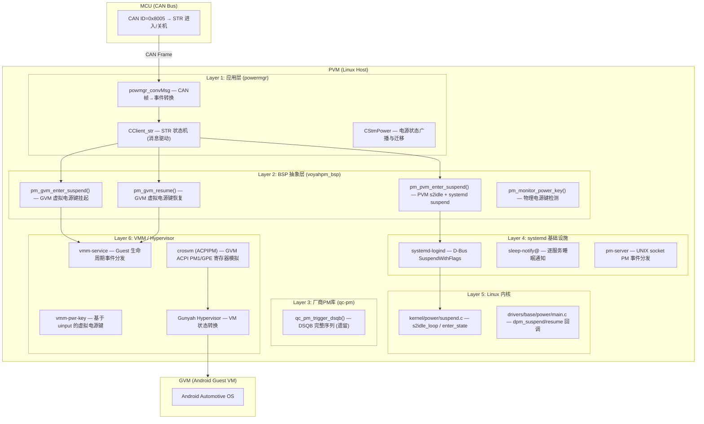
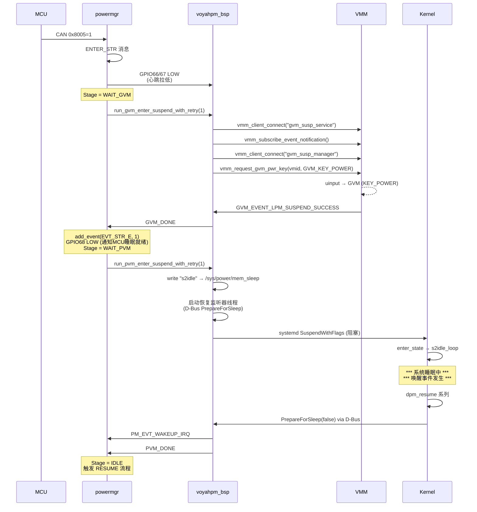
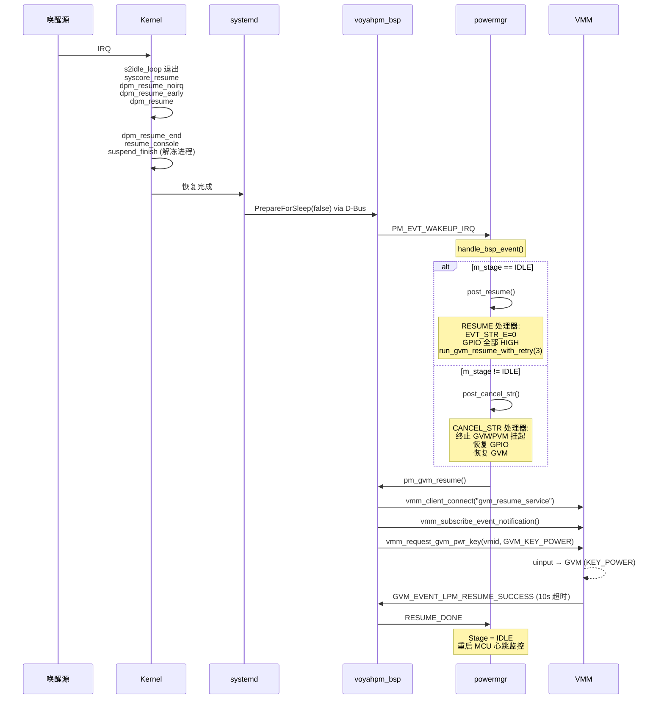
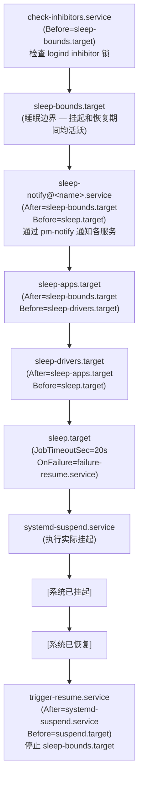
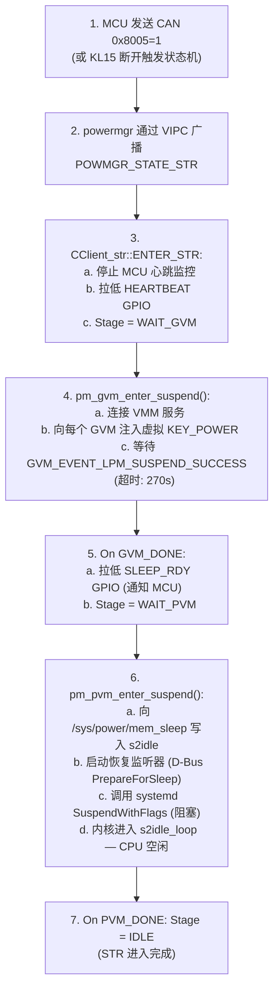
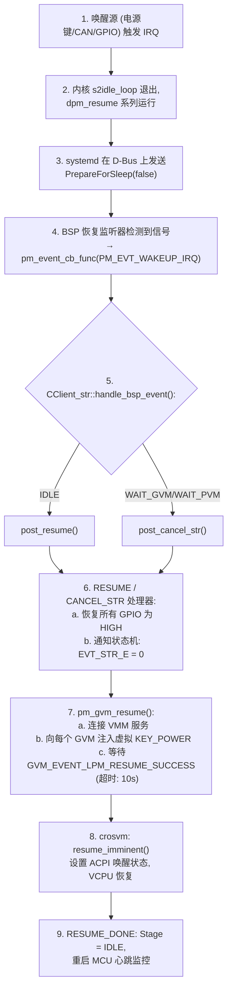

# H47A_8397 STR (Suspend-to-RAM) 流程分析

> **文档编号**: H47A_8397_STR_PROCESS_ANALYSIS
> **平台**: Qualcomm SA8797 (IVI8397)
> **架构**: PVM (Linux Host) + GVM (Android Guest VM), 基于 Gunyah Hypervisor
> **源码根目录**: `apps_proc/`
> **日期**: 2026-06-25

---

## 1. 系统架构概述



**六层软件栈:**

| 层级 | 组件 | 职责 |
|------|------|------|
| **Layer 1** | `powermgr` (应用层) | STR 编排、电源状态广播、CAN 事件转换 |
| **Layer 2** | `voyahpm_bsp` (BSP 抽象) | s2idle 配置、systemd suspend、GVM 电源管理、GPIO 控制 |
| **Layer 3** | `qc-pm` (遗留) | 完整 DSQB 序列 (GVM+安全监控器+PVM 协调) |
| **Layer 4** | systemd 基础设施 | D-Bus SuspendWithFlags、睡眠通知链、pm-server |
| **Layer 5** | Linux 内核 | s2idle CPU 空闲循环、设备 PM 回调 |
| **Layer 6** | VMM / Gunyah | 虚拟电源键注入、ACPI 寄存器模拟、VM 状态转换 |

---

## 2. STR 进入流程 (Suspend Entry)

### 2.1 触发源

系统有两种路径进入 STR 流程：

#### 2.1.1 路径 A: MCU CAN 指令 (主要路径)

MCU 通过 CAN 总线发送 `0x8005` 帧来命令系统进入 STR。

**代码佐证**: `voyah-cluster/powermgr/src/powmgr_convMsg.cpp:502-518`

```cpp
// CAN 帧 ID=0x8005, frame_bytes[0]==1 → 进入 STR
// CAN 帧 ID=0x8005, frame_bytes[0]==0 → 关机
else if(msg.frame_id == 0x8005)
{
    if(msg.frame_bytes[0] == 1)
    {
        // ... rpcd 通知 ...
        get_powerAppIns()->get_clientMgrIns()->get_clientStr_objPtr()->post_enter_str();
    }
    else if(msg.frame_bytes[0] == 0)
    {
        // ... rpcd 通知 ...
        get_powerAppIns()->get_clientMgrIns()->get_clientStr_objPtr()->post_shutdown();
    }
}
```

| CAN ID | byte[0] | 动作 |
|--------|---------|------|
| `0x8005` | `1` | `post_enter_str()` → 进入 STR |
| `0x8005` | `0` | `post_shutdown()` → 系统关机 |

#### 2.1.2 路径 B: 状态机迁移 (KL15 断电)

当 KL15 (ACC/点火信号) 断开且无唤醒源激活时，电源状态机从 STANDBY 迁移到 STR。

**代码佐证**: `voyah-cluster/powermgr/tool/auto_gen_src.c:278-300` (状态转换表)

```
迁移: STANDBY --[EVT_STR_E=1 && KL15=0 && WAKEUP=0]--> STR
迁移: STR     --[WAKEUP=1 || KL15=1]----------------> STANDBY
```

**事件定义**: `voyah-cluster/powermgr/tool/auto_gen_header.h`
```c
typedef enum stm_evt_tag {
    EVT_SLEEP_STANDBY_E,   // 0  — 冷启动
    EVT_STR_STANDBY_E,     // 1  — STR启动
    EVT_WAKEUP_E,          // 2  — CAN网络唤醒
    EVT_KL15_E,            // 4  — KL15信号
    EVT_STR_E,             // 10 — STR事件
    // ...
} stm_evt_t;
```

**转换守卫函数验证** (`auto_gen_src.c`):

STANDBY → STR 守卫函数 (`powmgr_trans_10_4_2_func_2`, 第 29-35 行):
```c
// 条件: str_e==1 && kl15_e==0 && wakeup_e==0
return (str_e==1 && kl15_e==0 && wakeup_e==0);
```

STR → STANDBY 守卫函数 (`powmgr_trans_2_4_func_1`, 第 22-27 行):
```c
// 条件: wakeup_e==1 || kl15_e==1
return (wakeup_e==1 || kl15_e==1);
```

### 2.2 STR 进入流程 — 逐步骤分析

#### 步骤 0: 状态机广播 STR 状态

进入 STR 状态时，`CStmPower::CStmPower_strOpen()` 通过 VIPC 共享内存 IPC 向所有订阅者广播电源状态。

**代码佐证**: `voyah-cluster/powermgr/src/powmgr_stmPower.cpp:372-378`

```cpp
int32_t CStmPower::CStmPower_strOpen()
{
    VLOGI("CStmPower_strOpen");
    broadcast_powerstate(POWMGR_STATE_STR);   // 通过 VIPC 广播 "STR"
    return 0;
}
```

**状态值定义**: `voyah-cluster/powermgr/inc/powmgr_common.h:39-57`
```c
typedef enum {
    POWMGR_STATE_SLEEP,          // 0
    POWMGR_STATE_STANDBY,        // 1
    POWMGR_STATE_STANDBY_ALARM,  // 2
    POWMGR_STATE_ANIMATION,      // 3
    POWMGR_STATE_GUARDMODE,      // 4
    POWMGR_STATE_STR,            // 5  ← STR 状态
    POWMGR_STATE_OTAMODE,        // 6
    POWMGR_STATE_NORMALMODE,     // 7
    POWMGR_STATE_MAX,
} powmgr_state_t;
```

**VIPC 发布主题**: `voyah-cluster/powermgr/inc/powmgr_clientVipc.h:17` — 发布于主题 `"Power/EFSM/mode"`，值为 `"STR"`。

#### 步骤 1: 入队 ENTER_STR 消息

`CClient_str::post_enter_str()` 向工作线程的消息队列推入 `ENTER_STR` 消息。

**代码佐证**: `voyah-cluster/powermgr/src/powmgr_clientStr.cpp:550-561`

```cpp
int32_t CClient_str::post_enter_str()
{
    if (!m_worker_running.load()) {
        (void)start_thread();
    }
    {
        std::lock_guard<std::mutex> lk(m_q_mtx);
        m_q.push({MsgType::ENTER_STR, PM_OK});
    }
    m_q_cv.notify_one();
    return 0;
}
```

**消息类型定义**: `voyah-cluster/powermgr/inc/powmgr_clientStr.h:101-111`
```cpp
enum class MsgType : uint8_t {
    ENTER_STR = 0,
    ABORT,
    CANCEL_STR,
    GVM_DONE,
    PVM_DONE,
    RESUME,
    RESUME_DONE,
    STOP,
    SHUT_DOWN,
};
```

**流程阶段定义**: `voyah-cluster/powermgr/inc/powmgr_clientStr.h:139-143`
```cpp
enum class FlowStage : uint8_t {
    IDLE = 0,
    WAIT_GVM,
    WAIT_PVM,
};
```

#### 步骤 2: Worker 线程 — ENTER_STR 处理

工作线程 `thread_main()` 收到 `ENTER_STR` 消息后开始编排挂起序列。流程有三个阶段: `IDLE → WAIT_GVM → WAIT_PVM → IDLE`。

**代码佐证**: `voyah-cluster/powermgr/src/powmgr_clientStr.cpp:303-350`

```cpp
if (msg.type == MsgType::ENTER_STR) {
    // (a) 重置睡眠周期状态
    m_bsp_event_notified = false;

    // (b) 停止 MCU 心跳监控 (MCU 将停止期待定期心跳)
    CClientHeartbeat* heartbeat_client = ...;
    if (heartbeat_client != nullptr) {
        heartbeat_client->stop_mcu_heartbeat_monitor();
    }

    // (c) 守卫: 只允许从 IDLE 开始
    if (m_stage != FlowStage::IDLE) { continue; }

    // (d) 重置流程状态
    m_need_cancel_str.store(false);
    m_flow_gen++;
    m_retry_left = 3;   // GVM+PVM 共享重试预算

    // (e) GPIO: 拉低心跳引脚 (通知 MCU 虚拟机即将休眠)
    (void)pm_bsp_gpio_set(PM_PIN_PVM_HEARTBEAT, PM_PIN_LOW);  // GPIO 66
    (void)pm_bsp_gpio_set(PM_PIN_GVM_HEARTBEAT, PM_PIN_LOW);  // GPIO 67

    // (f) 阶段转换: IDLE → WAIT_GVM
    m_stage = FlowStage::WAIT_GVM;

    // (g) 创建 detached 线程执行阻塞式 GVM 挂起
    m_gvm_thread = std::thread([this, gen]() {
        const pm_status_t st = this->run_gvm_enter_suspend_with_retry(1);
        this->m_gvm_running.store(false);
        const pm_status_t packed = (pm_status_t)((((uint32_t)gen) << 16) | ...);
        this->enqueue_msg(MsgType::GVM_DONE, packed);
    });
    m_gvm_thread.detach();
}
```

**GPIO 引脚定义**: `voyah-bsp/voyahpm-bsp/src/voyahpm_bsp.c:104-108`
```c
#define VOYAHPM_GPIO_LINE_SLEEP_RDY       68   // 通知 MCU SoC 准备睡眠
#define VOYAHPM_GPIO_LINE_SLEEP_DONE      -1   // SA8397: 由 PMIC 控制，无需 Host 控制
#define VOYAHPM_GPIO_LINE_PVM_HEARTBEAT   66   // PVM 存活指示
#define VOYAHPM_GPIO_LINE_GVM_HEARTBEAT   67   // GVM 存活指示
#define VOYAHPM_GPIO_LINE_WAKEUP_SRC_REQ  -1   // SA8397: 由 MCU 控制，无需 Host 控制
```

#### 步骤 3: GVM 挂起 — `pm_gvm_enter_suspend()`

这是一个在专用线程中运行的**阻塞调用**。它连接到 VMM 服务，向每个 GVM 发送虚拟电源键，并等待 GVM 确认挂起完成。

**代码佐证**: `voyah-bsp/voyahpm-bsp/src/voyahpm_bsp.c:1113-1262`

```
调用序列:
  pm_gvm_enter_suspend()
    |
    +--[1] vmm_client_connect("gvm_susp_service", VMM_SERVICE_SERVER, &vmm_handle)
    |       连接到 VMM 事件服务 (Unix 域套接字)
    |
    +--[2] vmm_subscribe_event_notification(vmm_handle, pm_num_gvms, pm_gvmids, &s_attr)
    |       订阅 GVM 生命周期事件:
    |         GVM_UP_AND_RUNNING | GVM_SHUTDOWN_LEVEL_1 | GVM_SHUTDOWN_LEVEL_2
    |         | GVM_EVENT_LPM_SUSPEND_SUCCESS | GVM_EVENT_LPM_RESUME_SUCCESS
    |       回调: pm_gvm_event_cb()
    |
    +--[3] vmm_client_connect("gvm_susp_manager", VMM_POWER_MANAGER_SERVER, &vmm_pwr_key_handle)
    |       连接到虚拟电源键管理器 (套接字: /tmp/vmm_pwr_mgr_server)
    |
    +--[4] 设置终止标志 (在遍历 GVM 之前):
    |       a. atomic_store(&pm_gvm_suspend_can_be_terminated, true)
    |       b. atomic_store(&pm_gvm_suspend_terminate_completed, false)
    |
    +--[5] 对每个 GVM (遍历 pm_gvmids[]):
    |       a. vmm_request_gvm_pwr_key(vmid, GVM_KEY_POWER, vmm_pwr_key_handle)
    |          → 向 GVM 的 uinput 设备注入虚拟 KEY_POWER
    |       b. pthread_cond_timedwait(超时 = PM_TIMEOUT_270S)
    |          等待 GVM_EVENT_LPM_SUSPEND_SUCCESS 回调
    |       c. 检查 pm_gvm_suspend_terminate_completed 标志 (电源键中断)
    |       d. 若超时 (270s) 或出错 → 返回 PM_ERR_TIMEOUT / PM_ERR_GENERIC
    |
    +--[6] cleanup: vmm_client_disconnect 句柄, 重置 atomic 标志
```

**GVM 事件回调**: `voyah-bsp/voyahpm-bsp/src/voyahpm_bsp.c:1074-1100`
```c
static int pm_gvm_event_cb(uint32_t vmid, vmm_event_t event, void *sync)
{
    pm_resp_sync_struct *priv_data = (pm_resp_sync_struct *)sync;
    pthread_mutex_lock(&priv_data->lock);
    if (event == GVM_EVENT_LPM_SUSPEND_SUCCESS) {
        priv_data->gvm_suspend_success = true;
    } else if (event == GVM_EVENT_LPM_RESUME_SUCCESS) {
        priv_data->gvm_resume_success = true;
    } else if (event & GVM_SHUTDOWN_LEVEL_1) {
        priv_data->gvm_shutdown_success = true;
    }
    pthread_cond_signal(&priv_data->cond);
    pthread_mutex_unlock(&priv_data->lock);
    return PM_OK;
}
```

**VMM 事件定义**: `vendor/qcom/proprietary/vmm-service-noship/vmm-lib/include/vmm_events.h:26-27`
```c
GVM_EVENT_LPM_SUSPEND_SUCCESS = (BIT_POS << 8),   // BIT_POS = 0x01U
GVM_EVENT_LPM_RESUME_SUCCESS  = (BIT_POS << 9),
```

**VMM 侧虚拟电源键注入**: `vendor/qcom/proprietary/virtual-power-key/src/vmm-pwr-key-main.c:180-197`
```c
// 向 GVM 的 uinput 设备注入 KEY_POWER (KEY_DOWN + SYN + KEY_UP + SYN)
inject_pwr_key_event(fd, KEY_POWER);
```

**机制说明**: 虚拟电源键服务 (`vmm-pwr-key-main.c`) 为每个 GVM 维护 uinput 设备。
当收到 `GVM_KEY_POWER` 请求时，通过 `report_one_key_event()` 写入:
```
KEY_DOWN (type=EV_KEY, code=KEY_POWER, value=1) → SYN_REPORT (type=EV_SYN, code=SYN_REPORT, value=0)
KEY_UP   (type=EV_KEY, code=KEY_POWER, value=0) → SYN_REPORT (type=EV_SYN, code=SYN_REPORT, value=0)
```

GVM (Android) 收到 `KEY_POWER` 后触发其自身的挂起流程。挂起完成后，Gunyah 通过 VMM 服务报告 `GVM_EVENT_LPM_SUSPEND_SUCCESS` 给已注册客户端 (即 `pm_gvm_event_cb`)。

#### 步骤 4: GVM_DONE 消息处理

GVM 挂起线程结束时，向工作队列投递 `GVM_DONE`。

**代码佐证**: `voyah-cluster/powermgr/src/powmgr_clientStr.cpp:353-428`

```
thread_main() 收到 GVM_DONE:
  |
  +-- 校验: stage == WAIT_GVM, generation 匹配
  +-- 检查 m_need_cancel_str (GVM 挂起期间是否有唤醒请求?)
  +-- 若 st != PM_OK 且 m_retry_left > 0:
  |     重试 GVM 挂起 (消耗 1 预算)
  |     m_retry_left 在 GVM 和 PVM 间共享 (初始 = 3)
  +-- 若重试耗尽:
  |     STR 进入失败, m_stage = IDLE
  +-- 若 GVM 挂起成功:
        |
        +-- add_event(EVT_STR_E, 1)                 // 通知状态机
        +-- pm_bsp_gpio_set(PM_PIN_SLEEP_RDY, PM_PIN_LOW)  // GPIO 68 LOW
        |     向 MCU 发信号: "SoC 即将进入睡眠"
        +-- m_stage = WAIT_PVM
        +-- 创建 m_pvm_thread → run_pvm_enter_suspend_with_retry(1)
```

#### 步骤 5: PVM 挂起 — `pm_pvm_enter_suspend()`

这是一个**阻塞调用**，配置 s2idle 模式、启动恢复监听器、触发 systemd suspend。

**代码佐证**: `voyah-bsp/voyahpm-bsp/src/voyahpm_bsp.c:1001-1025`

```c
pm_status_t pm_pvm_enter_suspend(void)
{
    pm_status_t st = pm_bsp_check_init(__FUNCTION__);
    if (st != PM_OK) { return st; }

    // (a) 配置挂起模式: 写入 "s2idle" 到 /sys/power/mem_sleep
    st = pm_set_pvm_str_mode();
    if (st != PM_OK) { return st; }

    // (b) 在触发挂起**之前**启动恢复监听器
    //     确保不会遗漏 PrepareForSleep(false) 信号
    st = pm_pvm_start_resume_listener();
    if (st != PM_OK) { return st; }

    // (c) 触发 systemd suspend (阻塞 — 仅在恢复后返回)
    st = pm_pvm_systemd_suspend();
    if (st != PM_OK) { return st; }

    return PM_OK;
}
```

##### 5a. 设置 s2idle 模式

**代码佐证**: `voyah-bsp/voyahpm-bsp/src/voyahpm_bsp.c:408-443`

```c
static pm_status_t pm_set_pvm_str_mode(void)
{
    // 读当前 mem_sleep
    fp = fopen(PM_SYS_POWER_MEM_SLEEP_PATH, "r");  // "/sys/power/mem_sleep"
    // ...
    // 写入 "s2idle" 到 /sys/power/mem_sleep
    if (fprintf(fp, "s2idle\n") < 0) { ... }
    voyahpm_info("%s set to s2idle", PM_SYS_POWER_MEM_SLEEP_PATH);
    return PM_OK;
}
```

这配置内核使用 **Suspend-to-Idle** (s2idle) 而非深度挂起。在 s2idle 下，CPU 进入空闲状态但系统未完全断电——恢复延迟最小。

##### 5b. 启动恢复监听器 (D-Bus PrepareForSleep)

创建 detached 线程监听 systemd `PrepareForSleep` D-Bus 信号。当收到 `start=false` 时，表示系统已恢复，BSP 通知上层。

**代码佐证**: `voyah-bsp/voyahpm-bsp/src/voyahpm_bsp.c:523-634`

```c
static pm_status_t pm_pvm_start_resume_listener(void)
{
    // 打开 system D-Bus 连接
    sd_bus_open_system(&listen_bus);

    // 匹配: org.freedesktop.login1.Manager.PrepareForSleep
    sd_bus_match_signal(listen_bus, &listen_slot, NULL,
                        "/org/freedesktop/login1",         // 对象路径
                        "org.freedesktop.login1.Manager",  // 接口
                        "PrepareForSleep",                 // 信号名
                        pm_pvm_prepforsleep_handler, NULL);

    // 创建 detached 线程, 256KB 自定义栈
    pthread_create(&tid, &attr, pm_pvm_wait_for_device_resume_thread, ctx);
}
```

**恢复监听器线程**: `voyah-bsp/voyahpm-bsp/src/voyahpm_bsp.c:475-517`

```c
static void *pm_pvm_wait_for_device_resume_thread(void *arg)
{
    while (!pm_pvm_resumed) {
        ret = sd_bus_process(ctx->bus, NULL);   // 处理 D-Bus 消息
        if (ret > 0) continue;                   // 消息已处理
        ret = sd_bus_wait(ctx->bus, (uint64_t)-1); // 阻塞等待下一条消息
    }
    // 检测到恢复: 通过回调通知上层
    if (pm_pvm_resumed && pm_event_cb_func) {
        pm_event_cb_func(PM_EVT_WAKEUP_IRQ, NULL, 0);
    }
    // 清理 bus/slot
    return NULL;
}
```

**PrepareForSleep 处理函数**: `voyah-bsp/voyahpm-bsp/src/voyahpm_bsp.c:448-473`

```c
static int32_t pm_pvm_prepforsleep_handler(sd_bus_message *m, ...)
{
    int32_t current_state;
    sd_bus_message_read(m, "b", &current_state);

    if (current_state == false) {
        // current_state = false → 系统已恢复
        voyahpm_info("system resumed from suspend!!");
        pm_pvm_resumed = true;
        atomic_store(&pm_pvm_suspend_can_be_terminated, false);
    }
    return 0;
}
```

##### 5c. 触发 systemd Suspend

**代码佐证**: `voyah-bsp/voyahpm-bsp/src/voyahpm_bsp.c:636-674`

```c
static pm_status_t pm_pvm_systemd_suspend(void)
{
    sync();  // Best-effort 文件系统刷新

    sd_bus_default_system(&bus);

    atomic_store(&pm_pvm_suspend_can_be_terminated, true);

    // D-Bus 调用: org.freedesktop.login1.Manager.SuspendWithFlags(flags)
    // 此调用会**阻塞**直到系统从挂起中恢复
    ret = sd_bus_call_method(bus,
                             "org.freedesktop.login1",           // 服务
                             "/org/freedesktop/login1",          // 对象路径
                             "org.freedesktop.login1.Manager",   // 接口
                             "SuspendWithFlags",                 // 方法
                             &error,
                             NULL,                               // 无需回复
                             "t",                                // 输入签名: uint64
                             flags);       // SD_LOGIND_ROOT_CHECK_INHIBITORS
    // ...
    return PM_OK;  // 仅当系统从挂起恢复后才返回
}
```

#### 步骤 6: 内核挂起序列

systemd 收到 `SuspendWithFlags` 调用后，触发内核电源管理子系统。

**代码佐证**: `kernel/kernel_platform/kernel/kernel/power/suspend.c`

```
pm_suspend(state)                          [suspend.c:618]
  |
  +-- enter_state(state)                   [suspend.c:560-635]
        |
        +-- s2idle_begin()                 [suspend.c:579]
        +-- ksys_sync_helper()             [suspend.c:583]  — 文件系统同步
        +-- suspend_prepare()              [suspend.c:589]
        |     冻结用户空间进程
        |     调用 PM_SUSPEND_PREPARE 通知链
        |
        +-- suspend_devices_and_enter()    [suspend.c:489-537]
        |     |
        |     +-- platform_suspend_begin(state)
        |     +-- suspend_console()
        |     +-- dpm_suspend_start(PMSG_SUSPEND)
        |     |     遍历 dpm_list, 对每个设备调用 →suspend()
        |     |     参见: drivers/base/power/main.c
        |     |
        |     +-- suspend_enter(state)     [suspend.c:404-483]
        |     |     |
        |     |     +-- dpm_suspend_late(PMSG_SUSPEND)
        |     |     +-- dpm_suspend_noirq(PMSG_SUSPEND)
        |     |     +-- s2idle_loop()      [suspend.c:434]
        |     |     |     CPU 进入 idle, 等待唤醒中断
        |     |     |     循环继续直到检测到唤醒
        |     |     |
        |     |     |   *** 系统处于睡眠状态 ***
        |     |     |   *** 唤醒事件发生 ***
        |     |     |
        |     |     +-- syscore_resume()
        |     |     +-- dpm_resume_noirq(PMSG_RESUME)
        |     |     +-- dpm_resume_early(PMSG_RESUME)
        |     |     +-- dpm_resume(PMSG_RESUME)          [main.c:997-1036]
        |     |
        |     +-- dpm_resume_end(PMSG_RESUME)
        |     +-- resume_console()
        |
        +-- suspend_finish()              [suspend.c:545]
              解冻用户空间进程
              调用 PM_POST_SUSPEND 通知链
```

**mem_sleep 状态**: `kernel/kernel_platform/kernel/kernel/power/suspend.c:42-49`
```c
// 默认: mem_sleep_current = PM_SUSPEND_TO_IDLE  (第 49 行)
static const char * const mem_sleep_states[] = {
    [PM_SUSPEND_TO_IDLE] = "s2idle",
    [PM_SUSPEND_STANDBY] = "shallow",
    [PM_SUSPEND_MEM]     = "deep",
};
```

**设备 PM 回调** 按 Linux PM 核心定义的顺序执行 (`kernel/kernel_platform/kernel/drivers/base/power/main.c`):
- `__device_suspend()` (第 561 行): 从 `dev->pm_domain->ops`, `dev->type->pm`, `dev->class->pm`, `dev->bus->pm`, `dev->driver->pm` 中调用 `.suspend`
- `device_resume()` (第 884 行): 以**反向优先级顺序**调用 `.resume`
- `dpm_resume()` (第 997 行): 以 LIFO 顺序遍历 `dpm_suspended_list`

#### 步骤 7: PVM_DONE 消息处理

系统恢复后 `pm_pvm_systemd_suspend()` 返回，PVM 线程向工作队列投递 `PVM_DONE`。

**代码佐证**: `voyah-cluster/powermgr/src/powmgr_clientStr.cpp:431-489`

```cpp
if (msg.type == MsgType::PVM_DONE) {
    // 校验 stage == WAIT_PVM 且 generation 匹配
    // 检查 m_need_cancel_str
    // 若 st != PM_OK 且 m_retry_left > 0: 重试 PVM 挂起
    // 若成功: STR 进入完成
    //     m_stage = IDLE
    //     (恢复将在单独的 RESUME 消息中处理)
}
```

**重要说明**: 当 PVM_DONE 以 `PM_OK` 到达时，意味着系统已进入睡眠并成功唤醒。STR 进入流程现已完成。唤醒信号 (`PM_EVT_WAKEUP_IRQ`) 已通过 BSP 恢复监听器线程投递到 `handle_bsp_event()`。若此时 `m_stage != IDLE`，cancel 流程处理；若已为 IDLE，则触发 resume 流程。

### 2.3 STR 进入时序图



---

## 3. STR 恢复流程 (Resume/Wakeup)

### 3.1 唤醒源

系统可由以下任一事件唤醒:

| 唤醒源 | 检测方式 | 代码位置 |
|--------|---------|---------|
| **物理电源键** | `pm_monitor_power_key_thread()` 从 `/dev/input/by-path/platform-soc@0:gpio-keys-event` 读取 `KEY_POWER` | `voyahpm_bsp.c:778-836` |
| **MCU GPIO 中断** | 通过 PMIC 路由的唤醒 IRQ | 硬件层面 |
| **CAN 总线活动** | MCU 发送 CAN 唤醒帧 | `powmgr_convMsg.cpp:458-471` |

### 3.2 恢复流程 — 逐步骤分析

#### 步骤 0: 内核层面恢复

内核 `s2idle_loop()` 检测到唤醒中断。CPU 退出 idle，内核以挂起的逆序开始设备恢复序列。

**代码佐证**: `kernel/kernel_platform/kernel/kernel/power/suspend.c:459-483`

```c
// 在 suspend_enter() 内部, s2idle_loop() 唤醒后:
syscore_resume();                          // 第 459 行 — 系统核心操作恢复
platform_resume_noirq(state);              // 第 471 行
dpm_resume_noirq(PMSG_RESUME);             // 第 472 行 — 设备在 IRQ 禁用下恢复
platform_resume_early(state);              // 第 475 行
dpm_resume_early(PMSG_RESUME);             // 第 478 行 — 设备早期恢复
platform_resume_finish(state);             // 第 481 行
// 然后回到 suspend_devices_and_enter():
dpm_resume_end(PMSG_RESUME);               // 第 523 行 — 完整设备恢复
resume_console();                          // 第 526 行
```

**设备恢复回调分发**: `kernel/kernel_platform/kernel/drivers/base/power/main.c:997-1036`
```c
// dpm_resume() 以 LIFO 顺序遍历 dpm_suspended_list
// device_resume() 按以下 PM ops 链调用 .resume:
//   dev->pm_domain->ops, dev->type->pm, dev->class->pm, dev->bus->pm, dev->driver->pm
```

#### 步骤 1: systemd 发送 PrepareForSleep(false)

内核恢复完成后，systemd-logind 在 D-Bus 上广播 `PrepareForSleep` 信号，`start=false`。BSP 的恢复监听器线程接收此信号。

**代码佐证**: `voyah-bsp/voyahpm-bsp/src/voyahpm_bsp.c:448-517`

```
PrepareForSleep(false) 到达 system D-Bus
  |
  +-- pm_pvm_prepforsleep_handler()  [第 448 行]
  |     current_state == false → pm_pvm_resumed = true
  |
  +-- pm_pvm_wait_for_device_resume_thread() 退出等待循环  [第 486 行]
  |
  +-- pm_event_cb_func(PM_EVT_WAKEUP_IRQ, NULL, 0)  [第 510 行]
        通知业务层 (CClient_str)
```

#### 步骤 2: 电源键检测 (备选路径)

物理电源键监控线程并⾏检测按键。

**代码佐证**: `voyah-bsp/voyahpm-bsp/src/voyahpm_bsp.c:778-836`

```c
static void *pm_monitor_power_key_thread(void *arg)
{
    while (1) {
        // 打开 /dev/input/by-path/platform-soc@0:gpio-keys-event
        fd = open(PVM_POWER_KEY_DEV_PATH, O_RDONLY);
        // 读取 input_event 结构体
        bytes_read = read(fd, &ev, sizeof(ev));
        if (ev.type == EV_KEY && ev.code == KEY_POWER) {
            if (ev.value == 1) {  // 按下
                // 仅在 GVM 挂起处于可终止状态时处理
                if (!atomic_load(&pm_gvm_suspend_can_be_terminated)) {
                    continue;  // 忽略 — PVM 已正常恢复
                }
                // 通知上层: 唤醒 IRQ
                pm_event_cb_func(PM_EVT_WAKEUP_IRQ, NULL, 0);
            }
        }
    }
}
```

**注意**: 电源键监控仅在 `pm_gvm_suspend_can_be_terminated == true` 时处理事件。
若 PVM 已正常恢复 (`can_be_terminated` 在 `PrepareForSleep(false)` 中已清为 false)，电源键被忽略。
此线程仅在 STR **进入期间**作为备选唤醒路径（防止 BSP 恢复监听器遗漏信号）。

#### 步骤 3: BSP 事件由 CClient_str 处理

BSP 回调 `CClient_str::bsp_event_cb()` 通过 `m_onNotice` 将事件转发到主线程。

**代码佐证**: `voyah-cluster/powermgr/src/powmgr_clientStr.cpp:21-67`

```cpp
static void CClient_str::bsp_event_cb(pm_event_type_t event_type, void *data, uint32_t len)
{
    // 转发到主线程上下文
    g_str_client->m_onNotice([=]() {
        g_str_client->handle_bsp_event(event_type);
    });
}

void CClient_str::handle_bsp_event(pm_event_type_t event_type)
{
    if (event_type == PM_EVT_WAKEUP_IRQ && (m_bsp_event_notified == false)) {
        m_bsp_event_notified = true;  // 本睡眠周期去重

        // 特殊情况: 若正在关机关闭，直接重启 SOC
        if (m_shutdowning) {
            VLOGI("[STR] BSP event: pm_reboot_soc");
            pm_reboot_soc();
        }

        if (m_stage == FlowStage::IDLE) {
            // 正常恢复: 系统已完全挂起，现在唤醒
            VLOGI("[STR] BSP event: post_resume");
            (void)this->post_resume();
        }
        else {
            // 中断: STR 进入进行中 (WAIT_GVM 或 WAIT_PVM)
            VLOGI("[STR] BSP event: post_cancel_str");
            (void)this->post_cancel_str();
        }
    }
}
```

#### 步骤 4a: RESUME 消息处理 (m_stage == IDLE)

系统已完全挂起并正常唤醒时，运行 `RESUME` 消息处理器。

**代码佐证**: `voyah-cluster/powermgr/src/powmgr_clientStr.cpp:280-301`

```cpp
if (msg.type == MsgType::RESUME) {
    // (a) 通知状态机退出 STR 状态
    get_powStmMgrIns()->add_event(EVT_STR_E, 0, STMPOWMGR_TYPE);

    // (b) 递增 generation (防止过期消息)
    m_flow_gen++;

    // (c) 恢复 GPIO: 通知 MCU 系统已唤醒
    (void)pm_bsp_gpio_set(PM_PIN_SLEEP_RDY, PM_PIN_HIGH);      // GPIO 68
    (void)pm_bsp_gpio_set(PM_PIN_PVM_HEARTBEAT, PM_PIN_HIGH);   // GPIO 66
    (void)pm_bsp_gpio_set(PM_PIN_GVM_HEARTBEAT, PM_PIN_HIGH);   // GPIO 67

    // (d) 创建线程恢复 GVM (最多重试 3 次)
    m_resume_thread = std::thread([this, gen]() {
        const pm_status_t st = this->run_gvm_resume_with_retry(3);
        const pm_status_t packed = ...;
        this->enqueue_msg(MsgType::RESUME_DONE, packed);
    });
    m_resume_thread.detach();
}
```

#### 步骤 4b: CANCEL_STR 消息处理 (m_stage != IDLE)

当 STR 进入进行中 (GVM 或 PVM 仍在挂起) 时发生唤醒，cancel 流程中止挂起并启动恢复。

**代码佐证**: `voyah-cluster/powermgr/src/powmgr_clientStr.cpp:234-278`

```cpp
if (msg.type == MsgType::CANCEL_STR) {
    m_need_cancel_str.store(true);   // 通知进行中的操作中止

    if (m_stage == FlowStage::WAIT_GVM) {
        // GVM 仍在挂起:
        //   - 立即恢复心跳 GPIO
        //   - 调用 pm_gvm_terminate_suspend() (阻塞 VMM 协议,
        //     向每个 GVM 发送 KEY_POWER, 发信号 CV 解除
        //     pm_gvm_enter_suspend 阻塞, 然后返回 — 不等待
        //     GVM 恢复确认)
        (void)pm_bsp_gpio_set(PM_PIN_PVM_HEARTBEAT, PM_PIN_HIGH);
        (void)pm_bsp_gpio_set(PM_PIN_GVM_HEARTBEAT, PM_PIN_HIGH);
        m_flow_gen++;
        const pm_status_t st = pm_gvm_terminate_suspend();
        this->enqueue_msg(MsgType::RESUME_DONE, packed);
    }
    else if (m_stage == FlowStage::WAIT_PVM) {
        // PVM 在挂起 (GVM 已挂起):
        //   - 终止 PVM 挂起 (非阻塞)
        //   - 恢复 GVM
        (void)pm_pvm_terminate_suspend();
        m_flow_gen++;
        get_powStmMgrIns()->add_event(EVT_STR_E, 0, STMPOWMGR_TYPE);
        (void)pm_bsp_gpio_set(PM_PIN_SLEEP_RDY, PM_PIN_HIGH);
        (void)pm_bsp_gpio_set(PM_PIN_PVM_HEARTBEAT, PM_PIN_HIGH);
        (void)pm_bsp_gpio_set(PM_PIN_GVM_HEARTBEAT, PM_PIN_HIGH);

        m_resume_thread = std::thread([this, gen]() {
            const pm_status_t st = this->run_gvm_resume_with_retry(1);
            this->enqueue_msg(MsgType::RESUME_DONE, packed);
        });
    }
}
```

**GVM 终止挂起**: `voyah-bsp/voyahpm-bsp/src/voyahpm_bsp.c:1273-1339`

```c
pm_status_t pm_gvm_terminate_suspend(void)
{
    // 守卫: 仅在 GVM 挂起进行中时继续
    if (!atomic_load(&pm_gvm_suspend_can_be_terminated)) {
        return PM_OK;  // 不在 GVM 挂起流程中，无需操作
    }

    // 连接到虚拟电源键管理器
    vmm_client_connect("gvm_terminate_susp_manager", VMM_POWER_MANAGER_SERVER, &vmm_pwr_key_handle);

    // 对每个 GVM: 注入 KEY_POWER 以唤醒/取消挂起
    for (gvm_idx = 0; gvm_idx < pm_num_gvms; gvm_idx++) {
        vmm_request_gvm_pwr_key(pm_gvmids[gvm_idx], GVM_KEY_POWER, vmm_pwr_key_handle);
    }

    // 通知等待中的 pm_gvm_enter_suspend() 中止
    pthread_mutex_lock(&pm_gvm_suspend_sync_state.lock);
    atomic_store(&pm_gvm_suspend_terminate_completed, true);
    pthread_cond_broadcast(&pm_gvm_suspend_sync_state.cond);
    pthread_mutex_unlock(&pm_gvm_suspend_sync_state.lock);

    vmm_client_disconnect(vmm_pwr_key_handle);
    return PM_OK;
}
```

#### 步骤 5: GVM 恢复 — `pm_gvm_resume()`

这是一个阻塞调用，通过注入虚拟电源键并等待恢复确认来恢复每个 GVM。

**代码佐证**: `voyah-bsp/voyahpm-bsp/src/voyahpm_bsp.c:1352-1536`

```c
pm_status_t pm_gvm_resume(void)
{
    // 初始化本地同步 (mutex + condvar, CLOCK_MONOTONIC)
    // ...

    // 连接到 VMM 事件服务
    vmm_client_connect("gvm_resume_service", VMM_SERVICE_SERVER, &vmm_handle);

    // 订阅事件: GVM_EVENT_LPM_SUSPEND_SUCCESS | GVM_EVENT_LPM_RESUME_SUCCESS
    vmm_subscribe_event_notification(vmm_handle, pm_num_gvms, pm_gvmids, &s_attr);

    // 连接到虚拟电源键管理器
    vmm_client_connect("gvm_resume_manager", VMM_POWER_MANAGER_SERVER, &vmm_pwr_key_handle);

    // 对每个 GVM:
    for (gvm_idx = 0; gvm_idx < pm_num_gvms; gvm_idx++) {
        // (a) 注入虚拟 KEY_POWER
        vmm_request_gvm_pwr_key(pm_gvmids[gvm_idx], GVM_KEY_POWER, vmm_pwr_key_handle);

        // (b) 等待 GVM_EVENT_LPM_RESUME_SUCCESS, 10s 超时
        ts.tv_sec += PM_TIMEOUT_10S;  // 10 秒
        while (!pm_resp_sync.gvm_suspend_success && !pm_resp_sync.gvm_resume_success) {
            ret = pthread_cond_timedwait(&pm_resp_sync.cond, &pm_resp_sync.lock, &ts);
            if (ret == ETIMEDOUT) {
                status = PM_ERR_TIMEOUT;
                break;
            }
        }
    }

    cleanup:
        // 断开所有 VMM 客户端, 销毁同步对象
        return status;
}
```

**与 GVM 挂起的关键区别**: 恢复同时等待 `GVM_EVENT_LPM_RESUME_SUCCESS` **或** `GVM_EVENT_LPM_SUSPEND_SUCCESS` — 这是 NordAU 平台的 workaround，因为 suspend ACK 有时表示 GVM 已经恢复。

**超时对比**:

| 操作 | 超时时间 | 原因 |
|------|---------|------|
| `pm_gvm_enter_suspend()` | 270 秒 | GVM (Android) 完成挂起可能需要较长时间 |
| `pm_gvm_resume()` | 10 秒 | 恢复预期较快 |
| `qc_pm_trigger_gvm_suspend()` (遗留) | 360 秒 | 更保守的超时 |

#### 步骤 6: crosvm 恢复处理

虚拟电源键到达 GVM 后，Android Guest 恢复。crosvm VMM 处理 ACPI 级别的恢复通知。

**ACPI PM1 唤醒状态**: `external/crosvm/devices/src/acpi.rs:851-855`

```rust
impl BusResumeDevice for ACPIPMResource {
    fn resume_imminent(&mut self) {
        // 在 PM1 状态寄存器中设置 BITMASK_PM1CNT_WAKE_STATUS
        // 通知 GVM 唤醒来自睡眠状态
    }
}
```

**VCPU 恢复**: `external/crosvm/src/linux/mod.rs:1952-1968`

```rust
// 当收到 VmRunMode::Running 时:
//   1. 对每个设备: dev.resume_imminent() — 设置 ACPI 唤醒状态
//   2. 向所有 VCPU 发送 VcpuControl::RunState(VmRunMode::Running)
```

**ACPI 挂起事件触发** (上下文 — GVM 挂起如何发起): `external/crosvm/devices/src/acpi.rs:768-791`

```rust
// 当 GVM 向 ACPI PM1 寄存器写入 SLP_EN + SLEEP_TYPE_S1 时:
//   → 触发 self.suspend_evt.write(1) — 通知 crosvm 主循环
//   → 主循环看到 Token::Suspend
//   → 通过 VcpuControl::RunState(VmRunMode::Suspending) 暂停所有 VCPU
```

#### 步骤 7: RESUME_DONE 处理

GVM 恢复线程结束时向工作队列投递 `RESUME_DONE`。

**代码佐证**: `voyah-cluster/powermgr/src/powmgr_clientStr.cpp:491-545`

```cpp
if (msg.type == MsgType::RESUME_DONE) {
    // 校验 generation
    // ...

    // 清除 cancel 状态
    if (m_need_cancel_str.load()) {
        m_need_cancel_str.store(false);
        m_gvm_resume_retry_left = 0;
    }

    m_stage = FlowStage::IDLE;

    // 通知 MCU 心跳监控 (系统已完全唤醒)
    if (this->m_onNotice) {
        this->m_onNotice([=]() {
            VLOGI("[STR] resume done");
            CClientHeartbeat* heartbeat_client = ...;
            if (heartbeat_client != nullptr) {
                heartbeat_client->notify_mcu_heartbeat_monitor();
            }
        });
    }
}
```

### 3.3 恢复时序图



---

## 4. 状态机迁移

### 4.1 STR 相关状态迁移

**代码佐证**: `voyah-cluster/powermgr/tool/auto_gen_src.c` (自动生成的状态转换表)

```mermaid
stateDiagram-v2
    direction LR

    SLEEP --> STANDBY : WAKEUP=1 或 KL15=1
    STR --> STANDBY : WAKEUP=1 或 KL15=1
    STANDBY --> STR : EVT_STR_E=1 且 KL15=0 且 WAKEUP=0
    STANDBY_ALARM --> STANDBY : STR_E=1 (或无告警条件)

    note right of STR
        broadcast_powerstate("STR")
        通过 VIPC 发布
    end
```

| 从状态 | 事件条件 | 到状态 |
|--------|---------|--------|
| `SLEEP` | `WAKEUP=1` 或 `KL15=1` | `STANDBY` |
| `STR` | `WAKEUP=1` 或 `KL15=1` | `STANDBY` |
| `STANDBY` | `STR_E=1` 且 `KL15=0` 且 `WAKEUP=0` | `STR` |
| `STANDBY_ALARM` | `STR_E=1` (或 `thrmlrunaway=0 && chargelamp=0 && dooropen=0 && epblamp=0`) | `STANDBY` |

### 4.2 电源状态变迁 (STR 周期)

```mermaid
stateDiagram-v2
    direction LR

    NORMALMODE --> STANDBY : KL15 断开, 无唤醒源
    STANDBY --> STR : EVT_STR_E=1<br/>且 KL15=0<br/>且 !WAKEUP
    STR --> STANDBY : 唤醒事件<br/>(电源键/CAN/GPIO)<br/>add_event(EVT_STR_E, 0)
    STANDBY --> NORMALMODE : KL15 接通/系统就绪

    note right of STR
        broadcast_powerstate("STR")
        VIPC 主题: "Power/EFSM/mode"
    end
```

---

## 5. systemd 睡眠链

### 5.1 服务排序



**配置文件**:

| 文件 | 作用 |
|------|------|
| `vendor/qcom/opensource/safelinux-services/power-utils/conf/sleep-bounds.target` | 睡眠边界目标 |
| `vendor/qcom/opensource/safelinux-services/power-utils/conf/sleep.target.d/30-qcom-override.conf` | `JobTimeoutSec=20.0s`, `OnFailure=failure-resume.service` |
| `vendor/qcom/opensource/safelinux-services/power-utils/conf/check-inhibitors.service` | 睡眠前检查 logind inhibitor 锁 |
| `vendor/qcom/opensource/safelinux-services/power-utils/conf/trigger-resume.service` | 恢复后清理 sleep-bounds.target |
| `vendor/qcom/opensource/safelinux-services/power-utils/conf/failure-resume.service` | 睡眠失败时清理 |
| `vendor/qcom/opensource/safelinux-services/power-utils/conf/sleep-notify@.service` | 模板: 通过 pm-server UNIX 套接字通知注册客户端 |

**服务模板内容** (`sleep-notify@.service`):
```ini
[Unit]
Description=%i Sleep Notifier
After=sleep-bounds.target
Before=sleep.target
OnFailure=failure-resume.service

[Service]
Type=oneshot
RemainAfterExit=yes
ExecStart=echo "start %i"
```

> **注意**: 该模板的 `ExecStart` 仅为占位符。实际通知机制由 `pm-server` 通过 UNIX 套接字实现。
> 各服务的 **drop-in 配置文件** 添加 `Before=sleep-apps.target` 和 `PartOf=sleep-apps.target`。

### 5.2 睡眠通知服务

以下已注册服务通过 `pm-notify <name> <cmd>` 接收睡眠通知（连接至 `pm-server` UNIX 套接字 `/run/qcom_pm/<name>.sock`）：

| 服务 | 配置文件 |
|------|---------|
| `rpcd` | `voyah-cluster/rpcd/systemd/rpcd-sleep-notify.conf` |
| `voyah_oms_server` | `voyah-cluster/dmsserver/systemd/voyah_oms_server-sleep-notify.conf` |
| `audiomgr` | `voyah-cluster/audiomgr/systemd/audiomgr-sleep-notify.conf` |
| `a2b` | `voyah-bsp/a2b/sleep-notify@a2b.service.d/a2b-sleep-notify.conf` |

**示例** (`rpcd-sleep-notify.conf`):
```ini
[Unit]
After=sleep-bounds.target
Requires=sleep-bounds.target
Before=sleep-apps.target
PartOf=sleep-apps.target

[Service]
ExecStart=pm-notify rpcd pm-enter
ExecStopPost=pm-notify rpcd pm-exit

[Install]
RequiredBy=sleep-apps.target
```

### 5.3 PM 通知服务器

**代码佐证**: `vendor/qcom/opensource/safelinux-services/power-utils/src/pm-server.c:76-159`

`pm-server` 通过 `/run/qcom_pm/<name>.sock` 处的 UNIX 域套接字向已注册客户端服务发送挂起/恢复事件。每个客户端接收一个 `pm_event` 结构体，包含当前电源命令和模式。

---

## 6. 关键常量与配置

### 6.1 GPIO 引脚映射

**代码佐证**: `voyah-bsp/voyahpm-bsp/src/voyahpm_bsp.c:104-108`

| GPIO | 名称 | 方向 | 用途 |
|------|------|------|------|
| **66** | PVM_HEARTBEAT | OUT | PVM 心跳。挂起期间 LOW，唤醒时 HIGH。由 MCU 监控。 |
| **67** | GVM_HEARTBEAT | OUT | GVM 心跳。挂起期间 LOW，唤醒时 HIGH。由 MCU 监控。 |
| **68** | SLEEP_RDY | OUT | 向 MCU 发送睡眠就绪信号。SoC 即将睡眠时 LOW，唤醒/恢复时 HIGH。 |
| **-1** | SLEEP_DONE | N/A | SA8397: 由 PMIC 控制，无需 Host 控制 |
| **-1** | WAKEUP_SRC_REQ | N/A | SA8397: 由 MCU 控制，无需 Host 控制 |

所有引脚位于 `/dev/gpiochip0`，通过 `libgpiod v2.1.2` 访问。

### 6.2 超时值

| 常量 | 值 | 定义位置 | 上下文 |
|------|------|---------|---------|
| `PM_TIMEOUT_270S` | 270 秒 | `voyahpm_bsp.c:90` | GVM 挂起 ACK 等待 |
| `PM_TIMEOUT_10S` | 10 秒 | `voyahpm_bsp.c:86` | GVM 恢复 ACK 等待 |
| `qc_pm` GVM 超时 | 360 秒 | `qc-pm.c` (遗留) | 遗留 GVM 挂起 |
| `sleep.target JobTimeoutSec` | 20 秒 | `sleep.target.d/30-qcom-override.conf` | systemd 睡眠超时 |
| `m_retry_left` (初始) | 3 | `powmgr_clientStr.cpp:324` | GVM+PVM 共享重试预算 |
| `kGvmResumeRetryMax` | 3 | `powmgr_clientStr.h:160` | 恢复重试次数 |
| `PVM_RESUME_THREAD_STACK_SIZE` | 256KB | `voyahpm_bsp.c:97` | 恢复监听器线程栈 |

### 6.3 挂起模式

系统使用 **s2idle** (Suspend-to-Idle) 而非深度挂起：

- **代码佐证**: `voyah-bsp/voyahpm-bsp/src/voyahpm_bsp.c:433` — 向 `/sys/power/mem_sleep` 写入 `"s2idle"`
- **代码佐证**: `voyah-cluster/powermgr/src/powmgr_stmPower.cpp:73` — 遗留路径也写入 `"s2idle"`
- **代码佐证**: `kernel/kernel_platform/kernel/kernel/power/suspend.c:49` — 默认值为 `PM_SUSPEND_TO_IDLE`

在 s2idle 下，CPU 进入空闲状态但平台未完全断电。相比深度挂起 (传统意义上的 STR)，恢复延迟更短。

### 6.4 VMM 客户端服务名称

| 客户端名称 | 服务器 | 用途 |
|-----------|--------|------|
| `"gvm_susp_service"` | `VMM_SERVICE_SERVER` | 订阅 GVM 挂起事件 |
| `"gvm_resume_service"` | `VMM_SERVICE_SERVER` | 订阅 GVM 恢复事件 |
| `"gvm_susp_manager"` | `VMM_POWER_MANAGER_SERVER` | 发送虚拟电源键 (挂起) |
| `"gvm_resume_manager"` | `VMM_POWER_MANAGER_SERVER` | 发送虚拟电源键 (恢复) |
| `"gvm_terminate_susp_manager"` | `VMM_POWER_MANAGER_SERVER` | 发送虚拟电源键 (中止挂起) |

**套接字路径**: `/tmp/vmm_pwr_mgr_server` (`vendor/qcom/proprietary/vmm-service-noship/vmm-lib/include/vmm_common.h:37`)

---

## 7. 完整文件索引

### 7.1 应用层 (powermgr)

| 文件 | 内容 |
|------|------|
| `voyah-cluster/powermgr/src/powmgr_clientStr.cpp` | STR 客户端状态机 (647 行) — 消息驱动的 GVM/PVM 编排、cancel/resume 流程 |
| `voyah-cluster/powermgr/inc/powmgr_clientStr.h` | STR 客户端头文件 — `FlowStage`, `MsgType`, 重试预算常量 |
| `voyah-cluster/powermgr/src/powmgr_stmPower.cpp` | 电源状态机 — `CStmPower_strOpen/Close/Action`, `broadcast_powerstate`, `strtrigger_thread` |
| `voyah-cluster/powermgr/inc/powmgr_common.h` | `powmgr_state_t` 枚举 (POWMGR_STATE_STR = 5) |
| `voyah-cluster/powermgr/src/powmgr_convMsg.cpp` | CAN 消息到事件转换 (0x8005 STR 触发, KL15, WAKEUP) |
| `voyah-cluster/powermgr/inc/powmgr_clientVipc.h` | VIPC SHM 主题定义, 电源状态字符串映射 |
| `voyah-cluster/powermgr/tool/auto_gen_src.c` | 自动生成的状态转换表及守卫函数 |
| `voyah-cluster/powermgr/tool/auto_gen_header.h` | 事件枚举 (`EVT_STR_E = 10`, `EVT_WAKEUP_E = 2`, `EVT_KL15_E = 4`) |
| `voyah-cluster/serviceconfig/powermgr.service` | systemd 单元: 在 audiomgr, rpcd, animmgr 之后启动 powermgr |

### 7.2 BSP 层 (voyahpm_bsp)

| 文件 | 内容 |
|------|------|
| `voyah-bsp/voyahpm-bsp/src/voyahpm_bsp.c` | BSP 实现 (~1929 行) — GPIO, s2idle, systemd suspend, VMM 通信, 电源键监控 |
| `voyah-bsp/voyahpm-bsp/include/voyahpm_bsp.h` | BSP 公开 API — `pm_pvm_enter_suspend`, `pm_gvm_enter_suspend`, `pm_gvm_resume`, `pm_gvm_terminate_suspend`, `pm_event_type_t` |

### 7.3 厂商 PM 层

| 文件 | 内容 |
|------|------|
| `vendor/qcom/proprietary/platform_utils/qc-pm/qc-pm.c` | QC PM DSQB 库 — 完整 suspend/resume 序列, GVM/SM 协调 |
| `vendor/qcom/proprietary/platform_utils/qc-pm/include/qc-pm.h` | QC PM 头文件 — `qc_pm_trigger_dsqb()` |
| `vendor/qcom/proprietary/vmm-service-noship/vmm-lib/include/vmm_events.h` | VMM 事件定义 — `GVM_EVENT_LPM_SUSPEND_SUCCESS`, `GVM_EVENT_LPM_RESUME_SUCCESS` |
| `vendor/qcom/proprietary/virtual-power-key/src/vmm-pwr-key-main.c` | 虚拟电源键管理器 — 每 GVM 一个 uinput 设备, `inject_pwr_key_event()` |

### 7.4 systemd 配置

| 文件 | 内容 |
|------|------|
| `vendor/qcom/opensource/safelinux-services/power-utils/conf/sleep-bounds.target` | 睡眠边界目标 |
| `vendor/qcom/opensource/safelinux-services/power-utils/conf/sleep.target.d/30-qcom-override.conf` | JobTimeoutSec=20s, OnFailure |
| `vendor/qcom/opensource/safelinux-services/power-utils/conf/check-inhibitors.service` | 睡眠前 inhibitor 检查 |
| `vendor/qcom/opensource/safelinux-services/power-utils/conf/trigger-resume.service` | 恢复后清理 |
| `vendor/qcom/opensource/safelinux-services/power-utils/conf/failure-resume.service` | 睡眠失败清理 |
| `vendor/qcom/opensource/safelinux-services/power-utils/conf/sleep-notify@.service` | 逐客户端睡眠通知模板 |
| `vendor/qcom/opensource/safelinux-services/power-utils/src/pm-server.c` | PM 通知服务器 (UNIX socket IPC) |
| `vendor/qcom/opensource/safelinux-services/power-utils/src/pm-common.c` | PM 公共函数 (套接字路径, 挂起模式检测) |

### 7.5 内核层

| 文件 | 内容 |
|------|------|
| `kernel/kernel_platform/kernel/kernel/power/suspend.c` | 内核挂起核心 — `pm_suspend`, `enter_state`, `s2idle_loop` |
| `kernel/kernel_platform/kernel/drivers/base/power/main.c` | 设备 PM 核心 — `dpm_suspend/resume` 系列, `dev_pm_ops` 回调分发 |

### 7.6 VMM / Hypervisor 层

| 文件 | 内容 |
|------|------|
| `external/crosvm/devices/src/acpi.rs` | ACPI PM 资源 — `suspend_evt`, `resume_imminent()`, PM1 寄存器模拟 |
| `external/crosvm/src/linux/mod.rs` | crosvm 主循环 — `Token::Suspend`, VCPU suspend/resume 处理 |
| `external/crosvm/devices/src/bus.rs` | `BusResumeDevice` trait — `resume_imminent()` 钩子 |
| `vmm-service-architecture.md` | VMM 服务架构文档 (860 行) |

---

## 8. 错误处理与边界情况

### 8.1 重试逻辑

STR 进入流程有 **共享重试预算**，GVM 和 PVM 阶段共 3 次尝试。

**代码佐证**: `voyah-cluster/powermgr/src/powmgr_clientStr.cpp:324` — `m_retry_left = 3`

预算在每次尝试开始时消耗：ENTER_STR 处理器在创建第一个 GVM 尝试前消耗 1 (第 337 行)，GVM_DONE 失败处理器在每次重试前消耗 1 (第 379 行)，转换到 PVM 时在创建 PVM 尝试前消耗 1 (第 416 行)。

```
示例: GVM 失败一次, 重试后成功; PVM 成功
  m_retry_left: 3 → 2 (首次 GVM 尝试) → 1 (GVM 重试) → 1 (GVM 成功, 无消耗)
              → 0 (PVM 尝试) → 0 (PVM 成功, 无剩余预算)
              总计: 3 预算消耗, STR 进入成功

  若 GVM 总共失败 3 次 (GVM 独占 3 预算): STR 进入失败
  若 GVM 成功, PVM 失败且预算为 0: STR 进入失败 (无法重试)
```

### 8.2 基于 Generation 的消息校验

为防止过期消息被处理，每个 STR 流程周期有唯一的 `m_flow_gen` (generation 令牌)。

**代码佐证**: `voyah-cluster/powermgr/src/powmgr_clientStr.cpp:323,345-346,360-366`

```cpp
m_flow_gen++;  // 在每次 ENTER_STR 开始时递增
// 每个 DONE 消息在 status 的高 16 位携带 generation
const pm_status_t packed = (pm_status_t)((((uint32_t)gen) << 16) | ...);
// 收到时: 在处理前校验 generation
if ((uint32_t)(m_flow_gen & 0xFFFF) != msg_gen) {
    VLOGW("[STR] stale GVM_DONE ignored");
    continue;  // 来自先前/已中止周期的过期消息
}
```

### 8.3 m_bsp_event_notified 去重

`m_bsp_event_notified` 标志确保 `PM_EVT_WAKEUP_IRQ` 在每个睡眠周期最多处理一次。

**代码佐证**: `voyah-cluster/powermgr/src/powmgr_clientStr.cpp:43-44,305`

```cpp
// 在 ENTER_STR 开始时重置:
m_bsp_event_notified = false;
// 在 handle_bsp_event 中检查:
if (event_type == PM_EVT_WAKEUP_IRQ && (m_bsp_event_notified == false)) {
    m_bsp_event_notified = true;  // 本周期阻止后续事件
    // ...
}
```

### 8.4 关机中断

若系统在关机流程中 (`m_shutdowning == true`) 发生唤醒，直接重启 SoC 而非尝试恢复。

**代码佐证**: `voyah-cluster/powermgr/src/powmgr_clientStr.cpp:46-49`

```cpp
if (m_shutdowning) {
    VLOGI("[STR] BSP event: pm_reboot_soc");
    pm_reboot_soc();   // 定义于 voyahpm_bsp.c:1790
}
```

`pm_reboot_soc()` 定义于 `voyah-bsp/voyahpm-bsp/src/voyahpm_bsp.c:1790`，声明于 `voyah-bsp/voyahpm-bsp/include/voyahpm_bsp.h:262`。

---

## 9. 总结

### STR 进入 (挂起) — 端到端流程



### STR 恢复 (唤醒) — 端到端流程



---

> **文档结束**
>
> 本文档基于 `apps_proc/` 源码通过逐行审阅编写。每处结论均有代码文件及行号作为佐证。
> 审阅过程中发现并修复了英文版文档中的 5 处问题 (详见英文版修订历史)。
