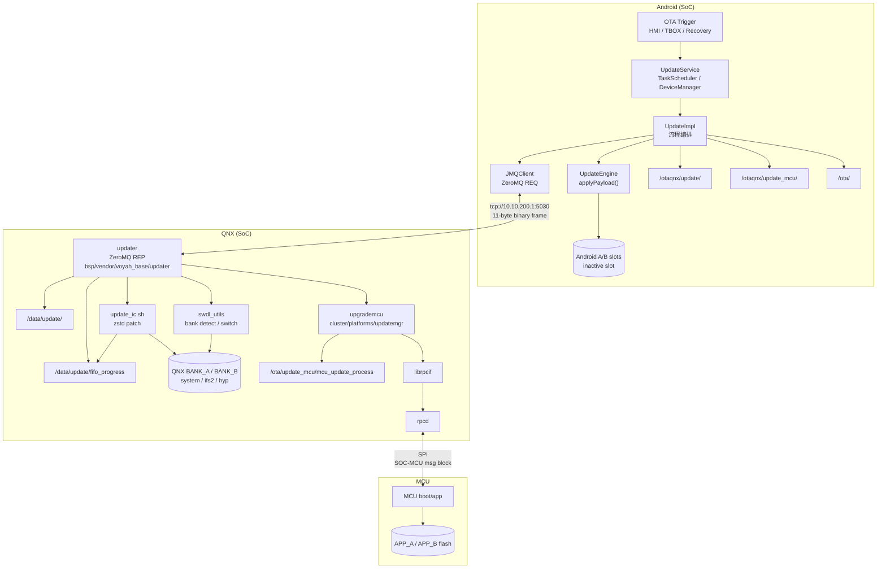
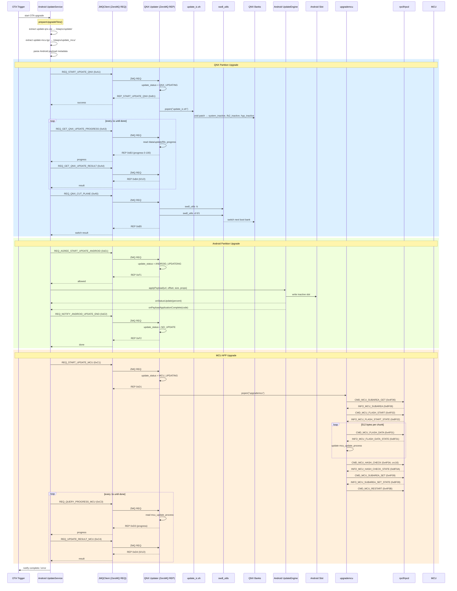
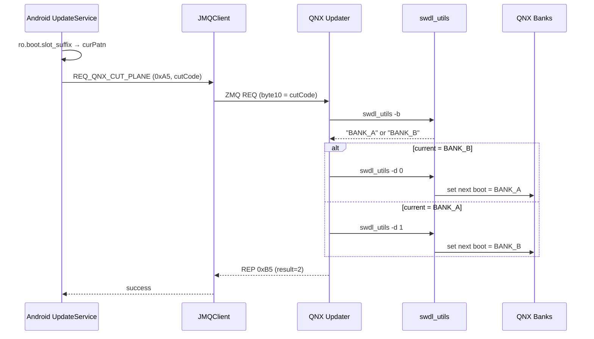

# H56EZ OTA 架构详细设计

> 基于 HBEZ 项目源码编写，覆盖四个仓库：`bsp/vendor/voyah_base/updater/`、`cluster/platforms/`、`build/scripts/tools/`、`android/vendor/voyah/system/update/`。

---

## 1. 概述

### 1.1 文档范围

本文档描述 H56EZ 车型 OTA（Over-the-Air）升级系统的整体架构、组件职责、通信协议和升级流程。

### 1.2 升级目标

系统支持以下 ECU 的固件升级：

| ECU | 描述 | 升级通道 |
|-----|------|---------|
| QNX | 实时操作系统分区（system / ifs2 / hyp） | JMQ → updater → update_ic.sh |
| Android | 车机娱乐系统 A/B slot | UpdateEngine.applyPayload() |
| MCU | 微控制器应用分区（APP_A / APP_B） | JMQ → updater → upgrademcu → rpcif → rpcd → SPI |
| IPC LCD | 仪表显示屏固件 | JMQ → updater → display_upgrade |
| IVI LCD | 中控显示屏固件 | JMQ → updater → display_upgrade_ivi |
| HUD | 抬头显示固件 | JMQ → updater → HudUpdate |
| IVI TP | 中控触摸屏固件 | JMQ → updater → display_upgrade_ivi |

### 1.3 触发方式

| 方式 | 入口 | 升级包来源 |
|------|------|-----------|
| U盘升级 | `UsbUpdateActivity` → `VoyahOtaUpdateManager.triggerUpgrade()` | `/ota/usb/update.zip` |
| DOIP 诊断 | `DoipOtaManager` | `/ota/doip/update.zip` |
| Recovery 模式 | `icupdater` (native C++) | 通过 ZeroMQ 直连 updater 服务 |

### 1.4 升级顺序与权重

升级按 `info.order` 字段排序依次执行。对于 QNX + Android + MCU 组合场景，顺序为：

**QNX (33%) → Android (34%) → MCU (33%)**

```java
// UpdateImpl.java L357
int getTotalProgress() {
    return (int) ((qnxProgress * 0.33) + (androidProgress * 0.34) + (mcuProgress * 0.33));
}
```

---

## 2. 系统架构

### 2.1 整体架构图



### 2.2 组件部署位置

| 组件 | 源码路径 | 运行位置 |
|------|---------|---------|
| UpdateService / UpdateImpl / JMQClient | `android/vendor/voyah/system/update/UpdateService/` | Android |
| updater | `bsp/vendor/voyah_base/updater/` | QNX |
| update_ic.sh / update_ic_progress.sh | `build/scripts/tools/update-script/` | QNX（打包进 OTA zip） |
| swdl_utils | `bsp/apps/qnx_ap/AMSS/platform/services/applications/swdl_utils/` | QNX |
| upgrademcu | `cluster/platforms/updatemgr/` | QNX |
| librpcif / rpcd | `cluster/platforms/rpcd/` | QNX |

### 2.3 文件系统布局

**Android 侧目录：**

| 路径 | 用途 |
|------|------|
| `/ota/` | Android OTA 包存放（payload.bin、metadata） |
| `/otaqnx/update/` | QNX 升级文件提取目录（与 QNX 共享） |
| `/otaqnx/update_mcu/` | MCU 固件提取目录（与 QNX 共享） |
| `/log/ota/` | 升级状态持久化 |

**QNX 侧目录：**

| 路径 | 用途 |
|------|------|
| `/ota/update/` | Android 提取的 QNX 升级包（共享挂载） |
| `/ota/update_mcu/` | Android 提取的 MCU 固件（共享挂载） |
| `/ota/update_ipc_lcd/` | 仪表屏固件 |
| `/ota/update_ivi_lcd/` | 中控屏固件 |
| `/ota/update_hud/` | HUD 固件 |
| `/data/update/` | QNX 分区升级工作目录 |
| `/data/update/fifo_progress` | QNX 分区升级进度文件 |
| `/ota/update_mcu/mcu_update_process` | MCU 升级进度文件 |

Android 和 QNX 通过 `/otaqnx/` ↔ `/ota/` 共享文件系统（同一条 eMMC 的共享分区）。

---

## 3. 通信协议

### 3.1 Android ↔ QNX: JMQ ZeroMQ REQ-REP

#### 3.1.1 消息格式

JMQClient（Android）向 updater（QNX）发送 11 字节二进制命令帧：

| 字节偏移 | 长度 | 含义 | 示例 |
|---------|------|------|------|
| 0-4 | 5 bytes | channel ID（5位数字逐字节） | `0x03 0x00 0x00 0x00 0x02` = 30002 (APP_OTA) |
| 5 | 1 byte | 分隔符 | `0x20` (空格) |
| 6 | 1 byte | 命令码 | `0xA1` = REQ_START_UPDATE_QNX |
| 7-9 | 3 bytes | 保留（全0） | `0x00 0x00 0x00` |
| 10 | 1 byte | 附加参数（如 bank 切换目标） | `0x01` 或 `0x02` |

```java
// JMQClient.java L130-156
String channelIdCodeStr = String.valueOf(channelId.getCode()); // e.g., "30002"
byte[] channelIdBytes = new byte[5];
for (int i = 0; i < 5; i++) {
    channelIdBytes[i] = (byte) Character.getNumericValue(channelIdCodeStr.charAt(i));
}
byte[] data = new byte[11];
System.arraycopy(channelIdBytes, 0, data, 0, 5);
data[5] = 0x20;      // space
data[6] = commandByte;
// data[7-9] = 0
data[10] = (byte) cutCode;  // only when set
```

QNX updater 从 `buf[6]` 读取命令码进行分发：

```cpp
// updater.cpp L138-139
uint8_t cmd = buf[6];
switch (cmd) { case REQ_START_UPDATE_IPC: ... }
```

响应帧使用各命令对应的结构体（定义于 `updater.h`），通用格式为：

| 字节偏移 | 含义 |
|---------|------|
| 0-4 | channel ID（原样返回） |
| 5 | `0x20` 分隔符 |
| 6 | 响应码 |
| 7-9 | 保留 |
| 10 | 结果值（0=升级中 / 1=失败 / 2=成功） |

#### 3.1.2 命令码全集

| 请求码 | 常量 | 响应码 | 含义 |
|--------|------|--------|------|
| `0xA0` | REQ_SYSTEM_UPGRADE_STATUS | `0xB0` | 查询系统升级状态 |
| `0xA1` | REQ_START_UPDATE_QNX | `0xB1` | 启动 QNX 分区全量升级 |
| `0xE3` | REQ_START_UPDATE_DIFF_QNX | `0xF3` | 启动 QNX 分区差分升级 |
| `0xA2` | REQ_STOP_UPDATE_QNX | `0xB2` | 停止 QNX 升级 |
| `0xA3` | REQ_GET_QNX_UPDATE_PROGRESS | `0xB3` | 获取 QNX 升级进度 |
| `0xA4` | REQ_GET_QNX_UPDATE_RESULT | `0xB4` | 获取 QNX 升级结果 |
| `0xA5` | REQ_QNX_CUT_PLANE | `0xB5` | QNX Bank 切换 |
| `0xA6` | REQ_QNX_REBOOT | `0xB6` | 重启 QNX |
| `0xC1` | REQ_START_UPDATE_MCU | `0xD1` | 启动 MCU 升级 |
| `0xC2` | REQ_STOP_UPDATE_MCU | `0xD2` | 停止 MCU 升级 |
| `0xC3` | REQ_GET_MCU_UPDATE_PROGRESS | `0xD3` | 获取 MCU 升级进度 |
| `0xC4` | REQ_GET_MCU_UPDATE_RESULT | `0xD4` | 获取 MCU 升级结果 |
| `0xC6` | REQ_MCU_REBOOT | `0xD6` | 重启 MCU |
| `0xE1` | REQ_AGREE_START_UPDATE_ANDROID | `0xF1` | 请求 QNX 允许 Android 升级 |
| `0xE2` | REQ_NOTIFY_ANDROID_UPDATE_END | `0xF2` | 通知 Android 升级结束 |
| `0xAA` | REQ_START_UPDATE_IPC_SCREEN | `0xBA` | 启动仪表屏升级 |
| `0xEA` | REQ_START_UPDATE_CENTRE_SCREEN | `0xFA` | 启动中控屏升级 |
| `0xE5` | REQ_START_UPDATE_HUD | `0xF5` | 启动 HUD 升级 |
| `0x11` | REQ_START_UPDATE_IVI_TP | `0x21` | 启动触摸屏升级 |

响应字节取值：

| 值 | 含义 |
|----|------|
| `0` | 升级中 (UPGRADING) |
| `1` | 失败 (FAILURE) |
| `2` | 成功 (SUCCESS) |

#### 3.1.3 重试与容错

```java
// JMQClient.java L51-55
private static final int MAX_RETRY = 10;
private static final int SOCKET_TIMEOUT = 500;
private long retryDelay = 1000L;  // exponential backoff starts at 1s
```

- 发送/接收超时 500ms
- 最多重试 10 次
- 退避策略：初始等待 1s，每次翻倍（1s → 2s → 4s → ...）
- ZMQ EFSM 状态错误时重置连接重建 socket
- ZMQ EAGAIN 超时时通过 ping 检测网络连通性

QNX updater 侧接收超时 200ms：

```cpp
// updater.cpp L116-117
int timeout = 200;
zmq_setsockopt(response, ZMQ_RCVTIMEO, &timeout, sizeof(timeout));
```

### 3.2 QNX ↔ MCU: rpcd SPI 通信

#### 3.2.1 rpcif 客户端 API

`librpcif` 提供以下 API，供 `upgrademcu` 调用：

```c
// rpcif.h
int32_t rpcif_init(const uint8_t *pName, Rpcif_CallbackInfo_t *pCbInfo, void *pContext);
int32_t rpcif_exit(void);
int32_t rpcif_subscribe_frames(uint32_t *frameArray, uint32_t frameNum);
int32_t rpcif_unsubscribe_frames(uint32_t *frameArray, uint32_t frameNum);
int32_t rpcif_update_clusterstate(uint32_t bus_id, uint32_t frame_id,
                                   uint32_t frame_dlc, uint8_t *frame_bytes);
int32_t rpcif_startSession(const uint8_t *pName);
int32_t rpcif_stopSession(void);
```

回调类型：

```c
// rpcif.h + rpcif-common.h
typedef int32_t (*RPCIF_MSG_PROCESS_CB)(uint32_t bus_id, uint32_t frame_id,
    uint32_t frame_dlc, uint8_t *frame_bytes, void *pContext);
typedef int32_t (*RPCIF_WorkStateUpdate_CB)(Rpcif_WrokState_t enType, void *pContext);

#define RPCIF_FRAMETYPE_MSG (0x0002u)  // msg block 业务帧类型
```

upgrademcu 初始化：

```cpp
// upgrade_mcu.cpp L599-607
Rpcif_CallbackInfo_t cbInfo;
cbInfo.msgCb = MsgCallback;
cbInfo.stCb = WorkStateCallback;
rpcif_init((uint8_t*)"upgrade", &cbInfo, NULL);
uint32_t framelist[1] = {2};                // RPCIF_FRAMETYPE_MSG
rpcif_subscribe_frames(framelist, 1);
```

发送命令：

```cpp
rpcif_update_clusterstate(1, CMD_MCU_FLASH_DATA, line_size + add_size, (uint8_t*)send_buf);
// 参数: bus_id=1, frame_id=命令, frame_dlc=payload长度, frame_bytes=payload
```

#### 3.2.2 业务帧：SOC-MCU msg block

rpcd 将 rpcif 逻辑帧封装为 msg block，通过 SPI 发送到 MCU：

| 字节偏移 | 含义 |
|---------|------|
| byte0[7:4] | channel，升级命令固定为 `0x1` |
| byte0[3:0] | payload 长度高 4 bit |
| byte1 | payload 长度低 8 bit |
| byte2 | frame id 高 8 bit |
| byte3 | frame id 低 8 bit |
| byte4+ | payload |

MCU 返回消息使用相同格式，rpcd 解析到 channel `0x1` 后分发给订阅了 `RPCIF_FRAMETYPE_MSG` 的 rpcif client。

#### 3.2.3 SPI 物理帧格式

```cpp
// rpcd_local.h L117-143
#pragma pack(1)
typedef struct {
    uint8_t startCode;   // 0xA5 — 帧头
    uint8_t type;        // 0xA2 (SOC→MCU) / 0xB2 (MCU→SOC)
    uint8_t length;      // 数据长度高8位
} SocMcuComHeader_t;

typedef struct {
    uint8_t crc16_low;
    uint8_t crc16_high;
    uint8_t tailCode;    // 0xAD — 帧尾
} SocMcuComTail_t;

typedef struct {
    SocMcuComHeader_t header;
    uint8_t socdata[762];  // 数据载荷
    SocMcuComTail_t tail;
} Soc2McuComMsg_t;
```

SPI 参数：`/dev/spi9`（QNX）或 `/dev/spidev21.0`（Linux），5MHz，mode 0，8-bit。

#### 3.2.4 帧订阅与会话管理

rpcd 维护会话管理表 `g_RpcdSessionMgr[RPCIF_RX_MAX]`（最大 200 个会话）。rpcif client 通过 `rpcif_subscribe_frames` 注册感兴趣的帧类型。rpcd 收到 MCU 返回帧后按订阅关系分发到对应 client 的 `MsgCallback`。

---

## 4. Android 侧

### 4.1 UpdateService 服务架构

```
UpdateService.java (Service)
  └── UpdateBinder.java (IUpdateService.Stub)
        ├── TaskScheduler.java — 任务流水线
        ├── DeviceManager.java — 设备路由
        ├── UpdateNotifier.java — 状态通知
        └── DoipOtaManager.java — DOIP 管理
```

**服务注册**：`ServiceManager.addService("voyah.ota.update", ...)`

**客户端接入**：`VoyahOtaUpdateManager.java` 通过 `ServiceManager.getService("voyah.ota.update")` 绑定。

#### 4.1.1 任务流水线

`TaskScheduler` 支持 action 序列，按流水线方式依次执行：

| Action | Task 类 | 职责 |
|--------|---------|------|
| LOAD | `LoadTask` | 验证签名（SHA256withRSA），解析 manifest.json |
| FLASH | `FlashTask` | 遍历设备列表，调用 `DeviceManager.onFlash()` 刷写固件 |
| ACTIVATE | `ActivateTask` | 遍历设备调用 `DeviceManager.onUpgrade()`，校验版本/分区切换 |
| UPDATE | (组合) | LOAD + FLASH + ACTIVATE |

状态持久化到 `/log/ota/.update_stat`，支持断电恢复。

#### 4.1.2 DeviceManager 路由

```java
// DeviceManager.java
HashMap<String, IUpdateProtocol> devices;

// 根据设备名路由到对应协议实现：
"qnx"     → QnxUpdateProtocol
"android" → AndroidUpdateProtocol
"mcu"     → McuUpdateProtocol
```

### 4.2 UpdateImpl 升级编排

```java
// UpdateImpl.java L49-51
// 升级顺序: QNX → Android → MCU
// 进度权重: QNX 33%, Android 34%, MCU 33%
```

#### 4.2.1 文件准备

```java
// UpdateImpl.java L636-648
// 从 OTA zip 包中流式提取 QNX 包
FileUtils.extractAndUnzipFromZip(source, otaPackage, "update-qnx.zip", qnxDir);
// → 解压到 /otaqnx/update/

// 从 OTA zip 包中流式提取 MCU 包
FileUtils.extractAndUntarGzipFromZip(source, otaPackage, "update-mcu.tgz", mcuDir);
// → 解压到 /otaqnx/update_mcu/
```

#### 4.2.2 QNX 升级

```java
// UpdateImpl.java L223-255
void startQNXUpgrade() {
    if (checkUpgradeStatus(source) != NOT_UPDATE) { notifyError(...); return; }
    if (!startQNXUpgrade(source)) { notifyError(...); return; }
    if (!getQNXProgressLoop()) { notifyError(...); return; }
    if (!queryQNXResult(source)) { notifyError(...); return; }
    qnxProgress = 100;
}
```

`getQNXProgressLoop()` 每秒轮询一次（`Thread.sleep(1000)`），同时检查进度和结果：

```java
// UpdateImpl.java L257-278
while (progress < 100) {
    progress = getQNXProgress(source);
    qnxProgress = progress;
    updateProgress();
    Thread.sleep(1000);

    byte resultValue = queryQNXResultValue(source);
    if (FAILURE == resultValue) return false;
    if (SUCCESS == resultValue) return true;
}
```

#### 4.2.3 Android 升级

```java
// UpdateImpl.java L305-343
void startAndroidUpgrade(DeviceInfo info) {
    if (!noticeAndroidUpgrade(source)) { notifyError(...); return; }

    UpdaterConfig config = new UpdaterConfig(true);
    config.parseConfig(info.package_file, info.package_offset);
    // → 解析 payload.bin offset/size 和 payload_properties.txt

    updateEngine.applyPayload(config.url, config.offset, config.size,
                              config.properties.toArray(new String[0]));
}
```

#### 4.2.4 MCU 升级

流程与 QNX 相同：通过 JMQ 启动 → 每秒轮询进度和结果 → 判断成功/失败。

#### 4.2.5 Bank 切换

```java
// UpdateImpl.java L280-290
boolean activeQnxSystem() {
    String slot = SystemProperties.get("ro.boot.slot_suffix");
    int curPatn = slot.contains("a") ? 2 : 1;
    if (!switchQNXPlane(curPatn, source)) { ... return false; }
    return true;
}
```

`switchQNXPlane` 发送 `REQ_QNX_CUT_PLANE(0xA5)`，cutCode 通过字节10传递。

### 4.3 UpdateEngine A/B 升级

`UpdateParser` 解析 OTA 包中的 Android 升级信息：

```java
// UpdateParser.java
PAYLOAD_BINARY_FILE_NAME = "payload.bin"
PAYLOAD_PROPERTIES_FILE_NAME = "payload_properties.txt"
```

关键属性：`SWITCH_SLOT_ON_REBOOT` 决定重启后是否自动切换 A/B slot。

`CarUpdateEngineCallback` 继承 `UpdateEngineCallback`：

```java
// UpdateImpl.java L364-438
void onStatusUpdate(int status, float percent) {
    if (status == UpdateEngine.UpdateStatusConstants.DOWNLOADING) {
        androidProgress = (int) (percent * 100);
        updateProgress();
    }
}

void onPayloadApplicationComplete(int code) {
    if (code == UpdateEngine.ErrorCodeConstants.SUCCESS) {
        notifyAndroidUpgradeEnd(source);
    } else {
        notifyError(...);
    }
}
```

### 4.4 JMQClient

单例模式，double-check locking 保证线程安全。

```java
// JMQClient.java L91-107
private JMQClient() {
    context = new ZContext();
    socket = context.createSocket(SocketType.REQ);
    socket.setSendTimeOut(500);
    socket.setReceiveTimeOut(500);
    connectIp = "tcp://10.10.200.1:5030";
    isConnected = socket.connect(connectIp);
}
```

发送和接收由 `ReentrantLock` 严格串行化，确保 REQ-REP 状态对齐。

```java
// JMQClient.java L121
public byte[] sendCommand(Const.UpgradeType channelId, int command, int cutCode) {
    socketLock.lock();
    try {
        int retryCount = 0;
        while (retryCount < MAX_RETRY) {
            // 构建 11 字节命令帧 → socket.send(data) → socket.recv()
            // ZMQ EFSM → resetConnection()
            // ZMQ EAGAIN → pingHost() + Thread.sleep(retryDelay)
            retryDelay *= 2;  // 指数退避
        }
    } finally { socketLock.unlock(); }
}
```

---

## 5. QNX 侧

### 5.1 Updater 服务

源码：`bsp/vendor/voyah_base/updater/`

#### 5.1.1 启动流程

```cpp
// main.cpp
int main() {
    Updater* updater = new Updater(100);
    updater->publish();  // 启动 mainloop 线程 + updaterDirCreate 线程
}
```

#### 5.1.2 主循环

```cpp
// updater.cpp L110-264
void Updater::mainloop() {
    void* ctx = zmq_ctx_new();
    void* response = zmq_socket(ctx, ZMQ_REP);
    int timeout = 200;
    zmq_setsockopt(response, ZMQ_RCVTIMEO, &timeout, sizeof(timeout));
    while (zmq_bind(response, "tcp://10.10.200.1:5030") < 0) { usleep(100000); }

    while (1) {
        int size = zmq_recv(response, buf, 4096, 0);
        if (size < 0) { if (errno == EAGAIN) continue; }
        uint8_t cmd = buf[6];
        switch (cmd) {
            case REQ_START_UPDATE_IPC:  start_update_ipc(response, buf); break;
            case REQ_START_UPDATE_MCU:  start_update_mcu(response, buf); break;
            case REQ_SWITCH_SLOT:       switch_slot(response, buf);      break;
            case REQ_QUERY_PROGRESS_IPC: get_update_progress_ipc(response, buf); break;
            case REQ_UPDATE_RESULT_IPC:  get_update_result_ipc(response, buf); break;
            // ...
        }
    }
}
```

#### 5.1.3 状态管理

```cpp
// updater.h
enum {
    NO_UPDATE = 0,
    MCU_UPDATING,
    QNX_UPDATING,
    ANDROID_UPDATEING,
    IPC_LCD_UPDATEING,
    IVI_LCD_UPDATEING,
    HUD_UPDATEING,
    IVI_TP_UPDATEING,
};
```

每个命令处理函数检查 `update_status`：非 `NO_UPDATE` 时拒绝新请求（result=1）。升级 job 完成后恢复为 `NO_UPDATE`。

#### 5.1.4 目录管理

`updaterDirCreate()` 在服务启动时创建 `/ota/` 下的所有升级目录，并在首次清空后持续维护：

```cpp
// updater.cpp L47-108
mkdir /ota/update         chmod 777
mkdir /ota/update_mcu
mkdir /ota/update_ipc_lcd
mkdir /ota/update_ivi_lcd
mkdir /ota/update_hud
mkdir /ota/update_ivi_tp
```

### 5.2 QNX 分区升级

#### 5.2.1 update_job_ipc

```cpp
// updater.cpp L266-357
void Updater::update_job_ipc() {
    // 1. 检查 /data 空间 > 1G
    statvfs("/data", &stat);
    if (free_space <= 1024*1024*1024) { update_result_ipc = 1; return; }

    // 2. 拷贝升级包到工作目录
    system("cp -rf /ota/update /data/");

    // 3. 执行升级脚本
    system("chmod 777 /data/update/tools/update_ic.sh");
    FILE* pipe = popen("/data/update/tools/update_ic.sh", "r");

    // 4. 等待脚本执行完成
    while (fgets(buffer, sizeof(buffer), pipe) != nullptr) { usleep(5000); }
    int ret_code = pclose(pipe);

    // 5. 判断结果
    if (ret_code != 0) { update_result_ipc = 1; }   // 失败
    else               { update_result_ipc = 2; }   // 成功

    update_status = NO_UPDATE;
    system("rm -rf /ota/update/*");
    system("rm -rf /data/update");
}
```

#### 5.2.2 update_ic.sh

```bash
# update_ic.sh L41-65
func_flash_qnx() {
    # $1 = "inactive"（只刷非活动 bank）
    if [ "$1" == "active" ]; then BANK=""; else BANK="_inactive"; fi

    cd $DIR_OTA_TEMP/qnx/system_la
    ${ZSTD_TOOL} -d --patch-from=/dev/zero system_la.patch \
        -o=/dev/disk/system$BANK || return 1

    cd $DIR_OTA_TEMP/qnx/ifs2_la
    ${ZSTD_TOOL} -d --patch-from=/dev/zero ifs2_la.patch \
        -o=/dev/disk/ifs2$BANK || return 1

    cd $DIR_OTA_TEMP/qnx/hyp_la
    ${ZSTD_TOOL} -d --patch-from=/dev/zero hyp_la.patch \
        -o=/dev/disk/hyp$BANK || return 1
}
```

调用时只刷 inactive bank：

```bash
func_flash_qnx_factory() {
    func_flash_qnx "inactive" || return 1
}
```

#### 5.2.3 进度上报

`update_ic.sh` 启动 `update_ic_progress.sh` 作为后台进程：

```bash
# update_ic.sh L159-170
func_show_progress() {
    $DIR_OTA_TEMP/tools/update_ic_progress.sh $time &
    pid_progress=$!
}
```

`update_ic_progress.sh` 按 `总时间/100` 的间隔向 `/data/update/fifo_progress` 写入 0-100：

```bash
# update_ic_progress.sh L19-57
while ((i < 101)); do
    sleep $internel_time_s
    echo "$i" > $DIR_OTA_TEMP/fifo_progress
    let i=i+1
done
```

QNX updater 通过 `fscanf` 读取该文件：

```cpp
// updater.cpp L388-397
FILE* fp = fopen("/data/update/fifo_progress", "r+");
fscanf(fp, "%d", &update_progress_ipc);
```

升级完成后通过标志文件通知：

```bash
# update_ic.sh L196-199
touch $DIR_OTA_TEMP/os_update_finished_success   # 成功
touch $DIR_OTA_TEMP/os_update_finished_fail      # 失败
```

### 5.3 QNX Bank 切换

```cpp
// updater.cpp L1225-1275
int Updater::switch_slot(void* socket, void* msg) {
    // 1. 检测当前 bank
    FILE* pipe = popen("swdl_utils -b", "r");
    // 解析输出中的 "BANK_A" 或 "BANK_B"

    // 2. 切换到对面 bank
    if (slot == 'B') { system("swdl_utils -d 0"); }  // → BANK_A
    if (slot == 'A') { system("swdl_utils -d 1"); }  // → BANK_B

    result.result = 2;  // success
    zmq_send(socket, &result, sizeof(result), 0);
}
```

swdl_utils 选项：

| 选项 | 含义 |
|------|------|
| `-b` | 输出当前活动 bank（"BANK_A" 或 "BANK_B"） |
| `-d 0` | 切换到 BANK_A |
| `-d 1` | 切换到 BANK_B |

---

## 6. MCU 侧

### 6.1 upgrademcu

源码：`cluster/platforms/updatemgr/src/upgrade_mcu.cpp`

#### 6.1.1 构建

```cmake
# CMakeLists.txt
add_executable(upgrademcu upgrade_mcu.cpp)
target_link_libraries(upgrademcu librpcif libsysmgrif libpmonitorif libclsbootif
                      syslog pthread)
```

运行时路径：`/mnt/usr/bin/upgrademcu`，由 QNX updater 通过 `popen("/mnt/usr/bin/upgrademcu")` 调用。

#### 6.1.2 固件识别

```cpp
// upgrade_mcu.cpp L226-268
static void check_bin_path(const std::string& folder,
    std::string& bin_boot, std::string& bin_a, std::string& bin_b)
{
    DIR *dir = opendir(folder.c_str());
    while (dir_info = readdir(dir)) {
        if (patch.find("APP_ROOT") != std::string::npos) bin_boot = patch;  // BootLoader
        if (patch.find("APP_A")    != std::string::npos) bin_a    = patch;  // SUB_A
        if (patch.find("APP_B")    != std::string::npos) bin_b    = patch;  // SUB_B
    }
}
```

#### 6.1.3 主流程

```cpp
// upgrade_mcu.cpp L563-659
int main(int argc, char **argv) {
    save_process(0);                                         // 1. 初始化进度 0

    check_bin_path("/ota/update_mcu/", boot, bin_a, bin_b); // 2. 扫描固件
    if (all_empty) return -99;                               //    无固件 → -99

    rpcif_init("upgrade", &cbInfo, NULL);                    // 3. 初始化 rpcif
    rpcif_subscribe_frames({2}, 1);                          //    订阅 msg 帧

    mcu_sub_area = get_mcu_sub_area();                       // 4. 查询当前分区
    bin_path = (mcu_sub_area == 2) ? bin_b : bin_a;          // 5. 选对面固件
    if (bin_path.empty()) return -2;

    send_mcu_flash_start();                                  // 6. 开始刷写
    do_send_flash_data(bin_path, package_crc);               // 7. 分包发送
    send_mcu_flash_check(package_crc);                       // 8. CRC 校验
    set_mcu_reboot_area(mcu_sub_area);                       // 9. 设置启动分区
    save_process(100);                                       // 10. 完成进度
    set_mcu_reboot();                                        // 11. 重启 MCU
}
```

#### 6.1.4 进度文件

```cpp
// upgrade_mcu.cpp L140-156
static void save_process(int process) {
    int fd = open("/ota/update_mcu/mcu_update_process",
                  O_WRONLY | O_CREAT | O_TRUNC, 0644);
    char buf[16];
    int len = snprintf(buf, sizeof(buf), "%d\n", process);
    write(fd, buf, len);
    fsync(fd);
    close(fd);
}
```

进度按 `已发送字节数 / 固件总大小 * 100` 计算，每发完一包更新一次。

QNX updater 读取同一个文件：

```cpp
// updater.cpp L1104
FILE* fp = fopen("/ota/update_mcu/mcu_update_process", "r+");
fscanf(fp, "%d", &progress);
```

#### 6.1.5 返回码

| 返回码 | 含义 |
|--------|------|
| `-99` | `/ota/update_mcu/` 下没有可用固件 |
| `-1` | 查询 MCU 当前分区失败或返回非法值 |
| `-2` | 根据当前分区找不到目标固件 |
| `-3` | FLASH_START 命令失败 |
| `-4` | 固件数据发送失败 |
| `-5` | MCU CRC16 校验失败 |
| `-6` | 设置 MCU 下次启动分区失败 |

QNX updater 通过 `pclose` 返回值判断成功/失败：`ret_code == 0` 表示成功（result=2），否则失败（result=1）。

### 6.2 MCU 升级协议

#### 6.2.1 命令全集

```cpp
// upgrade_mcu.cpp L16-35
enum {
    CMD_MCU_FLASH_DATA          = 0x4F01,  // 数据包: 4字节偏移 + 512字节固件
    INFO_MCU_FLASH_DATA_STATE   = 0x8F01,  // 响应: 0=Done, 1=Error
    CMD_MCU_FLASH_START         = 0x4F02,  // 通知 MCU 准备刷写
    INFO_MCU_FLASH_START_STATE  = 0x8F02,  // 响应: 0=Done, 1=Error
    CMD_MCU_SUBAREA_GET         = 0x4F06,  // 查询当前运行分区
    INFO_MCU_SUBAREA            = 0x8F06,  // 响应: 0=Invalid, 1=BootLoader, 2=SUB_A, 3=SUB_B
    CMD_MCU_SUBAREA_SET         = 0x4F09,  // 设置下次启动分区
    INFO_MCU_SUBAREA_SET_STATE  = 0x8F09,  // 响应: 0=Done, 1=Error
    CMD_MCU_HASH_CHECK          = 0x4F0A,  // CRC16 校验
    INFO_MCU_HASH_CHECK_STATE   = 0x8F0A,  // 响应: 0=Done, 1=Error
    CMD_MCU_RESTART             = 0x4F0B,  // MCU 重启 (waitSec=0x03)
    CMD_MCU_PROGRAM_BOOT        = 0x4F0C,  // BootLoader 数据包（保留，主流程未使用）
    INFO_MCU_PROGRAM_BOOT_STATE = 0x8F0C,
    CMD_MCU_PROGRAM_BOOT_START  = 0x4F0D,  // BootLoader 刷写开始（保留）
    INFO_MCU_PROGRAM_BOOT_START_STATE = 0x8F0D,
    CMD_MCU_BOOT_HASH_CHECK     = 0x4F0E,  // BootLoader CRC 校验（保留）
    INFO_MCU_BOOT_HASH_CHECK_STATE = 0x8F0E,
};
```

主流程只使用 0x4F01 ~ 0x4F0B（APP 分区升级），0x4F0C ~ 0x4F0E 预留给 BootLoader 升级但未启用。

#### 6.2.2 数据包格式

```cpp
// upgrade_mcu.cpp L367-393
#define FLASH_DATA_SIZE 516  // 4字节地址 + 最大512字节数据
int line_size = 512;         // 每包固件数据
int add_size  = 4;           // 地址偏移占4字节
char send_buf[516];

// 小端整数偏移量
send_buf[0] = (send_size) & 0xFF;
send_buf[1] = (send_size >> 8)  & 0xFF;
send_buf[2] = (send_size >> 16) & 0xFF;
send_buf[3] = (send_size >> 24) & 0xFF;

// 读取固件数据
rf.read(&send_buf[4], line_size);

// 发送
rpcif_update_clusterstate(1, CMD_MCU_FLASH_DATA,
    line_size + add_size, (uint8_t*)send_buf);
```

| payload 字节 | 含义 |
|-------------|------|
| 0-3 | 4字节小端地址偏移 |
| 4-515 | 固件数据（最后一包可小于 512 字节） |

#### 6.2.3 CRC16-CCITT

```cpp
// upgrade_mcu.cpp L133-138
uint16_t crc_ccitt(uint16_t crc_reg, char* bin_data, int send_len) {
    for (int i = 0; i < send_len; i++)
        crc_reg = (uint16_t)((crc_reg >> 8)
            ^ crc16_ccitt_table[(crc_reg ^ bin_data[i]) & 0xff]);
    return crc_reg;
}
```

校验值 2 字节小端发送：

```cpp
// upgrade_mcu.cpp L451-453
crc_data[0] = package_crc & 0xFF;
crc_data[1] = (package_crc >> 8) & 0xFF;
rpcif_update_clusterstate(1, CMD_MCU_HASH_CHECK, 2, (uint8_t*)crc_data);
```

> **已知问题**：CRC 计算位于 `resend:` 标签之后（`upgrade_mcu.cpp` L395），若某数据包因超时或 MCU 返回错误而重发，同一数据会被重复累加到 `package_crc`。

#### 6.2.4 A/B 分区策略

| 值 | 含义 |
|----|------|
| `0x00` | Invalid |
| `0x01` | BootLoader |
| `0x02` | SUB_A |
| `0x03` | SUB_B |

```cpp
// upgrade_mcu.cpp L612-615
if (2 == mcu_sub_area)        // 当前运行 SUB_A
    bin_path = bin_path_b;    //   刷写 APP_B
else if (3 == mcu_sub_area)   // 当前运行 SUB_B
    bin_path = bin_path_a;    //   刷写 APP_A

// upgrade_mcu.cpp L500-508
if (2 == sub_area)            // 当前 SUB_A
    area = 0x03;              //   下次启动 SUB_B
else
    area = 0x02;              //   下次启动 SUB_A
```

#### 6.2.5 超时与重试

每个命令统一使用以下模式：

```cpp
int resend_count = 3;
resend:
rpcif_update_clusterstate(1, CMD_XXX, len, data);
while (true) {
    Event event;
    if (eventQueue.pop(event, 1000)) {    // 等待 1000ms
        if (event.frame_id == EXPECTED_INFO_XXX && state == 0) break;  // 成功
        else {
            if (--resend_count) goto resend;  // 重试
            else break;                       // 失败
        }
    } else {
        if (--resend_count) goto resend;  // 超时重试
        else break;                       // 失败
    }
}
```

`CMD_MCU_RESTART(0x4F0B)` 例外：只发送，不等待响应：

```cpp
// upgrade_mcu.cpp L556-561
static int set_mcu_reboot() {
    uint8_t wait_sec = 0x03;
    rpcif_update_clusterstate(1, CMD_MCU_RESTART, 1, &wait_sec);
    return 0;
}
```

---

## 7. 升级时序

### 7.1 全链路 OTA 升级时序



### 7.2 QNX Bank 切换时序



### 7.3 MCU 升级子流程时序

下图展示 `upgrade_mcu.cpp` 完整的内部函数调用链，包括 `main()` → 各子函数的执行流程、返回值判断、以及通过 rpcif/rpcd/MCU 的协议交互。

```mermaid
sequenceDiagram
    participant main as main()
    participant chk as check_bin_path()
    participant ga as get_mcu_sub_area()
    participant fs as send_mcu_flash_start()
    participant sd as do_send_flash_data()
    participant hc as send_mcu_flash_check()
    participant ra as set_mcu_reboot_area()
    participant rb as set_mcu_reboot()
    participant sp as save_process()
    participant eq as EventQueue
    participant rf as ReadFile
    participant crc as crc_ccitt()
    participant rpcif as rpcif
    participant rpcd as rpcd
    participant MCU as MCU

    main ->> sp: save_process(0)
    sp -->> main: open/write/fsync "0\n"

    main ->> chk: check_bin_path("/ota/update_mcu/")
    activate chk
    chk ->> chk: opendir, readdir
    chk ->> chk: scan "APP_ROOT" → bin_boot
    chk ->> chk: scan "APP_A"    → bin_a
    chk ->> chk: scan "APP_B"    → bin_b
    deactivate chk

    alt all three empty
        main ->> main: return -99
    end

    main ->> rpcif: rpcif_init("upgrade", {MsgCallback, WorkStateCallback})
    rpcif -->> main: iret
    main ->> main: checkWorkState() → handle CONNECT/DISCONNECT/RECONNECT
    main ->> rpcif: rpcif_subscribe_frames({2}, 1)

    rect rgb(240, 248, 255)
        Note over main, MCU: Phase 1 — get_mcu_sub_area()
        main ->> ga: get_mcu_sub_area()
        activate ga
        ga ->> ga: resend_count = 3
        loop max 3 retries (1000ms timeout each)
            ga ->> rpcif: rpcif_update_clusterstate(1, 0x4F06, 0, NULL)
            rpcif ->> rpcd: bus=1, frame=0x4F06
            rpcd ->> MCU: msg block (ch=0x1, id=0x4F06)
            MCU -->> rpcd: msg block (id=0x8F06, state)
            rpcd -->> rpcif: frame=0x8F06
            rpcif -->> eq: MsgCallback() → push Event
            ga ->> eq: pop(event, 1000)
            eq -->> ga: Event{franme_id=0x8F06, bytes=[state]}
            alt state != -1
                ga ->> ga: break (success)
            else timeout / state == -1
                Note over ga: --resend_count, goto resend
            end
        end
        ga -->> main: state
        deactivate ga
    end

    alt mcu_sub_area == 2 (SUB_A)
        main ->> main: bin_path = bin_path_b
    else mcu_sub_area == 3 (SUB_B)
        main ->> main: bin_path = bin_path_a
    else
        main ->> main: return -1
    end

    rect rgb(255, 248, 240)
        Note over main, MCU: Phase 2 — send_mcu_flash_start()
        main ->> fs: send_mcu_flash_start()
        activate fs
        fs ->> fs: resend_count = 3
        loop max 3 retries (1000ms timeout each)
            fs ->> rpcif: rpcif_update_clusterstate(1, 0x4F02, 0, NULL)
            rpcif ->> rpcd: bus=1, frame=0x4F02
            rpcd ->> MCU: msg block (ch=0x1, id=0x4F02)
            MCU -->> rpcd: msg block (id=0x8F02, state)
            rpcd -->> rpcif: frame=0x8F02
            rpcif -->> eq: MsgCallback() → push Event
            fs ->> eq: pop(event, 1000)
            eq -->> fs: Event{franme_id=0x8F02, bytes=[state]}
            alt state == 0
                fs ->> fs: break (success)
            else timeout / state != 0
                Note over fs: --resend_count, goto resend
            end
        end
        fs -->> main: return code
        deactivate fs
    end

    alt ret != 0
        main ->> main: return -3
    end

    rect rgb(240, 255, 240)
        Note over main, MCU: Phase 3 — do_send_flash_data() per chunk
        main ->> main: package_crc = 0x0000
        main ->> sd: do_send_flash_data(bin_path, package_crc)
        activate sd
        sd ->> rf: rf.open(bin_path)
        sd ->> rf: bin_size = rf.size()
        loop while send_size < bin_size
            sd ->> sd: send_buf[0..3] = send_size (LE)
            sd ->> rf: rf.read(&send_buf[4], 512)
            sd ->> crc: crc_ccitt(package_crc, &send_buf[4], 512)
            crc -->> sd: package_crc updated
            Note over sd: resend label — CRC already added!
            sd ->> sd: printf("send_len, send_addr, package_crc")
            sd ->> sd: resend_count = 3
            loop max 3 retries (1000ms timeout each)
                sd ->> rpcif: rpcif_update_clusterstate(1, 0x4F01, 516, send_buf)
                rpcif ->> rpcd: bus=1, frame=0x4F01
                rpcd ->> MCU: msg block (ch=0x1, id=0x4F01, 4B LE addr + 512B data)
                MCU -->> rpcd: msg block (id=0x8F01, state)
                rpcd -->> rpcif: frame=0x8F01
                rpcif -->> eq: MsgCallback() → push Event
                sd ->> eq: pop(event, 1000)
                eq -->> sd: Event{franme_id=0x8F01, bytes=[state]}
                alt state == 0
                    sd ->> sd: break (success → next chunk)
                else timeout
                    Note over sd: --resend_count, goto resend
                    Note over sd: CRC 重复累加同一包数据
                else state != 0
                    Note over sd: --resend_count, goto resend
                end
            end
            alt all 3 retries exhausted
                sd -->> main: return -2 (MCU error) / -3 (timeout)
            end
            sd ->> sd: send_size += 512
            sd ->> sp: save_process(send_size / bin_size * 100)
            sp -->> sd: write "%d\n" to mcu_update_process, fsync
            alt last chunk < 512
                sd ->> sd: line_size = bin_size - send_size
            end
        end
        sd -->> main: return 0
        deactivate sd
    end

    alt ret < 0
        main ->> main: return -4
    end

    rect rgb(255, 255, 240)
        Note over main, MCU: Phase 4 — send_mcu_flash_check()
        main ->> hc: send_mcu_flash_check(package_crc)
        activate hc
        hc ->> hc: crc_data[0..1] = package_crc (LE)
        hc ->> hc: resend_count = 3
        loop max 3 retries (1000ms timeout each)
            hc ->> rpcif: rpcif_update_clusterstate(1, 0x4F0A, 2, crc_data)
            rpcif ->> rpcd: bus=1, frame=0x4F0A
            rpcd ->> MCU: msg block (ch=0x1, id=0x4F0A, crc16 LE)
            MCU -->> rpcd: msg block (id=0x8F0A, state)
            rpcd -->> rpcif: frame=0x8F0A
            rpcif -->> eq: MsgCallback() → push Event
            hc ->> eq: pop(event, 1000)
            eq -->> hc: Event{franme_id=0x8F0A, bytes=[state]}
            alt state == 0
                hc ->> hc: break (success)
            else timeout / state != 0
                Note over hc: --resend_count, goto resend
            end
        end
        hc -->> main: return code
        deactivate hc
    end

    alt ret != 0
        main ->> main: return -5
    end

    rect rgb(255, 240, 255)
        Note over main, MCU: Phase 5 — set_mcu_reboot_area()
        main ->> ra: set_mcu_reboot_area(mcu_sub_area)
        activate ra
        Note over ra: sub_area==2(SUB_A) → area=0x03(SUB_B)<br/>sub_area==3(SUB_B) → area=0x02(SUB_A)
        ra ->> ra: resend_count = 3
        loop max 3 retries (1000ms timeout each)
            ra ->> rpcif: rpcif_update_clusterstate(1, 0x4F09, 1, &area)
            rpcif ->> rpcd: bus=1, frame=0x4F09
            rpcd ->> MCU: msg block (ch=0x1, id=0x4F09, area)
            MCU -->> rpcd: msg block (id=0x8F09, state)
            rpcd -->> rpcif: frame=0x8F09
            rpcif -->> eq: MsgCallback() → push Event
            ra ->> eq: pop(event, 1000)
            eq -->> ra: Event{franme_id=0x8F09, bytes=[state]}
            alt state == 0
                ra ->> ra: break (success)
            else timeout / state != 0
                Note over ra: --resend_count, goto resend
            end
        end
        ra -->> main: return code
        deactivate ra
    end

    alt ret != 0
        main ->> main: return -6
    end

    Note over main, sp: Phase 6 — completion
    loop i = 0..9
        main ->> sp: save_process(100)
        sp -->> main: write "100\n", fsync
    end

    rect rgb(255, 230, 230)
        Note over main, MCU: Phase 7 — set_mcu_reboot()
        main ->> rb: set_mcu_reboot()
        activate rb
        Note over rb: wait_sec = 0x03, no response wait
        rb ->> rpcif: rpcif_update_clusterstate(1, 0x4F0B, 1, &wait_sec)
        rpcif ->> rpcd: bus=1, frame=0x4F0B
        rpcd ->> MCU: msg block (ch=0x1, id=0x4F0B, wait_sec=0x03)
        rb -->> main: return 0
        deactivate rb
    end

    main ->> main: return 0
```



**各函数职责与返回码汇总：**

| 函数 | 职责 | 返回码 |
|------|------|--------|
| `main()` | 入口，串联各阶段，检查返回值 | -99/-1/-2/-3/-4/-5/-6/0 |
| `check_bin_path()` | 扫描 `/ota/update_mcu/`，按文件名中的 `APP_ROOT`/`APP_A`/`APP_B` 识别固件 | void（通过引用返回路径） |
| `get_mcu_sub_area()` | 发送 0x4F06 查询 MCU 当前运行分区，从 EventQueue 等待 0x8F06 响应 | state: 0=Invalid, 1=BootLoader, 2=SUB_A, 3=SUB_B, -1=失败 |
| `send_mcu_flash_start()` | 发送 0x4F02 通知 MCU 准备刷写，等待 0x8F02 响应 | 0=成功, 非0=失败 |
| `do_send_flash_data()` | 按 512 字节分包发送 0x4F01，每包等待 0x8F01；每发完一包调用 `save_process` 更新进度，调用 `crc_ccitt` 累积 CRC | 0=成功, -2=MCU错误, -3=超时 |
| `send_mcu_flash_check()` | 发送 0x4F0A 附带 2 字节 CRC16-CCITT（小端），等待 0x8F0A 响应 | 0=成功, 非0=失败 |
| `set_mcu_reboot_area()` | 发送 0x4F09 设置 MCU 下次启动分区（当前 A→B, 当前 B→A），等待 0x8F09 响应 | 0=成功, 非0=失败 |
| `set_mcu_reboot()` | 发送 0x4F0B (wait_sec=0x03)，不等待响应 | 始终返回 0 |
| `save_process(n)` | 向 `/ota/update_mcu/mcu_update_process` 写入 `"n\n"` 并 fsync | void |

**CRC16 重传缺陷**：`do_send_flash_data` 中 `crc_ccitt()` 调用位于 `resend:` 标签之后（L395），若某包因超时或 MCU 返回错误而重发，同一包数据会再次累加到 `package_crc`，导致最终 CRC 校验值不准确。此缺陷影响 `send_mcu_flash_check` 的结果正确性。

---

## 8. 分区与 A/B 策略

### 8.1 QNX Bank 结构

QNX 采用 bank 双备份，升级时只写 inactive bank：

| 分区 | Active 设备 | Inactive 设备 |
|------|------------|--------------|
| system | `/dev/disk/system` | `/dev/disk/system_inactive` |
| ifs2 | `/dev/disk/ifs2` | `/dev/disk/ifs2_inactive` |
| hyp | `/dev/disk/hyp` | `/dev/disk/hyp_inactive` |

切换方式：`swdl_utils -d 0/1` 设置下次启动 bank，下次重启生效。

### 8.2 Android A/B Slot

Android 使用标准 A/B seamless update：

- `UpdateEngine.applyPayload()` 向 inactive slot 写入 payload.bin
- `payload_properties.txt` 中 `SWITCH_SLOT_ON_REBOOT` 控制重启后是否自动切换
- slot 状态由 `ro.boot.slot_suffix` 读取
- QNX bank 切换以 Android slot 为基准同步

### 8.3 MCU 分区结构

| 分区 | 含义 | 值 |
|------|------|-----|
| BootLoader | 引导程序 | 0x01 |
| SUB_A | 应用固件 A | 0x02 |
| SUB_B | 应用固件 B | 0x03 |

升级策略：

- 当前 SUB_A → 刷写 APP_B → 设置下次启动 SUB_B
- 当前 SUB_B → 刷写 APP_A → 设置下次启动 SUB_A

BootLoader 相关命令（0x4F0C ~ 0x4F0E）已定义但主流程未使用，APP_ROOT 识别逻辑保留但当前不执行 bootloader 刷写。

### 8.4 生效时机

| 目标 | 写入时机 | 生效时机 |
|------|---------|---------|
| QNX | 升级过程中 zstd patch 到 inactive bank | `swdl_utils -d` + 系统重启 |
| Android | `UpdateEngine.applyPayload()` | A/B slot 标记 + 系统重启 |
| MCU | `upgrademcu` 分包发送 | `CMD_MCU_RESTART(0x4F0B)` 立即触发 MCU 重启 |

---

## 9. 升级包结构

### 9.1 update.zip 内部结构

```
update.zip
├── Manifest_SYS.xml          # 升级清单（设备列表、顺序、版本）
├── update-qnx.zip            # QNX 分区固件（system_la/ifs2_la/hyp_la patch）
├── update-mcu.tgz            # MCU 固件（APP_A / APP_B 二进制文件）
├── update-ota.zip            # Android OTA（payload.bin + payload_properties.txt）
├── update-ipc-lcd.zip        # 仪表屏固件
├── update-ivi-lcd.zip        # 中控屏固件
├── update-hud.zip            # HUD 固件
└── tools/
    ├── update_ic.sh            # QNX 分区刷写脚本
    ├── update_ic_progress.sh   # QNX 进度上报脚本
    └── zstd / zstd.segsize    # zstd 解压工具
```

### 9.2 子包说明

| 子包 | 格式 | 提取路径 | 消费者 |
|------|------|---------|--------|
| `update-qnx.zip` | ZIP | `/otaqnx/update/` → `/data/update/` | QNX updater → update_ic.sh |
| `update-mcu.tgz` | tar.gz | `/otaqnx/update_mcu/` | QNX updater → upgrademcu |
| `update-ota.zip` | ZIP | `/ota/` | Android UpdateEngine |

### 9.3 签名校验

```java
// LoadTask.java
// 使用 SHA256withRSA 校验 OTA 包签名
verifyAttachedSignature(otaZip, PUBLIC_KEY);
```

公钥定义在 `FileHelper.java` 中。

---

## 10. 异常处理

### 10.1 升级前状态检查

Android 侧：
```java
// UpdateImpl.java L601-603
if (checkUpgradeStatus(source) != NOT_UPDATE) {
    notifyError(..., "系统正在升级中");
    return false;
}
```

QNX 侧双重保护：
```cpp
// updater.cpp L365-368
if (update_status != NO_UPDATE) { result.result = 1; }  // 拒绝新请求
else { update_status = QNX_UPDATING; result.result = 2; }
```

### 10.2 超时与重试策略汇总

| 层级 | 超时 | 重试次数 | 退避策略 |
|------|------|---------|---------|
| JMQClient (Android→QNX) | 500ms send/recv | 10 次 | 指数退避（1s→2s→4s→...） |
| updater ZMQ recv (QNX) | 200ms | 无（轮询模式） | — |
| upgrademcu ↔ MCU | 1000ms per cmd | 3 次 | 无退避（立即重试） |
| QNX progress poll | 1000ms | 无（循环轮询直到 100 或失败） | — |
| MCU result poll (IVI LCD) | 500ms | 20 次 | — |

### 10.3 断电恢复

`TaskScheduler` 将升级状态持久化到 `/log/ota/.update_stat`。状态机按 LOAD → FLASH → ACTIVATE 推进，重启后从磁盘恢复状态，继续未完成的任务。

QNX 侧无持久化状态——升级结果在 `update_ic.sh` 完成后通过 `touch os_update_finished_success/fail` 标记。

### 10.4 错误码汇总

| 错误来源 | 错误码 | 含义 |
|---------|--------|------|
| QNX | UPGRADE_SOURCE_QNX (3) | QNX 异常/失败/切面失败 |
| Android | UPGRADE_SOURCE_ANDROID (4) | 解析失败/payload写入失败 |
| MCU | UPGRADE_SOURCE_MCU (5) | 启动失败/进度异常/结果失败 |
| upgrademcu | -99 | 无固件文件 |
| upgrademcu | -1 | 查询分区失败 |
| upgrademcu | -2 | 无目标固件 |
| upgrademcu | -3 | FLASH_START 失败 |
| upgrademcu | -4 | 数据发送失败 |
| upgrademcu | -5 | CRC 校验失败 |
| upgrademcu | -6 | 设置启动分区失败 |

---

## 11. 附录

### 11.1 源码路径索引

| 组件 | 路径 |
|------|------|
| Android UpdateService | `android/vendor/voyah/system/update/UpdateService/service/src/com/voyah/update/` |
| JMQClient | `android/.../update/jmq/JMQClient.java` |
| UpdateImpl | `android/.../update/impl/UpdateImpl.java` |
| BaseUpdateImpl | `android/.../update/impl/BaseUpdateImpl.java` |
| 命令码定义 (Java) | `android/.../update/util/Const.java` |
| 命令码定义 (C++) | `android/bootable/recovery/icupdater/icupdater.h` |
| QNX updater | `bsp/vendor/voyah_base/updater/src/updater.cpp` |
| updater 头文件 | `bsp/vendor/voyah_base/updater/include/updater.h` |
| update_ic.sh | `build/scripts/tools/update-script/update_ic.sh` |
| update_ic_progress.sh | `build/scripts/tools/update-script/update_ic_progress.sh` |
| swdl_utils | `bsp/apps/qnx_ap/AMSS/platform/services/applications/swdl_utils/main.c` |
| upgrademcu | `cluster/platforms/updatemgr/src/upgrade_mcu.cpp` |
| rpcif API | `cluster/platforms/rpcd/inc/rpcif.h` |
| rpcif common | `cluster/platforms/rpcd/inc/rpcif-common.h` |
| rpcd SPI 协议 | `cluster/platforms/rpcd/inc/rpcd_local.h` |
| rpcd 会话管理 | `cluster/platforms/rpcd/src/rpcd_dispatch.c` |
| msgblock 注册 | `cluster/apps/coreservice/fds/v6.3.1/whitelist/msgblock_topic.conf` |

### 11.2 命令码速查表

| 命令码 | 常量名 | 方向 | 含义 |
|--------|--------|------|------|
| 0xA0 | REQ_STATUS | Android→QNX | 查询升级状态 |
| 0xA1 | REQ_START_UPDATE_IPC | Android→QNX | 启动 QNX 分区全量升级 |
| 0xE3 | REQ_START_UPDATE_IPC_DIFF | Android→QNX | 启动 QNX 差分升级 |
| 0xA3 | REQ_QUERY_PROGRESS_IPC | Android→QNX | 查询 QNX 升级进度 |
| 0xA4 | REQ_UPDATE_RESULT_IPC | Android→QNX | 查询 QNX 升级结果 |
| 0xA5 | REQ_SWITCH_SLOT | Android→QNX | QNX bank 切换 |
| 0xC1 | REQ_START_UPDATE_MCU | Android→QNX | 启动 MCU 升级 |
| 0xC3 | REQ_QUERY_PROGRESS_MCU | Android→QNX | 查询 MCU 升级进度 |
| 0xC4 | REQ_UPDATE_RESULT_MCU | Android→QNX | 查询 MCU 升级结果 |
| 0xE1 | REQ_AGREE_UPDATE_ANDROID | Android→QNX | 请求允许 Android 升级 |
| 0xE2 | REQ_NOTIFY_UPDATE_ANDROID_OVER | Android→QNX | 通知 Android 升级结束 |
| 0x4F01 | CMD_MCU_FLASH_DATA | QNX→MCU | MCU 固件数据 |
| 0x8F01 | INFO_MCU_FLASH_DATA_STATE | MCU→QNX | 固件数据响应 |
| 0x4F02 | CMD_MCU_FLASH_START | QNX→MCU | 开始刷写 |
| 0x8F02 | INFO_MCU_FLASH_START_STATE | MCU→QNX | 开始刷写响应 |
| 0x4F06 | CMD_MCU_SUBAREA_GET | QNX→MCU | 查询运行分区 |
| 0x8F06 | INFO_MCU_SUBAREA | MCU→QNX | 运行分区响应 |
| 0x4F09 | CMD_MCU_SUBAREA_SET | QNX→MCU | 设置启动分区 |
| 0x8F09 | INFO_MCU_SUBAREA_SET_STATE | MCU→QNX | 设置分区响应 |
| 0x4F0A | CMD_MCU_HASH_CHECK | QNX→MCU | CRC16 校验 |
| 0x8F0A | INFO_MCU_HASH_CHECK_STATE | MCU→QNX | CRC 校验响应 |
| 0x4F0B | CMD_MCU_RESTART | QNX→MCU | 重启 MCU |

### 11.3 关键文件路径速查表

| 路径 | 用途 | 读写者 |
|------|------|--------|
| `/ota/` | Android OTA 包存放 | Android |
| `/otaqnx/update/` | QNX 升级文件 | Android(写) / QNX(读) |
| `/otaqnx/update_mcu/` | MCU 固件文件 | Android(写) / QNX(读) |
| `/data/update/` | QNX 升级工作目录 | QNX |
| `/data/update/tools/update_ic.sh` | 分区刷写脚本 | QNX updater |
| `/data/update/fifo_progress` | QNX 升级进度 | update_ic_progress.sh(写) / updater(读) |
| `/ota/update_mcu/mcu_update_process` | MCU 升级进度 | upgrademcu(写) / updater(读) |
| `/log/ota/.update_stat` | 升级任务状态持久化 | Android TaskScheduler |
| `tcp://10.10.200.1:5030` | JMQ ZeroMQ 通信 | JMQClient(REQ) ↔ updater(REP) |
| `/dev/disk/system_inactive` | QNX system 非活动分区 | update_ic.sh |
| `/dev/disk/ifs2_inactive` | QNX ifs2 非活动分区 | update_ic.sh |
| `/dev/disk/hyp_inactive` | QNX hyp 非活动分区 | update_ic.sh |
