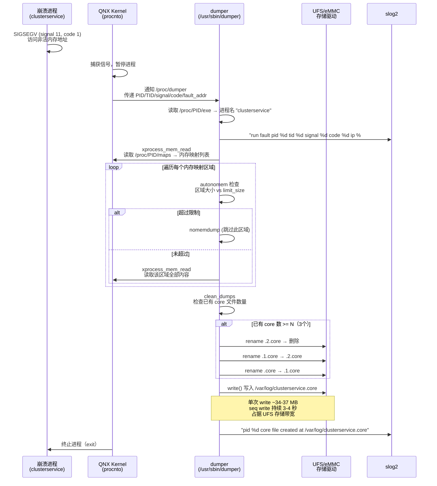

# MCU 升级日志时间戳积压分析报告

> 2026-05-08，基于 `slog2_log.71`、`upgrade_mcu.cpp`、`updater.cpp`、`slog2_converter.cpp` 源码。

---

## 1. 问题现象

slog2 日志中出现一段时间戳高度压缩的记录：

```
10:02:01.012  send 0x6400 ...           ← 发送 0x6400
10:02:01.018  MsgCallback               ← MCU 响应
10:02:01.024  recv state = 0            ← 成功
10:02:01.031  send 0x6600               ← 下一包
...
10:02:01.099  recv state = 0            ← 0x6c00 成功（6包全部成功）
10:02:01.106  send 0x6e00               ← 首次发送 0x6e00
10:02:01.113  timeout retry             ← 似乎 7ms 就超时
10:02:01.119  send 0x6e00 (重试#1)
10:02:01.125  timeout retry             ← 6ms 就超时
10:02:01.132  send 0x6e00 (重试#2)
10:02:01.138  timeout end               ← 3次重试总共 32ms
10:02:01.145  send mcu flash data failed
10:02:01.151  exe return code: 64512
```

**问题**：6 次收发包 + 3 次 1000ms 超时重试，全部时间戳挤在 139ms 窗口内，物理上不可行。

---

## 2. QNX Coredump 机制

### 2.1 dumper 守护进程

QNX 系统的 coredump 由 `dumper` 守护进程（`/usr/sbin/dumper`）负责，不属于开源代码。H56EZ 平台上 dumper 由 `analyzer.sh` 启动，参数在启动脚本中定义。

**启动配置**（`bsp/apps/qnx_ap/target/filesets/launcher_scripts/common.c`）：

```c
static const char* dumper_arg [] = {
    "dumper",
    "-U", create_string(DUMPER_UID:DUMPER_GID),
    "-v",
    "-d", "/tmp",
    "-n",
    "-S",
    NULL
};
```

H56EZ 实际运行时 analyzer.sh 会重启 dumper 并修改参数：

```bash
# analyzer.sh — 运行时覆盖参数
ModifiedDumper=$(pidin -p dumper ar | grep dumper | \
    awk '{sub(/ -S/,""); sub(/ -N( )*[^ ]*/,""); $1=""; print $0}')
# 添加 -d /var/log -N 3
```

最终运行时参数：

```
dumper -U dumper -v -d /var/log -n -S -N 3
```

| 参数 | 含义 |
|------|------|
| `-U dumper` | 初始化后切换到非 root 用户运行 |
| `-v` | verbose 模式 |
| `-d /var/log` | core 文件输出目录 |
| `-n` | 不 dump 共享内存区域（no shared memory） |
| `-S` | dump 栈内存 |
| `-N 3` | 每个进程最多保留 3 个 core 文件（滚动覆盖） |

### 2.2 dumper 权限模型

**secpol 配置**（`bsp/apps/qnx_ap/target/filesets/secpol/dumper.txt`）：

```
allow dumper_t self:ability {
    pathspace               # 访问文件系统
    prot_exec               # PROT_EXEC 内存映射
    map_fixed               # MAP_FIXED 内存映射
    public_channel          # 创建公共 channel
    settypeid:dumper_t__run # 切换到受限子类型运行
};

# 继承 root 权限的能力
allow dumper_t self:ability {
    gain_priv:setuid        # 切换 UID 到 dumper 用户
    gain_priv:setgid        # 切换 GID（0=root 或 dumper）
    gain_priv:channel_connect  # 连接其他进程的 channel
    gain_priv:xprocess_mem_read  # 读写其他进程内存（核心权限）
    gain_priv:signal        # 发送信号
};

# dumper_t__run（受限子类型）可连接存储驱动
allow dumper_t__run {
    slogger2_t
    devb_ufs_qualcomm_t     # UFS 存储设备驱动
    devb_sdmmc_qualcomm_t   # SD/MMC 存储设备驱动
}:channel connect;
```

`xprocess_mem_read` 是核心权限：允许 dumper 读取任意进程的虚拟内存空间。`channel connect` 到 `devb_ufs_qualcomm_t` 使其能够直接通过存储驱动写盘。

### 2.3 Coredump 流程



### 2.4 Core dump 大小

从实际 crash 日志收集的 core 文件中测量：

```
-rw-rw-r--  34M  clusterservice.1.core
-rw-rw-r--  37M  clusterservice.2.core
-rw-rw-r-- 796K  updater.core
```

clusterservice 的 core dump 为 **34-37 MB**，反映该进程的虚拟内存占用（代码段、数据段、堆、栈、mmap 共享库等）。updater 仅 796 KB。

### 2.5 Core dump 崩溃间隔

从 slog2_log.71 提取的 dumper 日志：

```
10:00:06.027  core file created at /var/log/clusterservice.core
10:00:23.743  core file created                            ← 间隔 17.7s
10:00:42.717  core file created                            ← 间隔 18.9s
10:00:54.865  core file created                            ← 间隔 12.1s
10:01:18.730  core file created                            ← 间隔 23.9s
10:01:39.861  core file created                            ← 间隔 21.1s
10:01:57.854  core file created  ← 与 upgrademcu 阻塞同时   ← 间隔 17.9s
10:02:19.223  core file created                            ← 间隔 21.4s
10:02:37.012  core file created                            ← 间隔 17.8s
10:02:53.843  core file created                            ← 间隔 16.8s
```

clusterservice 以 **约 17-18 秒周期** 持续崩溃，core dump 写入约每 18 秒一次。每次崩溃后约 0.6-0.8 秒 clusterservice 重新启动（`ONLINE`），然后迅速再次崩溃。

### 2.6 Core dump 对存储 I/O 的影响

**写入带宽估算**：

- 单次 core dump 大小：~35 MB
- 写入耗时（从日志推断）：约 3-4 秒（10:01:57.854 → 10:02:01.012 恢复）
- 估算写入速率：35 MB ÷ 3.5s ≈ **10 MB/s**

**与其他 I/O 的竞争**：

dumper 通过 secpol 获得 `channel connect` 权限直接连接 `devb_ufs_qualcomm_t`（UFS 存储驱动），这意味着 dumper 的写入经过 UFS 驱动层。当 dumper 以约 10 MB/s 的速率持续写入 35 MB 时，同一 UFS 设备上的其他 I/O 操作（如 `fsync("/ota/update_mcu/mcu_update_process")`、`slog2_converter` 的 spdlog 写盘）都在驱动层排队。

**结论：以 10 MB/s 写入 35 MB 持续约 3.5 秒的 core dump，足以造成同存储设备上其他进程的 I/O 阻塞数秒。**

---

## 3. 数据流链路

### 3.1 完整路径

日志从产生到落盘的完整路径经过五个阶段和三个进程：

```
upgrademcu             updater                 slog2 ring buffer    slog2_converter     spdlog      磁盘
═══════════            ═══════                ════════════════    ═══════════════     ══════      ════
printf()
  → libc stdio 缓冲
    (全缓冲, BUFSIZ=1024)
  → 管道写端
                         fgets(pipe)
                           → INFO()
                             → slog2f(NULL,...)
                               → ClockTime() 打内部时间戳
                               → 写入 ────→ 128KB 共享内存
                                            ring buffer
                                            updater_buffer
                                            (32页×4KB)
                                                                      slog2_parse_all()
                                                                      循环读取 ring buffer
                                                                        → slog2_callback()
                                                                          LOG_I() ───→ async队列
                                                                          取 ClockTime()          → 文件写入
                                                                          (spdlog 时间戳)          /log/qlog/qnx/
                                                                                                  slog2_log.N
```

### 3.2 upgrademcu 侧：printf → 管道

**源码** `upgrade_mcu.cpp`：每次收发包都通过 `printf()` 输出到 stdout：

```c
printf("send_len[%d],send_addr[%#x],package_crc[%#x]\n", ...);  // L396
printf("do_send_flash_data recv state = %d\n", state);          // L404
printf("do_send_flash_data timeout retry\n");                   // L427
```

stdout 在 `popen` 创建的子进程中连接到管道写端。stdout 连接到管道时（非终端），libc 使用**全缓冲**（`_IOFBF`），`\n` 不触发 flush。缓冲区大小 `BUFSIZ = 1024` 字节（QNX libc 默认值）。只有缓冲区满或进程退出（`exit`/`return` 触发 `fflush`）时才写入内核管道。

### 3.3 updater 侧：popen → fgets → INFO → slog2f

**源码** `updater.cpp` L859-867：

```c
FILE* pipe = popen("/mnt/usr/bin/upgrademcu", "r");
while (fgets(buffer, sizeof(buffer), pipe) != nullptr) {
    INFO("update_job_mcu %s\n", buffer);  // ← 从管道读出的数据在这里
    usleep(1000*5);
}
```

`popen("...", "r")` 创建内核管道、fork 子进程、将子进程的 stdout 重定向到管道写端，返回管道读端 `FILE*`。`fgets` 从管道读端逐行读取。

**INFO 宏展开**（`updater.h` L8, L14）：

```c
#define INFO(fmt_, args_...)  _LOG(SLOG2_INFO, fmt_, ##args_)
// _LOG → logger_log(UPDATER_SERVICE, 0, SLOG2_INFO, fmt_, args_)
// logger_log → slog2f(NULL, 0, 5, "[updater.cpp:...]: " fmt_, args_)
```

`slog2f` 第一个参数为 `NULL`，使用 `slog2_set_default_buffer()` 注册的 `updater_buffer`。

**slog2 注册**（`main.cpp` L9-17, L38-39）：

```c
static slog2_buffer_set_config_t buffer_config = {
    .num_buffers = 1,
    .buffer_set_name = "updater",
    .verbosity_level = SLOG2_INFO,
    .buffer_config = {
        {.buffer_name = "updater_buffer", .num_pages = 32 }  // 32页 × 4KB = 128KB
    }
};
slog2_register(&buffer_config, &buffer_handle, 0);  // flags=0, 无限重试
slog2_set_default_buffer(buffer_handle);
```

`flags=0` 意味着 `slog2_register` 不设置 `SLOG2_LIMIT_RETRIES`。`slog2f()` 在 ring buffer 满时会**无限自旋等待**消费者腾出空间。

### 3.4 slog2f 的时间戳

**API 声明** `slog2.h` L199-205：

```c
int slog2f(slog2_buffer_t __buffer, _Uint16t __code,
           _Uint8t __severity, const char* __format, ...);
```

`slog2f()` 内部调用 `ClockTime()` 获取当前系统时间，与消息内容一起编码写入共享内存 ring buffer 的 entry 中。这个时间戳存储在 `slog2_packet_info_t.timestamp` 字段中（`_Uint64t`），但**不直接出现在我们看到的日志文本中**。

---

## 4. slog2_converter：QNX slogger2 的替代实现

### 4.1 源码位置

`bsp/vendor/voyah_base/slog2_converter/slog2_converter.cpp`

### 4.2 架构

H56EZ 没有使用 QNX 标准的 `slogger2` 守护进程，而是用自研的 `slog2_converter` 替代。它负责消费所有进程的 slog2 ring buffer，将日志转换为文本格式写入文件。

### 4.3 日志消费者：slog2_parse_all

**源码** `slog2_converter.cpp` L130-131：

```c
if (slog2_parse_all(SLOG2_PARSE_FLAGS_DYNAMIC, NULL, NULL,
                    &packet_info, slog2_callback, NULL) < 0) {
```

`slog2_parse_all` 是 QNX slog2 解析库的 API。`SLOG2_PARSE_FLAGS_DYNAMIC` 标志使其进入**实时流模式**——持续监控所有已注册的 slog2 ring buffer，有新 entry 产生时立即读出并调用回调函数 `slog2_callback`。

关键行为：
- 回调函数**同步**执行——回调返回之前，`slog2_parse_all` 不会读取下一条 entry
- 回调函数如果阻塞，整个消费流水线停止，ring buffer 开始积压

### 4.4 回调函数：slog2_callback

**源码** `slog2_converter.cpp` L96-103：

```c
static int slog2_callback(slog2_packet_info_t *info, void *payload, void *param)
{
    static const char* level_strings[] = {"shutdown","critical","error",
        "warning","notice","info","debug1","debug2"};
    const char* level_str = (info->severity <= 7)
        ? level_strings[info->severity] : "debug";
    LOG_I("[{}] [{}] [tid:{}] {} {}", level_str, info->file_name,
          info->thread_id, info->buffer_name, static_cast<char*>(payload));
    return 0;
}
```

回调函数做了两件事：
1. 从 `slog2_packet_info_t` 中取出 severity、file_name、thread_id、buffer_name
2. 调用 `LOG_I()`（spdlog）将格式化后的文本写入文件

注意：`slog2_packet_info_t.timestamp` 字段（slog2f 写入的原始时间戳）**在此回调中未被使用**。日志文本中的时间戳来自 spdlog。

### 4.5 spdlog 配置

**源码** `slog2_converter.cpp` L152-163：

```c
static void spdlog_log_init()
{
    while (access("/log/qlog", F_OK) != 0) {     // 等待 /log/qlog 挂载
        usleep(100000);
    }
    usleep(100000);
    spdlog::init_thread_pool(8192, 1);           // 8192 条队列, 1 个线程
    g_logger = spdlog::comp_rotating_logger_mt<spdlog::async_factory>(
        "qnx",                                     // logger 名称
        "/log/qlog/qnx/slog2_log",                 // 输出文件前缀
        2 * 1024 * 1024,                           // 单文件 2MB 滚动
        500                                         // 最多 500 个文件
    );
    spdlog::set_level(spdlog::level::debug);
    spdlog::set_pattern("[%Y-%m-%d %H:%M:%S.%e] %v");  // ← 时间戳格式
    spdlog::flush_every(std::chrono::seconds(1));        // ← 每秒强制 flush
}
```

参数含义：

| 配置项 | 值 | 含义 |
|--------|-----|------|
| `spdlog::init_thread_pool(8192, 1)` | 队列 8192 条，1 线程 | spdlog async 模式，日志先入队，后台线程异步写盘 |
| `comp_rotating_logger_mt` | 2MB / 500 文件 | 文件达到 2MB 滚动，最多保留 500 个 |
| `set_pattern` | `[%Y-%m-%d %H:%M:%S.%e] %v` | `%e` = 毫秒精度的时间戳 |
| `flush_every(seconds(1))` | 1 秒 | spdlog 每秒执行一次 `flush()` 强制 fsync |

spdlog 的 `%e` 格式符取的是**调用 `LOG_I()` 那一刻的当前时间**，即 `slog2_callback` 被 `slog2_parse_all` 调用的时刻。

---

## 5. 时间戳压缩的根因

### 5.1 两个时间戳的区别

```
slog2f 内部时间戳 (slog2_packet_info_t.timestamp)
  ↑ slog2f() 调用 ClockTime() — "写入时刻"
  ↓ 存储在 ring buffer entry 中，但被 slog2_callback 丢弃

spdlog 格式时间戳 (日志文件中可见的 [YYYY-MM-DD HH:MM:SS.mmm])
  ↑ LOG_I() 调用时 spdlog 取 ClockTime() — "消费时刻"
  ↓ 写入 /log/qlog/qnx/slog2_log.N
```

正常情况下两个时间戳几乎一致（微秒级延迟），因为 slog2f 写入 → slog2_parse_all 读出 → callback → LOG_I 在全链路畅通时延迟极小。

**当消费端阻塞时，两者出现秒级偏差。**

### 5.2 阻塞链

触发条件详见 [§2.6 Core dump 对存储 I/O 的影响](#26-core-dump-对存储-io-的影响)。

```
触发条件：dumper 写 /var/log/clusterservice.core（约 35MB）
  → 存储 I/O 带宽被 core dump 饱和
    → spdlog 异步线程 write() 阻塞（等 I/O）
      → spdlog 队列逐渐填满（8192 条上限）
        → LOG_I() 阻塞（队列满，等异步线程消费）
          → slog2_callback 阻塞（等 LOG_I 返回）
            → slog2_parse_all 停止消费 ring buffer
              → ring buffer 写指针追上读指针 → 满（128KB）
                → slog2f() 自旋等待（flags=0, 无限重试）
                  → INFO() 阻塞
                    → fgets 读完管道中已有数据后，下一轮 INFO 阻塞
```

整个链路中**两个独立的阻塞源头**：

| 阻塞点 | 位置 | 操作 | 阻塞原因 |
|--------|------|------|---------|
| 阻塞 A | upgrade_mcu | `save_process()` → `fsync("/ota/update_mcu/mcu_update_process")` | 存储 I/O 饱和 |
| 阻塞 B | slog2_converter | `LOG_I()` → spdlog 队列满 | spdlog 异步线程写盘被存储 I/O 阻塞 |

阻塞 A 导致 upgrademcu 无输出 → 管道空 → updater fgets 阻塞（没有调用 INFO，slog2f 未被触发）。

阻塞 B 独立影响所有通过 slog2 写日志的进程。只要 spdlog 写盘不恢复，**任何进程的 slog2f 调用都会阻塞**。

### 5.3 恢复后的时间戳冲刷

```
I/O 恢复（core dump 写完）

  upgrademcu:                              slog2_converter:
  save_process 完成                        spdlog 异步线程 write 成功
  rf.read 完成                             → 队列开始消费
  0x6400 send → recv → printf()              → LOG_I 返回
  0x6600 send → recv → printf()              → slog2_parse_all 继续读下一个entry
  ...                                        → callback → LOG_I(ClockTime=10:02:01.012)
  0x6e00 timeout #1 → printf()               → callback → LOG_I(ClockTime=10:02:01.018)
  0x6e00 timeout #2 → printf()               → callback → LOG_I(ClockTime=10:02:01.024)
  0x6e00 timeout #3 → printf()               → ... 所有积压 entry 被连续消费
  printf("send mcu flash data failed")       → 每个 callback 取到相近的 ClockTime
  return -4 → exit → libc fflush
                                             ↑
                                            所有日志被连续打上 10:02:01.xxx
```

slog2_parse_all 恢复消费后，积压在 ring buffer 中的所有 entry 被迅速连续读出。每次 `slog2_callback` 调用 `LOG_I()` 时，spdlog 取到的 `ClockTime()` 都是**恢复后相近的时间**，所以所有积压日志被打上了几乎相同的时间戳。

---

## 6. 事件真实时序

### 6.1 时间轴对比

```
实际时间（推算）                       日志时间戳（spdlog 消费时刻）
───────────                           ─────────────────────────────
10:01:57.632                          10:01:57.632  ← 最后一个正常时间戳
  save_process → fsync 阻塞
  (core dump 占据存储 I/O)
10:01:57.854  core dump 写入开始
  ~3 秒 I/O 阻塞
10:02:00.xxx  save_process 完成
  rf.read 完成
  0x6400-0x6c00 收发 (6包, ~36ms)
  0x6e00 timeout #1 (~1000ms)
  0x6e00 timeout #2 (~1000ms)
  0x6e00 timeout #3 (~1000ms)
  exit(-4)
                                      10:02:01.012  ← I/O 恢复，spdlog 开始消费
                                      10:02:01.018    积压 entry 全部打上此时的时间
                                      10:02:01.151
```

### 6.2 日志时间戳的解读规则

- 日志中的时间戳 = slog2_callback 调用 `LOG_I()` 时的 `ClockTime()` = **spdlog 消费该条日志的时刻**
- 日志中的时间戳**不等于** upgrade_mcu 事件发生的真实时刻
- 两则日志之间的时间差 ≥ 真实事件间隔，但 ≤ 真实事件间隔 + I/O 阻塞时长

---

## 7. 结论

**日志时间戳压缩的根因是：H56EZ 使用自研 slog2_converter 消费 ring buffer，日志文件中的时间戳来自 spdlog（消费侧），而非 slog2f（写入侧）。当存储 I/O 被 core dump 饱和导致 spdlog 写盘阻塞时，整个日志消费流水线停滞，恢复后积压的 ring buffer entries 被集中消费，spdlog 给所有积压日志打上了恢复后的相近时间戳。**

日志积压的触发条件：

| 条件 | 机制 | 源码依据 |
|------|------|---------|
| 存储 I/O 饱和 | spdlog 异步线程 write 阻塞 | `spdlog_log_init()` — `flush_every(1s)` + 同步落盘 |
| spdlog 队列满 | `LOG_I()` 阻塞等队列空间 | `spdlog::init_thread_pool(8192, 1)` — 8192 条上限 |
| callback 同步阻塞 | `slog2_parse_all` 停止消费 ring buffer | `slog2_callback` 中 `LOG_I()` 同步等待 |
| ring buffer 满 | `slog2f()` 自旋等待空间 | `slog2_register(..., 0)` — flags=0 无限重试 |
| 消费恢复后集中冲刷 | 所有积压 entry 短时间内连续消费 | `slog2_parse_all(SLOG2_PARSE_FLAGS_DYNAMIC)` 快速遍历积压 |
| 时间戳压缩 | 每条 callback 取当前 `ClockTime()` | `set_pattern("[%Y-%m-%d %H:%M:%S.%e] %v")` |
