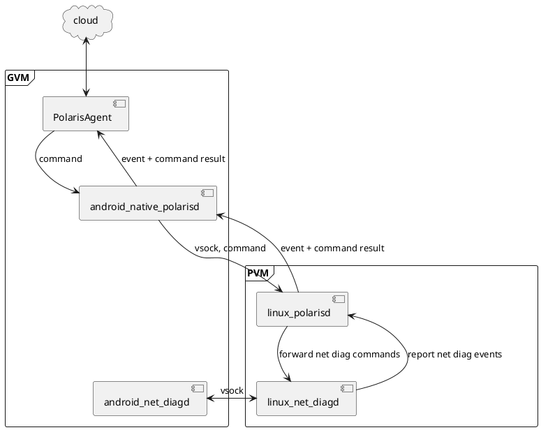

```plantuml
@startuml

frame GVM {
component PolarisAgent
component android_native_polarisd
component android_net_diagd
}

frame PVM {
    component linux_polarisd
    component linux_net_diagd
}

cloud cloud

PolarisAgent <-up-> cloud
PolarisAgent -down-> android_native_polarisd: command
android_native_polarisd -up-> PolarisAgent: event + command result
android_native_polarisd --> linux_polarisd:vsock, command
linux_polarisd --> android_native_polarisd: event + command result

android_net_diagd <--> linux_net_diagd:vsock

linux_polarisd --> linux_net_diagd: forward net diag commands

linux_net_diagd --> linux_polarisd: report net diag events

android_net_diagd -[hidden]up-- android_native_polarisd
@enduml
```