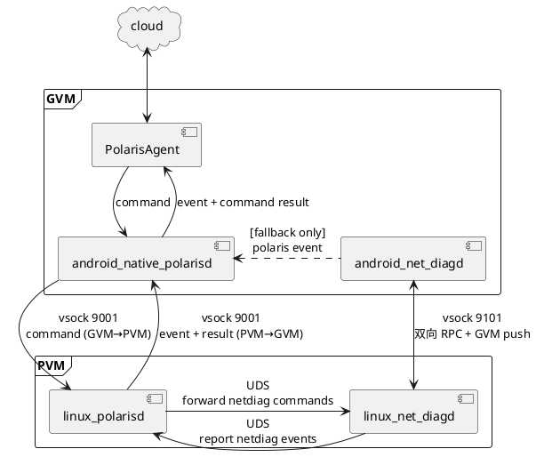

# 网络诊断模块设计 — 调研与执行日志

> 目的：跟踪本次"网络诊断模块"从需求消化、实机调研、架构设计到落地文档的全过程，避免上下文中断后丢失进度。  
> 输入文档：`network_topology.md`、`network_diagnosis_requirements.md`（同目录）  
> 工作目录：`/home/ethen/workspace/github/ethenslab/work/`  
> 启动日期：2026-05-09  
> 平台：SA8397 智能座舱，PVM Linux 6.6.110-rt61 PREEMPT_RT + GVM Android（qcrosvm Hypervisor）

---

## 0. ADB 设备与角色映射

```
adb -s d7df5883 → GVM (Android, "SA8397 Cockpit")
adb -s e66b06ea → PVM (Linux sa8797 6.6.110-rt61-debug aarch64)
```

后续调研所有命令均以此为准。识别原则不依赖固定序列号，按 §3.1 用 `getprop ro.product.model` / `uname -a` 自动识别。

---

## 1. 总体里程碑（Roadmap）

| # | 阶段 | 状态 | 备注 |
| --- | --- | --- | --- |
| M1 | 通读 topology + requirements 文档 | ✅ 已完成 | 详见第 2 节关键提炼 |
| M2 | 建立本进度文档 | ✅ 进行中 | 即本文件 |
| M3 | 前期实机调研：PVM 接口/路由/iptables/服务 | ✅ 已完成 | 见 §3.1 |
| M4 | 前期实机调研：GVM 接口/路由/服务 | ✅ 已完成 | 见 §3.2 |
| M5 | 实机一致性核对：与拓扑基线 §11 比对 | ✅ 已完成 | 见 §4 偏差表 |
| M6 | 设计模块架构（采集器 / 检查器 / 报告器） | ⏳ 草案完成 | 见 §5；待详化 |
| M7 | 设计 check_id 配置 schema 与基线 schema | ⏳ 待开始 | 把需求 §5 拆为 YAML/JSON |
| M8 | 输出最终设计文档 | ⏳ 待开始 | `network_diagnosis_design.md` |

---

## 2. 需求文档关键提炼

### 2.1 诊断分层模型（必须实现）

L1 物理 → L2 VLAN/以太网 → L3 IP/路由 → L4 NAT/防火墙 → L5 服务 → 虚拟化链路 → 性能 → 安全

### 2.2 必须覆盖的诊断模式（§5.1）

- **NET-DIAG-MODE-001** 一键全量巡检（60s 内出报告）
- **NET-DIAG-MODE-002** 按 VLAN 专项（VLAN 3/4/6/7/8/10-14/15/19）
- **NET-DIAG-MODE-003** 按业务场景（互联网/诊断/泊车/OTA/ADAS/SOME-IP/RTSP/Host-Guest）
- **NET-DIAG-MODE-004** 故障触发诊断（link/计数/端口/路由/NAT/丢包）
- **NET-DIAG-MODE-005** 只读模式（命令白名单严控）

### 2.3 必查清单（高浓度索引）

| 域 | 关键检查项 |
| --- | --- |
| 接口/MAC | `eth0=02:df:53:00:00:09`、`eth1=02:df:53:00:00:04`、carrier、speed/duplex、错误计数、flapping |
| VLAN | PVM `eth1.{3,4,6,7,8,10-14}` + `eth0.{15,19}`、PVM `vmtap1.{3,4,6,7,8}`、GVM `eth1.{3,4,6,7,8}` 三侧一致 |
| IP/路由 | PVM main + table 106/107/108、GVM main 无 default、Android NetId 100/101/102/103 → VLAN 8/6/3/7 |
| 内核参数 | `ip_forward=1`、`conf.all.forwarding=1`、per-iface forwarding=1、`rp_filter≠1`（NAT 路径）、`proxy_arp` 漂移 |
| NAT | VLAN 3/4/6/7/8 双向 SNAT/DNAT、VLAN 4 TCP/30006 例外（顺序敏感）、规则命中计数 |
| 防火墙 | FORWARD 默认策略、conntrack 使用率、`nf_conntrack: table full`/`insert_failed` |
| 虚拟化 | qcrosvm 进程、vmtap 设备、Host-Guest `10.10.200.0/24` 双向、PVM-only VLAN 不得在 GVM 出现 |
| 服务 | DoIP `13400`、VLM `5062/5064`、gftpd `58046`、IDPS `30006`、someipd 多端口、Camera Server、`amblightserver` |
| 安全 | GVM 暴露面清单、PVM `0.0.0.0` 监听清单、IDPS 旁路完整性、调试端口（adbd/FTP/Telnet/NFS） |
| 性能 | 丢包 1%/5%、RTT 50/100ms、抖动 20ms、MTU 一致性、广播风暴 |

### 2.4 报告状态机（§8.1）

`PASS / INFO / WARN / FAIL / BLOCKED` —— BLOCKED 用于权限/命令缺失/设备离线。

### 2.5 输出要求（§8.2）

每个 FAIL/WARN 必须包含：标题 + 影响 + 故障层级 + 证据 + 建议 + 复核命令。

### 2.6 验收用例（§13）

23 个用例（TC-NET-001 ~ TC-NET-023）覆盖 link down、VLAN 缺失、DNAT 缺失、IDPS 旁路错、策略路由缺失、fwmark 错、SOME/IP 服务缺失、RTSP 流断、调试端口暴露、错误计数突增、网关 ARP 失败、`eth0` link、Host-Guest 异常、DNAT 顺序、MTU、trunk 父接口 DOWN、DNS、rp_filter、MAC 异常、TBOX 网关、conntrack 满、forwarding 关、TBOX 上游不通。

---

## 3. 实机调研记录

### 3.1 PVM 调研结果（2026-05-09 采集，原始数据 `/tmp/netdiag_probe/pvm_*.txt`）

| 检查项 | 状态 | 摘要 |
| --- | --- | --- |
| 接口列表 | ✅ 对齐 | `eth0/eth1` UP；VLAN 子接口 `eth1.{3,4,6,7,8,10..14}` + `eth0.{15,19}` 全 UP；IP 与基线 §11 全部一致 |
| MAC 基线 | ✅ 对齐 | `eth0=02:df:53:00:00:09`、`eth1=02:df:53:00:00:04`，全 VLAN 子接口共享父接口 MAC |
| vmtap | ✅ 对齐 | `vmtap0=10.10.200.1/24`、`vmtap1.{3,4,6,7,8}=10.10.10X.1/24`；vmtap0/vmtap1 state=`UNKNOWN`（TAP 设备正常态，诊断时不应判 DOWN） |
| 主路由 | ✅ 对齐 | `default via 172.16.103.20 dev eth1.3` 存在 |
| 策略路由 | ✅ 对齐 | rule 217/218/219 → table 108/107/106 全部存在；rule 220 lookup 220 存在但表为空（与文档 §11.5 一致） |
| 邻居/ARP | ✅ 对齐 | 全部关键网关均 **PERMANENT**（静态注入）：`172.16.{103,106,107,108}.20`、`172.16.{115,119}.98`、`172.16.{104,107,108}.11` 等。**注意：诊断逻辑应把 PERMANENT 视为 PASS，等价于 REACHABLE/STALE** |
| ip_forward | ✅ 对齐 | `=1` |
| forwarding/rp_filter | ✅ 对齐 | `conf.all.forwarding=1`，`conf.all.rp_filter=0`；NAT 路径所有接口（`eth1.{3,4,6,7,8}`、`vmtap1.{3,4,6,7,8}`）`forwarding=1`、`rp_filter=2`（loose mode，符合 §5.5 NET-DIAG-IP-004 要求） |
| iptables NAT | ✅ 对齐 | PREROUTING 6 条 DNAT 完全匹配文档；VLAN 4 TCP/30006 例外规则**顺序正确**（`! --dport 30006` 在前，`! -p tcp` 在后） |
| iptables FORWARD | ✅ 对齐 | 5 对 `vmtap1.X ↔ eth1.X` 双向规则齐全；默认 ACCEPT（与文档 §11.4 一致，安全 WARN） |
| NAT 命中计数 | ⚠️ 部分 | 仅 `eth1.3 SNAT=5157 包`、`eth1.8 SNAT=426 包` 命中；其余 VLAN 4/6/7 = 0（说明诊断仪/泊车/OTA 当前未活跃，正常态） |
| conntrack | ⚠️ 部分能力 | `nf_conntrack_max=262144`、`count=556`（0.2% 使用率）、`buckets=262144`；**`/proc/net/stat/nf_conntrack` 不存在**（内核未导出该 stats 节点）→ 诊断 NET-DIAG-FW-004 部分项需降级 BLOCKED，靠 `dmesg` + `nf_conntrack_count/_max` 替代 |
| qcrosvm | ✅ 对齐 | `pidof qcrosvm` = 4277，进程存在 |
| 关键服务监听 | ✅ 对齐 | `xdja_idps:172.16.104.40:30006` ✓；7 个 `someipd` 实例覆盖 `172.16.{110,111,112,113,114,119}.40` 多端口 + 组播 `239.5.1.2:30490` ✓；`amblightserver` 在 `10.10.200.1:7400/7650/35357/58002` UDP（Host-Guest 通道） ✓ |
| 计数器/flapping | ✅ 良好 | `eth0/eth1 carrier_changes=1`（仅启动一次 link-up），无 flapping |
| 工具链 | 🔧 注意 | PVM 是 **BusyBox v1.36.1**：`ethtool`、`iptables`、`tcpdump`、`ss`、`ip` 均存在；**无 `conntrack` 工具**（用 `/proc/net/nf_conntrack` 替代）；BusyBox `head` 不支持 `head -10`，必须用 `head -n 10` |

### 3.2 GVM 调研结果（2026-05-09 采集）

| 检查项 | 状态 | 摘要 |
| --- | --- | --- |
| 接口列表 | ✅ 对齐 | `eth0=10.10.200.40/24`、`eth1.{3,4,6,7,8}=10.10.10X.40/24` 全 UP；含大量 placeholder DOWN 设备（`dummy0/ifb0/ifb1/tunl0/gre*/erspan*/sit0/ip6tnl0/ip6gre0`），诊断时**必须过滤** |
| GVM MAC | ⚠️ 与文档示例不同 | 实测 `eth0=36:78:cf:a1:5f:0e`、`eth1=2a:30:c0:d8:d6:b9`；文档 §5.1 提到的 `7a:c6:6f:b6:93:a0` 是另一次启动的样例。**结论：virtio MAC 由 VMM 启动时生成，不应硬编码到基线** |
| 主路由 | ✅ 对齐 | main 表无 default；含 `connected` 5 条 + `10.10.200.0/24 via eth0` |
| 策略路由 | ⚠️ 与文档基线偏差 | 16000/23000 优先级 fwmark 实测：<br>`0x10064 → eth1.7`，`0x10065 → eth1.6`，`0x10066 → eth1.3`，`0x10067 → eth1.8`<br>文档 §11.4 基线写的是：`NetId=100/0x10064 → eth1.8`，`NetId=103/0x10067 → eth1.7`<br>**实测把 NetId=100 与 NetId=103 对调**。原因可能是 Android Connectivity 给网络分配 NetId 是按注册顺序的，不同启动会变化。**结论：诊断模块不能硬编码 NetId↔VLAN 映射，必须从 `dumpsys connectivity` 或 `ip rule` 动态推断** |
| 31000 默认 | ✅ 对齐 | `fwmark 0x0/0xffff iif lo lookup eth1.3`（未标记流量走 VLAN 3 默认互联网通道） |
| dummy0 默认路由 | ⚠️ 注意 | `default dev dummy0 table dummy0` 是 Android 16 的 fallback 网络，不是 main 表 default 漂移。**诊断 NET-DIAG-ROUTE-004 必须排除该项** |
| 关键服务监听 | ✅ 对齐 | `binder:1499_2 (doip_server) :13400` TCP+UDP ✓；`vlm-agent :5062/5064` ✓；`gftpd :58046` ✓；全部绑定 `10.10.104.40` |
| DHCPv6 (rkstack) | ⚠️ 部分 | DHCPv6 client 仅在 `eth1.{3,6,7,8}` 监听 546，**不含 `eth1.4`**（与文档 §5.4 表格一致，但需求 NET-DIAG-PORT 应注意此差异） |
| 平台 | ℹ️ INFO | `ro.build.type=userdebug`、`ro.boot.selinux=permissive`、`getenforce=Permissive`。量产 user 镜像通常 enforcing，部分诊断命令权限会变化 |

### 3.3 实机暴露面（额外发现）

PVM 端文档未列出但实测 0.0.0.0 监听：

- `*:22`（SSH，systemd 启动） — 量产应关闭
- `*:23`（**telnetd by busybox**）— 文档未提及，**量产必须关闭**
- `proftpd :21` — 文档已列
- `rpcbind:111` + `rpc.statd` + `rpc.mountd`（多动态端口）+ `nfs:2049` — NFS 服务全部 0.0.0.0 暴露
- `awe_linuxproxy :15002` — 用途不明，需求文档未明确

GVM 端额外发现：

- `hpp_transfer_da :58050`（0.0.0.0） — 文档已列
- `ah.shortcut.key :8099`（0.0.0.0） — 文档已列
- `qqlive.audiobox :18795 / :8753 / :1888`（0.0.0.0） — **媒体应用监听全网卡**，开发版残留嫌疑

### 3.4 需求条目可执行性核对

| 需求 ID | 实机可行性 | 备注 |
| --- | --- | --- |
| NET-DIAG-LINK-001/002/003 | ✅ 可行 | `ip -br link`、`/sys/class/net/*/carrier`、`/proc/net/dev` 都可读 |
| NET-DIAG-LINK-004 flapping | ⚠️ 一次性诊断为 BLOCKED | `carrier_changes` 是单调累积，无时间维；只有巡检模式才能算"5 分钟内 >3 次" |
| NET-DIAG-LINK-005 ethtool | ✅ 可行 | `/usr/sbin/ethtool` 在 PVM 存在；GVM 默认无（按需 push） |
| NET-DIAG-LINK-006 MAC | ✅ 可行 | `ip -d link show` 输出 MAC 字段 |
| NET-DIAG-VLAN-001..007 | ✅ 全可行 | `ip -d link`、`ip neigh show` |
| NET-DIAG-IP-001..005 | ✅ 全可行 | sysctl + /proc/sys/net/ipv4 |
| NET-DIAG-ROUTE-001..006 | ✅ 全可行 | `ip rule`、`ip route show table all`、`ip route get` |
| NET-DIAG-ROUTE-005（dumpsys connectivity） | ⚠️ userdebug 可行；user 镜像可能 BLOCKED | 当前 userdebug+Permissive 可用 |
| NET-DIAG-NAT-001..004 | ✅ 全可行 | `iptables -t nat -S/-L -nv` |
| NET-DIAG-FW-001..003 | ✅ 可行 | iptables filter、`/proc/net/nf_conntrack`、`sysctl nf_conntrack_*` |
| NET-DIAG-FW-004（conntrack 表满证据） | ⚠️ **部分 BLOCKED** | **`/proc/net/stat/nf_conntrack` 在该平台不存在**；只能靠 `dmesg \| grep nf_conntrack table full` + `nf_conntrack_count/_max` 比例判定 |
| NET-DIAG-VM-001..007 | ✅ 全可行 | `pidof qcrosvm`、`ip -d link` |
| NET-DIAG-SVC-001..012 | ✅ 全可行 | `ss`、`ip route get`、PVM `ping -I` |
| NET-DIAG-PORT-001..005 | ✅ 全可行 | `ss -ltnp/-lunp` 含 `pid/进程名` |
| NET-DIAG-PERF-001..006 | ⚠️ 巡检模式 | 抓包/丢包/RTT 需要短期主动探测，单次诊断只能给瞬时值 |
| NET-DIAG-SEC-001..006 | ✅ 全可行 | 端口对账 + iptables 规则解析 |
| NET-DIAG-RPT-001..005 | ✅ 由模块自身实现 | 输出格式由模块决定 |

---

## 4. 实机 vs 文档基线偏差汇总

| # | 偏差项 | 实测 | 文档基线 | 处理建议 |
| --- | --- | --- | --- | --- |
| D1 | GVM eth0/eth1 MAC | `36:78:cf:..`、`2a:30:c0:..` | §5.1 提到 `7a:c6:6f:b6:93:a0` | 文档 §5.1 注释为"非稳定基线"；**诊断模块对 GVM MAC 不做绝对值检查，只校验"非全零、跨 VLAN 子接口一致"** |
| D2 | NetId↔VLAN（fwmark） | `0x10064 → eth1.7`，`0x10067 → eth1.8` | §11.4：`NetId=100 → eth1.8`，`NetId=103 → eth1.7` | 文档 §11.4 与实机对调；**诊断模块从 `ip rule` + `dumpsys connectivity` 动态生成映射**，把硬编码改为基线模板 |
| D3 | `/proc/net/stat/nf_conntrack` 不存在 | 文件不存在 | §7.1 要求 cat 该文件 | 需求 NET-DIAG-FW-004 该项标 BLOCKED；改用 `dmesg \| grep -i 'nf_conntrack: table full'` 与 `count/max` 比例 |
| D4 | dummy0 默认路由 | `default dev dummy0 table dummy0` | 未提及 | 需求 NET-DIAG-ROUTE-004 必须**排除 `table dummy0`**，避免误报 |
| D5 | `eth1.4` 无 DHCPv6 监听 | `rkstack.process` 仅在 `eth1.{3,6,7,8}` 监听 :546 | §5.4 表格一致，§7.2 未要求 | 不影响诊断；记为 INFO |
| D6 | PVM telnetd:23（busybox）暴露 | `*:23` LISTEN | 未列在 §11.5 | 安全 WARN，量产应关闭 |
| D7 | PVM `awe_linuxproxy:15002` | 监听 `0.0.0.0:15002` | §4.7 列出但用途不明 | 标 INFO；建议补 §11.5 服务基线 |
| D8 | GVM `qqlive.audiobox:18795/8753/1888` | 监听 `0.0.0.0` | §5.4 未列 | 安全 WARN，开发版残留嫌疑 |

---

## 5. 模块架构设计（v2：车机内置版）

> 2026-05-09 用户决策：① 车机内置（不是 host adb 工具）；② 异常时捕获日志 + 上报 polaris；③ 配置文件 JSON。

### 5.1 设计驱动力（Why）

实机调研给出的硬性约束：

1. **基线动态化**：GVM MAC、NetId↔VLAN 都是启动相关，硬编码会误报 → 基线要分"固定项 + 模板项"。
2. **能力探测**：BusyBox + 部分 stats 节点缺失 → 采集器必须先做 capability probe，再决定 PASS/BLOCKED。
3. **车机内置**：PVM 与 GVM 各自跑一个原生进程，**不依赖 host adb**。生产 user 镜像没有 host 调试通道。
4. **只读约束**：命令白名单严控；抓包受限时长，避免影响业务。
5. **跨 VM 协调**：PVM 和 GVM 是两个独立运行时，必须通过 vmtap0 (`10.10.200.0/24`) 控制通道做"协同采集"或各自独立采样后归并。
6. **复用现成基础设施**：polaris-monitor 已经把"配置 JSON + ScanLoop + 取证 + Reporter + 事件上报"全套做完，新模块按相同范式落地，避免重造轮子。

### 5.2 部署形态

两端各部署一个 native 进程，对应 polaris-monitor 的部署形态：

| 维度 | PVM 端 | GVM 端 |
| --- | --- | --- |
| 进程名 | `network-diag-pvm` | `network-diag-gvm` |
| 二进制路径 | `/usr/bin/network-diag-pvm` | `/system/bin/network-diag-gvm` |
| 启动方式 | systemd unit (`network-diag.service`) | Android init `.rc` |
| 配置路径 | `/etc/polaris/network-diag.json` | `/system/etc/polaris/network-diag.json` |
| 工作目录（运行时） | `/run/polaris/network-diag/` (RuntimeDirectory) | `/data/local/polaris/network-diag/` |
| 日志/取证目录（logf） | `/log/perf/network-diag/`（incident_dir、snap_dir、probe 历史统一落此） | `/log/perf/network-diag/`（同 PVM；GVM 侧若分区不存在则 fallback 至 `/data/local/polaris/network-diag/`，由配置项决定） |
| 依赖库 | `libpolaris_client.so` + `libjsoncpp` + libsystemd（可选） | `libpolaris_client` + `libjsoncpp` + Android `liblog/libbase/libcutils/libutils` |
| selinux | （Linux 无 SELinux 限制，仅 unit 沙箱） | `seclabel u:r:network_diag:s0`（新 sepolicy）+ capabilities `NET_RAW NET_ADMIN`（tcpdump 抓包用） |
| 用户/权限 | 推荐 root（少数场景需 raw socket）或 group `netdev`+CAP_NET_ADMIN/CAP_NET_RAW | `user system, group system net_admin net_raw inet` |

> **进程独立、协同同步**：两端进程独立运行，各自巡检/上报；如需"PVM/GVM 双向连通性测试"，由 PVM 端通过 `10.10.200.40` 主动发起对 GVM 端服务的探测（无需 ADB）。后续可加轻量 RPC（vmtap0 上的 UDS 类似协议或 HTTP），但 v1 不依赖。

### 5.3 目录结构（C++ 实现，复用 polaris-monitor 风格）

```
network-diag/
├── conf/
│   └── network-diag.json          # 全部配置（JSONC，jsoncpp allowComments=true）
├── src/
│   ├── main.cpp                    # 入口：加载配置 → 注册 monitor → ScanLoop
│   ├── core/
│   │   ├── Config.{h,cpp}          # JSON 解析（jsoncpp）
│   │   ├── Scheduler.{h,cpp}       # 巡检/触发/手动模式调度
│   │   ├── PolarisReporter.{h,cpp} # 复用 monitor 同名实现模式
│   │   ├── EvidencePack.{h,cpp}    # 取证目录创建/打包/路径管理
│   │   ├── Capability.{h,cpp}      # 工具能力探测（ethtool/dumpsys/stat 节点）
│   │   └── CommandRunner.{h,cpp}   # 只读命令白名单 + 超时执行
│   ├── collectors/
│   │   ├── PvmCollector.cpp        # ip/iptables/ss/sysctl/conntrack/tcpdump
│   │   └── GvmCollector.cpp        # ip/ss/dumpsys/ndc
│   ├── checks/
│   │   ├── L1LinkCheck.cpp         # NET-DIAG-LINK-*
│   │   ├── L2VlanCheck.cpp         # NET-DIAG-VLAN-*
│   │   ├── L3RouteCheck.cpp        # NET-DIAG-IP-*, NET-DIAG-ROUTE-*
│   │   ├── L4NatFwCheck.cpp        # NET-DIAG-NAT-*, NET-DIAG-FW-*
│   │   ├── L5ServiceCheck.cpp      # NET-DIAG-SVC-*, NET-DIAG-PORT-*
│   │   ├── VirtLinkCheck.cpp       # NET-DIAG-VM-*
│   │   ├── PerfCheck.cpp           # NET-DIAG-PERF-*
│   │   └── SecurityCheck.cpp       # NET-DIAG-SEC-*
│   ├── analyzer/
│   │   ├── TopologyDiff.cpp        # 实测 vs baseline 差异
│   │   ├── VlanImpact.cpp          # 链路故障 → VLAN 集合
│   │   └── ScenarioEval.cpp        # 多 check 聚合得出业务结论
│   ├── reporter/
│   │   ├── MarkdownReport.cpp      # 需求 §10 模板
│   │   ├── JsonReport.cpp          # NET-DIAG-RPT-002
│   │   └── PolarisDispatch.cpp     # 把 FAIL/WARN 转成 polaris event
│   └── cli/
│       └── ControlSocket.cpp       # 接收"手动诊断"命令的 UDS（systemd activated）
├── service/
│   ├── network-diag.service        # PVM systemd unit
│   └── network-diag-pvm.json       # （PVM 配置示例）
├── android/
│   ├── network-diag.rc             # GVM init.rc
│   ├── network_diag.te             # sepolicy
│   └── Android.bp
├── linux/
│   └── CMakeLists.txt
└── docs/
    └── README.md
```

### 5.4 polaris 事件接入设计（核心）

#### 5.4.1 事件 ID 段位规划

申请新的 event_id 段（待与 polaris 团队对齐）：

| 事件 | 建议 ID（uint64_t） | 触发条件 | 严重度 |
| --- | --- | --- | --- |
| `NETDIAG_BASELINE_DRIFT` | `0x4E5E_0001` | 接口/IP/MAC/路由/iptables 与基线偏离 | WARN/FAIL |
| `NETDIAG_LINK_DOWN` | `0x4E5E_0002` | `eth0`/`eth1` carrier=0 或 link DOWN | FAIL |
| `NETDIAG_LINK_FLAPPING` | `0x4E5E_0003` | 5 分钟内 carrier_changes 增量 ≥3 | FAIL |
| `NETDIAG_VLAN_MISSING` | `0x4E5E_0004` | 关键 VLAN 子接口缺失 | FAIL |
| `NETDIAG_NAT_RULE_DRIFT` | `0x4E5E_0005` | iptables NAT 规则缺失/顺序异常 | FAIL |
| `NETDIAG_FORWARD_DISABLED` | `0x4E5E_0006` | `ip_forward=0` 或 per-iface forwarding=0 | FAIL |
| `NETDIAG_CONNTRACK_PRESSURE` | `0x4E5E_0007` | 使用率 ≥80% / dmesg `table full` / `insert_failed` | WARN/FAIL |
| `NETDIAG_GATEWAY_UNREACHABLE` | `0x4E5E_0008` | TBOX/ADCU/OTA/ADAS 关键网关 ARP FAILED 或 ICMP 不通 | FAIL |
| `NETDIAG_VM_LINK_BROKEN` | `0x4E5E_0009` | vmtap 异常 / Host-Guest 通道不通 | FAIL |
| `NETDIAG_SERVICE_DOWN` | `0x4E5E_000A` | DoIP/IDPS/someipd/Camera Server 端口未监听 | FAIL |
| `NETDIAG_EXPOSURE_RISK` | `0x4E5E_000B` | 新增 `0.0.0.0` 监听端口 / DNAT 全透传暴露面变化 | WARN |
| `NETDIAG_SCAN_REPORT` | `0x4E5E_00F0` | 一键全量巡检报告（带 log_path 指向 markdown 报告） | INFO |

最终 ID 由 polaris 团队分配，本表只是占位约定。

#### 5.4.2 事件 payload 字段约定（params_json）

```json
{
  "event": "NETDIAG_NAT_RULE_DRIFT",
  "side": "PVM",                       // PVM | GVM
  "layer": "L4",                       // L1..L5 | VIRT | PERF | SEC
  "vlan": [3,4,6,7,8],                 // 受影响 VLAN（可选）
  "scenario": "B-DoIP",                // 关联业务场景（可选）
  "rule_id": "NET-DIAG-NAT-001",       // 触发的 check_id
  "evidence_summary": "DNAT VLAN 4 ! --dport 30006 顺序异常",
  "baseline_version": "v1.0-2026-05-09",
  "ts_unix": 1747764000,
  "boot_id": "<machine-id>",
  "incident_dir": "/log/perf/network-diag/incidents/incident_20260509_153000_NAT001"
}
```

#### 5.4.3 取证目录（Evidence Pack）—— 异常时捕获日志

每次 FAIL/WARN 触发都会创建独立目录，对应 polaris commit 的 `log_path` 参数（统一 logf 根目录 `/log/perf/network-diag/`）：

```
/log/perf/network-diag/incidents/incident_<ts>_<rule_id>/
├── manifest.json                # 事件元信息 + check 结果摘要
├── baseline_diff.txt            # 实测 vs baseline 差异
├── pvm/
│   ├── ip_addr.txt
│   ├── ip_link.txt
│   ├── ip_route_all.txt
│   ├── ip_rule.txt
│   ├── ip_neigh.txt
│   ├── iptables_nat_S.txt
│   ├── iptables_nat_Lnv.txt
│   ├── iptables_filter.txt
│   ├── ss_listen.txt
│   ├── sysctl_net.txt
│   ├── proc_net_dev.txt
│   ├── nf_conntrack_count_max.txt
│   ├── dmesg_nf_conntrack.txt
│   ├── carrier_changes.txt
│   ├── ethtool_eth0.txt          # 若可用
│   └── tcpdump_*.pcap            # 仅 5-10s，按场景采集
├── gvm/
│   ├── ip_addr.txt
│   ├── ip_route_all.txt
│   ├── ip_rule.txt
│   ├── ss_listen.txt
│   ├── dumpsys_connectivity.txt  # 若权限可用
│   └── ndc_network_list.txt
├── report.md                    # 人类可读结论
└── report.json                  # 机器可读结构化结果
```

后续 polarisd 自行决定是否打包/上传/清理（不在本模块职责内）。模块只保证：① 目录原子创建；② 旧目录按 retention 策略清理（默认保留 7 天 / 最近 50 个 incident）；③ 提交后**不删除**直到 retention 过期，避免 polarisd 在我们清理后才尝试读取。

#### 5.4.4 上报代码骨架（C++ 伪码）

```cpp
// reporter/PolarisDispatch.cpp
int Dispatch(const CheckHit& hit, const std::string& incident_dir) {
  Json::Value body;
  body["event"]            = hit.event_name;
  body["side"]             = hit.side;          // "PVM" / "GVM"
  body["layer"]            = hit.layer;
  body["vlan"]             = hit.vlan_array;
  body["rule_id"]          = hit.check_id;
  body["evidence_summary"] = hit.evidence_summary;
  body["baseline_version"] = baseline_version_;
  body["ts_unix"]          = hit.ts_unix;
  body["incident_dir"]     = incident_dir;

  Json::FastWriter w;
  const std::string json_body = w.write(body);

  return polaris_report_raw(
      hit.event_id,
      "network-diag",
      version_.c_str(),
      json_body.c_str(),
      incident_dir.c_str());        // log_path 透传
}
```

### 5.5 配置文件（JSON）— 用户问题 ③ 的回答

**完全可以用 JSON**，且建议用 **JSONC**（带注释的 JSON），与 polaris-monitor `monitor.json` 保持一致 —— 用 `jsoncpp` + `Json::Reader::parse(..., true /*collectComments*/)` / `Json::CharReaderBuilder::settings_["allowComments"] = true` 解析。

样例 `network-diag.json`（v1 占位，M7 完善）：

```jsonc
{
  // ===================== 元信息 =====================
  "version":           "1.0",
  "baseline_version":  "v1.0-2026-05-09",
  "platform":          "SA8397",
  "side":              "PVM",                      // 同一份模板，按部署侧覆盖

  // ===================== 全局策略 =====================
  "policy": {
    "scan_interval_sec":      60,                  // 巡检间隔
    "trigger_min_gap_sec":    30,                  // 同一 check 重报最小间隔
    "global_min_interval_sec":10,                  // 跨 check 上报节流
    "incident_retention_days": 7,
    "incident_max_count":     50,
    "tcpdump_max_sec":        10,
    "tcpdump_max_pkts":       2000,
    "command_timeout_sec":    5,
    "readonly_only":          true                 // 命令白名单只读，必置 true
  },

  // ===================== 拓扑基线 =====================
  "baseline": {
    "pvm": {
      "phys_mac": {
        "eth0": "02:df:53:00:00:09",
        "eth1": "02:df:53:00:00:04"
      },
      "vlan_ifaces": [
        {"name": "eth1.3",  "ip": "172.16.103.40/24", "vlan": 3},
        {"name": "eth1.4",  "ip": "172.16.104.40/24", "vlan": 4},
        // ...
        {"name": "eth0.15", "ip": "172.16.115.41/24", "vlan": 15},
        {"name": "eth0.19", "ip": "172.16.119.41/24", "vlan": 19}
      ],
      "vmtap": [
        {"name": "vmtap0",   "ip": "10.10.200.1/24"},
        {"name": "vmtap1.3", "ip": "10.10.103.1/24", "vlan": 3},
        {"name": "vmtap1.4", "ip": "10.10.104.1/24", "vlan": 4}
        // ...
      ],
      "policy_route": [
        {"prio": 217, "iif": "vmtap1.8", "table": 108},
        {"prio": 218, "iif": "vmtap1.7", "table": 107},
        {"prio": 219, "iif": "vmtap1.6", "table": 106}
      ],
      "gateways": {
        "VLAN3":  "172.16.103.20",
        "VLAN6":  "172.16.106.20",
        "VLAN7":  "172.16.107.20",
        "VLAN8":  "172.16.108.20"
      }
    },
    "gvm": {
      // GVM MAC 不固定 → 不写
      "vlan_ifaces": [
        {"name": "eth0",   "ip": "10.10.200.40/24"},
        {"name": "eth1.3", "ip": "10.10.103.40/24", "vlan": 3}
        // ...
      ],
      "netid_vlan_template": {
        // 从 dumpsys/ip rule 动态推断；这里仅记 VLAN 角色，不绑 NetId
        "default":   "eth1.3",
        "ota":       "eth1.7",
        "adas":      "eth1.8",
        "adcu_park": "eth1.6"
      }
    }
  },

  // ===================== 检查项 =====================
  "checks": [
    {
      "id":       "NET-DIAG-NAT-001",
      "layer":    "L4",
      "side":     "PVM",
      "enable":   true,
      "severity_on_fail": "FAIL",
      "event_id": "0x4E5E0005",
      "cmd":      "iptables -t nat -S",
      "parser":   "nat_rules",
      "expect": {
        "must_contain": [
          "PREROUTING -d 172.16.103.40/32 -i eth1.3 -j DNAT --to-destination 10.10.103.40",
          "PREROUTING -d 172.16.104.40/32 -i eth1.4 -p tcp -m tcp ! --dport 30006 -j DNAT --to-destination 10.10.104.40"
        ],
        "rule_order": [
          { "chain":"PREROUTING",
            "before":"172.16.104.40/32 -i eth1.4 -p tcp -m tcp ! --dport 30006",
            "after": "172.16.104.40/32 -i eth1.4 ! -p tcp" }
        ]
      },
      "evidence_files": ["pvm/iptables_nat_S.txt", "pvm/iptables_nat_Lnv.txt"],
      "suggestion": "恢复 VLAN X DNAT 规则；复核 TCP/30006 IDPS 例外位置必须在前。",
      "recheck_cmd": "iptables -t nat -L -nv ; tcpdump -ni eth1.4 -c 50"
    }
    // ... 其余 50+ 条
  ],

  // ===================== 业务场景（多 check 聚合） =====================
  "scenarios": [
    {
      "id":   "B-DoIP",
      "name": "诊断仪连接 DoIP",
      "side": "MIXED",
      "checks": [
        "NET-DIAG-LINK-001", "NET-DIAG-VLAN-001",
        "NET-DIAG-IP-003",   "NET-DIAG-NAT-001",
        "NET-DIAG-FW-001",   "NET-DIAG-PORT-002",
        "NET-DIAG-SVC-002"
      ],
      "verdict_rules": "any_fail_in_(LINK|VLAN|NAT|PORT) ⇒ FAIL"
    }
    // ... 其余场景
  ]
}
```

### 5.6 触发模式

| 模式 | 触发器 | 实现 |
| --- | --- | --- |
| 巡检 (MODE-001) | systemd timer / Android handler | `Scheduler::ScanLoop()` 60s 一次轻量 + 每小时全量 |
| 故障触发 (MODE-004) | inotify 监听 `/sys/class/net/*/carrier_changes`、`/proc/net/nf_conntrack` 阈值、journald `nf_conntrack: table full` 关键词 | watchdog 子线程 |
| 专项 (MODE-002/003) | 控制 socket 接收命令 | `/run/polaris/network-diag.sock`（PVM）或 Android `SystemSocket`（GVM） |
| 重启后冷启动 | 服务启动时跑一次全量，建立基线快照 | systemd `After=network.target` / Android `class main` |

### 5.7 风险/降级策略表

| 情况 | 降级 | 报告标记 |
| --- | --- | --- |
| 命令不存在（如 GVM ethtool） | 跳过 | BLOCKED + capability_missing |
| `/proc/net/stat/nf_conntrack` 不存在 | 退化到 `count/max` 比例 + dmesg | INFO + degraded_evidence |
| `dumpsys connectivity` 权限受限（user 镜像） | 退化到 `ip rule/route` | BLOCKED + 替代检查 PASS/FAIL |
| GVM placeholder 接口（`dummy0/ifb*/...`） | 过滤 | INFO（不参与 link/VLAN 检查） |
| Android `default dev dummy0 table dummy0` | 过滤 | INFO（Android 16 fallback 网络） |
| polaris commit `-EAGAIN` 队列满 | 计数器累加，本地保留 incident 目录 | 内部日志，不丢事件 |
| polarisd 不可用 | 仅写本地 report.md + incident_dir | service_degraded |
| GVM virtio MAC 与文档示例不同 | 不告警，仅检查"非全零、跨 VLAN 子接口一致" | INFO |
| Android NetId↔VLAN 与基线对调 | 用 `dumpsys connectivity` 动态映射 | INFO |

### 5.8 复用 Polaris VSOCK 通道（2026-05-09 用户问题 ④）

#### 5.8.1 实测得到的 VSOCK 架构

```
   GVM (Android)                              PVM (Linux)
   ┌─────────────────────┐                  ┌─────────────────────┐
   │ App / network-diag  │                  │ network-diag /      │
   │                     │ polaris_event_*  │ NetdiagCollectAction│
   │  ── client SDK ──   │ ───────────────▶ │                     │
   │   libpolaris_client │                  │  IAction            │
   └──────────┬──────────┘                  │  ↑                  │
              │ UDS                         │  │ CommandExecutor   │
              ▼                             │  │ (单 worker 串行)  │
   ┌─────────────────────┐                  │  │                  │
   │ GVM polarisd        │                  │  │                  │
   │  Dispatcher         │                  │  │                  │
   │  HostConnector ────▶│ VSOCK            │  │                  │
   │  (CID=any, peer=2)  │ CID=2, port=9001 │  │                  │
   └──────────┬──────────┘ ◀──── PLP ─────▶│ HostVsockServer ────▶│
              │                            │ GuestSession         │
              │                            └──────────────────────┘
              ▼ Single GuestSession at a time
   IHostForwarder.forwardCommand(req, seqId)   ─→  PVM CommandExecutor → SystemAction → ChildProcess
   GVM 也能以 polaris_report_raw 上行事件     ─→  PVM polarisd 收到后落盘/上报
```

关键源码定位（PVM 在前，GVM 在后）：

- VSOCK 服务端：`daemon/src/transport/vsock/HostVsockServer.{h,cpp}`，监听 `port=9001`（GVM 侧 `HostConnector::HOST_CID=2, HOST_PORT=9001` 硬编码）
- 协议编解码：`daemon/src/transport/vsock/PlpCodec.cpp` —— PLP 将 `CommandRequest`/`CommandResult`/`PolarisEvent` 序列化
- 跨 VM 命令入口（GVM→PVM）：`CommandTarget::HOST`（GVM `polarisd/core/Dispatcher.cpp:201`）→ `HostConnector::forwardCommand(req, seqId)`（`comm/host/HostConnector.cpp:54`）
- PVM 执行：`daemon/src/executor/CommandExecutor.cpp` + `executor/actions/SystemAction.cpp`（ChildProcess + 128KiB inline preview cap + `/log/perf/cmd_results` 持久化）

#### 5.8.2 能复用什么、不能复用什么

| 项 | 复用？ | 说明 |
| --- | --- | --- |
| **VSOCK 物理通道** | ❌ 不直连 | 应用 `socket(AF_VSOCK)` 会绕开 polarisd 的连接管理；当前 `HostVsockServer` 只接受单一 `GuestSession`，并发直连会被踢掉。**不允许应用层直接打开 VSOCK** |
| **polaris 事件传输通道** | ✅ 直接用 | **方向：PVM→GVM**（订正）。源码 `PolarisManager::handleIpcEvent` (`daemon/src/core/PolarisManager.cpp:137-150`)：PVM polarisd 收到 PVM 进程经 IPC 上报的事件后直接 `mVsockServer->sendEvent(eventData)` 推到 GVM；GVM polarisd 转 PolarisAgent → 云。`HostVsockServer.mOfflineCache` 容量 500 条，GVM 离线时本地缓存、重连后 flush。**含义**：PVM 端 `network-diag-pvm` 调一次 `polaris_report_raw` 即可把事件 + log_path 推到云，**不需要 GVM 协调员介入**，也不需要本模块自做重传 |
| **polaris CommandRequest 通道** | ✅ 用作 RPC | GVM 端 network-diag 发 `CommandRequest{target=HOST, action="netdiag.collect_pvm", args=...}`，PVM polarisd 转给 PVM 端的 IAction 处理后回包 —— 这就是"GVM 拉 PVM 数据"的正规 RPC |
| **反向 (PVM→GVM) 同步命令** | ❌ 不存在 | `HostVsockServer` 没有反向 `forwardCommand`；GVM `HostConnector::forwardCommand` 是单向 GVM→PVM |
| **反向 (PVM→GVM) 异步 RPC（事件 enrichment 模式）** | ✅ **已有现成骨架** | （订正）GVM polarisd `Dispatcher` 入站事件流水线提供异步反向 RPC：PVM 发事件 → GVM `IEventPolicy::evaluate` → 若 `EventDecision::ENRICH_THEN_FORWARD` 则 `Executor::submitForEnrichment(EventAction{action, args})` → 触发 GVM 本地 IAction → `mergeResults` 把结果合并进事件 → `deliverEvent` 上云。源码位置：`polarisd/core/Dispatcher.cpp:130-267`、`policy/DefaultEventPolicy.cpp`（`needsLogCapture()` 当前 `return false`，骨架完整、待填规则）。**适用于 PVM 触发事件 + GVM 端补充证据的场景** |
| **数据量** | ⚠️ 限制 | `SystemAction` inline preview 上限 **128 KiB**，超出 truncate；tcpdump pcap 等大文件不能走 CommandRequest，必须走 `incident_dir` + `log_path`（polaris 已有的附件透传机制） |
| **延迟** | ⚠️ 阻塞 RPC | CommandRequest 默认 timeout 5000 ms，CommandExecutor 单线程串行；不适合长时操作（tcpdump、ping 多包）。短探测（ip/iptables/ss）合适 |

#### 5.8.3 调整后的部署拓扑

放弃"两端独立 + 各自上报"的对等模式，采用"PVM 主、GVM 从"的非对称模式：

| 维度 | PVM 端 | GVM 端 |
| --- | --- | --- |
| 角色 | **主诊断节点**：所有检查逻辑、报告生成、polaris 上报由 PVM 完成 | **采集代理**：响应 PVM 通过 polaris 下来的"采集请求"（注：当前不支持 PVM→GVM 主动命令，所以 GVM 仍需起一个轻量进程做主动推送） |
| 进程 | `network-diag-pvm`（systemd） | `network-diag-gvm`（init.rc，**轻量**） |
| 职责 | 拉 PVM 数据 + 接收 GVM 推送 + 跨场景关联分析 + 上报 polaris | 周期推送 GVM 接口/路由/服务快照（`polaris_report_raw` 走事件通道） + 本地 fail-safe 上报 |
| 注册的 polaris IAction（PVM 侧） | `netdiag.collect_pvm`（让 GVM 反查 PVM）；保留 SystemAction 兜底 | — |
| 跨 VM 数据路径 | 接收：GVM 推送的 `NETDIAG_GVM_SNAPSHOT` 事件 | 推送：用 `polaris_report_raw(NETDIAG_GVM_SNAPSHOT, ..., snapshot_dir)`，附 incident_dir 大文件 |

> **为什么 GVM 仍要轻量进程**：当前 polaris VSOCK 是单向（GVM→PVM）发起，PVM 没法主动让 GVM 跑命令。GVM 端如果不跑常驻进程，PVM 拉不到 GVM 数据。如果以后 polaris 加了反向通道，GVM 进程可以裁掉，改成在 polarisd 里注册一个 `netdiag.collect_gvm` action 即可。

#### 5.8.4 复用方案的代价 vs 自建 vmtap0 RPC 的对比

| 维度 | 复用 polaris VSOCK | 自建 vmtap0 IP RPC |
| --- | --- | --- |
| 实现成本 | 低，只需注册新 IAction + 调 client SDK | 高，要自己设计协议、连接管理、断线重连 |
| 可靠性 | 高，polaris 已加固（断线重连、单 session 锁、PLP frame） | 重做一遍 |
| 安全 | VSOCK 内核级隔离，无 IP 暴露面 | vmtap0 是 IP 通道，要自己加端口白名单和 ACL |
| 与诊断耦合 | **诊断模块本身依赖网络** —— 若 vmtap0 故障，IP RPC 死掉但**VSOCK 仍工作**（VSOCK 不依赖 IP 栈、iptables、forwarding） | 诊断时网络异常会导致 RPC 也异常，自我矛盾 |
| 数据量 | inline ≤128 KiB；大文件用 polaris log_path 透传 | 任意大小（自己实现） |
| 延迟 | 适合控制面（短命令） | 任意（按需） |
| 维护 | 跟随 polaris 升级，自动获得改进 | 自己长期维护 |

**结论：用 polaris VSOCK 通道（命令 + 事件）作为 PVM↔GVM 协调主路。** vmtap0 IP 通道仅用于**网络诊断本身**的 ping/tcp 探测（业务网络验证），不用作模块内部 RPC。

> **重要副效应**：网络诊断模块依赖 polaris VSOCK 工作，若 polaris 自身异常，整个诊断模块退化。设计 fail-safe：两端都保留"本地 markdown 报告 + 本地 incident_dir"，即便 polaris 不可达也能在本地排障；polaris 恢复后再补报。

#### 5.8.5 PVM 侧需新增的 IAction

```cpp
// daemon/src/executor/actions/NetdiagCollectAction.h（新增到 PVM polarisd）
class NetdiagCollectAction : public IAction {
public:
    CommandResult run(const CommandRequest& req, ExecutionContext& ctx) override;
    // 支持 args:
    //   {"sections": ["addr","link","route","rule","neigh","iptables","ss","sysctl","conntrack"]}
    //   {"section": "tcpdump", "iface": "eth1.4", "filter": "port 13400", "duration_sec": 5}
    //
    // 返回 data:
    //   { "addr": "<ip -br addr 输出>", ..., "incident_dir": "/log/perf/network-diag/snaps/snap_<ts>" }
};
```

参数白名单严控，避免 SystemAction 风格的"任意命令"风险（network-diag 的 caller 是 GVM polaris 侧，但仍要按只读约束做参数 sanitize）。

#### 5.8.6 GVM 侧的 fail-safe 策略

GVM `network-diag-gvm` 启动时：

1. 优先调 `polaris_event_create()` Lazy init，若返回 `<0`（polarisd 不可达），降级为"仅本地巡检 + 本地 markdown 报告"
2. polaris 队列满 (`-EAGAIN`)：incident_dir 保留不删，下次巡检时从最新 incident 开始重试上报
3. 心跳：每 5 分钟尝试一次 `polaris_report_raw(NETDIAG_HEARTBEAT, ...)`，连续 3 次失败标记降级模式

### 5.9 推荐方案 D：闭环（Cloud↔Android↔PVM）双 daemon

> 用户问题 ⑤（2026-05-09）：要求事件能上报云端 + 云端能反向下发指令。
> 链路：`云 → PolarisAgent (Android) → polarisd (Android) → polarisd (PVM) → 网络诊断模块`

#### 5.9.1 两个硬约束推出的部署形态

1. **polaris VSOCK 命令通道是 `GVM→PVM` 单向**（§5.8 已验证），PVM 没有反向 forwarder 让 GVM 跑命令。
2. **云下行入口固定在 GVM PolarisAgent**（PolarisAgent 是 Android 上的 Java 组件）。

两条事实合起来的唯一顺手形态：**协调员放在 GVM 端**（与云链路同侧、与 polaris 命令方向同向），**PVM 端做执行 + 故障感知**。

```
                                                   ┌────────── 云端 ──────────┐
                                                   │ 下发指令 / 接收事件      │
                                                   └────┬───────────────▲─────┘
                                                        │ 下行           │ 上行
                                                        ▼                │
   ┌───────────────────────── GVM (Android) ──────────────────────────┐  │
   │                                                                  │  │
   │   PolarisAgent (Java) ──────────────────────────────────────┐    │  │
   │                                                              │    │  │
   │   network-diag-gvm  ◀── IAction "netdiag.run" ──── polarisd  │    │  │
   │      │ (协调员)                                              │    │  │
   │      │ 1) 本地采 GVM 数据                                    │    │  │
   │      │ 2) CommandRequest{target=HOST,                        │    │  │
   │      │       action="netdiag.collect_pvm"} ──┐               │    │  │
   │      │ 3) 合并结果 → incident_dir            │               │    │  │
   │      │ 4) polaris_report_raw(SCAN_REPORT,    │               │    │  │
   │      │       log_path=incident_dir) ─────────┼─────▶ ────────┘    │  │
   │      └────────────────────────────────────── ┼──────────────────  │  │
   │                                              │                    │  │
   └──────────────────────────────────────────────┼────────────────────┘  │
                                                  │ VSOCK CID=2:9001       │
                                                  ▼                        │
   ┌───────────────────────── PVM (Linux) ────────────────────────────┐   │
   │                                                                  │   │
   │   polarisd HostVsockServer ──▶ CommandExecutor ──▶ IAction       │   │
   │                                                  "netdiag.       │   │
   │                                                   collect_pvm"   │   │
   │                                                       │           │   │
   │   network-diag-pvm  ◀──────── UDS bridge ─────────────┘           │   │
   │      │  (执行端 + 故障感知端)                                      │   │
   │      │  • watchdog: inotify carrier_changes / conntrack 阈值       │   │
   │      │  • 紧急异常时主动 polaris_report_raw  ─────────▶ polarisd ─┼───┘
   │      │  • 响应 collect_pvm: ip/iptables/ss/sysctl/conntrack/...    │
   │      │  • 响应大请求：tcpdump 短抓包写 incident_dir，仅返回路径    │
   │      └──────────────────────────────────────────────────────────  │
   └──────────────────────────────────────────────────────────────────┘
```

#### 5.9.2 双 daemon 职责切分

| 端 | 进程 | 职责 |
| --- | --- | --- |
| GVM | **`network-diag-gvm`**（协调员） | ① 注册 polaris IAction `netdiag.run`（响应云端/PolarisAgent 下发）<br>② 定时巡检（每小时轻量、每日全量）<br>③ 收到命令后：本地采 GVM + RPC 调 PVM `netdiag.collect_pvm` + 跨域分析 + 写报告 + `polaris_report_raw` 上云<br>④ scenario / check_id / 报告生成等"业务逻辑"集中在此<br>⑤ GVM 自身异常事件直接 `polaris_report_raw` |
| PVM | **`network-diag-pvm`**（执行端 + 故障感知） | ① 注册 polaris IAction `netdiag.collect_pvm`<br>② watchdog：inotify `/sys/class/net/*/carrier_changes`、poll `nf_conntrack_count`、订阅 journald `nf_conntrack: table full` 关键字<br>③ watchdog 触发后：本地采 + incident_dir + 直接 `polaris_report_raw`（紧急路径，不依赖 GVM）<br>④ 不做主动巡检（避免与 GVM 重复） |

#### 5.9.3 上行事件路径（异常 → 云端）

两条独立路径，互为冗余：

> **重要订正（2026-05-09）**：polaris 事件方向是 **PVM→GVM**，不是反过来。云端的统一出口在 GVM PolarisAgent，PVM polarisd 自己不直接出云。两条路径的描述按此订正：

**路径 ①（GVM 协调，含两端数据，由云命令或 GVM 巡检触发）**

```
触发：GVM 收到云命令 / GVM timer / GVM watchdog
 → network-diag-gvm 本地采 GVM
 → CommandRequest{target=HOST, action="netdiag.collect_pvm"} 拉 PVM 数据
 → 合并 → incident_dir（在 GVM 文件系统）
 → polaris_report_raw(event_id, json_body, incident_dir)
 → GVM polarisd → PolarisAgent → 云
```

**路径 ②（PVM 紧急直报，仅 PVM 数据，故障感知专用）**

```
PVM inotify carrier_changes / poll nf_conntrack / journald 关键字
 → network-diag-pvm 立即采 PVM
 → incident_dir（在 PVM 文件系统）
 → polaris_report_raw(event_id, json_body, incident_dir)
 → PVM polarisd EventQueue
 → HostVsockServer.sendEvent → VSOCK → GVM polarisd
 → PolarisAgent → 云
```

路径 ② 的关键性质：

- **完全不需要 GVM 协调员介入**：PVM `network-diag-pvm` 调一次 `polaris_report_raw` 即可，VSOCK 转发由 polarisd 现成机制完成
- **GVM 协调员卡死/忙不影响紧急上报**：事件经 PVM polarisd → VSOCK，与 GVM `network-diag-gvm` 进程无任何依赖
- **GVM 短暂离线也不丢**：`HostVsockServer.mOfflineCache` 现成提供 500 条本地缓存，GVM 重连后 flush
- **网络诊断模块不需要自做重传**：polarisd 已做断线缓存
- **VSOCK 不依赖 IP 栈/iptables/forwarding**：诊断对象本身坏掉时，控制面仍工作，避免自我连锁
- **incident_dir 在 PVM 端文件系统**（`/log/perf/network-diag/incidents/...`）：log_path 是 PVM 的本地绝对路径，云端如何拉取由 polaris 团队约定（可能 PolarisAgent 跨 VM 拉、可能 PVM polarisd 主动上传），不在本模块职责

**路径 ③（PVM 紧急上报 + GVM 自动 enrichment，路径 ② 的"加料版"）**

利用 GVM polarisd 现成的 `IEventPolicy` 入站事件流水线：

```
PVM watchdog 触发 NETDIAG_*
 → network-diag-pvm 调 polaris_report_raw(event_id, json_body, incident_dir_pvm)
 → PVM polarisd EventQueue → HostVsockServer.sendEvent → VSOCK
 → GVM polarisd Dispatcher 收到事件
 → NetdiagEventPolicy::evaluate(event) → EventDecision::ENRICH_THEN_FORWARD
     { action: "netdiag.collect_gvm",
       args: {"sections":["addr","route","ss","neigh"], "trigger_event": NETDIAG_xxx} }
 → Executor::submitForEnrichment → IAction("netdiag.collect_gvm")
 → network-diag-gvm（W2 桥接）取 GVM 端数据
 → Dispatcher::mergeResults 把 GVM 数据合并进原事件
 → deliverEvent → PolarisAgent → 云
```

**关键性质**：

- **PVM 端零变化**：PVM `network-diag-pvm` 调完 `polaris_report_raw` 立即返回，GVM enrichment 在 GVM polarisd 自己时间线异步完成
- **失败安全**：GVM enrichment 超时/失败时，`mergeResults` 仍发出原事件（pass-through 兜底），不阻塞紧急上报
- **触发规则集中在 GVM**："哪些 PVM 事件需要 GVM 补料"完全配置在 GVM 侧的 `NetdiagEventPolicy::evaluate`，PVM 不感知
- **完全复用 polarisd 现成机制**：不新增跨 VM 协议，只在 polarisd 内部填一个 EventPolicy 实现 + 一条 IAction 路由

**典型用法**（按事件 ID → enrichment IAction args 配置）：

| PVM 事件 | GVM enrichment 取什么 |
| --- | --- |
| `NETDIAG_NAT_RULE_DRIFT` | `dumpsys connectivity` + `ip route get 8.8.8.8 mark 0x10066`（GVM 应用侧选路证据） |
| `NETDIAG_CONNTRACK_PRESSURE` | `ss -t state established` GVM 侧活动连接数 |
| `NETDIAG_LINK_FLAPPING` | GVM 端 `/sys/class/net/eth1*/carrier_changes` |
| `NETDIAG_VM_LINK_BROKEN` | GVM `ip neigh show dev eth1` + GVM `ping -c 3 10.10.X.1` 反向探测 |
| `NETDIAG_GATEWAY_UNREACHABLE` | GVM 侧对应 NetId 路由表 + DNS server 配置 |

事件带着两侧证据上云，云端单条 incident 即可看到完整链路状态，不需要再去 query 第二条事件做关联。

#### 5.9.4 下行命令路径（云端 → 诊断动作）

完全沿用用户给出的链路，无需新建通道：

```
云端
 │
 │  下发 { "type":"netdiag.run", "scope":"full"|"vlan:X"|"scenario:Y" }
 ▼
PolarisAgent (Android Java)
 │  Java SDK → polarisd 命令通道
 ▼
Android native polarisd
 │  Dispatcher → CommandTarget::LOCAL → IAction("netdiag.run")
 ▼
network-diag-gvm（协调员）
 │  解析 scope，本地采 GVM
 │  CommandRequest{target=HOST, action="netdiag.collect_pvm", args={...}}
 ▼
Android polarisd HostConnector → VSOCK → PVM polarisd HostVsockServer
 │  PlpCodec → CommandExecutor → IAction("netdiag.collect_pvm")
 ▼
network-diag-pvm
 │  采 PVM → CommandResult{data: {...}, log_path: snap_dir}
 │
 ▼  （沿原路反向回到 GVM）
network-diag-gvm 收到 PVM 数据 → 合成 incident_dir + report
 │  polaris_report_raw(NETDIAG_SCAN_REPORT, ..., incident_dir)
 ▼
PolarisAgent 收到事件回执 / 云端收到结果
```

#### 5.9.5 IAction 接入点（polarisd 当前是静态编译，需评估三种集成方式）

> **关键依赖**：现有 polarisd 的 IAction 是源码内静态注册（`SystemAction` 在 `daemon/src/executor/actions/`）；新增 action 当前**需要改 polarisd 源码**。

| 方式 | 描述 | 优势 | 劣势 | 推荐度 |
| --- | --- | --- | --- | --- |
| **W1：内嵌** | 把 `network-diag-pvm` 全部代码作为 `NetdiagAction.cpp` 编进 polarisd | 0 改动接口，最快上线 | polarisd 二进制膨胀，崩溃影响整 daemon，模块升级=换 polarisd | ❌ |
| **W2：薄桥接（推荐）** | polarisd 仅加一条很薄的 `NetdiagBridgeAction`，它是 RPC 客户端，通过 UDS（如 `/run/polaris/netdiag.sock`）转发到独立的 `network-diag-pvm` 进程 | polarisd 仅一次性侵入 ≈100 行；模块独立部署、独立崩溃域、可独立升级；与 polaris-monitor 的 service 模式一致 | 需 polaris 团队接受这次薄改造 | ✅ |
| **W3：插件机制** | 给 polarisd 加 IAction 动态加载（dlopen .so 或运行时注册） | 完全解耦 | polaris 团队工作量大，跨 VM 协议要重新审计 | ⚠️ 远期 |

GVM 端同理，`netdiag.run` 走 W2 桥接到 `network-diag-gvm`。

#### 5.9.5b polaris 团队侧的全部改动（最终清单）

| 端 | 改动 | 工作量 | 备注 |
| --- | --- | --- | --- |
| PVM polarisd | 新增 `NetdiagBridgeAction`（响应 GVM→PVM 命令）经 UDS 转发到 `network-diag-pvm` | ~100 行薄 RPC client | W2 桥接 |
| GVM polarisd | 新增 `NetdiagBridgeAction`（响应 PolarisAgent → 本地命令）经 UDS 转发到 `network-diag-gvm` | ~100 行 | W2 桥接 |
| GVM polarisd | 实现 `NetdiagEventPolicy`（`IEventPolicy` 子类），识别 `NETDIAG_*` 事件 → 返回 `EventDecision::ENRICH_THEN_FORWARD` 及 EventAction | ~30 行 + 一条 event_id→args 路由表 | 路径 ③，**完全复用** `Executor::submitForEnrichment` / `Dispatcher::mergeResults` |

合计 ~230 行 polarisd 代码，无新协议、无新通道，所有跨 VM 流量仍走现成 VSOCK + PLP 编解码。

#### 5.9.6 协议详化（PVM IAction）

```jsonc
// CommandRequest.args（GVM → PVM）
{
  "sections": ["addr","link","route","rule","neigh",
               "iptables_nat","iptables_filter","ss",
               "sysctl_net","conntrack","carrier_changes"],
  // 可选：单接口短抓包，duration_sec 上限 10
  "tcpdump": { "iface":"eth1.4", "filter":"port 13400",
               "duration_sec":5, "max_pkts":2000 }
}
```

```jsonc
// CommandResult.data（PVM → GVM）
{
  "schema_version": "1",
  "host_ts_unix":   1747764000,
  "boot_id":        "<machine-id>",
  "sections": {
    "addr":  "<原文输出，<=64KiB>",
    "route": "...",
    "iptables_nat": "...",
    // 大数据放进 incident_dir
  },
  "incident_dir": "/log/perf/network-diag/snaps/snap_20260509_153000",
  // tcpdump 输出：始终落盘，CommandResult 只回路径
  "tcpdump_pcap": "/log/perf/network-diag/snaps/snap_20260509_153000/eth1.4.pcap"
}
```

`CommandResult` 的 inline 上限是 128 KiB（SystemAction 同档），**任何超大输出都落 `incident_dir` 走 polaris log_path 透传**。

#### 5.9.7 故障感知（watchdog）信号源清单（PVM 端）

| 信号 | 数据源 | 触发条件 | 事件 ID |
| --- | --- | --- | --- |
| Link 状态变化 | inotify `/sys/class/net/<if>/carrier`、`carrier_changes` | carrier=0 立即触发 / 5min 内 changes ≥3 触发 flapping | `NETDIAG_LINK_DOWN` / `NETDIAG_LINK_FLAPPING` |
| conntrack 阈值 | poll `/proc/sys/net/netfilter/nf_conntrack_count`（10s 一次） | count/max ≥80% WARN，≥95% FAIL | `NETDIAG_CONNTRACK_PRESSURE` |
| conntrack 表满 | journald 订阅（sd-journal API）/ kmsg poll | "nf_conntrack: table full" 出现一次 | `NETDIAG_CONNTRACK_PRESSURE` (FAIL) |
| 路由表关键项缺失 | netlink `RTNLGRP_IPV4_ROUTE` 监听 | `default via 172.16.103.20` 消失 | `NETDIAG_BASELINE_DRIFT` |
| iptables 规则改动 | netlink `NFNLGRP_NFTABLES` / 周期 `iptables-save` 哈希对比 | 关键 NAT 规则改动 | `NETDIAG_NAT_RULE_DRIFT` |
| 关键服务退出 | inotify `/proc/<pid>` 或 sd_notify watch | `xdja_idps`/`someipd`/Camera Server PID 消失 | `NETDIAG_SERVICE_DOWN` |

GVM 端 watchdog 弱化（用 timer + 路由变更回调），主要靠 PVM watchdog + 云端拉取。

#### 5.9.8 配置切分（呼应用户问题 ③ JSON）

| 文件 | 拥有方 | 内容 |
| --- | --- | --- |
| `/system/etc/polaris/network-diag-gvm.json` | GVM | scenario/check_id 全集；GVM 基线；NetId↔VLAN 模板；report 模板；事件 ID 映射 |
| `/etc/polaris/network-diag-pvm.json` | PVM | PVM 基线；watchdog 阈值；IAction 参数白名单；incident retention；tcpdump 限制；事件 ID 映射 |

为什么不一份：① 不同 OS 的 jsoncpp 版本和路径不同，不强求物理同源；② GVM/PVM 各自的"私有数据"不需要同步；③ 通过基线 schema 对齐保证逻辑一致（baseline_version 字段做对账）。

#### 5.9.9 方案对比矩阵（A/B/C/D）

| 维度 | A 两端独立对等 | B GVM 内嵌 polarisd 单 daemon | C 单云协调（云发两条） | **D 协调员在 GVM + 执行端在 PVM（推荐）** |
| --- | --- | --- | --- | --- |
| 云下行 | 多入口 | 一入口 | 多入口 | **一入口（PolarisAgent）** ✓ |
| 上行 | 两端各上各的，云端难关联 | GVM 端单源 | 云端聚合 | **GVM 协调上报为主，PVM 紧急直报为辅** ✓ |
| polaris VSOCK 复用 | 不需要 | 不需要 | 不需要 | **复用** ✓ |
| 跨 VM 协调 | 自建 | 不存在 | 云协调 | **polaris CommandRequest** ✓ |
| 故障感知实时性 | PVM/GVM 各自 OK | 仅 GVM | 依赖云轮询 | **PVM 直接 inotify/conntrack** ✓ |
| 模块崩溃影响面 | 各自 | 影响 polarisd | 各自 | **各自，UDS 桥接隔离** ✓ |
| 改动 polaris | 0 | 大改 | 0 | **+1 thin bridge action × 2 端** ⚠️ |
| 网络故障下能否上报 | 看走哪条路 | 是 | 否（云不可达） | **是（VSOCK 不依赖 IP）** ✓ |
| GVM 内存占用 | 中 | 大 | 极小 | **小**（协调员 + 报告） |
| 方案复杂度 | 中 | 高（要重写 polarisd） | 低（但功能弱） | **中** |

D 在功能完备性、可靠性、polaris 复用度、改动量四个维度的综合最佳。

#### 5.9.10 落地里程碑（修订）

| # | 里程碑 | 工作 |
| --- | --- | --- |
| M7a | polaris 团队对齐 | 确认：① 增 `NetdiagBridgeAction` 桥接（W2）；② 申请 event_id 段位 `NETDIAG_*`；③ 确认 sepolicy 与 capabilities |
| M7b | 配置 schema | 完成 `network-diag-gvm.json` + `network-diag-pvm.json` schema；50+ check_id 落配置 |
| M7c | PVM IAction 协议 | `netdiag.collect_pvm` 入参/出参/错误码 |
| M7d | watchdog 实现路径 | inotify/netlink/sd-journal 详细实现 |
| M8 | 设计文档 | `network_diagnosis_design.md` |

### 5.10 方案盲区与补强（关键反思 — 2026-05-09）

> 牵引场景："地图（`com.mega.map`，走 VLAN 3 默认通道）突然不能上网"。  
> 把场景代入方案 D 走一遍即可暴露三个盲区：现方案对**系统级状态变化**秒级敏感，对**端到端业务可用性**最坏要等 1 小时。

#### 5.10.1 三个盲区

| 盲区 | 现状 | 后果 |
| --- | --- | --- |
| **A. 系统状态导向，非业务可用性导向** | 所有 check 都是"配置 vs 基线"对账 | 配置全对 ≠ 业务能用；TBOX 上游断网、DNS 失败、网关 ARP 失败时所有 check 都 PASS |
| **B. 缺主动 probe 层** | watchdog 仅事件驱动（link/conntrack/规则）+ 巡检 1 小时 | "link 仍 UP 但端到端不通"类故障最坏 1 小时才被发现，用户已感知很久 |
| **C. 缺应用主动报障入口** | App 不能告诉诊断模块"我这条连接卡了" | 地图后端 5xx / TLS 失败 / 应用层超时全部不可见；网络层无异常时也无法明确"非网络问题"，无法避免误甩锅 |

GVM 端 watchdog 写得过于薄弱（§5.9.7 主要列 PVM watchdog）也算 B 的子问题。

#### 5.10.2 引入 Service Health Unit (SHU) 概念

把"VLAN 3 默认互联网通道"这类业务通道作为最小可用性单元，每个 SHU 维护：

```jsonc
{
  "id": "SHU_VLAN3_INTERNET",
  "deps": {                         // 这个 SHU 依赖哪些 check
    "interface":  ["eth1.3", "vmtap1.3", "GVM:eth1.3"],
    "kernel":     ["ip_forward", "conf.eth1.3.forwarding"],
    "iptables":   ["NAT_VLAN3"],
    "neighbor":   ["172.16.103.20"],
    "service":    []
  },
  "probes": [                       // 持续探测项
    {"type":"icmp",  "iface":"eth1.3", "target":"172.16.103.20", "interval_sec":60},
    {"type":"icmp",  "iface":"eth1.3", "target":"8.8.8.8",        "interval_sec":300},
    {"type":"dns",   "via":"VLAN3",   "target":"www.example.com", "interval_sec":300},
    {"type":"http",  "via":"VLAN3",   "target":"http://www.example.com/", "method":"HEAD", "interval_sec":600}
  ],
  "consumers": ["com.mega.map", "TBOX_remote_diag", "browser_apps"],
  "sla": {
    "icmp_loss_warn_pct": 1, "icmp_loss_fail_pct": 5,
    "icmp_rtt_warn_ms": 50,  "icmp_rtt_fail_ms": 100
  }
}
```

每个 SHU 维持一个滚动窗口的 health score（PASS/WARN/FAIL/BLOCKED），probe 失败 N/M 次立即触发上报路径 ②/③，不等下次巡检。

预定义的 SHU 列表（v1）：

| SHU | 用途 |
| --- | --- |
| `SHU_VLAN3_INTERNET` | 默认互联网（影响地图、媒体、OTA 上行等所有不绑 NetId 的应用） |
| `SHU_VLAN4_DOIP` | 诊断仪连入（被动，仅在诊断仪连接时启用） |
| `SHU_VLAN6_ADCU_PARK` | ADCU 泊车（车机启动后启用） |
| `SHU_VLAN7_OTA` | OTA / 远程诊断 |
| `SHU_VLAN8_ADAS` | ADAS Internet |
| `SHU_HOST_GUEST` | PVM↔GVM 控制通道 |
| `SHU_VLAN15_RTSP` | ADCU 视频输入（仅 PVM 视角，不入 GVM） |
| `SHU_SOMEIP_BUS` | VLAN 10-14 SOME/IP 总线（仅 PVM 视角） |
| `SHU_DNS` | 跨 VLAN 3 默认 DNS（独立监测，因为 DNS 故障常先于 link 故障显现） |

SHU 不是替代 check，而是**check 的聚合层**：每个 SHU 引用一组现有 check_id + 一组 probe，输出业务级结论。

#### 5.10.3 主动 probe 子系统

新增子模块 `src/probes/`：

```
probes/
├── ProbeScheduler.{h,cpp}      # 时间轮 / coalesce 多 probe 共享一次包
├── IcmpProbe.cpp               # raw socket 或 SOCK_DGRAM ICMP
├── DnsProbe.cpp                # 直接 DNS UDP/TCP 53
├── HttpProbe.cpp               # 短超时 HTTP HEAD（默认 3s）
├── ArpProbe.cpp                # 强制 ARP 解析（neigh_solicit）
└── ProbeRecord.cpp             # 滚动窗口：最近 N=20 次 / M=300s 内的成功/失败/RTT
```

- 实现位置：**PVM 端**（PVM 同时持有所有 VLAN 物理出口和 vmtap，能完整 probe）；GVM 端不重复 probe，避免双倍流量。
- 资源约束：单个 SHU 的 probe 不超过 1 包/秒；总 probe 流量 PVM 端 ≤ 100 包/秒；DNS 限 5 次/分钟避免拉爆 resolver。
- 写入：每次 probe 结果落 `/log/perf/network-diag/probes/<shu_id>.jsonl`，retention 24 小时；事件触发时把窗口内的最近 20 条作为证据塞进 incident_dir。
- failover：probe 自身故障（raw socket 创建失败、DNS 库不可用）→ 标 BLOCKED，不影响其它 SHU。

#### 5.10.4 应用主动报障入口（NETDIAG_APP_NETWORK_TROUBLE）

需 polaris 团队配合（已在 §5.9.5b 之外新增 1 项）：

| 端 | 改动 | 内容 |
| --- | --- | --- |
| polaris client SDK（两端） | 不需要改头文件 | App / native 直接调现有 `polaris_event_create(NETDIAG_APP_NETWORK_TROUBLE, ...)` |
| GVM polarisd | 新增 `NetdiagEventPolicy` 路由规则 | 见路径 ③；该 event_id 触发 GVM 协调员立即跑一次相关 SHU 检查，结果回填事件再上云 |
| PolarisAgent（Java） | 提供 wrapper API | `Polaris.reportNetworkTrouble(target, errorCode, rttMs, extra)` 让 Java App 不用直接面对 native event API |

事件 payload 字段：

```jsonc
{
  "event": "NETDIAG_APP_NETWORK_TROUBLE",
  "package":     "com.mega.map",
  "uid":         10245,
  "target_url":  "https://api.example.com/v1/...",
  "target_ip":   "203.0.113.10",     // 可选，App 已解析则提供
  "error_code":  -110,               // ETIMEDOUT / EHOSTUNREACH / ECONNREFUSED / SSL_*
  "rtt_ms":      5000,
  "via_netid":   102,                 // Android NetId（可选）
  "consecutive_failures": 3
}
```

GVM 端协调员收到该事件 → 立即触发对应 SHU（依据 `via_netid` 或默认 VLAN3）的全量检查 + 新一轮 probe → 把 SHU 结论合并进事件再上云。结论形式：

| 结论 | 含义 |
| --- | --- |
| `network_layer_healthy` | 网络层全 PASS，问题大概率在应用层或对端服务 |
| `network_layer_degraded` | 部分指标 WARN，可能间歇影响应用 |
| `network_layer_failed` | 明确网络层故障，附根因 + 建议 + incident_dir |

这一层至关重要：**让网络诊断模块可以"摘清自己"，给应用故障归类提供可信凭据**。

#### 5.10.5 GVM watchdog 加强清单（修订 §5.9.7）

| 信号 | 数据源 | 触发 |
| --- | --- | --- |
| GVM 接口 link 变化 | inotify `/sys/class/net/eth*/carrier_changes` | 立即采 + path ③ |
| GVM IP 漂移 | netlink `RTMGRP_IPV4_IFADDR` | path ① |
| Android Connectivity 变化 | `ConnectivityManager.NetworkCallback` 经 PolarisAgent 转发 | path ① |
| netd / resolver 进程退出 | `inotify /proc/<pid>` 或 service watchdog | path ① + FAIL |
| DNS 解析失败爆发 | DNS probe 连续失败 / resolver 错误日志 | path ① |
| GVM virtio RX/TX 不增长 | poll `/proc/net/dev` 增量为 0 持续 30s 但 carrier=1 | path ③（怀疑 virtio queue 卡） |

#### 5.10.6 v1 必做最小集 vs v2 延后

| 项 | v1（必做） | v2（延后） |
| --- | --- | --- |
| 9 个 SHU 定义 + 配置 | ✅ | — |
| ICMP probe + DNS probe（VLAN3 + Host-Guest） | ✅ | — |
| HTTP probe / 全部 VLAN 都覆盖 | — | ✅ |
| `NETDIAG_APP_NETWORK_TROUBLE` 事件 + Java wrapper | ✅ | — |
| GVM watchdog（carrier + Connectivity + netd） | ✅ | — |
| GVM virtio 卡顿检测 | — | ✅（依赖统计学阈值，先观察） |
| ARP probe（强制邻居解析） | — | ✅ |
| 自适应 probe 频率（按 SHU 健康度动态调整） | — | ✅ |

#### 5.10.7 "地图突然不能上网"补强后的识别路径

```
1. com.mega.map socket connect/read 超时
   → 调 Polaris.reportNetworkTrouble(target, ETIMEDOUT, 5000, ...)
   → polaris_event_create(NETDIAG_APP_NETWORK_TROUBLE) → GVM polarisd

2. NetdiagEventPolicy 识别 → ENRICH_THEN_FORWARD
   → IAction("netdiag.run", args={trigger: APP_REPORT, shu: SHU_VLAN3_INTERNET})
   → network-diag-gvm 协调员

3. 协调员立即：
   - 拉 GVM 视角 check
   - CommandRequest{target=HOST, action="netdiag.collect_pvm"} 拉 PVM 视角
   - 读 SHU_VLAN3_INTERNET probe 历史窗口
   - 综合判定根因

4. 同时：路径 ② 的 PVM probe 已经在跑 —— 大概率已经记录了
   "172.16.103.20 ICMP 失败 N 次" 或 "DNS 失败 M 次"

5. mergeResults 合并 → 单条 incident 上云 ：
   {
     "event": "NETDIAG_APP_NETWORK_TROUBLE",
     "package": "com.mega.map",
     "verdict": "network_layer_failed",
     "root_cause": "TBOX gateway 172.16.103.20 unreachable for 180s",
     "evidence_summary": "...",
     "incident_dir": "/log/perf/network-diag/incidents/..."
   }
```

无论根因落在哪一层，**云端拿到的都是已分析过的结论 + 完整证据**，无需云端二次关联。

---

## 6. 方案 E（最终方案，2026-05-09 用户问题 ⑦ 确认）

> 用户校准的架构：两端各部署诊断进程；**专用 vsock** 双向通信；**异常事件统一从 PVM 出口** 到 polarisd；**PVM 诊断 ↔ PVM polarisd 双向 UDS** 用于云命令；事件能本地落盘；两端都做周期巡检；GVM 发现业务异常主动推 PVM 协助诊断 + 上报自身配置；PVM 监测 vmtap 通路。
> 
> **方案 D 已被本方案替代**——保留 §5.8/§5.9/§5.10 作为推导历史；后续以本节为准。

### 6.1 架构总图



> **三通道对照**（详见 §6.2）：

| 通道 | 端点 | 端口 | 用途 |
|------|------|------|------|
| **A**（专用 VSOCK） | `android_net_diagd` ↔ `linux_net_diagd` | 9101 | 诊断 RPC + GVM 主动推送，真正双向 |
| **B**（polaris VSOCK） | `android_native_polarisd` ↔ `linux_polarisd` | 9001 | 命令 GVM→PVM、事件 PVM→GVM（现成） |
| **C**（PVM UDS） | `linux_polarisd` ↔ `linux_net_diagd` | `/run/polaris/network-diag.sock` | 云命令最后一跳 + 事件上报入口 |
| **Fallback** | `android_net_diagd` → `android_native_polarisd` | polaris event | VSOCK 9101 不可用时兜底，避免漏报 |

### 6.2 三条通信通道职责切分

| 通道 | 端点 | 用途 | 方向 |
| --- | --- | --- | --- |
| **A. 专用 VSOCK port=9101**（**新建**） | GVM `network-diag-gvm` ↔ PVM `network-diag-pvm` | 诊断 RPC + GVM 主动推送 | 真正双向 |
| **B. polaris VSOCK port=9001**（现成） | GVM polarisd ↔ PVM polarisd | 云命令下发（云→PolarisAgent→GVM polarisd→VSOCK→PVM polarisd→IAction）；polaris 事件 PVM→GVM | 命令 GVM→PVM、事件 PVM→GVM |
| **C. PVM UDS `/run/polaris/network-diag.sock`**（**新建**） | PVM polarisd ↔ PVM `network-diag-pvm` | 云下发命令的最后一跳；PVM 诊断进程上报 polaris 事件 | 双向（命令 polarisd→diag，事件 diag→polarisd） |

云出云仍走 polaris 现成事件链：`PVM polarisd → VSOCK → GVM polarisd → PolarisAgent → 云`（事件单一出口的"出口"指 PVM 端把事件交给 polaris，不是 PVM polarisd 直接出云）。

### 6.3 两进程职责

#### 6.3.1 PVM 端 `network-diag-pvm`（主诊断进程）

| 职责 | 说明 |
| --- | --- |
| 周期巡检（PVM 视角） | 每 60s 轻量 + 每小时全量；PVM 接口/路由/iptables/服务/conntrack |
| watchdog | inotify carrier_changes + netlink (route/neigh/iptables) + poll conntrack + journald + **vmtap 通路监测** |
| probe（端到端探测） | ICMP/DNS/HTTP probe 各 SHU（详见 §5.10.3） |
| 接收 GVM 推送 | 监听专用 VSOCK 9101，接收 GVM 异常通报 + GVM 配置快照 |
| 整合分析 | 将 PVM 自采 + GVM 推送 + probe 历史 → 跨域结论 |
| 事件上报（**单一出口**） | `polaris_report_raw` → PVM polarisd → VSOCK → GVM polarisd → 云 |
| 本地落盘 | incident_dir 在 PVM `/log/perf/network-diag/incidents/`（含 GVM 推送的快照） |
| 响应云命令 | UDS 接收 polarisd `NetdiagBridgeAction` 转发的命令 → 执行 → 回 result |
| 向 GVM 拉数据 | 通过专用 VSOCK 9101 主动 RPC 让 GVM 采集（响应云命令时） |

#### 6.3.2 GVM 端 `network-diag-gvm`（采集 + 推送进程）

| 职责 | 说明 |
| --- | --- |
| 周期巡检（GVM 视角） | 每 60s 轻量 + 每小时全量；GVM 接口/路由/dumpsys/服务 |
| watchdog | inotify carrier_changes + Connectivity callback + netd 进程 + DNS resolver |
| **业务网络不通主动报警** | 检测到关键路径不通（如 VLAN3 无法 ping `10.10.103.1`） → **主动**通过专用 VSOCK 9101 推 `GvmAlert{type, target, gvm_snapshot}` 给 PVM |
| 自身配置快照 | 推送时附 `ip addr / route / rule / dumpsys connectivity` 等 |
| 响应 PVM RPC | 收到 PVM 通过 VSOCK 9101 的查询请求 → 采集本地数据 → 回包 |
| **不直接调 polaris 事件 API** | GVM 异常 → 推 PVM → PVM 整理 → PVM 上报。统一出口避免双倍事件 / 关联混乱 |

### 6.4 专用 VSOCK 协议（9101 端口）

> 自定义轻量 JSON-over-framed 协议，独立于 polaris PLP，避免命令通道串扰。

#### 6.4.1 帧格式

```
+--------+--------+----------------+
| magic  | length | json payload   |
| 4 byte | 4 byte | length bytes   |
+--------+--------+----------------+
magic = 0x4E444741  ("NDGA" = NetDiaGAgent)
length = htobe32(uint32_t)，max 4 MiB
```

#### 6.4.2 消息类型

```jsonc
// REQUEST: PVM ↔ GVM 任一方主动发起
{
  "msg":     "request",
  "req_id":  uint64,
  "method":  "collect" | "probe" | "ping" | "snapshot" | ...,
  "args":    { ... },
  "timeout_ms": 5000
}

// RESPONSE
{
  "msg":     "response",
  "req_id":  uint64,
  "code":    0 (success) | <0 (errno-style),
  "msg":     "OK"|"...",
  "data":    { ... },
  "log_ref": "/log/perf/network-diag/snaps/snap_xxx"   // 可选大文件路径
}

// PUSH: 单向通知（不需要 response）
// 典型：GVM 主动通报"业务网络不通"
{
  "msg":     "push",
  "type":    "gvm_alert" | "pvm_alert" | "heartbeat",
  "ts_unix": 1747764000,
  "payload": { ... },                       // 仅放定位必需的少量字段
  "log_ref": "/log/perf/network-diag/snaps/snap_xxx"
                                            // 可选；大块取证（ip addr/route/rule、
                                            // dumpsys、ss、neigh、carrier_changes 等）
                                            // 全部落盘到该目录，由对端按需通过
                                            // log_ref 拉取或最终透传到 incident_dir
}
```

#### 6.4.3 GVM 主动报警 push 示例

设计原则：**push payload 只携带定位必需的少量字段（路由判断、严重度、计数）**，其余取证（完整 `ip addr`、`ip route`、`ip rule`、`ip neigh`、`dumpsys connectivity`、`ss`、`carrier_changes` 等大块文本/二进制）一律落 GVM 本地 `snap_dir` 目录，目录路径通过 `log_ref` 字段告知 PVM。PVM 按需通过 VSOCK 9101 `request{method:"fetch_log", path:...}` 拉取，或最终把整个 `snap_dir` 路径作为证据合入 `incident_dir`。

```jsonc
{
  "msg":  "push",
  "type": "gvm_alert",
  "ts_unix": 1747764000,
  "payload": {
    "alert_id":     "VLAN3_GATEWAY_UNREACHABLE",
    "severity":     "FAIL",
    "shu":          "SHU_VLAN3_INTERNET",   // 关联 SHU，PVM 据此触发对应检查
    "target":       "10.10.103.1",          // 失败目标（路由/probe 判定用）
    "via_iface":    "eth1.3",
    "details":      "GVM ping 10.10.103.1 失败 5/5 包",
    "first_seen":   1747763880,
    "consec_fails": 5,
    "snapshot_brief": {                      // 仅放分析必需的极简摘要
      "iface_up":         true,
      "has_default_route":true,
      "neigh_state":      "FAILED",         // 直接给结论而非原文
      "default_netid":    102
    }
  },
  "log_ref": "/log/perf/network-diag/snaps/snap_20260509_153000_VLAN3GW"
  // snap_dir 内容（GVM 端落盘）：
  //   ip_addr.txt / ip_route_all.txt / ip_rule.txt / ip_neigh.txt
  //   dumpsys_connectivity.txt / ndc_network_list.txt
  //   ss_listen.txt / proc_net_dev.txt / carrier_changes.txt
  //   probe_history_VLAN3.jsonl  ...
}
```

PVM 收到后：① 立即跑对应 SHU 的 PVM 端检查；② probe 加紧打几轮；③ 按需通过 `request{method:"fetch_log"}` 拉取 `log_ref` 中的取证文件（或仅引用路径）；④ 把 GVM `snap_dir` + PVM 自采数据合并到 `incident_dir` → `polaris_report_raw` 上报。

> **数据量约束**：push payload 控制在 **≤ 4 KiB**（含所有 brief 字段），保证 VSOCK 帧轻量、心跳调度不被阻塞；任何超过此规模的内容必须走 `log_ref`。

#### 6.4.4 连接管理

| 角色 | 行为 |
| --- | --- |
| PVM 诊断进程 | VSOCK server，监听 `VMADDR_CID_HOST(2):9101` |
| GVM 诊断进程 | VSOCK client，主动 connect `CID=2:9101`；断线重连指数退避（1s/2s/4s/...，封顶 30s） |
| 心跳 | 每 30s 双向 push `heartbeat`；连续 3 次未收到对端心跳 → 关闭重连 |
| 协议版本协商 | 连接建立后第一帧必须是 `{"msg":"hello","version":1,"role":"gvm"|"pvm"}`，不匹配则断 |
| 鉴权 | VSOCK 内核级隔离，CID 不可伪造；hello 帧仅做版本和角色检查，不做 secret |
| 单连接 | 每端只接受一条 peer 连接（同 polaris HostVsockServer 风格）；新连接挤掉旧连接 |
| 失败 fallback | VSOCK 不可用持续 60s → GVM 端降级"本地巡检 + 本地 incident"，事件经 polaris event 链上报（保留兜底，避免漏报） |

### 6.5 事件流（订正自方案 D §5.9.3）

#### 路径 ①：PVM 自感知 → 单一出口

```
PVM watchdog/probe/collector
 → network-diag-pvm 整合 → incident_dir
 → polaris_report_raw → PVM polarisd
 → HostVsockServer.sendEvent → VSOCK port 9001 → GVM polarisd
 → PolarisAgent → 云
```

#### 路径 ②：GVM 主动推送 + PVM 加料 → 单一出口

```
GVM watchdog 检测到业务异常（如 ping 10.10.103.1 失败）
 → network-diag-gvm 采集 GVM 快照
 → push GvmAlert via VSOCK port 9101 → network-diag-pvm
 → PVM 立即跑对应 SHU 的 PVM 检查 + probe
 → 合并 GVM 快照 + PVM 数据 → incident_dir
 → polaris_report_raw → PVM polarisd → ... → 云
```

#### 路径 ③：云下发诊断命令

```
云 → PolarisAgent → GVM polarisd → VSOCK port 9001 → PVM polarisd
 → CommandExecutor → IAction("netdiag.run", args)
 → NetdiagBridgeAction 经 UDS /run/polaris/network-diag.sock
 → network-diag-pvm
 → 解析 args (scope/scenario/shu)
 → 本地采 PVM
 → 同时通过 VSOCK port 9101 RPC 让 GVM 采集相关数据
 → 合并 → incident_dir
 → polaris_report_raw → ... → 云（同路径 ①）
```

#### 路径 ④：应用主动报障（保留 §5.10.4）

```
com.mega.map → Polaris.reportNetworkTrouble(...)
 → polaris_event_create(NETDIAG_APP_NETWORK_TROUBLE) → GVM polarisd
 → ★ 这里有两种处理方式（M7a 跟 polaris 团队定）：
     option a: GVM polarisd 经 VSOCK port 9001 把事件推给 PVM polarisd
               → 由 PVM IAction 触发 network-diag-pvm 协调（与路径 ③ 同形）
     option b: GVM polarisd 经 NetdiagEventPolicy enrichment 触发 GVM IAction
               → IAction 通过 VSOCK port 9101 通知 PVM 协调
   推荐 option a：保持单一出口语义
```

### 6.6 vmtap 通路监测（PVM watchdog 新增项，回应用户明确诉求）

vmtap 通路异常的几种形态及检测方法：

| 故障形态 | 检测方法 | 触发事件 |
| --- | --- | --- |
| `vmtap1.X` link down | inotify `/sys/class/net/vmtap1.X/operstate` | `NETDIAG_VM_LINK_BROKEN` |
| `vmtap1.X` carrier 变化 | inotify carrier_changes（注意 TAP 的 state 经常 UNKNOWN，operstate 更可靠） | 同上 |
| 单向不通（GVM 发包 PVM 不收 / 反之） | poll `/proc/net/dev`：vmtap1.X RX/TX 增量；与对端 GVM eth1.X 增量配对对比；持续 30s 单向增长则告警 | `NETDIAG_VM_LINK_BROKEN` (FAIL, with hint "unidirectional") |
| 跨 VM 双向 ping 失败 | PVM `ping -I vmtap1.X -c 3 10.10.X.40`（GVM 对端） | 同上 |
| qcrosvm 进程消失 | `pidof qcrosvm` poll，或 systemd unit watch | `NETDIAG_HYPERVISOR_DOWN`（新事件，最高优先级） |
| virtio queue 卡死 | RX/TX 完全停滞但 carrier=1 + qcrosvm 在 + GVM 端可见接口 UP | `NETDIAG_VIRTIO_QUEUE_STUCK`（v2） |

PVM 端为每个 vmtap 维护一个 `VmtapHealthRecord`，包含：carrier 状态、RX/TX 速率窗口、最近一次双向 ping RTT、qcrosvm 进程状态。状态变更 → 立即触发紧急上报。

### 6.7 PVM ↔ PVM polarisd UDS 协议（通道 C，回应用户明确诉求）

这是路径 ③ 的最后一跳，**双向**：

| 方向 | 用途 |
| --- | --- |
| polarisd → diag-pvm | 转发云下发命令（`netdiag.run` 等 IAction 的具体参数） |
| diag-pvm → polarisd | 上报事件（替代直接调 `polaris_report_raw`，可选）；查询 polarisd 状态 |

实现：libpolaris_client + 一个常驻 UDS 连接（不是 lazy init 的事件 API，而是诊断专用 channel）。

```
路径：/run/polaris/network-diag.sock
协议：与 polarisd 现有 IPC 一致（LspCodec），方便 polarisd 复用
连接：diag-pvm 启动后 connect；断线 1s 重连
```

> **注意**：当前 polaris client SDK（`polaris_api.h`）只暴露了"发事件"API，没有"接收 polarisd 推过来的命令"API。这意味着：
> - 选项 A：polaris 团队扩展 SDK，加一个 `polaris_command_listener_register(callback)` API
> - 选项 B：本模块自己实现 UDS 客户端，直接对接 polarisd 内部协议（耦合 polaris 内部接口，不推荐）
> - **推荐选项 A**，与 §5.9.5b 的 `NetdiagBridgeAction` 配合使用

### 6.8 周期巡检（两端独立运行，统一汇报）

| 端 | 频率 | 范围 |
| --- | --- | --- |
| PVM | 60s | 接口 carrier / vmtap 通路 / conntrack 比例 / 关键 NAT 计数 / 最近 1min probe 健康 |
| PVM | 1h | 全量 + baseline diff + 输出 INFO 级 SCAN_REPORT |
| GVM | 60s | 接口 carrier / dumpsys connectivity 默认网络 / 关键 ip route get |
| GVM | 1h | 全量 + 主动推 PVM `heartbeat` 含 GVM 端 baseline diff |

巡检结果 v1 默认仅"异常 + 每日 1 次 INFO 摘要"上报，避免 polaris 队列噪声。

### 6.9 与方案 D 的差异（订正点）

| 维度 | 方案 D | 方案 E（最终） | 差异原因 |
| --- | --- | --- | --- |
| 跨 VM 协调通道 | polaris CommandRequest（经 polaris VSOCK） | **专用 VSOCK 9101**（独立通道） | 解耦诊断 RPC 与 polaris 命令；避免 5s timeout / 单 worker / inline 128KiB 限制 |
| 事件出口 | GVM 协调员（路径 ①）+ PVM 紧急直报（路径 ②） | **统一 PVM 出口** | 单一出口；云端关联简单；GVM 异常 + PVM 数据天然合一 |
| GVM 角色 | 协调员（重） | 采集 + 推送 + 自巡检（轻） | PVM 作为主控更合理：watchdog 信号源更多在 PVM；事件出口在 PVM；polaris IAction 注册在 PVM |
| GVM 是否调 polaris event API | 是 | **不调**（仅 fallback 时用） | 避免双倍事件 |
| PVM↔PVM polarisd | 单向（diag→polarisd 上报事件） | **双向**（增加 polarisd→diag 命令通道） | 云命令需要持久化下发链路 |
| vmtap 通路监测 | 一笔带过 | 独立 watchdog 项，含 5 种故障形态 | 用户明确诉求 |
| 周期巡检 | 仅 GVM 协调员 | **两端各自跑** | 各端 watchdog 信号互补 |

### 6.10 polaris 团队改动清单（最终版，订正 §5.9.5b）

| 端 | 改动 | 行数 | 用途 |
| --- | --- | --- | --- |
| PVM polarisd | 新增 `NetdiagBridgeAction` IAction，经 UDS `/run/polaris/network-diag.sock` 把命令转发给 `network-diag-pvm` | ~100 | 路径 ③ 云命令最后一跳 |
| GVM polarisd | （可选）新增同名薄桥接 IAction | ~100 | 仅当采用路径 ④ option b 时需要；推荐 option a 则**不需要** |
| GVM polarisd | （可选）`NetdiagEventPolicy` 实现 | ~30 | 仅当 option b 时需要 |
| polaris client SDK | 扩展"接收 polarisd 推命令"API（如 `polaris_command_listener_register`） | ~50 | 通道 C 双向需要 |
| 申请 event_id 段位 | `0x4E5E_xxxx` 系列正式分配 | — | 元数据 |

总计 ~150-280 行（取决于路径 ④ 选项），均为薄改造。

### 6.11 v1 必做最小集（重新切分）

| 项 | 必做 | 备注 |
| --- | --- | --- |
| 专用 VSOCK 9101 + 协议 | ✅ | 含心跳/重连/单连接 |
| PVM watchdog 含 vmtap 通路 5 项 | ✅ | 用户明确诉求 |
| GVM 主动报警（VLAN3 ping 失败检测） | ✅ | 含自身配置快照 |
| 9 个 SHU + ICMP/DNS probe | ✅ | §5.10 引入 |
| `NETDIAG_APP_NETWORK_TROUBLE` 事件 + Java wrapper | ✅ | App 摘清自己 |
| 路径 ① / ② / ③ 全实现 | ✅ | |
| GVM watchdog 6 项 | ✅ | 含 Connectivity callback |
| HTTP probe / virtio 卡顿 / ARP probe / 自适应频率 | — | v2 |

### 6.12 v1 落地里程碑（订正）

| # | 内容 | 依赖 |
| --- | --- | --- |
| M7a | 与 polaris 团队对齐：`NetdiagBridgeAction` + `polaris_command_listener_register` SDK 扩展 + event_id 段位 | 阻塞 M7c/M8 |
| M7b | 专用 VSOCK 9101 协议规范文档 + sepolicy（GVM 出向 vsock + 端口）+ AVC 脱敏 | 独立 |
| M7c | 两份 JSON 配置 schema 完成（含 SHU/probe/check/scenario/baseline） | 等 M7a |
| M7d | watchdog 信号源实现路径（inotify / netlink / sd-journal / Connectivity callback） | 独立 |
| M7e | 取证目录原子写入 + retention 策略 + 与 polarisd log_path 透传约定 | 独立 |
| M8 | 输出 `network_diagnosis_design.md` 设计文档 | 等 M7a-e |

---

### 5.11 待决项（M7 详化前需确认）

- polaris event_id 段位由 polaris 团队分配（当前 0x4E5E_xxxx 是占位）
- GVM sepolicy `network_diag.te`：是否允许 `tcpdump`、`ss`、读 `/proc/net/nf_conntrack`、写 `/log/perf/network-diag/`（及 fallback `/data/local/polaris/network-diag/`）
- PVM tcpdump 是否需要 `cap_net_raw`，systemd unit 中 `AmbientCapabilities=` 配置
- 是否需要 PVM/GVM 之间通过 vmtap0 加 RPC 协调（v1 不做）
- 网络诊断报告语言：中文（v1 默认）
- 巡检结果是否每次都上报（占用 polaris 队列）vs 仅异常上报：v1 默认仅异常 + 每日 1 次 INFO 级摘要

---

## 6. 风险与未决项（持续更新）

- Android 高版本 `dumpsys connectivity` 在量产 user 镜像下可能权限受限 → 降级为 BLOCKED，使用 `ip rule/route` 兜底。
- 拓扑文档对 `eth0 ↔ emac0/PCIE`、`eth1 ↔ emac1/USXGMII` 的对应"未做断言"，诊断时不应硬编码物理映射。
- 部分需求（如 ethtool）依赖平台特性，需先在 PVM 上确认是否提供。
- "通信中间件转发"链路对 GVM 的实际可见数据流缺乏明确清单，相关检查项可能需要标 BLOCKED/INFO。

---

## 7. 变更日志

| 日期 | 内容 |
| --- | --- |
| 2026-05-09 | 初始化文档：完成 M1，建立 ADB 设备映射、roadmap、需求提炼、调研表骨架 |
| 2026-05-09 | 完成 M3-M5：实机调研 PVM/GVM；填充实机偏差表（D1-D8）；新增 §5 模块架构草案 |
| 2026-05-09 | 用户决策：① 车机内置（PVM=systemd, GVM=init.rc）；② 异常事件上报 polaris（用现成 client SDK）；③ 配置 JSONC。§5 重写为 v2 车机内置版，含事件 ID 段位、取证目录格式、JSON 配置 schema |
| 2026-05-09 | 用户问题 ④：复用 polaris VSOCK 通道。§5.8 验证 polaris VSOCK 架构（HostVsockServer + HostConnector + PlpCodec + SystemAction）→ 决定**复用 polaris CommandRequest 协议**而非直连 VSOCK；调整为"PVM 主、GVM 从"非对称部署；新增 PVM 侧 `NetdiagCollectAction` |
| 2026-05-09 | 用户问题 ⑤：闭环要求（云双向）。§5.9 推出**方案 D**：协调员在 GVM（与云入口同侧、与 polaris 命令方向同向），执行+故障感知在 PVM（直接 watchdog + 紧急直报）；polaris 改动最小（W2 薄桥接 IAction × 2 端）；下行链路完全沿用 PolarisAgent → polarisd(GVM) → polarisd(PVM) → IAction，路径 ② 保留 PVM 紧急直报作为故障下的可靠回路 |
| 2026-05-09 | **订正 polaris 事件方向**：之前错误地写成"GVM→PVM 事件上行"，源码确认实际是 **PVM→GVM**（`PolarisManager::handleIpcEvent` → `HostVsockServer.sendEvent`，`mOfflineCache` 容量 500）；云出口固定在 GVM PolarisAgent，PVM polarisd 不直接出云。方案 D 主结论不变（协调员仍在 GVM），但 §5.8.2 表格 + §5.9.3 路径 ①/② 描述按此订正；另外发现：紧急路径 ② 完全不需要 GVM 协调员介入，且 polarisd `mOfflineCache` 已做断线缓存，本模块无需自做重传 |
| 2026-05-09 | **订正"反向命令完全不支持"**：用户指出 PVM 可上报事件到 GVM、GVM 可识别事件触发命令。源码确认 GVM polarisd `Dispatcher` + `IEventPolicy` + `Executor::submitForEnrichment` + `mergeResults` 已提供**异步反向 RPC 骨架**（`policy/DefaultEventPolicy.cpp` 注释明确指明用法）。新增 §5.9.3 路径 ③（PVM 紧急上报 + GVM enrichment）：PVM 事件触发 GVM 自动补充证据后合并上云。polaris 改动列表更新为 3 项 ~230 行；新增按事件 ID → enrichment 内容的典型映射 |
| 2026-05-09 | **关键反思（用户问题 ⑥）**："地图突然不能上网"场景代入方案 D 暴露三个盲区：A 系统状态导向非业务可用性；B 缺主动 probe 层（link UP 但端到端不通最坏 1 小时才发现）；C 缺应用主动报障入口。新增 §5.10：① 引入 9 个 Service Health Unit (SHU) 把 check 聚合成业务级单元；② 新增 `src/probes/` 子模块（ICMP/DNS/HTTP/ARP probe + 滚动窗口）部署在 PVM；③ 新增 `NETDIAG_APP_NETWORK_TROUBLE` 事件让 App 主动报障，verdict 含 `network_layer_healthy` 防止误甩锅；④ GVM watchdog 加强清单（Connectivity/netd/IP漂移/virtio 卡顿）；⑤ v1/v2 范围切分。"地图不能上网"补强后识别路径详见 §5.10.7 |
| 2026-05-09 | **方案 E 最终版（用户问题 ⑦）**：用户校准架构。三个核心改动：① 新建**专用 VSOCK port 9101** 用于诊断进程间双向 RPC（独立于 polaris 命令通道，避免 5s timeout / 单 worker / inline 128KiB 限制）；② **事件单一出口**——GVM 异常通过 VSOCK 9101 推 PVM，由 PVM 整理后统一 polaris_report_raw；③ **PVM 诊断 ↔ PVM polarisd 双向 UDS**（需要 polaris client SDK 扩展 `polaris_command_listener_register`）。新增 vmtap 通路监测 5 种故障形态、专用 VSOCK 协议规范、连接管理、新章节 §6 替代方案 D 的 §5.9 主结构。方案 D 标为已被替代但保留作推导历史。M7 里程碑 a-e 重切分 |
| 2026-05-09 | **订正 §6.1 架构总图**：原 ASCII 图存在三个错误（事件上行方向画反、VSOCK 9101/9001 混在一起、UDS 双向不完整），替换为 PlantUML 图，明确三通道（A/B/C）+ fallback 路径，新增三通道对照表 |
