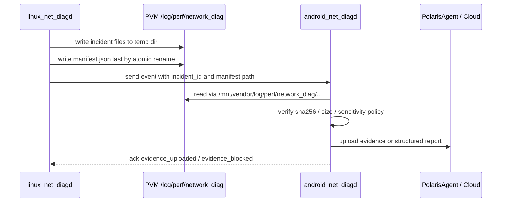
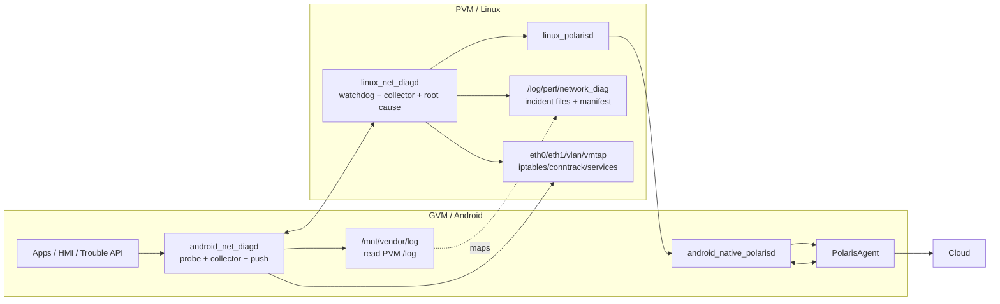
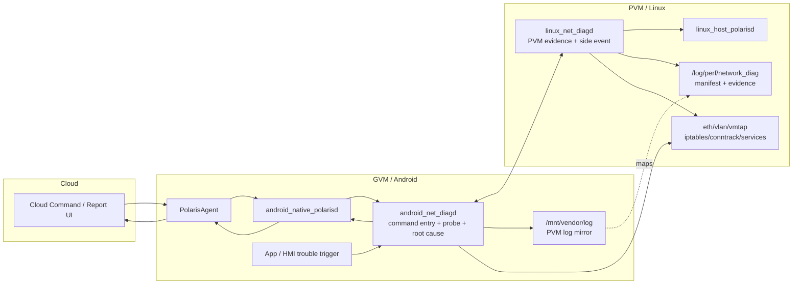
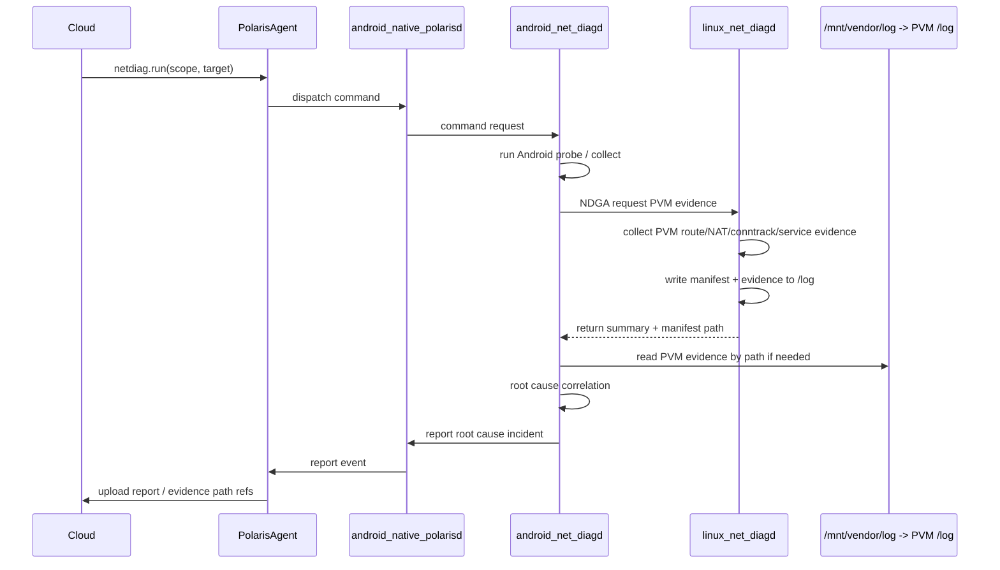
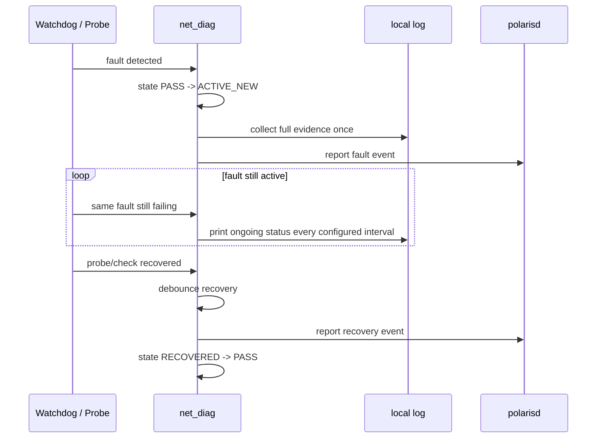

# 智能座舱网络诊断 LLD 评审意见

> 评审对象：`work/network_diagnosis_detailed_design.md`  
> 需求依据：`work/network_diagnosis_requirements.md`  
> 评审日期：2026-05-11  
> 评审视角：网络诊断架构、PVM/GVM 职责划分、主动探测、可验收性

---

## 1. 总体结论

当前 LLD 的 PVM 侧设计较完整，覆盖了物理链路、VLAN、路由、NAT、iptables、conntrack、服务端口和事件聚合。但 GVM 侧设计偏轻，只承担采集、watchdog 和 push，缺少从 Android 真实网络栈发起的主动可达性探测。

从用户体验和故障定位角度看，合理职责应是：

| 侧 | 角色定位 | 主要职责 |
| --- | --- | --- |
| GVM / Android | 用户体验哨兵 | 发现 App 真实出网、DNS、NetId、fwmark、默认网络和业务访问是否可用 |
| PVM / Linux | 网络基础设施权威 | 判断物理链路、VLAN、vmtap、路由、NAT、防火墙、conntrack、PVM-only 服务是否异常 |
| PVM 汇聚器 | 根因归并 | 合并 GVM 症状和 PVM 证据，输出故障域、影响 VLAN、证据和建议 |

因此，本评审的核心建议是：**监控触发和用户感知应前移到 Android，根因闭环和网络权威判断仍保留在 PVM。**

---

## 2. 已澄清项

### 2.1 Markdown 报告由云端生成

需求 `NET-DIAG-RPT-001` 当前写的是“系统应生成 Markdown 格式诊断报告”，而 LLD 明确端侧只输出事件 payload 和 JSON，由云端渲染 Markdown。

经澄清，Markdown 由云端负责，车机端不负责。因此该项不作为 LLD 缺陷，但需要同步修改需求验收口径：

- 车机端：输出结构化 JSON / event payload / 原始证据索引。
- 云端：根据结构化数据生成 Markdown 或 UI 报告。
- 端云接口必须保证 JSON 字段足够覆盖原 Markdown 报告章节，包括摘要、异常列表、拓扑状态、分层诊断、证据、建议和原始证据索引。

### 2.2 实机补充事实

本次评审补充以下实机信息：

1. Android / GVM 侧存在 `/proc/net/stat/nf_conntrack`。
2. PVM 侧不存在 `/proc/net/stat/nf_conntrack`。
3. Android 可通过 `/mnt/vendor/log` 访问 PVM 的 `/log` 分区内容，例如 `dltlog`、`idpslog`、`syslog`、`tuanjie` 等目录。

这两点会影响两个设计判断：

- conntrack 证据必须分 PVM/GVM 两套语义：Android 的 `/proc/net/stat/nf_conntrack` 只能证明 GVM 内核自身 netfilter/conntrack 状态，不能直接替代 PVM NAT 所在内核的 conntrack 统计。
- PVM 取证目录如果落在 `/log` 下，Android 可以通过 `/mnt/vendor/log` 读取并上传，LLD 应显式设计路径映射、权限、SELinux 和脱敏策略。

---

## 3. 阻塞问题

### F1. GVM 缺少主动网络可达性探测机制

**严重级别：P0**

LLD 中 PVM 侧有完整 `ProbeScheduler / IcmpProbe / DnsProbe / GvmPerspectiveProbe / RttBurstProbe`，但 GVM 侧 `android_net_diagd` 只有 watchdog、collector、push，没有独立 probe 模块。

这会导致 Android 用户真实路径问题无法被第一时间发现，例如：

- Android 默认网络异常，但 PVM 自身网络正常。
- NetId / fwmark 选路错误。
- Android resolver / netd 异常。
- GVM 到 PVM vmtap 网关不可达。
- GVM virtio TX/RX 单向异常。
- App 报障时缺少 Android 侧真实路径证据。

**需求影响：**

- `NET-DIAG-VM-002` 要求 PVM/GVM Host-Guest 双向可达。
- `NET-DIAG-VM-003` 要求 GVM 到 `10.10.103/104/106/107/108.1` 可达。
- `NET-DIAG-SVC-001`、`SVC-011` 要验证 GVM 默认互联网和 DNS。
- `TC-NET-006`、`TC-NET-017` 依赖 Android 真实选路和 DNS 证据。

**建议修正：**

在 `android_net_diagd` 增加轻量 probe 子系统：

```text
android_net_diagd
├── probe/
│   ├── GvmProbeScheduler
│   ├── GvmIcmpProbe
│   ├── GvmDnsProbe
│   ├── GvmTcpProbe
│   ├── GvmRouteGetProbe
│   └── ProbeResultPusher
```

最小探测集：

| Probe | 目的 |
| --- | --- |
| `eth0 -> 10.10.200.1` | Host-Guest 控制通道真实 GVM 出向 |
| `eth1.X -> 10.10.X.1` | 每条 Android VLAN 到 PVM vmtap 网关 |
| `eth1.3 -> 172.16.103.20` | 默认互联网/TBOX 网关 |
| `eth1.6/7/8 -> 172.16.106/107/108.20` | ADCU/OTA/ADAS 网关 |
| DNS resolver query | Android resolver/netd 视角 |
| direct UDP/53 query | 排除 resolver 缓存和框架问题 |
| 按需 TCP connect | DoIP/VLM/OTA 等业务端口验证 |

GVM probe 结果应通过 NDGA push 给 PVM，由 PVM 结合 NAT、route、iptables、conntrack 做根因归并。

### F2. PVM 模拟 GVM 视角不能替代 GVM 真实探测

**严重级别：P0**

LLD 设计了 PVM 端 `GvmPerspectiveProbe`，通过 raw socket 伪造 GVM 源 IP。但文档自己也承认该路径不会触发：

- `iif=vmtap1.X` 策略路由；
- `iptables -i vmtap1.X` 入向匹配；
- Android fwmark / NetId；
- Android DNS resolver / netd；
- App 真实默认网络选择。

因此它只能作为 PVM 侧辅助差分手段，不能替代 GVM 主动探测。否则会出现 PVM 模拟 PASS，但 Android 实际 FAIL 的误判。

**建议修正：**

- 保留 `GvmPerspectiveProbe`，但降级为 PVM 侧辅助证据。
- 将 GVM 真实 probe 设为用户体验可达性的主证据。
- 根因判定采用三源合并：
  - Android probe 结果；
  - PVM self probe 结果；
  - PVM NAT/route/iptables/conntrack 证据。

### F3. VM 可达性方向设计不满足需求

**严重级别：P0**

LLD 当前 VM-002/VM-003 主要是 PVM ping GVM：

- PVM ping `10.10.200.40`；
- PVM ping `10.10.10X.40`。

但需求要求：

- PVM `10.10.200.1` 与 GVM `10.10.200.40` 双向可达；
- GVM 到 `10.10.103/104/106/107/108.1` 可达。

**建议修正：**

VM 检查项应拆成双向：

| Check | 探测方向 | 判定 |
| --- | --- | --- |
| `VM-002A` | PVM -> GVM `10.10.200.40` | Host 到 Guest 可达 |
| `VM-002B` | GVM -> PVM `10.10.200.1` | Guest 到 Host 可达 |
| `VM-003A` | PVM -> GVM `10.10.X.40` | PVM 侧 vmtap 到 GVM VLAN |
| `VM-003B` | GVM -> PVM `10.10.X.1` | Android VLAN 到 PVM vmtap 网关 |

### F4. GVM NetId 动态分配与硬编码 fwmark 混用

**严重级别：P0**

LLD 前提写明 Android NetId 与 VLAN 按注册顺序分配，每次启动可变；但部分检查项仍硬编码 `mark 0x10064/0x10067` 等值。

这会导致：

- 车辆重启后 NetId 变化，诊断误报；
- 需求中固定 NetId 100/101/102/103 的验收口径与实机行为冲突；
- App 选路问题无法稳定复现。

**建议修正：**

- 需求中固定 NetId 的描述应修订为“角色到接口/VLAN 的映射必须正确，NetId 数值可动态推断”。
- LLD 所有 SVC/ROUTE 检查禁止硬编码 fwmark，统一使用 `dumpsys connectivity` / `ndc network list` / `ip rule` 动态推导。
- 报告中同时输出：
  - runtime NetId；
  - fwmark；
  - interface；
  - role，如 default / adcu_park / ota / adas。

### F5. PVM-only 隔离检查缺少 GVM route 维度

**严重级别：P0**

需求要求 VLAN 10-14/15/19 若出现在 GVM `ip addr`、GVM route 或 PVM DNAT 规则中，应输出安全告警。

LLD 目前主要检查：

- GVM `ip addr`；
- PVM DNAT。

缺少 GVM route 泄漏检查。例如 GVM 没有 `eth1.10`，但存在到 `172.16.110.0/24` 的异常 route，也应判定为 PVM-only 隔离风险。

**建议修正：**

`BASE-005 / VM-005 / SEC-003` 增加：

- GVM `ip route show table all` 中不得出现 `172.16.110.0/24` 至 `172.16.114.0/24`、`172.16.115.0/24`、`172.16.119.0/24`；
- GVM `ip rule` 不得出现指向 PVM-only VLAN 表的规则；
- PVM 不得存在 PVM-only VLAN 到 GVM 的 DNAT/SNAT。

### F6. conntrack 表满证据需要区分 PVM/GVM 两个内核

**严重级别：P0**

需求要求采集：

- `dmesg` 中 `nf_conntrack: table full`；
- `/proc/net/stat/nf_conntrack` 中 `insert_failed/drop/search_restart`。

实机补充信息表明：

- Android / GVM 侧存在 `/proc/net/stat/nf_conntrack`；
- PVM 侧不存在 `/proc/net/stat/nf_conntrack`。

这说明 LLD 不能笼统写“平台不存在 `/proc/net/stat/nf_conntrack`”。但也不能简单用 Android 侧统计替代 PVM 侧统计，因为当前 NAT、DNAT、SNAT、FORWARD、conntrack 压力的关键故障域在 PVM 内核，Android `/proc/net/stat/nf_conntrack` 只反映 GVM 内核自身 netfilter 状态。

**建议修正：**

LLD 应拆成两个检查项或两个 evidence source：

| 证据 | 所属内核 | 用途 | 判定 |
| --- | --- | --- | --- |
| PVM `nf_conntrack_count/max` | PVM | PVM NAT conntrack 容量压力 | PVM NAT 主证据 |
| PVM journal/dmesg `nf_conntrack: table full` | PVM | PVM conntrack 表满 | PVM FAIL 主证据 |
| PVM `/proc/net/stat/nf_conntrack` | PVM | insert/drop/search_restart | 当前平台 BLOCKED-L1_env |
| GVM `/proc/net/stat/nf_conntrack` | GVM | Android 本机 conntrack 异常 | GVM 辅助证据 |
| GVM resolver/netd/probe 失败 | GVM | 用户侧新连接失败现象 | 症状证据 |

如果需求坚持 `insert_failed > 0` 作为 PVM conntrack 表满验收条件，需要补 PVM 内核替代数据源，例如 tracepoint、netlink 统计、内核配置调整或 vendor 诊断接口。否则应把验收条件改为：

- PVM journal/dmesg 出现 table full；或
- PVM `nf_conntrack_count/max` 达到 FAIL 阈值且 GVM/PVM probe 体现新连接失败；或
- GVM 侧 `/proc/net/stat/nf_conntrack` 仅用于证明 Android 本机 conntrack 异常，不归因为 PVM NAT。

---

## 4. 重要问题

### F7. RTSP/mmhab 边界与验收用例不一致

**严重级别：P1**

需求非目标只排除视频帧内容图像质量分析，并未排除 Camera Server/Client 或 mmhab 通路状态。验收用例 `TC-NET-008` 明确要求：

> RTSP 有流但 GVM 无画面：Camera Server 正常收包，mmhab 异常 -> 网络输入 PASS，视频跨 VM 通道 FAIL。

LLD 当前将 mmhab 视频帧通路完全排除，只终止于 `eth0.15 + Camera Server`，会导致该用例无法闭环。

**建议修正：**

- 网络诊断不分析图像质量；
- 但应采集 Camera Server 到 GVM Camera Client 的通路状态：
  - Camera Server 进程；
  - Camera Client 进程；
  - mmhab channel / buffer / error counter；
  - 最近帧时间戳或健康状态接口。
- 若 RTSP 输入正常但跨 VM 视频通道异常，应输出“视频跨 VM 通道 FAIL，网络输入 PASS”。

### F8. 基线配置仍是示例，不是可实现 LLD

**严重级别：P1**

LLD baseline 多处使用 `// ...` 省略 VLAN、vmtap、GVM 接口、someipd 实例和 NAT 映射。作为详细设计，这些字段应完整、机器可读、可直接进入编码和单元测试。

**建议修正：**

将 §5.3、§5.4 中的省略项全部展开，至少覆盖需求第 11 章的：

- VLAN 3/4/6/7/8/10/11/12/13/14/15/19；
- PVM IP；
- GVM IP；
- vmtap IP；
- 网关；
- 路由表；
- NAT 映射；
- PVM-only 属性；
- 服务端口。

### F9. NAT/SVC 命中计数缺少主动流量刺激源

**严重级别：P1**

需求要求专项连通性测试后 NAT 规则计数应增长。LLD 写了计数增长检查，但没有定义外部流量如何产生。

例如 VLAN 4 DoIP DNAT 需要外部诊断仪访问 `172.16.104.40:13400`，车机内部无法天然构造完全等价的外到内流量。

**建议修正：**

专项诊断应定义三种模式：

| 模式 | 说明 |
| --- | --- |
| passive | 等待外部真实流量，观察 tcpdump 和 iptables counter |
| active-internal | 车机内部可发起的 GVM/PVM 探测 |
| external-assisted | 由诊断仪/测试平台配合发起外部流量 |

若缺少外部流量源，SVC-002/NAT-004 应输出 `BLOCKED-L1_env`，不能误判 FAIL。

### F10. 链路计数器非零 WARN 规则缺失

**严重级别：P1**

需求要求 RX/TX error、dropped、overrun、CRC 等计数器非零需 WARN，持续增长 FAIL。LLD 当前主要定义“两次采样间递增 -> FAIL”，缺少“历史非零但未增长 -> WARN”。

**建议修正：**

判定规则改为：

```text
counter == 0                         -> PASS
counter > 0 && delta == 0             -> WARN(history_nonzero)
counter > 0 && delta > 0 slow_growth  -> WARN
counter > 0 && delta > threshold      -> FAIL
```

报告需区分历史遗留错误和当前持续恶化。

### F11. SHU 粒度不足以支撑按 VLAN 专项诊断

**严重级别：P1**

LLD 总览只有 9 个 SHU，其中 VLAN 10-14 合并为 `SHU_SOMEIP_BUS`，VLAN 19 没有独立 SHU。需求要求按 VLAN 专项诊断覆盖 VLAN 3/4/6/7/8/10-14/15/19，并对 PVM-only VLAN 明确说明。

**建议修正：**

保留业务 SHU，但增加 VLAN 维度的诊断单元：

- `VLAN_10_SOMEIP`
- `VLAN_11_SOMEIP`
- `VLAN_12_SOMEIP`
- `VLAN_13_SOMEIP`
- `VLAN_14_SOMEIP_NTP`
- `VLAN_15_RTSP`
- `VLAN_19_SOMEIP_BIGDATA`

业务报告可以聚合展示，但专项诊断必须能输出每个 VLAN 的独立状态。

### F12. Android 可读 PVM `/log` 的能力未纳入取证链路

**严重级别：P1**

实机显示 Android 可通过 `/mnt/vendor/log` 访问 PVM `/log` 分区内容。LLD 当前设计了 PVM 本地 incident 目录和 `fetch_log` 分块协议，但没有把这个共享日志路径作为云端上传和降级取证路径固化。

这会影响：

- PVM polarisd 或 VSOCK 通道异常时，GVM 仍可能通过 `/mnt/vendor/log` 读取 PVM 已落盘证据；
- 云出口在 GVM PolarisAgent 时，可以减少二次传输和 fetch_log 协议复杂度；
- PVM `/log/perf/network_diag` 的权限、SELinux label、脱敏和保留策略必须同时满足 PVM 写入与 GVM 读取。

**建议修正：**

LLD 增加路径映射：

| PVM 路径 | GVM 访问路径 | 用途 |
| --- | --- | --- |
| `/log/perf/network_diag/incidents` | `/mnt/vendor/log/perf/network_diag/incidents` | incident 证据目录 |
| `/log/perf/network_diag/snaps` | `/mnt/vendor/log/perf/network_diag/snaps` | 周期快照 |
| `/log/perf/network_diag/probes` | `/mnt/vendor/log/perf/network_diag/probes` | probe JSONL |
| `/log/syslog` | `/mnt/vendor/log/syslog` | PVM syslog / kernel log 辅助证据 |

同时应规定：

- PVM 写入文件使用原子 rename，避免 Android 读到半文件；
- `manifest.json` 最后落盘，作为 Android 判定 incident 完整性的提交点；
- 目录权限建议使用专用 group 或 SELinux label，不依赖 `0777`；
- Android 只读访问 PVM 取证目录，不应修改或删除 PVM 日志；
- 上云前仍执行敏感字段脱敏。

### F13. PVM 不应通过 VSOCK 向 GVM 传输大文件内容

**严重级别：P0**

LLD 当前存在 `fetch_log` 分块协议思路，但结合实机能力，PVM 不应该直接通过 VSOCK 向 GVM 发送大文件内容。VSOCK 应作为控制面，只传事件、manifest、路径、hash、大小、权限和状态，不承载 pcap、完整命令输出、长日志等大块数据。

原因：

- 大文件走 VSOCK 会和诊断 RPC、heartbeat、GVM alert 共用控制通道，故障高峰时容易阻塞控制面；
- 取证文件已经落在 PVM `/log`，Android 可通过 `/mnt/vendor/log` 读取，没有必要二次搬运；
- 云出口在 GVM，GVM 可以按路径读取、脱敏、压缩、上传；
- 大文件传输失败时，路径 + manifest 模式更容易断点续传和校验完整性。

**建议修正：**

- 删除或收缩 `fetch_log` 的“大文件内容分块传输”定位。
- NDGA / polaris 只传 `incident_id`、`manifest_path`、`pvm_path`、`gvm_path`、`sha256`、`size`、`sensitivity`。
- GVM 通过 `/mnt/vendor/log/...` 读取 PVM 落盘证据。
- 若 GVM 无权限读取，则事件标记 `evidence_access=BLOCKED`，不回退为 VSOCK 大文件传输。
- 小型结构化摘要可以随事件上报，但应设置硬上限，例如单事件 payload 不超过 64 KiB。

推荐时序：



### F14. 每个需求缺少 Mermaid 时序图

**严重级别：P1（LLD 完整性阻塞）**

LLD 当前有架构图、模块划分和追踪矩阵，但没有做到“每个需求一张可执行理解的交互时序图”。网络诊断是跨 PVM、GVM、polaris、App、外部 ECU/网关的系统，只有检查项表格不足以指导编码和集成测试。

**建议修正：**

每个 `NET-DIAG-*` 需求都应在详细设计中补 Mermaid `sequenceDiagram`。如果多个需求确实共享同一条流程，可以复用同一张图，但追踪矩阵必须明确列出：

```text
需求 ID -> 时序图 ID -> 参与方 -> 触发条件 -> 输出事件 -> 验收用例
```

建议图编号：

| 需求类型 | 图 ID 示例 |
| --- | --- |
| 模式 | `SEQ-MODE-001` |
| 基线 | `SEQ-BASE-001` |
| 链路 | `SEQ-LINK-001` |
| VLAN | `SEQ-VLAN-001` |
| 路由 | `SEQ-ROUTE-001` |
| NAT/FW | `SEQ-NAT-001` / `SEQ-FW-001` |
| VM | `SEQ-VM-001` |
| 业务 | `SEQ-SVC-001` |
| 端口 | `SEQ-PORT-001` |
| 性能 | `SEQ-PERF-001` |
| 安全 | `SEQ-SEC-001` |
| 报告/取证 | `SEQ-RPT-001` |

最低要求：

- 每个需求至少覆盖正常路径、异常路径和 BLOCKED 降级路径。
- 每张图必须画出 PVM/GVM 谁触发、谁采集、谁归因、谁上报。
- 涉及大文件取证的图必须采用“传路径，不传文件内容”的模式。
- 涉及 Android 用户体验的图必须包含 GVM 主动 probe 或 App 报障触发。

### F15. LLD 缺少组件图，且 PVM diag 与 linux polarisd 的双向通道设计过重

**严重级别：P0**

LLD 当前有 ASCII 进程拓扑和通道说明，但缺少正式组件图。作为详细设计，组件图应明确：

- PVM 侧组件边界；
- GVM 侧组件边界；
- polaris 相关组件边界；
- 控制面、事件面、取证文件面的方向；
- 哪些通道承载命令，哪些通道只承载事件，哪些通道只传路径。

同时，当前 LLD 把通道 C 设计为 `PVM_polarisd ↔ PVM_diag` 双向 UDS，包含：

- polarisd -> diag：`CMD_REQ`；
- diag -> polarisd：`CMD_RESP`；
- diag -> polarisd：`POLARIS_EVENT`。

这个设计的直接原因是 LLD 额外引入了“云命令下发”路径：云端命令经 GVM/PVM polarisd 转发到 PVM diag。但从当前诊断需求和简化集成角度看，PVM diag 与 linux host polarisd 之间通常只需要 **PVM diag -> polarisd 的单向 report event 通道**。

**评审意见：**

除非产品明确要求“云端直接向 PVM diag 下发诊断命令，并且必须经 PVM polarisd 转发”，否则不应把 PVM diag 与 linux polarisd 设计成业务双向通道。

建议职责收敛为：

| 通道 | 方向 | 用途 |
| --- | --- | --- |
| PVM diag -> linux polarisd | 单向 | 上报结构化事件、incident manifest 路径、摘要 |
| GVM diag <-> PVM diag NDGA | 双向 | GVM 主动 probe 结果、PVM/GVM 协同采集、Android 触发的诊断命令 |
| GVM / Cloud -> GVM diag | 双向或平台既有机制 | 云端或 App 发起诊断请求 |
| GVM -> `/mnt/vendor/log` | 文件读取 | 按路径读取 PVM `/log` 取证文件 |

这样可以删除或降级以下设计复杂度：

- `PVM polarisd NetdiagBridgeAction`；
- `polaris_command_listener_register` SDK 扩展；
- PVM polarisd -> PVM diag 的命令协议；
- PVM diag 处理来自 polarisd 的命令鉴权、超时、并发、响应状态机。

需要保留的只是事件上报可靠性。实现上可以是单向业务语义，但允许传输层有 ACK：

- `report_event(event, manifest_path)`；
- polarisd 返回 delivery ACK / error code；
- ACK 只表示接收状态，不承载诊断命令。

推荐组件图：



图中 `PDiag --> PPolaris` 是 report event 单向业务通道；GVM/PVM 协同命令和 probe 走 `GDiag <--> PDiag`，不经 linux polarisd 反向进入 PVM diag。

### F16. 云命令入口和根因归因放到 Android net_diag 更合理，但需要分层上报与降级策略

**严重级别：P0**

评审意见：该调整方向总体更合理。

建议架构为：

```text
Cloud command
  -> PolarisAgent
  -> android_native_polarisd / Android API
  -> android_net_diagd
  -> linux_net_diagd

Root cause report
  <- android_net_diagd 汇总 PVM/GVM 证据
  <- android_native_polarisd
  <- PolarisAgent
  <- Cloud
```

这样做的优点：

- Android 更贴近用户，适合作为云端命令入口和用户体验归因中心；
- PVM 不需要接收 linux polarisd 反向命令，PVM diag 与 linux polarisd 可以保持单向 report event；
- 云端命令、App 报障、Android 主动 probe 都在 Android net_diag 汇聚，模型更一致；
- Android 可通过 `/mnt/vendor/log` 按路径读取 PVM `/log` 证据，避免 PVM 通过 VSOCK 传大文件；
- PVM 继续保留底层网络权威诊断能力，负责物理链路、VLAN、iptables、conntrack、PVM-only 服务等证据。

但该方案必须明确两类上报，否则会重复、乱序或丢根因：

| 上报类型 | 上报方 | 目的 | 是否用户最终告警 |
| --- | --- | --- | --- |
| side event / raw event | PVM diag -> linux host polarisd；Android diag -> android native polarisd | 保留本侧监控事实和故障生存能力 | 默认不是最终根因，可降噪 |
| root cause incident | Android net_diag -> android native polarisd | 汇总 PVM/GVM 证据后的最终归因 | 是主要用户/云端告警 |

因此，“PVM 和 GVM 分开上报”应理解为**分开上报本侧事实**，而不是两个侧各自独立输出最终根因。最终根因建议由 Android net_diag 在正常路径下统一生成。

推荐组件图：



推荐云命令时序：



必须补充的约束：

- PVM side event 必须带 `source=pvm`、`event_class=side_event`、`correlation_id`、`manifest_path`。
- Android side event 必须带 `source=gvm`、`event_class=side_event`、`correlation_id`。
- Android root cause incident 必须带 `event_class=root_cause`，并引用 PVM/GVM side event ID。
- 云端应以 `root_cause` 为主告警，对同一 `correlation_id` 的 side event 做折叠展示。
- 当 Android net_diag、GVM 或 NDGA 不可用时，PVM diag 必须仍能通过 linux host polarisd 上报 PVM-only 或 hypervisor 级故障，状态标记为 `root_cause_degraded`。
- 当 PVM diag 不可达时，Android net_diag 可输出 Android 侧结论，但必须标记 `pvm_evidence=BLOCKED`，不能伪造 PVM 根因。

结论：**正常路径下，归因放在 Android net_diag 更合理；异常路径下，PVM diag 仍需具备独立 side event 与降级根因上报能力。**

### F17. 持续故障期间不应反复取证，应改为周期日志和恢复事件

**严重级别：P0**

LLD 当前强调 incident 触发后的采集、probe burst、incident_dir 写盘和上报，但需要明确：**同一故障未恢复期间不应持续重复取证**。否则在链路长期 down、网关长期不可达、conntrack 长期高压等场景下，会造成日志/存储膨胀、CPU/IO 占用增加，以及云端重复告警。

建议增加故障状态机：

```text
PASS
  -> ACTIVE_NEW       首次检测到故障，执行一次完整取证并上报 fault event
  -> ACTIVE_ONGOING   故障仍未恢复，不再重复取证，仅周期打印状态 log
  -> RECOVERED        故障恢复，执行轻量复核并上报 recovery event
  -> PASS
```

建议策略：

| 阶段 | 行为 |
| --- | --- |
| 首次故障 | 完整取证一次，写 incident manifest，发送 fault event |
| 故障持续 | 不重复 tcpdump、不重复全量命令、不重复 incident_dir；每隔 `ongoing_log_interval_sec` 打印一条状态 log，默认 60s，可配置 |
| 故障变化 | 如果根因、影响 VLAN、severity、关键证据发生变化，允许追加一次 delta evidence |
| 故障恢复 | debounce 后发送 recovery event，记录持续时间和最后状态 |

推荐配置：

```json
{
  "incident_policy": {
    "evidence_once_per_fault": true,
    "ongoing_log_interval_sec": 60,
    "recovery_debounce_sec": 5,
    "delta_evidence_on_root_change": true,
    "max_evidence_per_fault": 2
  }
}
```

推荐时序：



恢复事件至少应包含：

- `correlation_id`；
- `fault_id`；
- `status=recovered`；
- `duration_ms`；
- `recover_ts_boot_ms`；
- `last_severity`；
- `source=pvm/gvm/android_root`。

### F18. polaris 事件 JSON 必须满足 726 字节硬上限

**严重级别：P0**

新增硬约束：

- PVM diag 上报到 linux host polarisd 的事件 JSON 不能超过 726 字节。
- Android net_diag 上报到 android native polarisd 的事件 JSON 不能超过 726 字节。

这会影响 LLD 中所有 event payload、side event、root cause incident、recovery event 的字段设计。当前 LLD 的事件 payload 示例包含大量字符串、证据摘要和派生事件列表，明显不适合直接作为 polaris 事件体。

**建议修正：**

将 polaris 事件拆成“小事件 + 路径证据”：

| 内容 | 放入 726 字节事件 JSON | 放入 manifest / evidence 文件 |
| --- | --- | --- |
| event id / class / severity | 是 | 可重复 |
| source / status / check id | 是 | 可重复 |
| correlation id / fault id | 是，建议短 ID | 是 |
| manifest path | 是，使用短路径或 path id | 是 |
| 详细 evidence | 否 | 是 |
| suggestion / recheck cmd | 否 | 是 |
| 长 interface 列表 / derived events | 否 | 是 |
| tcpdump / command output | 否 | 是 |

推荐紧凑字段：

```json
{
  "v":1,
  "src":"pvm",
  "cls":"side",
  "st":"fail",
  "fid":"a1b2c3d4",
  "cid":"9e8f7a6b",
  "chk":"L4N001",
  "sev":3,
  "tsb":123456789,
  "dur":0,
  "mp":"i/20260511/a1b2/manifest.json"
}
```

字段建议：

| 字段 | 含义 |
| --- | --- |
| `v` | schema version |
| `src` | `pvm` / `gvm` / `and` |
| `cls` | `side` / `root` / `recov` |
| `st` | `fail` / `warn` / `blocked` / `recovered` |
| `fid` | fault id，短 hash |
| `cid` | correlation id，短 hash |
| `chk` | check id 短码 |
| `sev` | severity 数字枚举 |
| `tsb` | boot time ms |
| `dur` | recovered 时的持续时长 ms |
| `mp` | manifest path 或 manifest path id |

实现要求：

- JSON 必须按 UTF-8 序列化后计算字节数，而不是字符数。
- 发送前执行 `len(json_bytes) <= 726` 校验。
- 超限时按优先级删除可选字段，不能截断 JSON。
- 字段名使用短名；长文本、建议、证据、命令输出全部放 manifest。
- root cause event 也必须小于 726 字节；详细根因树放 evidence JSON。
- 单元测试必须包含 PVM side event、Android side event、Android root cause、recovery event 的最大长度用例。

---

## 5. 次要问题

### F19. RTSP 地址拼写错误

`SHU_VLAN15_RTSP` 中写的是 `173.16.115.98`，需求和基线中应为 `172.16.115.98`。

### F20. 命令白名单含 shell 管道/重定向写法

GVM 命令白名单中出现 `dumpsys connectivity 2>&1 | head -200`。若 CommandRunner 设计为非 shell exec，则该命令不可执行；若允许 shell，则只读白名单和参数审计复杂度上升。

建议：

- CommandRunner 默认禁止 shell；
- `head -200` 改由程序内部截断输出；
- stderr 捕获由 `posix_spawn`/pipe 实现，不通过 `2>&1`。

### F21. 测试用例“照搬需求”但实际有偏差

LLD 测试章节写“照搬需求 §13”，但实际对部分用例加了“60s 后改 30s”等未落地描述。建议将测试表改成明确的：

- v1 必须满足；
- v1 降级；
- v2 候选；
- 需要外部设备配合。

---

## 6. 建议补充的 Android 主动探测设计

### 6.1 GVM ProbeScheduler

```text
GvmProbeScheduler
├── normal interval: 60s
├── alert burst: 5 packets / 1s
├── app trouble trigger: immediate
├── token bucket: <= 20 pps
└── push result to PVM via NDGA
```

### 6.2 GVM 探测目标

| 业务 | GVM 探测 | 预期 |
| --- | --- | --- |
| Host-Guest | `eth0 -> 10.10.200.1` | 可达 |
| VLAN 3 默认互联网 | `eth1.3 -> 10.10.103.1`、`172.16.103.20`、DNS | 可达 |
| VLAN 4 诊断 | `eth1.4 -> 10.10.104.1`，本地 DoIP listen | 可达 / 监听存在 |
| VLAN 6 泊车 | `eth1.6 -> 10.10.106.1`、`172.16.106.20` | 可达 |
| VLAN 7 OTA | `eth1.7 -> 10.10.107.1`、`172.16.107.20` | 可达 |
| VLAN 8 ADAS | `eth1.8 -> 10.10.108.1`、`172.16.108.20` | 可达 |
| DNS | Android resolver query + direct UDP/53 | 区分 resolver 与链路 |

### 6.3 GVM 上报字段

```json
{
  "type": "gvm_probe_result",
  "boot_id": "...",
  "ts_boot_ms": 123456,
  "net_role": "default",
  "runtime_netid": 102,
  "fwmark": "0x10066",
  "iface": "eth1.3",
  "src_ip": "10.10.103.40",
  "target": "172.16.103.20",
  "probe_type": "icmp",
  "loss_pct": 0,
  "rtt_p95_ms": 2.1,
  "verdict": "PASS",
  "evidence_ref": "gvm/probes/..."
}
```

### 6.4 根因归并示例

| GVM probe | PVM self probe | PVM NAT/route | 结论 |
| --- | --- | --- | --- |
| FAIL 到 `10.10.103.1` | PASS | 正常 | virtio/vmtap/GVM VLAN 问题 |
| PASS 到 `10.10.103.1`，FAIL 到 `172.16.103.20` | PVM 到网关 PASS | NAT/forward/rp_filter 异常 | PVM 转发路径问题 |
| FAIL 到 DNS，ICMP 外网 PASS | PVM NAT 正常 | DNS 53 无响应或 resolver 异常 | DNS/netd/上游 DNS |
| GVM/PVM 都 FAIL 到网关 | ARP FAILED 或 link down | 无 | L1/L2/网关问题 |

---

## 7. 修订优先级建议

1. P0：补 GVM 主动 probe 子系统。
2. P0：修正 VM 双向可达性检查。
3. P0：统一 NetId/fwmark 动态推断口径，消除硬编码 mark。
4. P0：补 PVM-only GVM route 泄漏检查。
5. P0：按 PVM/GVM 两个内核拆分 conntrack 证据，明确 PVM `/proc/net/stat/nf_conntrack` 缺失时的替代验收。
6. P0：禁止 PVM 通过 VSOCK 向 GVM 传大文件内容，改为 manifest/path 模式。
7. P0：补组件图，并将 PVM diag 与 linux polarisd 收敛为单向 report event 通道，除非明确需要云命令经 PVM polarisd 下发。
8. P0：将云命令入口和最终根因归因放到 Android net_diag，同时定义 PVM/GVM side event 与 root cause incident 的关联、去重和降级规则。
9. P0：增加持续故障状态机，首次故障只取证一次，持续期间按可配置周期打印 log，恢复后上报 recovery event。
10. P0：所有 PVM->linux polarisd、Android net_diag->android polarisd 事件 JSON 必须小于等于 726 字节，详细信息全部走 manifest/evidence。
11. P1：把 Android `/mnt/vendor/log` 读取 PVM `/log` 的能力纳入取证链路。
12. P1：为每个 `NET-DIAG-*` 需求补 Mermaid 时序图，并在追踪矩阵中关联。
13. P1：补 RTSP/mmhab 健康状态边界。
14. P1：展开完整 baseline，不使用省略号。
15. P1：定义 NAT/SVC 专项诊断的外部流量刺激和 BLOCKED 条件。
16. P1：完善链路计数器 WARN/FAIL 判定。
17. P2：修正地址拼写、命令白名单 shell 写法和测试用例状态。

---

## 8. 结论

LLD 的 PVM 基础设施诊断设计方向正确，但整体偏“PVM 中心化”。考虑 Android 更贴近用户，当前方案需要补齐 GVM 主动探测层，否则无法可靠发现用户侧真实网络不可用，也无法满足双向可达、DNS、NetId/fwmark、App 报障等需求。

建议将架构调整为：

```text
Android/GVM 主动发现症状
        ↓
PVM 汇聚 GVM 症状 + PVM 基础设施证据
        ↓
输出根因、影响 VLAN、证据、建议和云端可渲染 JSON
```

这样才能同时满足用户体验监控、底层网络定位和端云报告闭环。
