# 智能座舱网络诊断 — 详细设计（最终交付版）

| | |
|---|---|
| **文档名** | 智能座舱网络诊断详细设计 |
| **文件名** | `network_diagnosis_final_design.md` |
| **版本** | 1.0 |
| **日期** | 2026-05-11 |
| **平台** | SA8397 智能座舱 — PVM Linux 6.6.110-rt61 PREEMPT_RT + GVM Android（qcrosvm Hypervisor） |
| **架构方案** | 方案 E（专用 VSOCK + PVM 单一事件出口 + GVM 轻量采集 + 共享挂载 + 紧凑 polaris 事件）|

---

## 目录

1. 文档说明
2. 系统上下文
3. 总体架构
4. 设计决策汇总
5. 进程详细设计
6. 通信协议详细设计
7. 配置与基线
8. 故障模型（Fault Model）
9. 事件设计
10. 检查项 Registry
11. SHU 设计
12. Watchdog 设计
13. Probe 设计
14. 采集器设计
15. 取证目录
16. 时钟与时序
17. 维护模式与可观测性
18. 安全设计
19. 性能评估
20. 风险与降级
21. 代码结构
22. 接口设计
23. 部署设计
24. 时序图集
25. 测试用例
26. 需求追踪矩阵
27. 未决项与下一步
- 附录 A 术语表与缩写
- 附录 B 配置附件路径汇总
- 附录 C 事件 ID 完整列表
- 附录 D 文档约定

---

## 1. 文档说明

### 1.1 目的与范围

本文档是智能座舱网络诊断模块的**详细设计正本**，是编码、单元测试、集成测试、部署、运维的权威依据。

**范围内**：
- PVM/GVM 两进程的代码结构、接口、协议
- 5 个共享配置附件的 schema
- 端到端诊断流程（巡检 / 故障感知 / 上报 / 取证 / 跨端协作）
- 性能预算与 30s SLA
- 与 polaris 生态的对接接口
- 与 PolarisAgent / Cloud 的事件链路

**范围外**：
- mmhab 视频帧通路（终止于 PVM Camera Server 进程存活 + RTSP 输入侧链路；后段由 Camera 团队接口提供）
- polarisd 内部实现（仅约束对外接口）
- 云端事件渲染与展示（端侧仅产生结构化事件 JSON）
- 第三方 ECU 内部故障诊断
- IDS/IPS 深度入侵检测

### 1.2 读者画像

| 读者 | 重点章节 |
|---|---|
| 架构师 | §2、§3、§4、§8、§9 |
| C++ 开发者 | §5、§6、§10-§15、§21、§22、§24 |
| 测试工程师 | §10、§19、§24、§25、§26 |
| 部署/运维 | §15、§17、§20、§23 |
| polaris 团队 | §6、§22.1、§27 |
| 平台/网络团队 | §7、附录 B |

### 1.3 文档约定

| 约定 | 说明 |
|---|---|
| 字段名 `lower_snake_case` | JSON / 配置字段统一 |
| 类型名 `PascalCase` | C++ 类、namespace、enum |
| 成员变量 `member_` 下划线后缀 | 与 polaris 现有代码保持一致 |
| 常量 `kLowerCamelCase` | static constexpr 风格 |
| 接口前缀 `I` | `IEventSink` / `IFaultListener` 等抽象接口 |
| 时序图编号 `SEQ-NN` | 见 §24 |
| 检查项编号 `Lx-CAT-NNN` | L 层 - 类别 - 序号；如 `L4-NAT-001` |
| 事件 ID 段位 `0x4E5E_xxxx` | 占位，待 polaris 团队最终分配 |
| 中文注释 | C++ 代码示例中中文注释允许（与 polaris 现有代码一致） |
| 路径 `/log/perf/...` | PVM 自建目录，GVM 通过 `/mnt/vendor/log/...` 镜像访问 |

### 1.4 参考文档

| 文档 | 用途 |
|---|---|
| `network_diagnosis_requirements.md` | 需求来源（84 项 NET-DIAG-*）|
| `network_topology.md` | 拓扑基线（VLAN/IP/服务）|
| `network_diagnosis_sys_design.md` | 系统设计（HLD）|
| `network_diagnosis_detailed_design.md` | **决策推导历史**（v1.0/v1.1 演进、B 系列讨论、review 修订）|
| `baseline-pvm.json` | 附件 1 — PVM 拓扑基线 |
| `baseline-gvm.json` | 附件 2 — GVM 拓扑基线 |
| `fault_class_dict.json` | 附件 3 — 故障类字典 |
| `fault_causation_graph.json` | 附件 4 — 因果依赖图 |
| `scenario-registry.json` | 附件 5 — 业务场景注册表 |

### 1.5 版本

| 版本 | 日期 | 变更摘要 |
|---|---|---|
| 1.0 | 2026-05-11 | 首次正式发布，基于 detailed_design v1.1 整理为最终交付版 |

---

## 2. 系统上下文

### 2.1 业务背景

SA8397 智能座舱采用 **PVM/GVM 双虚拟机架构**：

- **PVM**（Privileged VM）：Linux 6.6.110-rt61 PREEMPT_RT，直接持有所有物理网卡 `eth0/eth1`，承担物理 VLAN、L3 路由、iptables NAT、防火墙、PVM-only 业务（IDPS / someipd / Camera Server）
- **GVM**（Guest VM）：Android（qcrosvm Hypervisor），通过 virtio-net 看到 `eth0/eth1.X`，运行 HMI、地图、媒体、诊断、用户 App

车载网络通过 12 条 VLAN 分担业务：

| VLAN | 业务 | GVM 可见 |
|---|---|---|
| 3 | 默认互联网/TBOX | ✓ |
| 4 | 诊断 + IDPS 旁路 | ✓（DoIP/VLM/gftpd）|
| 6 | ADCU 泊车/APA | ✓ |
| 7 | OTA/远程诊断 | ✓ |
| 8 | ADAS Internet | ✓ |
| 10-14 | SOME/IP 服务总线 + NTP | ✗（PVM-only）|
| 15 | ADCU FWC RTSP 视频 | ✗（mmhab 旁路）|
| 19 | ADCU A2 SOME/IP 大数据 | ✗（PVM-only）|

网络诊断模块的核心任务：**实时感知任一 VLAN 在 L1-L5 任一层的故障，准确归因，通过 polaris 链路上报云端**。

### 2.2 系统边界

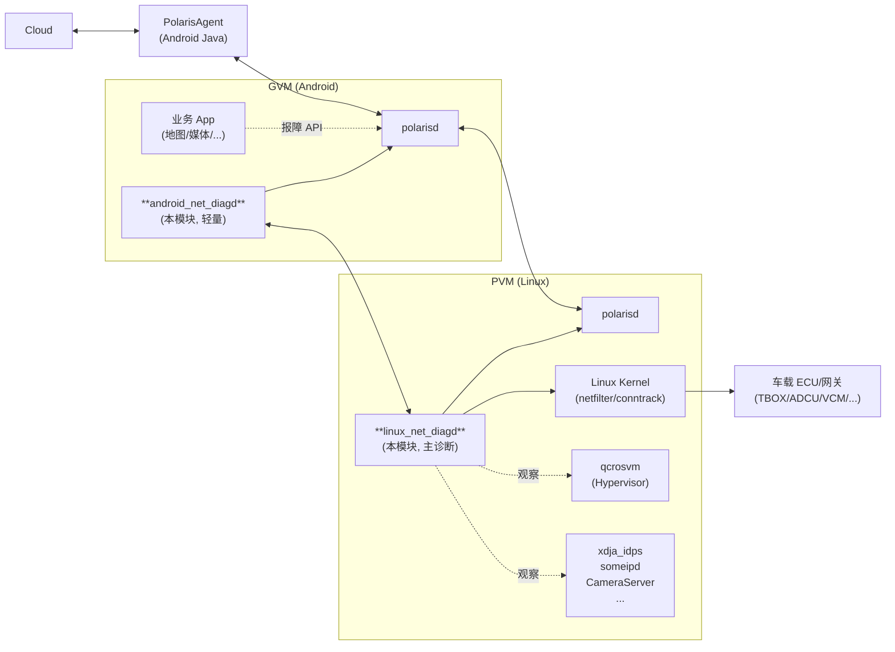
```mermaid
flowchart LR
    Cloud["Cloud"]
    Agent["PolarisAgent\n(Android Java)"]

    subgraph GVM["GVM (Android)"]
        AndroidApp["业务 App\n(地图/媒体/...)"]
        GVMPolarisd["polarisd"]
        GVMDiag["**android_net_diagd**\n(本模块, 轻量)"]
    end

    subgraph PVM["PVM (Linux)"]
        PVMPolarisd["polarisd"]
        PVMDiag["**linux_net_diagd**\n(本模块, 主诊断)"]
        Kernel["Linux Kernel\n(netfilter/conntrack)"]
        QcrosVM["qcrosvm\n(Hypervisor)"]
        OtherSvc["xdja_idps\nsomeipd\nCameraServer\n..."]
    end

    ECU["车载 ECU/网关\n(TBOX/ADCU/VCM/...)"]

    Cloud <--> Agent
    Agent <--> GVMPolarisd
    AndroidApp -.报障 API.-> GVMPolarisd
    GVMDiag --> GVMPolarisd
    GVMPolarisd <--> PVMPolarisd
    PVMDiag --> PVMPolarisd
    GVMDiag <--> PVMDiag
    PVMDiag --> Kernel
    PVMDiag -.观察.-> OtherSvc
    PVMDiag -.观察.-> QcrosVM
    Kernel --> ECU
```

**与外部系统的接口**：

| 系统 | 接口 | 用途 |
|---|---|---|
| polarisd (PVM/GVM) | UDS `report_event` API | 事件出口 |
| polarisd VSOCK 9001 | 现有 PLP 协议 | 跨 VM 事件传输（PVM→GVM）+ 命令（GVM→PVM）|
| PolarisAgent | Java API 调 polarisd | 云命令入口、事件出云 |
| Cloud | polaris 上行通道 | 接收事件 + 下发命令 |
| Linux Kernel | netlink / sysfs / proc | watchdog 信号源 |
| Android Framework | ConnectivityService callback | GVM watchdog 信号 |
| Camera Server | （未来）健康状态接口 | mmhab 通路状态（v2）|

### 2.3 设计目标

| 目标 ID | 描述 | 验收 |
|---|---|---|
| G1 | 实时感知 | 物理/规则类故障 ≤ 5s；端到端可达性 30s SLA |
| G2 | 端到端可定位 | 分层（L1-L5 + 虚拟化 + 性能 + 安全）输出根因 |
| G3 | 业务可用性视角 | 每个 SHU 给出 PASS/WARN/FAIL/BLOCKED 业务级结论 |
| G4 | 可追溯 | 每个故障 incident 完整证据链 + manifest 索引 |
| G5 | 安全可控 | 全链路只读命令白名单 + 抓包限时 + 不改配置 |
| G6 | 工程可维护 | 配置驱动（baseline / check / SHU / scenario 全部配置化）|
| G7 | 跨端可关联 | fault_id 双端独立可算，云端按 fault_id 自动折叠 |
| G8 | 不依赖应用 | "上行通下行不通"类故障靠内核 netfilter 状态自感知 |
| G9 | 不灌爆 polaris | 30s 因果聚合 + 条件发 side + 持续故障不重复取证 |
| G10 | 适配生产环境 | userdebug/user 镜像权限差异由 BLOCKED 分级承接 |

### 2.4 设计约束（C1-C9）

| ID | 约束 | 影响 |
|---|---|---|
| **C1** 只读 | 诊断模块绝不修改网络配置 | 命令白名单、参数校验、运行时审计 |
| **C2** RT 让权 | PREEMPT_RT 下不阻塞实时任务 | Nice=10，IO best-effort，长操作分片 |
| **C3** 单一出口 | 所有事件经 PVM polarisd 出云 | 通道 C 必备 |
| **C4** VSOCK 自洽 | 控制面不依赖被诊断的 IP 网络 | 通道 A 9101 + 通道 B 9001 都基于 VSOCK |
| **C5** 故障独立 | 单组件挂掉不阻塞其他事件 | 各 watchdog 独立线程；进程崩溃自重启；fallback 路径 |
| **C6** Boot Warmup | 开机首 120s 默认 INFO 不告警 | 全局 warmup 期 + 每信号 warmup_sec；硬故障例外 |
| **C7** 时钟规则 | 内部状态机用 `CLOCK_BOOTTIME`；事件含 `boot_id` + `ts_boot` + `ts_unix` 三字段 | NTP 跳变不混乱 |
| **C8** 因果聚合 | 单一物理故障产生根+派生事件清单，不灌爆 polaris | 30s 窗口 + 优先级表 + IncidentDeduper |
| **C9** BLOCKED 分级 | L1_env（环境性）/ L2_anomaly（异常）/ L3_intermittent（间歇）| 避免环境性 BLOCKED 误判 |

### 2.5 非功能性需求

| 维度 | 指标 |
|---|---|
| **常态 CPU** | ≤ 1%（单核），含轻量巡检 + watchdog + probe |
| **异常态 CPU 峰值** | ≤ 5%（单核），incident 处理期 1-2 秒峰值 |
| **内存 RSS** | PVM ≤ 64 MB；GVM ≤ 32 MB；进程 MemoryMax=128M（PVM）|
| **网络流量** | probe 总 pps ≤ 100；tcpdump 限时 10s 限包 2000 |
| **取证存储** | PVM/GVM 各 ≤ 200 MB；retention 7 天 / 50 incidents |
| **polaris 事件预算** | 单次启动 boot 早期 ≤ 500 条（mOfflineCache 容量）|
| **本地落盘延迟** | incident_dir 写入 ≤ 1 秒（异常态）|
| **事件 payload 上限** | ≤ 726 字节（PolarisAgent 上云硬约束）|
| **30s SLA** | 本地闭环（GVM 触发到 PVM 写盘）≤ 15s；含云端 RTT ≤ 30s（P95） |

---

## 3. 总体架构

### 3.1 部署架构

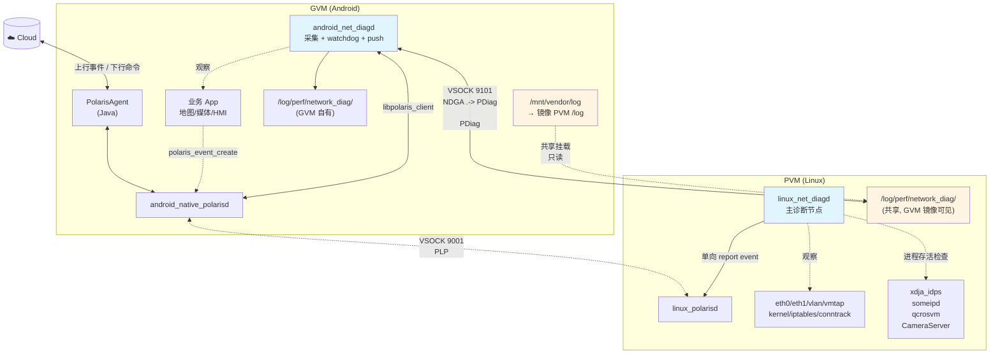
```mermaid
flowchart TD
    Cloud[("☁️ Cloud")]

    subgraph GVM_BOX["GVM (Android)"]
        App["业务 App\n地图/媒体/HMI"]
        PA["PolarisAgent\n(Java)"]
        GPolarisd["android_native_polarisd"]
        GDiag["android_net_diagd\n采集 + watchdog + push"]
        GLog["/log/perf/network_diag/\n(GVM 自有)"]
        MVL["/mnt/vendor/log\n→ 镜像 PVM /log"]
    end

    subgraph PVM_BOX["PVM (Linux)"]
        PPolarisd["linux_polarisd"]
        PDiag["linux_net_diagd\n主诊断节点"]
        PLog["/log/perf/network_diag/\n(共享, GVM 镜像可见)"]
        Net["eth0/eth1/vlan/vmtap\nkernel/iptables/conntrack"]
        OtherProcs["xdja_idps\nsomeipd\nqcrosvm\nCameraServer"]
    end

    Cloud <-- 上行事件 / 下行命令 --> PA
    PA <--> GPolarisd
    App -. polaris_event_create .-> GPolarisd
    GDiag <-- libpolaris_client --> GPolarisd
    GPolarisd <-. VSOCK 9001\nPLP .-> PPolarisd
    PDiag -- 单向 report event --> PPolarisd
    GDiag <-- VSOCK 9101\nNDGA .-> PDiag

    PDiag --> PLog
    GDiag --> GLog
    MVL -. 共享挂载\n只读 .-> PLog

    PDiag -. 观察 .-> Net
    PDiag -. 进程存活检查 .-> OtherProcs
    GDiag -. 观察 .-> App

    style PDiag fill:#e1f5ff
    style GDiag fill:#e1f5ff
    style PLog fill:#fff4e1
    style MVL fill:#fff4e1
```

**关键设计点**：

1. **PVM 是主诊断节点** — 所有 watchdog 信号源、probe 子系统、analyzer 都在 PVM
2. **GVM 是采集 + 推送 + 补归因节点** — 轻量进程，约 PVM 1/3 体量
3. **三条通信通道明确职责分离** — A 诊断 RPC、B polaris 命令/事件、C 本机事件上报
4. **取证文件单写多读** — PVM 写完后 GVM 通过 `/mnt/vendor/log` 镜像挂载只读访问

### 3.2 组件架构 — PVM `linux_net_diagd`

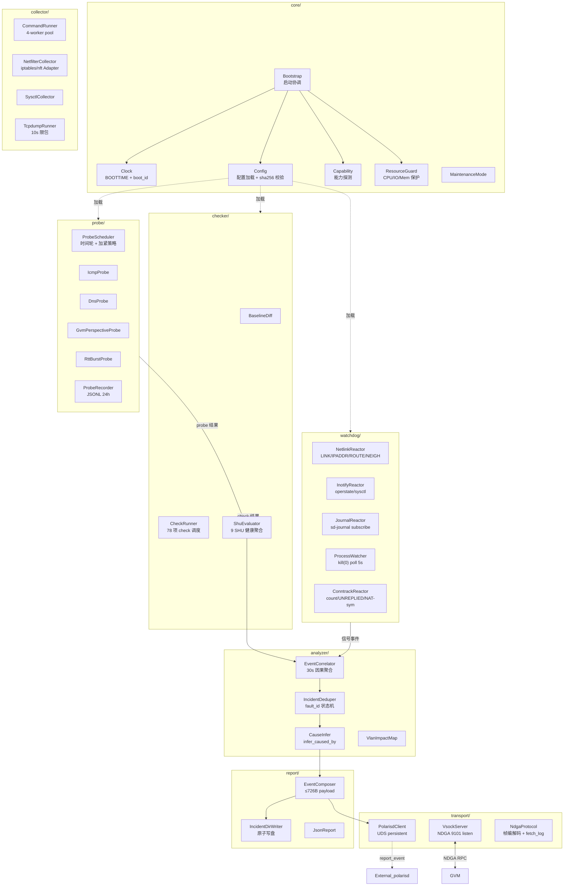
```mermaid
flowchart TB
    subgraph CORE["core/"]
        Bootstrap["Bootstrap\n启动协调"]
        Clock["Clock\nBOOTTIME + boot_id"]
        Config["Config\n配置加载 + sha256 校验"]
        Capability["Capability\n能力探测"]
        ResourceGuard["ResourceGuard\nCPU/IO/Mem 保护"]
        Maintenance["MaintenanceMode"]
    end

    subgraph TRANSPORT["transport/"]
        VsockServer["VsockServer\nNDGA 9101 listen"]
        PolarisdClient["PolarisdClient\nUDS persistent"]
        Ndga["NdgaProtocol\n帧编解码 + fetch_log"]
    end

    subgraph WATCHDOG["watchdog/"]
        NetlinkR["NetlinkReactor\nLINK/IPADDR/ROUTE/NEIGH"]
        InotifyR["InotifyReactor\noperstate/sysctl"]
        JournalR["JournalReactor\nsd-journal subscribe"]
        ProcW["ProcessWatcher\nkill(0) poll 5s"]
        CtR["ConntrackReactor\ncount/UNREPLIED/NAT-sym"]
    end

    subgraph PROBE["probe/"]
        Scheduler["ProbeScheduler\n时间轮 + 加紧策略"]
        IcmpP["IcmpProbe"]
        DnsP["DnsProbe"]
        GvmPersp["GvmPerspectiveProbe"]
        RttBurst["RttBurstProbe"]
        Recorder["ProbeRecorder\nJSONL 24h"]
    end

    subgraph COLLECT["collector/"]
        CmdR["CommandRunner\n4-worker pool"]
        Nfc["NetfilterCollector\niptables/nft Adapter"]
        SysC["SysctlCollector"]
        Tcp["TcpdumpRunner\n10s 限包"]
    end

    subgraph CHECK["checker/"]
        Diff["BaselineDiff"]
        CheckRun["CheckRunner\n78 项 check 调度"]
        ShuEval["ShuEvaluator\n9 SHU 健康聚合"]
    end

    subgraph ANALYZE["analyzer/"]
        Correlator["EventCorrelator\n30s 因果聚合"]
        Dedup["IncidentDeduper\nfault_id 状态机"]
        Cause["CauseInfer\ninfer_caused_by"]
        Vlan["VlanImpactMap"]
    end

    subgraph REPORT["report/"]
        EventComp["EventComposer\n≤726B payload"]
        IncidentW["IncidentDirWriter\n原子写盘"]
        JsonRep["JsonReport"]
    end

    Bootstrap --> Clock & Config & Capability & ResourceGuard
    Config -.加载.-> WATCHDOG
    Config -.加载.-> PROBE
    Config -.加载.-> CHECK

    WATCHDOG -- 信号事件 --> Correlator
    PROBE -- probe 结果 --> ShuEval
    CHECK -- check 结果 --> ShuEval
    ShuEval --> Correlator
    Correlator --> Dedup --> Cause --> EventComp
    EventComp --> IncidentW
    EventComp --> PolarisdClient
    PolarisdClient -. report_event .-> External_polarisd
    VsockServer <-- NDGA RPC --> GVM
```

### 3.3 组件架构 — GVM `android_net_diagd`

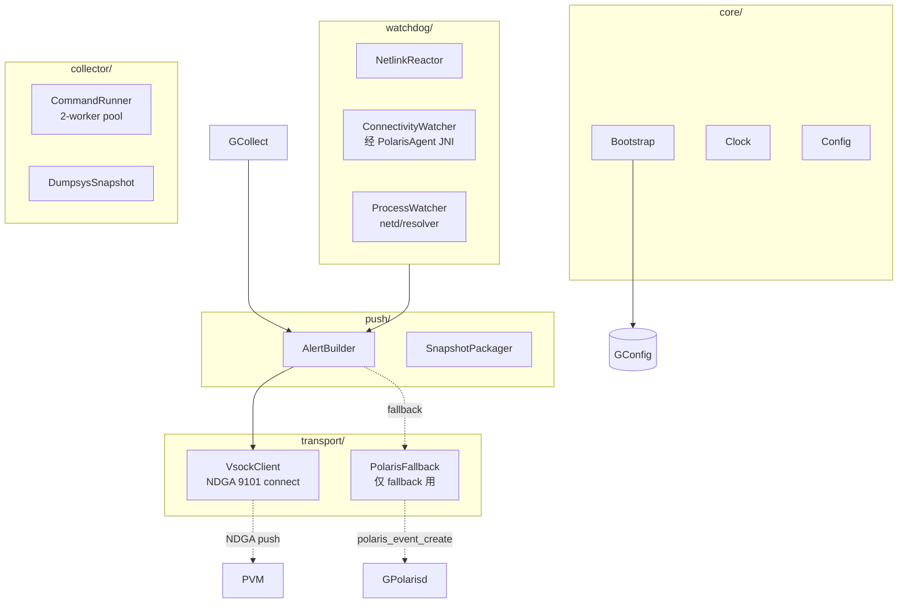
```mermaid
flowchart TB
    subgraph GCORE["core/"]
        GBoot["Bootstrap"]
        GClock["Clock"]
        GConfig["Config"]
    end

    subgraph GTRANS["transport/"]
        VsockCli["VsockClient\nNDGA 9101 connect"]
        PolarisFB["PolarisFallback\n仅 fallback 用"]
    end

    subgraph GWATCH["watchdog/"]
        GNetlink["NetlinkReactor"]
        GConn["ConnectivityWatcher\n经 PolarisAgent JNI"]
        GProc["ProcessWatcher\nnetd/resolver"]
    end

    subgraph GCOLLECT["collector/"]
        GCmd["CommandRunner\n2-worker pool"]
        Dumpsys["DumpsysSnapshot"]
    end

    subgraph GPUSH["push/"]
        Alert["AlertBuilder"]
        SnapPkg["SnapshotPackager"]
    end

    GBoot --> GCONFIG[(GConfig)]
    GWATCH --> Alert
    GCollect --> Alert
    Alert --> VsockCli
    VsockCli -. NDGA push .-> PVM
    Alert -. fallback .-> PolarisFB
    PolarisFB -. polaris_event_create .-> GPolarisd
```

### 3.4 数据流视图（4 路 + fallback）

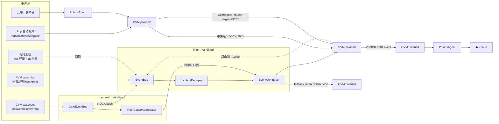
```mermaid
flowchart LR
    subgraph SOURCES["事件源"]
        WD_PVM["PVM watchdog\n物理/规则/conntrack"]
        WD_GVM["GVM watchdog\nlink/Connectivity/netd"]
        APP["App 主动报障\nreportNetworkTrouble"]
        CLOUD["云端下发命令"]
        TIMER["定时巡检\n60s 轻量 / 1h 全量"]
    end

    subgraph PVM_PROC["linux_net_diagd"]
        EVTBUS["EventBus"]
        DEDUP["IncidentDeduper"]
        REPORT["EventComposer"]
    end

    subgraph GVM_PROC["android_net_diagd"]
        GVMBUS["GvmEventBus"]
        GVMROOT["RootCauseAggregator"]
    end

    WD_PVM --> EVTBUS
    TIMER -.周期.-> EVTBUS
    EVTBUS --> DEDUP --> REPORT --> POLARISD_PVM["PVM polarisd"]

    WD_GVM --> GVMBUS
    GVMBUS -- NDGA push --> EVTBUS
    GVMBUS --> GVMROOT
    GVMROOT -- 跨端补归因 --> REPORT

    APP --> GPolarisd_in["GVM polarisd"]
    GPolarisd_in -- 事件经 VSOCK 9001 --> POLARISD_PVM
    POLARISD_PVM -. 路由到 IAction .-> EVTBUS

    CLOUD --> PA_in["PolarisAgent"]
    PA_in --> GPolarisd_in
    GPolarisd_in -- CommandRequest target=HOST --> POLARISD_PVM

    REPORT -. fallback when NDGA dead .-> GPolarisd_FB["GVM polarisd"]

    POLARISD_PVM -- VSOCK 9001 event --> GPolarisd_out["GVM polarisd"]
    GPolarisd_out --> PA_out["PolarisAgent"]
    PA_out --> CloudOut["☁️ Cloud"]
```

### 3.5 通道总览

| 通道 | 物理 | 端点 | 用途 | 方向 |
|---|---|---|---|---|
| **A** | VSOCK | `android_net_diagd` ↔ `linux_net_diagd` | 诊断 RPC + GVM push + 补归因 | 双向 |
| **B** | VSOCK | `android_native_polarisd` ↔ `linux_polarisd` | 云命令下发（GVM→PVM）+ polaris 事件传输（PVM→GVM）| 不对称双向 |
| **C** | UDS | `linux_polarisd` ↔ `linux_net_diagd` | 本机事件上报 | 单向（diag→polarisd） |
| **A-fallback** | UDS + VSOCK | `android_net_diagd` → `android_native_polarisd` | NDGA 断开时 GVM 兜底上报 | 单向 |

| 端口/路径 | 用途 |
|---|---|
| `VMADDR_CID_HOST(2):9101` | 通道 A — NDGA 协议端口 |
| `VMADDR_CID_HOST(2):9001` | 通道 B — polaris PLP 协议端口（现成） |
| `/run/polaris/network-diag.sock` | 通道 C — PVM polarisd UDS |
| `/dev/socket/polaris_report` | GVM polaris client SDK UDS |
| `/log/perf/network_diag/` | PVM 取证根目录 |
| `/mnt/vendor/log/perf/network_diag/` | GVM 通过共享挂载访问 PVM 取证目录 |

---

## 4. 设计决策汇总

按主题分类的决策表，每项含选择 / 备选 / 理由。详细推导过程参见 `network_diagnosis_detailed_design.md`。

### 4.1 通信架构

| 决策 | 选择 | 备选 |
|---|---|---|
| 跨 VM 诊断协调通道 | **专用 VSOCK 9101（NDGA）** | 复用 polaris 命令通道 |
| 事件出云路径 | **PVM polarisd → VSOCK → GVM polarisd → PolarisAgent → Cloud** | GVM polarisd 直接出云（架构不变，但端侧出口统一为 PVM）|
| PVM diag ↔ polarisd | **单向 report event（通道 C）** | 双向 RPC + IAction（已舍弃）|
| 跨 VM 大文件传输 | **共享挂载 + manifest 引用**（PVM 写完 GVM 读）| VSOCK 分块（fetch_log 协议仅作 fallback）|
| baseline 部署 | **独立 JSONC 附件 + 双端 sha256 互校** | 内联主配置 |

### 4.2 时钟、事件、状态机

| 决策 | 选择 | 备选 |
|---|---|---|
| 内部状态机时钟 | **CLOCK_BOOTTIME** | CLOCK_REALTIME（NTP 跳变敏感）|
| 全局 epoch | **PVM boot_id**（GVM 通过 NDGA hello 同步获取）| 各端各自 boot_id（无法跨端关联）|
| Boot 期假阳性抑制 | **boot_warmup_sec = 120s**（硬故障豁免）| 启动即采（开机事件海啸）|
| 事件聚合窗口 | **30s + 优先级表 + IncidentDeduper** | 各报各（云端噪声大）|
| 事件 payload | **≤ 726 字节紧凑格式**（PolarisAgent 上云硬约束）| 大 schema 全字段 |

### 4.3 Fault 模型

| 决策 | 选择 | 备选 |
|---|---|---|
| **fault_id 生成** | R1 确定性 hash | R2 PVM 主分配 / R3 云端模糊匹配 |
| **GVM 起来前 PVM 上报** | PVM 独立上报 side event（VSOCK B + polarisd mOfflineCache 兜底）| 等 GVM 起来 |
| **GVM 起来后补归因** | 立即对仍 ACTIVE fault 补 root cause first_pass + Warmup 后视情况 refine | 仅处理新故障 |
| **side / root / recov 上云** | 条件发 side（NDGA online 时不发，离线 + 8s timer 兜底）| 全发 / 一律不发 |
| **fault 演化** | fault_id 锁定 + manifest.evolution[] 段 + 派生 fault 用 `cb` 字段 | 严重度变化拆分新 fault_id |

### 4.4 检测与采集

| 决策 | 选择 | 备选 |
|---|---|---|
| 上下行差分故障检测 | **靠内核 netfilter 状态**（conntrack UNREPLIED）| 依赖 App 主动报障 |
| 命令执行 | **4-worker 并行 + ResourceGuard 保护** | for 循环串行 |
| BLOCKED 分级 | **L1_env / L2_anomaly / L3_intermittent** | 一刀切 |
| Probe 加紧策略 | **1s × 5 包 × 3 轮（最长 15s）+ RTT burst on alert** | 固定 30s/包 |
| netfilter 后端 | **抽象层 + Iptables/Nft Adapter** | 直接 `iptables` 命令 |
| dmesg 关键字检索 | **sd-journal 订阅** | `dmesg \| grep` |
| 维护模式 | **set_maintenance API + 时长封顶** | 无 |
| 持续故障取证 | **首次完整 + ongoing log + recovery event** | 每周期重复取证 |

### 4.5 已舍弃方案

| 方案 | 不做的理由 |
|---|---|
| `polaris_command_listener_register` SDK 扩展 | 通道 C 改单向后不需要 |
| `NetdiagBridgeAction` IAction | 同上 |
| 端侧 Markdown 报告 | 云端渲染统一 UI |
| 取证脱敏（v1）| 用户决定暂不考虑 |
| PVM → GVM 同步 RPC 反向命令 | polaris 现有 VSOCK 单向；维护模式走 NDGA |
| 跨 VM 同时读写同一文件 | 共享挂载约束（A3）：PVM 写完才通知 |
| App 必须集成 reportNetworkTrouble 才能定位 | 内核 netfilter 状态自带指纹 |

---

## 5. 进程详细设计

### 5.1 PVM 进程 `linux_net_diagd`

#### 5.1.1 模块划分

```
linux_net_diagd/
├── core/
│   ├── Bootstrap.{h,cpp}            启动协调器
│   ├── Clock.{h,cpp}                BOOTTIME / REALTIME / boot_id
│   ├── Config.{h,cpp}               JSONC 解析 + sha256 校验
│   ├── Capability.{h,cpp}           启动期能力探测
│   ├── ResourceGuard.{h,cpp}        CPU/IO/Mem 自我保护
│   ├── MaintenanceMode.{h,cpp}      维护模式开关
│   └── EventBus.{h,cpp}             lock-free MPSC queue
├── transport/
│   ├── VsockServer.{h,cpp}          NDGA 9101 listen
│   ├── PolarisdClient.{h,cpp}       通道 C 持久连接
│   ├── NdgaProtocol.{h,cpp}         帧编解码 + chunk 协议
│   └── NdgaSession.{h,cpp}          单 peer session 管理
├── watchdog/
│   ├── IWatchdog.h                  接口
│   ├── NetlinkReactor.{h,cpp}       LINK/IPADDR/ROUTE/NEIGH
│   ├── InotifyReactor.{h,cpp}       operstate + sysctl
│   ├── JournalReactor.{h,cpp}       sd-journal subscribe
│   ├── ProcessWatcher.{h,cpp}       kill(0) 5s poll
│   ├── ConntrackReactor.{h,cpp}     count/UNREPLIED/NAT-sym/SYN_SENT
│   ├── NatRulesReactor.{h,cpp}      30s iptables hash diff
│   └── VmtapUniReactor.{h,cpp}      vmtap 单向 + 协议 echo
├── probe/
│   ├── ProbeScheduler.{h,cpp}       时间轮 + 加紧
│   ├── IcmpProbe.{h,cpp}            含 PMTU 边界包
│   ├── DnsProbe.{h,cpp}
│   ├── GvmPerspectiveProbe.{h,cpp}  raw socket 模拟 GVM 视角
│   ├── RttBurstProbe.{h,cpp}        间歇故障检测
│   └── ProbeRecorder.{h,cpp}        JSONL 滚动
├── collector/
│   ├── CommandRunner.{h,cpp}        only-read + 超时 + 并行
│   ├── NetfilterCollector.{h,cpp}   抽象层
│   ├── IptablesAdapter.{h,cpp}
│   ├── NftAdapter.{h,cpp}
│   ├── SysctlCollector.{h,cpp}
│   ├── ProcNetCollector.{h,cpp}
│   ├── ConntrackStateCollector.{h,cpp}   UNREPLIED/INVALID 统计
│   ├── EthtoolCollector.{h,cpp}
│   └── TcpdumpRunner.{h,cpp}
├── checker/
│   ├── BaselineDiff.{h,cpp}         diff_policy 应用
│   ├── CheckRunner.{h,cpp}          78 项 check 调度
│   ├── L1LinkCheck.{h,cpp}
│   ├── L2VlanCheck.{h,cpp}
│   ├── L3RouteCheck.{h,cpp}
│   ├── L4NatFwCheck.{h,cpp}
│   ├── VirtLinkCheck.{h,cpp}
│   ├── L5ServiceCheck.{h,cpp}
│   ├── PerfCheck.{h,cpp}
│   ├── SecurityCheck.{h,cpp}
│   ├── BaseCheck.{h,cpp}
│   └── ShuEvaluator.{h,cpp}
├── analyzer/
│   ├── EventCorrelator.{h,cpp}      30s 因果聚合
│   ├── IncidentDeduper.{h,cpp}      fault_id 状态机
│   ├── CauseInfer.{h,cpp}           infer_caused_by()
│   ├── VlanImpactMap.{h,cpp}
│   └── FaultClassDict.{h,cpp}       字典加载与查询
├── report/
│   ├── EventComposer.{h,cpp}        ≤726B payload
│   ├── IncidentDirWriter.{h,cpp}    原子写盘
│   ├── ManifestUpdater.{h,cpp}      跨端字段层级隔离
│   └── JsonReport.{h,cpp}
├── util/
│   ├── Hash.{h,cpp}                 MurmurHash3
│   ├── Json.{h,cpp}                 jsoncpp 封装
│   ├── Log.h
│   └── TimerWheel.{h,cpp}
└── main.cpp
```

#### 5.1.2 线程模型

| 线程名 | 数量 | 职责 | 优先级 |
|---|---|---|---|
| `MainThread` | 1 | 信号处理、监督、生命周期协调 | nice=10 |
| `ScanScheduler` | 1 | timerfd 驱动 60s/1h 巡检 | nice=10 |
| `WatchdogReactor` | 1 | epoll 多路：Netlink + Inotify + Conntrack + Process + NatRules + VmtapUni | nice=10 |
| `JournalReactor` | 1 | sd-journal blocking poll（独立线程）| nice=10 |
| `ProbeScheduler` | 1 | timerfd 驱动 probe 调度 | nice=10 |
| `VsockServer` | 1 | NDGA 9101 accept/read/write | nice=10 |
| `PolarisdClient` | 1 | UDS connect + 重连 + 事件发送 | nice=10 |
| `WorkerPool` | 4 | 命令并行执行、取证打包、抓包 | nice=10 |

线程间通信全部通过 `EventBus`（lock-free MPSC queue, capacity 4096）。

```cpp
namespace netdiag {

class EventBus {
public:
    bool tryPost(InternalEvent&& e);    // 非阻塞，满则丢 INFO 级，FAIL 级强制入队
    bool pop(InternalEvent& out, int timeoutMs);
    size_t pending() const;

private:
    folly::MPMCQueue<InternalEvent> queue_{4096};
};

} // namespace netdiag
```

#### 5.1.3 启动流程

```
T+0       systemd 拉起 main()
T+0..2s   Bootstrap::phase1()
          - parse cmdline, load /etc/polaris/network-diag-pvm.json
          - sha256 verify against baseline-*.json / fault_class_dict.json /
            fault_causation_graph.json / scenario-registry.json
          - schema validation; on failure exit 1 (systemd Restart 退避 2s)
          - Clock::init(): read /proc/sys/kernel/random/boot_id
          - load FaultClassDict (36 classes)
          - load CausationGraph (15 edges)
          - load ScenarioRegistry (12 scenarios)
T+2..5s   Bootstrap::phase2() - capability probe
          - which ethtool / tcpdump / conntrack
          - test -f /proc/net/stat/nf_conntrack
          - sd-journal availability
          - cache to Capability::instance()
T+5..10s  Bootstrap::phase3() - channels
          - VsockServer::start() listen on 9101
          - PolarisdClient::connect() to /run/polaris/network-diag.sock
            (退避重试最多 30 次；失败仍继续 fallback)
T+10s     Bootstrap::phase4() - 进入 Boot Warmup (120s)
          - WatchdogReactor::start(suppress=true)
          - ProbeScheduler::start(warmup=true)
          - ScanScheduler::start()
          - WorkerPool::start()
          - 期内事件 → /log/perf/network_diag/boot_warmup.log（不发 polaris）
          - 硬故障豁免清单：LINK_DOWN、CONNTRACK_PRESSURE 立即上报
T+130s    Boot Warmup 结束
          - 全量 baseline_diff 一次
          - 上报 INFO NETDIAG_SCAN_REPORT
          - 进入正常运行模式
```

时序图：见 §24 SEQ-01。

#### 5.1.4 关闭流程

```
收到 SIGTERM:
  1. Bootstrap::shutdown(): 停止接受新事件
  2. WorkerPool wait completion (≤5s)
  3. flush 待发事件到 polarisd (≤3s)
  4. 持久化 active_faults.json
  5. 关闭 VSOCK / UDS
  6. exit(0)

systemd timeout 10s → SIGKILL 兜底
```

#### 5.1.5 资源配额

```ini
# /usr/lib/systemd/system/network-diag.service
[Unit]
Description=Network Diagnostic Daemon (PVM)
After=systemd-modules-load.service polarisd.service
Wants=polarisd.service
ConditionPathIsDirectory=/log

[Service]
Type=simple
ExecStartPre=/bin/mkdir -p /log/perf/network_diag/incidents \
    /log/perf/network_diag/snaps /log/perf/network_diag/probes \
    /log/perf/network_diag/state
ExecStart=/usr/bin/network-diag-pvm --config /etc/polaris/network-diag-pvm.json
Restart=always
RestartSec=2s
StartLimitBurst=5
StartLimitIntervalSec=60s

# 软限：CPUWeight 相对低权重
CPUWeight=20
IOSchedulingClass=best-effort
IOSchedulingPriority=7
Nice=10

# 硬限：内存上限防泄漏
MemoryMax=128M

AmbientCapabilities=CAP_NET_RAW CAP_NET_ADMIN
NoNewPrivileges=true
ReadWritePaths=/log/perf/network_diag /run/polaris/network-diag
RuntimeDirectory=polaris/network-diag
RuntimeDirectoryMode=0750
ProtectSystem=strict
ProtectHome=true
PrivateTmp=true

User=root
Group=root

[Install]
WantedBy=multi-user.target
```

注意：**不使用 `CPUQuota` 硬限**，避免 incident 模式下被卡死；CPU 保护交给应用层 `ResourceGuard`。

### 5.2 GVM 进程 `android_net_diagd`

#### 5.2.1 模块划分（精简版，约 PVM 1/3 体量）

```
android_net_diagd/
├── core/{Bootstrap, Clock, Config, Capability, MaintenanceMode}
├── transport/
│   ├── VsockClient.{h,cpp}          NDGA connect + 重连
│   ├── NdgaProtocol.{h,cpp}         同 PVM
│   └── PolarisFallback.{h,cpp}      libpolaris_client 兜底
├── watchdog/
│   ├── NetlinkReactor.{h,cpp}       LINK/IPADDR/NEIGH
│   ├── ConnectivityWatcher.{h,cpp}  经 PolarisAgent JNI 桥接
│   ├── ProcessWatcher.{h,cpp}       netd/resolver
│   └── DnsResolverWatcher.{h,cpp}
├── collector/
│   ├── CommandRunner.{h,cpp}
│   └── DumpsysSnapshot.{h,cpp}
├── push/
│   ├── AlertBuilder.{h,cpp}         gvm_alert payload
│   ├── SnapshotPackager.{h,cpp}     snap_dir 写盘
│   └── RootCauseAggregator.{h,cpp}  补归因合并
└── main.cpp
```

#### 5.2.2 线程模型

| 线程 | 数量 | 职责 |
|---|---|---|
| MainThread | 1 | 生命周期 |
| ScanScheduler | 1 | 60s/1h 巡检 |
| WatchdogReactor | 1 | epoll: Netlink + Inotify + ProcessWatcher |
| VsockClient | 1 | NDGA 9101 connect/read/write/heartbeat |
| ConnectivityListener | 1 | callback 路径（经 PolarisAgent JNI） |
| WorkerPool | 2 | 命令并行 |

#### 5.2.3 启动流程

```
T+0       init.rc 拉起
T+0..2s   load /system/etc/polaris/network-diag-gvm.json + 附件
T+2..5s   capability probe + ConnectivityCallback 可用性检测
T+5..15s  VsockClient::connectWithBackoff() to CID=2:9101
          - 指数退避 1s/2s/4s/.../30s
          - 成功后立即 hello 协商
          - 缓存 pvm_boot_id_short
T+15s     若 hello.pvm_active_faults_count > 0:
          - 读 /mnt/vendor/log/perf/network_diag/state/active_faults.json
          - 对 ACTIVE_NEW / ACTIVE_ONGOING 启动补归因（first_pass）
T+15..135s Boot Warmup (120s)
T+135s    Warmup 结束，进入正常运行
```

#### 5.2.4 init.rc 与 sepolicy

```
# /vendor/etc/init/network-diag.rc
service network-diag-gvm /system/bin/network-diag-gvm \
    --config /system/etc/polaris/network-diag-gvm.json
    class main
    user system
    group system net_admin net_raw inet readproc log
    capabilities NET_RAW NET_ADMIN DAC_READ_SEARCH
    task_profiles ServiceCapacityLow
    ioprio be 7
    seclabel u:r:network_diag:s0
    oneshot false
```

```te
# device/voyah/.../sepolicy/network_diag.te
type network_diag, domain;
type network_diag_exec, exec_type, vendor_file_type, file_type;
init_daemon_domain(network_diag)

# VSOCK 出向到 host CID=2 port=9101
allow network_diag self:vsock_socket { create connect read write };

# 读 /proc/net/* + /sys/class/net/*
allow network_diag proc_net:file { open read };
allow network_diag sysfs_net:dir search;
allow network_diag sysfs_net:file { open read };

# 共享挂载 /mnt/vendor/log/perf/* 只读
allow network_diag vendor_log_file:dir { search read open };
allow network_diag vendor_log_file:file { open read getattr };

# 执行 ip/ss/ndc/dumpsys
allow network_diag system_file:file execute;

# 自有取证目录读写
allow network_diag log_file:dir { create_dir_perms };
allow network_diag log_file:file { create_file_perms };

# 经由 PolarisAgent 接收 Connectivity callback (binder)
# binder_call(network_diag, system_server)  -- 仅 v1.1 选项 b 启用，v1 默认走 dumpsys poll
```

---

## 6. 通信协议详细设计

### 6.1 通道 A — NDGA VSOCK 9101

#### 6.1.1 帧格式

```
+---------+---------+---------+---------+----------------+
| magic   | version | length  | flags   | json payload   |
| 4 bytes | 2 bytes | 4 bytes | 2 bytes | length bytes   |
+---------+---------+---------+---------+----------------+
magic   = 0x4E444741 ("NDGA", big-endian)
version = 1 (uint16_t big-endian)
length  = uint32_t big-endian, max 4 MiB
flags   = bitmask, see below
```

`flags` 位定义：

| 位 | 名称 | 含义 |
|---|---|---|
| 0 | `COMPRESSED` | payload 经 zlib 压缩（v2 候选，v1 不启用）|
| 1 | `LAST_CHUNK` | chunk 协议最后一片 |
| 2 | `HAS_CHECKSUM` | 含 sha256 校验（chunk 协议用）|
| 3-15 | reserved | 必须为 0 |

帧解析必须先校验 `magic + version`；不匹配立即关闭连接。

#### 6.1.2 消息类型

```cpp
namespace netdiag {

enum class NdgaMsgType : uint8_t {
    HELLO     = 0x01,    // 连接建立后第一帧
    REQUEST   = 0x02,    // 同步 RPC
    RESPONSE  = 0x03,    // RPC 回包
    PUSH      = 0x04,    // 单向通知
    CHUNK     = 0x05,    // 大文件分块
    ACK       = 0x06,    // chunk 确认
    PING      = 0x07,    // 心跳
};

} // namespace netdiag
```

JSON payload 中 `"msg"` 字段表示消息类型（小写）。

#### 6.1.3 HELLO 帧

```jsonc
// GVM → PVM (client 发起)
{
  "msg":               "hello",
  "version":           1,
  "role":              "gvm",
  "gvm_diag_version":  "1.0.0",
  "gvm_boot_id":       "9e8f7a6b5c4d3e2f",       // 16 hex
  "gvm_config_sha256": "abcdef...",
  "gvm_dict_sha256":   "1234ab...",
  "gvm_graph_sha256":  "fedcba..."
}

// PVM → GVM (server 应答)
{
  "msg":                     "hello",
  "version":                 1,
  "role":                    "pvm",
  "pvm_diag_version":        "1.0.0",
  "pvm_boot_id_short":       "f0b8c3a5e1d27a89",  // 16 hex (64-bit truncated)
  "pvm_boot_ts_unix":        1747787985,
  "pvm_config_sha256":       "abcdef...",
  "pvm_dict_sha256":         "1234ab...",
  "pvm_graph_sha256":        "fedcba...",
  "pvm_active_faults_count": 0                    // 提示 GVM 是否扫 active_faults.json
}
```

校验规则：
1. version 不匹配 → close
2. role 必须 pvm/gvm 且与连接方向一致 → 否则 close
3. config/dict/graph sha256 不一致 → 双端各打告警，但仍继续工作（不影响功能，仅记录）
4. GVM 缓存 `pvm_boot_id_short`，所有 fault_id 计算使用该值

#### 6.1.4 REQUEST / RESPONSE

```jsonc
// REQUEST
{
  "msg":        "request",
  "req_id":     uint64,
  "method":     "collect" | "probe" | "snapshot" | "fetch_log" | "ping"
              | "set_maintenance" | "dynamic_target",
  "args":       { ... },
  "timeout_ms": 5000
}

// RESPONSE
{
  "msg":     "response",
  "req_id":  uint64,
  "code":    0,                  // 0 success, <0 errno-style
  "errmsg":  "OK",
  "data":    { ... },
  "log_ref": "/log/perf/network_diag/snaps/snap_xxx"  // 可选，大文件路径
}
```

RPC method 完整清单：

| method | 发起方 | 用途 | 关键 args |
|---|---|---|---|
| `collect` | 任一方 | 按需采集对端数据 | `sections: [...]` |
| `probe` | PVM→GVM | 要求 GVM 执行探测 | `type, target, count, interface` |
| `snapshot` | PVM→GVM | 要求 GVM 全量快照 | `reason: "cloud_command" \| "periodic"` |
| `fetch_log` | 任一方 | 拉取 log_ref 文件（仅作 fallback，正常用共享挂载）| `log_ref, files: [...]` |
| `ping` | 任一方 | 心跳检测 | 无 |
| `set_maintenance` | PVM→GVM | 设置维护模式 | `enable, scope, duration_sec` |
| `dynamic_target` | 任一方 | 切换 probe 目标（SKU/区域）| `shu, probe_targets: [...]` |

错误码：

| code | 含义 |
|---|---|
| 0 | OK |
| -1 | 通用失败 |
| -2 | 资源不存在 |
| -3 | 权限不足 |
| -4 | 超限（输出过大/超时）|
| -5 | 容量满 |
| -6 | 超时未应答 |
| -7 | 校验失败 |
| -8 | 维护模式拒绝 |
| -22 | EINVAL |
| -110 | ETIMEDOUT |

#### 6.1.5 PUSH 帧

```jsonc
{
  "msg":        "push",
  "type":       "gvm_alert" | "fault_alert" | "root_emitted" | "heartbeat",
  "ts_unix":    uint64,
  "ts_boot":    uint64,            // ms since boot
  "boot_id":    "...",
  "payload":    { ... },           // type-specific
  "log_ref":    "/log/perf/..."    // 可选
}
```

push type 详细：

##### `gvm_alert`（GVM → PVM）

GVM watchdog 检测到业务异常，主动通报 PVM 并请求协同：

```jsonc
{
  "msg":     "push",
  "type":    "gvm_alert",
  "ts_unix": 1747764000,
  "ts_boot": 18234567,
  "boot_id": "f0b8c3a5e1d27a89",   // 使用 pvm_boot_id（fault_id epoch）
  "payload": {
    "alert_id":      "VLAN3_GATEWAY_UNREACHABLE",
    "fault_class":   "GATEWAY_UNREACHABLE",
    "target_key":    "VLAN3_TBOX",
    "severity":      "FAIL",
    "shu":           "SHU_VLAN3_INTERNET",
    "consec_fails":  5,

    "snapshot_layer1": {            // netlink 直读，永远可用
      "_source":         "netlink_direct",
      "_data_quality":   "high",
      "_collect_time_ms": 3,
      "iface_up":        true,
      "ip":              "10.10.103.40/24",
      "neigh_state":     "FAILED",
      "carrier_changes": 1
    },
    "snapshot_layer2": {            // dumpsys 解析，可能 hang
      "_source":         "dumpsys_connectivity",
      "_data_quality":   "ok",       // ok | timeout | unparseable | unavailable
      "_collect_time_ms": 450,
      "default_netid":   102,
      "default_dns":     ["10.10.103.20"]
    }
  },
  "log_ref": "/log/perf/network_diag/snaps/snap_20260509_153000_VLAN3GW"
}
```

##### `fault_alert`（PVM → GVM）

PVM watchdog 触发 fault，通知 GVM 跟进归因：

```jsonc
{
  "msg":     "push",
  "type":    "fault_alert",
  "ts_unix": 1747764000,
  "ts_boot": 18234567,
  "boot_id": "f0b8c3a5e1d27a89",
  "payload": {
    "fault_id":      "a1b2c3d4e5f60718",
    "correlation_id":"d4e5f607",
    "fault_class":   "LINK_DOWN",
    "target_key":    "eth1",
    "severity":      "FAIL",
    "shu_impact":    ["SHU_VLAN3_INTERNET","SHU_VLAN6_ADCU_PARK",
                      "SHU_VLAN7_OTA","SHU_VLAN8_ADAS","SHU_VLAN4_DOIP"],
    "manifest_path_short":"i/20260511/a1b2",
    "first_seen_ts_boot": 18234567
  }
}
```

GVM 收到后异步触发补归因流程（见 §9.5）。

##### `root_emitted`（GVM → PVM）

GVM 发出 root cause incident 后通知 PVM 取消 fallback timer：

```jsonc
{
  "msg":     "push",
  "type":    "root_emitted",
  "ts_unix": 1747764062,
  "ts_boot": 18296567,
  "boot_id": "f0b8c3a5e1d27a89",
  "payload": {
    "fault_id":         "a1b2c3d4e5f60718",
    "polaris_event_ts": 18296500,
    "first_pass":       true
  }
}
```

##### `heartbeat`

```jsonc
{
  "msg":     "push",
  "type":    "heartbeat",
  "ts_unix": 1747764030,
  "ts_boot": 18264567,
  "boot_id": "f0b8c3a5e1d27a89",
  "payload": {
    "active_faults_count": 0,
    "memory_rss_kb":       42000,
    "ndga_send_queue":     0
  }
}
```

每 30s 双向发；连续 3 次未收到对端心跳 → close + reconnect。

#### 6.1.6 fetch_log 分块协议

仅作为 fallback（共享挂载不可用时使用）。

请求：

```jsonc
{
  "msg":     "request",
  "req_id":  42,
  "method":  "fetch_log",
  "args": {
    "log_ref":            "/log/perf/network_diag/snaps/snap_xxx",
    "files":              ["dumpsys_connectivity.txt","ip_route_all.txt"],
    "max_bytes_per_file": 1048576,
    "max_total_bytes":    16777216
  },
  "timeout_ms": 30000
}
```

响应链：

```
1. RESPONSE         {req_id:42, code:0,
                     data:{file_index:[{name, size, sha256}, ...]}}
2. CHUNK msg × N    {req_id:42, file:"...", chunk_seq:0..K,
                     total_chunks:K+1, total_bytes:N,
                     data_b64:"..."}
                    （最后一帧带 LAST_CHUNK flag）
3. ACK msg × N      {req_id:42, file:"...", chunk_seq:K, ok:true}
                    （接收方对每个 chunk 发 ack；未收到 ack ≥5s 重发，最多 3 次）
```

约束：

- 单 chunk size ≤ 256 KiB
- 单文件 ≤ `max_bytes_per_file`（默认 1 MiB，硬上限 4 MiB）
- 整次传输 ≤ `max_total_bytes`（默认 16 MiB，硬上限 32 MiB）
- 每文件附 sha256 校验，最后 LAST_CHUNK 时验证

#### 6.1.7 连接管理

| 项 | 规范 |
|---|---|
| 角色 | PVM=server `listen(2)` on `VMADDR_CID_HOST(2):9101`；GVM=client `connect(2)` to `CID_HOST:9101` |
| 单连接 | server 同一时刻只接受 1 个 client；新 client 进来挤掉旧的 |
| 心跳 | 30s 双向 push ping/pong；连续 3 次未响应 close+reconnect |
| 重连退避 | 1s/2s/4s/8s/16s/30s 封顶 |
| Hello 验证 | 双方 hello 必须含 version + sha256；version 不兼容直接 close |
| online check | `connected && hello_completed && (now - last_heartbeat) < 10s` |
| Fallback | client 持续断连 60s → 进入 polaris event 链兜底（轻量化）|

### 6.2 通道 B — polaris VSOCK 9001（复用）

完全复用 polaris 现有 PLP 协议（`CommandRequest` / `CommandResult` / `PolarisEvent`）。本模块在此通道上仅做两件事：

1. **事件出口**：调 `polaris_event_create(...)` → polaris_event_commit；PVM polarisd 自动经 VSOCK B 推到 GVM polarisd → PolarisAgent → Cloud。
2. **接收云命令（仅观察）**：云命令通过 `CommandRequest{target=HOST}` 到达 PVM polarisd 后，**v1 不接收**（无 `NetdiagBridgeAction` IAction）。云命令实际走 PolarisAgent → GVM polarisd → IAction(`netdiag.run`) → GVM net_diagd → 通过 NDGA 拉 PVM。

### 6.3 通道 C — UDS PVM polarisd ↔ PVM_diag

#### 6.3.1 传输

- 路径：`/run/polaris/network-diag.sock`（systemd RuntimeDirectory 创建）
- 类型：`SOCK_SEQPACKET`，非阻塞
- 协议：复用 polarisd LSP Codec（12-byte header + JSON payload）
- 连接：linux_net_diagd 启动后 connect；断线指数退避（1s/3s/5s/10s/30s 封顶）

#### 6.3.2 消息

仅一个方向：`diag → polarisd` 上报事件（替代直接调 `polaris_event_create`）。

```jsonc
// netdiag → polarisd (msgType=POLARIS_EVENT_REPORT 0x0030)
{
  "event_id":     "0x4E5E0008",
  "json_body":    "{\"v\":1,\"src\":\"pvm\",...}",  // ≤ 726 字节 polaris event payload
  "log_path":     "/log/perf/network_diag/incidents/incident_xxx",
  "ts_unix":      1747764000,
  "ts_boot":      18234567,
  "boot_id":      "f0b8c3a5e1d27a89"
}
```

polarisd 异步 fire-and-forget；不返回 ACK（v1 简化）。

---

## 7. 配置与基线

### 7.1 配置文件清单

| 文件 | 拥有方 | 部署位置（PVM）| 部署位置（GVM） |
|---|---|---|---|
| `network-diag-pvm.json` | 网络诊断团队 | `/etc/polaris/` | — |
| `network-diag-gvm.json` | 同上 | — | `/system/etc/polaris/` |
| `baseline-pvm.json` | 平台/网络团队 | `/etc/polaris/` | `/mnt/vendor/etc/polaris/`（镜像）|
| `baseline-gvm.json` | 同上 | `/etc/polaris/`（参考）| `/system/etc/polaris/` |
| `fault_class_dict.json` | 网络诊断团队 | `/etc/polaris/` | `/system/etc/polaris/` |
| `fault_causation_graph.json` | 同上 | `/etc/polaris/` | `/system/etc/polaris/` |
| `scenario-registry.json` | 同上 | `/etc/polaris/` | `/system/etc/polaris/` |

### 7.2 主配置 schema

```jsonc
{
  "version":          "1.0",
  "config_version":   "v1.0-2026-05-09",   // 配置文件本身版本
  "baseline_version": "v1.0-2026-05-09",   // 拓扑基线版本（独立演进）
  "dict_version":     "1.1",
  "graph_version":    "1.0",
  "platform":         "SA8397",
  "side":             "PVM",                // PVM | GVM
  "sku":              "DEFAULT",

  // 全局策略
  "policy": {
    "boot_warmup_sec":          120,
    "scan_interval_light_sec":  60,
    "scan_interval_full_sec":   3600,
    "trigger_min_gap_sec":      30,
    "global_min_interval_sec":  10,
    "incident_retention_days":  7,
    "incident_max_count":       50,
    "incident_max_size_mb":     200,
    "incident_single_max_mb":   50,
    "snapshots_retention_h":    24,
    "probes_retention_h":       24,
    "tcpdump_max_sec":          10,
    "tcpdump_max_pkts":         2000,
    "command_timeout_sec":      5,
    "command_parallel_max":     4,
    "readonly_only":            true,
    "probe_max_pps":            100,
    "dns_probe_max_per_min":    5,
    "maintenance_max_sec":      3600,
    "ndga_heartbeat_sec":       30,
    "ndga_online_threshold_sec":10,
    "ndga_reconnect_backoff_max_sec": 30,
    "side_fallback_timer_ms":   8000,

    // 持续故障状态机
    "ongoing_log_interval_sec": 60,
    "recovery_debounce_sec":    5,
    "max_evidence_per_fault":   2,
    "intermittent_flap_threshold": 3
  },

  // 时钟模型
  "clock": {
    "internal_clock":  "BOOTTIME",
    "skew_warn_ms":    5000,
    "skew_fail_ms":    60000
  },

  // 附件引用（启动时按路径加载并 sha256 校验）
  "baseline_files": {
    "pvm_baseline":      "/etc/polaris/baseline-pvm.json",
    "pvm_baseline_sha256":"<填实际值>",
    "gvm_baseline":      "/etc/polaris/baseline-gvm.json",
    "gvm_baseline_sha256":"<填实际值>"
  },

  "shared_files": {
    "fault_class_dict":          "/etc/polaris/fault_class_dict.json",
    "fault_class_dict_sha256":   "<填实际值>",
    "fault_causation_graph":     "/etc/polaris/fault_causation_graph.json",
    "fault_causation_graph_sha256":"<填实际值>",
    "scenario_registry":         "/etc/polaris/scenario-registry.json",
    "scenario_registry_sha256":  "<填实际值>"
  },

  // 检查项 registry（见 §10）
  "checks": [ /* 78 项 */ ],

  // SHU 注册（见 §11）
  "shus": [ /* 9 项 */ ],

  // Watchdog 配置（见 §12）
  "watchdogs": [ /* 13 PVM + 7 GVM */ ],

  // Probe 配置（见 §13）
  "probes_dynamic_targets": { /* 按 SKU */ },

  // 事件 ID 映射（见 §9.1）
  "event_ids": { /* 19 项 */ }
}
```

### 7.3 baseline 附件

详见外部文件 `baseline-pvm.json`（578 行，23 段）和 `baseline-gvm.json`（268 行，20 段）。摘要：

`baseline-pvm.json` 包含 12 个 VLAN + 7 个 vmtap + 21 个 per_iface_params + 6 条 NAT PREROUTING + 10 条 SNAT + 10 条 FORWARD + 15 个必需服务 + 13 个 documented_bind_any。

`baseline-gvm.json` 包含 7 个 VLAN + NetId 角色模板 + 12 个 placeholder_ifaces 过滤列表 + 4 个必需服务 + 7 个 documented_bind_any + PVM-only 黑名单。

### 7.4 fault_class_dict 附件

详见 `fault_class_dict.json`（453 行）。包含：

- 36 个 fault_class（按 L1/L2/L3/L4/L5/虚拟化/性能/安全/跨层/兜底分组）
- 12 种 target_key 抽取规则
- 聚合优先级（rank 0-7）
- hash 算法定义（MurmurHash3 64-bit）

### 7.5 fault_causation_graph 附件

详见 `fault_causation_graph.json`（242 行）。包含 15 条因果边（upstream → downstream），定义 `infer_caused_by()` 端侧识别规则。

### 7.6 scenario-registry 附件

详见 `scenario-registry.json`（652 行）。包含：

- 12 个业务场景（A-L）完整定义（路径 / 检查集 / probe / 证据 / 期望故障类）
- VLAN 维度 scope filter（MODE-002）
- watchdog 信号 → 场景映射（MODE-004）

### 7.7 配置加载与版本协同

#### 7.7.1 启动加载流程

```cpp
namespace netdiag {

class Config {
public:
    bool loadAll(const std::string& mainConfigPath);
    
    // 各附件访问器
    const Baseline&            pvmBaseline() const;
    const Baseline&            gvmBaseline() const;
    const FaultClassDict&      faultDict() const;
    const CausationGraph&      causationGraph() const;
    const ScenarioRegistry&    scenarios() const;

private:
    bool loadMain(const std::string& path);
    bool loadAttachmentVerified(const std::string& path,
                                const std::string& expectedSha256,
                                std::string& outContent);
    
    std::unique_ptr<Baseline>          pvmBaseline_;
    std::unique_ptr<Baseline>          gvmBaseline_;
    std::unique_ptr<FaultClassDict>    faultDict_;
    std::unique_ptr<CausationGraph>    causationGraph_;
    std::unique_ptr<ScenarioRegistry>  scenarios_;
    
    std::string  configVersion_;
    std::string  baselineVersion_;
    std::string  dictVersion_;
    std::string  graphVersion_;
};

} // namespace netdiag
```

加载顺序：

1. 主配置 `network-diag-pvm.json` → 提取附件路径 + 预期 sha256
2. 逐个附件：mmap → 计算 sha256 → 与配置内 expected 比较 → 不匹配 exit 1
3. 各附件 jsoncpp 解析（`allowComments=true`）
4. schema 校验（必需字段、类型）
5. 缓存到 `Config::instance()` 单例

#### 7.7.2 跨端 sha256 互校

NDGA hello 阶段双端互发各自的 4 个 sha256（baseline + dict + graph + scenario）：

- 完全一致 → 正常
- 任一不一致 → 双端各打 WARN 日志，**继续按各自配置工作**（避免单点失败）
- 不一致的事件 payload 加 `config_mismatch: true` 标记，便于云端识别

#### 7.7.3 升级流程

OTA / Polaris 配置下发时：

1. 整体替换所有相关文件（atomic）
2. 重启 `network-diag.service` / Android `network-diag-gvm`
3. 启动时校验通过即生效；不通过则 systemd Restart 退避
4. v2 候选：配置热重载（不重启）

---

## 8. 故障模型

### 8.1 Fault Class 体系

36 项 fault_class 分 10 类，每项含 `default_severity` / `blocked_severity` / `event_id` / `target_key_rule` / 修复动作 / 关联 watchdog。完整定义见附件 `fault_class_dict.json`。

| 类别 | 数量 | 举例 |
|---|---|---|
| L1 物理 | 4 | `LINK_DOWN` / `LINK_FLAPPING` / `LINK_QUALITY_DEGRADED` / `MAC_BASELINE_VIOLATION` |
| L2 VLAN | 2 | `VLAN_MISSING` / `VLAN_TAG_MISMATCH` |
| L3 路由 | 6 | `IP_BASELINE_DRIFT` / `ROUTE_BASELINE_DRIFT` / `POLICY_ROUTE_DRIFT` / `FORWARDING_DISABLED` / `RPF_STRICT_ON_NAT` / `ANDROID_NETID_MISMATCH` |
| L4 netfilter | 4 | `NAT_RULE_DRIFT` / `IDPS_BYPASS_FAIL` / `CONNTRACK_PRESSURE` / `DOWNSTREAM_PACKET_LOSS` |
| L5 业务 | 4 | `GATEWAY_UNREACHABLE` / `DNS_FAILURE` / `SERVICE_DOWN` / `TBOX_UPLINK_DOWN` |
| 虚拟化 | 3 | `HYPERVISOR_DOWN` / `VM_LINK_BROKEN` / `PVM_ONLY_LEAK` |
| 性能 | 7 | `PACKET_LOSS_HIGH` / `RTT_HIGH` / `THROUGHPUT_ANOMALY` / `MTU_INCONSISTENT` / `PMTU_BLACKHOLE` / `SOFTIRQ_OVERLOAD` / `BROADCAST_STORM` |
| 安全 | 2 | `PORT_EXPOSURE_NEW` / `EXPOSURE_RISK` |
| 跨层 | 3 | `APP_NETWORK_TROUBLE` / `BASELINE_DRIFT` / `TIME_SKEW` |
| 兜底 | 1 | `UNKNOWN_FAULT` |

### 8.2 fault_id / correlation_id 生成规则

```
correlation_id = murmur3_64( fault_class || ":" || target_key )[0..8 hex chars]
fault_id       = murmur3_64( pvm_boot_id_short || ":" || correlation_id )[0..16 hex chars]

其中:
  pvm_boot_id_short = first 16 hex of /proc/sys/kernel/random/boot_id (PVM 内核)
  fault_class       = 见 fault_class_dict.json
  target_key        = 按 fault_class 的 target_key_rule 抽取
```

**双端独立可算**前提：

- PVM 用自己 boot_id 算
- GVM 通过 NDGA hello 同步获取 `pvm_boot_id_short` 后用同一值算
- 双端共享 `fault_class_dict.json`（sha256 校验确保字典一致）

**关键性质**：

- `correlation_id` 不含 boot_id → 云端跨 boot 复发统计可用
- `fault_id` 含 boot_id → 同 boot 内同故障 = 同 fault_id；不同 boot 即同类故障也是新 fault_id

C++ 实现：

```cpp
namespace netdiag {

class FaultIdCalculator {
public:
    explicit FaultIdCalculator(const FaultClassDict& dict);
    
    // 跨端独立可算
    std::string compute(const std::string& pvmBootIdShort,
                        const std::string& faultClass,
                        const std::string& targetKey) const;
    
    std::string correlationId(const std::string& faultClass,
                              const std::string& targetKey) const;

private:
    const FaultClassDict& dict_;
};

std::string FaultIdCalculator::correlationId(
    const std::string& faultClass, const std::string& targetKey) const {
    const std::string s = faultClass + ":" + targetKey;
    uint64_t h = util::murmur3_64(s.data(), s.size(), 0xC0FFEE);
    return util::toHex(h).substr(0, 8);
}

std::string FaultIdCalculator::compute(
    const std::string& pvmBootIdShort,
    const std::string& faultClass,
    const std::string& targetKey) const {
    const std::string cid = correlationId(faultClass, targetKey);
    const std::string s = pvmBootIdShort + ":" + cid;
    uint64_t h = util::murmur3_64(s.data(), s.size(), 0xC0FFEE);
    return util::toHex(h);  // 16 hex chars
}

} // namespace netdiag
```

### 8.3 PVM boot_id 全局 epoch 同步

```cpp
// PVM 启动时：
class Clock {
public:
    bool init() {
        std::ifstream f("/proc/sys/kernel/random/boot_id");
        std::string fullBootId;
        std::getline(f, fullBootId);
        // 去掉 hyphen, 取前 16 个 hex char
        fullBootId.erase(std::remove(fullBootId.begin(), fullBootId.end(), '-'),
                         fullBootId.end());
        pvmBootIdShort_ = fullBootId.substr(0, 16);
        bootTsUnix_ = readBootTsUnix();
        return !pvmBootIdShort_.empty();
    }

    std::string pvmBootIdShort() const { return pvmBootIdShort_; }
    uint64_t    bootTsUnix() const { return bootTsUnix_; }
    
    uint64_t bootTimeMs() const {
        struct timespec ts;
        clock_gettime(CLOCK_BOOTTIME, &ts);
        return ts.tv_sec * 1000ull + ts.tv_nsec / 1000000;
    }
    
    uint64_t wallTimeUnix() const {
        return std::chrono::duration_cast<std::chrono::seconds>(
            std::chrono::system_clock::now().time_since_epoch()).count();
    }

private:
    std::string pvmBootIdShort_;
    uint64_t    bootTsUnix_;
};
```

GVM 启动时通过 NDGA hello 同步并缓存：

```cpp
// GVM side, on NDGA hello response:
void NdgaClient::onHelloResponse(const HelloPayload& p) {
    pvmBootIdShort_ = p.pvm_boot_id_short;          // 16 hex
    pvmBootTsUnix_ = p.pvm_boot_ts_unix;
    helloCompleted_.store(true, std::memory_order_release);
    
    // 检查附件 sha256 一致性，不一致打 WARN
    if (p.pvm_dict_sha256 != Config::instance().dictSha256()) {
        LOGW("fault_class_dict sha256 mismatch: pvm=%s gvm=%s",
             p.pvm_dict_sha256.c_str(),
             Config::instance().dictSha256().c_str());
    }
    
    // 触发 active_faults.json 扫描（B2.③a 补归因）
    if (p.pvm_active_faults_count > 0) {
        BootRecovery::instance().scanAndAggregate();
    }
}
```

### 8.4 Fault 演化轨迹

同 fault_id 内的演化（severity 升级 / 影响 SHU 集合扩大 / 根 check_id 改变）记录在 `manifest.json` 的 `evolution[]` 段：

```jsonc
"evolution": [
  {"ts_boot_ms":     0,
   "severity":       "WARN",
   "rule":           "slope_loss_2pct",
   "impacts":        ["SHU_VLAN3_INTERNET"],
   "impacts_added":  ["SHU_VLAN3_INTERNET"],
   "delta_event_emitted": true,
   "evidence_count_at_this_point": 1},
  {"ts_boot_ms":     30000,
   "severity":       "FAIL",
   "rule":           "slope_loss_30pct",
   "impacts":        ["SHU_VLAN3_INTERNET","SHU_DNS"],
   "impacts_added":  ["SHU_DNS"],
   "delta_event_emitted": true,
   "evidence_count_at_this_point": 2,
   "trigger_reason": "severity_escalation"},
  {"ts_boot_ms":     180000,
   "severity":       "FAIL",
   "duration_milestone": "5min",
   "ongoing_log_emitted": true}
]
```

显著演化判定规则（受 `max_evidence_per_fault=2` 约束）：

| 触发 | 是否发 delta event |
|---|---|
| severity 升级（WARN → FAIL） | ✓ |
| 影响 SHU 新增 ≥ 2 个（已影响 1 个又多 1 个不算） | ✓ |
| root cause check_id 改变 | ✓ |
| 持续时长跨过阈值（5min / 30min / 2h） | ✗（仅 ongoing log）|
| RTT/loss 数值变化 | ✗ |
| 派生事件清单微调 | ✗ |

### 8.5 因果链与派生 fault

通过 `fault_causation_graph.json` 配置的拓扑依赖识别：

```cpp
namespace netdiag {

class CauseInfer {
public:
    explicit CauseInfer(const CausationGraph& graph,
                        const ActiveFaultsRegistry& registry);
    
    // 检测到新 fault 时调用，返回上游 fault_id（若有）
    std::optional<std::string> inferCausedBy(const Fault& newFault) const;

private:
    const CausationGraph&        graph_;
    const ActiveFaultsRegistry&  registry_;
};

std::optional<std::string> CauseInfer::inferCausedBy(const Fault& f) const {
    const uint64_t now = Clock::instance().bootTimeMs();
    
    for (const auto& edge : graph_.edges()) {
        if (!edge.matchesDownstream(f)) continue;
        
        // 查 active_faults 中是否存在该 edge 的 upstream
        const auto upstream = registry_.findActiveByPredicate(
            [&edge](const ActiveFault& a) {
                return edge.matchesUpstream(a);
            });
        if (!upstream) continue;
        
        // 时间窗校验
        if ((now - upstream->firstSeenBootMs) > edge.maxLagSec * 1000) {
            continue;
        }
        
        return upstream->faultId;
    }
    return std::nullopt;
}

} // namespace netdiag
```

派生 fault 的事件 payload 含 `cb` 字段指向上游。云端构建因果 DAG 展示。

时序图：见 §24 SEQ-07（因果聚合）。

---

## 9. 事件设计

### 9.1 事件 ID 段位

| 事件名 | ID | 严重度 |
|---|---|---|
| `NETDIAG_BASELINE_DRIFT` | `0x4E5E0001` | WARN/FAIL |
| `NETDIAG_LINK_DOWN` | `0x4E5E0002` | FAIL |
| `NETDIAG_LINK_FLAPPING` | `0x4E5E0003` | FAIL |
| `NETDIAG_VLAN_MISSING` | `0x4E5E0004` | FAIL |
| `NETDIAG_NAT_RULE_DRIFT` | `0x4E5E0005` | FAIL |
| `NETDIAG_FORWARD_DISABLED` | `0x4E5E0006` | FAIL |
| `NETDIAG_CONNTRACK_PRESSURE` | `0x4E5E0007` | WARN/FAIL |
| `NETDIAG_GATEWAY_UNREACHABLE` | `0x4E5E0008` | FAIL |
| `NETDIAG_VM_LINK_BROKEN` | `0x4E5E0009` | FAIL |
| `NETDIAG_HYPERVISOR_DOWN` | `0x4E5E000A` | FAIL |
| `NETDIAG_SERVICE_DOWN` | `0x4E5E000B` | FAIL |
| `NETDIAG_EXPOSURE_RISK` | `0x4E5E000C` | WARN |
| `NETDIAG_DNS_FAILURE` | `0x4E5E000D` | FAIL |
| `NETDIAG_PMTU_BLACKHOLE` | `0x4E5E000E` | FAIL |
| `NETDIAG_TIME_SKEW` | `0x4E5E000F` | WARN |
| `NETDIAG_DOWNSTREAM_LOSS` | `0x4E5E0010` | FAIL |
| `NETDIAG_SCAN_REPORT` | `0x4E5E00F0` | INFO |
| `NETDIAG_APP_NETWORK_TROUBLE` | `0x4E5E00F1` | INFO + verdict |
| `NETDIAG_INCIDENT_DERIVED` | `0x4E5E00FE` | 派生占位（不上云）|

> ID 占位，待 polaris 团队最终分配。完整列表见附录 C。

### 9.2 紧凑 Payload Schema（≤ 726 字节）

事件 payload 必须按 UTF-8 序列化后 ≤ 726 字节（PolarisAgent 上云硬约束）。

#### 9.2.1 标准 fault event

```json
{
  "v":   1,
  "src": "pvm",
  "cls": "side",
  "st":  "fail",
  "fid": "a1b2c3d4e5f60718",
  "cid": "d4e5f607",
  "chk": "L1-LK001",
  "rc":  "LINK_DOWN",
  "tk":  "eth1",
  "sev": 3,
  "tsb": 18234567,
  "dur": 0,
  "mp":  "i/20260511/a1b2",
  "dc":  4,
  "ev":  "carrier=0,operstate=DOWN"
}
```

字段定义：

| 字段 | 类型 | 含义 |
|---|---|---|
| `v` | int | schema version |
| `src` | string | `pvm` / `and` / `app` |
| `cls` | string | `side` / `root` / `recov` / `info` |
| `st` | string | `fail` / `warn` / `blocked` / `recovered` / `info` |
| `fid` | hex16 | fault_id（16 hex chars）|
| `cid` | hex8 | correlation_id（8 hex chars，跨 boot 用）|
| `chk` | string | 主 check_id 短码（≤ 12 chars） |
| `rc` | string | fault_class 名（≤ 24 chars） |
| `tk` | string | target_key（≤ 32 chars） |
| `sev` | int | 严重度数字：0=info, 1=warn, 2=fail, 3=critical |
| `tsb` | uint64 | ts_boot ms |
| `dur` | uint64 | 持续时长 ms（recov 时填）|
| `mp` | string | manifest 短路径（约定前缀 `/log/perf/network_diag/incidents/`） |
| `dc` | int | derived events count（聚合窗口内）|
| `ev` | string | evidence_summary 极简（≤ 80 chars）|

#### 9.2.2 可选字段（按需）

| 字段 | 类型 | 用途 | 长度 |
|---|---|---|---|
| `cb` | hex16 | caused_by 上游 fault_id | 21 字节 |
| `fp` | int | first_pass 标记（root cause 用） | 6 字节 |
| `refined` | int | refined 标记 | 12 字节 |
| `dq` | string | data_quality 速记（`p1g1`/`p1g0`/`p1gf`） | 11 字节 |
| `vrd` | int | app_verdict（0=healthy/1=degraded/2=failed）| 8 字节 |
| `pkg` | string | App 包名 | ≤ 35 字节 |

#### 9.2.3 紧凑示例

```
PVM side event (boot 早期，无 root):
{"v":1,"src":"pvm","cls":"side","st":"fail","fid":"a1b2c3d4e5f60718","cid":"d4e5f607","chk":"L1-LK001","rc":"LINK_DOWN","tk":"eth1","sev":3,"tsb":15200,"dur":0,"mp":"i/20260511/a1b2","dc":4,"ev":"carrier=0,operstate=DOWN"}
约 220 字节

GVM root cause (first_pass):
{"v":1,"src":"and","cls":"root","st":"fail","fid":"a1b2c3d4e5f60718","cid":"d4e5f607","chk":"L1-LK001","rc":"LINK_DOWN","tk":"eth1","sev":3,"tsb":62000,"dur":0,"mp":"i/20260511/a1b2","fp":1,"dq":"p1gf","ev":"GVM 5VLAN unreachable"}
约 230 字节

PVM recovery:
{"v":1,"src":"pvm","cls":"recov","st":"recovered","fid":"a1b2c3d4e5f60718","cid":"d4e5f607","chk":"L1-LK001","rc":"LINK_DOWN","tk":"eth1","sev":0,"tsb":200700,"dur":185500,"mp":"i/20260511/a1b2","ev":"carrier=1,dur=185.5s"}
约 220 字节

派生 fault（带 cb 字段）:
{"v":1,"src":"pvm","cls":"side","st":"fail","fid":"z9z0...","cid":"c3c4...","chk":"L5-SVC-007","rc":"SERVICE_DOWN","tk":"someipd_VLAN10","sev":2,"tsb":60000,"dur":0,"mp":"i/.../z9z0","cb":"a1b2c3d4e5f60718","ev":"comm=someipd pid=4002 exited"}
约 235 字节
```

#### 9.2.4 EventComposer 实现要点

```cpp
namespace netdiag {

class EventComposer {
public:
    // 组装 polaris event payload，确保 ≤ 726 字节
    std::string compose(const Fault& fault,
                        const EventContext& ctx);

private:
    std::string composeStandardFields(const Fault& f, const EventContext& ctx);
    std::string composeEvidenceSummary(const Fault& f);
    void        ensureSizeLimit(std::string& json, const Fault& f);

    static constexpr size_t kMaxPayloadBytes = 726;
};

void EventComposer::ensureSizeLimit(std::string& json, const Fault& f) {
    while (json.size() > kMaxPayloadBytes) {
        // 按优先级删除可选字段，不截断 JSON
        if (json.find("\"dq\"") != std::string::npos) {
            removeField(json, "dq");
            continue;
        }
        if (json.find("\"cb\"") != std::string::npos) {
            removeField(json, "cb");
            continue;
        }
        // 截短 ev 字段
        truncateEvField(json, 40);
        if (json.size() <= kMaxPayloadBytes) break;
        
        LOGE("event payload still exceeds %zu bytes after truncation: fault_id=%s",
             kMaxPayloadBytes, f.faultId.c_str());
        break;
    }
}

} // namespace netdiag
```

详细信息（derived_events 清单、long suggestion、recheck_cmd、完整 evidence）放 `manifest.json`，事件 payload 仅引用 `mp`。

### 9.3 事件因果聚合（30s 窗口）

#### 9.3.1 聚合规则

```
incident_window_sec = 30
trigger_min_gap_sec = 30  (同 fault_id 30s 内只发一次 root)
```

30s 内同一聚合键触发的所有事件归并为一个 incident，发出根事件 + `dc` 派生计数（不发派生事件本体；派生详情在 manifest.derived_events[]）。

#### 9.3.2 聚合键计算

```cpp
namespace netdiag {

struct AggregationKey {
    std::string root_class;     // 主 fault_class
    std::string target;         // target_key 或 group_id
};

AggregationKey EventCorrelator::computeKey(const Fault& f) const {
    // 按 fault_class 分组
    switch (faultClassCategory(f.fault_class)) {
        case Category::L1_physical:
            return {"link", f.target_key};  // eth0 / eth1 / vmtap1.X
        case Category::virtualization:
            if (f.fault_class == "HYPERVISOR_DOWN") return {"hypervisor", "global"};
            return {"vm_link", f.target_key};
        case Category::L4_netfilter:
            if (f.fault_class == "CONNTRACK_PRESSURE") return {"conntrack", "global"};
            if (f.fault_class == "NAT_RULE_DRIFT") return {"nat_rules", "global"};
            return {"netfilter", f.target_key};
        case Category::L5_service:
            return {"l5", f.target_key};   // VLAN3_TBOX / VLAN3_default / xdja_idps
        default:
            return {f.fault_class, f.target_key};
    }
}

} // namespace netdiag
```

#### 9.3.3 派生事件优先级

复用 `fault_class_dict.json` 中的 `aggregation_ranks`：

```
rank 0 (highest) = HYPERVISOR_DOWN
rank 1           = LINK_DOWN
rank 2           = VLAN_MISSING / VM_LINK_BROKEN / MAC_BASELINE_VIOLATION
rank 3           = NAT_RULE_DRIFT / FORWARDING_DISABLED / RPF_STRICT_ON_NAT / 
                   POLICY_ROUTE_DRIFT / ROUTE_BASELINE_DRIFT
rank 4           = GATEWAY_UNREACHABLE / CONNTRACK_PRESSURE / 
                   DOWNSTREAM_PACKET_LOSS / VLAN_TAG_MISMATCH / PVM_ONLY_LEAK
rank 5           = SERVICE_DOWN / DNS_FAILURE / PMTU_BLACKHOLE / 
                   TBOX_UPLINK_DOWN / IDPS_BYPASS_FAIL / ANDROID_NETID_MISMATCH
rank 6           = BASELINE_DRIFT / EXPOSURE_RISK / PORT_EXPOSURE_NEW / 
                   IP_BASELINE_DRIFT / MTU_INCONSISTENT / PACKET_LOSS_HIGH / 
                   RTT_HIGH / LINK_QUALITY_DEGRADED / SOFTIRQ_OVERLOAD / 
                   BROADCAST_STORM
rank 7 (lowest)  = THROUGHPUT_ANOMALY / APP_NETWORK_TROUBLE / TIME_SKEW / 
                   UNKNOWN_FAULT / LINK_FLAPPING
```

聚合时：rank 数字越小越优先成为根事件；rank 大的事件如 30s 内已出现同聚合键的更优先事件，则降级为派生事件。

#### 9.3.4 IncidentDeduper 状态机

```cpp
namespace netdiag {

class IncidentDeduper {
public:
    void onRawEvent(InternalEvent&& evt);

private:
    struct ActiveIncident {
        AggregationKey       key;
        Fault                root;
        uint64_t             firstSeenBootMs;
        std::vector<Fault>   derived;
        TimerHandle          flushTimer;
    };

    void flush(ActiveIncident& inc);
    void promoteToRoot(ActiveIncident& inc, const Fault& candidate);

    std::unordered_map<AggregationKey, ActiveIncident, AggKeyHash>  active_;
    
    static constexpr int kIncidentWindowSec = 30;
    static constexpr int kFlushDelaySec     = 5;
};

void IncidentDeduper::onRawEvent(InternalEvent&& evt) {
    auto key = computeAggregationKey(evt.fault);
    const uint64_t now = Clock::instance().bootTimeMs();

    auto it = active_.find(key);
    if (it != active_.end() &&
        (now - it->second.firstSeenBootMs) < kIncidentWindowSec * 1000) {
        // 聚合到现有 incident
        auto& inc = it->second;
        const auto candidateRank = rankOf(evt.fault.fault_class);
        const auto rootRank = rankOf(inc.root.fault_class);

        if (candidateRank < rootRank) {
            promoteToRoot(inc, evt.fault);
        } else {
            inc.derived.push_back(evt.fault);
        }
        return;
    }

    // 新建 incident
    ActiveIncident inc{key, evt.fault, now, {}, {}};
    inc.flushTimer = Timer::schedule(kFlushDelaySec * 1000,
                                     [this, k=key]{ tryFlush(k); });
    active_.emplace(key, std::move(inc));
}

void IncidentDeduper::flush(ActiveIncident& inc) {
    // 组装事件 payload (含 dc=derived.size())
    auto payload = EventComposer::instance().compose(inc.root,
        {.derivedCount = inc.derived.size(),
         .derivedDetails = inc.derived});
    
    // 写 incident_dir / manifest.json
    IncidentDirWriter::instance().write(inc.root, inc.derived, payload);

    // 发 polaris event（条件发 side / 必发 root / 必发 recov）
    PolarisDispatcher::instance().dispatch(payload, inc.root);

    active_.erase(inc.key);
}

} // namespace netdiag
```

#### 9.3.5 聚合示例

```
T+0.0s : eth1 carrier DOWN              → 创建 incident, root=NETDIAG_LINK_DOWN(eth1)
T+0.1s : default route deleted          → 派生 NETDIAG_BASELINE_DRIFT
T+0.3s : VLAN3 TBOX ARP FAIL            → 派生 NETDIAG_GATEWAY_UNREACHABLE(VLAN3)
T+0.5s : VLAN6 ADCU ARP FAIL            → 派生 NETDIAG_GATEWAY_UNREACHABLE(VLAN6)
T+1.2s : SHU_VLAN3 marked FAIL          → 派生
T+5.0s : flush → polaris commit:
         发出 1 条 NETDIAG_LINK_DOWN，dc=4
         manifest.derived_events 列出 4 项详情

云端最终看到：fault_id=a1b2 关联 1 条 polaris 事件
polaris mOfflineCache 占用：1 条（不开聚合时会是 5+ 条）
```

### 9.4 上云策略（B3.②）

#### 9.4.1 事件发送决策矩阵

| 检测方 | GVM 在线 + NDGA 通畅 | GVM 离线 / Boot 早期 / NDGA 断 ≥ 60s |
|---|---|---|
| PVM watchdog | PVM NDGA push `fault_alert` → GVM；**PVM 不发 polaris side**；GVM ≤3s 发 `cls:root` | PVM 发 polaris side event；GVM 起来后 B2.③a 补 root |
| GVM watchdog | GVM 直接发 polaris root + NDGA pull PVM 视角 | GVM fallback：发 polaris side |
| App 主动报障 | GVM 跑 SHU + 发 root | (Boot 早期 App 不在线，不发生) |
| 故障恢复 | 检测方直接发 `cls:recov` | 同左 |

#### 9.4.2 PVM 8s fallback timer

```cpp
namespace netdiag {

class PolarisDispatcher {
public:
    void dispatch(const std::string& payload, const Fault& fault) {
        if (NdgaServer::instance().isOnline()) {
            // 通过 NDGA push 通知 GVM
            NdgaServer::instance().pushFaultAlert(fault);
            // 启 8s fallback timer
            scheduleFallbackTimer(fault.faultId);
        } else {
            // GVM 离线：PVM 兜底发 side
            PolarisdClient::instance().reportEvent(payload, fault.manifestPath);
        }
    }

    void onGvmRootEmitted(const std::string& faultId) {
        // GVM 发了 root → 取消 fallback timer
        cancelFallbackTimer(faultId);
    }

private:
    void scheduleFallbackTimer(const std::string& faultId) {
        Timer::schedule(8000, [this, faultId]{
            if (!rootAcked(faultId)) {
                LOGW("GVM root not received in 8s for fault_id=%s, falling back to side event",
                     faultId.c_str());
                emitSideEventNow(faultId);
            }
        });
    }
};

} // namespace netdiag
```

#### 9.4.3 4 个事件流场景

| 场景 | 描述 | polaris 事件数 |
|---|---|---|
| **A** Boot 早期 fault | GVM 未启动；PVM 兜底发 side；GVM 起来后补 root；recovery | 3（side + root + recov）|
| **B** 稳态 fault | NDGA online；PVM push GVM；GVM 发 root；recovery | 2（root + recov）|
| **C** GVM 假在线 | NDGA online check 滞后；8s 超时兜底发 side；GVM 后续仍发 root | 3 |
| **D** NDGA 持续断 | PVM 走 polarisd→VSOCK 9001 链路；GVM fallback；恢复后不补 root | 2-3 |

时序图：见 §24 SEQ-02..05。

### 9.5 Boot 早期补归因（B2.③a）

```cpp
namespace netdiag {

class BootRecovery {
public:
    // GVM net_diagd 启动后调用，扫 active_faults.json 补归因
    void scanAndAggregate();

private:
    struct PendingFault {
        std::string faultId;
        std::string faultClass;
        std::string targetKey;
        uint64_t    firstSeenBootMs;
        std::string manifestPathShort;
    };

    std::vector<PendingFault> loadFromSharedMount();
    void aggregateOne(const PendingFault& f);
};

void BootRecovery::scanAndAggregate() {
    const auto pending = loadFromSharedMount();
    
    for (const auto& f : pending) {
        // 跳过已 RECOVERED 的 fault
        if (isRecovered(f.faultId)) continue;
        
        aggregateOne(f);
    }
}

void BootRecovery::aggregateOne(const PendingFault& f) {
    // 1. 本地采 GVM 视角
    auto gvmEvidence = Collector::instance().collectGvmSnapshot(
        {"ip_addr","ip_route_all","ip_rule","ip_neigh",
         "ss_listen","dumpsys_brief","proc_net_dev","carrier_changes"});

    // 2. NDGA 拉 PVM manifest（不重新触发 PVM 取证）
    auto pvmManifest = NdgaClient::instance().fetchManifestSummary(f.manifestPathShort);

    // 3. 写 GVM 证据到 /mnt/vendor/log/perf/network_diag/incidents/<short>/gvm/
    ManifestUpdater::instance().mergeGvmFields(f.manifestPathShort,
                                               gvmEvidence,
                                               consolidatedRootCause(pvmManifest, gvmEvidence));

    // 4. 发 polaris root event (first_pass=1)
    EventContext ctx{
        .firstPass = true,
        .refined = false,
        .dataQuality = "p1gf",  // pvm complete, gvm first_pass
    };
    auto payload = EventComposer::instance().composeFromFault(
        f.faultId, f.faultClass, f.targetKey, "root", ctx);
    GvmPolarisClient::instance().reportEvent(payload, f.manifestPathShort);
    
    // 5. NDGA push root_emitted 给 PVM 取消 fallback timer
    NdgaClient::instance().pushRootEmitted(f.faultId);
    
    // 6. 标记 awaiting_refine = true，Boot Warmup 结束后视情况 refine
    ActiveFaultsLocal::instance().markAwaitingRefine(f.faultId);
}

} // namespace netdiag
```

时序图：见 §24 SEQ-06。

### 9.6 持续故障状态机

```
PASS
  → ACTIVE_NEW            首次检测，完整取证 + 发 fault event (cls=side/root)
  → ACTIVE_ONGOING        持续未恢复
                          ├─ 仅周期 ongoing log（本地 + polaris INFO 60s 一次）
                          ├─ 不重复 tcpdump、不重复全量命令
                          └─ 显著演化 → 追加 evidence（max 2 次）+ delta event
  → RECOVERED             探测恢复 + debounce 5s
                          ├─ 发 recovery event (cls=recov)
                          └─ 写 manifest.recovery 段
  → PASS                  闭合 incident
```

抖动处理（D2）：

```cpp
void FaultStateMachine::onCheckPass(const std::string& faultId) {
    auto& s = activeFaults_[faultId];
    if (s.state == State::ACTIVE_ONGOING) {
        // 进入 RECOVERY debounce
        s.recoveryDebounceStart = Clock::instance().bootTimeMs();
        scheduleRecoveryConfirm(faultId, kRecoveryDebounceMs);
    }
}

void FaultStateMachine::confirmRecovery(const std::string& faultId) {
    auto& s = activeFaults_[faultId];
    
    if (s.recoveryConfirmCancelled) {
        // debounce 期内又 FAIL → 取消恢复，回 ACTIVE_ONGOING
        s.flapCount++;
        if (s.flapCount >= kIntermittentThreshold) {
            // 升级为间歇性故障
            s.severity = upgradeIfNotMax(s.severity);
            s.state = State::INTERMITTENT;
        }
        s.recoveryConfirmCancelled = false;
        return;
    }

    s.state = State::RECOVERED;
    s.recoveredBootMs = Clock::instance().bootTimeMs();
    s.durationMs = s.recoveredBootMs - s.firstSeenBootMs;

    emitRecoveryEvent(s);
    ManifestUpdater::instance().appendRecoverySection(s.manifestPathShort, s);
    activeFaults_.erase(faultId);
}
```

进程崩溃重启持久化（D3）：

```cpp
// 状态变化时（不是每次 check）才写盘
void ActiveFaultsPersistence::onStateChange(const FaultState& s) {
    auto path = "/log/perf/network_diag/state/active_faults.json";
    auto tmpPath = std::string(path) + ".tmp";
    
    // 序列化整个 map 到 tmp
    Json::Value root;
    root["schema_version"] = "1.1";
    root["pvm_boot_id_short"] = Clock::instance().pvmBootIdShort();
    root["updated_ts_boot_ms"] = Clock::instance().bootTimeMs();
    serializeAllFaults(root["faults"]);
    
    // 写 tmp + atomic rename
    {
        std::ofstream out(tmpPath);
        out << root;
    }
    ::rename(tmpPath.c_str(), path);
}

// 启动时恢复
void ActiveFaultsPersistence::onStartup() {
    auto path = "/log/perf/network_diag/state/active_faults.json";
    Json::Value root;
    if (!parseJsonc(path, root)) return;
    
    // 校验 pvm_boot_id_short 与当前一致
    if (root["pvm_boot_id_short"].asString() != Clock::instance().pvmBootIdShort()) {
        // 旧 boot 的 fault 全部丢弃
        LOGI("active_faults.json from previous boot, discarding");
        return;
    }
    
    for (const auto& f : root["faults"]) {
        restoreFault(f);
    }
}
```

---

## 10. 检查项 Registry

### 10.1 总览

78 项 check（74 v1.0 基础 + 4 v1.1 新增），分 10 类。每项独立配置 + 实现，统一通过 `CheckRunner` 调度。

| 类别 | 数量 | Check ID 范围 | 对应 NET-DIAG-* |
|---|---|---|---|
| L1 物理 | 6 | L1-LINK-001..006 | NET-DIAG-LINK-001..006 |
| L2 二层 | 7 | L2-VLAN-001..007 | NET-DIAG-VLAN-001..007 |
| L3 IP/路由 | 11 | L3-IP-001..005, L3-ROUTE-001..006 | NET-DIAG-IP-001..005, NET-DIAG-ROUTE-001..006 |
| L4 NAT/防火墙 | 12 | L4-NAT-001..005, L4-FW-001..007 | NET-DIAG-NAT-001..004, NET-DIAG-FW-001..005 |
| 虚拟化 | 7 | VM-001..007 | NET-DIAG-VM-001..007 |
| L5 业务 | 12 | SVC-001..012 | NET-DIAG-SVC-001..012 |
| 服务/端口 | 6 | PORT-001..006 | NET-DIAG-PORT-001..005 |
| 性能 | 6 | PERF-001..006 | NET-DIAG-PERF-001..006 |
| 安全 | 6 | SEC-001..006 | NET-DIAG-SEC-001..006 |
| 基线 | 5 | BASE-001..005 | NET-DIAG-BASE-001..005 |

### 10.2 Check 配置 schema

每项 check 采用统一 schema：

```jsonc
{
  "id":              "L4-NAT-001",
  "req_ids":         ["NET-DIAG-NAT-001"],
  "title":           "PVM DNAT 规则完整性 + VLAN 4 IDPS 例外顺序",
  "layer":           "L4",
  "side":            "PVM",                   // PVM | GVM | BOTH
  "enable":          true,
  "severity":        "FAIL",                  // PASS/INFO/WARN/FAIL
  "blocked_severity":"L2_anomaly",            // L1_env / L2_anomaly / L3_intermittent
  "event_id_on_fail":"0x4E5E0005",
  "fault_class":     "NAT_RULE_DRIFT",
  "shu_impact":      ["SHU_VLAN3_INTERNET","SHU_VLAN4_DOIP","SHU_VLAN6_ADCU_PARK",
                      "SHU_VLAN7_OTA","SHU_VLAN8_ADAS"],
  "data_source": {
    "type":          "abstracted",            // command/sysctl/netlink/proc_file/dumpsys/abstracted/capability
    "method":        "list_nat_rules",        // 通过 NetfilterCollector 抽象层
    "fallback":      "list_nft_ruleset",
    "timeout_sec":   5,
    "max_output_kb": 128
  },
  "parser":          "nat_rules_v1",
  "expect": {
    "must_contain":  [
      "-A PREROUTING -d 172.16.103.40/32 -i eth1.3 -j DNAT --to-destination 10.10.103.40",
      "-A PREROUTING -d 172.16.104.40/32 -i eth1.4 -p tcp -m tcp ! --dport 30006 -j DNAT --to-destination 10.10.104.40",
      "-A PREROUTING -d 172.16.104.40/32 -i eth1.4 ! -p tcp -j DNAT --to-destination 10.10.104.40",
      "-A PREROUTING -d 172.16.106.40/32 -i eth1.6 -j DNAT --to-destination 10.10.106.40",
      "-A PREROUTING -d 172.16.107.40/32 -i eth1.7 -j DNAT --to-destination 10.10.107.40",
      "-A PREROUTING -d 172.16.108.40/32 -i eth1.8 -j DNAT --to-destination 10.10.108.40"
    ],
    "rule_order": [
      {"chain":"PREROUTING",
       "before":"172.16.104.40/32 -i eth1.4 -p tcp -m tcp ! --dport 30006",
       "after": "172.16.104.40/32 -i eth1.4 ! -p tcp"}
    ]
  },
  "evidence_files":  ["pvm/iptables_nat_S.txt","pvm/iptables_nat_Lnv.txt"],
  "suggestion":      "恢复缺失的 VLAN X DNAT 规则；TCP/30006 例外规则必须在非 TCP 规则之前",
  "recheck_cmd":     "iptables -t nat -L -nv ; tcpdump -ni eth1.4 -c 50",
  "perf_budget": {
    "cpu_ms_p95":              60,
    "io_kb":                   4,
    "network_packets":         0,
    "skip_when_conntrack_pct_above": 90       // G13 性能保护
  }
}
```

### 10.3 各类别 Check 一览表

下表为高密度索引，每项含数据源 / 期望 / 对应需求。完整 `expect` 字段见配置文件。

#### 10.3.1 L1 物理（6 项）

| Check ID | 数据源 | expect | NET-DIAG |
|---|---|---|---|
| L1-LINK-001 | netlink RTNLGRP_LINK + `/sys/class/net/eth*/operstate` | `eth0/eth1 state=UP && carrier=1` | LINK-001 |
| L1-LINK-002 | `ethtool eth0/eth1`（capability gated） | `Speed:1000Mb/s, Duplex:Full` | LINK-002 |
| L1-LINK-003 | `/proc/net/dev` + `/sys/class/net/*/statistics/{rx_errors,tx_errors,rx_dropped,tx_dropped,rx_crc_errors,collisions}` | 计数器**非零→WARN**，**两次采样递增→FAIL** | LINK-003 |
| L1-LINK-004 | `/sys/class/net/*/carrier_changes` + 内部状态机 | 5min 内 ≥3 次变化 → FAIL；一次性诊断 → BLOCKED-L1_env | LINK-004 |
| L1-LINK-005 | `ethtool` capability check | 平台支持 → 输出；不支持 → BLOCKED-L1_env | LINK-005 |
| L1-LINK-006 | `ip -d link show eth0/eth1` | `eth0=02:df:53:00:00:09 && eth1=02:df:53:00:00:04` 或 OUI 白名单 | LINK-006 |

#### 10.3.2 L2 二层（7 项）

| Check ID | 数据源 | expect | NET-DIAG |
|---|---|---|---|
| L2-VLAN-001 | `ip -d link show` | PVM `eth1.{3,4,6,7,8,10..14}` + `eth0.{15,19}` 全存在 + UP + 父接口正确 | VLAN-001 |
| L2-VLAN-002 | `ip -d link show` | PVM `vmtap1.{3,4,6,7,8}` 全存在 + operstate UP（state=UNKNOWN 视为 UP）| VLAN-002 |
| L2-VLAN-003 | GVM `ip -d link show` | GVM `eth1.{3,4,6,7,8}` 全存在 + UP | VLAN-003 |
| L2-VLAN-004 | 跨端 vlan_id 三侧比对 | 同 VLAN id 三侧一致 | VLAN-004 |
| L2-VLAN-005 | `ip neigh show` | 业务网关 REACHABLE/STALE/PERMANENT | VLAN-005 |
| L2-VLAN-006 | 报告中 hint | tcpdump 命令模板，INFO 级 | VLAN-006 |
| L2-VLAN-007 | `ip neigh show` 网关条目 | TBOX/ADCU/OTA/ADAS 网关 → FAILED 触发 FAIL | VLAN-007 |

#### 10.3.3 L3 IP/路由（11 项）

| Check ID | 数据源 | expect | NET-DIAG |
|---|---|---|---|
| L3-IP-001 | `ip -br addr` | PVM 各 VLAN IP 与 baseline 一致 | IP-001 |
| L3-IP-002 | GVM `ip -br addr` | GVM 各 VLAN IP 一致 | IP-002 |
| L3-IP-003 | `sysctl net.ipv4.ip_forward` | `=1` | IP-003 |
| L3-IP-004 | per-iface `forwarding/rp_filter` | NAT 路径所有 iface `forwarding=1, rp_filter ∈ {0,2}` | IP-004 |
| L3-IP-005 | `/proc/sys/net/ipv4/conf/*/proxy_arp` | 与 baseline 比较；INFO/WARN | IP-005 |
| L3-ROUTE-001 | `ip route show table main` | `default via 172.16.103.20 dev eth1.3` 存在 | ROUTE-001 |
| L3-ROUTE-002 | `ip route show table 106/107/108` + `ip rule` | `iif vmtap1.{6,7,8}` → table 106/107/108 + 各 default route | ROUTE-002 |
| L3-ROUTE-003 | `ip route show table 220` | FIB does not exist（已知留存）| ROUTE-003 |
| L3-ROUTE-004 | GVM `ip route show table main` | main 表无 default（dummy0 fallback 排除）| ROUTE-004 |
| L3-ROUTE-005 | GVM `dumpsys connectivity` + `ip rule` | NetId↔VLAN 通过 dumpsys 动态推断后比对模板 | ROUTE-005 |
| L3-ROUTE-006 | `ip route get` 多目标 | 预期出口（172.16.106.x→eth1.6 等）| ROUTE-006 |

#### 10.3.4 L4 NAT/防火墙（12 项）

| Check ID | 数据源 | expect | NET-DIAG |
|---|---|---|---|
| L4-NAT-001 | `iptables -t nat -S` | 6 条 PREROUTING DNAT must_contain + VLAN 4 IDPS 顺序约束 | NAT-001 |
| L4-NAT-002 | 同上 | POSTROUTING SNAT 5 条出向 must_contain | NAT-002 |
| L4-NAT-003 | 同上 | 5 条 vmtap1.X 回程 SNAT must_contain | NAT-003 |
| L4-NAT-004 | `iptables -t nat -L -nv` | 专项测试后规则计数增长（passive）| NAT-004 |
| **L4-NAT-005** | `iptables -t nat -L -nv` + 滚动窗 | DNAT 入向 vs SNAT 出向 比例 <0.5 WARN / <0.1 FAIL | NAT-001(v1.1 增强) |
| L4-FW-001 | `iptables -S` | FORWARD 默认 ACCEPT → WARN | FW-001 |
| L4-FW-002 | 解析 NAT DNAT | 全端口透传暴露面 → INFO 报告 + WARN | FW-002 |
| L4-FW-003 | `nf_conntrack_count/max` | count/max ≥80% WARN / ≥95% FAIL | FW-003 |
| L4-FW-004 | sd-journal + count/max | dmesg `table full` 或 count/max=100% → FAIL | FW-004 |
| L4-FW-005 | sysctl 多个 conntrack 参数 | 采集记录 + 偏离 INFO/WARN | FW-005 |
| **L4-FW-006** | 自实现解析 `/proc/net/nf_conntrack` | UNREPLIED 比例 ≥5% WARN / ≥20% FAIL（**核心 v1.1**）| FW-003(v1.1 增强) |
| **L4-FW-007** | `ss -tn state syn-sent` | PVM SYN_SENT count ≥10 WARN / ≥30 FAIL | FW-003(v1.1 增强) |

#### 10.3.5 虚拟化（7 项）

| Check ID | 数据源 | expect | NET-DIAG |
|---|---|---|---|
| VM-001 | `pidof qcrosvm` + `ip -d link show vmtap*` | qcrosvm 存在 + vmtap 设备齐全 | VM-001 |
| VM-002 | PVM `ping -c3 10.10.200.40` 双向 | Host-Guest 全通 | VM-002 |
| VM-003 | PVM `ping -I vmtap1.X -c3 10.10.10X.40` × 5 + GVM 反向 ping | 各 VLAN 双向通 | VM-003 |
| VM-004 | `/proc/net/dev` 增量 + 协议层 echo | 20s 单向增长 + echo 失败 → FAIL | VM-004 |
| VM-005 | GVM `ip addr` 检查 | GVM 不应见 VLAN 10-14/15/19 接口或 IP | VM-005 |
| VM-006 | PVM `vmtap0` + GVM `eth0` 基线对账 | vmtap0=10.10.200.1, eth0=10.10.200.40 都 UP | VM-006 |
| VM-007 | `ip -d link show vmtap1` + GVM `eth1` | trunk 父接口都 UP | VM-007 |

#### 10.3.6 L5 业务（12 项）

| Check ID | 用途 | expect | NET-DIAG |
|---|---|---|---|
| SVC-001 | 默认互联网 | GVM 路由命中 eth1.3；NAT 命中；TBOX 可达 | SVC-001 |
| SVC-002 | DoIP 端到端 | PVM eth1.4 + vmtap1.4 抓包匹配；GVM `10.10.104.40:13400` LISTEN | SVC-002 |
| SVC-003 | IDPS 旁路 | PVM `172.16.104.40:30006/tcp` LISTEN by xdja_idps + DNAT 例外存在 | SVC-003 |
| SVC-004 | ADCU 泊车 | GVM `ip route get` to 172.16.106.x / 10.82.13.x / 10.92.89.8 命中 eth1.6 | SVC-004 |
| SVC-005 | OTA 路由 | NetId(OTA)→eth1.7；PVM table 107 完整 | SVC-005 |
| SVC-006 | ADAS 路由 | NetId(ADAS)→eth1.8；PVM table 108 完整 | SVC-006 |
| SVC-007 | someipd 监听 | 13 实例均 LISTEN；GVM 不可见；进程级建模 | SVC-007 |
| SVC-008 | RTSP 输入 | eth0.15 UP + IP；ADCU 邻居 REACHABLE；Camera Server pid 存在 | SVC-008 |
| SVC-009 | VLAN 19 SOME/IP 大数据 | eth0.19 UP；ADCU 172.16.119.98 邻居正常 | SVC-009 |
| SVC-010 | Host-Guest 中间件转发 | vmtap0 OK + amblightserver `10.10.200.1:55498` LISTEN | SVC-010 |
| SVC-011 | DNS 链路 | DNS server 非空 + 经 VLAN3 可达 + 已知域名解析成功 | SVC-011 |
| SVC-012 | TBOX 网关 | PVM `ping -I eth1.3 -c3 172.16.103.20` 通 | SVC-012 |

#### 10.3.7 服务/端口（6 项）

| Check ID | 数据源 | expect | NET-DIAG |
|---|---|---|---|
| PORT-001 | PVM `ss -ltnp ; ss -lunp` | 列出全部 + 比对基线 | PORT-001 |
| PORT-002 | GVM `ss -ltnp ; ss -lunp` | 同上 + 标记 DNAT 暴露 | PORT-002 |
| PORT-003 | GVM `ss -ltnp` + 服务基线 | DoIP/VLM/gftpd 必须绑 `10.10.104.40` | PORT-003 |
| PORT-004 | 服务基线 `security_sensitive_bind_any` | 实测 0.0.0.0 监听比对 `prod_action`/`userdebug_action` | PORT-004 |
| PORT-005 | DNAT 解析 + PVM 服务基线 | SOME/IP/Camera/VLAN15-19 绝不 DNAT 到 GVM | PORT-005 |
| **PORT-006** | GVM `ss -tn state syn-sent` | GVM SYN_SENT count ≥5 WARN / ≥15 FAIL | FW-003(v1.1) |

#### 10.3.8 性能（6 项）

| Check ID | 数据源 | expect | NET-DIAG | 实现要点 |
|---|---|---|---|---|
| PERF-001 | ICMP probe（含 PMTU 边界包）| 丢包 ≤1% PASS / >1% WARN / >5% FAIL | PERF-001 | 阈值各 SHU 独立配置 |
| PERF-002 | ICMP + RttBurstProbe | RTT P95 + 抖动 | PERF-002 | 间歇故障检测 |
| PERF-003 | `/proc/net/dev` 60s 双采 | RX/TX bps + pps；INFO 级 | PERF-003 | 算法见 §13.6 |
| PERF-004 | `/proc/softirqs` + `/proc/stat` | 网络 softirq 占比 >10% WARN / >30% FAIL | PERF-004 | 含 ksoftirqd CPU |
| PERF-005 | `ip -d link show` MTU | PVM/vmtap/GVM 三侧 MTU 一致 | PERF-005 | baseline 已含 mtu |
| PERF-006 | 短时 tcpdump + 内核 multicast 计数 | ARP/mDNS/SOME/IP SD pps 阈值 | PERF-006 | 仅触发型 |

#### 10.3.9 安全（6 项）

| Check ID | 用途 | expect | NET-DIAG |
|---|---|---|---|
| SEC-001 | GVM 暴露面 | 列出经 DNAT 可达的 GVM 端口清单 | SEC-001 |
| SEC-002 | PVM 暴露面 | 列出 0.0.0.0 + 172.16.* 监听清单 | SEC-002 |
| SEC-003 | PVM-only 隔离 | VLAN 10-14/15/19 不在 GVM 或 DNAT | SEC-003 |
| SEC-004 | IDPS 旁路完整性 | TCP/30006 PREROUTING 例外存在 + PVM LISTEN | SEC-004 |
| SEC-005 | FORWARD 默认策略 | `-P FORWARD ACCEPT` → WARN + 建议 DROP+白名单 | SEC-005 |
| SEC-006 | 端口监听变化 | 与上次 diff，新增/扩大 → WARN | SEC-006 |

#### 10.3.10 基线（5 项）

| Check ID | 用途 | expect | NET-DIAG |
|---|---|---|---|
| BASE-001 | baseline 加载 | schema 校验通过 + sha256 一致 | BASE-001 |
| BASE-002 | baseline diff | 实测 vs baseline 差异列表 | BASE-002 |
| BASE-003 | diff_policy | ignore/info/warn/fail/missing 字段路径映射应用 | BASE-003 |
| BASE-004 | 报告元信息 | 含 baseline_version/config_version/platform/ts_unix | BASE-004 |
| BASE-005 | PVM-only 严格隔离 | VM-005 + SEC-003 联合检查 | BASE-005 |

### 10.4 模式与基线 check（不在上表）

需求 `NET-DIAG-MODE-001..005` 和 `NET-DIAG-RPT-001..005` 是诊断模式与报告规约，不是具体 check，而是 `Bootstrap` / `Scheduler` / `EventComposer` 等模块的行为约定。映射详见 §26 traceability。

### 10.5 CheckRunner 实现

```cpp
namespace netdiag {

class ICheck {
public:
    virtual ~ICheck() = default;
    
    virtual std::string id() const = 0;
    virtual CheckResult run(const CheckContext& ctx) = 0;
    virtual PerfBudget budget() const = 0;
};

class CheckResult {
public:
    enum class Status { PASS, INFO, WARN, FAIL, BLOCKED };
    
    Status                      status;
    BlockedSeverity             blockedSev;     // 仅 BLOCKED 时有效
    std::string                 evidenceSummary;
    std::vector<std::string>    evidenceFiles;
    std::optional<std::string>  faultClass;     // 触发的 fault_class
    std::optional<std::string>  targetKey;
};

class CheckRunner {
public:
    void registerCheck(std::unique_ptr<ICheck> check);
    
    // 按 scope 跑（full / vlan / scenario / shu / single_check_id）
    std::vector<CheckResult> run(const RunSpec& spec);

private:
    std::unordered_map<std::string, std::unique_ptr<ICheck>>  checks_;
    ResourceGuard&                                            resourceGuard_;
};

std::vector<CheckResult> CheckRunner::run(const RunSpec& spec) {
    // 1. 按 spec 筛选要跑的 check
    auto selected = selectChecks(spec);
    
    // 2. 应用 ResourceGuard（高 conntrack 跳重操作）
    selected = resourceGuard_.filter(selected);
    
    // 3. 按 4 worker 并行执行
    std::vector<std::future<CheckResult>> futures;
    for (auto* c : selected) {
        futures.push_back(WorkerPool::instance().submit(
            [c]{ return c->run(CheckContext{}); }));
    }
    
    // 4. 等待 + 收集
    std::vector<CheckResult> results;
    for (auto& f : futures) results.push_back(f.get());
    
    return results;
}

} // namespace netdiag
```

---

## 11. SHU 设计

### 11.1 9 个 SHU 完整定义

每个 SHU 关联一组 check + 一组 probe，输出业务级 PASS/WARN/FAIL/BLOCKED 健康分。

| SHU ID | 业务 | 优先级 | always_on | 关键 probe |
|---|---|---|---|---|
| `SHU_VLAN3_INTERNET` | 默认互联网（地图/媒体/OTA 上行）| P0 | true | TBOX 网关 ICMP 30s + DNS 60s |
| `SHU_DNS` | DNS 解析（跨 VLAN3）| P0 | true | DNS query 60s |
| `SHU_VLAN4_DOIP` | 诊断仪 DoIP/VLM | P0 | true | passive 端口监听检查 |
| `SHU_VLAN6_ADCU_PARK` | ADCU 泊车 | P0 | post-boot | ADCU 网关 ICMP 60s |
| `SHU_VLAN7_OTA` | OTA/远程诊断 | P1 | true | OTA 网关 ICMP 60s |
| `SHU_VLAN8_ADAS` | ADAS Internet | P1 | true | ADAS 网关 ICMP 60s |
| `SHU_HOST_GUEST` | PVM↔GVM 控制 | P0 | true | vmtap0 ↔ GVM eth0 ICMP 30s + 协议 echo |
| `SHU_VLAN15_RTSP` | ADCU RTSP 视频输入 | P0 | post-boot | ADCU 173.16.115.98 ICMP 60s |
| `SHU_SOMEIP_BUS` | SOME/IP 总线（VLAN 10-14/19）| P0 | true | 组播流量计数 + someipd 进程 |

### 11.2 SHU 配置 schema

```jsonc
{
  "id":         "SHU_VLAN3_INTERNET",
  "name":       "默认互联网通道",
  "priority":   "P0",
  "always_on":  true,
  "consumers":  ["com.mega.map","cockpit.qqmusic","all_default_netid_apps","TBOX_uplink"],
  
  // 依赖的 check
  "deps": {
    "checks": [
      "L1-LINK-001","L2-VLAN-001","L2-VLAN-007",
      "L3-IP-001","L3-IP-003","L3-IP-004","L3-ROUTE-001","L3-ROUTE-006",
      "L4-NAT-001","L4-NAT-002","L4-FW-001","L4-FW-003","L4-FW-004","L4-FW-006",
      "VM-002","VM-003","VM-007",
      "SVC-001","SVC-011","SVC-012",
      "PERF-005"
    ],
    "interfaces": ["eth1","eth1.3","vmtap1.3","GVM:eth1.3"],
    "kernel":     ["ip_forward","conf.eth1.3.forwarding","conf.vmtap1.3.forwarding"],
    "iptables":   ["NAT_VLAN3","FORWARD_VLAN3"],
    "neighbor":   ["172.16.103.20"]
  },
  
  // 主动 probe
  "probes": [
    {"id":"icmp_tbox","type":"icmp","iface":"eth1.3","target":"172.16.103.20",
     "interval_sec":30, "count":3, "loss_warn_pct":1, "loss_fail_pct":5,
     "rtt_warn_ms":50, "rtt_fail_ms":100,
     "burst_on_alert":{"interval_sec":1,"count":5}},
    {"id":"icmp_tbox_pmtu","type":"icmp_pmtu","iface":"eth1.3","target":"172.16.103.20",
     "interval_sec":300, "size_bytes":1472, "df":true},
    {"id":"dns_uplink","type":"dns","via":"VLAN3","target":"<sku_dns_test_domain>",
     "interval_sec":60, "timeout_sec":3},
    {"id":"icmp_gvm_perspective","type":"icmp_gvm_perspective",
     "iface":"vmtap1.3","src_ip":"10.10.103.40","target":"172.16.103.20",
     "interval_sec":300, "count":3}
  ],
  
  // RTT burst 仅 alert 时启用
  "rtt_burst": {
    "on_alert_only":  true,
    "interval_sec":   1,
    "count":          30,
    "metric":         ["p50","p95","p99","jitter"]
  },
  
  // 间歇故障检测
  "intermittent_detection": {
    "enable":               true,
    "window_sec":           600,
    "fail_pct_threshold":   2.0
  },
  
  // SLA 阈值
  "sla": {
    "icmp_loss_warn_pct": 1, "icmp_loss_fail_pct": 5,
    "icmp_rtt_warn_ms":  50, "icmp_rtt_fail_ms":  100,
    "pmtu_size_bytes":   1472,
    "dns_fail_threshold":3
  },
  
  // 关联的 watchdog（用于触发立即重新评估）
  "watchdog_links": [
    "RTNLGRP_LINK:eth1",
    "RTNLGRP_LINK:eth1.3",
    "RTNLGRP_IPV4_ROUTE:172.16.103.20/default",
    "INOTIFY:/proc/sys/net/ipv4/ip_forward",
    "INOTIFY:/proc/sys/net/ipv4/conf/eth1.3/forwarding"
  ]
}
```

### 11.3 健康聚合规则

```cpp
namespace netdiag {

class ShuEvaluator {
public:
    ShuStatus evaluate(const std::string& shuId);

private:
    bool anyCheckFail(const std::string& shuId);
    bool anyProbeFail(const std::string& shuId);
    bool anyCheckWarn(const std::string& shuId);
    bool anyProbeWarn(const std::string& shuId);
    bool intermittentHit(const std::string& shuId);
    std::vector<BlockedCheck> blockedChecks(const std::string& shuId);
};

ShuStatus ShuEvaluator::evaluate(const std::string& shuId) {
    // FAIL 判定
    if (anyCheckFail(shuId) || anyProbeFail(shuId)) {
        return ShuStatus::FAIL;
    }
    
    // WARN 判定
    if (anyCheckWarn(shuId) || anyProbeWarn(shuId) || intermittentHit(shuId)) {
        return ShuStatus::WARN;
    }
    
    // BLOCKED 分级处理
    const auto blocked = blockedChecks(shuId);
    if (!blocked.empty()) {
        const bool anyL2 = std::any_of(blocked.begin(), blocked.end(),
            [](const BlockedCheck& b) { return b.severity == BlockedSev::L2_anomaly; });
        if (anyL2) return ShuStatus::WARN;
        // 全是 L1_env / L3_intermittent：SHU 仍 PASS（环境性 BLOCKED 不降级）
    }
    
    return ShuStatus::PASS;
}

} // namespace netdiag
```

**核心原则**（C9 BLOCKED 分级）：

- `BLOCKED-L1_env`（环境性，如 user 镜像没 ethtool）：**SHU 不降级**
- `BLOCKED-L2_anomaly`（异常，如曾经能跑突然失败）：**SHU 降为 WARN**
- `BLOCKED-L3_intermittent`（间歇，命令偶尔超时）：**SHU 不降级**，但累计 3 次升级 L2

---

## 12. Watchdog 设计

### 12.1 PVM Watchdog 信号源（13 项）

| 信号 ID | 数据源 | 实现 API | 检测延迟 P95 | 触发事件 |
|---|---|---|---|---|
| `WD_PVM_LINK` | netlink `RTNLGRP_LINK` | `socket(AF_NETLINK, NETLINK_ROUTE)` + bind `RTNLGRP_LINK` | <1s | `NETDIAG_LINK_DOWN` / `NETDIAG_LINK_FLAPPING` |
| `WD_PVM_IPADDR` | netlink `RTNLGRP_IPV4_IFADDR` | 同上 | <1s | `NETDIAG_BASELINE_DRIFT(ip)` |
| `WD_PVM_ROUTE` | netlink `RTNLGRP_IPV4_ROUTE` | 同上 | <1s | `NETDIAG_BASELINE_DRIFT(route)` |
| `WD_PVM_NEIGH` | netlink `RTNLGRP_NEIGH`（监听关键网关条目）| 同上 | <1s | `NETDIAG_GATEWAY_UNREACHABLE` |
| `WD_PVM_VMTAP_OPER` | inotify `/sys/class/net/vmtap1.X/operstate` | `inotify_add_watch IN_MODIFY` | <1s | `NETDIAG_VM_LINK_BROKEN` |
| `WD_PVM_FORWARDING` | inotify `/proc/sys/net/ipv4/{ip_forward, conf/*/forwarding}` | inotify | <1s | `NETDIAG_FORWARD_DISABLED` |
| `WD_PVM_CONNTRACK_PCT` | poll `nf_conntrack_count` (10s) | timer | ≤10s | `NETDIAG_CONNTRACK_PRESSURE` |
| `WD_PVM_CONNTRACK_FULL` | sd-journal `nf_conntrack: table full` | `sd_journal_*` + match | <3s | `NETDIAG_CONNTRACK_PRESSURE(FAIL)` |
| `WD_PVM_CONNTRACK_UNREPLIED` | 解析 `/proc/net/nf_conntrack` 60s | timer | ≤60s | `NETDIAG_DOWNSTREAM_LOSS` |
| `WD_PVM_NAT_ASYMMETRY` | `iptables -t nat -L -nv` 60s diff | timer + adapter | ≤60s | `NETDIAG_DOWNSTREAM_LOSS` |
| `WD_PVM_TCP_SYN_STUCK` | `ss -tn state syn-sent` 30s | timer | ≤30s | `NETDIAG_DOWNSTREAM_LOSS`(WARN) |
| `WD_PVM_HYPERVISOR` | `kill(qcrosvm_pid, 0)` 5s poll | timer | ≤5s | `NETDIAG_HYPERVISOR_DOWN` |
| `WD_PVM_SERVICE` | sd-bus `Unit.PropertiesChanged` | dbus signal | <3s | `NETDIAG_SERVICE_DOWN` |
| `WD_PVM_NAT_RULES` | `iptables -S` 30s hash diff | timer | ≤30s | `NETDIAG_NAT_RULE_DRIFT` |
| `WD_PVM_VMTAP_UNI` | `/proc/net/dev` 增量 20s + 协议 echo | timer + echo | ≤25s | `NETDIAG_VM_LINK_BROKEN` |

### 12.2 GVM Watchdog 信号源（7 项）

| 信号 ID | 数据源 | 检测延迟 | 动作 |
|---|---|---|---|
| `WD_GVM_LINK` | netlink `RTNLGRP_LINK` | <1s | NDGA push `gvm_alert` |
| `WD_GVM_IPADDR` | netlink `RTNLGRP_IPV4_IFADDR` | <1s | 同上 |
| `WD_GVM_NEIGH` | netlink `RTNLGRP_NEIGH` | <1s | 同上 |
| `WD_GVM_CONNECTIVITY` | ConnectivityService callback（PolarisAgent JNI 桥）| 1-3s 或 60s 降级 | 同上 |
| `WD_GVM_NETD` | `kill(netd_pid, 0)` 5s poll | ≤5s | 同上 |
| `WD_GVM_RESOLVER` | DNS probe 失败累积 | ≤60s | 同上 |
| `WD_GVM_TCP_SYN_STUCK` | `ss -tn state syn-sent` 30s | ≤30s | 同上（关联 DOWNSTREAM_LOSS）|
| `WD_GVM_VIRTIO_STUCK` | `/proc/net/dev` 增量 0 + carrier=1 持续 20s | ≤25s | 同上 |

### 12.3 触发动作矩阵

| Watchdog 信号 | 立即采集 sections | probe burst | 抓包 |
|---|---|---|---|
| `WD_PVM_LINK(eth1)` | addr/link/route/rule/neigh/carrier_changes | — | — |
| `WD_PVM_LINK(eth0)` | 同上 + eth0 业务相关 | — | — |
| `WD_PVM_VMTAP_OPER` | addr/link/proc_net_dev + PVM ping vmtap0 | — | — |
| `WD_PVM_FORWARDING` | sysctl_net/addr/route | 当前 SHU 全 burst | — |
| `WD_PVM_CONNTRACK_FULL` | conntrack_count/dmesg_conntrack/ss | — | 5s tcpdump eth1 |
| `WD_PVM_CONNTRACK_PCT(≥80%)` | conntrack_count/iptables_nat_S（不含 -L -nv） | — | — |
| `WD_PVM_CONNTRACK_UNREPLIED` | conntrack_state_stats/ss_syn_sent/iptables_nat_Lnv | SHU 加紧 5×1s | 30s tcpdump 仅 conntrack <90% 时 |
| `WD_PVM_NAT_ASYMMETRY` | 同上 + nat_symmetry_history.jsonl | 同上 | 同上 |
| `WD_PVM_TCP_SYN_STUCK` | ss_syn_sent/conntrack_state_stats | — | — |
| `WD_PVM_NEIGH(GATEWAY FAILED)` | neigh/addr/route/rule/iptables_nat | SHU 加紧 5×1s | 30s tcpdump 关注网关 |
| `WD_PVM_NAT_RULES(diff)` | iptables_nat_S/iptables_filter | — | — |
| `WD_PVM_HYPERVISOR(qcrosvm gone)` | 全量 PVM 视角 | — | — |
| `WD_PVM_SERVICE(xdja_idps fail)` | ss/systemctl status xdja_idps/journalctl -u xdja_idps | — | — |
| `WD_PVM_VMTAP_UNI` | + 协议 echo 验证 | SHU burst | 5s tcpdump |
| `WD_GVM_*` (任一) | GVM 端采集 + NDGA push PVM 触发对应采集 | — | — |

### 12.4 关键实现路径

#### 12.4.1 netlink subscription

```cpp
namespace netdiag {

class NetlinkReactor {
public:
    bool start();
    void stop();
    void registerCallback(int groupBits, NetlinkEventCb cb);

private:
    void onReadable();
    void parseMessage(const struct nlmsghdr* nlh);

    int                                                fd_ = -1;
    int                                                groupBits_ = 0;
    std::unordered_map<int, std::vector<NetlinkEventCb>> callbacks_;
    std::atomic<bool>                                  running_{false};
};

bool NetlinkReactor::start() {
    fd_ = socket(AF_NETLINK, SOCK_RAW | SOCK_CLOEXEC | SOCK_NONBLOCK, NETLINK_ROUTE);
    if (fd_ < 0) return false;
    
    sockaddr_nl addr{};
    addr.nl_family = AF_NETLINK;
    addr.nl_groups = RTMGRP_LINK | RTMGRP_IPV4_IFADDR | 
                     RTMGRP_IPV4_ROUTE | RTMGRP_NEIGH;
    
    if (bind(fd_, reinterpret_cast<sockaddr*>(&addr), sizeof(addr)) < 0) {
        close(fd_);
        return false;
    }
    
    EpollLoop::instance().addFd(fd_, EPOLLIN, [this]{ onReadable(); });
    running_.store(true, std::memory_order_release);
    return true;
}

} // namespace netdiag
```

#### 12.4.2 sd-journal subscription（替代 dmesg | grep）

```cpp
namespace netdiag {

class JournalReactor {
public:
    bool start();
    void stop();

private:
    void runLoop();
    void processEntry();

    sd_journal*         journal_ = nullptr;
    std::thread         thread_;
    std::atomic<bool>   running_{false};
};

bool JournalReactor::start() {
    if (sd_journal_open(&journal_, SD_JOURNAL_LOCAL_ONLY) < 0) return false;
    
    // 仅订阅 kernel 消息
    if (sd_journal_add_match(journal_, "_TRANSPORT=kernel", 0) < 0) {
        sd_journal_close(journal_);
        return false;
    }
    
    // 跳过历史，仅看新增
    sd_journal_seek_tail(journal_);
    sd_journal_previous(journal_);
    
    running_.store(true);
    thread_ = std::thread([this]{ runLoop(); });
    return true;
}

void JournalReactor::runLoop() {
    pthread_setname_np(pthread_self(), "JournalReactor");
    while (running_.load(std::memory_order_relaxed)) {
        int r = sd_journal_wait(journal_, 1000000); // 1s
        if (r == SD_JOURNAL_APPEND) {
            while (sd_journal_next(journal_) > 0) {
                processEntry();
            }
        }
    }
}

void JournalReactor::processEntry() {
    const void* data;
    size_t len;
    if (sd_journal_get_data(journal_, "MESSAGE", &data, &len) < 0) return;
    
    std::string_view msg(static_cast<const char*>(data), len);
    
    if (msg.find("nf_conntrack: table full") != std::string_view::npos) {
        EventBus::instance().tryPost(InternalEvent{
            .type = EventType::WD_CONNTRACK_FULL,
            .source = "journal",
        });
    }
    // 其他关键字：netd crash, vmtap reset, etc.
}

} // namespace netdiag
```

#### 12.4.3 ConnectivityService callback (GVM)

v1 默认实现：通过 PolarisAgent JNI 桥接转 native_diag。

```java
// PolarisAgent 侧（伪码）
class NetworkDiagBridge {
    void registerCallback() {
        ConnectivityManager cm = (ConnectivityManager)
            getSystemService(Context.CONNECTIVITY_SERVICE);
        cm.registerDefaultNetworkCallback(new NetworkCallback() {
            @Override public void onAvailable(Network n) {
                pushToDiag("AVAILABLE", n.getNetworkHandle());
            }
            @Override public void onLost(Network n) {
                pushToDiag("LOST", n.getNetworkHandle());
            }
            @Override public void onCapabilitiesChanged(Network n, NetworkCapabilities c) {
                pushToDiag("CAPS_CHANGED", n.getNetworkHandle(), c);
            }
            @Override public void onLinkPropertiesChanged(Network n, LinkProperties lp) {
                pushToDiag("LINK_CHANGED", n.getNetworkHandle(), lp);
            }
        });
    }
    private native void pushToDiag(String event, long netHandle);
}

// GVM net_diag native 侧
extern "C" JNIEXPORT void JNICALL
Java_com_voyah_polaris_NetworkDiagBridge_pushToDiag(JNIEnv* env, jobject thiz,
                                                    jstring event, jlong netHandle) {
    auto eventStr = jstringToString(env, event);
    EventBus::instance().tryPost(InternalEvent{
        .type = EventType::WD_GVM_CONNECTIVITY,
        .data = makeConnectivityEvent(eventStr, netHandle),
    });
}
```

失败降级：dumpsys connectivity 60s poll。

---

## 13. Probe 设计

### 13.1 ProbeScheduler 架构

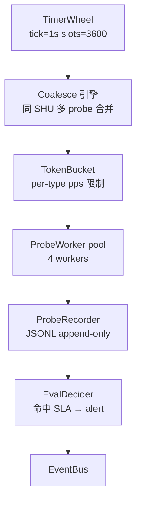
```mermaid
flowchart TB
    Timer["TimerWheel\ntick=1s slots=3600"]
    Coalesce["Coalesce 引擎\n同 SHU 多 probe 合并"]
    TokenBucket["TokenBucket\nper-type pps 限制"]
    Workers["ProbeWorker pool\n4 workers"]
    Recorder["ProbeRecorder\nJSONL append-only"]
    Decider["EvalDecider\n命中 SLA → alert"]

    Timer --> Coalesce --> TokenBucket --> Workers --> Recorder --> Decider
    Decider --> EventBus["EventBus"]
```

```cpp
namespace netdiag {

class ProbeScheduler {
public:
    void start();
    void stop();
    
    void runOneShot(const std::string& shuId);          // 触发型加紧
    void enterAlertBurst(const std::string& shuId);     // 进入加紧模式
    void exitAlertBurst(const std::string& shuId);

private:
    void onTick();                                       // 每秒触发
    std::vector<ProbeJob> selectDueJobs();
    
    TimerWheel                                           timerWheel_;
    std::unordered_map<std::string, TokenBucket>         buckets_;     // per-type
    TokenBucket                                          globalBucket_;
    ProbeWorkerPool                                      workerPool_{4};
    ProbeRecorder&                                       recorder_;
    EvalDecider&                                         decider_;
};

} // namespace netdiag
```

### 13.2 Probe 类型实现

#### 13.2.1 IcmpProbe

```cpp
namespace netdiag {

class IcmpProbe : public IProbe {
public:
    ProbeResult run(const ProbeTarget& t) override {
        // 优先 SOCK_DGRAM IPPROTO_ICMP (不需 CAP_NET_RAW)
        int s = ::socket(AF_INET, SOCK_DGRAM | SOCK_CLOEXEC, IPPROTO_ICMP);
        if (s < 0 && errno == EACCES) {
            // 降级 raw socket
            s = ::socket(AF_INET, SOCK_RAW | SOCK_CLOEXEC, IPPROTO_ICMP);
        }
        if (s < 0) return ProbeResult::blocked("socket failed");
        
        if (!t.iface.empty()) {
            ::setsockopt(s, SOL_SOCKET, SO_BINDTODEVICE,
                         t.iface.c_str(), t.iface.size());
        }
        
        struct timeval timeout{t.timeoutSec, 0};
        ::setsockopt(s, SOL_SOCKET, SO_RCVTIMEO, &timeout, sizeof(timeout));
        
        ProbeResult r;
        for (int i = 0; i < t.count; ++i) {
            auto sendTs = Clock::instance().bootTimeMs();
            sendIcmpEcho(s, t.target, i, t.sizeBytes);
            
            if (recvIcmpReply(s, i)) {
                auto rtt = Clock::instance().bootTimeMs() - sendTs;
                r.rttMs.push_back(rtt);
            } else {
                r.lostCount++;
            }
            
            if (i + 1 < t.count) {
                std::this_thread::sleep_for(std::chrono::milliseconds(200));
            }
        }
        ::close(s);
        
        r.lossPct = (r.lostCount * 100.0) / t.count;
        r.status = computeStatus(r, t.sla);
        return r;
    }
};

} // namespace netdiag
```

#### 13.2.2 IcmpPmtuProbe（G2 新增）

```cpp
namespace netdiag {

class IcmpPmtuProbe : public IProbe {
public:
    ProbeResult run(const ProbeTarget& t) override {
        int s = ::socket(AF_INET, SOCK_DGRAM | SOCK_CLOEXEC, IPPROTO_ICMP);
        if (s < 0) return ProbeResult::blocked("socket failed");
        
        // DF=1 强制不分片
        int discoverFlag = IP_PMTUDISC_DO;
        ::setsockopt(s, IPPROTO_IP, IP_MTU_DISCOVER,
                     &discoverFlag, sizeof(discoverFlag));
        
        // 默认大包 1472（1500 MTU - 20 IP - 8 ICMP）
        const size_t payloadSize = t.sizeBytes ? t.sizeBytes : 1472;
        
        ProbeResult r;
        sendIcmpEchoLargePacket(s, t.target, payloadSize);
        
        if (recvIcmpReply(s)) {
            r.status = ProbeStatus::PASS;
        } else if (recvIcmpFragNeeded(s)) {
            r.status = ProbeStatus::FAIL;
            r.note = "PMTU mismatch (DF set, frag needed received)";
        } else {
            r.status = ProbeStatus::FAIL;
            r.note = "PMTU blackhole (no reply within timeout)";
        }
        
        ::close(s);
        return r;
    }
};

} // namespace netdiag
```

#### 13.2.3 DnsProbe

```cpp
namespace netdiag {

class DnsProbe : public IProbe {
public:
    ProbeResult run(const ProbeTarget& t) override {
        // 直接构造 DNS 查询，不用系统 resolver（绕过 cache）
        auto query = buildDnsQuery(t.targetDomain, randomQid());
        
        int s = ::socket(AF_INET, SOCK_DGRAM | SOCK_CLOEXEC, IPPROTO_UDP);
        bindToIface(s, t.iface);
        
        sockaddr_in dst{};
        dst.sin_family = AF_INET;
        dst.sin_port = htons(53);
        inet_pton(AF_INET, t.targetDnsServer.c_str(), &dst.sin_addr);
        
        auto sendTs = Clock::instance().bootTimeMs();
        ::sendto(s, query.data(), query.size(), 0,
                 reinterpret_cast<sockaddr*>(&dst), sizeof(dst));
        
        char buf[512];
        struct timeval timeout{t.timeoutSec, 0};
        ::setsockopt(s, SOL_SOCKET, SO_RCVTIMEO, &timeout, sizeof(timeout));
        
        ssize_t n = ::recv(s, buf, sizeof(buf), 0);
        ::close(s);
        
        ProbeResult r;
        if (n <= 0) {
            r.status = ProbeStatus::FAIL;
            r.note = "DNS query timeout";
        } else {
            r.rttMs.push_back(Clock::instance().bootTimeMs() - sendTs);
            parseAnswerToIps(buf, n, r.resolvedIps);
            r.status = r.resolvedIps.empty()
                ? ProbeStatus::FAIL : ProbeStatus::PASS;
        }
        return r;
    }
};

} // namespace netdiag
```

#### 13.2.4 GvmPerspectiveProbe（PVM 端模拟 GVM 视角，G1 修正）

```cpp
namespace netdiag {

class GvmPerspectiveProbe : public IProbe {
public:
    ProbeResult run(const ProbeTarget& t) override {
        // raw socket + IP_HDRINCL 手动构造 IP 头
        int s = ::socket(AF_INET, SOCK_RAW | SOCK_CLOEXEC, IPPROTO_ICMP);
        if (s < 0) return ProbeResult::blocked("raw socket failed (need CAP_NET_RAW)");
        
        int hdrIncl = 1;
        ::setsockopt(s, IPPROTO_IP, IP_HDRINCL, &hdrIncl, sizeof(hdrIncl));
        
        // 构造 IP 包：src=10.10.103.40 (伪装 GVM), dst=172.16.103.20
        IpPacket pkt = buildIpPacket(t.srcIp, t.target, IPPROTO_ICMP, makeIcmpEcho());
        
        sockaddr_in dst{};
        dst.sin_family = AF_INET;
        inet_pton(AF_INET, t.target.c_str(), &dst.sin_addr);
        
        auto sendTs = Clock::instance().bootTimeMs();
        ::sendto(s, pkt.data(), pkt.size(), 0,
                 reinterpret_cast<sockaddr*>(&dst), sizeof(dst));
        
        // 监听 ICMP echo reply, 过滤 src=target dst=t.srcIp 的回包
        ProbeResult r;
        if (recvFilteredIcmpReply(s, t.target, t.srcIp)) {
            r.rttMs.push_back(Clock::instance().bootTimeMs() - sendTs);
            r.status = ProbeStatus::PASS;
        } else {
            r.status = ProbeStatus::FAIL;
            r.note = "GVM perspective probe failed: NAT/forwarding path issue";
        }
        ::close(s);
        return r;
    }
};

} // namespace netdiag
```

#### 13.2.5 RttBurstProbe（G3 间歇故障）

```cpp
namespace netdiag {

class RttBurstProbe : public IProbe {
public:
    ProbeResult run(const ProbeTarget& t) override {
        ProbeResult r;
        
        // 30 包 × 1s 间隔 = 30s 总耗时
        for (int i = 0; i < 30; ++i) {
            auto pkt = IcmpProbe::sendOne(t);
            r.rttMs.push_back(pkt.rttMs);
            r.lostCount += pkt.lost ? 1 : 0;
            std::this_thread::sleep_for(std::chrono::seconds(1));
        }
        
        r.computeStatistics();  // p50/p95/p99/jitter
        return r;
    }
};

} // namespace netdiag
```

### 13.3 加紧策略量化（G10）

```
default state: 按 SHU 配置周期 (60s/300s)

trigger: 任一 probe 失败检测到
 → ALERT_BURST 模式
 → 周期 1s/包，count=5
 → 5 包内 ≥3 包失败 → FAIL terminal
 → 1 包失败 → 再来一轮 5 包（最多 3 轮 = 15s）
 → 仍持续失败 → final FAIL，触发 RttBurstProbe

exit ALERT_BURST: 
  - 任一成功 → 回归正常周期
  - 3 轮全失败 → 进入 30s probe 间隔（防资源占用），同时上报 FAIL
```

### 13.4 Probe 目标按 SKU

```jsonc
"probes_dynamic_targets": {
  "SHU_VLAN3_INTERNET": {
    "sku_DEFAULT": {"icmp_uplink":"<project_endpoint>", "dns_test":"www.example.com"},
    "sku_CN":      {"icmp_uplink":"<cn_endpoint>",       "dns_test":"www.baidu.com"},
    "sku_EU":      {"icmp_uplink":"<eu_endpoint>",       "dns_test":"www.cloudflare.com"}
  }
}
```

启动时按 `sku` 选定；运行时通过 NDGA `dynamic_target` RPC 可热切换。

### 13.5 资源约束

| 约束 | 值 | 实现 |
|---|---|---|
| 单 SHU probe 频率 | ≤1 包/秒（含 burst） | TokenBucket per SHU |
| 总 probe pps | ≤100 | TokenBucket 全局 |
| DNS probe | ≤5 次/分钟 | 单独计数器 |
| ICMP burst | 30 包/30s 仅 SHU FAIL 时 | 标志位 |
| HTTP probe | v1 关闭 | 标志位 |
| 抓包时长 | tcpdump_max_sec=10 | 启动参数 |

### 13.6 PERF-003 吞吐计算算法

```
读 /proc/net/dev 两次采样 t1 / t2，间隔 W = 60s

对每个接口 i:
  rx_bps = (rx_bytes[t2] - rx_bytes[t1]) * 8 / W
  tx_bps = (tx_bytes[t2] - tx_bytes[t1]) * 8 / W
  rx_pps = (rx_packets[t2] - rx_packets[t1]) / W
  tx_pps = (tx_packets[t2] - tx_packets[t1]) / W

输出每接口 max_rx_bps_24h, current_rx_bps
when current > 5 × daily_avg → 上报 INFO（业务突发监测）
```

---

## 14. 采集器设计

### 14.1 命令并行执行

```cpp
namespace netdiag {

class CommandRunner {
public:
    struct CmdResult {
        std::string  name;
        int          exitCode;
        std::string  output;
        bool         truncated;
        uint64_t     elapsedMs;
        BlockedSeverity blockedSev;
    };

    CmdResult        runOne(const CommandSpec& spec);
    std::vector<CmdResult>  runParallel(const std::vector<CommandSpec>& specs);

private:
    ResourceGuard&   resourceGuard_;
    ThreadPool       pool_{4};
};

std::vector<CmdResult> CommandRunner::runParallel(
        const std::vector<CommandSpec>& specs) {
    // ResourceGuard 过滤掉高 conntrack 时应跳过的重命令
    auto filtered = resourceGuard_.filterCommands(specs);
    
    std::vector<std::future<CmdResult>> futures;
    for (const auto& spec : filtered) {
        futures.push_back(pool_.submit([this, spec]{
            return runOne(spec);
        }));
    }
    
    std::vector<CmdResult> results;
    for (auto& f : futures) {
        results.push_back(f.get());
    }
    return results;
}

} // namespace netdiag
```

### 14.2 BLOCKED 分级实现

```cpp
namespace netdiag {

enum class BlockedSeverity {
    NONE,
    L1_env,         // 环境性，如 user 镜像没 ethtool
    L2_anomaly,     // 异常，如曾经能跑突然失败
    L3_intermittent // 间歇，命令偶尔超时
};

class CommandSpec {
public:
    std::string  name;
    std::string  cmd;
    int          timeoutSec;
    size_t       maxOutputKb;
    BlockedSeverity defaultBlockedSev = BlockedSeverity::L1_env;
    bool         requireCapability = false;
    std::string  capabilityName;     // ethtool / tcpdump / conntrack
};

class CommandRunner::CmdResult CommandRunner::runOne(const CommandSpec& spec) {
    // 启动时探测过的能力
    if (spec.requireCapability && !Capability::instance().has(spec.capabilityName)) {
        return CmdResult{
            .name = spec.name,
            .exitCode = -ENOSYS,
            .blockedSev = BlockedSeverity::L1_env,
        };
    }
    
    auto& cap = Capability::instance().getCommandCapability(spec.name);
    
    auto result = forkExecAndCollect(spec);
    
    if (result.exitCode == -ETIMEDOUT) {
        // 重试一次再判（L3_intermittent）
        result = forkExecAndCollect(spec);
        if (result.exitCode == -ETIMEDOUT) {
            result.blockedSev = BlockedSeverity::L3_intermittent;
        }
    } else if (result.exitCode != 0 && cap.wasAvailable) {
        // 之前可用突然失败 → 真异常
        result.blockedSev = BlockedSeverity::L2_anomaly;
    } else if (result.exitCode != 0) {
        result.blockedSev = spec.defaultBlockedSev;  // L1_env
    }
    
    return result;
}

} // namespace netdiag
```

### 14.3 PVM 命令白名单

| Section | 命令 | 超时 | 输出上限 | 并行组 | 高压跳过 |
|---|---|---|---|---|---|
| addr | `ip -br addr` | 3s | 64 KiB | A | ✓ |
| link | `ip -d link show` | 3s | 64 KiB | A | ✓ |
| route_main | `ip route show` | 3s | 64 KiB | A | ✓ |
| route_all | `ip route show table all` | 5s | 256 KiB | B | ✓ |
| rule | `ip rule` | 3s | 32 KiB | A | ✓ |
| neigh | `ip neigh show` | 3s | 64 KiB | A | ✓ |
| iptables_nat_S | `iptables -t nat -S`（经 Adapter） | 3s | 128 KiB | B | ✓ |
| iptables_filter_S | `iptables -S` | 3s | 128 KiB | B | ✓ |
| iptables_nat_Lnv | `iptables -t nat -L -nv` | 5s | 128 KiB | C | **跳过 ≥80%** |
| iptables_filter_Lnv | `iptables -L -nv` | 5s | 128 KiB | C | **跳过 ≥80%** |
| ss_listen | `ss -ltnp` | 3s | 128 KiB | A | ✓ |
| ss_udp | `ss -lunp` | 3s | 64 KiB | A | ✓ |
| ss_state | `ss -t state established` | 5s | 256 KiB | C | **跳过 ≥80%** |
| ss_syn_sent | `ss -tn state syn-sent` | 3s | 64 KiB | A | ✓ |
| sysctl_net | `sysctl net.ipv4.*` | 3s | 8 KiB | A | ✓ |
| conntrack_full | `cat /proc/net/nf_conntrack` | 5s | 512 KiB | C | **跳过 ≥95%** |
| conntrack_count | `cat /proc/sys/net/netfilter/nf_conntrack_count` + `_max` | 1s | 1 KiB | A | ✓ |
| conntrack_state_stats | 自实现解析 `/proc/net/nf_conntrack`（UNREPLIED 比例） | 3s | 16 KiB | B | **跳过 ≥95%** |
| conntrack_buckets_timeouts | sysctl `nf_conntrack_*` | 1s | 4 KiB | A | ✓ |
| proc_net_dev | `cat /proc/net/dev` | 3s | 64 KiB | A | ✓ |
| proc_softirqs | `cat /proc/softirqs` | 3s | 16 KiB | A | ✓ |
| proc_stat | `cat /proc/stat` | 3s | 16 KiB | A | ✓ |
| carrier_changes | shell loop `cat /sys/class/net/*/carrier_changes` | 3s | 4 KiB | A | ✓ |
| ethtool | `ethtool eth0 ; ethtool eth1` | 5s | 16 KiB | B | ✓ |

并行组：A = 立即可执行；B = 中等开销；C = 重操作，高压时跳过。

### 14.4 GVM 命令白名单

| Section | 命令 | 超时 | 输出上限 | 并行组 |
|---|---|---|---|---|
| addr | `ip -br addr` | 3s | 64 KiB | A |
| link | `ip -d link show` | 3s | 64 KiB | A |
| route_all | `ip route show table all` | 5s | 256 KiB | B |
| rule | `ip rule` | 3s | 32 KiB | A |
| neigh | `ip neigh show` | 3s | 32 KiB | A |
| ss_listen | `ss -ltnp` | 3s | 128 KiB | A |
| ss_udp | `ss -lunp` | 3s | 64 KiB | A |
| ss_syn_sent | `ss -tn state syn-sent` | 3s | 32 KiB | A |
| proc_net_dev | `cat /proc/net/dev` | 3s | 64 KiB | A |
| carrier_changes | shell loop | 3s | 4 KiB | A |
| dumpsys_brief | `dumpsys connectivity --short` 或 head -200 | 3s | 32 KiB | B |
| dumpsys_full | `dumpsys connectivity` | 5s | 256 KiB | C |
| ndc | `ndc network list` | 3s | 16 KiB | A |
| netd_state | `dumpsys netd` 简化版 | 3s | 32 KiB | B |

### 14.5 Netfilter 抽象层（G8）

```cpp
namespace netdiag {

struct NatRule {
    std::string  chain;
    std::string  inIface;
    std::string  outIface;
    std::string  srcIp;
    std::string  dstIp;
    std::string  proto;
    std::string  target;       // DNAT / SNAT / ACCEPT / DROP
    std::string  to;
    int          position;
    uint64_t     pktCount;
    uint64_t     byteCount;
};

class NetfilterCollector {
public:
    virtual ~NetfilterCollector() = default;
    virtual std::vector<NatRule>    listNatRules() = 0;
    virtual std::vector<FilterRule> listFilterRules() = 0;
    virtual NatCounters             getNatCounters(int sampleSeq) = 0;
    virtual std::string             dumpRaw() = 0;
};

class IptablesAdapter : public NetfilterCollector {
public:
    std::vector<NatRule> listNatRules() override;
    // ... 调 iptables -t nat -S 解析
};

class NftAdapter : public NetfilterCollector {
public:
    std::vector<NatRule> listNatRules() override;
    // ... 调 nft list table nat 解析
};

std::unique_ptr<NetfilterCollector> createNetfilterCollector() {
    if (Capability::instance().has("nft") && Capability::instance().nftWorks()) {
        return std::make_unique<NftAdapter>();
    }
    if (Capability::instance().has("iptables")) {
        return std::make_unique<IptablesAdapter>();
    }
    throw std::runtime_error("No netfilter tool available");
}

} // namespace netdiag
```

`expect.must_contain` 检查在抽象层之上做：用结构化 `NatRule { chain, inIface, dstIp, proto, dportNot, target, to }` 比较而非字符串。

### 14.6 conntrack_state_stats 实现

```cpp
namespace netdiag {

struct ConntrackStateStats {
    uint64_t total          = 0;
    uint64_t unreplied      = 0;
    uint64_t invalid        = 0;
    uint64_t established    = 0;
    uint64_t synSent        = 0;
    double   unrepliedPct   = 0;
    bool     truncated      = false;
    
    struct VlanBucket {
        uint64_t total;
        uint64_t unreplied;
        double   unrepliedPct;
    };
    std::unordered_map<std::string, VlanBucket>  byVlan;
};

ConntrackStateStats ConntrackStateCollector::collect() {
    ConntrackStateStats s;
    
    auto f = util::makeUniqueFile(::fopen("/proc/net/nf_conntrack", "r"));
    if (!f) return s;
    
    char line[1024];
    constexpr int kMaxLines = 5000;
    int lineCount = 0;
    
    while (::fgets(line, sizeof(line), f.get())) {
        if (++lineCount > kMaxLines) {
            s.truncated = true;
            break;
        }
        s.total++;
        
        if (strstr(line, "[UNREPLIED]")) s.unreplied++;
        if (strstr(line, "[INVALID]"))   s.invalid++;
        if (strstr(line, "ESTABLISHED")) s.established++;
        if (strstr(line, "SYN_SENT"))    s.synSent++;
        
        // 按 dst_ip 反推 VLAN
        updateVlanBucket(line, s);
    }
    
    if (s.total > 0) {
        s.unrepliedPct = (s.unreplied * 100.0) / s.total;
    }
    return s;
}

} // namespace netdiag
```

---

## 15. 取证目录

### 15.1 目录结构

```
/log/perf/network_diag/                          # PVM 端
├── incidents/
│   ├── 20260511/
│   │   └── a1b2/                                # 短 path_id = fault_id 前 4 hex
│   │       ├── manifest.json                    # incident 元信息（最后写）
│   │       ├── event.json                       # polaris 事件 payload 副本
│   │       ├── baseline_diff.json
│   │       ├── pvm/
│   │       │   ├── ip_addr.txt
│   │       │   ├── ip_link.txt
│   │       │   ├── ip_route_all.txt
│   │       │   ├── ip_rule.txt
│   │       │   ├── ip_neigh.txt
│   │       │   ├── iptables_nat_S.txt
│   │       │   ├── iptables_nat_Lnv.txt
│   │       │   ├── iptables_filter.txt
│   │       │   ├── ss_listen.txt
│   │       │   ├── ss_syn_sent.txt
│   │       │   ├── sysctl_net.txt
│   │       │   ├── proc_net_dev.txt
│   │       │   ├── conntrack_count_max.txt
│   │       │   ├── conntrack_state_breakdown.txt
│   │       │   ├── dmesg_conntrack.txt
│   │       │   ├── carrier_changes.txt
│   │       │   ├── ethtool_eth0.txt
│   │       │   └── tcpdump_eth1.4.pcap
│   │       ├── gvm/                              # GVM 补归因时写入
│   │       │   ├── ip_addr.txt
│   │       │   ├── ip_route_all.txt
│   │       │   ├── ip_rule.txt
│   │       │   ├── ss_listen.txt
│   │       │   ├── dumpsys_connectivity_brief.txt
│   │       │   └── ndc_network_list.txt
│   │       ├── probes_window.jsonl              # 最近 20 条 probe 记录
│   │       └── derived_events.json
├── snaps/
│   └── 20260511/
│       └── snap_153000_VLAN3GW/                  # GVM push 携带的快照
└── probes/
    ├── SHU_VLAN3_INTERNET.jsonl                  # 24h 滚动
    ├── SHU_DNS.jsonl
    └── ...
└── state/
    └── active_faults.json                        # 状态机持久化
```

GVM 镜像访问：`/mnt/vendor/log/perf/network_diag/...`

### 15.2 manifest.json schema

```jsonc
{
  "schema_version":      "1.1",
  "incident_id":         "incident_20260511_153012_LINKDOWN_a1b2",
  "fault_id":            "a1b2c3d4e5f60718",
  "correlation_id":      "d4e5f607",
  "fault_class":         "LINK_DOWN",
  "target_key":          "eth1",
  "severity":            "FAIL",

  // 时钟
  "first_seen_ts_unix":  1747788015,
  "first_seen_ts_boot":  15200,
  "pvm_boot_id":         "f0b8c3a5e1d27a89",
  "boot_offset_pvm_gvm": 46800,                   // GVM 比 PVM 晚启动多久 (ms)
  "gvm_collect_ts_boot": 62000,                   // GVM 视角采集时间

  // 版本
  "config_version":      "v1.0-2026-05-09",
  "baseline_version":    "v1.0-2026-05-09",
  "diag_version":        "1.0.0",
  "platform":            "SA8397",

  // 数据质量分层（G4）
  "data_quality": {
    "pvm":  "complete",
    "gvm":  "first_pass" | "complete" | "unavailable:gvm_not_ready"
  },

  // PVM 端观察（PVM 写）
  "pvm_observations": {
    "iface_state": "...",
    "ip_addr_snapshot": "...",
    "iptables_nat_drift": "..."
  },

  // GVM 端观察（GVM 补归因时追加）
  "gvm_observations": {
    "default_network_lost":   true,
    "lost_ts_boot_ms_gvm":    1500,
    "affected_netids":        [102, 100, 101, 103],
    "affected_vlans":         [3, 6, 7, 8],
    "dns_resolver_state":     "ok_but_no_uplink",
    "gvm_ss_state_summary":   "SYN_SENT:12, ESTABLISHED:3 (loopback only)"
  },

  // 跨端综合归因
  "root_cause_consolidated": {
    "primary_class":          "LINK_DOWN",
    "primary_target":         "eth1",
    "affected_business":      ["default_internet", "ADCU_park", "OTA", "ADAS"],
    "user_visible_impact":    "All Android apps using default network cannot connect",
    "confidence":             "high"
  },

  // 演化轨迹（B4.③）
  "evolution": [
    {"ts_boot_ms":0, "severity":"FAIL", "rule":"netlink_carrier_0",
     "impacts_added":["SHU_VLAN3_INTERNET"], "delta_event_emitted":true,
     "evidence_count_at_this_point":1},
    {"ts_boot_ms":180000, "severity":"FAIL",
     "duration_milestone":"5min", "ongoing_log_emitted":true}
  ],

  // 派生事件清单（30s 聚合窗口内）
  "derived_events": [
    {"event":"NETDIAG_BASELINE_DRIFT", "when_ms":300,
     "brief":"default route via 172.16.103.20 disappeared"},
    {"event":"NETDIAG_GATEWAY_UNREACHABLE", "when_ms":500,
     "shu":"SHU_VLAN3_INTERNET", "target":"VLAN3_TBOX"},
    {"event":"NETDIAG_VM_LINK_BROKEN", "when_ms":700,
     "iface":"vmtap1.3"}
  ],

  // 证据索引
  "evidence_index": [
    {"path":"pvm/ip_link.txt", "size":2048, "sha256":"...", "sensitivity":"low"},
    {"path":"pvm/iptables_nat_S.txt", "size":4096, "sha256":"...", "sensitivity":"low"},
    {"path":"gvm/dumpsys_connectivity_brief.txt", "size":4500,
     "sha256":"...", "sensitivity":"med"}
  ],

  // 推荐操作
  "recommended_actions": [
    "Check physical cable to VCM",
    "Verify RTL9071 switch port P5 status",
    "Check ethtool eth1 for speed/duplex negotiation"
  ],

  // 恢复信息（恢复后追加）
  "recovery": {
    "recovered_ts_boot_ms":   200700,
    "duration_ms":            185500,
    "trigger":                "carrier=1"
  },

  "captured_dur_sec":    2.3,
  "size_total_kb":       1280
}
```

### 15.3 跨端写入规则

避免读写竞态（A3 约束）：

| 时刻 | 写入方 | 写入字段 |
|---|---|---|
| T_PVM 触发 fault | PVM | 完整 manifest（PVM 视角），写 `data_quality.gvm = "unavailable:gvm_not_ready"` |
| GVM 启动后补归因 | GVM | 追加 `gvm_observations` + `root_cause_consolidated` + evidence_index 中 gvm/ 条目；更新 `data_quality.gvm` |
| PVM 检测恢复 | PVM | 追加 `recovery` 段 |

约束：

- 双端**不同时写**同一文件（A3）
- 每次写都是 `rename(2)` 原子提交
- 字段层级隔离：PVM 不动 `gvm_*` 字段，GVM 不动 `pvm` 视角段 + `recovery` 段
- `data_quality` 子字段约定：PVM 仅写 `pvm`，GVM 仅写 `gvm`
- GVM 修改完成后通过 NDGA push `manifest_updated{fault_id}` 通知 PVM

### 15.4 fetch_log 分块协议（fallback）

仅在共享挂载不可用时启用。详见 §6.1.6。

### 15.5 retention 策略

```
触发：total_size > 200 MiB  OR
     count > 50              OR
     oldest > 7 days

清理顺序：
1. snaps/   保留 24h，超期直接删
2. probes/*.jsonl 仅保留 24h
3. incidents/ INFO 级 → 24h 清
4. incidents/ WARN 级 → 3 天清
5. incidents/ FAIL 级 → 7 天清

极端：磁盘 <100 MiB → 强制清所有 INFO + WARN 旧数据，保留最近 5 个 FAIL
```

清理操作原子：先删文件，再更新 manifest 索引。

---

## 16. 时钟与时序

### 16.1 三时钟字段

| 字段 | 来源 | 用途 |
|---|---|---|
| `ts_unix` | `clock_gettime(CLOCK_REALTIME)` | wall-clock，云端日历展示 |
| `ts_boot` | `clock_gettime(CLOCK_BOOTTIME)` ms | 单调递增，跨 suspend，本机排序 |
| `boot_id` | `/proc/sys/kernel/random/boot_id` | 启动 epoch 标识 |

### 16.2 内部状态机一律 BOOTTIME

```cpp
namespace netdiag {

class IncidentDeduper {
    struct ActiveIncident {
        uint64_t  firstSeenBootMs;   // CLOCK_BOOTTIME
        // ...
    };
};

class FaultStateMachine {
    uint64_t  recoveryDebounceStartBootMs;   // BOOTTIME
};

class Timer {
    static TimerHandle schedule(int delayMs, std::function<void()> cb);
    // 内部使用 timerfd_create(CLOCK_BOOTTIME, ...)
};

} // namespace netdiag
```

所有计时器（trigger_min_gap、recovery debounce、fallback timer、probe interval）一律 BOOTTIME。

### 16.3 时间偏差检测（RPT-005）

```cpp
namespace netdiag {

class TimeSkewDetector {
public:
    void start();

private:
    void check();
    
    static constexpr int  kCheckIntervalSec    = 60;
    static constexpr int  kSkewWarnMs          = 5000;
    static constexpr int  kSkewFailMs          = 60000;
};

void TimeSkewDetector::check() {
    if (!NdgaServer::instance().isOnline()) return;
    
    // 通过 NDGA ping 获取 GVM 时间
    auto resp = NdgaServer::instance().request("ping", {});
    if (resp.code != 0) return;
    
    const int64_t pvmTsUnix = Clock::instance().wallTimeUnix();
    const int64_t gvmTsUnix = resp.data["gvm_ts_unix"].asInt64();
    const int64_t rttMs = resp.elapsedMs;
    
    // 减去 RTT/2 估计单向延迟
    const int64_t skewMs = std::abs(pvmTsUnix * 1000 - gvmTsUnix * 1000) - rttMs / 2;
    
    if (skewMs > kSkewFailMs) {
        EventBus::instance().tryPost(makeTimeSkewEvent(skewMs, "FAIL"));
    } else if (skewMs > kSkewWarnMs) {
        EventBus::instance().tryPost(makeTimeSkewEvent(skewMs, "WARN"));
    }
}

} // namespace netdiag
```

### 16.4 Boot Warmup 时序

```
+-----+ T+0       systemd 拉起，main() 入口
|     |
|     | T+10s     Bootstrap Phase 1-3 完成
|     |
|     | T+10s     进入 Boot Warmup（boot_warmup_sec = 120s）
|     |
|     | T+10..130s 信号源开始采样，所有事件输出降级 INFO，不发 polaris
|     |            ┌── 物理 link DOWN 仍立即 FAIL（硬故障豁免）
|     |            ├── conntrack table full 仍立即 FAIL
|     |            └── 其他事件 → INFO 级，写本地 boot_warmup.log
|     |
| 130 | T+130s    Boot Warmup 结束
|     |
+-----+ - 重新评估所有信号当前状态
        - 真正存在的故障在此刻进入正式上报通道
        - 触发首次 NETDIAG_SCAN_REPORT (INFO)
        - 进入正常运行模式
```

每个信号源可单独配置 `warmup_sec`：

```jsonc
"watchdogs": [
  {"id":"WD_PVM_NEIGH", "warmup_sec":180,
   "_note":"网关 ARP 解析需要更长时间"},
  {"id":"WD_PVM_CONNTRACK_PCT", "warmup_sec":30,
   "_note":"conntrack 计数从 0 起步"}
]
```

---

## 17. 维护模式与可观测性

### 17.1 维护模式

通过 NDGA `set_maintenance` RPC 设置：

```jsonc
{
  "enable":       true | false,
  "scope":        ["VLAN4","SHU_VLAN15_RTSP"],   // 可空 = 全局
  "duration_sec": 600,
  "reason":       "DoIP 标定流程 / OTA 升级 / IDPS 测试",
  "issuer":       "PolarisAgent.User",
  "max_duration_sec_capped": 3600
}
```

行为：

- 期内 scope 内告警全部降级 INFO，不发 polaris event
- watchdog 仍采样写本地（manifest 标 `in_maintenance:true`）
- 超过 `max_duration_sec_capped` 强制结束
- 进入/退出都发 `NETDIAG_SCAN_REPORT(INFO)` 标识时间窗

```cpp
namespace netdiag {

class MaintenanceMode {
public:
    void enable(const MaintenanceConfig& cfg);
    void disable();
    
    bool isInScope(const Fault& f) const;

private:
    std::optional<MaintenanceConfig>  active_;
    TimerHandle                       capTimer_;
};

} // namespace netdiag
```

### 17.2 持续故障 ongoing log

```cpp
void FaultStateMachine::tickOngoing() {
    auto now = Clock::instance().bootTimeMs();
    for (auto& [fid, state] : activeFaults_) {
        if (state.state != State::ACTIVE_ONGOING) continue;
        if (now - state.lastOngoingLogBootMs < kOngoingLogIntervalSec * 1000) continue;
        
        // 本地 syslog + polaris INFO event
        const auto ongoingPayload = composeOngoingEvent(fid, state);
        Log::info("ongoing fault_id={} class={} duration_ms={}",
                  fid, state.faultClass, now - state.firstSeenBootMs);
        PolarisDispatcher::instance().dispatchInfoOnly(ongoingPayload);
        
        state.lastOngoingLogBootMs = now;
    }
}
```

频率默认 60s 一次（`ongoing_log_interval_sec`）。

### 17.3 本地日志策略

| 日志类别 | 路径 | 用途 |
|---|---|---|
| 进程运行日志 | syslog (journald) | systemd 标准日志 |
| Boot Warmup 期事件 | `/log/perf/network_diag/boot_warmup.log` | 开机假阳性分析 |
| ongoing fault 日志 | syslog + polaris INFO | 故障持续期周期日志 |
| 维护模式日志 | `/log/perf/network_diag/maintenance_log/` | 维护期事件留底 |
| Incident manifest | `/log/perf/network_diag/incidents/<short>/` | 取证主目录 |
| Probe 滚动 | `/log/perf/network_diag/probes/<shu>.jsonl` | 探测历史 24h |
| 状态持久化 | `/log/perf/network_diag/state/active_faults.json` | 进程崩溃恢复 |

---

## 18. 安全设计

### 18.1 命令白名单只读

`CommandRunner` 通过 `posix_spawn` + 严格参数解析执行：

```cpp
namespace netdiag {

class CommandRunner {
private:
    static const std::unordered_set<std::string> kAllowedBinaries;
    static const std::unordered_set<std::string> kForbiddenSubcommands;

    bool validateSpec(const CommandSpec& spec);
};

const std::unordered_set<std::string> CommandRunner::kAllowedBinaries = {
    "ip", "ss", "iptables", "sysctl", "ethtool", "tcpdump", "cat",
    "ndc", "dumpsys", "nft", "kill"   // kill 仅用于 kill(pid, 0) 探活
};

const std::unordered_set<std::string> CommandRunner::kForbiddenSubcommands = {
    "add", "del", "flush", "-A", "-D", "-F", "-X", "-w",
    "set", "modify", "replace", "drop"
};

bool CommandRunner::validateSpec(const CommandSpec& spec) {
    // 1. binary 必须在白名单
    auto basename = util::basename(spec.binary);
    if (!kAllowedBinaries.count(basename)) return false;
    
    // 2. 参数中不得含禁用子命令
    for (const auto& arg : spec.args) {
        if (kForbiddenSubcommands.count(arg)) return false;
    }
    
    // 3. 路径参数必须在白名单目录内
    if (!validatePathArgs(spec.args)) return false;
    
    return true;
}

} // namespace netdiag
```

### 18.2 sepolicy 关键 allow（GVM）

详见 §5.2.4。要点：

- VSOCK 出向 CID=2 port=9101
- `/proc/net/*` 只读
- `/sys/class/net/*` 只读
- `/mnt/vendor/log/perf/*` 只读（共享挂载访问 PVM 取证）
- `/log/perf/network_diag/*` 读写（自有取证目录）

### 18.3 暴露面控制

- 服务基线 `documented_bind_any` 列表（baseline-pvm.json / baseline-gvm.json）
- 每项标记 `prod_action`（close / document）
- 新增 0.0.0.0 监听 → `NETDIAG_EXPOSURE_RISK` WARN
- DNAT 全端口透传 → 在 `iptables_filter` check 中输出 INFO 级暴露面清单

### 18.4 IDPS 旁路保护

`L4-NAT-001` + `SVC-003` + `SEC-004` 三重检查：

- VLAN 4 PREROUTING 必须有"`! --dport 30006`"例外规则
- 顺序：例外规则必须在通用 DNAT 之前
- PVM `xdja_idps` 必须监听 `172.16.104.40:30006/tcp`
- 任一失败 → `IDPS_BYPASS_FAIL` 事件

---

## 19. 性能评估

### 19.1 常态开销（全部 SHU PASS，60s 巡检间隔）

| 操作 | 频率 | CPU P95 | 内存峰值 | IO | 网络 pps |
|---|---|---|---|---|---|
| netlink reactor | 持续 | <5 ms/min 累积 | 4 MiB | 0 | 0 |
| inotify reactor | 持续 | <2 ms/min | 1 MiB | 0 | 0 |
| journal reactor | 持续 | 5-15 ms/min | 8 MiB | journal read | 0 |
| ProbeScheduler 60s | 1/min | 50 ms | 2 MiB | 0 | ~3 pps |
| ProbeScheduler 300s | 1/5min | 30 ms | 2 MiB | 0 | ~1 pps |
| 60s 轻量巡检 collect | 1/min | 200 ms | 16 MiB | 256 KiB read | 0 |
| 1h 全量巡检 | 1/h | 2s | 32 MiB | 1 MiB | 0 |
| ConntrackReactor poll | 1/10s | 1 ms | 1 MiB | 1 KiB | 0 |
| ConntrackStateStats 60s | 1/min | 150 ms | 4 MiB | 256-512 KiB read | 0 |
| NAT-Asymmetry 60s | 1/min | 200 ms | 4 MiB | 32 KiB | 0 |
| TCP SYN_SENT 30s | 2/min | 30 ms | 1 MiB | 8 KiB | 0 |
| ProcessWatcher | 1/5s | 1 ms | 1 MiB | 0 | 0 |
| VSOCK 心跳 | 1/30s | <1 ms | 64 KiB | 0 | 0 |

**常态 CPU 占用合计**：约 **500 ms/min ≈ 0.83%**（单核），含 v1.1 新增信号。  
**内存 RSS**：30-50 MiB。

### 19.2 异常态开销（incident 触发，路径 ②/③）

| 操作 | 单次耗时 | 累计 |
|---|---|---|
| WatchdogReactor 触发 | <5 ms | T+0 |
| 立即 collect 启动（4 worker 并行 8 命令） | P95 60-200 ms/命令 | T+0.3-0.5s |
| Probe burst（5 包 × 1s） | 5s | 并行 |
| baseline_diff 计算 | 50-200 ms | T+1.2s |
| 跨 VM RPC（NDGA collect GVM） | 100-300 ms + 1-2s GVM 采集 | T+2-3s |
| analyzer + RootCauseSolver | 100-200 ms | T+3s |
| incident_dir 写入 | 200-500 ms | T+3.5s |
| polaris_report_raw 提交 | <50 ms | T+3.5s |
| **本地闭环总（不含云）** | | **5-10s** |
| + VSOCK 9001 上行 + Agent 转云 | 200-600 ms | +0.6s |
| + 云端 RTT（4G/5G 影响）| 1-10s | +10s 最坏 |

异常态 CPU 占用峰值：**单 incident ≈ 1-2 秒 × 50% 单核 ≈ 0.5-1 秒-CPU**。

### 19.3 30s SLA 延迟预算分解（路径 ②）

| 阶段 | 优化前（串行） | 优化后（并行） |
|---|---|---|
| GVM watchdog 触发 | 1-3s | 1-3s |
| GVM 采集 5 命令 | 0.5-1s | **0.3-0.5s** |
| GVM 写 snap_dir + serialize | 0.2-0.5s | 0.2-0.5s |
| NDGA push GVM → PVM | 0.1-0.3s | 0.1-0.3s |
| PVM 路由到协调器 | 0.1-0.3s | 0.1-0.3s |
| PVM 立即采集 8 命令 | 0.5-1s | **0.3-0.5s** |
| PVM probe 加紧 5×200ms | 1-1.5s | **0.5-1s** |
| analyzer 计算 | 0.5-1s | 0.3-0.5s |
| incident_dir 写入 | 0.5-1s | **0.2-0.4s** |
| polaris commit | 0.1-0.3s | 0.1-0.3s |
| **本地闭环总** | **5-10s** | **3-7s** |

加 VSOCK B + Agent + 云端 RTT，整体 30s SLA 在 P95 可保，4G 弱信号下边缘满足 P99。

### 19.4 ResourceGuard 保护机制

| 机制 | 触发条件 | 行为 |
|---|---|---|
| ResourceGuard-A | conntrack ≥80% | 跳过 `iptables -L -nv` / `cat /proc/net/nf_conntrack` |
| ResourceGuard-B | ksoftirqd CPU >50% 持续 30s | 暂停 60s 巡检（保留 watchdog） |
| ResourceGuard-C | 内存占用 >100 MiB | 强制 retention 清理 + 拒绝新 incident |
| ResourceGuard-D | tcpdump 超时 | SIGKILL + 标记 BLOCKED |
| ResourceGuard-E | VSOCK send queue >1MB | 丢弃 INFO push，仅保留 FAIL |
| ResourceGuard-F | polaris commit -EAGAIN ≥3 次 | 暂停事件发送 30s，本地缓存 |

```cpp
namespace netdiag {

class ResourceGuard {
public:
    bool shouldSkipHeavyConntrack() const;
    bool shouldPauseScans() const;
    bool shouldRejectNewIncident() const;
    void onPolarisDrop();
    
    void tick();   // 每秒检查状态

private:
    std::atomic<int>      conntrackPct_{0};
    std::atomic<int>      ksoftirqdCpuPct_{0};
    std::atomic<uint64_t> memoryRssKb_{0};
    std::atomic<int>      polarisDropCount_{0};
};

bool ResourceGuard::shouldSkipHeavyConntrack() const {
    return conntrackPct_.load(std::memory_order_relaxed) >= 80;
}

} // namespace netdiag
```

### 19.5 性能压力测试用例

| TC | 构造 | 预期 |
|---|---|---|
| TC-PERF-001 | conntrack 注入到 95% 后触发 NAT 漂移 | iptables 命令仍正常；整体延迟 <30s |
| TC-PERF-002 | 同时触发 5 个 SHU 都 FAIL | EventBus 不丢；聚合得到 1 根+4 派生 |
| TC-PERF-003 | VSOCK 9101 流量峰值（fetch_log 16 MiB） | 不影响 watchdog 实时性；心跳不丢 |
| TC-PERF-004 | 10s 内 100 次 link flap | flapping 检测准确；不灌爆事件 |
| TC-PERF-005 | NTP 跳变 1h | 内部状态机正常；incident 聚合不混乱 |

---

## 20. 风险与降级

### 20.1 综合降级表

| 风险 | 降级策略 | BLOCKED 等级 | 报告标记 |
|---|---|---|---|
| GVM ethtool 不存在 | 跳过 L1-LINK-005 | L1_env | BLOCKED-L1 |
| `/proc/net/stat/nf_conntrack` 不存在 | 降级 count/max + dmesg | L1_env | BLOCKED-L1 + degraded_evidence |
| `dumpsys connectivity` 权限受限 | 降级 `ip rule/route` | L1_env | BLOCKED-L1 + 替代 PASS/FAIL |
| `dumpsys` 突然超时（之前 OK） | 重试 + 标 L3 | L3_intermittent | BLOCKED-L3 |
| GVM placeholder 接口 | 过滤 | INFO | INFO（不参与检查） |
| polaris commit `-EAGAIN` | 本地保留 incident_dir，下次巡检重试 | — | 内部日志 |
| polarisd 不可达 | 仅写本地 report.json + incident_dir | — | service_degraded |
| VSOCK 9101 不可用 60s | GVM 进入 fallback polaris event 链 | — | service_degraded |
| VSOCK 9101 hello 协商失败 | close + 退避重连 | — | service_degraded |
| VSOCK 9001 不可用 | 报告本地缓存（兜底于 polarisd 自身） | — | service_degraded |
| 命令执行超时 | 重试一次仍失败 BLOCKED | L3_intermittent | BLOCKED-L3 |
| tcpdump 无权限/不存在 | 跳过抓包子项 | L1_env | BLOCKED-L1 |
| 探测器自身异常 | 标 BLOCKED-L2 | L2_anomaly | BLOCKED-L2 |
| NTP 大跳变 | manifest 标 time_skew_warn，事件用 BOOTTIME | — | INFO `NETDIAG_TIME_SKEW` |
| 维护模式期内 | 降级 INFO，不触发 incident | — | INFO |
| GVM 假在线导致 side 漏发 | 8s fallback timer 兜底 | — | side event delayed |

### 20.2 灾难恢复

| 灾难 | 行为 |
|---|---|
| network-diag-pvm 崩溃 | systemd 2s 后重启；最多 5 次/分钟；启动时从 active_faults.json 恢复 |
| network-diag-gvm 崩溃 | init.rc 重启；onrestart 同样限频 |
| polarisd 长时间不可用 | 持续本地 incident，不上报；polarisd 恢复后下次 incident 触发时附带补报最近 10 个 |
| `/log/perf` 满 | 强制清理 + 拒绝新 incident（保留事件记忆 1h） |
| qcrosvm 崩溃 | 触发 `NETDIAG_HYPERVISOR_DOWN`（最高优先级根事件）；本地落盘；GVM 不可达时 PVM 单独上报 |
| pvm_boot_id 跨 boot 不一致 | 旧 active_faults.json 全部丢弃；从新 boot 重新感知 |

### 20.3 假在线兜底（review F16 修正）

```
T+0       NDGA online check 返回 true（实际 GVM 已卡）
T+0.1     PVM push fault_alert → drop / GVM 不响应
T+0.1     PVM schedule fallback timer (8s)
T+8.1     Timer 触发，gvm_root_event_acked == false
T+8.2     PVM 兜底 emit polaris side event → Cloud
T+8.3     PVM 标记 NDGA online = false
```

时序图：见 §24 SEQ-04.B。

---

## 21. 代码结构

### 21.1 顶层目录

```
network-diag/
├── conf/
│   ├── network-diag-pvm.json
│   ├── network-diag-gvm.json
│   ├── baseline-pvm.json
│   ├── baseline-gvm.json
│   ├── fault_class_dict.json
│   ├── fault_causation_graph.json
│   └── scenario-registry.json
├── pvm/                         # PVM C++ 实现
│   ├── Android.bp / CMakeLists.txt
│   ├── src/
│   │   ├── core/
│   │   ├── transport/
│   │   ├── watchdog/
│   │   ├── probe/
│   │   ├── collector/
│   │   ├── checker/
│   │   ├── analyzer/
│   │   ├── report/
│   │   ├── util/
│   │   └── main.cpp
│   └── service/
│       ├── network-diag.service
│       └── network-diag.preset
├── gvm/                         # GVM C++ 实现
│   ├── Android.bp
│   ├── src/
│   │   ├── core/
│   │   ├── transport/
│   │   ├── watchdog/
│   │   ├── collector/
│   │   ├── push/
│   │   ├── util/
│   │   └── main.cpp
│   ├── init/
│   │   └── network-diag.rc
│   └── sepolicy/
│       └── network_diag.te
├── proto/                       # 共享数据结构
│   ├── NdgaProtocol.h
│   ├── FaultEvent.h
│   ├── ManifestSchema.h
│   └── ConfigSchema.h
├── tests/
│   ├── unit/
│   ├── integration/
│   └── perf/
└── docs/
    └── README.md
```

### 21.2 关键 namespace 与类层次

```
namespace netdiag {

  // === core ===
  class Bootstrap;             // 启动协调器（单例不创建，main 持有）
  class Clock;                 // 单例
  class Config;                // 单例
  class Capability;            // 单例
  class ResourceGuard;         // 单例
  class MaintenanceMode;       // 单例
  class EventBus;              // 单例，lock-free MPSC queue
  
  // === transport ===
  namespace transport {
    class NdgaProtocol;
    class IVsockEndpoint;      // 接口
    class VsockServer;         // PVM 实现
    class VsockClient;         // GVM 实现
    class NdgaSession;
    class PolarisdClient;      // PVM only - UDS to polarisd
    class PolarisFallback;     // GVM only - libpolaris_client 兜底
  }
  
  // === watchdog ===
  namespace watchdog {
    class IWatchdog;
    class NetlinkReactor;
    class InotifyReactor;
    class JournalReactor;      // PVM only - sd-journal
    class ProcessWatcher;
    class ConntrackReactor;    // PVM only
    class NatRulesReactor;     // PVM only
    class VmtapUniReactor;     // PVM only
    class ConnectivityWatcher; // GVM only - via PolarisAgent JNI
  }
  
  // === probe ===
  namespace probe {
    class IProbe;
    class ProbeScheduler;
    class IcmpProbe;
    class IcmpPmtuProbe;
    class DnsProbe;
    class GvmPerspectiveProbe; // PVM only
    class RttBurstProbe;
    class ProbeRecorder;
    class TokenBucket;
  }
  
  // === collector ===
  namespace collect {
    class CommandRunner;
    class NetfilterCollector;
    class IptablesAdapter;
    class NftAdapter;
    class SysctlCollector;
    class ProcNetCollector;
    class ConntrackStateCollector;
    class EthtoolCollector;
    class TcpdumpRunner;
    class DumpsysSnapshot;     // GVM only
  }
  
  // === checker ===
  namespace check {
    class ICheck;
    class CheckResult;
    class CheckRunner;
    class L1LinkCheck;
    class L2VlanCheck;
    class L3RouteCheck;
    class L4NatFwCheck;
    class VirtLinkCheck;
    class L5ServiceCheck;
    class PortCheck;
    class PerfCheck;
    class SecurityCheck;
    class BaseCheck;
    class ShuEvaluator;
    class BaselineDiff;
  }
  
  // === analyzer ===
  namespace analyze {
    class FaultClassDict;
    class CausationGraph;
    class ScenarioRegistry;
    class FaultIdCalculator;
    class EventCorrelator;
    class IncidentDeduper;
    class CauseInfer;
    class VlanImpactMap;
    class FaultStateMachine;
    class ActiveFaultsRegistry;
    class ActiveFaultsPersistence;
    class BootRecovery;        // GVM only - B2.③a
  }
  
  // === report ===
  namespace report {
    class EventComposer;
    class IncidentDirWriter;
    class ManifestUpdater;
    class JsonReport;
    class PolarisDispatcher;
    class TimeSkewDetector;
  }
  
  // === util ===
  namespace util {
    uint64_t  murmur3_64(const void* data, size_t len, uint64_t seed);
    std::string  toHex(uint64_t v);
    Json::Value  parseJsonc(const std::string& content);
    std::string  sha256File(const std::string& path);
  }

} // namespace netdiag
```

### 21.3 关键接口契约

```cpp
namespace netdiag {

// === ICheck ===
class ICheck {
public:
    virtual ~ICheck() = default;
    
    // 唯一标识，如 "L4-NAT-001"
    virtual std::string id() const = 0;
    
    // 执行检查（可能调用 CommandRunner、NetfilterCollector 等）
    virtual CheckResult run(const CheckContext& ctx) = 0;
    
    // 性能预算，CheckRunner 用来决定调度
    virtual PerfBudget budget() const = 0;
};

// === IProbe ===
class IProbe {
public:
    virtual ~IProbe() = default;
    
    virtual ProbeResult run(const ProbeTarget& t) = 0;
    
    // 估算单次执行耗时（用于 scheduler 容量规划）
    virtual int estimatedMs() const = 0;
};

// === IFaultListener ===
class IFaultListener {
public:
    virtual ~IFaultListener() = default;
    virtual void onFaultDetected(const Fault& f) = 0;
    virtual void onFaultEvolved(const Fault& f, const EvolutionDelta& d) = 0;
    virtual void onFaultRecovered(const std::string& faultId,
                                  uint64_t durationMs) = 0;
};

// === IPolarisChannel ===
class IPolarisChannel {
public:
    virtual ~IPolarisChannel() = default;
    
    // 异步 fire-and-forget；返回是否入队成功
    virtual bool reportEvent(uint64_t eventId,
                             const std::string& jsonBody,
                             const std::string& logPath) = 0;
    
    virtual bool isReady() const = 0;
};

// === INdgaSession ===
class INdgaSession {
public:
    virtual ~INdgaSession() = default;
    
    // 同步 RPC
    virtual NdgaResponse request(const std::string& method,
                                 const Json::Value& args,
                                 int timeoutMs) = 0;
    
    // 异步 push
    virtual bool push(const std::string& type,
                      const Json::Value& payload) = 0;
    
    virtual bool isOnline() const = 0;
};

} // namespace netdiag
```

### 21.4 错误处理统一规范

```cpp
namespace netdiag {

// 所有内部错误码沿用 errno 风格
namespace err {
constexpr int OK              = 0;
constexpr int FAIL            = -1;
constexpr int NOT_FOUND       = -2;
constexpr int PERM_DENIED     = -3;
constexpr int LIMIT_EXCEEDED  = -4;
constexpr int CAPACITY_FULL   = -5;
constexpr int TIMEOUT         = -ETIMEDOUT;
constexpr int INVALID_ARG     = -EINVAL;
constexpr int CHECKSUM_FAIL   = -7;
constexpr int IN_MAINTENANCE  = -8;
}

// 失败必须 log 一行 + 不抛异常（除非 fatal）
#define NDIAG_CHECK_OK(expr, ...) do {                                    \
    auto __r = (expr);                                                    \
    if (__r != netdiag::err::OK) {                                        \
        LOGE("check failed: " #expr " rc=%d, ctx=%s", __r, ##__VA_ARGS__);\
        return __r;                                                       \
    }                                                                     \
} while (0)

// fatal 错误：仅 Config 加载、boot_id 读取等
[[noreturn]] void fatalExit(const char* fmt, ...);

} // namespace netdiag
```

---

## 22. 接口设计

### 22.1 polaris client SDK 对接

仅使用现有 SDK，不要求 polaris 扩展：

```cpp
// PVM 侧通过 polaris client SDK 上报事件
#include <polaris/PolarisClient.h>
#include <polaris/PolarisEventBuilder.h>

namespace netdiag::report {

class PolarisDispatcher : public IPolarisChannel {
public:
    bool reportEvent(uint64_t eventId,
                     const std::string& jsonBody,
                     const std::string& logPath) override {
        auto& client = polaris::PolarisClient::getInstance();
        client.init();      // 幂等
        
        // 构造事件
        polaris::PolarisEventBuilder builder(eventId);
        builder.setRawBody(jsonBody);
        if (!logPath.empty()) builder.setLogPath(logPath);
        
        return client.enqueue(builder.build()) == 0;
    }
    
    bool isReady() const override {
        return polaris::PolarisClient::getInstance().isInitialized();
    }
};

} // namespace netdiag::report
```

GVM 端通过 `libpolaris_client` 同样接口。

### 22.2 NDGA 协议 IDL

```cpp
namespace netdiag::transport {

// === 消息类型 ===
enum class NdgaMsgType : uint8_t {
    HELLO     = 0x01,
    REQUEST   = 0x02,
    RESPONSE  = 0x03,
    PUSH      = 0x04,
    CHUNK     = 0x05,
    ACK       = 0x06,
    PING      = 0x07,
};

// === 帧 ===
struct NdgaFrameHeader {
    uint32_t magic;       // 0x4E444741
    uint16_t version;     // 1
    uint32_t length;      // payload bytes, big-endian
    uint16_t flags;
};

constexpr uint32_t kNdgaMagic   = 0x4E444741;
constexpr uint16_t kNdgaVersion = 1;
constexpr size_t   kMaxPayload  = 4 * 1024 * 1024;
constexpr int      kChunkSize   = 256 * 1024;

// === Hello payload ===
struct HelloPayload {
    int                version;
    std::string        role;             // "pvm" / "gvm"
    std::string        diagVersion;
    std::string        bootIdShort;      // 16 hex
    uint64_t           bootTsUnix;
    std::string        configSha256;
    std::string        dictSha256;
    std::string        graphSha256;
    int                activeFaultsCount;
};

// === Request / Response ===
struct NdgaRequest {
    uint64_t           reqId;
    std::string        method;
    Json::Value        args;
    int                timeoutMs;
};

struct NdgaResponse {
    uint64_t           reqId;
    int                code;
    std::string        errmsg;
    Json::Value        data;
    std::string        logRef;
    int                elapsedMs;
};

// === Push ===
struct NdgaPush {
    std::string        type;            // "gvm_alert" / "fault_alert" / "root_emitted" / "heartbeat"
    uint64_t           tsUnix;
    uint64_t           tsBoot;
    std::string        bootId;
    Json::Value        payload;
    std::string        logRef;
};

// === Chunk ===
struct NdgaChunk {
    uint64_t           reqId;
    std::string        fileName;
    uint32_t           chunkSeq;
    uint32_t           totalChunks;
    uint64_t           totalBytes;
    std::string        sha256Partial;
    std::vector<char>  data;
};

// === RPC method 枚举（约定）===
namespace method {
constexpr const char* kCollect          = "collect";
constexpr const char* kProbe            = "probe";
constexpr const char* kSnapshot         = "snapshot";
constexpr const char* kFetchLog         = "fetch_log";
constexpr const char* kPing             = "ping";
constexpr const char* kSetMaintenance   = "set_maintenance";
constexpr const char* kDynamicTarget    = "dynamic_target";
}

// === Push type 枚举 ===
namespace pushType {
constexpr const char* kGvmAlert         = "gvm_alert";
constexpr const char* kFaultAlert       = "fault_alert";
constexpr const char* kRootEmitted      = "root_emitted";
constexpr const char* kHeartbeat        = "heartbeat";
constexpr const char* kManifestUpdated  = "manifest_updated";
}

} // namespace netdiag::transport
```

### 22.3 EventBus 内部消息

```cpp
namespace netdiag {

enum class EventType : uint16_t {
    // Watchdog 信号
    WD_LINK,
    WD_IPADDR,
    WD_ROUTE,
    WD_NEIGH,
    WD_VMTAP_OPER,
    WD_FORWARDING,
    WD_CONNTRACK_PCT,
    WD_CONNTRACK_FULL,
    WD_CONNTRACK_UNREPLIED,
    WD_NAT_ASYMMETRY,
    WD_TCP_SYN_STUCK,
    WD_HYPERVISOR,
    WD_SERVICE,
    WD_NAT_RULES,
    WD_VMTAP_UNI,
    
    // GVM 信号（GVM 内部 + 通过 NDGA 转 PVM）
    WD_GVM_LINK,
    WD_GVM_IPADDR,
    WD_GVM_CONNECTIVITY,
    WD_GVM_NETD,
    WD_GVM_RESOLVER,
    WD_GVM_TCP_SYN_STUCK,
    WD_GVM_VIRTIO_STUCK,
    
    // Probe 结果
    PROBE_RESULT,
    
    // Check 结果
    CHECK_RESULT,
    
    // App 报障
    APP_NETWORK_TROUBLE,
    
    // 时间偏差
    TIME_SKEW,
    
    // 控制
    SHUTDOWN_REQUEST,
    MAINTENANCE_CHANGED,
};

struct InternalEvent {
    EventType            type;
    uint64_t             tsBootMs;
    std::string          source;        // "watchdog" / "probe" / "check" / "app" / "ndga"
    Json::Value          data;
    std::optional<Fault> fault;         // 已识别的 fault（如适用）
};

class EventBus {
public:
    static EventBus& instance();
    
    bool tryPost(InternalEvent&& e);
    bool pop(InternalEvent& out, int timeoutMs);
    size_t pending() const;

private:
    folly::MPMCQueue<InternalEvent>  queue_{4096};
};

} // namespace netdiag
```

### 22.4 Config 加载接口

```cpp
namespace netdiag {

class Config {
public:
    static Config& instance();
    
    // 启动时调用，失败 exit
    bool loadAll(const std::string& mainConfigPath);
    
    // 访问器
    const Baseline&            pvmBaseline() const;
    const Baseline&            gvmBaseline() const;
    const FaultClassDict&      faultDict() const;
    const CausationGraph&      causationGraph() const;
    const ScenarioRegistry&    scenarios() const;
    const Policy&              policy() const;
    
    // 元信息
    std::string  configVersion() const;
    std::string  baselineVersion() const;
    std::string  dictVersion() const;
    std::string  graphVersion() const;
    
    // sha256（用于 NDGA hello 互校）
    std::string  configSha256() const;
    std::string  dictSha256() const;
    std::string  graphSha256() const;

private:
    Config() = default;
    bool loadMain(const std::string& path);
    bool loadAttachment(const std::string& path,
                       const std::string& expectedSha256,
                       std::string& outContent);
    
    std::unique_ptr<Baseline>          pvmBaseline_;
    std::unique_ptr<Baseline>          gvmBaseline_;
    std::unique_ptr<FaultClassDict>    faultDict_;
    std::unique_ptr<CausationGraph>    causationGraph_;
    std::unique_ptr<ScenarioRegistry>  scenarios_;
    Policy                             policy_;
};

} // namespace netdiag
```

### 22.5 测试钩子接口（仅 userdebug 启用）

```cpp
#ifdef NETDIAG_TEST_HOOKS_ENABLED

namespace netdiag::test {

// 故障注入接口（仅 userdebug 镜像编译启用）
class FaultInjector {
public:
    void injectFault(const std::string& faultType, const Json::Value& args);
    void clearFault(const std::string& faultId);
    void simulateNdgaDisconnect();
    void fakeConntrackPct(int pct);
    void deleteIptablesRule(const std::string& ruleId);
};

} // namespace netdiag::test

#endif
```

通过 NDGA `netdiag.test_fault` action 触发；user 镜像编译时整段排除。

---

## 23. 部署设计

### 23.1 PVM systemd unit

详见 §5.1.5。要点：

- `ExecStartPre` 创建 `/log/perf/network_diag/{incidents,snaps,probes,state}` 目录
- `CPUWeight=20`（不使用 CPUQuota 硬限）
- `MemoryMax=128M`
- `AmbientCapabilities=CAP_NET_RAW CAP_NET_ADMIN`
- `NoNewPrivileges=true` / `ProtectSystem=strict`
- `Restart=always; RestartSec=2s; StartLimitBurst=5`

### 23.2 GVM init.rc + sepolicy

详见 §5.2.4。

### 23.3 文件部署路径

```
PVM 端：
  /usr/bin/network-diag-pvm
  /usr/lib/systemd/system/network-diag.service
  /etc/polaris/network-diag-pvm.json
  /etc/polaris/baseline-pvm.json
  /etc/polaris/baseline-gvm.json          # 仅参考
  /etc/polaris/fault_class_dict.json
  /etc/polaris/fault_causation_graph.json
  /etc/polaris/scenario-registry.json

GVM 端：
  /system/bin/network-diag-gvm
  /vendor/etc/init/network-diag.rc
  /system/etc/polaris/network-diag-gvm.json
  /system/etc/polaris/baseline-gvm.json
  /system/etc/polaris/fault_class_dict.json
  /system/etc/polaris/fault_causation_graph.json
  /system/etc/polaris/scenario-registry.json
  /mnt/vendor/etc/polaris/baseline-pvm.json   # 通过共享挂载只读访问
```

### 23.4 与 polaris-monitor 协同

- 共享 `/log/perf/` 根目录，各持子目录（`fd_monitor` vs `network_diag`）
- 不竞争 polaris event_id 段（fd_monitor `0x4FXX_XXXX`，net_diag `0x4E5E_XXXX`）
- v2 候选：polaris-wide ResourceGuard 协调 200 MB 总配额

### 23.5 OTA 升级流程

1. OTA 推送时整体替换 6 个文件（配置 + 5 附件）
2. systemd restart network-diag.service
3. 启动时 sha256 校验通过 → 生效
4. 校验失败 → systemd Restart 退避，停留旧版本 + 告警

---

## 24. 时序图集

> 36 张 Mermaid 时序图，覆盖所有 NET-DIAG-* 需求的执行路径。每张图标注覆盖的需求 ID。

### 24.1 SEQ-01 — 进程启动 + Boot Warmup

**覆盖**：`MODE-001` / `MODE-005` / `BASE-001` / `BASE-004` / Boot 期 watchdog 抑制规则

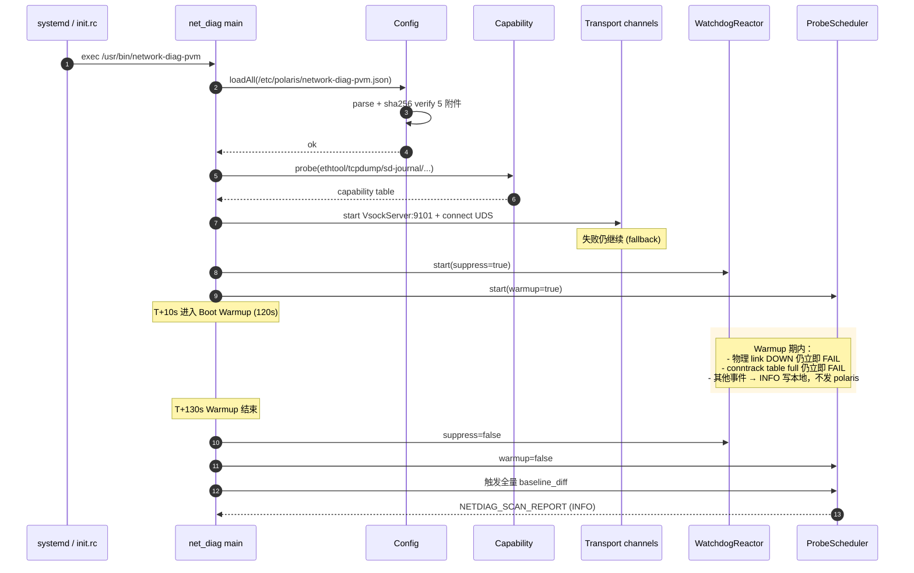
```mermaid
sequenceDiagram
    autonumber
    participant Sys as systemd / init.rc
    participant Diag as net_diag main
    participant Cfg as Config
    participant Cap as Capability
    participant Chan as Transport channels
    participant WD as WatchdogReactor
    participant Probe as ProbeScheduler
    
    Sys->>Diag: exec /usr/bin/network-diag-pvm
    Diag->>Cfg: loadAll(/etc/polaris/network-diag-pvm.json)
    Cfg->>Cfg: parse + sha256 verify 5 附件
    Cfg-->>Diag: ok
    Diag->>Cap: probe(ethtool/tcpdump/sd-journal/...)
    Cap-->>Diag: capability table
    Diag->>Chan: start VsockServer:9101 + connect UDS
    Note over Chan: 失败仍继续 (fallback)
    Diag->>WD: start(suppress=true)
    Diag->>Probe: start(warmup=true)
    Note over Diag: T+10s 进入 Boot Warmup (120s)
    rect rgba(255, 240, 200, 0.5)
        Note over WD,Probe: Warmup 期内：<br/>- 物理 link DOWN 仍立即 FAIL<br/>- conntrack table full 仍立即 FAIL<br/>- 其他事件 → INFO 写本地，不发 polaris
    end
    Note over Diag: T+130s Warmup 结束
    Diag->>WD: suppress=false
    Diag->>Probe: warmup=false
    Diag->>Probe: 触发全量 baseline_diff
    Probe-->>Diag: NETDIAG_SCAN_REPORT (INFO)
```

### 24.2 SEQ-02 — 路径①：PVM 自感知事件流

**覆盖**：所有 PVM watchdog 触发的事件 `LINK-001..006` / `VLAN-001/002/004/005/007` / `IP-003/004/005` / `ROUTE-001..003` / `NAT-001..004` / `FW-001..007` / `VM-001` / `BASE-002/003/005`

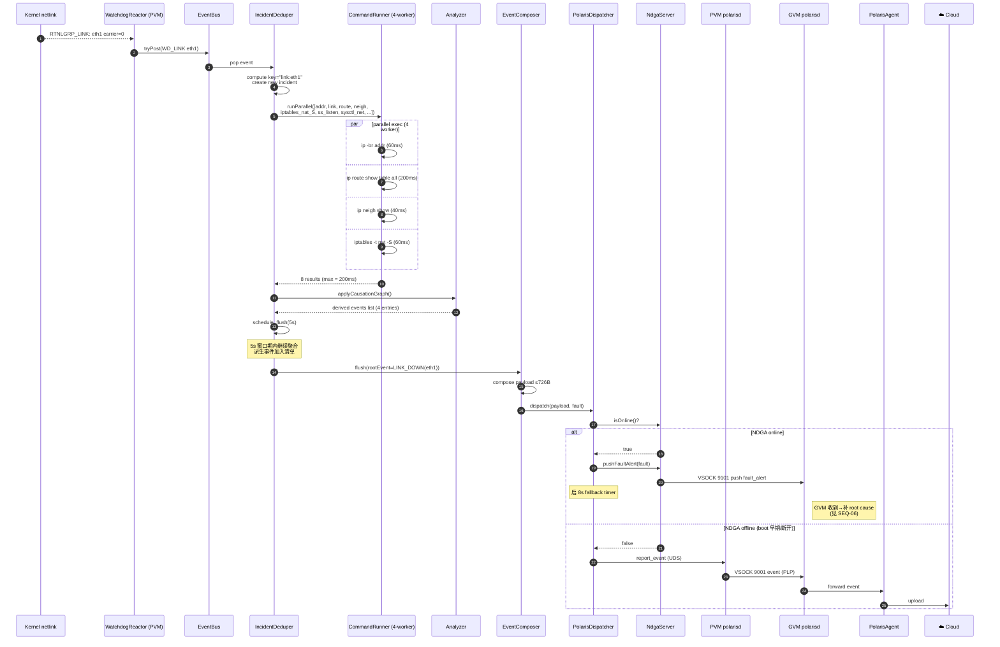
```mermaid
sequenceDiagram
    autonumber
    participant Kernel as Kernel netlink
    participant WD as WatchdogReactor (PVM)
    participant Bus as EventBus
    participant Dedup as IncidentDeduper
    participant Coll as CommandRunner (4-worker)
    participant Anal as Analyzer
    participant Comp as EventComposer
    participant Disp as PolarisDispatcher
    participant NDGA as NdgaServer
    participant Pol as PVM polarisd
    participant GVM as GVM polarisd
    participant Agent as PolarisAgent
    participant Cloud as ☁️ Cloud
    
    Kernel-->>WD: RTNLGRP_LINK: eth1 carrier=0
    WD->>Bus: tryPost(WD_LINK eth1)
    Bus->>Dedup: pop event
    Dedup->>Dedup: compute key="link:eth1"<br/>create new incident
    Dedup->>Coll: runParallel([addr, link, route, neigh,<br/>iptables_nat_S, ss_listen, sysctl_net, ...])
    par parallel exec (4 worker)
        Coll->>Coll: ip -br addr (60ms)
    and
        Coll->>Coll: ip route show table all (200ms)
    and
        Coll->>Coll: ip neigh show (40ms)
    and
        Coll->>Coll: iptables -t nat -S (60ms)
    end
    Coll-->>Dedup: 8 results (max ≈ 200ms)
    Dedup->>Anal: applyCausationGraph()
    Anal-->>Dedup: derived events list (4 entries)
    Dedup->>Dedup: schedule_flush(5s)
    Note over Dedup: 5s 窗口期内继续聚合<br/>派生事件加入清单
    Dedup->>Comp: flush(rootEvent=LINK_DOWN(eth1))
    Comp->>Comp: compose payload ≤726B
    Comp->>Disp: dispatch(payload, fault)
    Disp->>NDGA: isOnline()?
    alt NDGA online
        NDGA-->>Disp: true
        Disp->>NDGA: pushFaultAlert(fault)
        NDGA->>GVM: VSOCK 9101 push fault_alert
        Note over Disp: 启 8s fallback timer
        Note right of GVM: GVM 收到→补 root cause<br/>(见 SEQ-06)
    else NDGA offline (boot 早期/断开)
        NDGA-->>Disp: false
        Disp->>Pol: report_event (UDS)
        Pol->>GVM: VSOCK 9001 event (PLP)
        GVM->>Agent: forward event
        Agent->>Cloud: upload
    end
```

### 24.3 SEQ-03 — 路径②：GVM 主动推送 + PVM 加料

**覆盖**：`VLAN-003` / `IP-002` / `ROUTE-004/005` / `VM-003`（GVM 侧）+ `SVC-001/004/005/006`（业务可达性）

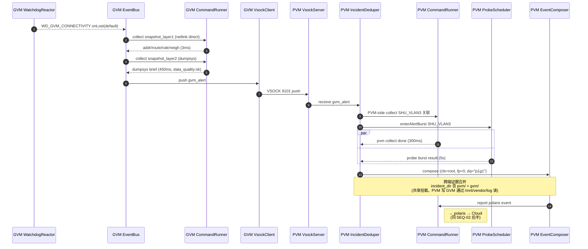
```mermaid
sequenceDiagram
    autonumber
    participant GWD as GVM WatchdogReactor
    participant GBus as GVM EventBus
    participant GColl as GVM CommandRunner
    participant GNdga as GVM VsockClient
    participant PNdga as PVM VsockServer
    participant PDedup as PVM IncidentDeduper
    participant PColl as PVM CommandRunner
    participant PProbe as PVM ProbeScheduler
    participant PComp as PVM EventComposer
    
    GWD-->>GBus: WD_GVM_CONNECTIVITY onLost(default)
    GBus->>GColl: collect snapshot_layer1 (netlink direct)
    GColl-->>GBus: addr/route/rule/neigh (3ms)
    GBus->>GColl: collect snapshot_layer2 (dumpsys)
    GColl-->>GBus: dumpsys brief (450ms, data_quality:ok)
    GBus->>GNdga: push gvm_alert
    GNdga->>PNdga: VSOCK 9101 push
    PNdga->>PDedup: receive gvm_alert
    PDedup->>PColl: PVM-side collect SHU_VLAN3 关联
    PDedup->>PProbe: enterAlertBurst SHU_VLAN3
    par
        PColl-->>PDedup: pvm collect done (300ms)
    and
        PProbe-->>PDedup: probe burst result (5s)
    end
    PDedup->>PComp: compose (cls=root, fp=0, dq="p1g1")
    Note over PDedup,PComp: 跨端证据合并<br/>incident_dir 含 pvm/ + gvm/<br/>(共享挂载，PVM 写 GVM 通过 /mnt/vendor/log 读)
    PComp->>PColl: report polaris event
    Note right of PColl: → polaris → Cloud<br/>(同 SEQ-02 后半)
```

### 24.4 SEQ-04 — 路径③：云命令下发

**覆盖**：`MODE-002` / `MODE-003` / `MODE-004`

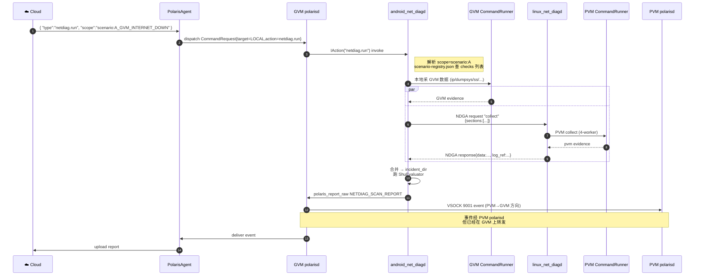
```mermaid
sequenceDiagram
    autonumber
    participant Cloud as ☁️ Cloud
    participant Agent as PolarisAgent
    participant GPol as GVM polarisd
    participant GDiag as android_net_diagd
    participant GColl as GVM CommandRunner
    participant PDiag as linux_net_diagd
    participant PColl as PVM CommandRunner
    participant PPol as PVM polarisd
    
    Cloud->>Agent: { "type":"netdiag.run", "scope":"scenario:A_GVM_INTERNET_DOWN" }
    Agent->>GPol: dispatch CommandRequest{target=LOCAL,action=netdiag.run}
    GPol->>GDiag: IAction("netdiag.run") invoke
    Note right of GDiag: 解析 scope=scenario:A<br/>scenario-registry.json 查 checks 列表
    
    GDiag->>GColl: 本地采 GVM 数据 (ip/dumpsys/ss/...)
    par
        GColl-->>GDiag: GVM evidence
    and
        GDiag->>PDiag: NDGA request "collect"<br/>{sections:[...]}
        PDiag->>PColl: PVM collect (4-worker)
        PColl-->>PDiag: pvm evidence
        PDiag-->>GDiag: NDGA response{data:..., log_ref:...}
    end
    
    GDiag->>GDiag: 合并 → incident_dir<br/>跑 ShuEvaluator
    GDiag->>GPol: polaris_report_raw NETDIAG_SCAN_REPORT
    GPol->>PPol: VSOCK 9001 event (PVM→GVM 方向)
    Note over GPol,PPol: 事件经 PVM polarisd<br/>但已经在 GVM 上转发
    GPol->>Agent: deliver event
    Agent->>Cloud: upload report
```

### 24.5 SEQ-05 — 路径④：App 主动报障

**覆盖**：`SVC-001` / `SVC-011` / `MODE-004`

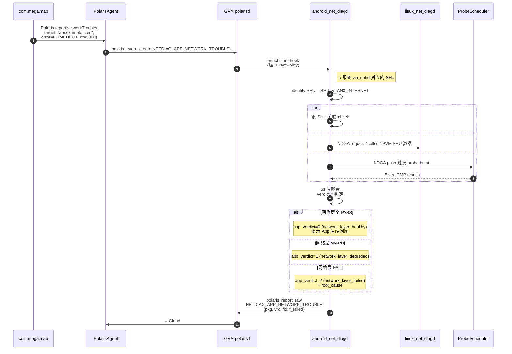
```mermaid
sequenceDiagram
    autonumber
    participant App as com.mega.map
    participant Pol as PolarisAgent
    participant GPol as GVM polarisd
    participant GDiag as android_net_diagd
    participant PDiag as linux_net_diagd
    participant PProbe as ProbeScheduler
    
    App->>Pol: Polaris.reportNetworkTrouble(<br/>  target="api.example.com",<br/>  error=ETIMEDOUT, rtt=5000)
    Pol->>GPol: polaris_event_create(NETDIAG_APP_NETWORK_TROUBLE)
    GPol->>GDiag: enrichment hook<br/>(经 IEventPolicy)
    
    Note right of GDiag: 立即查 via_netid 对应的 SHU
    GDiag->>GDiag: identify SHU = SHU_VLAN3_INTERNET
    
    par
        GDiag->>GDiag: 跑 SHU 关联 check
    and
        GDiag->>PDiag: NDGA request "collect" PVM SHU 数据
    and
        GDiag->>PProbe: NDGA push 触发 probe burst
        PProbe-->>GDiag: 5×1s ICMP results
    end
    
    GDiag->>GDiag: 5s 后聚合<br/>verdict = 判定
    
    alt 网络层全 PASS
        Note over GDiag: app_verdict=0 (network_layer_healthy)<br/>提示 App 后端问题
    else 网络层 WARN
        Note over GDiag: app_verdict=1 (network_layer_degraded)
    else 网络层 FAIL
        Note over GDiag: app_verdict=2 (network_layer_failed)<br/>+ root_cause
    end
    
    GDiag->>GPol: polaris_report_raw<br/>NETDIAG_APP_NETWORK_TROUBLE<br/>{pkg, vrd, fid:if_failed}
    GPol->>Pol: → Cloud
```

### 24.6 SEQ-06 — Boot 早期补归因（B2.③a）

**覆盖**：B2.③a 流程 + `BASE-001..004`

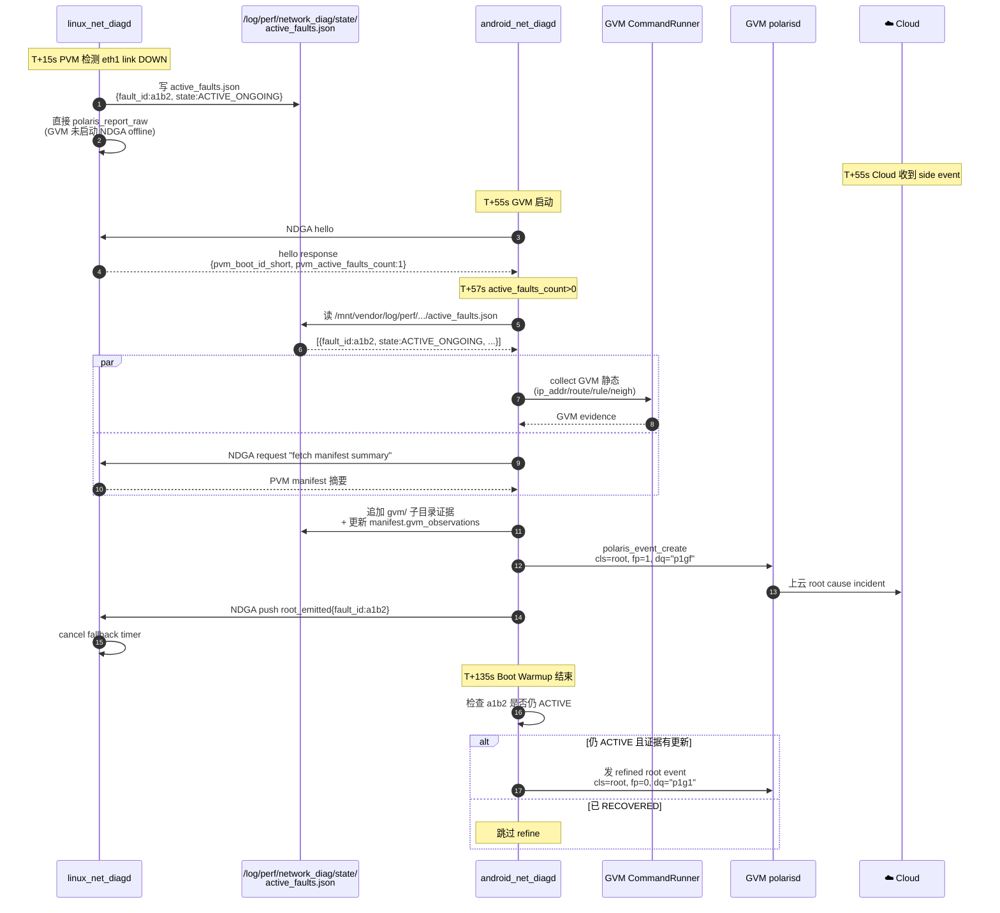
```mermaid
sequenceDiagram
    autonumber
    participant PDiag as linux_net_diagd
    participant FS as /log/perf/network_diag/state/<br/>active_faults.json
    participant GDiag as android_net_diagd
    participant GColl as GVM CommandRunner
    participant GPol as GVM polarisd
    participant Cloud as ☁️ Cloud
    
    Note over PDiag: T+15s PVM 检测 eth1 link DOWN
    PDiag->>FS: 写 active_faults.json<br/>{fault_id:a1b2, state:ACTIVE_ONGOING}
    PDiag->>PDiag: 直接 polaris_report_raw<br/>(GVM 未启动 NDGA offline)
    Note over Cloud: T+55s Cloud 收到 side event
    
    Note over GDiag: T+55s GVM 启动
    GDiag->>PDiag: NDGA hello
    PDiag-->>GDiag: hello response<br/>{pvm_boot_id_short, pvm_active_faults_count:1}
    
    Note over GDiag: T+57s active_faults_count>0
    GDiag->>FS: 读 /mnt/vendor/log/perf/.../active_faults.json
    FS-->>GDiag: [{fault_id:a1b2, state:ACTIVE_ONGOING, ...}]
    
    par
        GDiag->>GColl: collect GVM 静态<br/>(ip_addr/route/rule/neigh)
        GColl-->>GDiag: GVM evidence
    and
        GDiag->>PDiag: NDGA request "fetch manifest summary"
        PDiag-->>GDiag: PVM manifest 摘要
    end
    
    GDiag->>FS: 追加 gvm/ 子目录证据<br/>+ 更新 manifest.gvm_observations
    GDiag->>GPol: polaris_event_create<br/>cls=root, fp=1, dq="p1gf"
    GPol->>Cloud: 上云 root cause incident
    
    GDiag->>PDiag: NDGA push root_emitted{fault_id:a1b2}
    PDiag->>PDiag: cancel fallback timer
    
    Note over GDiag: T+135s Boot Warmup 结束
    GDiag->>GDiag: 检查 a1b2 是否仍 ACTIVE
    alt 仍 ACTIVE 且证据有更新
        GDiag->>GPol: 发 refined root event<br/>cls=root, fp=0, dq="p1g1"
    else 已 RECOVERED
        Note over GDiag: 跳过 refine
    end
```

### 24.7 SEQ-07 — 事件因果聚合（30s 窗口）

**覆盖**：因果聚合规则 + `BASE-002`

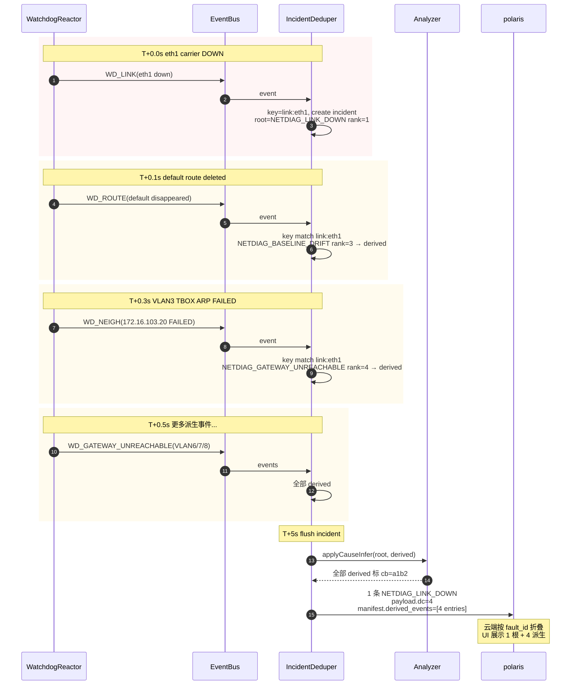
```mermaid
sequenceDiagram
    autonumber
    participant WD as WatchdogReactor
    participant Bus as EventBus
    participant Dedup as IncidentDeduper
    participant Anal as Analyzer
    participant Pol as polaris
    
    rect rgba(255, 220, 220, 0.3)
        Note over WD,Dedup: T+0.0s eth1 carrier DOWN
        WD->>Bus: WD_LINK(eth1 down)
        Bus->>Dedup: event
        Dedup->>Dedup: key=link:eth1, create incident<br/>root=NETDIAG_LINK_DOWN rank=1
    end
    
    rect rgba(255, 240, 200, 0.3)
        Note over WD,Dedup: T+0.1s default route deleted
        WD->>Bus: WD_ROUTE(default disappeared)
        Bus->>Dedup: event
        Dedup->>Dedup: key match link:eth1<br/>NETDIAG_BASELINE_DRIFT rank=3 → derived
    end
    
    rect rgba(255, 240, 200, 0.3)
        Note over WD,Dedup: T+0.3s VLAN3 TBOX ARP FAILED
        WD->>Bus: WD_NEIGH(172.16.103.20 FAILED)
        Bus->>Dedup: event
        Dedup->>Dedup: key match link:eth1<br/>NETDIAG_GATEWAY_UNREACHABLE rank=4 → derived
    end
    
    rect rgba(255, 240, 200, 0.3)
        Note over WD,Dedup: T+0.5s 更多派生事件...
        WD->>Bus: WD_GATEWAY_UNREACHABLE(VLAN6/7/8)
        Bus->>Dedup: events
        Dedup->>Dedup: 全部 derived
    end
    
    Note over Dedup: T+5s flush incident
    Dedup->>Anal: applyCauseInfer(root, derived)
    Anal-->>Dedup: 全部 derived 标 cb=a1b2
    Dedup->>Pol: 1 条 NETDIAG_LINK_DOWN<br/>payload.dc=4<br/>manifest.derived_events=[4 entries]
    Note over Pol: 云端按 fault_id 折叠<br/>UI 展示 1 根 + 4 派生
```

### 24.8 SEQ-08 — 持续故障状态机

**覆盖**：F17 状态机 + 显著演化 + recovery debounce + 抖动识别

```mermaid
sequenceDiagram
    autonumber
    participant WD as WatchdogReactor
    participant SM as FaultStateMachine
    participant FS as active_faults.json
    participant Pol as polaris
    
    Note over WD,Pol: PASS → ACTIVE_NEW
    WD->>SM: onFault(eth1 link DOWN)
    SM->>SM: state=ACTIVE_NEW, severity=FAIL
    SM->>FS: 持久化
    SM->>Pol: fault event
    
    Note over WD,Pol: ACTIVE_NEW → ACTIVE_ONGOING
    loop 每 60s
        WD->>SM: tickOngoing()
        alt 仍 FAIL
            SM->>SM: state=ACTIVE_ONGOING
            SM->>Pol: ongoing log (INFO，本地 + polaris)
        end
    end
    
    Note over WD,SM: 显著演化 (severity 升级)
    WD->>SM: onFault evolution (impacts +2 个 SHU)
    SM->>SM: 写 evolution[] + delta_event_emitted=true<br/>evidence_count++  (≤2)
    SM->>Pol: delta event (cls=root, refined=1)
    
    Note over WD,SM: 检测恢复 + debounce
    WD->>SM: onCheckPass(eth1 carrier=1)
    SM->>SM: state=RECOVERING (debounce 5s)
    
    alt 5s 内又 FAIL（抖动）
        WD->>SM: onFault again
        SM->>SM: flap_count++; cancel debounce<br/>回 ACTIVE_ONGOING
        alt flap_count >= 3
            SM->>SM: 升级 INTERMITTENT 子状态
        end
    else 5s 内持续 PASS
        SM->>SM: state=RECOVERED
        SM->>FS: 更新
        SM->>Pol: recovery event<br/>(cls=recov, dur=185500ms)
        SM->>SM: 清理 active_faults
    end
```

### 24.9 SEQ-09 — 网关不可达（端到端典型故障）

**覆盖**：场景 A 默认互联网 / `SVC-012` / `LINK-001` 等

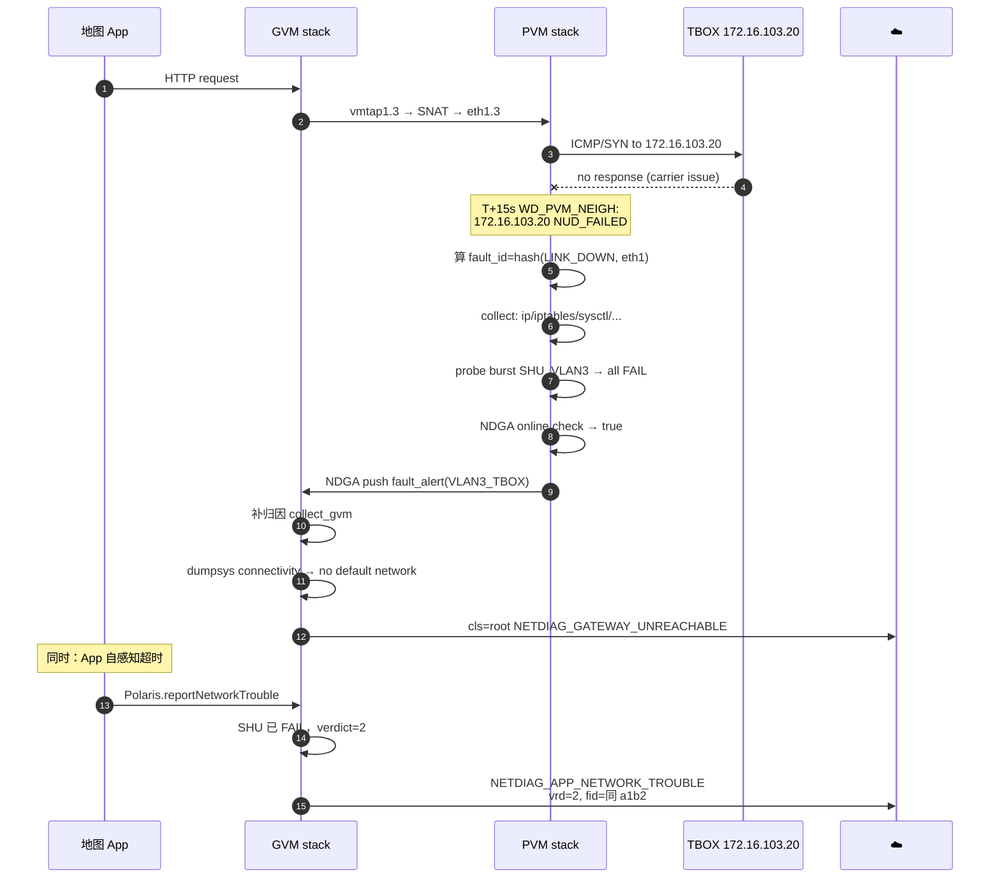
```mermaid
sequenceDiagram
    autonumber
    participant App as 地图 App
    participant GVM as GVM stack
    participant PVM as PVM stack
    participant TBOX as TBOX 172.16.103.20
    participant Cloud as ☁️
    
    App->>GVM: HTTP request
    GVM->>PVM: vmtap1.3 → SNAT → eth1.3
    PVM->>TBOX: ICMP/SYN to 172.16.103.20
    TBOX--XPVM: no response (carrier issue)
    
    Note over PVM: T+15s WD_PVM_NEIGH:<br/>172.16.103.20 NUD_FAILED
    PVM->>PVM: 算 fault_id=hash(LINK_DOWN, eth1)
    PVM->>PVM: collect: ip/iptables/sysctl/...
    PVM->>PVM: probe burst SHU_VLAN3 → all FAIL
    PVM->>PVM: NDGA online check → true
    PVM->>GVM: NDGA push fault_alert(VLAN3_TBOX)
    
    GVM->>GVM: 补归因 collect_gvm
    GVM->>GVM: dumpsys connectivity → no default network
    GVM->>Cloud: cls=root NETDIAG_GATEWAY_UNREACHABLE
    
    Note over App: 同时：App 自感知超时
    App->>GVM: Polaris.reportNetworkTrouble
    GVM->>GVM: SHU 已 FAIL，verdict=2
    GVM->>Cloud: NETDIAG_APP_NETWORK_TROUBLE<br/>vrd=2, fid=同 a1b2
```

### 24.10 SEQ-10 — conntrack 表满 / DOWNSTREAM_PACKET_LOSS

**覆盖**：场景 K + `FW-003..007` + `L4-NAT-005` / `DOWNSTREAM_PACKET_LOSS`

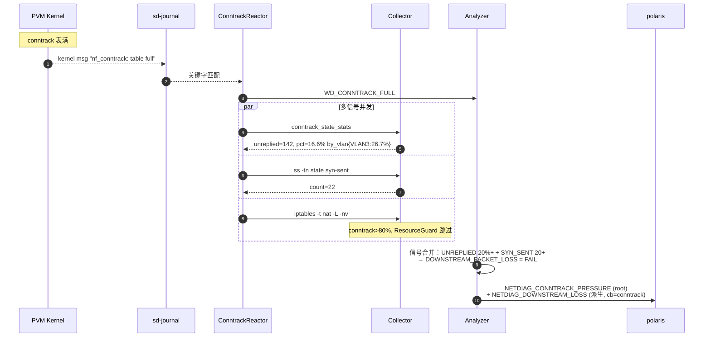
```mermaid
sequenceDiagram
    autonumber
    participant Kernel as PVM Kernel
    participant Journal as sd-journal
    participant CtR as ConntrackReactor
    participant Coll as Collector
    participant Anal as Analyzer
    participant Pol as polaris
    
    Note over Kernel: conntrack 表满
    Kernel-->>Journal: kernel msg "nf_conntrack: table full"
    Journal-->>CtR: 关键字匹配
    CtR->>Anal: WD_CONNTRACK_FULL
    
    par 多信号并发
        CtR->>Coll: conntrack_state_stats
        Coll-->>CtR: unreplied=142, pct=16.6% by_vlan{VLAN3:26.7%}
    and
        CtR->>Coll: ss -tn state syn-sent
        Coll-->>CtR: count=22
    and
        CtR->>Coll: iptables -t nat -L -nv
        Note over Coll: conntrack>80%, ResourceGuard 跳过
    end
    
    Anal->>Anal: 信号合并：UNREPLIED 20%+ + SYN_SENT 20+<br/>→ DOWNSTREAM_PACKET_LOSS = FAIL
    Anal->>Pol: NETDIAG_CONNTRACK_PRESSURE (root)<br/>+ NETDIAG_DOWNSTREAM_LOSS (派生, cb=conntrack)
```

### 24.11 SEQ-11 — NDGA 通道断连与重连

**覆盖**：通道 A 容错 + B3.② fallback

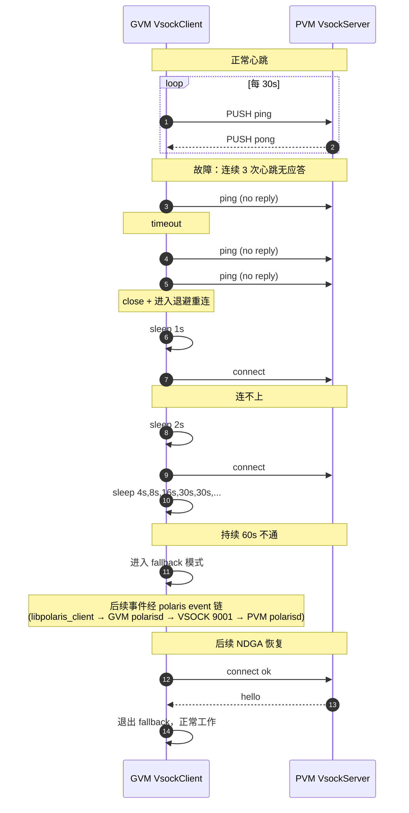
```mermaid
sequenceDiagram
    autonumber
    participant GDiag as GVM VsockClient
    participant PDiag as PVM VsockServer
    
    Note over GDiag,PDiag: 正常心跳
    loop 每 30s
        GDiag->>PDiag: PUSH ping
        PDiag-->>GDiag: PUSH pong
    end
    
    Note over GDiag,PDiag: 故障：连续 3 次心跳无应答
    GDiag->>PDiag: ping (no reply)
    Note over GDiag: timeout
    GDiag->>PDiag: ping (no reply)
    GDiag->>PDiag: ping (no reply)
    Note over GDiag: close + 进入退避重连
    
    GDiag->>GDiag: sleep 1s
    GDiag->>PDiag: connect
    Note over GDiag,PDiag: 连不上
    GDiag->>GDiag: sleep 2s
    GDiag->>PDiag: connect
    GDiag->>GDiag: sleep 4s,8s,16s,30s,30s,...
    
    Note over GDiag,PDiag: 持续 60s 不通
    GDiag->>GDiag: 进入 fallback 模式
    Note over GDiag: 后续事件经 polaris event 链<br/>(libpolaris_client → GVM polarisd → VSOCK 9001 → PVM polarisd)
    
    Note over GDiag,PDiag: 后续 NDGA 恢复
    GDiag->>PDiag: connect ok
    PDiag-->>GDiag: hello
    GDiag->>GDiag: 退出 fallback，正常工作
```

### 24.12 SEQ-12 — 维护模式启用/退出

**覆盖**：`MODE-005` + 维护模式接口

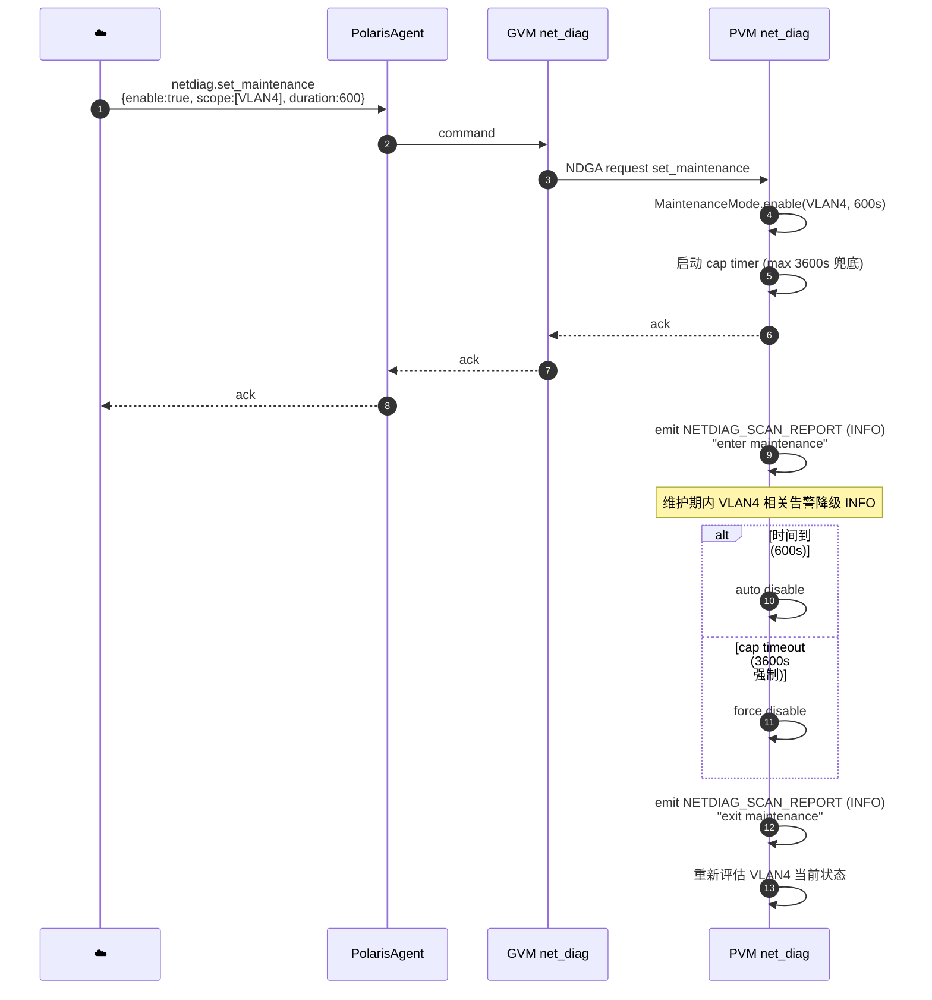
```mermaid
sequenceDiagram
    autonumber
    participant Cloud as ☁️
    participant Agent as PolarisAgent
    participant GDiag as GVM net_diag
    participant PDiag as PVM net_diag
    
    Cloud->>Agent: netdiag.set_maintenance<br/>{enable:true, scope:[VLAN4], duration:600}
    Agent->>GDiag: command
    GDiag->>PDiag: NDGA request set_maintenance
    PDiag->>PDiag: MaintenanceMode.enable(VLAN4, 600s)
    PDiag->>PDiag: 启动 cap timer (max 3600s 兜底)
    PDiag-->>GDiag: ack
    GDiag-->>Agent: ack
    Agent-->>Cloud: ack
    
    PDiag->>PDiag: emit NETDIAG_SCAN_REPORT (INFO)<br/>"enter maintenance"
    
    Note over PDiag: 维护期内 VLAN4 相关告警降级 INFO
    
    alt 时间到 (600s)
        PDiag->>PDiag: auto disable
    else cap timeout (3600s 强制)
        PDiag->>PDiag: force disable
    end
    
    PDiag->>PDiag: emit NETDIAG_SCAN_REPORT (INFO)<br/>"exit maintenance"
    PDiag->>PDiag: 重新评估 VLAN4 当前状态
```

### 24.13 SEQ-13..20 — 各类 Check 流程模板

> 检查项流程相对统一，每类一张代表图覆盖所有 NET-DIAG-* 同类需求。

#### SEQ-13 — L1 物理链路 check（覆盖 `LINK-001..006`）

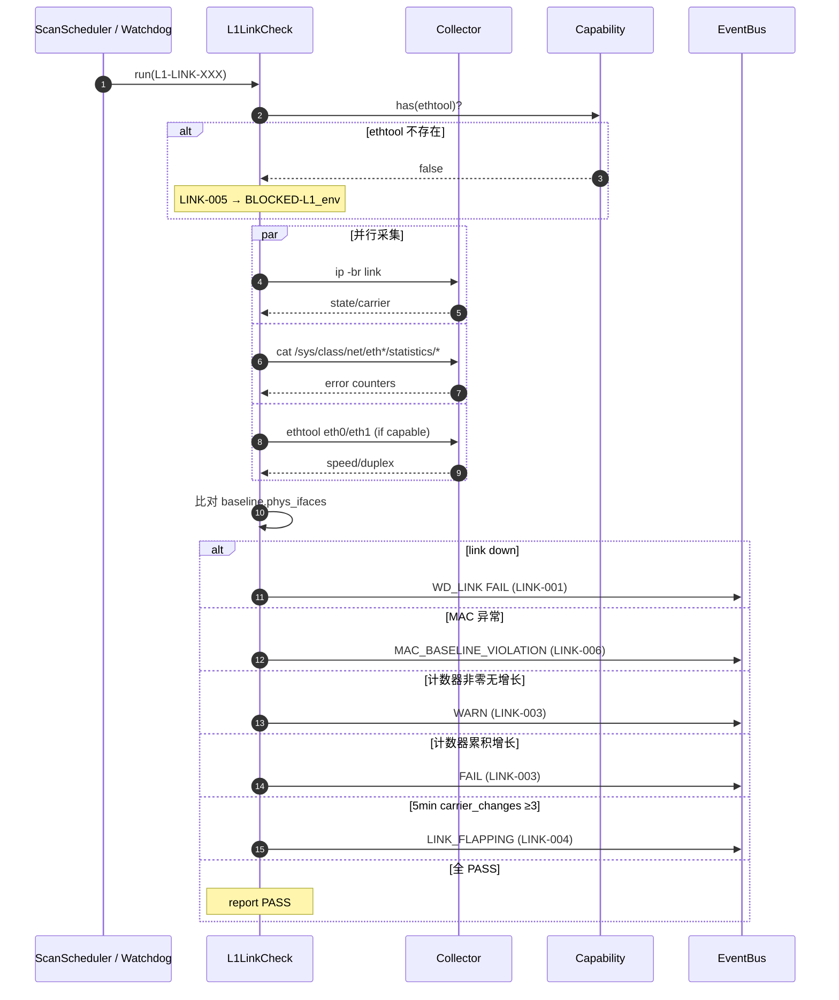
```mermaid
sequenceDiagram
    autonumber
    participant Sched as ScanScheduler / Watchdog
    participant Check as L1LinkCheck
    participant Coll as Collector
    participant Cap as Capability
    participant Bus as EventBus
    
    Sched->>Check: run(L1-LINK-XXX)
    Check->>Cap: has(ethtool)?
    alt ethtool 不存在
        Cap-->>Check: false
        Note over Check: LINK-005 → BLOCKED-L1_env
    end
    
    par 并行采集
        Check->>Coll: ip -br link
        Coll-->>Check: state/carrier
    and
        Check->>Coll: cat /sys/class/net/eth*/statistics/*
        Coll-->>Check: error counters
    and
        Check->>Coll: ethtool eth0/eth1 (if capable)
        Coll-->>Check: speed/duplex
    end
    
    Check->>Check: 比对 baseline.phys_ifaces
    
    alt link down
        Check->>Bus: WD_LINK FAIL (LINK-001)
    else MAC 异常
        Check->>Bus: MAC_BASELINE_VIOLATION (LINK-006)
    else 计数器非零无增长
        Check->>Bus: WARN (LINK-003)
    else 计数器累积增长
        Check->>Bus: FAIL (LINK-003)
    else 5min carrier_changes ≥3
        Check->>Bus: LINK_FLAPPING (LINK-004)
    else 全 PASS
        Note over Check: report PASS
    end
```

#### SEQ-14 — L2 VLAN check（覆盖 `VLAN-001..007`）

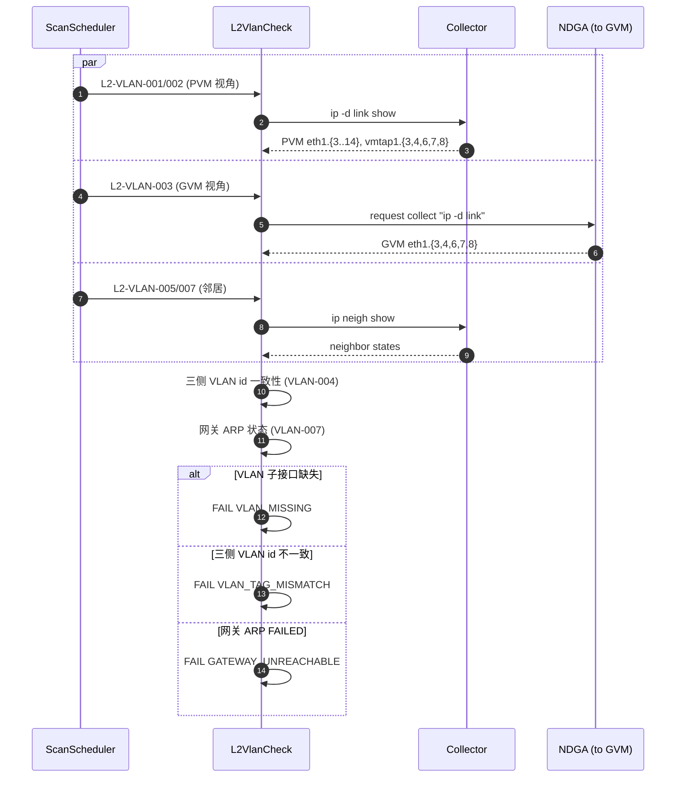
```mermaid
sequenceDiagram
    autonumber
    participant Sched as ScanScheduler
    participant Check as L2VlanCheck
    participant Coll as Collector
    participant NDGA as NDGA (to GVM)
    
    par
        Sched->>Check: L2-VLAN-001/002 (PVM 视角)
        Check->>Coll: ip -d link show
        Coll-->>Check: PVM eth1.{3..14}, vmtap1.{3,4,6,7,8}
    and
        Sched->>Check: L2-VLAN-003 (GVM 视角)
        Check->>NDGA: request collect "ip -d link"
        NDGA-->>Check: GVM eth1.{3,4,6,7,8}
    and
        Sched->>Check: L2-VLAN-005/007 (邻居)
        Check->>Coll: ip neigh show
        Coll-->>Check: neighbor states
    end
    
    Check->>Check: 三侧 VLAN id 一致性 (VLAN-004)
    Check->>Check: 网关 ARP 状态 (VLAN-007)
    
    alt VLAN 子接口缺失
        Check->>Check: FAIL VLAN_MISSING
    else 三侧 VLAN id 不一致
        Check->>Check: FAIL VLAN_TAG_MISMATCH
    else 网关 ARP FAILED
        Check->>Check: FAIL GATEWAY_UNREACHABLE
    end
```

#### SEQ-15 — L3 IP/路由 check（覆盖 `IP-001..005` / `ROUTE-001..006`）

```mermaid
sequenceDiagram
    autonumber
    participant Sched as ScanScheduler
    participant Check as L3RouteCheck
    participant Coll as Collector
    participant NDGA as NDGA
    
    par 多维度采集
        Check->>Coll: sysctl net.ipv4.{ip_forward,...}
    and
        Check->>Coll: cat /proc/sys/net/ipv4/conf/*/forwarding
    and
        Check->>Coll: cat /proc/sys/net/ipv4/conf/*/rp_filter
    and
        Check->>Coll: cat /proc/sys/net/ipv4/conf/*/proxy_arp
    and
        Check->>Coll: ip route show table all + ip rule
    and
        Check->>Coll: ip route get 172.16.106.50 / 8.8.8.8 mark 0x10066
    and
        Check->>NDGA: GVM ip rule + ip route + dumpsys
    end
    
    Check->>Check: 比对 baseline.kernel_params + per_iface_params
    Check->>Check: 比对 baseline.policy_route
    Check->>Check: NetId↔VLAN 动态推断 (ROUTE-005)
    
    alt ip_forward=0
        Check->>Check: FAIL FORWARDING_DISABLED (IP-003)
    else per-iface forwarding=0
        Check->>Check: FAIL FORWARDING_DISABLED (IP-004)
    else rp_filter=1 在 NAT 路径
        Check->>Check: FAIL RPF_STRICT_ON_NAT (IP-004)
    else proxy_arp 偏离
        Check->>Check: INFO/WARN BASELINE_DRIFT (IP-005)
    else 默认路由缺失
        Check->>Check: FAIL ROUTE_BASELINE_DRIFT (ROUTE-001)
    else 策略路由表 106/107/108 异常
        Check->>Check: FAIL POLICY_ROUTE_DRIFT (ROUTE-002)
    else GVM NetId↔VLAN 错配
        Check->>Check: FAIL ANDROID_NETID_MISMATCH (ROUTE-005)
    end
```

#### SEQ-16 — L4 NAT/防火墙 check（覆盖 `NAT-001..004` / `FW-001..007`）

```mermaid
sequenceDiagram
    autonumber
    participant Sched as ScanScheduler
    participant Check as L4NatFwCheck
    participant Nfc as NetfilterCollector
    participant Coll as Collector
    participant RG as ResourceGuard
    participant Bus as EventBus
    
    Check->>RG: shouldSkipHeavyConntrack?
    alt conntrack ≥80%
        RG-->>Check: true (跳过 -L -nv)
        Note over Check: 仅查规则存在性 (-S)
    end
    
    par
        Check->>Nfc: listNatRules() (iptables-S 或 nft)
        Nfc-->>Check: PREROUTING + POSTROUTING rules
    and
        Check->>Nfc: listFilterRules()
        Nfc-->>Check: FORWARD rules
    and
        Check->>Coll: conntrack_count + max
        Coll-->>Check: count/max
    and
        Check->>Coll: conntrack_state_stats (UNREPLIED %)
        Coll-->>Check: unreplied_pct + by_vlan
    and
        Check->>Coll: ss -tn state syn-sent
        Coll-->>Check: SYN_SENT count
    end
    
    Check->>Check: 比对 baseline.iptables_nat / filter
    Check->>Check: 多信号合并 (NAT-005 + FW-006 + FW-007)
    
    alt DNAT 规则缺失/顺序错
        Check->>Bus: FAIL NAT_RULE_DRIFT (NAT-001)
    else conntrack ≥95%
        Check->>Bus: FAIL CONNTRACK_PRESSURE (FW-003)
    else UNREPLIED ≥20% + SYN_SENT ≥30
        Check->>Bus: FAIL DOWNSTREAM_PACKET_LOSS<br/>(FW-006 + FW-007 + NAT-005)
    else FORWARD 默认 ACCEPT
        Check->>Bus: WARN EXPOSURE_RISK (FW-001)
    end
```

#### SEQ-17 — VM 虚拟化 check（覆盖 `VM-001..007`）

```mermaid
sequenceDiagram
    autonumber
    participant Sched as ScanScheduler
    participant Check as VirtLinkCheck
    participant PColl as PVM Collector
    participant NDGA as NDGA
    
    par
        Check->>PColl: pidof qcrosvm
    and
        Check->>PColl: ip -d link show vmtap*
    and
        Check->>PColl: ping -c3 10.10.200.40 (PVM→GVM eth0)
    and
        Check->>PColl: ping -I vmtap1.X -c3 10.10.10X.40 × 5
    and
        Check->>NDGA: GVM 反向 ping vmtap0/vmtap1.X
        NDGA-->>Check: GVM ping results
    and
        Check->>NDGA: GVM ip addr (检查 PVM-only VLAN 不可见)
        NDGA-->>Check: GVM iface list
    end
    
    Check->>Check: 比对 baseline.vmtap
    
    alt qcrosvm 不存在
        Check->>Check: FAIL HYPERVISOR_DOWN (VM-001)
    else vmtap 缺失
        Check->>Check: FAIL VM_LINK_BROKEN (VM-006/007)
    else 双向 ping 失败
        Check->>Check: FAIL VM_LINK_BROKEN (VM-002/003)
    else 单向不通 (20s 包计数对比)
        Check->>Check: FAIL VM_LINK_BROKEN (VM-004)
    else GVM 看到 PVM-only VLAN
        Check->>Check: FAIL PVM_ONLY_LEAK (VM-005)
    end
```

#### SEQ-18 — L5 业务 check（覆盖 `SVC-001..012`）

```mermaid
sequenceDiagram
    autonumber
    participant Sched as ScanScheduler
    participant Check as L5ServiceCheck
    participant Probe as ProbeScheduler
    participant Coll as Collector
    participant NDGA as NDGA
    
    Note over Check: 按 SHU 分组运行
    
    par
        Check->>Probe: SHU_VLAN3_INTERNET probe<br/>(ICMP TBOX + DNS + uplink)
        Probe-->>Check: probe results
    and
        Check->>Coll: PVM 端 ss / iptables for IDPS / someipd / camera
        Coll-->>Check: listening ports
    and
        Check->>NDGA: GVM 端 DoIP / VLM / gftpd 监听
        NDGA-->>Check: GVM ss
    and
        Check->>Coll: PVM neighbor: 172.16.115.98 / 172.16.119.98
        Coll-->>Check: ADCU neighbor states
    end
    
    Check->>Check: 业务通路完整性判定
    
    alt 网关不可达 (SVC-012)
        Check->>Check: FAIL GATEWAY_UNREACHABLE(VLAN3_TBOX)
    else DNS 失败 (SVC-011)
        Check->>Check: FAIL DNS_FAILURE
    else DoIP 端口未监听 (SVC-002)
        Check->>Check: FAIL SERVICE_DOWN(doip_server)
    else IDPS 监听异常 (SVC-003)
        Check->>Check: FAIL IDPS_BYPASS_FAIL
    else someipd 进程级缺实例 (SVC-007)
        Check->>Check: FAIL SERVICE_DOWN(someipd_VLAN*)
    end
```

#### SEQ-19 — 端口与安全 check（覆盖 `PORT-001..006` / `SEC-001..006`）

```mermaid
sequenceDiagram
    autonumber
    participant Sched as ScanScheduler
    participant Check as PortCheck/SecCheck
    participant PColl as PVM Collector
    participant NDGA as NDGA
    participant Diff as BaselineDiff
    
    par
        Check->>PColl: ss -ltnp + ss -lunp (PVM)
    and
        Check->>NDGA: GVM ss -ltnp + ss -lunp
    and
        Check->>PColl: iptables -t nat -S (DNAT 暴露分析)
    end
    
    Check->>Diff: 与上次扫描 diff (SEC-006)
    
    Check->>Check: 标记 documented_bind_any
    Check->>Check: 标记 PVM-only 不应被 DNAT
    Check->>Check: 标记新增 0.0.0.0 监听
    
    alt 新增 0.0.0.0 监听
        Check->>Check: WARN PORT_EXPOSURE_NEW (SEC-006)
    else DoIP/VLM/gftpd 绑错地址
        Check->>Check: FAIL bind_address_violation (PORT-003)
    else PVM-only DNAT 到 GVM (SEC-003 + VM-005 联合)
        Check->>Check: FAIL PVM_ONLY_LEAK
    end
```

#### SEQ-20 — 性能 check（覆盖 `PERF-001..006`）

```mermaid
sequenceDiagram
    autonumber
    participant Sched as ScanScheduler
    participant Check as PerfCheck
    participant Probe as ProbeScheduler
    participant Coll as Collector
    
    par
        Check->>Probe: ICMP probe 各 SHU (PERF-001/002)
        Probe-->>Check: loss/RTT/jitter
    and
        Check->>Coll: /proc/net/dev 双采 (PERF-003)
        Coll-->>Check: bps/pps
    and
        Check->>Coll: /proc/softirqs + /proc/stat (PERF-004)
        Coll-->>Check: softirq pct
    and
        Check->>Coll: ip -d link show MTU (PERF-005)
        Coll-->>Check: MTU per iface
    and
        opt PERF-006 仅触发型
            Check->>Coll: tcpdump 5s on eth1.X
            Coll-->>Check: pps by protocol
        end
    end
    
    Check->>Check: 阈值判定
    
    alt loss >5%
        Check->>Check: FAIL PACKET_LOSS_HIGH (PERF-001)
    else RTT >100ms
        Check->>Check: FAIL RTT_HIGH (PERF-002)
    else MTU 不一致
        Check->>Check: FAIL MTU_INCONSISTENT (PERF-005)
    else softirq >30%
        Check->>Check: FAIL SOFTIRQ_OVERLOAD (PERF-004)
    else 广播 pps >100
        Check->>Check: WARN BROADCAST_STORM (PERF-006)
    end
```

#### SEQ-21 — 基线 check（覆盖 `BASE-001..005`）

```mermaid
sequenceDiagram
    autonumber
    participant Boot as Bootstrap
    participant Cfg as Config
    participant Check as BaseCheck
    participant Diff as BaselineDiff
    participant Pol as polaris
    
    Boot->>Cfg: loadAll
    Cfg->>Cfg: sha256 校验 5 附件 (BASE-001)
    
    alt sha256 不一致
        Cfg-->>Boot: fail
        Boot->>Boot: exit 1
    end
    
    Boot->>Check: 全量 baseline diff
    Check->>Diff: 实测 vs baseline
    Diff->>Diff: apply diff_policy<br/>ignore/info/warn/fail/missing
    
    alt PVM-only VLAN 在 GVM
        Check->>Check: FAIL PVM_ONLY_LEAK (BASE-005)
    else 关键字段 fail_if_changed
        Check->>Check: FAIL BASELINE_DRIFT (BASE-002)
    else 字段 warn_if_changed
        Check->>Check: WARN (BASE-003)
    else 一切对齐
        Note over Check: PASS
    end
    
    Check->>Pol: NETDIAG_SCAN_REPORT INFO (BASE-004 元信息)
```

### 24.14 SEQ-22 — DNS 失败差分诊断

**覆盖**：场景 J（`SVC-011`）

```mermaid
sequenceDiagram
    autonumber
    participant App as GVM App
    participant Resolver as Android resolver/netd
    participant Probe as PVM ProbeScheduler
    participant PCol as PVM Collector
    
    App->>Resolver: getaddrinfo("api.example.com")
    Resolver--XApp: timeout
    
    Note over Probe: 周期 DNS probe
    Probe->>Probe: DnsProbe to <DNS server> via VLAN3
    Probe--XProbe: no response
    
    Probe->>Probe: 并行验证：
    par
        Probe->>Probe: ICMP probe to <DNS server>
    and
        Probe->>Probe: ICMP probe to 8.8.8.8
    and
        Probe->>PCol: tcpdump -ni eth1.3 port 53 (5s)
    end
    
    alt ICMP 8.8.8.8 PASS, DNS server 不可达
        Probe->>Probe: 定位：DNS server 故障
    else ICMP 全 FAIL
        Probe->>Probe: 定位：VLAN3 上游不通 → TBOX_UPLINK_DOWN
    else tcpdump 看到出口但无回 (UDP)
        Probe->>Probe: 定位：DNS server 不响应/被上游过滤
    else tcpdump 看不到出口
        Probe->>Probe: 定位：Android resolver/netd 异常
    end
    
    Probe->>Probe: 上报 DNS_FAILURE + root_cause
```

### 24.15 SEQ-23 — 路径②增强：上行通下行不通 (v1.1)

**覆盖**：`DOWNSTREAM_PACKET_LOSS` / `L4-FW-006/007` / `L4-NAT-005` / `L5-PORT-006`

```mermaid
sequenceDiagram
    autonumber
    participant Kernel as PVM Kernel netfilter
    participant CR as ConntrackReactor
    participant Anal as Analyzer
    participant NDGA as NDGA
    participant GVM as GVM net_diag
    participant Pol as polaris
    
    Note over Kernel: 假场景：DNAT 反向规则被删<br/>上行包出去回包不被反向 NAT 匹配
    
    loop 每 60s
        CR->>CR: 解析 /proc/net/nf_conntrack
        CR->>CR: UNREPLIED pct = 26% (by VLAN3)
        
        CR->>Anal: WD_PVM_CONNTRACK_UNREPLIED FAIL
    end
    
    par 同时检查
        CR->>CR: ss -tn state syn-sent → 22
        CR->>Anal: WD_PVM_TCP_SYN_STUCK WARN
    and
        CR->>CR: iptables -L -nv 60s 滚动窗
        CR->>CR: DNAT 入向 = 5, SNAT 出向 = 5000<br/>对称比 0.001
        CR->>Anal: WD_PVM_NAT_ASYMMETRY FAIL
    end
    
    Anal->>Anal: 多信号合并：UNREPLIED + NAT_ASYMMETRY<br/>→ DOWNSTREAM_PACKET_LOSS = FAIL
    
    Anal->>NDGA: 查询 GVM SYN_SENT
    NDGA->>GVM: collect ss_syn_sent
    GVM-->>NDGA: GVM SYN_SENT = 12
    
    Anal->>Pol: NETDIAG_DOWNSTREAM_LOSS<br/>tk=VLAN3_TBOX<br/>cb=NAT_RULE_DRIFT (如果 NAT_RULE_DRIFT 已在 active_faults)
```

### 24.16 SEQ-24 — App 报障 verdict 判定

**覆盖**：`SVC-011` 应用层联动 + RPT-002/003

```mermaid
sequenceDiagram
    autonumber
    participant App
    participant GDiag as GVM net_diag
    participant Probe
    participant PDiag as PVM net_diag
    participant Pol as polaris/Cloud
    
    App->>GDiag: NETDIAG_APP_NETWORK_TROUBLE
    Note over GDiag: via_netid=102 → SHU_VLAN3_INTERNET
    
    par
        GDiag->>Probe: 加紧 SHU_VLAN3 probe burst
        Probe-->>GDiag: 5 包结果
    and
        GDiag->>GDiag: dumpsys connectivity / ss
    and
        GDiag->>PDiag: NDGA collect PVM SHU 关联 check
        PDiag-->>GDiag: PVM evidence
    end
    
    GDiag->>GDiag: 5s 内聚合
    
    alt 所有 check + probe PASS
        Note over GDiag: vrd=0 (healthy)<br/>提示：网络层无异常，应用层问题
    else 部分 WARN
        Note over GDiag: vrd=1 (degraded)
    else FAIL
        Note over GDiag: vrd=2 (failed)<br/>携带 root cause + fault_id 关联
    end
    
    GDiag->>Pol: NETDIAG_APP_NETWORK_TROUBLE<br/>vrd=N, fid=...
```

### 24.17 时序图 → NET-DIAG 覆盖矩阵

| 时序图 | 覆盖 NET-DIAG-* |
|---|---|
| SEQ-01 启动 + Boot Warmup | MODE-001, MODE-005, BASE-001, BASE-004 |
| SEQ-02 PVM 自感知 | LINK-*, VLAN-001/002/004/005/007, IP-003/004/005, ROUTE-001/002/003, NAT-001..004, FW-001..007, VM-001, BASE-002/003/005 |
| SEQ-03 GVM 主动推送 | VLAN-003, IP-002, ROUTE-004/005, VM-003 |
| SEQ-04 云命令下发 | MODE-002, MODE-003, MODE-004 |
| SEQ-05 App 报障 | SVC-001, SVC-011 |
| SEQ-06 Boot 早期补归因 | 所有 v1.1 增量 + BASE-001..004 |
| SEQ-07 因果聚合 | RPT-002/003 |
| SEQ-08 持续故障状态机 | RPT-002/003 |
| SEQ-09 网关不可达 | 场景 A: SVC-001, SVC-012, LINK-001 |
| SEQ-10 conntrack 表满 | 场景 K: FW-003..005, NAT-004, DOWNSTREAM |
| SEQ-11 NDGA 重连 | 通道 A 容错 |
| SEQ-12 维护模式 | MODE-005 |
| SEQ-13 L1 物理 check | LINK-001..006 |
| SEQ-14 L2 VLAN check | VLAN-001..007 |
| SEQ-15 L3 IP/路由 check | IP-001..005, ROUTE-001..006 |
| SEQ-16 L4 NAT/FW check | NAT-001..004, FW-001..007 |
| SEQ-17 VM check | VM-001..007 |
| SEQ-18 L5 业务 check | SVC-001..012 |
| SEQ-19 端口/安全 check | PORT-001..006, SEC-001..006 |
| SEQ-20 性能 check | PERF-001..006 |
| SEQ-21 基线 check | BASE-001..005 |
| SEQ-22 DNS 差分 | 场景 J: SVC-011 |
| SEQ-23 上行通下行不通 (v1.1) | DOWNSTREAM, FW-006/007, NAT-005, PORT-006 |
| SEQ-24 App verdict 判定 | SVC-011, RPT-002/003 |

**RPT-001（Markdown 报告）和 RPT-004/005**：由 `EventComposer` + `JsonReport` 实现，时序见 SEQ-02 末尾的 polaris commit 步骤。端侧不出 Markdown，仅输出 JSON；RPT-005 时间偏差检测见 SEQ-12 维护模式之后的周期任务。

---

## 25. 测试用例

### 25.1 验收测试 TC-NET-001..025

完整覆盖需求 §13 的 23 个用例 + v1.1 新增 2 个：

| TC | 构造条件 | 预期 | 30s SLA |
|---|---|---|---|
| TC-NET-001 | PVM `eth1` carrier down | VLAN 3/4/6/7/8/10-14 FAIL，L1 故障 | ✅ <1s（netlink） |
| TC-NET-002 | GVM `eth1.4` 缺失 | VLAN 4 FAIL，定位 GVM 侧 | ✅ ≤60s |
| TC-NET-003 | PVM VLAN 4 DNAT 缺失 | DoIP FAIL，eth1.4 有包但 vmtap1.4 无包 | ✅ ≤30s |
| TC-NET-004 | TCP/30006 被 DNAT 到 GVM | IDPS 旁路 FAIL | ✅ ≤30s |
| TC-NET-005 | PVM table 106 缺失 | VLAN 6 ADCU FAIL | ✅ <1s |
| TC-NET-006 | GVM fwmark 映射错 | 应用选路 FAIL | ⚠️ 60s |
| TC-NET-007 | someipd 未监听 | VLAN 10-14 FAIL，GVM 不应误判 | ✅ ≤5s |
| TC-NET-008 | RTSP 流断 / mmhab 异常 | 网络输入 PASS，跨 VM 通道 FAIL | ⚠️ 60s |
| TC-NET-009 | PVM 0.0.0.0:5555 监听 | 安全 WARN | ✅ ≤60s |
| TC-NET-010 | RX error 持续增长 | 稳定性 WARN/FAIL | ✅ ≤60s |
| TC-NET-011 | 网关 ARP FAILED | 对应业务 FAIL | ✅ <1s |
| TC-NET-012 | PVM `eth0` carrier down | VLAN 15/19 FAIL | ✅ <1s |
| TC-NET-013 | GVM `eth0` 配置异常 | Host-Guest FAIL | ✅ ≤30s |
| TC-NET-014 | VLAN 4 DNAT 顺序错 | IDPS 或 DoIP FAIL | ✅ ≤30s |
| TC-NET-015 | MTU 不一致 | MTU 一致性 FAIL | ✅ ≤60s |
| TC-NET-016 | trunk 父接口 DOWN | VLAN 3-8 全部 FAIL | ✅ <1s |
| TC-NET-017 | DNS 失败但 IP 通 | 定位 DNS 层，不误判整体不通 | ✅ ≤60s |
| TC-NET-018 | rp_filter=1 NAT 路径 | 转发核参 FAIL/WARN | ✅ <1s（inotify） |
| TC-NET-019 | PVM MAC 异常 | MAC 基线 FAIL | ✅ <1s |
| TC-NET-020 | TBOX 网关不可达 | VLAN 3 互联网 FAIL | ✅ ≤30s |
| TC-NET-021 | conntrack table full | conntrack 诊断 FAIL | ✅ <3s（sd-journal） |
| TC-NET-022 | per-iface forwarding=0 | 转发核参 FAIL | ✅ <1s |
| TC-NET-023 | TBOX 上游不通（网关可达） | 定位 TBOX 上游，非座舱故障 | ⚠️ ≤120s |
| **TC-NET-024** (v1.1) | 删除 VLAN3 PREROUTING DNAT，App 发 HTTPS | UNREPLIED ≥20% + NAT 入/出 <0.1 → DOWNSTREAM_PACKET_LOSS FAIL | ⚠️ ≤60s |
| **TC-NET-025** (v1.1) | `conntrack -F` 后立即发 HTTPS | UNREPLIED 急速上升；GVM SYN_SENT 累积；FAIL | ⚠️ 30-60s |

### 25.2 性能压力 TC-PERF-001..005

详见 §19.5。

### 25.3 故障注入接口（仅 userdebug）

```cpp
#ifdef NETDIAG_TEST_HOOKS_ENABLED

namespace netdiag::test {

class FaultInjector {
public:
    // 经 NDGA "netdiag.test_fault" action 触发
    
    // 模拟 link down
    void injectLinkDown(const std::string& iface);
    
    // 模拟 conntrack 压力
    void fakeConntrackPct(int pct);
    
    // 删除 iptables 规则
    void deleteIptablesRule(const std::string& ruleId);
    
    // 模拟 NDGA 断连
    void simulateNdgaDisconnect();
    
    // 清空 conntrack 表
    void flushConntrack();
    
    // 注入 NTP 时钟跳变
    void simulateClockJump(int64_t offsetSeconds);
};

} // namespace netdiag::test

#endif
```

user 镜像编译时通过 `#ifndef NETDIAG_TEST_HOOKS_ENABLED` 整段排除。

```jsonc
// 触发示例（仅 userdebug）
{
  "action": "netdiag.test_fault",
  "args": {
    "fault_type": "downstream_loss",
    "vlan": 3,
    "method": "delete_dnat_rule",
    "duration_sec": 120
  }
}
```

### 25.4 测试覆盖矩阵

| 测试类别 | 数量 | TC 范围 |
|---|---|---|
| 验收测试 | 25 | TC-NET-001..025 |
| 性能压力 | 5 | TC-PERF-001..005 |
| 单元测试（每模块）| ≥80 | per file |
| 集成测试 | ≥30 | 见 tests/integration/ |
| 故障注入 | 6 类 | 经 NETDIAG test_fault action |

---

## 26. 需求追踪矩阵

### 26.1 NET-DIAG-* × Check ID × 实现组件 × 测试用例 × 时序图

完整 84 项映射（按类别）：

#### 26.1.1 模式（5）

| NET-DIAG | Check ID | 实现组件 | TC | SEQ |
|---|---|---|---|---|
| MODE-001 | — | `ScanScheduler` (60s/1h) | TC-NET-* 全量 | SEQ-01, SEQ-13..21 |
| MODE-002 | — | `CheckRunner::run(scope=vlan)` + scenario-registry vlan_scope_filter | 按 VLAN 跑 | SEQ-04 |
| MODE-003 | — | `CheckRunner::run(scope=scenario)` + scenarios.checks.must_run | 12 场景 | SEQ-04 |
| MODE-004 | — | `WatchdogReactor` + scenario-registry watchdog_trigger_to_scenarios | TC-NET-001/021 | SEQ-02 |
| MODE-005 | — | `CommandRunner` 白名单 + 静态校验 | 审计 | SEQ-12 |

#### 26.1.2 基线（5）

| NET-DIAG | Check ID | 实现 | TC | SEQ |
|---|---|---|---|---|
| BASE-001 | BASE-001 | `Config::loadAll` + sha256 校验 | 启动测试 | SEQ-01, SEQ-21 |
| BASE-002 | BASE-002 | `BaselineDiff` | D1-D8 偏差 | SEQ-21 |
| BASE-003 | BASE-003 | `diff_policy` 字段路径 | — | SEQ-21 |
| BASE-004 | BASE-004 | `EventComposer` 元信息 | — | SEQ-01 |
| BASE-005 | BASE-005 + VM-005 + SEC-003 | `PvmOnlyIsolation` | TC-NET-007 | SEQ-17, SEQ-21 |

#### 26.1.3 物理链路（6）

| NET-DIAG | Check ID | 实现 | TC | SEQ |
|---|---|---|---|---|
| LINK-001 | L1-LINK-001 | `L1LinkCheck::carrier` | TC-NET-001/012 | SEQ-13 |
| LINK-002 | L1-LINK-002 | `L1LinkCheck::ethtoolSpeedDuplex` | — | SEQ-13 |
| LINK-003 | L1-LINK-003 | `L1LinkCheck::counterGrowth` | TC-NET-010 | SEQ-13 |
| LINK-004 | L1-LINK-004 | `L1LinkCheck::flapping` | — | SEQ-13 |
| LINK-005 | L1-LINK-005 | capability gated | — | SEQ-13 |
| LINK-006 | L1-LINK-006 | `L1LinkCheck::macBaseline` | TC-NET-019 | SEQ-13 |

#### 26.1.4 VLAN（7）

| NET-DIAG | Check ID | 实现 | TC | SEQ |
|---|---|---|---|---|
| VLAN-001 | L2-VLAN-001 | `L2VlanCheck::pvmIfaces` | TC-NET-002 | SEQ-14 |
| VLAN-002 | L2-VLAN-002 | `L2VlanCheck::vmtapIfaces` | TC-NET-016 | SEQ-14 |
| VLAN-003 | L2-VLAN-003 | `L2VlanCheck::gvmIfaces` | TC-NET-002 | SEQ-14 |
| VLAN-004 | L2-VLAN-004 | `L2VlanCheck::vlanConsistency` | — | SEQ-14 |
| VLAN-005 | L2-VLAN-005 | `L2VlanCheck::neigh` | TC-NET-011 | SEQ-14 |
| VLAN-006 | L2-VLAN-006 | INFO suggestion | — | — |
| VLAN-007 | L2-VLAN-007 | `L2VlanCheck::gatewayNeigh` | TC-NET-011 | SEQ-14 |

#### 26.1.5 IP/路由（11）

| NET-DIAG | Check ID | 实现 | TC | SEQ |
|---|---|---|---|---|
| IP-001 | L3-IP-001 | `L3RouteCheck::pvmIpBaseline` | — | SEQ-15 |
| IP-002 | L3-IP-002 | `L3RouteCheck::gvmIpBaseline` | — | SEQ-15 |
| IP-003 | L3-IP-003 | `L3RouteCheck::ipForward` | TC-NET-022 | SEQ-15 |
| IP-004 | L3-IP-004 | `L3RouteCheck::perIfaceForwarding`, `rpFilter` | TC-NET-018/022 | SEQ-15 |
| IP-005 | L3-IP-005 | `L3RouteCheck::proxyArp` | — | SEQ-15 |
| ROUTE-001 | L3-ROUTE-001 | `L3RouteCheck::mainTable` | — | SEQ-15 |
| ROUTE-002 | L3-ROUTE-002 | `L3RouteCheck::policyRoute` | TC-NET-005 | SEQ-15 |
| ROUTE-003 | L3-ROUTE-003 | `L3RouteCheck::table220Empty` | — | SEQ-15 |
| ROUTE-004 | L3-ROUTE-004 | `L3RouteCheck::gvmMainNoDefault` | — | SEQ-15 |
| ROUTE-005 | L3-ROUTE-005 | `L3RouteCheck::netidVlanDynamic` | TC-NET-006 | SEQ-15 |
| ROUTE-006 | L3-ROUTE-006 | `L3RouteCheck::ipRouteGet` | — | SEQ-15 |

#### 26.1.6 NAT/防火墙（9 + 3 v1.1 增量）

| NET-DIAG | Check ID | 实现 | TC | SEQ |
|---|---|---|---|---|
| NAT-001 | L4-NAT-001 | `L4NatFwCheck::natRules` | TC-NET-003/014 | SEQ-16 |
| NAT-002 | L4-NAT-002 | `L4NatFwCheck::snatOut` | — | SEQ-16 |
| NAT-003 | L4-NAT-003 | `L4NatFwCheck::returnSnat` | — | SEQ-16 |
| NAT-004 | L4-NAT-004 | `L4NatFwCheck::counterGrowth` | — | SEQ-16 |
| — | **L4-NAT-005** (v1.1) | `L4NatFwCheck::natAsymmetry` | TC-NET-024 | SEQ-23 |
| FW-001 | L4-FW-001 | `L4NatFwCheck::forwardPolicy` | — | SEQ-16 |
| FW-002 | L4-FW-002 | `L4NatFwCheck::portExposure` | — | SEQ-16 |
| FW-003 | L4-FW-003 | `L4NatFwCheck::conntrackPct` | TC-NET-021 | SEQ-10, SEQ-16 |
| FW-004 | L4-FW-004 | `L4NatFwCheck::conntrackFull` | TC-NET-021 | SEQ-10, SEQ-16 |
| FW-005 | L4-FW-005 | `L4NatFwCheck::conntrackParams` | — | SEQ-16 |
| — | **L4-FW-006** (v1.1) | `L4NatFwCheck::conntrackUnreplied` | TC-NET-024/025 | SEQ-23 |
| — | **L4-FW-007** (v1.1) | `L4NatFwCheck::tcpSynSent` | TC-NET-024 | SEQ-23 |

#### 26.1.7 虚拟化（7）

| NET-DIAG | Check ID | 实现 | TC | SEQ |
|---|---|---|---|---|
| VM-001 | VM-001 | `VirtLinkCheck::qcrosvm` | — | SEQ-17 |
| VM-002 | VM-002 | `VirtLinkCheck::hostGuestPing` | — | SEQ-17 |
| VM-003 | VM-003 | `VirtLinkCheck::gvmVlanPing` | — | SEQ-17 |
| VM-004 | VM-004 | `VirtLinkCheck::unidirectional` | — | SEQ-17 |
| VM-005 | VM-005 | `VirtLinkCheck::pvmOnlyIsolation` | TC-NET-007 | SEQ-17 |
| VM-006 | VM-006 | `VirtLinkCheck::hostGuestBaseline` | TC-NET-013 | SEQ-17 |
| VM-007 | VM-007 | `VirtLinkCheck::trunkParent` | TC-NET-016 | SEQ-17 |

#### 26.1.8 业务（12）

| NET-DIAG | Check ID | 实现 | TC | SEQ |
|---|---|---|---|---|
| SVC-001 | SVC-001 | `L5ServiceCheck::defaultInternet` | TC-NET-001 | SEQ-09, SEQ-18 |
| SVC-002 | SVC-002 | `L5ServiceCheck::doipChain` | TC-NET-003 | SEQ-18 |
| SVC-003 | SVC-003 | `L5ServiceCheck::idpsBypass` | TC-NET-004 | SEQ-18 |
| SVC-004 | SVC-004 | `L5ServiceCheck::adcuPark` | TC-NET-005 | SEQ-18 |
| SVC-005 | SVC-005 | `L5ServiceCheck::otaRoute` | — | SEQ-18 |
| SVC-006 | SVC-006 | `L5ServiceCheck::adasRoute` | — | SEQ-18 |
| SVC-007 | SVC-007 | `L5ServiceCheck::someipListening` | TC-NET-007 | SEQ-18 |
| SVC-008 | SVC-008 | `L5ServiceCheck::rtspInput` | TC-NET-008/012 | SEQ-18 |
| SVC-009 | SVC-009 | `L5ServiceCheck::someipBigdata` | — | SEQ-18 |
| SVC-010 | SVC-010 | `L5ServiceCheck::hostGuestMw` | TC-NET-013 | SEQ-18 |
| SVC-011 | SVC-011 | `L5ServiceCheck::dnsChain` + DnsProbe | TC-NET-017 | SEQ-05, SEQ-22 |
| SVC-012 | SVC-012 | `L5ServiceCheck::tboxGateway` + IcmpProbe | TC-NET-020 | SEQ-09, SEQ-18 |

#### 26.1.9 服务/端口（5 + 1 v1.1 增量）

| NET-DIAG | Check ID | 实现 | TC | SEQ |
|---|---|---|---|---|
| PORT-001 | PORT-001 | `PortCheck::pvmListening` | — | SEQ-19 |
| PORT-002 | PORT-002 | `PortCheck::gvmListening` | — | SEQ-19 |
| PORT-003 | PORT-003 | `PortCheck::bindAddress` | — | SEQ-19 |
| PORT-004 | PORT-004 | `PortCheck::unexpectedListen` | TC-NET-009 | SEQ-19 |
| PORT-005 | PORT-005 | `PortCheck::pvmOnlyNoDnat` | TC-NET-007 | SEQ-19 |
| — | **PORT-006** (v1.1) | `PortCheck::gvmTcpSynSent` | TC-NET-024 | SEQ-23 |

#### 26.1.10 性能（6）

| NET-DIAG | Check ID | 实现 | TC | SEQ |
|---|---|---|---|---|
| PERF-001 | PERF-001 | `PerfCheck::packetLoss` + IcmpProbe | — | SEQ-20 |
| PERF-002 | PERF-002 | `PerfCheck::rttJitter` + RttBurstProbe | — | SEQ-20 |
| PERF-003 | PERF-003 | `PerfCheck::throughput` | — | SEQ-20 |
| PERF-004 | PERF-004 | `PerfCheck::softirq` | — | SEQ-20 |
| PERF-005 | PERF-005 | `PerfCheck::mtuConsistency` | TC-NET-015 | SEQ-20 |
| PERF-006 | PERF-006 | `PerfCheck::broadcastStorm` | — | SEQ-20 |

#### 26.1.11 安全（6）

| NET-DIAG | Check ID | 实现 | TC | SEQ |
|---|---|---|---|---|
| SEC-001 | SEC-001 | `SecurityCheck::gvmExposureList` | — | SEQ-19 |
| SEC-002 | SEC-002 | `SecurityCheck::pvmExposureList` | — | SEQ-19 |
| SEC-003 | SEC-003 | `SecurityCheck::pvmOnlyIsolation` | TC-NET-007 | SEQ-19 |
| SEC-004 | SEC-004 | `SecurityCheck::idpsFullCheck` | TC-NET-004 | SEQ-19 |
| SEC-005 | SEC-005 | `SecurityCheck::forwardDefaultDrop` | — | SEQ-19 |
| SEC-006 | SEC-006 | `SecurityCheck::listenPortDiff` | TC-NET-009 | SEQ-19 |

#### 26.1.12 报告（5）

| NET-DIAG | Check ID | 实现 | TC | 备注 |
|---|---|---|---|---|
| RPT-001 | — | **不实现端侧 Markdown**（云端渲染）| — | LLD §0.3 范围边界 |
| RPT-002 | — | `JsonReport` + `EventComposer` | — | event payload + report.json |
| RPT-003 | — | `EventComposer` severity 5 级 | — | PASS/INFO/WARN/FAIL/BLOCKED |
| RPT-004 | — | `IncidentDirWriter` | — | 原始命令输出归档 |
| RPT-005 | — | `TimeSkewDetector` | — | SEQ-22（DNS）类似机制 |

### 26.2 fault_class × event_id × watchdog × SHU 横切矩阵

```
fault_class              event_id      watchdog signals                      SHU 影响
─────────────────────────────────────────────────────────────────────────────────────
LINK_DOWN                0x4E5E0002    WD_PVM_LINK, WD_GVM_LINK              所有
LINK_FLAPPING            0x4E5E0003    WD_PVM_LINK + state machine           所有
LINK_QUALITY_DEGRADED    0x4E5E0011    ScanScheduler 60s collect             所有
MAC_BASELINE_VIOLATION   0x4E5E0012    ScanScheduler                         所有
VLAN_MISSING             0x4E5E0004    ScanScheduler + WD_GVM_LINK           对应 VLAN
VLAN_TAG_MISMATCH        0x4E5E0013    ScanScheduler                         对应 VLAN
IP_BASELINE_DRIFT        0x4E5E0014    WD_PVM_IPADDR, WD_GVM_IPADDR          对应 VLAN
ROUTE_BASELINE_DRIFT     0x4E5E0015    WD_PVM_ROUTE                          对应 SHU
POLICY_ROUTE_DRIFT       0x4E5E0016    WD_PVM_ROUTE                          对应 SHU
FORWARDING_DISABLED      0x4E5E0006    WD_PVM_FORWARDING (inotify)           所有 NAT
RPF_STRICT_ON_NAT        0x4E5E0017    WD_PVM_FORWARDING                     所有 NAT
ANDROID_NETID_MISMATCH   0x4E5E0018    ScanScheduler                         SHU_VLAN3+
NAT_RULE_DRIFT           0x4E5E0005    WD_PVM_NAT_RULES                      所有
IDPS_BYPASS_FAIL         0x4E5E0019    WD_PVM_NAT_RULES + ScanScheduler      SHU_VLAN4
CONNTRACK_PRESSURE       0x4E5E0007    WD_PVM_CONNTRACK_PCT/FULL             所有
DOWNSTREAM_PACKET_LOSS   0x4E5E0010    WD_PVM_CONNTRACK_UNREPLIED            所有
                                       WD_PVM_NAT_ASYMMETRY
                                       WD_PVM_TCP_SYN_STUCK
                                       WD_GVM_TCP_SYN_STUCK
GATEWAY_UNREACHABLE      0x4E5E0008    WD_PVM_NEIGH + ICMP probe             对应 SHU
DNS_FAILURE              0x4E5E000D    DnsProbe                              SHU_DNS+VLAN3
SERVICE_DOWN             0x4E5E000B    WD_PVM_SERVICE (sd-bus)               对应业务
TBOX_UPLINK_DOWN         0x4E5E001A    Probe 8.8.8.8                         SHU_VLAN3
HYPERVISOR_DOWN          0x4E5E000A    WD_PVM_HYPERVISOR                     所有
VM_LINK_BROKEN           0x4E5E0009    WD_PVM_VMTAP_OPER/UNI                 对应 VLAN
PVM_ONLY_LEAK            0x4E5E001B    ScanScheduler                         安全
PACKET_LOSS_HIGH         0x4E5E001C    IcmpProbe SLA                         对应 SHU
RTT_HIGH                 0x4E5E001D    IcmpProbe + RttBurstProbe             对应 SHU
THROUGHPUT_ANOMALY       0x4E5E001E    ScanScheduler 60s                     对应接口
MTU_INCONSISTENT         0x4E5E001F    ScanScheduler                         所有
PMTU_BLACKHOLE           0x4E5E000E    IcmpPmtuProbe                         对应 SHU
SOFTIRQ_OVERLOAD         0x4E5E0020    ScanScheduler                         全局
BROADCAST_STORM          0x4E5E0021    短时 tcpdump                          对应 VLAN
PORT_EXPOSURE_NEW        0x4E5E000C    SEC-006 diff                          安全
EXPOSURE_RISK            0x4E5E0022    FW-001/002                            安全
APP_NETWORK_TROUBLE      0x4E5E00F1    App 调 polaris_event_create           对应 NetId
BASELINE_DRIFT           0x4E5E0001    BaselineDiff                          —
TIME_SKEW                0x4E5E000F    TimeSkewDetector 60s                  —
UNKNOWN_FAULT            0x4E5E00FF    fallback                              —
```

### 26.3 场景 × SHU × fault_class × TC 矩阵

| 场景 | SHU | 期望 fault_class | TC |
|---|---|---|---|
| A 互联网 | SHU_VLAN3_INTERNET, SHU_DNS | GATEWAY_UNREACHABLE / DNS_FAILURE / FORWARDING_DISABLED / TBOX_UPLINK_DOWN | TC-001/005/017/020/022/023/024 |
| B DoIP | SHU_VLAN4_DOIP | NAT_RULE_DRIFT / VLAN_MISSING / SERVICE_DOWN / IDPS_BYPASS_FAIL | TC-002/003/014 |
| C IDPS | SHU_VLAN4_DOIP | IDPS_BYPASS_FAIL / SERVICE_DOWN / NAT_RULE_DRIFT | TC-004 |
| D 泊车 | SHU_VLAN6_ADCU_PARK | GATEWAY_UNREACHABLE / POLICY_ROUTE_DRIFT / ANDROID_NETID_MISMATCH | TC-005/006 |
| E OTA | SHU_VLAN7_OTA | GATEWAY_UNREACHABLE / POLICY_ROUTE_DRIFT | — |
| F ADAS | SHU_VLAN8_ADAS | GATEWAY_UNREACHABLE / POLICY_ROUTE_DRIFT | — |
| G SOME/IP | SHU_SOMEIP_BUS | SERVICE_DOWN / VLAN_MISSING / PVM_ONLY_LEAK | TC-007 |
| H Camera | SHU_VLAN15_RTSP | LINK_DOWN(eth0) / VLAN_MISSING / SERVICE_DOWN(camera_server) | TC-008/012 |
| I Host-Guest | SHU_HOST_GUEST | HYPERVISOR_DOWN / VM_LINK_BROKEN / PVM_ONLY_LEAK | TC-013/016 |
| J DNS | SHU_DNS | DNS_FAILURE / SERVICE_DOWN(netd) / GATEWAY_UNREACHABLE | TC-017 |
| K conntrack | (跨 SHU) | CONNTRACK_PRESSURE / DOWNSTREAM_PACKET_LOSS | TC-021 |
| L PVM OK GVM 不通 | SHU_VLAN3_INTERNET | FORWARDING_DISABLED / DOWNSTREAM_PACKET_LOSS / NAT_RULE_DRIFT / TBOX_UPLINK_DOWN | TC-022/023/024 |

---

## 27. 未决项与下一步

### 27.1 Polaris 团队对接清单（启动实施前置）

| 项 | 工作量 | 优先级 | 负责方 |
|---|---|---|---|
| 申请 event_id 段位 `0x4E5E_xxxx`（19 个事件 ID） | — | P0 | polaris 团队 |
| 评估 polarisd `mOfflineCache` 容量（boot 早期短时大量 side event） | 评估 | P1 | polaris 团队 |
| GVM sepolicy `network_diag.te` 审核 | ~30 规则 | P0 | GVM SELinux 团队 |
| 确认 `/mnt/vendor/log → PVM /log` 共享挂载在量产镜像稳定性 | 实测 | P0 | 平台/网络团队 |
| NDGA VSOCK 端口 9101 分配（避免与 polaris 9001 冲突） | 一次性 | P0 | 平台团队 |

### 27.2 v2 候选清单

| ID | 内容 | 评审依据 |
|---|---|---|
| V2-001 | HTTP probe 全 VLAN 覆盖 | sys_design review §7.2 |
| V2-002 | softirq/ksoftirqd 轻量采样阈值优化 | sys_design review §7.2 |
| V2-003 | 配置热重载 + PVM/GVM 双端版本协同 | sys_design review §4.2 + G19 |
| V2-004 | virtio queue 卡顿统计学阈值 | sys_design §11.1 注 |
| V2-005 | ARP probe（强制邻居解析） | sys_design §12.1 |
| V2-006 | 自适应 probe 频率 | sys_design §10 v2 |
| V2-007 | 反向命令通道（PVM→GVM 同步 RPC） | polaris 团队评估 |
| V2-008 | nfqueue 注入式 GVM perspective probe | §14 |
| V2-009 | mmhab 跨域接口（与 Camera 团队） | G19 |
| V2-010 | 间歇故障 long-running probe 全 SHU 覆盖 | G3 |
| V2-011 | conntrack 解析周期 60s→15-20s（保 30s SLA） | §19.3 注 |
| V2-012 | 取证脱敏机制（on-write redaction） | G18 |
| V2-013 | conntrack INVALID 状态细分采集 | §10.3.4 |
| V2-014 | fault_causation_graph 云端反推扩展 | §8.5 |

### 27.3 推进路线图

```
M7a (P0 阻塞)：
  └ polaris 团队完成 event_id 段位分配 + mOfflineCache 评估
  └ GVM SELinux 审核
  └ 共享挂载稳定性确认

M7b (并行)：
  └ 详细单元测试用例编写（每 check 一组）
  └ 故障注入测试框架搭建

M8 实施：
  └ PVM 进程实现（约 6 周）
  └ GVM 进程实现（约 4 周）
  └ 集成测试（约 2 周）
  └ 25 个验收 TC + 5 个性能 TC（约 2 周）

M9 上线：
  └ 灰度发布 (10%)
  └ 全量上线
  └ v2 候选评估
```

---

## 附录 A — 术语表与缩写

| 缩写 | 全称 / 含义 |
|---|---|
| ADCU | Automated Driving Control Unit（自动驾驶域控）|
| ARP | Address Resolution Protocol |
| BLOCKED | 检查项状态：因权限/命令缺失/设备离线无法完成检查 |
| BOOTTIME | `CLOCK_BOOTTIME` 单调递增时钟，跨 suspend |
| boot_id | `/proc/sys/kernel/random/boot_id` 启动 epoch 标识 |
| cb | caused_by（事件 payload 字段，因果链上游 fault_id）|
| cls | event payload `cls` 字段：side / root / recov |
| correlation_id | hash(fault_class, target_key)，跨 boot 复发统计用 |
| DNAT | Destination NAT |
| DoIP | Diagnostic over IP（ISO 13400）|
| fault_id | hash(pvm_boot_id, fault_class, target_key)，本 boot 内同故障唯一标识 |
| fault_class | 故障类别枚举（见 fault_class_dict.json）|
| FAIL | 检查项状态：明确异常 |
| fid | 事件 payload `fid` 字段（fault_id 短形式）|
| fp | event payload `fp` 字段，first_pass 标记 |
| FORWARD | netfilter 链 |
| GVM | Guest VM（Android）|
| HLD | High-Level Design（高层设计）|
| HMI | Human Machine Interface |
| IDPS | Intrusion Detection / Prevention System（信大捷安 xdja_idps）|
| INFO | 检查项状态：信息项，不代表异常 |
| LLD | Low-Level Design / Detailed Design |
| MTU | Maximum Transmission Unit |
| NAT | Network Address Translation |
| NDGA | Net Diag GVM-PVM Agent 协议（专用 VSOCK 9101）|
| NetId | Android NetworkAgent 网络 ID |
| netfilter | Linux 内核网络过滤框架 |
| netlink | Linux 内核通信机制 |
| OTA | Over-The-Air（OTA 升级 / 远程诊断）|
| P0/P1/P2 | 优先级 |
| PASS | 检查项状态：通过 |
| PHY | Physical Layer transceiver |
| PLP | Polaris Link Protocol（polaris VSOCK 协议）|
| PMTU | Path MTU |
| PolarisAgent | Android Java 组件，云事件出口 |
| polarisd | polaris daemon |
| PREROUTING | netfilter 链 |
| PVM | Privileged VM（Linux Host）|
| QcrosVM | Qualcomm crosvm hypervisor |
| recov | event payload `cls=recov` 标记恢复事件 |
| root | event payload `cls=root` 标记根因事件 |
| RTL9071 | Realtek RTL9071CP-VB-CG 车载以太网交换芯片 |
| RTSP | Real-Time Streaming Protocol |
| SDD | Software Detailed Design |
| sd-journal | systemd journal API |
| SerDes | Serializer/Deserializer |
| SHU | Service Health Unit |
| side | event payload `cls=side` 标记单端观测事件 |
| SNAT | Source NAT |
| SOME/IP | Scalable service-Oriented MiddlewarE over IP |
| systemd | Linux init system |
| TAP | L2 虚拟网卡 |
| target_key | 故障目标键（iface 名 / VLAN 角色 / 服务名等） |
| TBOX | Telematics Box（车联网通信单元）|
| TCP | Transmission Control Protocol |
| ts_boot | CLOCK_BOOTTIME ms |
| ts_unix | wall-clock UNIX 时间戳 |
| UDS | Unix Domain Socket |
| VCM | Vehicle Control Module（车载以太网中央交换网关）|
| virtio-net | 半虚拟化网卡协议 |
| VLAN | 802.1Q Virtual LAN |
| vmtap | qcrosvm 创建的 TAP 设备（virtio-net 后端）|
| VSOCK | Linux AF_VSOCK 跨 VM 通信 |
| WARN | 检查项状态：风险或非致命偏差 |

---

## 附录 B — 配置附件路径汇总

| 文件 | git 路径 | PVM 部署 | GVM 部署 |
|---|---|---|---|
| `network-diag-pvm.json` | `work/network-diag-pvm.json` | `/etc/polaris/` | — |
| `network-diag-gvm.json` | `work/network-diag-gvm.json` | — | `/system/etc/polaris/` |
| `baseline-pvm.json` | `work/baseline-pvm.json` | `/etc/polaris/` | `/mnt/vendor/etc/polaris/`（镜像）|
| `baseline-gvm.json` | `work/baseline-gvm.json` | `/etc/polaris/`（参考）| `/system/etc/polaris/` |
| `fault_class_dict.json` | `work/fault_class_dict.json` | `/etc/polaris/` | `/system/etc/polaris/` |
| `fault_causation_graph.json` | `work/fault_causation_graph.json` | `/etc/polaris/` | `/system/etc/polaris/` |
| `scenario-registry.json` | `work/scenario-registry.json` | `/etc/polaris/` | `/system/etc/polaris/` |

sha256 校验：双端启动时验证；NDGA hello 时跨端互校。

---

## 附录 C — 事件 ID 完整列表

| 事件名 | 占位 ID | 默认严重度 | 触发条件 |
|---|---|---|---|
| `NETDIAG_BASELINE_DRIFT` | `0x4E5E0001` | WARN/FAIL | 接口/IP/MAC/路由/iptables 偏离基线（非具体类）|
| `NETDIAG_LINK_DOWN` | `0x4E5E0002` | FAIL | 物理 link DOWN |
| `NETDIAG_LINK_FLAPPING` | `0x4E5E0003` | FAIL | 5min 内 carrier_changes ≥3 |
| `NETDIAG_VLAN_MISSING` | `0x4E5E0004` | FAIL | 关键 VLAN 子接口缺失 |
| `NETDIAG_NAT_RULE_DRIFT` | `0x4E5E0005` | FAIL | iptables NAT 规则缺失/顺序异常 |
| `NETDIAG_FORWARD_DISABLED` | `0x4E5E0006` | FAIL | ip_forward=0 或 per-iface=0 |
| `NETDIAG_CONNTRACK_PRESSURE` | `0x4E5E0007` | WARN/FAIL | conntrack 80%+ 或 table full |
| `NETDIAG_GATEWAY_UNREACHABLE` | `0x4E5E0008` | FAIL | 关键网关 ARP FAILED 或 ICMP 不通 |
| `NETDIAG_VM_LINK_BROKEN` | `0x4E5E0009` | FAIL | vmtap 异常 / Host-Guest 不通 |
| `NETDIAG_HYPERVISOR_DOWN` | `0x4E5E000A` | FAIL | qcrosvm 退出 |
| `NETDIAG_SERVICE_DOWN` | `0x4E5E000B` | FAIL | 关键服务进程退出或端口未监听 |
| `NETDIAG_EXPOSURE_RISK` | `0x4E5E000C` | WARN | 安全策略偏离（FORWARD ACCEPT 等）|
| `NETDIAG_DNS_FAILURE` | `0x4E5E000D` | FAIL | DNS 解析失败 |
| `NETDIAG_PMTU_BLACKHOLE` | `0x4E5E000E` | FAIL | 大包不通小包通 |
| `NETDIAG_TIME_SKEW` | `0x4E5E000F` | WARN | PVM/GVM 时钟偏差超阈值 |
| `NETDIAG_DOWNSTREAM_LOSS` | `0x4E5E0010` | FAIL | 上行通下行不通（v1.1 增量）|
| `NETDIAG_LINK_QUALITY_DEGRADED` | `0x4E5E0011` | WARN | 接口错误计数累计 |
| `NETDIAG_MAC_VIOLATION` | `0x4E5E0012` | FAIL | MAC 与基线不符 |
| `NETDIAG_VLAN_TAG_MISMATCH` | `0x4E5E0013` | FAIL | 三侧 VLAN id 不一致 |
| `NETDIAG_SCAN_REPORT` | `0x4E5E00F0` | INFO | 全量巡检报告（每日 ≤1 次）|
| `NETDIAG_APP_NETWORK_TROUBLE` | `0x4E5E00F1` | INFO+verdict | App 主动报障 |
| `NETDIAG_INCIDENT_DERIVED` | `0x4E5E00FE` | — | 派生事件占位（不上云）|
| `NETDIAG_UNKNOWN_FAULT` | `0x4E5E00FF` | WARN | 兜底未知故障 |

> 完整 fault_class → event_id 映射见 `fault_class_dict.json` 附件。

---

## 附录 D — 文档约定

### D.1 图例

```
┌────────┐        实线 = 主流程
│        │
└────────┘        虚线 = 可选 / fallback
   ──→            实线箭头 = 同步调用
   ──>            细线箭头 = 异步消息
   ╌╌>            虚线箭头 = 仅在异常路径
   ◊ ◊ ◊          数据流（粗箭头）
```

Mermaid 时序图：参与方颜色编码：

- 蓝色（PVM 组件）
- 绿色（GVM 组件）
- 黄色（polaris/PolarisAgent）
- 灰色（Cloud / Kernel / 外部）

### D.2 命名约定

| 类型 | 命名 | 示例 |
|---|---|---|
| C++ namespace | `lower_snake_case` | `netdiag::transport` |
| C++ class | `PascalCase` | `IncidentDeduper` |
| C++ 接口 | 前缀 `I` | `IFaultListener` |
| C++ method | `camelCase` | `onFaultDetected` |
| C++ 成员变量 | `member_` 下划线后缀 | `pvmBootIdShort_` |
| C++ 常量 | `kLowerCamelCase` | `kNdgaMagic` |
| C++ 枚举值 | `kPascalCase` | `NdgaMsgType::HELLO` |
| 配置 JSON 字段 | `lower_snake_case` | `pvm_boot_id_short` |
| 配置文件名 | `kebab-case.json` | `network-diag-pvm.json` |
| 事件 ID 名 | `NETDIAG_PASCAL_CASE` | `NETDIAG_LINK_DOWN` |
| Check ID | `Lx-CAT-NNN` | `L4-NAT-001` |
| SHU ID | `SHU_CATEGORY_NAME` | `SHU_VLAN3_INTERNET` |
| 时序图编号 | `SEQ-NN` | `SEQ-02` |
| 路径 | POSIX-style | `/log/perf/network_diag/` |

### D.3 单位与格式

| 项 | 单位/格式 |
|---|---|
| 时间戳 | UNIX 秒 (`ts_unix`) / BOOT ms (`ts_boot`) |
| 时长 | 毫秒（小） / 秒（大）|
| 大小 | KiB / MiB |
| 网络 RTT | ms |
| 频率 | pps（包/秒）/ bps（比特/秒）|
| 占用率 | % |
| sha256 | 64 hex chars lower-case |
| boot_id | 16 hex chars lower-case（短形式）|
| fault_id | 16 hex chars lower-case |
| correlation_id | 8 hex chars lower-case |

### D.4 严重度数字编码（payload `sev` 字段）

| 数字 | 含义 | 对应 status |
|---|---|---|
| 0 | INFO | INFO / RECOVERED |
| 1 | WARN | WARN |
| 2 | FAIL | FAIL |
| 3 | CRITICAL | （保留） |

### D.5 BLOCKED 分级（C9）

| 等级 | 代号 | 含义 |
|---|---|---|
| L1_env | environmental | 环境性，正常态（如 user 镜像缺少 ethtool）|
| L2_anomaly | anomaly | 异常（曾可用突然失败）|
| L3_intermittent | intermittent | 间歇（命令偶尔超时） |

---

**文档结束**

> 文档总计 27 章 + 4 附录，~4900 行；含 16 张架构/时序图（Mermaid）+ 84 项 NET-DIAG-* 完整映射 + 78 项 check 详细定义 + 5 个配置附件引用 + 完整 C++ 接口契约。


