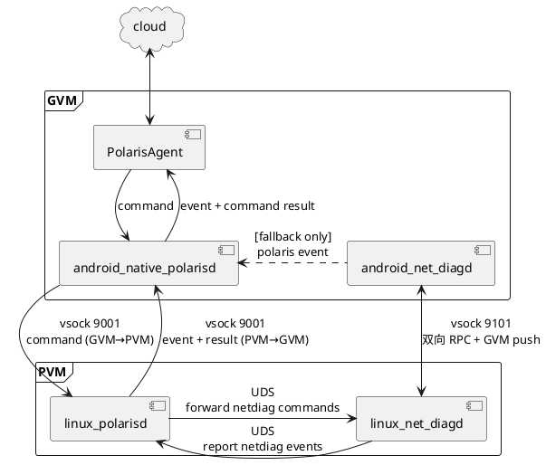

# 智能座舱网络诊断系统设计

> 本文档是网络诊断模块的**系统设计文档**（System Design），是编码和测试的权威参考。
> 上游文档：`network_topology.md`（拓扑基线）、`network_diagnosis_requirements.md`（功能需求）
> 推导过程：`network_diagnosis_design_progress.md`（调研日志）
> 适用平台：SA8397，PVM Linux 6.6.110-rt61 PREEMPT_RT + GVM Android（qcrosvm Hypervisor）
> 架构方案：**方案 E**（专用 VSOCK + PVM 单一事件出口 + GVM 轻量采集）

---

## 1. 设计目标与非目标

### 1.1 设计目标

1. **实时监测**：秒级感知 link down、conntrack 表满、关键服务退出、路由/NAT 漂移等网络故障，不等用户投诉。
2. **端到端可定位**：从 L1 物理链路到 L5 应用服务 + 虚拟化 + 安全，分层输出根因，不做黑盒"网络不通"。
3. **业务可用性视角**：通过 SHU（Service Health Unit）+ 主动 probe，判断业务通道是否真正可用，区分"配置对但业务坏"。
4. **可追溯**：每个异常附带完整证据链（原始命令输出、抓包、probe 历史、基线 diff），单条 incident 可复盘。
5. **安全可控**：全链路只读命令白名单；抓包限时长；不修改网络配置。

### 1.2 非目标

- 不自动修改任何网络配置
- 不做 IDS/IPS 深度入侵检测
- 不诊断第三方 ECU 内部故障
- 不分析 mmhab 视频帧内容质量

---

## 2. 架构总图



### 2.1 三通道定义

| 通道 | 端点 | 传输 | 用途 | 方向 |
|------|------|------|------|------|
| **A** | `android_net_diagd` ↔ `linux_net_diagd` | VSOCK port 9101 | 诊断 RPC + GVM push | 双向 |
| **B** | `android_native_polarisd` ↔ `linux_polarisd` | VSOCK port 9001 | polaris 命令与事件（复用现成） | 命令 GVM→PVM，事件 PVM→GVM |
| **C** | `linux_polarisd` ↔ `linux_net_diagd` | UDS `/run/polaris/network-diag.sock` | 云命令最后一跳 + 事件上报入口 | 双向 |
| **Fallback** | `android_net_diagd` → `android_native_polarisd` | polaris event API | VSOCK 9101 不可用时兜底 | GVM→Cloud |

### 2.2 设计原则

- **PVM 为主，GVM 为从**：PVM 承担所有分析、报告、事件上报；GVM 只做本地采集 + 异常推送。
- **事件单一出口**：所有网络诊断事件统一经 PVM `polaris_report_raw` 出口，避免双端各报各的导致关联断裂。
- **VSOCK 做 RPC，不做 IP RPC**：诊断 RPC 不依赖被诊断的 IP 栈——若用 vmtap0 IP 通道，当 iptables NAT/forwarding 故障时，诊断模块自身也失联。

---

## 3. 进程设计

### 3.1 `linux_net_diagd`（PVM 主诊断进程）

#### 3.1.1 职责

| 职责 | 周期/触发 | 输出 |
|------|----------|------|
| 周期巡检（轻量） | 每 60s | 接口 carrier、vmtap 通路、conntrack 比例、关键 NAT 计数、probe 最近 1min 健康 |
| 周期巡检（全量） | 每 1h | 全量 baseline diff + INFO 级 SCAN_REPORT |
| watchdog 事件监听 | 实时（netlink/sd-journal/poll） | 检测到异常立即采证 + 上报 |
| probe 主动探测 | 按 SHU 配置周期（60s/300s/600s） | ICMP/DNS/HTTP probe 结果写入 jsonl |
| 接收 GVM push | 实时（VSOCK 9101 server） | GVM 异常通报 → 触发对应 SHU 检查 |
| 综合分析 | 触发式 | PVM + GVM + probe 三源合并 → 根因 + incident_dir |
| 事件上报 | 异常 + 每日摘要 | `polaris_report_raw` → PVM polarisd |
| 响应云命令 | UDS 接收 `NetdiagBridgeAction` | 执行 scope/scenario/shu → 回 result |

#### 3.1.2 线程模型

```
main thread
 ├── ScanScheduler   (timerfd, 60s / 1h)
 ├── WatchdogReactor  (epoll: netlink + inotify operstate + journald)
 ├── ProbeScheduler   (timerfd, per-SHU coalesce)
 ├── VsockServer      (epoll: VSOCK 9101 listen/accept/read/write)
 ├── UdsClient        (persistent connect to polarisd /run/polaris/network-diag.sock)
 └── 1× WorkerPool    (4 threads, bounded queue, for command execution)
```

#### 3.1.3 生命周期

| 阶段 | 行为 |
|------|------|
| 启动 | systemd `After=network.target polarisd.service`；加载 `/etc/polaris/network-diag-pvm.json`；能力探测（ethtool/conntrack/tcpdump 可用性）；连接 UDS；启动 VSOCK server |
| 就绪 | 等待 10s（关键接口 link up 超时），执行首次全量 baseline diff，上报 INFO SCAN_REPORT |
| 运行 | ScanScheduler + WatchdogReactor + ProbeScheduler + VsockServer 并发工作 |
| 崩溃 | systemd `Restart=always`，`RestartSec=2s` |
| 退出 | SIGTERM → 执行最后一次快照 → flush 事件 → 退出 |

### 3.2 `android_net_diagd`（GVM 采集推送进程）

#### 3.2.1 职责

| 职责 | 周期/触发 | 输出 |
|------|----------|------|
| 周期巡检（轻量） | 每 60s | 接口 carrier、dumpsys connectivity 默认网络、关键 `ip route get` |
| 周期巡检（全量） | 每 1h | 全量采集 + 推送 PVM（含 baseline diff） |
| watchdog 事件监听 | 实时（netlink + Connectivity callback） | 检测到异常立即采证 + push PVM |
| 业务网络不通主动报警 | 触发式（关键路径探测失败 N/M 次） | push `gvm_alert` via VSOCK 9101 |
| 响应 PVM RPC | 实时（VSOCK 9101 client） | 收到 `collect`/`snapshot` request → 执行 → 回包 |
| 本地 fail-safe | VSOCK 9101 不可用持续 60s | 降级"本地巡检 + 本地 incident"，经 polaris event 链上报 |

#### 3.2.2 线程模型

```
main thread
 ├── ScanScheduler   (Handler, 60s / 1h)
 ├── WatchdogReactor  (NetlinkListener + periodic Connectivity poll)
 ├── VsockClient      (persistent connect to CID=2:9101, heartbeat 30s)
 └── 1× WorkerPool    (2 threads, for command execution + snapshot packaging)
```

#### 3.2.3 生命周期

| 阶段 | 行为 |
|------|------|
| 启动 | init.rc `class main`；加载 `/system/etc/polaris/network-diag-gvm.json`；能力探测；connect VSOCK 9101 |
| 就绪 | 版本协商（hello frame）；执行首次 snapshot → push PVM |
| 运行 | ScanScheduler + WatchdogReactor + VsockClient 并发 |
| VSOCK 断开 | 指数退避重连（1s/2s/4s/...，封顶 30s）；超 60s 进入 fallback 模式 |
| 崩溃 | init.rc auto-restart |
| 退出 | SIGTERM → 最后一次 snapshot → push PVM → 退出 |

---

## 4. 数据流

### 4.1 路径①：PVM 自感知 → 上报

```
PVM watchdog (netlink carrier=0 / conntrack≥80% / sd-journal "table full" / netlink route/NAT drift)
 → linux_net_diagd 立即采 PVM (ip/iptables/ss/conntrack/dmesg)
 → incident_dir 创建
 → polaris_report_raw(NETDIAG_*, json_body, incident_dir)
 → PVM polarisd → VSOCK 9001 → GVM polarisd → PolarisAgent → Cloud
```

延迟：< 3 秒（不含云端传输）

### 4.2 路径②：GVM 主动推送 + PVM 加料 → 上报

```
GVM watchdog 检测异常（如 ping 10.10.103.1 连续失败 5/5）
 → android_net_diagd 采 GVM 快照 → snap_dir
 → push gvm_alert via VSOCK 9101 → linux_net_diagd
 → PVM 立即跑对应 SHU 的 PVM 检查 + probe 加紧打 N 轮
 → 合并 GVM snap_dir + PVM 数据 → incident_dir
 → polaris_report_raw → ... → Cloud
```

延迟：< 10 秒（含 GVM 采集 + VSOCK 传输 + PVM 补充检查 + probe 加速）

### 4.3 路径③：云下发诊断命令

```
Cloud → PolarisAgent → GVM polarisd → VSOCK 9001 → PVM polarisd
 → CommandExecutor → NetdiagBridgeAction
 → UDS → linux_net_diagd
 → 解析 args { scope: "full"|"vlan:N"|"scenario:X"|"shu:Y" }
 → 本地采 PVM
 → 同时 VSOCK 9101 request{method:"collect", args:{sections:[...]}} → android_net_diagd → 采 GVM → response
 → 合并 → incident_dir → polaris_report_raw → ... → Cloud
```

延迟：< 30 秒（含两端采集 + 跨 VM 往返）

### 4.4 路径④：应用主动报障

```
com.mega.map → Polaris.reportNetworkTrouble(target, ETIMEDOUT, ...)
 → polaris_event_create(NETDIAG_APP_NETWORK_TROUBLE) → GVM polarisd
 → (option a) VSOCK 9001 事件推 PVM polarisd → UDS → linux_net_diagd
 → PVM 立即跑对应 SHU 检查 + probe
 → verdict: network_layer_healthy | network_layer_degraded | network_layer_failed
 → polaris_report_raw → ... → Cloud
```

延迟：< 10 秒（从 App 调用到 SHU 结论上云）

---

## 5. VSOCK 9101 协议规范（通道 A）

### 5.1 帧格式

```
+---------+---------+-----------------+
| magic   | length  | json payload    |
| 4 bytes | 4 bytes | length bytes    |
+---------+---------+-----------------+
magic  = 0x4E444741 ("NDGA" = NetDiaGAgent)
length = htobe32(uint32_t), max 4 MiB
```

### 5.2 消息类型

#### HELLO（连接建立后第一帧，版本协商）

```json
{"msg":"hello","version":1,"role":"gvm"|"pvm"}
```

#### REQUEST（双向 RPC）

```json
{
  "msg":        "request",
  "req_id":     1,
  "method":     "collect" | "probe" | "snapshot" | "fetch_log" | "ping",
  "args":       { ... },
  "timeout_ms": 5000
}
```

method 定义：

| method | 发起方 | 用途 | args |
|--------|--------|------|------|
| `collect` | PVM→GVM | 按需采集 GVM 数据 | `sections: ["addr","route","rule","neigh","ss","dumpsys","proc_net_dev"]` |
| `probe` | PVM→GVM | 要求 GVM 执行探测 | `target, count, timeout_sec` |
| `snapshot` | PVM→GVM | 要求 GVM 全量快照 | `reason: "cloud_command"|"periodic"` |
| `fetch_log` | PVM→GVM | 拉取 log_ref 目录中的文件 | `log_ref, files: ["ip_addr.txt",...]` |
| `ping` | 任一方 | 心跳检测 | 无 |

#### RESPONSE

```json
{
  "msg":     "response",
  "req_id":  1,
  "code":    0,
  "errmsg":  "OK",
  "data":    { ... },
  "log_ref": "/log/perf/network-diag/snaps/snap_xxx"
}
```

#### PUSH（单向通知）

```json
{
  "msg":     "push",
  "type":    "gvm_alert" | "pvm_alert" | "heartbeat",
  "ts_unix": 1747764000,
  "payload": { ... },
  "log_ref": "/log/perf/network-diag/snaps/snap_xxx"
}
```

### 5.3 GVM alert push payload 规范

```json
{
  "msg":     "push",
  "type":    "gvm_alert",
  "ts_unix": 1747764000,
  "payload": {
    "alert_id":      "VLAN3_GATEWAY_UNREACHABLE",
    "severity":      "FAIL",
    "shu":           "SHU_VLAN3_INTERNET",
    "target":        "10.10.103.1",
    "via_iface":     "eth1.3",
    "details":       "GVM ping 10.10.103.1 失败 5/5 包",
    "first_seen":    1747763880,
    "consec_fails":  5,
    "snapshot_brief": {
      "iface_up":          true,
      "has_default_route": true,
      "neigh_state":       "FAILED",
      "default_netid":     102
    }
  },
  "log_ref": "/log/perf/network-diag/snaps/snap_20260509_153000_VLAN3GW"
}
```

> **约束**：push payload ≤ 4 KiB。完整取证文件落 `log_ref` 目录，PVM 按需 `fetch_log` 拉取。

### 5.4 连接管理

| 项目 | 规范 |
|------|------|
| PVM 端 | VSOCK server，listen `VMADDR_CID_HOST(2):9101`，`SOCK_STREAM` |
| GVM 端 | VSOCK client，connect `CID=2:9101`；断线指数退避（1s/2s/4s/...max 30s） |
| 心跳 | 每 30s 双向 `push {type:"heartbeat"}`；连续 3 次未收到 → close + reconnect |
| 版本协商 | 首帧必须是 hello；version 或 role 不匹配 → close |
| 鉴权 | VSOCK CID 内核级隔离，hello 仅校验 version+role |
| 单连接 | 每端仅一条 peer；新连接挤旧 |
| failover | VSOCK 不可用持续 60s → GVM 进入 fallback（polaris event 链上报） |

---

## 6. 通道 C 协议（PVM polarisd ↔ linux_net_diagd UDS）

### 6.1 传输

- 路径：`/run/polaris/network-diag.sock`
- 类型：`SOCK_SEQPACKET`，非阻塞
- 协议：复用 polarisd 现有 LSP Codec（12-byte header + JSON payload）
- msgType：`CMD_REQ (0x0020)` polarisd→diag；`CMD_RESP (0x0021)` diag→polarisd
- 连接：linux_net_diagd 启动后 connect；断线 1s 重连

### 6.2 命令格式

```json
// polarisd → diag
{
  "req_id":   123,
  "action":   "netdiag.run",
  "args": {
    "scope":  "full" | "vlan" | "scenario" | "shu",
    "target": "SHU_VLAN3_INTERNET"
  }
}

// diag → polarisd（事件上报）
{
  "msg":      "polaris_event",
  "event_id": "0x4E5E0002",
  "json_body": "{...}",
  "log_path": "/log/perf/network-diag/incidents/incident_xxx"
}
```

> **注意**：当前 polaris client SDK 仅暴露"发事件"API，建议 polaris 团队扩展 `polaris_command_listener_register(callback)`。v1 可临时直接用 LspCodec 对接。

---

## 7. 配置设计

### 7.1 配置清单

| 文件 | 部署位置 | 内容 |
|------|---------|------|
| `network-diag-pvm.json` | PVM `/etc/polaris/network-diag-pvm.json` | PVM 基线 + watchdog 阈值 + IAction 参数白名单 + 检查项全集 + SHU + probe 配置 + 事件 ID 映射 |
| `network-diag-gvm.json` | GVM `/system/etc/polaris/network-diag-gvm.json` | GVM 基线（仅 GVM 侧对象）+ NetId 模板 + watchdog 配置 + 采集 section 定义 |

### 7.2 配置 Schema

```jsonc
{
  "version":           "1.0",
  "baseline_version":  "v1.0-2026-05-09",
  "platform":          "SA8397",
  "side":              "PVM",

  // ========== 全局策略 ==========
  "policy": {
    "scan_interval_light_sec": 60,
    "scan_interval_full_sec":  3600,
    "trigger_min_gap_sec":     30,
    "global_min_interval_sec": 10,
    "incident_retention_days": 7,
    "incident_max_count":      50,
    "incident_max_size_mb":    200,
    "incident_single_max_mb":  50,
    "tcpdump_max_sec":         10,
    "tcpdump_max_pkts":        2000,
    "command_timeout_sec":     5,
    "readonly_only":           true,

    // PREEMPT_RT 资源约束
    "cpu_nice":          10,
    "io_class":          "best-effort",
    "io_prio":           7,
    "max_memory_mb":     64,
    "probe_max_pps":     100,
    "dns_probe_max_per_min": 5
  },

  // ========== 拓扑基线 ==========
  "baseline": {
    "pvm": {
      "phys_mac": {
        "eth0": "02:df:53:00:00:09",
        "eth1": "02:df:53:00:00:04"
      },
      "phys_ifaces": [
        {"name": "eth0", "expected_speed": "1000", "expected_duplex": "full"},
        {"name": "eth1", "expected_speed": "1000", "expected_duplex": "full"}
      ],
      "vlan_ifaces": [
        {"name": "eth1.3",  "ip": "172.16.103.40/24", "vlan": 3,  "parent": "eth1"},
        {"name": "eth1.4",  "ip": "172.16.104.40/24", "vlan": 4,  "parent": "eth1"},
        {"name": "eth1.6",  "ip": "172.16.106.40/24", "vlan": 6,  "parent": "eth1"},
        {"name": "eth1.7",  "ip": "172.16.107.40/24", "vlan": 7,  "parent": "eth1"},
        {"name": "eth1.8",  "ip": "172.16.108.40/24", "vlan": 8,  "parent": "eth1"},
        {"name": "eth1.10", "ip": "172.16.110.40/24", "vlan": 10, "parent": "eth1"},
        {"name": "eth1.11", "ip": "172.16.111.40/24", "vlan": 11, "parent": "eth1"},
        {"name": "eth1.12", "ip": "172.16.112.40/24", "vlan": 12, "parent": "eth1"},
        {"name": "eth1.13", "ip": "172.16.113.40/24", "vlan": 13, "parent": "eth1"},
        {"name": "eth1.14", "ip": "172.16.114.40/24", "vlan": 14, "parent": "eth1"},
        {"name": "eth0.15", "ip": "172.16.115.41/24", "vlan": 15, "parent": "eth0"},
        {"name": "eth0.19", "ip": "172.16.119.41/24", "vlan": 19, "parent": "eth0"}
      ],
      "vmtap": [
        {"name": "vmtap0",   "ip": "10.10.200.1/24",                   "vlan": null},
        {"name": "vmtap1",   "ip": null,                                "vlan": null, "note": "trunk parent, no IP"},
        {"name": "vmtap1.3", "ip": "10.10.103.1/24", "vlan": 3,  "parent": "vmtap1"},
        {"name": "vmtap1.4", "ip": "10.10.104.1/24", "vlan": 4,  "parent": "vmtap1"},
        {"name": "vmtap1.6", "ip": "10.10.106.1/24", "vlan": 6,  "parent": "vmtap1"},
        {"name": "vmtap1.7", "ip": "10.10.107.1/24", "vlan": 7,  "parent": "vmtap1"},
        {"name": "vmtap1.8", "ip": "10.10.108.1/24", "vlan": 8,  "parent": "vmtap1"}
      ],
      "policy_route": [
        {"prio": 217, "iif": "vmtap1.8", "table": 108},
        {"prio": 218, "iif": "vmtap1.7", "table": 107},
        {"prio": 219, "iif": "vmtap1.6", "table": 106}
      ],
      "table_220_expected_empty": true,
      "gateways": {
        "VLAN3_TBOX":  {"ip": "172.16.103.20", "expected_neigh": ["REACHABLE","STALE","PERMANENT"]},
        "VLAN6_ADCU":  {"ip": "172.16.106.20", "expected_neigh": ["REACHABLE","STALE","PERMANENT"]},
        "VLAN7_OTA":   {"ip": "172.16.107.20", "expected_neigh": ["REACHABLE","STALE","PERMANENT"]},
        "VLAN8_ADAS":  {"ip": "172.16.108.20", "expected_neigh": ["REACHABLE","STALE","PERMANENT"]}
      },
      "kernel_params": {
        "net.ipv4.ip_forward":         1,
        "net.ipv4.conf.all.forwarding": 1,
        "net.ipv4.conf.all.rp_filter": 0
      },
      "per_iface_params": {
        "eth1.3":  {"forwarding":1,"rp_filter":2},
        "eth1.4":  {"forwarding":1,"rp_filter":2},
        "eth1.6":  {"forwarding":1,"rp_filter":2},
        "eth1.7":  {"forwarding":1,"rp_filter":2},
        "eth1.8":  {"forwarding":1,"rp_filter":2},
        "eth1.10": {"forwarding":1,"rp_filter":2},
        "eth1.11": {"forwarding":1,"rp_filter":2},
        "eth1.12": {"forwarding":1,"rp_filter":2},
        "eth1.13": {"forwarding":1,"rp_filter":2},
        "eth1.14": {"forwarding":1,"rp_filter":2},
        "eth0.15": {"forwarding":1,"rp_filter":2},
        "eth0.19": {"forwarding":1,"rp_filter":2},
        "vmtap1.3":{"forwarding":1,"rp_filter":2},
        "vmtap1.4":{"forwarding":1,"rp_filter":2},
        "vmtap1.6":{"forwarding":1,"rp_filter":2},
        "vmtap1.7":{"forwarding":1,"rp_filter":2},
        "vmtap1.8":{"forwarding":1,"rp_filter":2},
        "vmtap0":  {"forwarding":1,"rp_filter":2}
      },
      "pvm_only_vlans": [10,11,12,13,14,15,19],
      "expected_absent_components": ["SAIL_HSGMII_P10"]
    },
    "gvm": {
      "vlan_ifaces": [
        {"name": "eth0",   "ip": "10.10.200.40/24", "vlan": null},
        {"name": "eth1",   "ip": null,                "vlan": null, "note": "trunk parent"},
        {"name": "eth1.3", "ip": "10.10.103.40/24", "vlan": 3},
        {"name": "eth1.4", "ip": "10.10.104.40/24", "vlan": 4},
        {"name": "eth1.6", "ip": "10.10.106.40/24", "vlan": 6},
        {"name": "eth1.7", "ip": "10.10.107.40/24", "vlan": 7},
        {"name": "eth1.8", "ip": "10.10.108.40/24", "vlan": 8}
      ],
      "main_no_default": true,
      "dummy0_fallback_excluded": true,
      "default_route": {"table":"eth1.3","prio":31000,"fwmark":"0x0/0xffff","note":"unmarked traffic → eth1.3"},
      "netid_template": {
        "_comment": "NetId↔VLAN 从 dumpsys connectivity + ip rule 动态推断，此处仅定义 VLAN 角色",
        "default":   "eth1.3",
        "ota":       "eth1.7",
        "adas":      "eth1.8",
        "adcu_park": "eth1.6"
      },
      "mac_policy": "check_nonzero_and_consistent_across_subifaces"
    }
  },

  // ========== 关键服务基线 ==========
  "services": {
    "pvm": [
      {"name":"xdja_idps",     "bind":"172.16.104.40:30006",     "proto":"tcp"},
      {"name":"someipd",       "bind":"172.16.110.40:30490",     "proto":"udp", "note":"multicast 239.5.1.2"},
      {"name":"someipd",       "bind":"172.16.110.40:51000",     "proto":"tcp"},
      {"name":"someipd",       "bind":"172.16.111.40:51001",     "proto":"tcp"},
      {"name":"someipd",       "bind":"172.16.112.40:30490",     "proto":"udp"},
      {"name":"someipd",       "bind":"172.16.113.40:30505",     "proto":"tcp"},
      {"name":"someipd",       "bind":"172.16.114.40:57001",     "proto":"tcp"},
      {"name":"someipd",       "bind":"172.16.119.40:55005",     "proto":"tcp"},
      {"name":"amblightserver", "bind":"10.10.200.1:55498",      "proto":"udp", "note":"Host-Guest only"},
      {"name":"dlt-daemon",    "bind":"*:3490",                   "proto":"tcp"},
      {"name":"ivcd_main",     "bind":"*:80",                     "proto":"tcp"},
      {"name":"charon-systemd","bind":"*:500",                    "proto":"udp", "note":"IPSec/IKE"},
      {"name":"charon-systemd","bind":"*:4500",                   "proto":"udp"}
    ],
    "gvm": [
      {"name":"doip_server",   "bind":"10.10.104.40:13400",      "proto":"tcp,udp"},
      {"name":"vlm-agent",     "bind":"10.10.104.40:5062",       "proto":"tcp"},
      {"name":"vlm-agent",     "bind":"10.10.104.40:5064",       "proto":"udp"},
      {"name":"gftpd",         "bind":"10.10.104.40:58046",      "proto":"tcp"}
    ],
    "security_sensitive_bind_any": [
      {"bind":"*:22",   "svc":"sshd",       "expect":"production_closed"},
      {"bind":"*:23",   "svc":"telnetd",    "expect":"production_closed"},
      {"bind":"*:21",   "svc":"proftpd",    "expect":"documented"},
      {"bind":"*:111",  "svc":"rpcbind",    "expect":"documented"},
      {"bind":"*:2049", "svc":"nfs",        "expect":"documented"},
      {"bind":"*:5555", "svc":"adbd",       "expect":"documented"},
      {"bind":"*:58050","svc":"hpp_transfer","expect":"documented"},
      {"bind":"*:8099", "svc":"ah.shortcut","expect":"documented"},
      {"bind":"*:18795","svc":"qqlive.audiobox","expect":"production_closed"},
      {"bind":"*:8753", "svc":"qqlive.audiobox","expect":"production_closed"},
      {"bind":"*:1888", "svc":"qqlive.audiobox","expect":"production_closed"},
      {"bind":"*:15002","svc":"awe_linuxproxy","expect":"documented"}
    ]
  }
}
```

---

## 8. 检查项定义（Check Registry）

> 每个检查项对应需求文档的一个或多个 `NET-DIAG-*` ID。检查项统一以 JSON 配置形式管理，代码只实现 parser + comparator。

### 8.1 检查项总表

| # | Check ID | 对应需求 | 层级 | 端 | 严重度 |
|---|----------|---------|------|----|--------|
| 1 | L1-LINK-001 | LINK-001 | L1 | PVM | FAIL |
| 2 | L1-LINK-002 | LINK-002 | L1 | PVM | FAIL |
| 3 | L1-LINK-003 | LINK-003 | L1 | PVM | WARN/FAIL |
| 4 | L1-LINK-004 | LINK-004 | L1 | PVM | FAIL |
| 5 | L1-LINK-005 | LINK-005 | L1 | PVM | INFO/BLOCKED |
| 6 | L1-LINK-006 | LINK-006 | L1 | PVM | FAIL |
| 7 | L2-VLAN-001 | VLAN-001 | L2 | PVM | FAIL |
| 8 | L2-VLAN-002 | VLAN-002 | L2 | PVM | FAIL |
| 9 | L2-VLAN-003 | VLAN-003 | L2 | GVM | FAIL |
| 10 | L2-VLAN-004 | VLAN-004 | L2 | BOTH | FAIL |
| 11 | L2-VLAN-005 | VLAN-005 | L2 | PVM | WARN/FAIL |
| 12 | L2-VLAN-006 | VLAN-006 | L2 | PVM | INFO |
| 13 | L2-VLAN-007 | VLAN-007 | L2 | PVM | FAIL |
| 14 | L3-IP-001 | IP-001 | L3 | PVM | FAIL |
| 15 | L3-IP-002 | IP-002 | L3 | GVM | FAIL |
| 16 | L3-IP-003 | IP-003 | L3 | PVM | FAIL |
| 17 | L3-IP-004 | IP-004 | L3 | PVM | FAIL |
| 18 | L3-IP-005 | IP-005 | L3 | PVM | INFO/WARN |
| 19 | L3-ROUTE-001 | ROUTE-001 | L3 | PVM | FAIL |
| 20 | L3-ROUTE-002 | ROUTE-002 | L3 | PVM | FAIL |
| 21 | L3-ROUTE-003 | ROUTE-003 | L3 | PVM | INFO/WARN |
| 22 | L3-ROUTE-004 | ROUTE-004 | L3 | GVM | WARN |
| 23 | L3-ROUTE-005 | ROUTE-005 | L3 | GVM | FAIL |
| 24 | L3-ROUTE-006 | ROUTE-006 | L3 | BOTH | INFO |
| 25 | L4-NAT-001 | NAT-001 | L4 | PVM | FAIL |
| 26 | L4-NAT-002 | NAT-002 | L4 | PVM | FAIL |
| 27 | L4-NAT-003 | NAT-003 | L4 | PVM | FAIL |
| 28 | L4-NAT-004 | NAT-004 | L4 | PVM | INFO/WARN |
| 29 | L4-FW-001 | FW-001 | L4 | PVM | WARN |
| 30 | L4-FW-002 | FW-002 | L4 | PVM | WARN |
| 31 | L4-FW-003 | FW-003 | L4 | PVM | WARN/FAIL |
| 32 | L4-FW-004 | FW-004 | L4 | PVM | FAIL |
| 33 | L4-FW-005 | FW-005 | L4 | PVM | INFO/WARN |
| 34 | VM-001 | VM-001 | VIRT | PVM | FAIL |
| 35 | VM-002 | VM-002 | VIRT | BOTH | FAIL |
| 36 | VM-003 | VM-003 | VIRT | BOTH | FAIL |
| 37 | VM-004 | VM-004 | VIRT | BOTH | WARN/FAIL |
| 38 | VM-005 | VM-005 | VIRT | BOTH | FAIL |
| 39 | VM-006 | VM-006 | VIRT | BOTH | FAIL |
| 40 | VM-007 | VM-007 | VIRT | BOTH | FAIL |
| 41 | SVC-001 | SVC-001 | L5 | BOTH | FAIL |
| 42 | SVC-002 | SVC-002 | L5 | PVM | FAIL |
| 43 | SVC-003 | SVC-003 | L5 | PVM | FAIL |
| 44 | SVC-004 | SVC-004 | L5 | BOTH | FAIL |
| 45 | SVC-005 | SVC-005 | L5 | BOTH | WARN/FAIL |
| 46 | SVC-006 | SVC-006 | L5 | BOTH | WARN/FAIL |
| 47 | SVC-007 | SVC-007 | L5 | PVM | FAIL |
| 48 | SVC-008 | SVC-008 | L5 | PVM | FAIL |
| 49 | SVC-009 | SVC-009 | L5 | PVM | WARN/FAIL |
| 50 | SVC-010 | SVC-010 | L5 | BOTH | WARN/BLOCKED |
| 51 | SVC-011 | SVC-011 | L5 | BOTH | FAIL |
| 52 | SVC-012 | SVC-012 | L5 | PVM | FAIL |
| 53 | PORT-001 | PORT-001 | L5 | PVM | INFO |
| 54 | PORT-002 | PORT-002 | L5 | GVM | INFO |
| 55 | PORT-003 | PORT-003 | L5 | GVM | FAIL |
| 56 | PORT-004 | PORT-004 | L5 | BOTH | WARN |
| 57 | PORT-005 | PORT-005 | L5 | PVM | FAIL |
| 58 | PERF-001 | PERF-001 | PERF | PVM | WARN/FAIL |
| 59 | PERF-002 | PERF-002 | PERF | PVM | WARN/FAIL |
| 60 | PERF-003 | PERF-003 | PERF | PVM | INFO |
| 61 | PERF-004 | PERF-004 | PERF | PVM | WARN |
| 62 | PERF-005 | PERF-005 | PERF | BOTH | FAIL |
| 63 | PERF-006 | PERF-006 | PERF | PVM | WARN |
| 64 | SEC-001 | SEC-001 | SEC | PVM | INFO |
| 65 | SEC-002 | SEC-002 | SEC | PVM | INFO |
| 66 | SEC-003 | SEC-003 | SEC | BOTH | FAIL |
| 67 | SEC-004 | SEC-004 | SEC | PVM | FAIL |
| 68 | SEC-005 | SEC-005 | SEC | PVM | WARN |
| 69 | SEC-006 | SEC-006 | SEC | BOTH | WARN |
| 70 | BASE-001 | BASE-001 | — | BOTH | INFO |
| 71 | BASE-002 | BASE-002 | — | BOTH | FAIL |
| 72 | BASE-003 | BASE-003 | — | BOTH | INFO/WARN |
| 73 | BASE-004 | BASE-004 | — | BOTH | INFO |
| 74 | BASE-005 | BASE-005 | — | BOTH | FAIL |

### 8.2 检查项配置格式示例

```jsonc
{
  "id":             "L4-NAT-001",
  "req_ids":        ["NET-DIAG-NAT-001"],
  "layer":          "L4",
  "side":           "PVM",
  "enable":         true,
  "severity":       "FAIL",
  "event_id":       "0x4E5E0005",
  "command":        "iptables -t nat -S",
  "parser":         "nat_rules",
  "expect": {
    "must_contain": [
      "-A PREROUTING -d 172.16.103.40/32 -i eth1.3 -j DNAT --to-destination 10.10.103.40",
      "-A PREROUTING -d 172.16.104.40/32 -i eth1.4 -p tcp -m tcp ! --dport 30006 -j DNAT --to-destination 10.10.104.40",
      "-A PREROUTING -d 172.16.104.40/32 -i eth1.4 ! -p tcp -j DNAT --to-destination 10.10.104.40",
      "-A PREROUTING -d 172.16.106.40/32 -i eth1.6 -j DNAT --to-destination 10.10.106.40",
      "-A PREROUTING -d 172.16.107.40/32 -i eth1.7 -j DNAT --to-destination 10.10.107.40",
      "-A PREROUTING -d 172.16.108.40/32 -i eth1.8 -j DNAT --to-destination 10.10.108.40"
    ],
    "rule_order": [
      {
        "chain":  "PREROUTING",
        "before": "172.16.104.40/32 -i eth1.4 -p tcp -m tcp ! --dport 30006",
        "after":  "172.16.104.40/32 -i eth1.4 ! -p tcp"
      }
    ]
  },
  "evidence_files": ["pvm/iptables_nat_S.txt", "pvm/iptables_nat_Lnv.txt"],
  "suggestion":     "恢复 VLAN X DNAT 规则；复核 TCP/30006 IDPS 例外规则顺序",
  "recheck_cmd":    "iptables -t nat -L -nv; tcpdump -ni eth1.4 -c 50"
}
```

---

## 9. SHU（Service Health Unit）设计

### 9.1 SHU 列表

| SHU ID | 业务 | 优先级 | 适用条件 |
|--------|------|--------|---------|
| `SHU_VLAN3_INTERNET` | 默认互联网（地图/媒体/OTA 上行） | P0 | 始终 |
| `SHU_DNS` | DNS 解析（跨 VLAN 3） | P0 | 始终 |
| `SHU_VLAN4_DOIP` | 诊断仪连接 DoIP/VLM | P0 | 始终（被动探测） |
| `SHU_VLAN6_ADCU_PARK` | ADCU 泊车/APA | P0 | 车机启动后 |
| `SHU_VLAN7_OTA` | OTA/远程诊断 | P1 | 始终 |
| `SHU_VLAN8_ADAS` | ADAS Internet | P1 | 始终 |
| `SHU_HOST_GUEST` | PVM↔GVM 控制通道 | P0 | 始终 |
| `SHU_VLAN15_RTSP` | ADCU 视频输入 | P0 | 车机启动后 |
| `SHU_SOMEIP_BUS` | SOME/IP 服务总线（VLAN 10-14/19） | P0 | 始终 |

### 9.2 SHU 配置格式

```jsonc
{
  "id": "SHU_VLAN3_INTERNET",
  "name": "默认互联网通道",
  "priority": "P0",
  "deps": {
    "checks": [
      "L1-LINK-001", "L2-VLAN-001", "L2-VLAN-007",
      "L3-IP-001", "L3-IP-003", "L3-IP-004",
      "L3-ROUTE-001", "L3-ROUTE-006",
      "L4-NAT-001", "L4-NAT-002", "L4-FW-001",
      "VM-003",
      "SVC-001", "SVC-011", "SVC-012"
    ],
    "interfaces":  ["eth1.3","vmtap1.3","GVM:eth1.3"],
    "kernel":      ["ip_forward","conf.eth1.3.forwarding"],
    "iptables":    ["NAT_VLAN3"],
    "neighbor":    ["172.16.103.20"]
  },
  "probes": [
    {"type":"icmp","iface":"eth1.3","target":"172.16.103.20","interval_sec":60, "count":3,"loss_warn_pct":1,"loss_fail_pct":5,"rtt_warn_ms":50,"rtt_fail_ms":100},
    {"type":"icmp","iface":"eth1.3","target":"8.8.8.8",       "interval_sec":300,"count":3,"loss_warn_pct":1,"loss_fail_pct":5},
    {"type":"dns", "via":"VLAN3",   "target":"www.baidu.com",  "interval_sec":300,"timeout_sec":3}
  ],
  "consumers": ["com.mega.map", "cockpit.qqmusic", "all_default_netid_apps"],
  "sla": {
    "icmp_loss_warn_pct": 1, "icmp_loss_fail_pct": 5,
    "icmp_rtt_warn_ms":  50, "icmp_rtt_fail_ms":  100,
    "dns_fail_threshold": 3
  }
}
```

### 9.3 SHU 健康评分规则

| 输入 | 判定 |
|------|------|
| 任意 deps.check 返回 FAIL | SHU = FAIL |
| 任意 probe 连续失败 ≥ SLA 阈值 | SHU = FAIL |
| 任意 deps.check 返回 WARN | SHU = WARN |
| 任意 probe 单次失败但未达阈值 | SHU = WARN |
| 所有 check PASS + 所有 probe OK | SHU = PASS |
| 任一 check BLOCKED 且无 FAIL | SHU = WARN + BLOCKED hint |

---

## 10. 事件设计

### 10.1 事件 ID 段位

| 事件名 | 建议 ID | 触发条件 | 严重度 |
|--------|---------|---------|--------|
| `NETDIAG_BASELINE_DRIFT` | `0x4E5E0001` | 接口/IP/MAC/路由/iptables 与基线偏离 | WARN/FAIL |
| `NETDIAG_LINK_DOWN` | `0x4E5E0002` | `eth0`/`eth1` carrier=0 或 link DOWN | FAIL |
| `NETDIAG_LINK_FLAPPING` | `0x4E5E0003` | 5min carrier_changes 增量 ≥3 | FAIL |
| `NETDIAG_VLAN_MISSING` | `0x4E5E0004` | 关键 VLAN 子接口缺失 | FAIL |
| `NETDIAG_NAT_RULE_DRIFT` | `0x4E5E0005` | iptables NAT 规则缺失/顺序异常 | FAIL |
| `NETDIAG_FORWARD_DISABLED` | `0x4E5E0006` | `ip_forward=0` 或 per-iface forwarding=0 | FAIL |
| `NETDIAG_CONNTRACK_PRESSURE` | `0x4E5E0007` | 使用率 ≥80% / dmesg `table full` | WARN/FAIL |
| `NETDIAG_GATEWAY_UNREACHABLE` | `0x4E5E0008` | 关键网关 ARP FAILED 或 ICMP 不通 | FAIL |
| `NETDIAG_VM_LINK_BROKEN` | `0x4E5E0009` | vmtap 异常 / Host-Guest 通道不通 | FAIL |
| `NETDIAG_HYPERVISOR_DOWN` | `0x4E5E000A` | qcrosvm 进程消失 | FAIL |
| `NETDIAG_SERVICE_DOWN` | `0x4E5E000B` | DoIP/IDPS/someipd/Camera Server 端口未监听 | FAIL |
| `NETDIAG_EXPOSURE_RISK` | `0x4E5E000C` | 新增 `0.0.0.0` 监听 / DNAT 暴露面变化 | WARN |
| `NETDIAG_SCAN_REPORT` | `0x4E5E00F0` | 全量巡检报告（INFO 级，每日 ≤1 次） | INFO |
| `NETDIAG_APP_NETWORK_TROUBLE` | `0x4E5E00F1` | App 主动报障（外部触发） | INFO + verdict |

> 最终 ID 由 polaris 团队分配，以上为占位约定。

### 10.2 事件 payload schema

```json
{
  "event":            "NETDIAG_NAT_RULE_DRIFT",
  "side":             "PVM",
  "layer":            "L4",
  "shu":              "SHU_VLAN4_DOIP",
  "vlan":             [3,4,6,7,8],
  "scenario":         "B-DoIP",
  "rule_id":          "NET-DIAG-NAT-001",
  "check_id":         "L4-NAT-001",
  "severity":         "FAIL",
  "evidence_summary": "VLAN 4 DNAT ! --dport 30006 规则顺序异常",
  "baseline_version": "v1.0-2026-05-09",
  "ts_unix":          1747764000,
  "boot_id":          "<machine-id>",
  "incident_dir":     "/log/perf/network-diag/incidents/incident_20260509_153000_NAT001",
  "app_verdict":      null
}
```

### 10.3 `NETDIAG_APP_NETWORK_TROUBLE` payload

```json
{
  "event":    "NETDIAG_APP_NETWORK_TROUBLE",
  "package":  "com.mega.map",
  "uid":      10245,
  "target_url": "https://api.example.com/v1/...",
  "target_ip":  "203.0.113.10",
  "error_code": -110,
  "rtt_ms":     5000,
  "via_netid":  102,
  "consecutive_failures": 3,
  "shu_verdict": "network_layer_failed",
  "shu_root_cause": "TBOX gateway 172.16.103.20 unreachable for 180s"
}
```

---

## 11. Watchdog 设计

### 11.1 PVM Watchdog 信号源

| 信号 | 数据源 | 检测方式 | 延迟 | 触发事件 |
|------|--------|---------|------|---------|
| Link DOWN | **netlink `RTNLGRP_LINK`** | 订阅 `IFLA_CARRIER`/`IFLA_OPERSTATE` | < 1s | `NETDIAG_LINK_DOWN` |
| Link flapping | `carrier_changes` 增量 + 巡检采样 | 5min 窗口 ≥3 次 | ≤ 5min | `NETDIAG_LINK_FLAPPING` |
| conntrack 阈值 | poll `/proc/sys/net/netfilter/nf_conntrack_count`（10s 间隔） | count/max ≥ 80% WARN, ≥ 95% FAIL | ≤ 10s | `NETDIAG_CONNTRACK_PRESSURE` |
| conntrack 表满 | **sd-journal `nf_conntrack: table full`** | 关键词匹配 | < 3s | `NETDIAG_CONNTRACK_PRESSURE` (FAIL) |
| 路由关键项缺失 | **netlink `RTNLGRP_IPV4_ROUTE`** | `default via 172.16.103.20` 消失 | < 1s | `NETDIAG_BASELINE_DRIFT` |
| iptables 规则改动 | 周期 `iptables -t nat -S` 哈希对比 | 60s 巡检 | ≤ 60s | `NETDIAG_NAT_RULE_DRIFT` |
| 关键服务退出 | **sd-bus `org.freedesktop.systemd1.Unit` PropertiesChanged**（复用 polaris ProcessCrashCollector 模式） | `ActiveState=failed` | < 3s | `NETDIAG_SERVICE_DOWN` |
| qcrosvm 退出 | `kill(pid, 0)` 轮询 (5s 间隔) | pid 不存在 | ≤ 5s | `NETDIAG_HYPERVISOR_DOWN` |
| vmtap operstate | **inotify `/sys/class/net/vmtap1.X/operstate`** | state=DOWN | < 1s | `NETDIAG_VM_LINK_BROKEN` |
| vmtap 单向不通 | poll `/proc/net/dev` vmtap RX/TX 增量 vs GVM 增量 | 30s 单向增长 | ≤ 30s | `NETDIAG_VM_LINK_BROKEN` |

> **重要**：不依赖 `inotify /proc/<pid>` 检测进程退出——`/proc` 的 inotify 行为不可靠。systemd 管理的服务统一用 sd-bus。

### 11.2 GVM Watchdog 信号源

| 信号 | 数据源 | 检测方式 | 延迟 | 触发动作 |
|------|--------|---------|------|---------|
| Link DOWN | netlink `RTNLGRP_LINK` | 订阅 `IFLA_CARRIER` | < 1s | push gvm_alert |
| GVM IP 漂移 | netlink `RTNLGRP_IPV4_IFADDR` | 地址变更 | < 1s | push gvm_alert |
| Android Connectivity 变化 | 巡检 `dumpsys connectivity` 快照对比 | 60s 巡检 | ≤ 60s | push snapshot |
| netd/resolver 进程状态 | `kill(pid, 0)` 轮询 (5s 间隔) | pid 不存在 | ≤ 5s | push gvm_alert |
| DNS 解析失败爆发 | DNS probe 连续失败 | 60s 巡检 | ≤ 60s | push gvm_alert |
| GVM virtio 卡滞 | poll `/proc/net/dev` 增量为 0 持续 30s 但 carrier=1 | 30s 比较 | ≤ 30s | push gvm_alert |

---

## 12. Probe 子系统设计

### 12.1 组件

| 组件 | 职责 |
|------|------|
| `ProbeScheduler` | 时间轮调度，合并同一 SHU 的多条 probe 为单批次执行 |
| `IcmpProbe` | raw socket `AF_INET, SOCK_DGRAM, IPPROTO_ICMP`，指定出接口 `SO_BINDTODEVICE` |
| `DnsProbe` | 标准 UDP/TCP 53 DNS 查询，超时 3s，记录 RTT + 返回码 |
| `HttpProbe` | HTTP HEAD，短超时 3s（v2 实现） |
| `ArpProbe` | 强制邻居解析（v2 实现） |
| `ProbeRecord` | 滚动窗口：最近 20 条或 300s 内的成功/失败/RTT，写入 jsonl |

### 12.2 部署位置

**全部在 PVM 端执行**（PVM 同时持有所有 VLAN 物理出口和 vmtap，可完整覆盖；GVM 不重复 probe）。

### 12.3 资源约束

| 约束 | 值 |
|------|----|
| 单 SHU probe 频率 | ≤ 1 包/秒 |
| 总 probe 流量 | PVM 端 ≤ 100 包/秒 |
| DNS probe 频率 | ≤ 5 次/分钟 |
| ICMP probe 单次发包数 | 3 包，间隔 200ms |
| probe 结果存储 | `/log/perf/network-diag/probes/<shu_id>.jsonl`，retention 24h |

### 12.4 probe 数据格式（jsonl）

```json
{"ts":1747764000,"shu":"SHU_VLAN3_INTERNET","type":"icmp","target":"172.16.103.20","rtt_ms":[1.2,1.1,1.3],"loss_pct":0,"status":"PASS"}
{"ts":1747764060,"shu":"SHU_VLAN3_INTERNET","type":"dns","target":"www.baidu.com","rtt_ms":23,"resolved_ip":"110.242.68.66","status":"PASS"}
```

---

## 13. 采集器设计

### 13.1 PVM 采集命令集（白名单）

| Section | 命令 | 超时(秒) | 输出上限 |
|---------|------|---------|---------|
| `addr` | `ip -br addr` | 3 | 64 KiB |
| `link` | `ip -d link show` | 3 | 64 KiB |
| `route` | `ip route show table all` | 5 | 256 KiB |
| `rule` | `ip rule` | 3 | 64 KiB |
| `neigh` | `ip neigh show` | 3 | 64 KiB |
| `iptables_nat` | `iptables -t nat -S` | 5 | 128 KiB |
| `iptables_filter` | `iptables -S` | 5 | 128 KiB |
| `iptables_nat_count` | `iptables -t nat -L -nv` | 5 | 128 KiB |
| `ss` | `ss -ltnp && ss -lunp` | 5 | 128 KiB |
| `sysctl_net` | `sysctl net.ipv4.ip_forward net.ipv4.conf.all.forwarding net.ipv4.conf.all.rp_filter` | 3 | 16 KiB |
| `conntrack` | `cat /proc/net/nf_conntrack 2>/dev/null \|\| echo BLOCKED` | 5 | 512 KiB |
| `conntrack_count` | `cat /proc/sys/net/netfilter/nf_conntrack_count && cat /proc/sys/net/netfilter/nf_conntrack_max` | 3 | 1 KiB |
| `proc_net_dev` | `cat /proc/net/dev` | 3 | 64 KiB |
| `carrier_changes` | `for i in eth0 eth1 ...; do echo "$i $(cat /sys/class/net/$i/carrier_changes 2>/dev/null)"; done` | 3 | 4 KiB |
| `ethtool` | `ethtool eth0 && ethtool eth1` | 5 | 16 KiB |
| `dmesg_conntrack` | `dmesg \| grep -i 'nf_conntrack: table full' \|\| echo "no match"` | 5 | 16 KiB |
| `tcpdump` | `tcpdump -ni <iface> -c <max_pkts> -w <pcap_path>` | 10 | 限制 pkt 数 |

### 13.2 GVM 采集命令集（白名单）

| Section | 命令 | 超时(秒) | 输出上限 |
|---------|------|---------|---------|
| `addr` | `ip -br addr` | 3 | 64 KiB |
| `link` | `ip -d link show` | 3 | 64 KiB |
| `route` | `ip route show table all` | 5 | 256 KiB |
| `rule` | `ip rule` | 3 | 64 KiB |
| `neigh` | `ip neigh show` | 3 | 64 KiB |
| `ss` | `ss -ltnp && ss -lunp` | 5 | 128 KiB |
| `proc_net_dev` | `cat /proc/net/dev` | 3 | 64 KiB |
| `carrier_changes` | `for i in eth0 eth1 eth1.3 eth1.4 eth1.6 eth1.7 eth1.8; do echo "$i $(cat /sys/class/net/$i/carrier_changes 2>/dev/null)"; done` | 3 | 4 KiB |
| `dumpsys` | `dumpsys connectivity` | 5 | 128 KiB |
| `ndc` | `ndc network list` | 3 | 16 KiB |

### 13.3 能力探测

启动时执行一次，结果缓存于内存：

| 能力 | 探测方式 | 缺失时行为 |
|------|---------|-----------|
| ethtool | `which ethtool` 或直接调用 | `L1-LINK-005` → BLOCKED |
| tcpdump | `which tcpdump` | `L2-VLAN-006` 抓包子项 → BLOCKED |
| `/proc/net/stat/nf_conntrack` | `test -f /proc/net/stat/nf_conntrack` | `L4-FW-004` insert_failed → BLOCKED，降级 dmesg |
| `dumpsys connectivity` | 执行 `dumpsys connectivity` 返回码非 0 或空 | `L3-ROUTE-005` → BLOCKED，降级 `ip rule/route` |
| `conntrack` 工具 | `which conntrack` | 使用 `/proc/net/nf_conntrack` 替代 |

### 13.4 接口状态枚举修正

基于实机调研的特殊处理：

| 接口 | 状态 | 处理 |
|------|------|------|
| vmtap0 / vmtap1 | `UNKNOWN`（TAP 设备正常态） | **不判 DOWN**，仅当 operstate 明确 DOWN 时告警 |
| dummy0 (GVM) | placeholder | **过滤**，不参与检查 |
| ifb0/ifb1 (GVM) | placeholder | **过滤** |
| tunl0/gre*/erspan*/sit0/ip6tnl0/ip6gre0 (GVM) | placeholder | **过滤** |
| 邻居状态 PERMANENT | 静态 ARP（本系统有意为之） | 等价于 REACHABLE/STALE，**计 PASS** |
| `table dummy0` 中的 `default dev dummy0` | Android 16 fallback 网络 | **排除**，不判定为"GVM main 表有 default" |

---

## 14. 报告设计

### 14.1 Markdown 报告模板

```markdown
# 网络诊断报告

## 1. 摘要
- 总体状态：PASS | WARN | FAIL
- 诊断时间：2026-05-09 15:30:00
- 平台：SA8397
- 基线版本：v1.0-2026-05-09
- 异常数量：0 FAIL / 2 WARN / 0 BLOCKED

## 2. 关键异常
- [FAIL] ...影响范围 / 建议
- [WARN] ...

## 3. 拓扑状态
### PVM 物理接口
### PVM VLAN
### PVM vmtap
### GVM VLAN
### PVM-only VLAN 隔离

## 4. 路由与 NAT
### PVM route/rule
### GVM route/rule
### iptables NAT/FORWARD
### conntrack

## 5. 业务诊断（SHU）
### SHU_VLAN3_INTERNET: PASS
### SHU_DNS: PASS
### SHU_VLAN4_DOIP: WARN
...

## 6. 性能与稳定性
- 丢包、RTT、吞吐、接口错误、flapping

## 7. 安全暴露面
- GVM 暴露端口
- PVM 暴露端口
- 调试服务
- 全端口 DNAT 风险

## 8. 原始证据索引
```

### 14.2 JSON 报告 Schema

```json
{
  "report_version": "1.0",
  "baseline_version": "v1.0-2026-05-09",
  "ts_unix": 1747764000,
  "platform": "SA8397",
  "overall_status": "WARN",
  "summary": {
    "total_checks": 74,
    "pass": 68, "info": 2, "warn": 2, "fail": 0, "blocked": 2
  },
  "shu_status": {
    "SHU_VLAN3_INTERNET": "PASS",
    "SHU_DNS": "PASS",
    "SHU_VLAN4_DOIP": "WARN"
  },
  "anomalies": [
    {
      "check_id": "L4-FW-001",
      "status": "WARN",
      "title": "FORWARD 链默认 ACCEPT",
      "impact": "GVM 全端口 DNAT 暴露",
      "layer": "L4",
      "vlan": [3,4,6,7,8],
      "evidence": "iptables -S FORWARD: -P FORWARD ACCEPT",
      "suggestion": "建议改为 -P FORWARD DROP + 显式白名单",
      "recheck_cmd": "iptables -S FORWARD"
    }
  ],
  "incident_dir": "/log/perf/network-diag/incidents/incident_20260509_153000",
  "evidence_index": [
    "pvm/ip_addr.txt", "pvm/iptables_nat_S.txt", "...",
    "gvm/ip_addr.txt", "gvm/dumpsys_connectivity.txt", "..."
  ]
}
```

---

## 15. 取证目录（Evidence Pack）

```
/log/perf/network-diag/
├── incidents/
│   └── incident_20260509_153000_L4NAT001/
│       ├── manifest.json
│       ├── baseline_diff.txt
│       ├── pvm/
│       │   ├── ip_addr.txt
│       │   ├── ip_link.txt
│       │   ├── ip_route_all.txt
│       │   ├── ip_rule.txt
│       │   ├── ip_neigh.txt
│       │   ├── iptables_nat_S.txt
│       │   ├── iptables_nat_Lnv.txt
│       │   ├── iptables_filter.txt
│       │   ├── ss_listen.txt
│       │   ├── sysctl_net.txt
│       │   ├── proc_net_dev.txt
│       │   ├── nf_conntrack_count_max.txt
│       │   ├── dmesg_nf_conntrack.txt
│       │   ├── carrier_changes.txt
│       │   ├── ethtool_eth0.txt
│       │   └── tcpdump_eth1.4.pcap
│       ├── gvm/
│       │   ├── ip_addr.txt
│       │   ├── ip_route_all.txt
│       │   ├── ip_rule.txt
│       │   ├── ss_listen.txt
│       │   ├── dumpsys_connectivity.txt
│       │   └── ndc_network_list.txt
│       ├── report.md
│       └── report.json
├── snaps/
│   └── snap_20260509_153000_VLAN3GW/   (GVM push 携带的快照)
└── probes/
    ├── SHU_VLAN3_INTERNET.jsonl
    ├── SHU_DNS.jsonl
    └── ...
```

### 存储策略

| 参数 | 默认值 |
|------|--------|
| 单 incident 上限 | 50 MiB |
| 总目录上限 | 200 MiB |
| 最大保留 incident 数 | 50 |
| 最大保留天数 | 7 天 |
| probe 日志保留 | 24 小时 |
| 清理策略 | 超出上限时按时间 + 严重级别（INFO 先删，FAIL 保留） |

---

## 16. 部署设计

### 16.1 systemd unit（PVM）

```ini
# /usr/lib/systemd/system/network-diag.service
[Unit]
Description=Network Diagnostic Daemon (PVM)
After=network.target polarisd.service
Wants=polarisd.service

[Service]
Type=simple
ExecStart=/usr/bin/network-diag-pvm --config /etc/polaris/network-diag-pvm.json
Restart=always
RestartSec=2s
StartLimitBurst=5
StartLimitIntervalSec=60s
Nice=10
IOSchedulingClass=best-effort
IOSchedulingPriority=7
MemoryMax=64M
CPUQuota=5%
AmbientCapabilities=CAP_NET_RAW CAP_NET_ADMIN
RuntimeDirectory=polaris/network-diag
RuntimeDirectoryMode=0750
User=root
Group=root

[Install]
WantedBy=multi-user.target
```

### 16.2 init.rc（GVM）

```
# /vendor/etc/init/network-diag.rc
service network-diag-gvm /system/bin/network-diag-gvm \
    --config /system/etc/polaris/network-diag-gvm.json
    class main
    user system
    group system net_admin net_raw inet readproc log
    capabilities NET_RAW NET_ADMIN DAC_READ_SEARCH
    task_profiles ServiceCapacityLow
    ioprio be 7
    seclabel u:r:network_diag:s0
    oneshot false
```

### 16.3 sepolicy 关键点（GVM）

```
# domain
type network_diag, domain;
type network_diag_exec, exec_type, vendor_file_type, file_type;

# 允许 VSOCK connect 到 host:9101
allow network_diag vsock_device:vsock_stream_socket { connect create read write };

# 允许执行 ip/ss/ping/system 命令
allow network_diag system_file:file execute;

# 允许读 /proc/net/
allow network_diag proc_net:file read;

# 允许写取证目录
allow network_diag log_perf:dir { create_dir_perms };
allow network_diag log_perf:file { create_file_perms };
```

---

## 17. 需求追踪矩阵（节选）

| 需求 ID | 优先级 | Check ID(s) | 实现组件 | 验收用例 |
|---------|--------|-------------|---------|---------|
| NET-DIAG-MODE-001 | P0 | — | `ScanScheduler` (60s/1h) | TC-NET-* (全量巡检) |
| NET-DIAG-MODE-002 | P0 | — | `ScenarioEval` + SHU filter | 按 VLAN 执行 |
| NET-DIAG-MODE-003 | P0 | — | `ScenarioEval` + SHU | 按业务场景执行 |
| NET-DIAG-MODE-004 | P1 | — | `WatchdogReactor` | MODE-004 触发测试 |
| NET-DIAG-MODE-005 | P0 | — | `CommandRunner` 白名单 | 命令白名单审计 |
| NET-DIAG-BASE-001 | P0 | BASE-001 | `Config::baseline` | 基线加载测试 |
| NET-DIAG-BASE-002 | P0 | BASE-002 | `TopologyDiff` | D1-D8 偏差表 |
| NET-DIAG-BASE-005 | P0 | BASE-005, SEC-003, VM-005 | `SecurityCheck` | TC-NET-007 |
| NET-DIAG-LINK-001 | P0 | L1-LINK-001 | `L1LinkCheck` | TC-NET-001, TC-NET-012 |
| NET-DIAG-LINK-006 | P0 | L1-LINK-006 | `L1LinkCheck` | TC-NET-019 |
| NET-DIAG-VLAN-001 | P0 | L2-VLAN-001 | `L2VlanCheck` | TC-NET-002 |
| NET-DIAG-VLAN-007 | P0 | L2-VLAN-007 | `L2VlanCheck` | TC-NET-011 |
| NET-DIAG-IP-003 | P0 | L3-IP-003 | `L3RouteCheck` | TC-NET-018 |
| NET-DIAG-IP-004 | P0 | L3-IP-004 | `L3RouteCheck` | TC-NET-018 |
| NET-DIAG-ROUTE-001 | P0 | L3-ROUTE-001 | `L3RouteCheck` | TC-NET-005 |
| NET-DIAG-ROUTE-005 | P0 | L3-ROUTE-005 | `L3RouteCheck` | TC-NET-006 |
| NET-DIAG-NAT-001 | P0 | L4-NAT-001 | `L4NatFwCheck` | TC-NET-003, TC-NET-014 |
| NET-DIAG-FW-004 | P0 | L4-FW-004 | `L4NatFwCheck` | TC-NET-021 |
| NET-DIAG-VM-001 | P0 | VM-001 | `VirtLinkCheck` | TC-NET-016 |
| NET-DIAG-SVC-002 | P0 | SVC-002 | `L5ServiceCheck` | TC-NET-003 |
| NET-DIAG-SVC-003 | P0 | SVC-003 | `L5ServiceCheck` | TC-NET-004 |
| NET-DIAG-SVC-011 | P0 | SVC-011 | `L5ServiceCheck` + `DnsProbe` | TC-NET-017 |
| NET-DIAG-SVC-012 | P0 | SVC-012 | `L5ServiceCheck` + `IcmpProbe` | TC-NET-020 |
| NET-DIAG-PERF-005 | P0 | PERF-005 | `PerfCheck` | TC-NET-015 |
| NET-DIAG-SEC-003 | P0 | SEC-003 | `SecurityCheck` | TC-NET-007 |
| NET-DIAG-SEC-004 | P0 | SEC-004 | `SecurityCheck` | TC-NET-004 |

---

## 18. 验收测试用例设计

### 18.1 测试用例总表

| TC | 构造条件 | 预期结果 | 验证点 |
|----|---------|---------|--------|
| TC-NET-001 | PVM `eth1` carrier down | VLAN 3/4/6/7/8/10-14 FAIL，故障层级 L1 | watchdog netlink 路径 + 影响 VLAN 集合计算 |
| TC-NET-002 | GVM `eth1.4` 缺失 | VLAN 4 FAIL，DoIP/VLM/gftpd 不可达 | GVM 采集 + push → PVM 关联 |
| TC-NET-003 | PVM VLAN 4 DNAT 缺失 | DoIP FAIL，定位 NAT，eth1.4 有包但 vmtap1.4 无包 | iptables baseline diff + 抓包对比 |
| TC-NET-004 | TCP/30006 被 DNAT 到 GVM | IDPS 旁路 FAIL，安全风险 | VLAN 4 DNAT 规则顺序检查 + IDPS 端口监听 |
| TC-NET-005 | PVM table 106 缺失 | VLAN 6 ADCU 出站 FAIL | 策略路由完整性检查 |
| TC-NET-006 | GVM fwmark 映射错误 | 应用选路 FAIL | GVM NetId→VLAN 动态推断 + ip route get |
| TC-NET-007 | SOME/IP 服务未监听 | VLAN 10-14 服务 FAIL，GVM 网络不应误判 | PVM-only 隔离检查 + 服务监听检查 |
| TC-NET-008 | Camera Server 收包，mmhab 异常 | 网络输入 PASS，视频跨 VM FAIL | VLAN 15 RTSP 链路检查 + Camera Client 进程 |
| TC-NET-009 | PVM `0.0.0.0:5555` 监听 | 安全 WARN，列入暴露面 | 安全暴露面扫描 |
| TC-NET-010 | RX error/CRC 持续增长 | 稳定性 WARN/FAIL | 计数器两次采样对比 |
| TC-NET-011 | 网关 ARP FAILED | 对应业务 FAIL | 邻居状态采集 + PERMANENT→PASS 修正 |
| TC-NET-012 | PVM `eth0` carrier down | VLAN 15/19 FAIL，故障层级 L1 | eth0 影响 VLAN 集合 |
| TC-NET-013 | GVM `eth0` 配置异常 | Host-Guest FAIL | vmtap0/eth0 基线对账 |
| TC-NET-014 | VLAN 4 DNAT 顺序错 | IDPS/DoIP FAIL | must_contain + rule_order 两项均 FAIL |
| TC-NET-015 | MTU 不一致 | MTU 一致性 FAIL | PVM物理/vmtap/GVM三侧MTU对账 |
| TC-NET-016 | vmtap1 或 GVM eth1 DOWN | VLAN 3/4/6/7/8 全部 FAIL | trunk 父接口影响传播 |
| TC-NET-017 | DNS 解析失败但 IP 通 | 互联网链路不误判，定位 DNS 层 | SVC-011 DNS 专项检查 |
| TC-NET-018 | rp_filter=1 on NAT path | 转发内核参数 FAIL/WARN | per-iface rp_filter 采集 |
| TC-NET-019 | PVM MAC 异常 | MAC 基线 FAIL | MAC 固定值/白名单校验 |
| TC-NET-020 | TBOX 网关不可达 | VLAN 3 互联网 FAIL | SVC-012 + SHU_VLAN3_INTERNET |
| TC-NET-021 | conntrack table full | 新连接被丢告警 | FW-004 dmesg + count/max 双路径 |
| TC-NET-022 | per-iface forwarding=0 | 转发核参 FAIL | per-iface forwarding 采集 |
| TC-NET-023 | TBOX 上游不通 | TBOX 网关可达但互联网不可达 | SVC-012(网关可达) PASS + probe 8.8.8.8 FAIL → 定位上游 |

---

## 19. 风险与降级策略

| 风险 | 降级策略 | 报告标记 |
|------|---------|---------|
| GVM ethtool 不存在 | 跳过 L1-LINK-005 | BLOCKED |
| `/proc/net/stat/nf_conntrack` 不存在 | 降级 count/max + dmesg | BLOCKED + degraded_evidence |
| `dumpsys connectivity` 权限受限 | 降级 `ip rule/route` | BLOCKED + 替代 PASS/FAIL |
| GVM placeholder 接口 | 过滤 | INFO（不参与检查） |
| polaris commit `-EAGAIN` 队列满 | 本地保留 incident_dir，下次巡检重试 | 内部日志 |
| polarisd 不可达 | 仅写本地 report.md + incident_dir | service_degraded |
| VSOCK 9101 不可用持续 60s | GVM fallback 走 polaris event 链 | service_degraded |
| 命令执行超时 | 输出 BLOCKED + 超时信息 | BLOCKED |
| tcpdump 无权限 | 跳过抓包子项 | BLOCKED |
| 探测器自身异常 | 标 BLOCKED，不影响其他 SHU | BLOCKED |

---

## 20. 关键实现注意事项

1. **vmtap 状态处理**：TAP 设备的 `state` 字段始终为 `UNKNOWN`，诊断模块必须特殊处理，用 `operstate` 或 `carrier` 替代 `state` 做 UP/DOWN 判断。
2. **邻居状态 PERMANENT**：本系统使用静态 ARP，PERMANENT 是正常状态，等价于 REACHABLE/STALE。
3. **BusyBox 兼容**：PVM 使用 BusyBox v1.36.1，`head -n N`（非 `head -N`），`grep` 可能不支持 `-P`（PCRE）。
4. **GVM MAC 不固定**：virtio-net MAC 由 VMM 启动时生成，不同启动可变化，诊断模块不硬编码 GVM MAC。
5. **NetId↔VLAN 动态映射**：Android ConnectivityService 按注册顺序分配 NetId，不同启动可能变化，从 `dumpsys connectivity` + `ip rule` 动态推断。
6. **Android dummy0 fallback**：`default dev dummy0 table dummy0` 是 Android 16 内置 fallback 网络，不判定为 main 表 default route 漂移。
7. **进程检测**：不用 `inotify /proc/<pid>`，systemd 服务用 sd-bus，其他用 `kill(pid, 0)` 轮询。
8. **PREEMPT_RT**：诊断进程以 `SCHED_OTHER` + `Nice=10` 运行，不抢占实时任务；tcpdump 限时长限包数；`iptables -L -nv` 仅全量巡检时执行。

---

## 21. polaris 团队对齐清单

| 项 | 说明 |
|----|------|
| PVM polarisd 新增 `NetdiagBridgeAction` IAction | 经 UDS 转发云命令到 `network-diag-pvm`（~100 行） |
| polaris client SDK 扩展 `polaris_command_listener_register` | 让 diag 能接收 polarisd 的入站命令（~50 行） |
| 申请 event_id 段位 `0x4E5E_xxxx` | 15 个事件 ID |
| PVM systemd unit 依赖 polarisd | 加入 polaris 部署清单 |
| GVM sepolicy `network_diag.te` | VSOCK connect 到 host:9101 + /proc/net 读取 |

---

## 22. 版本历史

| 日期 | 版本 | 变更 |
|------|------|------|
| 2026-05-09 | 1.0 | 初始版本：架构总图、进程设计、数据流、配置、检查项、SHU、事件、Watchdog、Probe、采集器、报告、部署、需求追踪、测试用例 |
