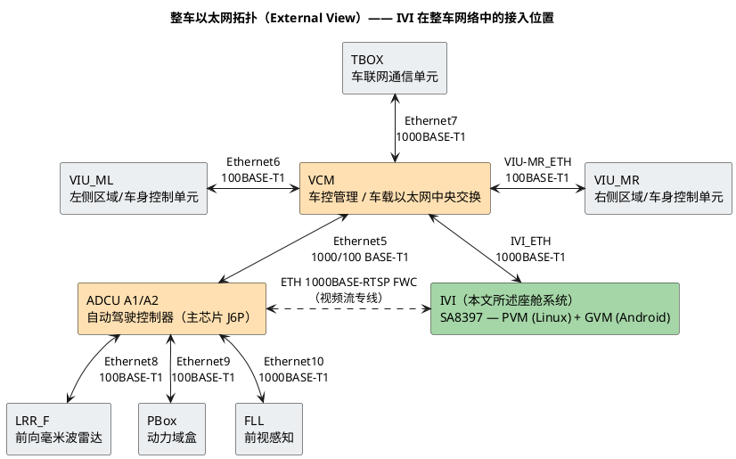
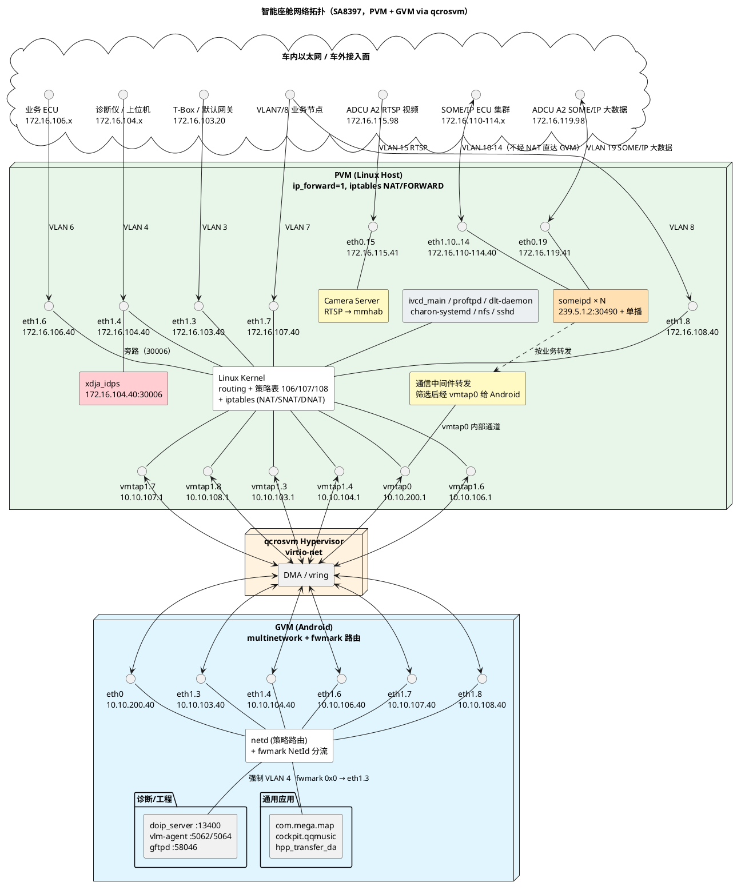

# 智能座舱网络拓扑系统设计与实现

> 适用平台：高通 SA8397（座舱主芯片，Hypervisor `qcrosvm`）
> Linux PVM 内核：`Linux sa8797 6.6.110-rt61-debug aarch64 PREEMPT_RT`
> Android GVM：`SA8397 Cockpit`，`ro.hardware=qcom`
> 数据采集方式：通过两路 ADB 接入实机抓取
> &nbsp;&nbsp;• `adb -s d7df5883 shell` → Android (GVM)
> &nbsp;&nbsp;• `adb -s e66b06ea shell` → Linux (PVM)
> 文档基线日期：2026-05-07

---

## 1. 概述

座舱主控片上集成 Qualcomm Hypervisor，运行两套独立的虚拟机：

| 角色 | 标识 | 系统 | 核心职责 |
| --- | --- | --- | --- |
| **PVM**（Privileged VM） | Linux Host | GNU/Linux + systemd | 占有所有物理网卡、运行车控/SOA 中间件、作为 GVM 的虚拟路由器与边界 |
| **GVM**（Guest VM） | Android | AOSP / Vendor | 运行 HMI、娱乐、地图、诊断应用，仅看到虚拟网卡 |

Hypervisor 提供 `virtio-net` 通道连接 PVM 与 GVM。**Android 看到的 `eth0/eth1` 都是 virtio 前端**；其后端在 PVM 中表现为 `vmtap` 设备。GVM 与外部车载以太网之间的所有流量都必须经过 PVM 内核的 **L3 路由 + iptables NAT**——这并非 L2 桥接（PVM 上无任何 `bridge` 设备）。

整体设计目标：

1. **隔离**：Android 处于一个由 PVM 内核完全控制的"沙箱"中，物理网卡对 GVM 不可见。
2. **双地址平面**：物理车载以太网在 `172.16.X.0/24` 网段；PVM↔GVM 对应使用 `10.10.X.0/24` 网段。两者通过 1:1 的 SNAT/DNAT 映射桥接。
3. **VLAN 业务隔离**：12 条 VLAN 分担诊断、SOME/IP 总线、T-Box、灯光、SOA 服务等不同业务面。
4. **可控外暴露**：每条 VLAN 都可以选择性地把 GVM 服务暴露到车载网，或仅保留在 PVM 内部，由 iptables 规则精确指定。

---

## 2. 平台与系统组件

### 2.1 关键软件组件

| 层级 | 组件 | 说明 |
| --- | --- | --- |
| Hypervisor | `qcrosvm` | Qualcomm 修改版 `crosvm`，承载 GVM 虚拟机，提供 `virtio-net` 设备 |
| PVM 内核 | Linux 6.6 PREEMPT_RT | 启用 `net.ipv4.ip_forward=1`，承担三层路由、NAT |
| PVM 网络栈关键服务 | `xdja_idps`、`someipd`、`dlt-daemon`、`charon-systemd`、`ivcd_main` 等 | 见 §5.7 |
| GVM 内核 | Android 6.6 派生 | 标准 Android netd / multinetwork 框架 |
| GVM 网络栈关键服务 | `doip_server`、`vlm-agent`、`gftpd`、`netd`、`com.mega.map` 等 | 见 §6.4 |

### 2.2 ADB 序列号说明

ADB 序列号在不同设备/刷机批次会变化。本文中两个序列号仅作示例，**识别原则以系统类型为准**：

```bash
# 列出当前 host 上挂着的两个虚拟机
adb devices
# 进入 GVM (Android) ：getprop ro.build.version.release / ro.product.model 可识别
adb -s <serial-A> shell getprop ro.product.model        # → "SA8397 Cockpit"
# 进入 PVM (Linux) ：uname -a / 看到 systemd / busybox
adb -s <serial-B> shell uname -a                        # → Linux sa8797 ...
```

---

## 3. 整体架构

整体架构分两个视角呈现：

- **§3.1 整车以太网拓扑（外部视角）**：座舱（IVI）在整车以太网中所处的物理位置、与哪些 ECU 直连、链路速率等级；
- **§3.2 座舱内部架构（SoC 视角）**：进入 IVI 主芯片之后，PVM/GVM/Hypervisor 三层之间如何承载这些外部链路。

### 3.1 整车以太网拓扑（外部视角）

整车采用以 **VCM（Vehicle Control Module，车载以太网中央交换网关）** 为核心的星形结构。所有主要域控/外设通过独立的 100/1000 BASE-T1 车载以太网链路汇聚到 VCM；VCM 内部完成跨域的 VLAN 交换。本文档所述座舱系统对外呈现为图中的 **IVI** 节点。



#### 3.1.1 节点说明

| 节点 | 全称 / 角色 | 说明 |
| --- | --- | --- |
| **VCM** | Vehicle Control Module | 整车以太网中央交换/网关，承担跨域 VLAN 交换、防火墙、网关路由 |
| **IVI** | In-Vehicle Infotainment | **本文档所述系统**，基于 SA8397，PVM (Linux) + GVM (Android) |
| **TBOX** | Telematics Box | 车联网通信单元，负责蜂窝（4G/5G）、远程诊断、OTA 上行 |
| **VIU_ML / VIU_MR** | Vehicle Interface Unit (Left/Right) | 图片基线中的左右区域/车身控制单元；若项目内部仍使用 ZCU_L/ZCU_R，应视为历史命名映射 |
| **ADCU A1/A2** | Automated Driving Control Unit | 自动驾驶域控，主芯片为地平线 J6P；图片中区分 A1/A2 网络面，并包含直连 IVI 视频/数据专线 |
| **LRR_F** | Long Range Radar Front | 前向毫米波雷达（接入 ADCU，图片中作为 ADCU 下挂节点展示） |
| **PBox** | Power Box | 动力域盒（推测为整车动力相关数据汇聚） |
| **FLL** | — | 前视感知模块（具体定义按整车定义文件为准），1000BASE-T1 高带宽链路 |

#### 3.1.2 IVI 的两条物理链路

座舱（IVI）与外部网络存在 **两条独立的物理以太网通路**：

1. **`IVI_ETH 1000BASE-T1`**——主线，连接到 VCM。VCM 在该链路上以 802.1Q Trunk 形式聚合多条 VLAN（VLAN 3/4/6/7/8/10–14 等业务面，详见 §4.1）。
2. **`ETH 1000BASE-RTSP FWC`**——视频专线，由 ADCU A1/A2 直连 IVI（图中虚线，绕过 VCM），承载摄像头/感知视频流（RTSP，FWC = Forward/Front-View Camera 等推测）。

> **与 §4.1 的对应关系（推断）**：
> - PVM `eth1`（MAC `02:df:53:00:00:04`，承载 VLAN 3/4/6/7/8/10–14）很可能就是 `IVI_ETH 1000BASE-T1`；
> - PVM `eth0`（MAC `02:df:53:00:00:09`，承载 VLAN 15/19）很可能就是 `ETH 1000BASE-RTSP FWC`；
> - 但物理端口与 PHY 的最终对应关系需要结合硬件原理图/`ethtool eth0/eth1` 链路速率确认，本文档不做断言。

#### 3.1.3 链路速率与协议

整车采用车载以太网（Automotive Ethernet）标准：

- **100BASE-T1**：单对双绞线，100 Mbps，全双工，IEEE 802.3bw（PHY 标准 BroadR-Reach）。用于诊断、控制类 ECU。
- **1000BASE-T1**：单对双绞线，1 Gbps，IEEE 802.3bp。用于高带宽节点：TBOX、IVI、ADCU 主干、FLL 前视、IVI–ADCU 视频专线。

车载以太网与传统 100/1000BASE-T 在物理层不兼容（一对线 vs 四对线），但 MAC 层完全一致——上层协议（IP、VLAN、SOME/IP、DoIP、RTSP、…）完全复用。

### 3.2 座舱内部架构（SoC 视角）

进入 IVI 之后，从一个 Android 应用发出的字节，到车外某条 100/1000BASE-T1 双绞线上的电气信号，**总共要穿过五个分层**：

| 层 | 实体 | 主要职责 | 文档小节 |
| --- | --- | --- | --- |
| L5 应用 / 内核 / Hypervisor | PVM Linux + GVM Android + `qcrosvm` | 路由、NAT、virtio、socket | §3.2.1 |
| L4 SoC 内 MAC 控制器 | `emac0` / `emac1` / `SAIL` | 以太网帧组装、DMA、IRQ | §3.2.2 |
| L3 SoC 出片 SerDes | PCIE / USXGMII / HSGMII | 把片内并行信号串行化送出 SoC | §3.2.2 |
| L2 板级 Switch IC | `RTL9071CP-VB-CG`（瑞昱车载以太网交换芯片） | 多端口 802.1Q 交换 / VLAN 透传 | §3.2.3 |
| L1 车载 PHY + 双绞线 | 100/1000BASE-T1 PHY | 单对双绞、PAM3 编码、电平变换 | §3.2.4 |

完整数据通路最终落到 §3.1 中所示的整车以太网，例如 emac1 → USXGMII → Switch P9 → Switch 内部交换 → P5 → 1000BASE-T1 双绞线 → VCM。下面按软件→硬件→PHY 的顺序展开。

#### 3.2.1 软件层：Hypervisor 与虚拟化网络栈

本层从应用 socket 一路下到 SoC 内 MAC 之前。下图展示 PVM、GVM、`qcrosvm` 三者的关系，以及物理网卡如何映射到 GVM 视角的虚拟网卡：

```
                            车载以太网交换机 (车控总线 / T-Box / OBD-II / 上位机)
                                    │ 802.1Q Trunk (VLAN 3/4/6/7/8/10..14)
                                    │ Access (VLAN 15/19)
                ┌───────────────────┴────────────────────┐
                │                                        │
        ┌───────▼─────────┐                       ┌──────▼─────────┐
        │   PVM eth1      │                       │   PVM eth0     │
        │  (物理 NIC #1)  │                       │  (物理 NIC #2) │
        │ MAC 02:df:53:.4 │                       │ MAC 02:df:53:.9│
        └────────┬────────┘                       └────────┬───────┘
                 │ 802.1Q sub-IF                           │
   ┌──┬──┬──┬──┬─┴┬───┬───┬───┬───┬───┐              ┌────┴────┐
  e1.3 e1.4 e1.6 e1.7 e1.8 e1.10 .11 .12 .13 .14    e0.15  e0.19
  172  172  172  172  172  172   172 172 172 172    172    172
  .16. .16. .16. .16. .16. .16.  .16 .16 .16 .16    .16    .16
  103  104  106  107  108  110   111 112 113 114    115    119
  .40  .40  .40  .40  .40  .40   .40 .40 .40 .40    .41    .41

                 PVM (Linux Host)  net.ipv4.ip_forward=1
              ┌──────────────────────────────────────────┐
              │  内核路由表（main + 106/107/108）        │
              │  iptables nat (DNAT + 双向 SNAT)         │
              │  iptables filter FORWARD（带状态）       │
              │  策略路由：iif vmtap1.X → table 10X      │
              └──────────────────────────────────────────┘
                 │     │       │       │       │
              vmtap0 vmtap1.3 vmtap1.4 vmtap1.6 ... vmtap1.8
              10.10  10.10    10.10    10.10        10.10
              .200.1 .103.1   .104.1   .106.1       .108.1
                 │     │       │       │       │
        ─────────┴─────┴───────┴───────┴───────┴───────  virtio-net
                 │     │       │       │       │
               eth0  eth1.3  eth1.4  eth1.6  eth1.7/8       (Android virtio 前端)
              .200  .103   .104    .106    .107/108
              .40   .40    .40     .40     .40
                              GVM (Android)
                  策略路由 (per-network table) + Android multinetwork
```

> 该层全部为软件实现：见 §C.1 (virtio-net)、§C.2 (vmtap/TAP)、§C.3 (L3 路由)、§C.4 (NAT)。所有数据包跨过 PVM 内核 `eth0/eth1` 出口后，进入下一层 SoC MAC 控制器。

#### 3.2.2 SoC MAC 与出片 SerDes 层

PVM 内核看到的 `eth0` / `eth1` 实际对应 SoC 内的两个独立 MAC 控制器（外加一个预留 MAC）。它们各自通过不同的高速串行总线 (SerDes) 把以太网信号送出 SoC，连接到板级交换芯片。

```
   ┌───────────────────────── SA8397 SoC ──────────────────────────────┐
   │                                                                   │
   │  PVM Linux Kernel: net_device "eth0"     net_device "eth1"  …     │
   │                         │                       │                 │
   │                  ┌──────┴──────┐         ┌──────┴──────┐          │
   │                  │ emac0 (MAC) │         │ emac1 (MAC) │   SAIL   │
   │                  │ 02:df:53:.. │         │ 02:df:53:.. │  (备用    │
   │                  │ ..:00:09    │         │ ..:00:04    │   MAC)   │
   │                  └──────┬──────┘         └──────┬──────┘    │     │
   │                         │                       │           │     │
   │                    PCIE Root Complex      USXGMII MAC    HSGMII   │
   │                  /  PCIE EP Bridge          (10G/5G/        MAC   │
   │                                              2.5G/1G              │
   │                         │                       │           │     │
   │                  PCIE PHY (Gen3)        USXGMII PHY     HSGMII PHY│
   └─────────────────────────┼───────────────────────┼───────────┼─────┘
                             │                       │           │
                  ════ SoC 边界（封装引脚） ═══════════════════════════════
                             │                       │           │
                  板级走线 ───┼───────────────────────┼───────────┼─────►
                             ▼                       ▼           ▼
                          RTL9071CP-VB-CG 板级 Switch IC（见 §3.2.3）
                             P11                    P9          P10
                       (ADCU 视频专线)         (VCM trunk)  (千兆预留)
```

##### MAC 控制器与对外 SerDes 接口

| MAC | Linux 设备 | MAC 地址（实测） | 出片接口 | 用途 |
| --- | --- | --- | --- | --- |
| **emac0** | `eth0` | `02:df:53:00:00:09` | **PCIE**（SoC 作为 RC/EP 桥接到 RTL9071） | 承载 ADCU FWC 视频（含 VLAN 15/19） |
| **emac1** | `eth1` | `02:df:53:00:00:04` | **USXGMII** 直连 RTL9071 | 承载车控 VLAN trunk（VLAN 3/4/6/7/8/10–14） |
| **SAIL HSGMII** | — | — | **HSGMII**（High-Speed SGMII） | 第三 MAC，板上预留位（千兆预留），软件未启用 |

##### 出片 SerDes 简要

- **USXGMII** (Universal Serial 10-Gigabit Media Independent Interface)：多速率（10G/5G/2.5G/1G/100M）单通道 SerDes，支持 802.1Q 标签透传，常用于"SoC ↔ 多端口车载交换芯片"的高密度互联。本系统 emac1 即采用此接口，是 trunk 通路的主入口。
- **PCIE**：用于 emac0 的连接形式，可能的实现是 RTL9071 通过 PCIE 控制接口由 SoC 访问，亦可通过 PCIE 桥接 + GMII 暴露成"标准网卡"——具体哪一种取决于硬件 BOM，对 PVM 软件视角而言它就是一张普通 `net_device`。
- **HSGMII**：SGMII 的 2.5G 扩展（Cisco 命名），也可降速运行 1G/100M。`SAIL` 名称推测来自项目内部代号。

#### 3.2.3 板级 Switch：RTL9071CP-VB-CG

##### 芯片定位

`RTL9071CP-VB-CG` 是瑞昱（Realtek）的车载以太网交换/PHY 芯片，集成多端口 100/1000BASE-T1 PHY 与 802.1Q 交换引擎，支持 VLAN-aware 转发、QoS、TSN 部分特性。在本系统中它扮演**SoC 与整车以太网总线之间的"桥头堡"**：

- **SoC 上行侧**（高速 SerDes）：USXGMII / PCIE / HSGMII 端口接入 SoC 三个 MAC；
- **车载下行侧**（双绞线）：100/1000BASE-T1 端口直驱整车线束。

##### 端口分配（结合 §3.1 整车视图）

| 端口 | 方向 | 物理接口 | 速率 | 对端 / 角色 |
| --- | --- | --- | --- | --- |
| **P9**  | SoC 上行 | USXGMII | 1 G | 接 SoC `emac1`，承载 **VLAN trunk**（VLAN 3/4/6/7/8/10–14） |
| **P10** | SoC 上行 | HSGMII  | 1 G | 接 SoC SAIL，**千兆预留**（当前不通） |
| **P11** | SoC 上行 | PCIE    | 1 G | 接 SoC `emac0`，承载 **ADCU 视频专线**（含 VLAN 15/19） |
| **P5**  | 车载下行 | 1000BASE-T1 | 1 G | → **VCM**（VLAN trunk 总线，与 P9 一一对应） |
| **P6**  | 车载下行 | 1000BASE-T1 | 1 G | → **ADCU**（FWC RTSP 视频专线，与 P11 一一对应） |

##### 关键转发行为：USXGMII → trunk → VCM

emac1 → USXGMII → P9 → 内部 802.1Q 交换 → P5 → 1000BASE-T1 → VCM 是本系统中**最核心**的一条数据通路。它的关键属性：

1. **trunk 透传，VLAN tag 不剥离**：emac1 上发出的帧带 802.1Q tag（VID ∈ {3,4,6,7,8,10..14}），交换芯片仅按 VLAN 表决定出端口，不去 tag。所以 VCM 端看到的依然是带 tag 的 trunk 帧，由 VCM 的 VLAN 表自行分发到各域控/ECU。
2. **L2 转发，无 IP 介入**：RTL9071 在该路径上不做 L3 路由——所有 IP 层语义（172.16.X.40 的 SNAT/DNAT、`172.16.103.20` 的默认网关行为）都发生在更上层（PVM 内核或 VCM 内部）。
3. **MAC 学习**：交换芯片的 FDB（Forwarding Database）会自动学习两侧 MAC，建立"VID + DMAC → port"映射，从而支撑跨多 ECU 的单播效率。
4. **ADCU 视频路径独立**：emac0 → P11 → P6 → ADCU 与上述 trunk **物理上完全分离**，避免高带宽 RTSP 视频流挤占车控总线。

##### 与 PVM 软件层的对接点

| 软件层（PVM 内核）             | 硬件路径（板级）                                    |
| ------------------------------ | --------------------------------------------------- |
| `eth1` / `eth1.3..14`          | emac1 → USXGMII → P9 → P5 → VCM                     |
| `eth0` / `eth0.15` / `eth0.19` | emac0 → PCIE → P11 → P6 → ADCU                      |
| `vmtap0`、`vmtap1.X`           | **不出片**——纯内核 TAP 设备，仅通过 virtio 与 GVM 通信 |

#### 3.2.4 PHY 层：100/1000BASE-T1 简介

车载以太网与传统办公网最大的不同在 **PHY 层**——所有外部接线都使用 IEEE 802.3 系列的 **车载以太网标准**，物理形态与电平显著不同。

| 特性 | 100BASE-T1 | 1000BASE-T1 |
| --- | --- | --- |
| 标准 | IEEE 802.3bw（原 BroadR-Reach） | IEEE 802.3bp |
| 双绞对数 | **1 对**（vs 传统 100BASE-TX 用 2 对、1000BASE-T 用 4 对） | **1 对** |
| 信号方式 | 全双工，回声抵消（hybrid） | 全双工，回声抵消 |
| 编码 | PAM-3 + Scrambled | PAM-3 + Scrambled + LDPC FEC |
| 链路距离 | ≤ 15 m（典型车内） | ≤ 15 m |
| 屏蔽 | 通常使用 UTP（非屏蔽双绞线） | 通常使用 UTP |
| 物理连接器 | Hirose、TE MATEnet 等汽车专用窄间距 | 同左 |

> **MAC 层一致性**：100BASE-T1 与 1000BASE-T1 仅在 PHY 层有别，**MAC 层完全沿用 IEEE 802.3 帧格式与 802.1Q VLAN tag**——这正是 §3.2.3 中 RTL9071 能在 USXGMII 与 1000BASE-T1 之间做 802.1Q 透传的前提。

#### 3.2.5 端到端数据路径示例（VLAN 6 业务）

把以上五层串起来看，以 GVM 中某 App 通过 VLAN 6 网络连接外部 ECU `172.16.106.50` 为例：

| # | 层 | 处理 |
| --- | --- | --- |
| 1 | L5 GVM 应用 | `socket()` → `connect("172.16.106.50:port")`，绑定到 NetId=101（fwmark 0x10065） |
| 2 | L5 GVM 内核 | `ip rule` → `eth1.6` 表 → `default via 10.10.106.1`；包从 `eth1.6` 出，源 `10.10.106.40`，VLAN tag 6 |
| 3 | L5 virtio | `virtio-net` 前端 → vring → `qcrosvm` 后端 → PVM `vmtap1.6` |
| 4 | L5 PVM 内核 | 包到达 `vmtap1.6`；查 main 路由表得 `connected via eth1.6`；触发 iptables：<br>POSTROUTING SNAT `-s 10.10.106.0/24 -o eth1.6 → 172.16.106.40` |
| 5 | L4 SoC MAC | 帧由 PVM `eth1` (=emac1) 发送，加 802.1Q tag (VID=6)，源 MAC `02:df:53:00:00:04` |
| 6 | L3 SerDes | emac1 → **USXGMII** 串行化，送至 SoC 引脚 |
| 7 | L2 RTL9071 | 进 P9，FDB 命中 (VID=6, DMAC) → 出 P5；trunk 透传，tag 不剥离 |
| 8 | L1 PHY/线束 | P5 → 1000BASE-T1 PHY → 车载双绞线 → VCM 端 P5'（PHY 输入） |
| 9 | (整车) | VCM 内部交换至 VLAN 6 对应端口 → 业务 ECU `172.16.106.50` |

回程报文按完全对称的相反路径返回，并在第 4 步触发 conntrack 自动反向 SNAT/DNAT（见 §C.4），最终回到 Android 应用 socket。

---

### 3.3 视频跨 VM 旁路：Camera Server + mmhab

除 §3.2.1 描述的基于 IP/virtio-net 的数据通路外，座舱还存在一条**非 IP 的视频帧跨 VM 专用通路**，用于把 ADCU 下发的摄像头视频高效送入 Android 渲染层。该通路不经过 iptables，不依赖 virtio-net DMA，而是使用 Qualcomm 平台提供的跨虚拟机共享内存机制 **mmhab**（Multi-Media HAB，Hardware Abstraction Bridge）。

#### 3.3.1 整体流程

```
ADCU A2 (172.16.115.98)
    │  RTSP/RTP over VLAN 15 (1000BASE-T1)
    ▼
PVM eth0.15 (172.16.115.41)
    │
    ▼
[PVM] Camera Server 进程
    │  接收 RTSP 流 → 解封 RTP → 帧缓冲
    │
    │  mmhab（Qualcomm 跨 VM 共享内存）
    │  ─────────────────────────────────
    │  PVM 侧：mmhab producer / mmap 写帧
    │  Hypervisor (qcrosvm) 保证内存隔离与传递
    │  GVM 侧：mmhab consumer / mmap 读帧
    │
    ▼
[GVM] Camera Client 进程（Android Camera HAL / CameraService）
    │
    ▼
Android 应用（显示、录像、ADAS 展示等）

同时：ADCU 大数据 SOME/IP 走
ADCU A2 (172.16.119.98) ──► PVM eth0.19 (172.16.119.41)
    ──► someipd（SOME/IP 服务实例；不经 NAT 直接暴露给 GVM）
```

#### 3.3.2 与 IP 通路的对比

| 维度 | IP + virtio-net 通路（§3.2.1） | mmhab 视频旁路（本节） |
| --- | --- | --- |
| 数据类型 | 通用 IP 报文（SOME/IP、DoIP、HTTP 等） | 原始视频帧（摄像头 YUV/H.264/H.265） |
| 跨 VM 机制 | virtio-net vring + DMA | 共享内存零拷贝（mmhab） |
| 是否过 iptables | 是（NAT / FORWARD） | **否** |
| PVM 侧进程 | 内核路由 / iptables（无需用户态进程） | Camera Server |
| GVM 侧进程 | netd + 应用 socket | Camera Client（Camera HAL） |
| 延迟特性 | 受内核 TCP/IP 栈影响 | 共享内存，接近零拷贝，延迟最低 |

#### 3.3.3 与 VLAN 分配的对应

| 物理接口 | VLAN | PVM IP | ADCU IP | 用途 |
| --- | --- | --- | --- | --- |
| `eth0.15` | 15 | `172.16.115.41` | `172.16.115.98` (ADCU A2) | RTSP 视频流 → Camera Server → mmhab → GVM |
| `eth0.19` | 19 | `172.16.119.41` | `172.16.119.98` (ADCU A2) | 大数据 SOME/IP（感知融合数据），PVM 侧消费，不入 GVM |

> **注意**：mmhab 通道的存在意味着 GVM 能获取摄像头帧**不需要** VLAN 15 的 IP 地址对 Android 可见，也不依赖 iptables DNAT。Camera Client 调用 Camera HAL API，HAL 底层通过 mmhab 共享内存直接取帧，对 Android 框架而言与"本地摄像头"无异。

---

## 4. PVM 网络配置详解

### 4.1 物理网卡

PVM 直接占有两块物理以太网卡：`eth0` (MAC `02:df:53:00:00:09`) 与 `eth1` (MAC `02:df:53:00:00:04`)。两块网卡本身不配置 IP，仅作为 802.1Q Trunk，承载多条 VLAN 子接口。

| 物理 | VLAN ID | 子接口 | PVM IP | 角色（实测见 §7） |
| --- | --- | --- | --- | --- |
| eth1 | 3 | `eth1.3` | `172.16.103.40/24` | 默认路由 / T-Box / 互联网 |
| eth1 | 4 | `eth1.4` | `172.16.104.40/24` | 车辆诊断 + 边界 IDPS |
| eth1 | 6 | `eth1.6` | `172.16.106.40/24` | ADCU 私有网络（泊车/APA）；含 `10.82.13.0/24`、`10.92.89.8` 远端路由 |
| eth1 | 7 | `eth1.7` | `172.16.107.40/24` | OTA / 远程诊断通道 |
| eth1 | 8 | `eth1.8` | `172.16.108.40/24` | ADAS Internet（智驾专用互联网）|
| eth1 | 10 | `eth1.10` | `172.16.110.40/24` | SOME/IP 服务总线 |
| eth1 | 11 | `eth1.11` | `172.16.111.40/24` | SOME/IP 服务总线 |
| eth1 | 12 | `eth1.12` | `172.16.112.40/24` | SOME/IP 服务总线 |
| eth1 | 13 | `eth1.13` | `172.16.113.40/24` | SOME/IP 服务总线 |
| eth1 | 14 | `eth1.14` | `172.16.114.40/24` | SOME/IP NTP 对时网络 |
| eth0 | 15 | `eth0.15` | `172.16.115.41/24` | ADCU FWC RTSP 摄像头视频流（→ Camera Server → mmhab → GVM）|
| eth0 | 19 | `eth0.19` | `172.16.119.41/24` | ADCU A2 SOME/IP 大数据（感知融合/大数据面）|

> **注意**：上述 PVM-only VLAN（10/11/12/13/14、15/19）均**未在 iptables 中配置 DNAT/SNAT**，不会以 L3/NAT 形式直接暴露给 GVM。图片中存在的"通信中间件转发"应理解为 PVM 用户态对部分业务数据进行筛选/转换后，经 `vmtap0` 或本地 IPC 提供给 Android，而不是把这些物理 VLAN 原样透传给 GVM。

### 4.2 vmtap 后端（与 GVM 的对接点）

PVM 为 GVM 创建 6 个 TAP 设备，作为 virtio-net 后端：

| 设备 | IP | 对端 (GVM) | 备注 |
| --- | --- | --- | --- |
| `vmtap0` | `10.10.200.1/24` | Android `eth0` (10.10.200.40) | **Host-Guest 控制通道**，不连接任何物理 VLAN |
| `vmtap1`（trunk 父接口，无 IP） | — | Android `eth1` | 承载 5 条 VLAN |
| `vmtap1.3` | `10.10.103.1/24` | Android `eth1.3` | 对应 VLAN 3 |
| `vmtap1.4` | `10.10.104.1/24` | Android `eth1.4` | 对应 VLAN 4 |
| `vmtap1.6` | `10.10.106.1/24` | Android `eth1.6` | 对应 VLAN 6 |
| `vmtap1.7` | `10.10.107.1/24` | Android `eth1.7` | 对应 VLAN 7 |
| `vmtap1.8` | `10.10.108.1/24` | Android `eth1.8` | 对应 VLAN 8 |

> **关键设计**：`vmtap1` 是一个 802.1Q trunk，VLAN 标签由 PVM 在 `vmtap1.X` 处剥离/添加；GVM 自己也为 `eth1` 加同样的 VLAN 标签。这意味着 PVM 与 GVM 在三层 IP 之外**还共享同一套 VLAN 编号约定**，两侧 VLAN ID 必须严格一致。

### 4.3 主路由表 (`main`)

```text
default via 172.16.103.20 dev eth1.3
10.10.103.0/24  dev vmtap1.3   src 10.10.103.1
10.10.104.0/24  dev vmtap1.4   src 10.10.104.1
10.10.106.0/24  dev vmtap1.6   src 10.10.106.1
10.10.107.0/24  dev vmtap1.7   src 10.10.107.1
10.10.108.0/24  dev vmtap1.8   src 10.10.108.1
10.10.200.0/24  dev vmtap0     src 10.10.200.1
172.16.103.0/24 dev eth1.3     src 172.16.103.40
172.16.104.0/24 dev eth1.4     src 172.16.104.40
... (eth1.6/7/8/10/11/12/13/14, eth0.15, eth0.19 类同)
```

- `default via 172.16.103.20 dev eth1.3` 是**整个 PVM 自身**未匹配策略路由时的兜底出口。`172.16.103.20` 为 TBOX（T-Box，车联网/互联网网关）地址，已由拓扑图确认；VCM IP 为 `172.16.103.11`。

### 4.4 策略路由（`ip rule`）

```text
0     from all lookup local
217   from all iif vmtap1.8 lookup 108
218   from all iif vmtap1.7 lookup 107
219   from all iif vmtap1.6 lookup 106
220   from all lookup 220        ← 此表实际为空（FIB 不存在），无效
32766 from all lookup main
32767 from all lookup default
```

各专用表内容：

| 表号 | 内容 | 含义 |
| --- | --- | --- |
| `108` | `default via 172.16.108.20 dev eth1.8` | Android 经 `vmtap1.8` 进入 PVM 的流量从 `eth1.8` 出局 |
| `107` | `default via 172.16.107.20 dev eth1.7` | Android 经 `vmtap1.7` 进入 PVM 的流量从 `eth1.7` 出局 |
| `106` | `default via 172.16.106.20 dev eth1.6` | Android 经 `vmtap1.6` 进入 PVM 的流量从 `eth1.6` 出局 |

> **设计要点**：注意 `vmtap1.3` 与 `vmtap1.4` 没有专用策略路由——它们的流量直接走 `main` 表，因此：
> - VLAN 3 流量出口与 PVM 默认网关复用 `eth1.3`（因为 main 默认路由就指向 `eth1.3`）。
> - VLAN 4 流量没有 default 路由，**仅能访问已知子网**（172.16.104.0/24、10.10.104.0/24 通过 main 表的 connected 路由），所有跨网段访问会被丢弃。这是诊断网段刻意做的"窄通路"设计。

### 4.5 iptables NAT（核心：1:1 双向地址映射）

```text
# nat 表（PREROUTING）
-A PREROUTING -d 172.16.103.40 -i eth1.3 -j DNAT --to 10.10.103.40
-A PREROUTING -d 172.16.104.40 -i eth1.4 -p tcp ! --dport 30006 -j DNAT --to 10.10.104.40
-A PREROUTING -d 172.16.104.40 -i eth1.4 ! -p tcp                -j DNAT --to 10.10.104.40
-A PREROUTING -d 172.16.106.40 -i eth1.6 -j DNAT --to 10.10.106.40
-A PREROUTING -d 172.16.107.40 -i eth1.7 -j DNAT --to 10.10.107.40
-A PREROUTING -d 172.16.108.40 -i eth1.8 -j DNAT --to 10.10.108.40

# nat 表（POSTROUTING）
-A POSTROUTING -d 10.10.103.40 -o vmtap1.3 -j SNAT --to 10.10.103.1
-A POSTROUTING -s 10.10.103.0/24 -o eth1.3 -j SNAT --to 172.16.103.40
... (104/106/107/108 一一对称)
```

逻辑解读：

1. **入站方向 DNAT（外→内）**：来自车内网指向 PVM 物理 IP `172.16.X.40` 的流量，被改写为 `10.10.X.40`，即"伪装成 Android"，再经主路由送入 `vmtap1.X`。
2. **出站方向 SNAT（内→外）**：Android 自己以 `10.10.X.40` 发起的流量，离开 `eth1.X` 时源地址改写为 `172.16.X.40`，使车载网络看到的对端是"PVM 物理 IP"。
3. **回程 SNAT（外→内的应答）**：车内回程目的地是 `10.10.X.40`，进入 `vmtap1.X` 之前源地址被改写为 `10.10.X.1`，使 Android 看到的对端是它的网关 IP（避免 Android 端 RPF 失败）。

#### IDPS 例外规则

```
-A PREROUTING -d 172.16.104.40 -i eth1.4 -p tcp ! --dport 30006 -j DNAT --to 10.10.104.40
```

VLAN 4 上 TCP 30006 **不被 DNAT**，让其被 PVM 本机 socket 接收——`xdja_idps`（信大捷安 IDPS）正监听该端口。其余协议/端口仍被透传到 GVM。这是把 IDPS 部署在"车外诊断仪与 Android 诊断服务之间的旁路"上的标准做法。

### 4.6 iptables FORWARD（带状态）

```text
-A FORWARD -i vmtap1.X -o eth1.X -j ACCEPT
-A FORWARD -i eth1.X -o vmtap1.X -m state --state RELATED,ESTABLISHED -j ACCEPT
```

- 出站方向（GVM→外）：直接放行。
- 入站方向（外→GVM）：仅放行已建立连接的应答流量，**未匹配 PREROUTING DNAT 的新建连接会被拒**。换言之，外部要主动连入 GVM 服务，必须落在 §4.5 的 DNAT 路径上。

### 4.7 PVM 网络服务清单（节选实测）

| 进程 | 监听 | 协议 | 说明 |
| --- | --- | --- | --- |
| `xdja_idps` | `172.16.104.40:30006` | TCP | 边界入侵检测/防御 |
| `someipd` ×N | `172.16.110/111/112/113/114/119.40:51000/51001/30490/30505/57001/55005`、组播 `239.5.1.2:30490` | TCP/UDP | SOME/IP 服务实例（车控总线） |
| `proftpd` | `0.0.0.0:21` | TCP | FTP 服务 |
| `ivcd_main` | `0.0.0.0:80` | TCP | IVI 控制守护 HTTP 入口 |
| `dlt-daemon` | `*:3490` | TCP | 标准车载日志（AUTOSAR DLT） |
| `charon-systemd` | `0.0.0.0:500/4500` | UDP | IPSec/IKE（推测用于 OTA 或安全通道） |
| `amblightserver` | `10.10.200.1:55498` 等 | UDP | 灯光控制服务，**仅在 Host-Guest 控制通道暴露** |
| `awe_linuxproxy` | `0.0.0.0:15002` | TCP | 通用代理 |
| `adbd` | `*:5555` | TCP | 调试 |
| `systemd-resolve` | `127.0.0.53:53` | TCP/UDP | 本地 DNS 解析 |
| `rpcbind` / `rpc.mountd` / `rpc.statd` | 各动态端口 + 2049 | TCP/UDP | NFS 服务（推测用于内部数据交换） |

---

## 5. GVM (Android) 网络配置详解

### 5.1 虚拟网卡

| 接口 | 类型 | IP | 父接口 / VLAN |
| --- | --- | --- | --- |
| `eth0` | virtio 前端 | `10.10.200.40/24` | 对端 `vmtap0`（Host-Guest 控制通道） |
| `eth1` | virtio 前端（trunk，无 IP） | — | 对端 `vmtap1` |
| `eth1.3` | 802.1Q | `10.10.103.40/24` | VLAN 3 |
| `eth1.4` | 802.1Q | `10.10.104.40/24` | VLAN 4 |
| `eth1.6` | 802.1Q | `10.10.106.40/24` | VLAN 6 |
| `eth1.7` | 802.1Q | `10.10.107.40/24` | VLAN 7 |
| `eth1.8` | 802.1Q | `10.10.108.40/24` | VLAN 8 |

> 所有 VLAN 子接口共享 `eth1` 的 MAC `7a:c6:6f:b6:93:a0`。

### 5.2 主路由表（`main`）

```text
10.10.103.0/24  dev eth1.3   src 10.10.103.40
10.10.104.0/24  dev eth1.4   src 10.10.104.40
10.10.106.0/24  dev eth1.6   src 10.10.106.40
10.10.107.0/24  dev eth1.7   src 10.10.107.40
10.10.108.0/24  dev eth1.8   src 10.10.108.40
10.10.200.0/24  dev eth0     src 10.10.200.40
10.10.200.1     dev eth0     scope link
```

> Android **主表无 default 路由**，5 条 default 全部下沉到下文的策略路由表中——这是 Android multinetwork 框架的通用做法。

### 5.3 策略路由表（按选路类型）

| 表名 | 内容 | 触发规则（节选） |
| --- | --- | --- |
| `1100` | `default via 10.10.200.1 dev eth0` | `from 10.10.200.0/24` 或 `to 10.10.200.0/24` |
| `1400` | `172.16.104.0/24 via 10.10.104.1 dev eth1.4` | `to 172.16.104.0/24` |
| `eth1.3` | `default via 10.10.103.1` + 本网 + `172.16.103.0/24 via 10.10.103.1` | `to 172.16.103.0/24`，`fwmark 0x66`，`oif eth1.3`，**`fwmark 0x0` 默认表（rule 31000）** |
| `eth1.6` | `default via 10.10.106.1` + 本网 + `172.16.106.0/24`、`10.82.13.0/24`、`10.92.89.8` | `to 172.16.106/10.82.13/10.92.89.8`，`fwmark 0x65`，`oif eth1.6` |
| `eth1.7` | `default via 10.10.107.1` + 本网 + `172.16.107.0/24` | `to 172.16.107.0/24`，`fwmark 0x67`，`oif eth1.7` |
| `eth1.8` | `default via 10.10.108.1` + 本网 + `172.16.108.0/24` | `to 172.16.108.0/24`，`fwmark 0x64`，`oif eth1.8` |

完整 `ip rule`（按优先级排序）：

```text
0      from all lookup local
0      from all lookup main
0      from 10.10.200.0/24                  lookup 1100
0      from all to 10.10.200.0/24           lookup 1100
0      from all to 172.16.104.0/24          lookup 1400
0      from all to 172.16.108.0/24          lookup eth1.8
0      from all to 172.16.103.0/24          lookup eth1.3
0      from all to 172.16.106.0/24          lookup eth1.6
0      from all to 10.82.13.0/24            lookup eth1.6
0      from all to 10.92.89.8               lookup eth1.6
0      from all to 172.16.107.0/24          lookup eth1.7
11000  from all iif lo oif eth1.X uidrange 0-0  lookup eth1.X
16000  from all fwmark 0x10064/0x1ffff      lookup eth1.8     (Android NetId=100)
16000  from all fwmark 0x10065/0x1ffff      lookup eth1.6     (NetId=101)
16000  from all fwmark 0x10066/0x1ffff      lookup eth1.3     (NetId=102)
16000  from all fwmark 0x10067/0x1ffff      lookup eth1.7     (NetId=103)
17000  from all iif lo oif eth1.X           lookup eth1.X
23000  from all fwmark 0x64..0x67/0x1ffff   lookup eth1.8/6/3/7
31000  from all fwmark 0x0/0xffff iif lo    lookup eth1.3      ← **未标记流量的全局默认**
```

#### 选路决策的关键点

1. 应用主动指定网络（如 `Network.bindSocket()` 或 `setProcessDefaultNetwork`），netd 会写入 `fwmark`（高 7~8 位为 NetId），命中 16000/23000 优先级的 `fwmark` 规则，把流量定向到对应 VLAN。
2. 应用未指定网络时，命中 31000 优先级的 `fwmark 0x0` 规则——所有"通用"流量（含 DNS、HTTP 等）默认走 **VLAN 3 (`eth1.3`)**，这与 PVM `main` 表的默认网关方向一致，构成端到端的"默认互联网通道"。
3. 目的地址在已知车内网段时（`172.16.X.0/24`、`10.82.13.0/24`、`10.92.89.8`），优先级 0 的 `to` 规则直接覆盖应用的 NetId 选择，强制走相应 VLAN。

### 5.4 GVM 网络服务清单（节选实测）

| 进程 | 监听 | 协议 | 接口/VLAN | 用途 |
| --- | --- | --- | --- | --- |
| `binder:1491_2`（doip_server 子线程） | `10.10.104.40:13400` | TCP/UDP | VLAN 4 | DoIP 标准车辆诊断（ISO 13400） |
| `vlm-agent` | `10.10.104.40:5062` (TCP) / `:5064` (UDP) | TCP/UDP | VLAN 4 | 车辆生命周期管理代理 |
| `gftpd` | `10.10.104.40:58046` | TCP | VLAN 4 | 诊断/刷写文件传输 |
| `hpp_transfer_da` | `0.0.0.0:58050` | TCP | 全部 | HPP 传输（具体协议待查） |
| `rkstack.process` | `*%eth1.{3,6,7,8}:546` | UDP | 上述 4 条 VLAN | DHCPv6 客户端（IPv6 链路本地） |
| `com.mega.map` | `127.0.0.1:60001` | TCP | loopback | 地图应用本地代理 |
| `cockpit.qqmusic` / `qqlive.audiobox` | 各 loopback 高位端口 | TCP/UDP | loopback | 媒体应用 IPC |
| `ah.shortcut.key` | `0.0.0.0:8099` | TCP | 全部 | 应用助手 |
| `h.polaris.agent` | `*:9100/9101` | TCP | 全部 | 北极星接入代理 |
| `mdnsd` | `0.0.0.0:5353` 等 | UDP | 全部 | mDNS |
| `adbd` | `*:5555` | TCP | 全部 | 调试 |

> **注意**：`doip_server` / `vlm-agent` / `gftpd` **均绑定 `10.10.104.40`**（VLAN 4 的 GVM 内部 IP），它们对外暴露给上位机 (`172.16.104.x`) 是**靠 PVM 上的 DNAT 规则**才生效的，并非直接监听 `172.16.104.40`。这一区分对调试和安全审计至关重要。

---

## 6. VLAN 业务划分

> 下表中"角色"一栏区分**实测证据**与**推测**。仅当存在明确的进程绑定/路由/iptables 规则时才标"实测"，否则标"推测"。

| VLAN | PVM IP | GVM IP | 角色（实测 / 推测） |
| --- | --- | --- | --- |
| 3 | 172.16.103.40 | 10.10.103.40 | **实测**：PVM 默认网关 (`172.16.103.20`)；Android 未标记流量也下沉至此（rule 31000）。**图示证实**：`172.16.103.20` = TBOX（T-Box，车联网互联网网关）；VCM 自身 IP 为 `172.16.103.11`。 |
| 4 | 172.16.104.40 | 10.10.104.40 | **实测**：GVM 侧 DoIP (13400)、VLM (5062/5064)、gftpd (58046)；PVM 侧 IDPS (30006) 旁路监听。**结论**：诊断与边界防御网段 |
| 6 | 172.16.106.40 | 10.10.106.40 | **图示证实**：**ADCU 私有网络（泊车/APA）**。**实测**：Android 路由表含 `10.82.13.0/24`、`10.92.89.8` 远端路由（ADCU 泊车后端地址）。 |
| 7 | 172.16.107.40 | 10.10.107.40 | **图示证实**：**OTA / 远程诊断通道**。**实测**：GVM rkstack DHCPv6 客户端在线，PVM 有策略表 107；当前无用户态 socket 绑定（OTA/远程诊断服务按需启动，属正常）。 |
| 8 | 172.16.108.40 | 10.10.108.40 | **图示证实**：**ADAS Internet（智驾专用互联网）**。实测链路活跃（DHCPv6、策略路由就绪），当前无用户态 socket 绑定。 |
| 10–13 | 172.16.110–113.40 | — | **实测**：PVM `someipd` 多实例监听（组播 239.5.1.2 + 单播 51000/51001/30490/30505/57001）。**结论**：SOME/IP 服务总线（ECU 之间），不通过 NAT 向 GVM 直接暴露 |
| 14 | 172.16.114.40 | — | **图示证实**：**SOME/IP NTP 对时网络**。PVM `someipd` 监听，不通过 NAT 向 GVM 直接暴露。 |
| 15 | 172.16.115.41 | — | **图示证实**：ADCU A2（`172.16.115.98`）→ PVM Camera Server 的 **RTSP 摄像头视频流**通道。PVM Camera Server 接收视频帧后经 mmhab 共享内存送入 GVM Camera Client（见 §3.3）。 |
| 19 | 172.16.119.41 | — | **图示证实**：ADCU A2（`172.16.119.98`）→ PVM `someipd` 的 **SOME/IP 大数据 / 感知融合数据**通道，不通过 NAT 向 GVM 直接暴露。 |

> **关于通信中间件转发**：图片中从 PVM 业务服务侧到 `vmtap0`/Android `eth0` 存在"通信中间件转发"路径。该路径表示 PVM 用户态服务把筛选后的业务数据通过 Host-Guest 控制通道交给 Android，不等同于 VLAN 10–14/15/19 在 GVM 中可见，也不等同于 iptables DNAT/SNAT 暴露。

> **设计意图（推断）**：从 VLAN 编号和分布看，"100 系列"（103/104/106/107/108）是**给座舱（含 Android）使用的业务面**，"110+ 系列"是**车控/SOA 总线**，二者通过 PVM 内核进行物理隔离（不在 iptables 中开 NAT）。

---

## 7. 端到端数据流向

### 7.1 出站：Android 应用主动连接车内 ECU（以 VLAN 6 业务为例）

应用使用 `Network.bindSocket()` 选定 VLAN 6 网络（NetId=101，对应 `fwmark 0x10065`）：

| 步骤 | 位置 | 处理 |
| --- | --- | --- |
| 1 | GVM 应用层 | `socket()` → `connect("172.16.106.50:port")` |
| 2 | GVM 内核 | `ip rule` 优先级 0：`to 172.16.106.0/24` 命中 `eth1.6` 表 → 取 `default via 10.10.106.1 dev eth1.6` |
| 3 | GVM 内核 | 包以源 `10.10.106.40` 目的 `172.16.106.50` 出 `eth1.6`，加 802.1Q tag 6 |
| 4 | virtio-net | DMA 至 PVM `vmtap1.6`，内核收包 |
| 5 | PVM 路由 | 命中 main 表中 `172.16.106.0/24 dev eth1.6 connected` 路由 |
| 6 | PVM iptables | POSTROUTING `-s 10.10.106.0/24 -o eth1.6 -j SNAT --to 172.16.106.40`，包源改为 `172.16.106.40` |
| 7 | PVM 物理 | 包从 `eth1.6` 离开主机，进入车载交换机 VLAN 6 |
| 回程 | … | 目的 `172.16.106.40`，命中 PREROUTING DNAT `→ 10.10.106.40`，再出 `vmtap1.6`；POSTROUTING 又把源 `172.16.106.50` 保持，`-d 10.10.106.40 -o vmtap1.6 -j SNAT --to 10.10.106.1` 把网关地址改写。Android 收到的应答源是 `10.10.106.1`，符合其路由器认知。|

### 7.2 出站：Android 应用未指定网络（默认互联网）

| 步骤 | 处理 |
| --- | --- |
| GVM 内核 | `fwmark=0x0` → rule 31000 → `eth1.3` 表 → `default via 10.10.103.1` |
| PVM | 包到 `vmtap1.3`，命中 main 表，目的不在任何 connected 网段 → 命中 `default via 172.16.103.20 dev eth1.3` |
| PVM NAT | POSTROUTING SNAT 改源为 `172.16.103.40` |
| 物理 | 出 `eth1.3` → 车载网关 (`172.16.103.20`) → 上行（推测经 T-Box） |

### 7.3 入站：车外上位机连接 Android DoIP

| 步骤 | 位置 | 处理 |
| --- | --- | --- |
| 1 | 上位机 | TCP/UDP `connect("172.16.104.40:13400")` |
| 2 | PVM 接收 | 包从 `eth1.4` 入站，命中 PREROUTING `-i eth1.4 ! -p tcp` 或 `-p tcp ! --dport 30006` 的 DNAT → 改目的为 `10.10.104.40` |
| 3 | PVM 路由 | 目的 `10.10.104.40` 在 main 表的 connected 路由 → 出 `vmtap1.4` |
| 4 | PVM filter FORWARD | `-i eth1.4 -o vmtap1.4`：当前不在 `RELATED,ESTABLISHED` → ⚠ 此处依赖默认策略 `ACCEPT`（FORWARD chain 默认 ACCEPT），新建连接被放行。**该规则集对入站新建连接的过滤不严格，需在安全审计时关注。** |
| 5 | GVM | 收包，doip_server 接受连接 |

### 7.4 入站：上位机访问 PVM IDPS

```
上位机 → 172.16.104.40:30006 → 抵达 PVM eth1.4
    iptables PREROUTING：-p tcp --dport 30006 不命中 DNAT 规则
    → 包目的保持 172.16.104.40，被 PVM 本机 socket 接收
    → xdja_idps:30006 处理
```

这是 IDPS 相对 GVM **旁路部署**的具体落地方式：上位机能正常向 GVM 发起 13400 等诊断流量（被 DNAT 透传），同时 IDPS 还能独立承接管理/告警通道，二者共用 VLAN 4 的同一物理 IP。

---

## 8. 安全边界与隔离分析

### 8.1 PVM 私有面（不向 GVM 直接暴露）

- 物理 VLAN 10–14 / 15 / 19：未在 iptables 配置 NAT，PVM 不为这些网段建立到 GVM 的基于 IP 的直接转发路径。GVM 的路由表与 `ip rule` 中也无对应条目。
- VLAN 15（`172.16.115.41`）：为 ADCU A2（`172.16.115.98`）→ PVM Camera Server 的 RTSP 视频流通道；视频帧通过 **mmhab 共享内存**（非 IP 路径）送入 GVM，不走 iptables NAT（见 §3.3）。
- VLAN 19（`172.16.119.41`）：为 ADCU 大数据 SOME/IP（`someipd` 监听 30490/55005），对端 ADCU A2（`172.16.119.98`）。PVM 不向 GVM 转发该面。
- PVM 监听在 `172.16.110–114.40`、`172.16.119.41` 上的 `someipd` 等服务，其原始 VLAN/IP 对 GVM 不可达；如 Android 需要消费相关数据，应由 PVM 通信中间件通过 `vmtap0`/本地 IPC 做受控转发。
- PVM 监听在 `0.0.0.0` 的服务（FTP、HTTP、SSH、Telnet、NFS、IPSec）当前**未被 NAT 转发到 GVM**，但若车载网络中有节点路由能到达这些 IP，则属于车内服务面——需从车内网络安全策略层面考量。

### 8.2 GVM 服务暴露面

| 暴露通道 | 入口 | 出口（GVM 内）|
| --- | --- | --- |
| VLAN 3 全协议 | `eth1.3:172.16.103.40 → 10.10.103.40:*` | 凡 Android 在 `eth1.3` 监听的服务 |
| VLAN 4 全协议（除 TCP/30006） | `eth1.4:172.16.104.40 → 10.10.104.40:*` | DoIP、VLM、gftpd 等 |
| VLAN 6 全协议 | `eth1.6:172.16.106.40 → 10.10.106.40:*` | 当前未发现 GVM 在该 IP 监听 |
| VLAN 7 全协议 | `eth1.7:172.16.107.40 → 10.10.107.40:*` | 当前未发现 GVM 在该 IP 监听 |
| VLAN 8 全协议 | `eth1.8:172.16.108.40 → 10.10.108.40:*` | 当前未发现 GVM 在该 IP 监听 |

> **风险点**：DNAT 是"端口全透传"模式（除 30006 外），任何车载节点只要能发到 `172.16.X.40`，就可触达 GVM 同 IP 上所有监听端口。建议后续在 PVM 侧加入显式的端口白名单 DROP 规则，缩小 GVM 暴露面。

### 8.3 入侵检测

- `xdja_idps`（PID 3952）TCP/30006 监听于 VLAN 4 的 PVM 物理 IP，DNAT 显式排除该端口防止透传。
- 其他 VLAN 当前未观测到对应 IDPS 实例。

### 8.4 控制通道

- `vmtap0` ↔ Android `eth0` (`10.10.200.0/24`)：PVM/GVM 内部管道，**无 NAT 出口**，外部无法直接到达。
- 已知用例：`amblightserver` 在 PVM `10.10.200.1:55498` 暴露 UDP 接口给 Android（车灯控制 IPC）。
- 图片中标注的"通信中间件转发"也应归入该内部控制/数据通道：它是 PVM 用户态服务到 Android 的受控转发，不改变 PVM-only VLAN 的隔离结论。

---

## 9. 拓扑图（PlantUML）



---

## 10. 验证与排错命令清单

### 10.1 PVM 侧

```bash
# 接口/路由
ip -br addr ; ip -br link
ip route show table all
ip rule

# 转发与 NAT
sysctl net.ipv4.ip_forward
iptables -t nat -S
iptables -S
iptables -t mangle -S

# 进程与端口
ss -ltnp ; ss -lunp

# 计数器（连接跟踪 / NAT 命中统计）
iptables -t nat -L -nv
cat /proc/net/nf_conntrack | head
```

### 10.2 GVM 侧

```bash
# 接口/路由（含 multinetwork 表）
ip -br addr ; ip -br link
ip rule
for t in main 1100 1400 eth1.3 eth1.6 eth1.7 eth1.8; do
  echo "==== $t ===="; ip route show table $t
done

# Android 网络框架视角
dumpsys connectivity | head -100
ndc network list

# 进程与端口
ss -ltnp ; ss -lunp
```

### 10.3 端到端连通性测试

```bash
# 在 GVM 内验证选路
ip route get 172.16.106.50         # 应走 eth1.6
ip route get 8.8.8.8                # 主表无 default，应"unreachable"，需指定网络
ip route get 8.8.8.8 mark 0x10066   # NetId=102 (eth1.3) → default via 10.10.103.1

# 在 PVM 内验证 NAT
conntrack -L -d 10.10.104.40       # 观察 DoIP 入向连接的 NAT 翻译

# 在 PVM 抓包看双向
tcpdump -ni eth1.4 host 172.16.104.40 and port 13400
tcpdump -ni vmtap1.4 host 10.10.104.40 and port 13400
```

---

## 11. 已知约束与待确认项

1. ~~**`172.16.103.20` 是否为 T-Box / 互联网网关**~~ **已确认（图示）**：`172.16.103.20` = TBOX，`172.16.103.11` = VCM。VCM 是整车以太网交换中心而非默认网关，T-Box 才是 VLAN 3 的上行 IP 路由网关。
2. ~~**VLAN 7 / VLAN 8 业务归属**~~ **已确认（图示）**：VLAN 7 = OTA / 远程诊断通道，VLAN 8 = ADAS Internet（智驾专用互联网）。链路已就绪，服务按需启动，当前无进程绑定属正常。
3. ~~**VLAN 6 中的 `10.82.13.0/24` 与 `10.92.89.8`**~~ **已确认（图示）**：VLAN 6 = ADCU 私有泊车网络（APA），上述地址为 ADCU 泊车业务后端地址。
4. **入站 FORWARD 默认 ACCEPT**：`iptables -P FORWARD ACCEPT`，依赖 DNAT 规则做"隐式过滤"。建议改为默认 DROP + 显式 ACCEPT 端口白名单，加固边界。
5. **`220` 表的空规则**：`ip rule` 中 `from all lookup 220` 存在但表本身为空（`ip route show table 220` 报 FIB does not exist）——历史脚本残留？需确认是否后续注入。
6. **PVM 的 NFS / FTP / Telnet / SSH 是否需要在量产中关闭**：当前监听 `0.0.0.0`，对车载网络中所有可达节点都可见。
7. **PVM 通信中间件转发边界**：图片显示 PVM 服务侧存在经 `vmtap0` 到 Android 的"通信中间件转发"路径。该路径当前仅能确认是用户态受控转发，非 VLAN 原样透传；具体转发的数据类型、端口和进程仍需结合实机进程/接口文档确认。

---

## 附录 A · IP 与 VLAN 总表（速查）

```
+--------+-----------------+------------------+--------------------+
| VLAN   | PVM (172.16.X.) | GVM (10.10.X.)   | 透传 / 用途        |
+--------+-----------------+------------------+--------------------+
|   3    | 103.40          | 103.40           | 互联网/默认通道    |
|   4    | 104.40          | 104.40           | 诊断 + IDPS 旁路   |
|   6    | 106.40          | 106.40           | ADCU 私有网络（泊车）|
|   7    | 107.40          | 107.40           | OTA / 远程诊断通道  |
|   8    | 108.40          | 108.40           | ADAS Internet       |
|  10-13 | 110-113.40      | —                | SOME/IP 服务总线    |
|  14    | 114.40          | —                | SOME/IP NTP 对时    |
|  15    | 115.41          | —                | ADCU FWC RTSP 视频  |
|  19    | 119.41          | —                | ADCU SOME/IP 大数据 |
| (host) | —               | —                | vmtap0 控制 10.10.200/24 |
+--------+-----------------+------------------+--------------------+
```

## 附录 B · iptables NAT 全量（参考）

```
PREROUTING:
  -d 172.16.103.40 -i eth1.3                               -j DNAT --to 10.10.103.40
  -d 172.16.104.40 -i eth1.4 -p tcp -m tcp ! --dport 30006 -j DNAT --to 10.10.104.40
  -d 172.16.104.40 -i eth1.4 ! -p tcp                      -j DNAT --to 10.10.104.40
  -d 172.16.106.40 -i eth1.6                               -j DNAT --to 10.10.106.40
  -d 172.16.107.40 -i eth1.7                               -j DNAT --to 10.10.107.40
  -d 172.16.108.40 -i eth1.8                               -j DNAT --to 10.10.108.40

POSTROUTING:
  -d 10.10.103.40 -o vmtap1.3 -j SNAT --to 10.10.103.1
  -s 10.10.103.0/24 -o eth1.3 -j SNAT --to 172.16.103.40
  -d 10.10.104.40 -o vmtap1.4 -j SNAT --to 10.10.104.1
  -s 10.10.104.0/24 -o eth1.4 -j SNAT --to 172.16.104.40
  -d 10.10.106.40 -o vmtap1.6 -j SNAT --to 10.10.106.1
  -s 10.10.106.0/24 -o eth1.6 -j SNAT --to 172.16.106.40
  -d 10.10.107.40 -o vmtap1.7 -j SNAT --to 10.10.107.1
  -s 10.10.107.0/24 -o eth1.7 -j SNAT --to 172.16.107.40
  -d 10.10.108.40 -o vmtap1.8 -j SNAT --to 10.10.108.1
  -s 10.10.108.0/24 -o eth1.8 -j SNAT --to 172.16.108.40

FORWARD:
  -i vmtap1.X -o eth1.X -j ACCEPT
  -i eth1.X -o vmtap1.X -m state --state RELATED,ESTABLISHED -j ACCEPT
  (X ∈ {3,4,6,7,8})
```

---

## 附录 C · 关键技术概念详解

> 本附录用于说明本文档前后引用的核心技术名词，并将其与本系统中的具体实现对应。意在让阅读者无需翻阅外部资料即可理解全文的实现原理。

### C.1 virtio-net

**定义**：virtio-net 是 Linux/KVM 生态中标准化的**半虚拟化 (paravirtualization) 网络设备**协议。"半虚拟化" 指 Guest 不再去模拟某款真实网卡（例如 e1000、rtl8139），而是直接安装一个"虚拟机感知"的驱动，按照 virtio 规范与 Hypervisor 协作收发数据包。

**架构组成**：

| 组件 | 位置 | 作用 |
| --- | --- | --- |
| 前端驱动 (frontend) | Guest 内核 (`virtio_net.ko`) | 在 Guest 中表现为标准网卡（本系统中即 Android 看到的 `eth0`、`eth1`） |
| 传输层 (transport) | Guest ↔ Host 共享内存 | 使用 **vring** 环形队列 + `kick`/`callback` 通知机制传递数据包 |
| 后端 (backend) | Host 用户态或内核 (`vhost-net` / `crosvm`) | 把 vring 中的包递交给 Host 网络栈或物理网卡 |

**数据通路（本系统）**：

```
Android App → socket → Guest 内核协议栈 → virtio_net 前端
       → 写入 vring（共享内存）
       → vmexit 通知 → qcrosvm 后端读取
       → 注入 PVM 内核网络栈 → vmtap0 / vmtap1
```

相比"完全模拟一块物理网卡"，virtio-net 省去了 MMIO 寄存器读写和中断仿真，吞吐与延迟接近原生。

**与本系统的对应**：

- Android 的 `eth0`、`eth1` 都是 virtio-net **前端**。
- PVM 的 `vmtap0`、`vmtap1` 是 `qcrosvm` 拉起的 virtio-net **后端**端点。
- Guest 内 `eth1` 是个不带 IP 的 802.1Q trunk——这意味着 virtio-net 通道本身在 PVM↔GVM 之间就已经透传 802.1Q 帧（VLAN tag 不被剥离）。

### C.2 TAP 设备 与 vmtap

#### C.2.1 虚拟网卡的两种形态：TUN 与 TAP

Linux 内核把"虚拟网卡"分成两种，差别在于它们在网络协议栈里处于哪一层：

| 设备类型 | 工作层级 | 帧格式 | 内核视角 |
| --- | --- | --- | --- |
| **TUN**（网络隧道） | **L3 三层**（IP 层） | 纯 IP 包，无以太网头 | 类似 PPP/loopback，无 MAC 地址 |
| **TAP**（网络分路器） | **L2 二层**（以太网层） | 完整以太网帧（含目的/源 MAC、EtherType、可带 802.1Q tag） | 与真实网卡完全等价，有 MAC 地址 |

**"二层" vs "三层"的直观理解**：

- **三层接口**（TUN、loopback、PPP）只关心 IP 地址。两个接口之间通信时，内核直接处理 IP 包，不需要 MAC 地址，也不需要 ARP 协议。常见于 VPN 隧道（OpenVPN TUN 模式）。
- **二层接口**（TAP、物理以太网卡、VLAN 子接口）处理完整的以太网帧。内核通过 MAC 地址进行帧级别的寻址，ARP 协议在此层工作，802.1Q VLAN 标签也附在以太网帧上。

**为什么虚拟机需要 TAP（二层）而不是 TUN（三层）？**

虚拟机（Guest）内部运行完整的操作系统，它的网络栈从底层开始需要一张"看起来完全像以太网卡"的设备：

- Guest 需要 ARP 解析网关 MAC 地址；
- Guest 需要发送带 802.1Q tag 的 VLAN 帧；
- Guest 的 DHCP 客户端工作在二层广播域；
- Guest 可能运行桥接、Bond 等需要二层语义的功能。

如果用 TUN，Guest 看到的是一个没有 MAC 的隧道口，上述功能都会失效。因此所有主流 VMM（QEMU/KVM、crosvm 等）都用 TAP 作为虚拟网卡的 Host 侧后端。

#### C.2.2 TAP 设备的工作原理

TAP 设备的核心机制是**内核与用户态之间的帧"管道"**：

```
                    Linux 内核网络栈
                         │
          ┌──────────────┴──────────────┐
          │        TAP 设备              │
          │  ┌─────────────────────┐    │
          │  │ 内核端：以太网接口  │    │
          │  │ （可分配 IP/MAC，   │    │
          │  │  出现在路由表里）   │    │
          │  └──────────┬──────────┘    │
          └─────────────┼───────────────┘
                        │ /dev/net/tun（字符设备）
          ┌─────────────┼───────────────┐
          │  用户态进程（VMM，如 crosvm）│
          │  read()  ← 从内核收以太网帧 │
          │  write() → 向内核注入以太网帧│
          └─────────────────────────────┘
```

- **内核 → 用户态**：当内核协议栈"发送"一帧到 TAP 接口时，这帧不会出现在任何物理网线上，而是被放入一个队列，等待用户态程序用 `read()` 取走。
- **用户态 → 内核**：用户态程序 `write()` 写入一帧，内核把它当成"从这块网卡收到了一帧"送入协议栈处理（ARP、IP 路由、iptables 等照常执行）。

这就是 crosvm 实现 Guest↔Host 网络通信的底层机制：Guest 的 virtio-net 驱动把帧通过 vring DMA 送给 crosvm 用户态进程，crosvm 再用 `write()` 注入 PVM 的 TAP，反向亦然。

#### C.2.3 桥接（bridge）是什么，本系统为何没用

**Linux 桥接（bridge）**是内核提供的一种**软件二层交换机**。它的作用是把若干接口（物理网卡、TAP、VLAN 子接口等）连接在同一个二层广播域里，行为与交换机完全一致：

```
                 ┌─────── bridge br0 ───────┐
                 │                          │
            eth1 (物理网卡)            vmtap0 (TAP)
                 │                          │
           物理以太网               虚拟机 Guest
```

在这种桥接模式下：

- Guest 与物理网络处于同一个 L2 网段（同广播域）；
- Guest 可以直接从 DHCP 服务器获取与宿主机同网段的 IP；
- 外部设备可以直接按 Guest 的 MAC/IP 发包，**不经过宿主机的 IP 层**；
- 宿主机本身对这些流量"不可见"——iptables 的 `FORWARD` 链虽然可以过滤，但 NAT 表对桥接流量不起作用（因为流量根本不进 L3 路由）。

**本系统选择不桥接，而是做 L3 路由 + NAT**，原因在于设计目标：

1. **安全隔离**：Android（GVM）需要工作在独立的 `10.10.X.0/24` 地址空间，不能直接暴露在 `172.16.X.0/24` 车载网络里。桥接会把 GVM 完全并入车载 L2 域，破坏隔离边界。
2. **精确的出入口控制**：iptables NAT（DNAT/SNAT）只在 L3 路由路径上工作。通过 NAT，PVM 可以对每条 VLAN 精确控制"哪些外部地址能到达 GVM 的哪些端口"，这在纯 L2 桥接下无法实现。
3. **策略路由的灵活性**：`ip rule` 策略路由可以基于源 IP、fwmark、入接口等条件把流量分流到不同的路由表，实现"VLAN 6 的包一定从 `eth1.6` 出去"这类精确管控。桥接绕过了 L3 路由，策略路由随之失效。

#### C.2.4 vmtap 在本系统中的角色

**vmtap** 是 Qualcomm `qcrosvm` 在 PVM 上为每个 Guest 虚拟网卡创建的 TAP 设备惯用命名（`vm` 前缀代表 virtual machine）。除命名外，它就是普通 TAP 接口，在本系统中承担以下职责：

| 设备 | PVM IP | 作用 |
| --- | --- | --- |
| `vmtap0` | `10.10.200.1/24` | Host-Guest 控制通道，不连接任何物理 VLAN |
| `vmtap1`（trunk 父接口，无 IP） | — | 承载多条 VLAN 的 trunk，GVM `eth1` 的后端 |
| `vmtap1.3` … `vmtap1.8` | `10.10.103.1` … `10.10.108.1` | 各 VLAN 的 PVM 侧网关，三层路由 + NAT 的入口 |

关键设计细节：

- `vmtap1` 配置了 802.1Q VLAN 子接口，与 GVM 侧的 `eth1.X` 使用**相同的 VLAN ID**，PVM 和 GVM 各自在自己的 802.1Q 子接口上处理 tag，中间的 virtio-net 通道传输的是带 tag 的二层帧。
- 每个 `vmtap1.X` 被分配 `10.10.X.1/24`（网关地址），使 PVM 内核在该子网上有 connected 路由，为 GVM 发来的包提供三层转发入口。
- 所有 vmtap 设备**不加入任何 bridge**，确保 L3 路由 + iptables NAT 始终在流量路径上生效。


### C.3 L3 路由 与 iptables NAT

#### C.3.1 L3 路由

**L3 (Layer-3) 路由**是按目的 IP 地址决定包从哪个接口出去的过程。Linux 内核做这件事时，按以下顺序工作：

1. 包到达内核（来自本机进程、来自某个接口、或来自 vmtap）。
2. 内核在 `ip rule`（策略路由表选择）里逐条匹配源/目的/fwmark/iif/oif 等条件，决定查哪张路由表（`main` / `local` / 各 ID 编号的表）。
3. 在选中的路由表里做最长前缀匹配（LPM），得到 **next-hop IP** 和 **出接口 (oif)**。
4. 包按该决策被送出对应接口。

**与本系统的对应**：

- 在 PVM，`ip rule` 的 217–219 把 `iif vmtap1.{6,7,8}` 的入站包导到 `table 106/107/108`，每张表里都是一条 `default via 172.16.10X.20 dev eth1.X`——**用策略路由实现"GVM 的某条 VLAN，出去时一定从对应物理 VLAN 走"**。
- 在 GVM，Android 的 `multinetwork` 框架把每条网络封装成"专用表 + fwmark 规则"，应用通过 `Network` 对象绑定后，netd 会给 socket 打上 `fwmark`，进而命中 16000/23000 优先级规则、查到对应的 per-network 表。这是 Android 标准实现，本系统只是把它拓展到 5 张 VLAN 上。

#### C.3.2 iptables 与 Netfilter

**Netfilter** 是 Linux 内核中分布在网络栈关键节点上的"钩子"集合；**iptables** 是配置 Netfilter 的用户态工具。包在内核里穿过的钩子主要有：

```
入站包：  → PREROUTING → [路由决策] → INPUT  → 本机进程
                                  └→ FORWARD → POSTROUTING → 出接口
本机出包：进程 → OUTPUT → [路由决策] → POSTROUTING → 出接口
```

iptables 提供多张"表 (table)"在不同钩子上做不同事：

| 表 | 主要用途 | 本系统是否使用 |
| --- | --- | --- |
| `filter` | ACCEPT/DROP，实现防火墙 | 用，仅 FORWARD 链（带状态） |
| `nat` | 改写源/目的地址（**详见 C.4**） | 重度使用，是 GVM↔车内网互通的核心 |
| `mangle` | 修改 ToS、TTL、fwmark 等元数据 | 本系统空 |
| `raw` | 跳过 conntrack 等加速场景 | 未使用 |

**连接跟踪 (conntrack)**：内核会记录所有"流"（五元组：协议、源/目的 IP、源/目的端口）。NAT 改写发生在第一次穿过 PREROUTING/POSTROUTING 时，conntrack 记下原地址与改写后地址的映射；后续同一连接的回程包**自动套用反向映射**，无需在 iptables 中再写规则。这是 §4.5 的 SNAT/DNAT 能"双向工作"的根本原因。

### C.4 SNAT / DNAT 映射

NAT (Network Address Translation) 是修改 IP 包**地址字段**的操作。两类基础动作：

| 动作 | 改谁 | 典型钩子 | 典型用途 |
| --- | --- | --- | --- |
| **SNAT** (Source NAT) | 改源 IP | `POSTROUTING`（即将出去时） | 让内网主机以网关的公网 IP 出现在外网（家用路由器 NAT 即此） |
| **DNAT** (Destination NAT) | 改目的 IP | `PREROUTING`（刚进来时） | 把对外暴露的端口"端口转发"到内网某台主机（端口映射） |

> 还有 `MASQUERADE` 是 SNAT 的特例：自动用出接口当前 IP 作为源 IP，常用于动态地址场景。本系统使用静态 SNAT。

**本系统中的 1:1 双向映射设计**（以 VLAN 6 为例）：

```
                   ┌────── 外（车内网）────────┐
                   │ src=BizECU                │
                   │ dst=172.16.106.40         │
                   └──────────┬────────────────┘
                              │ 进 PVM eth1.6
                              ▼
        PREROUTING: -d 172.16.106.40 -i eth1.6
                    -j DNAT --to 10.10.106.40
                              │
                              ▼ dst 改为 10.10.106.40
                  [路由决策] → 命中 main 表中 10.10.106.0/24 dev vmtap1.6
                              │
                              ▼ 出 vmtap1.6 之前
       POSTROUTING: -d 10.10.106.40 -o vmtap1.6
                    -j SNAT --to 10.10.106.1
                              │
                              ▼ src 改为 10.10.106.1
                   ┌────── 进 GVM eth1.6 ───────┐
                   │ src=10.10.106.1（网关）    │
                   │ dst=10.10.106.40           │
                   └────────────────────────────┘

                Android 看到："我的网关 10.10.106.1 转给我一个连接"
                              ↑
                              │ 应答包反向走，conntrack 自动反向改写：
                              │   src=10.10.106.40 → 172.16.106.40
                              │   dst=10.10.106.1  → BizECU
```

**为什么要做"双向"SNAT**：

- 只有出向 SNAT (`-s 10.10.X.0/24 -o eth1.X`)，则 GVM 主动连外部的需求能满足。
- 但若车外节点主动连 GVM，DNAT 把目的改了之后，应答包源地址是 GVM 实际 IP（`10.10.X.40`）；GVM 在给应答时，看到目的地 (车外节点) 的应答路径是 `via 10.10.X.1` 网关（vmtap1.X 的 IP）——所以反过来，进入 GVM 的入向流量，源 IP 也必须改为 `10.10.X.1`，否则 Android 的反向路径校验或应用层会基于"非网关来的包"做异常判断。
- 把进出两个方向的源地址都"伪装"成"网关 vs 物理 IP"，使**两侧都形成各自完整的子网视图**，互不感知对方。

**端口级例外**（VLAN 4 的 IDPS）：

```
-A PREROUTING -d 172.16.104.40 -i eth1.4 -p tcp -m tcp ! --dport 30006 -j DNAT --to 10.10.104.40
-A PREROUTING -d 172.16.104.40 -i eth1.4 ! -p tcp                      -j DNAT --to 10.10.104.40
```

`! --dport 30006` 表示"除了目的端口为 30006 的 TCP 包以外都做 DNAT"。被排除的 TCP/30006 包不被改目的地址，于是 PVM 本机协议栈接收到它，交给监听该端口的 `xdja_idps`。这是用 NAT 规则**实现端口级流量分流**的标准手法。

### C.5 VLAN 与 Trunk

#### C.5.1 VLAN（Virtual LAN，虚拟局域网）

VLAN 是在**同一台物理交换机/同一根网线**上，把以太网划分成多个互相二层隔离的"广播域"的技术。IEEE 802.1Q 标准在以太网帧头部插入 4 字节 tag：

```
     6 byte    6 byte    2 byte   2 byte    2 byte           ...
   +--------+--------+---------+--------+--------+-------------------+
   | Dst MAC| Src MAC| 0x8100  | TCI    | EtherType| Payload         |
   +--------+--------+---------+--------+--------+-------------------+
                         │         │
                         │         └── PCP(3) | DEI(1) | VID(12)
                         └── TPID = 802.1Q 标志
```

- **VID (VLAN ID)**：12 bit，可取 1–4094。本系统使用 3、4、6、7、8、10–14、15、19。
- **PCP**：优先级（车载场景中可能用于 QoS）。

**隔离效果**：交换机只把 VLAN N 的帧泛洪到也属于 VLAN N 的端口；不同 VLAN 之间想通信必须经过三层路由器。

#### C.5.2 Access 端口 vs Trunk 端口

| 端口模式 | 出入帧的 802.1Q 行为 | 典型用途 |
| --- | --- | --- |
| **Access**（接入） | 出向去 tag、入向打 tag；该端口"属于"某一个 VLAN | 接终端设备（PC、ECU），终端不感知 VLAN |
| **Trunk**（干线） | 帧带 tag 透传；该端口可承载**多个** VLAN | 交换机互连，或交换机连虚拟化主机 |

#### C.5.3 Linux 上的 VLAN 子接口

Linux 内核 `8021q` 模块允许在一张物理（或虚拟）网卡上创建 802.1Q 子接口，命名约定为 `<父接口>.<VID>`。例如：

```bash
ip link add link eth1 name eth1.6 type vlan id 6
ip addr add 172.16.106.40/24 dev eth1.6
ip link set eth1.6 up
```

子接口的语义：

- 入向：父接口收到带 `VID=6` tag 的帧时，去 tag 后转发到 `eth1.6`。
- 出向：从 `eth1.6` 发出的帧，被 8021q 自动加上 `VID=6` tag，再交给父接口发送。
- 父接口本身仍可以独立收发不带 tag 的帧（如果交换机端口配置允许）。

**本系统中三处使用 trunk 子接口**：

| 父接口 | 位置 | 子接口 | 说明 |
| --- | --- | --- | --- |
| `eth1` | PVM 物理 NIC | `eth1.3` … `eth1.14` | 与车载交换机之间的 802.1Q trunk |
| `eth0` | PVM 物理 NIC | `eth0.15`、`eth0.19` | 同上（另一根线） |
| `vmtap1` | PVM↔GVM virtio | `vmtap1.3` … `vmtap1.8` | virtio 通道也以 trunk 形式承载 VLAN |
| `eth1`（在 GVM 内） | virtio 前端 | `eth1.3` … `eth1.8` | Android 内的 trunk 子接口 |

**两端 VLAN ID 必须一致**：因为 virtio-net 仅传输二层帧不做 VLAN 翻译，PVM `vmtap1.6` 与 GVM `eth1.6` 都用 `VID=6`，且 PVM 物理 `eth1.6` 也使用 `VID=6`。VLAN ID 在三处共享同一个命名空间，是设计上有意的对齐。

**为什么本系统要在 virtio 通道里再玩一次 VLAN？**

- 让 GVM 看到的网络拓扑结构与车载真实拓扑保持一致（同样的 VLAN 划分）；
- 在 PVM 上可以用单一的 `vmtap1` virtio 通道承载多个隔离的业务面，省去为每条 VLAN 各起一个 virtio 设备的开销；
- iptables/路由规则可以按 `vmtap1.X` 精确区分流量来自 GVM 哪条 VLAN，便于做策略路由（见 §4.4）和精细化 NAT（见 §4.5）。

