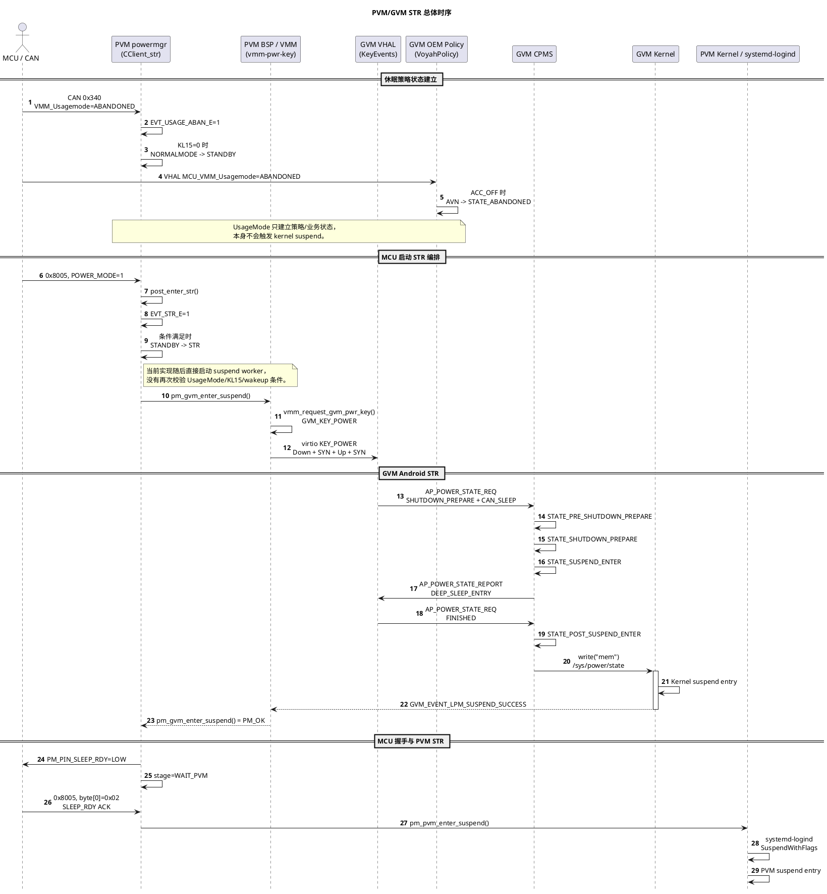

# PVM/GVM STR 电源管理实现与故障诊断

本文档基于 8397 项目当前源码实现，说明车辆 UsageMode、PVM 电源状态机、virtio POWER 键、GVM CarPowerManagementService（CPMS）和 PVM suspend 之间的关系，并给出 suspend 失败时的状态表现和诊断方法。

- 调查日期：2026-08-06
- PVM 源码根目录：`.`（本文档所在的 `code/linux/apps/apps_proc` 目录）
- GVM 源码根目录：`qssi`，相对本文档为 `../../../qssi`
- 本文描述的是当前项目实现，不代表所有 Android Automotive 平台的通用行为。

## 1. 核心结论

1. **UsageMode 是策略输入，不是实际 STR 命令。**
   - PVM 用它选择 `NORMALMODE`、`STANDBY`、`OTAMODE` 等逻辑状态，并把 `ABANDONED` 作为进入 `STR` 状态的条件之一。
   - GVM 用它选择 `STATE_ON`、`STATE_ABANDONED`、`STATE_OTA` 等 AVN/业务状态。
   - 单独把 UsageMode 设置为 `ABANDONED` 不会写 `/sys/power/state`，也不会生成 virtio POWER 键。

2. **MCU 的 `0x8005/POWER_MODE=1` 是 PVM 侧实际 STR 编排的启动命令。**
   - PVM 收到该命令后调用 `post_enter_str()`。
   - STR 工作线程设置 `EVT_STR_E=1`，随后直接启动 GVM suspend 流程。

3. **virtio `KEY_POWER` 是 PVM 驱动 GVM CPMS 的执行信号。**
   - GVM 处于 `ON` 时，第一次 POWER 键触发 `SHUTDOWN_PREPARE + CAN_SLEEP`，开始 Android STR。
   - GVM 尚在休眠准备阶段时，第二次 POWER 键取消 STR。
   - GVM 已经 suspend 时，POWER 键作为 virtio 输入中断唤醒 GVM。

4. **GVM 成功 suspend 后，PVM 才继续进入 suspend。**
   - PVM 等待 VMM 的 `GVM_EVENT_LPM_SUSPEND_SUCCESS`。
   - 收到成功事件后拉低 `SLEEP_RDY`，等待 MCU ACK，最后调用 systemd-logind 的 `SuspendWithFlags` 让 PVM suspend。

5. **普通 CarPowerManager 客户端没有“本次 kernel suspend 失败”的明确回调。**
   - 当前 GVM 深睡失败被映射为 `SUSPEND_RESULT_RETRY`。
   - CPMS 保持在内部 `SUSPEND` 状态并无限重试，对外不会发送专门的失败状态。
   - 对外最后通常停在 `STATE_POST_SUSPEND_ENTER`，直到成功唤醒、收到取消请求或发生关机。

6. **当前代码存在状态机和实际 suspend 执行松耦合。**
   - `CClient_str` 没有在调用 `pm_gvm_enter_suspend()` 前检查 UsageMode、KL15、wake source 或 PVM 状态是否真的满足 `STR` 条件。
   - 因而 MCU 若在错误条件下仍发送 `0x8005/1`，GVM 仍会收到 virtio POWER 并尝试 suspend。

## 2. 三套电源状态不能混用

项目中至少存在三套含义不同的电源状态。

| 状态域 | 典型状态 | 作用 |
|---|---|---|
| PVM `powmgr_state_t` | `NORMALMODE`、`STANDBY`、`STR`、`OTAMODE` | PVM 业务电源状态机和对外 VIPC 状态 |
| GVM CPMS 标准状态 | `ON`、`SHUTDOWN_PREPARE`、`SUSPEND_ENTER`、`SUSPEND_EXIT` | Android 标准电源流程，最终驱动 GVM kernel suspend |
| GVM Voyah AVN 状态 | `STATE_ON`、`STATE_ABANDONED`、`STATE_OTA` | UsageMode/ACC 驱动的 AVN 业务状态和客户端通知 |

GVM AVN 状态被发送给 CarPowerManager 客户端，但该通知不会直接修改 CPMS 内部的标准状态机。因此可能同时出现：

```text
GVM AVN/业务状态：STATE_ABANDONED
GVM CPMS 内部状态：ON
PVM 逻辑状态：STANDBY
```

只有后续 virtio POWER 触发标准 CPMS 流程后，GVM 才会从 CPMS `ON` 进入 `SHUTDOWN_PREPARE/SUSPEND`。

相关源码：

- GVM AVN 状态映射：`../../../qssi/packages/services/Car/service/src/com/android/car/power/oem/PowerManagerConst.java:64`
- OEM 状态通知进入 CPMS：`../../../qssi/packages/services/Car/service/src/com/android/car/power/CarPowerManagementService.java:589`
- `sendPowerManagerEvent()`：`../../../qssi/packages/services/Car/service/src/com/android/car/power/CarPowerManagementService.java:1836`
- PVM 状态枚举：`voyah-cluster/powermgr/inc/powmgr_common.h:39-57`

## 3. STR 完整进入流程

### 3.1 总体时序



### 3.2 UsageMode 建立休眠策略状态

PVM 从 CAN `0x340` 解析 `VMM_Usagemode`，并转换成如下事件位：

- `EVT_USEAGE_CONV_E`
- `EVT_USAGE_OTA_E`
- `EVT_USAGE_DRV_E`
- `EVT_USAGE_ABAN_E`

解析从 frame `0x0340` 分支开始，实现在 `voyah-cluster/powermgr/src/powmgr_convMsg.cpp:342-383`（第 339 行只是 `convert_recv_rpcdMsg()` 的函数签名）。

需要特别注意 `EVT_GUARDHEART_E` 的非对称处理：Convenient、SystemUpdate 和 Driving 分支都会将其清零；Abandoned 分支会清除另外三个 UsageMode 事件位并设置 `EVT_USAGE_ABAN_E=1`，但不更新 `EVT_GUARDHEART_E`。如果此前 `0x8001, mode=4` 已将 GuardMode 事件位置为 1，该值会在 Abandoned 状态下继续保留，直到收到非 GuardMode 的 `0x8001` 或其他会清零该事件位的 UsageMode。它可能使 `STANDBY -> GUARDMODE` 继续满足条件，并阻止要求 `EVT_GUARDHEART_E=0` 的 `GUARDMODE -> STANDBY` 转换。

相关实现：`voyah-cluster/powermgr/src/powmgr_convMsg.cpp:353-383`、`voyah-cluster/powermgr/src/powmgr_convMsg.cpp:508-519`、`voyah-cluster/powermgr/tool/auto_gen_src.c:93-120`、`voyah-cluster/powermgr/tool/auto_gen_src.c:296-309`。

在正常场景中，`UsageMode=ABANDONED` 且 `KL15=0` 会使 PVM 从 `NORMALMODE` 转到 `STANDBY`。PVM 从 `STANDBY` 转到逻辑 `STR` 的完整条件为：

```c
str_e == 1
&& usage_aban_e == 1
&& kl15_e == 0
&& wakeup_e == 0
```

实现位置：

- 条件函数：`voyah-cluster/powermgr/tool/auto_gen_src.c:28`
- `STANDBY -> STR` 转换表：`voyah-cluster/powermgr/tool/auto_gen_src.c:296`

### 3.3 MCU 命令启动实际 STR 编排

PVM 收到 frame `0x8005` 后，根据第一个字节执行不同动作：

| `frame_bytes[0]` | 动作 |
|---|---|
| `0x01` | 向 rpcd 发送 MCU power mode 1，并调用 `post_enter_str()` |
| `0x00` | 调用 `post_shutdown()` |
| `0x02` | 作为 MCU 检测到 `SLEEP_RDY=LOW` 的 ACK，调用 `notify_mcu_check_gpio_ack()` 设置 ACK 标志并通知条件变量，使阻塞在 `wait_mcu_sleep_rdy_ack()` 中的线程结束等待；它不直接向 STR worker 主循环投递事件 |

实现位置：`voyah-cluster/powermgr/src/powmgr_convMsg.cpp:456-497`；ACK 通知与等待：`voyah-cluster/powermgr/src/powmgr_clientStr.cpp:120-157`。

`CClient_str` 处理 `ENTER_STR` 时：

1. 停止 MCU heartbeat monitor。
2. 确认当前 flow stage 为 `IDLE`。
3. 设置 `EVT_STR_E=1`。
4. 拉低 PVM/GVM heartbeat GPIO。
5. 设置阶段为 `WAIT_GVM`。
6. 在线程中调用 `pm_gvm_enter_suspend()`。

实现位置：`voyah-cluster/powermgr/src/powmgr_clientStr.cpp:345`。

### 3.4 PVM 注入 virtio POWER

`pm_gvm_enter_suspend()` 执行以下操作：

1. 连接 `VMM_SERVICE_SERVER`，订阅 GVM LPM 事件。
2. 连接 `VMM_POWER_MANAGER_SERVER`。
3. 对每个 GVM 调用：

   ```c
   vmm_request_gvm_pwr_key(vmid, GVM_KEY_POWER, handle);
   ```

4. 最长等待 270 秒，直到收到 `GVM_EVENT_LPM_SUSPEND_SUCCESS`。

实现位置：`voyah-bsp/voyahpm-bsp/src/voyahpm_bsp.c:1142`。

VMM client 把请求封装成 `PWR_MGR_CMD_MSG`：

```text
msg_type = PWR_MGR_CMD_MSG
vmid     = 目标 GVM
pwr_key  = GVM_KEY_POWER
```

实现位置：`vendor/qcom/proprietary/vmm-service-noship/vmm-lib/vmm-client/vmm_clib.c:660`。

`vmm-pwr-key` 服务将 `GVM_KEY_POWER` 映射为 Linux `KEY_POWER`，通过 `/dev/uinput` 依次写入：

```text
EV_KEY KEY_POWER 1
EV_SYN SYN_REPORT
EV_KEY KEY_POWER 0
EV_SYN SYN_REPORT
```

它创建的输入设备名为 `QTI-Auto virtio-keyboard`，设备被 guest launcher 作为 virtio input backend 提供给 GVM。

实现位置：

- backend 说明和设备名：`vendor/qcom/proprietary/virtual-power-key/src/vmm-pwr-key-main.c:6`
- 按下/释放事件：`vendor/qcom/proprietary/virtual-power-key/src/vmm-pwr-key-main.c:110`
- `GVM_KEY_POWER -> KEY_POWER`：`vendor/qcom/proprietary/virtual-power-key/src/vmm-pwr-key-main.c:180`
- uinput 设备创建：`vendor/qcom/proprietary/virtual-power-key/src/vmm-pwr-key-main.c:606`

### 3.5 GVM 将 POWER 键转换为 CPMS 请求

GVM VHAL 的 `KeyEvents` 线程打开名称包含 `keyboard`、`qpnp_pon`、`QTI-Auto input devic` 或 `pwrkey` 的输入设备，读取 `KEY_POWER`。其中 `qpnp_pon` 对应高通 PMIC power-on 键。在收到完整的按下和释放后调用 `handlePowerKey()`。

实现位置：

- 输入设备匹配：`../../../qssi/hardware/interfaces/automotive/vehicle/2.0/default/impl/vhal_v2_0/KeyEvents.cpp:529-532`
- POWER 事件读取：`../../../qssi/hardware/interfaces/automotive/vehicle/2.0/default/impl/vhal_v2_0/KeyEvents.cpp:544`
- 状态相关处理：`../../../qssi/hardware/interfaces/automotive/vehicle/2.0/default/impl/vhal_v2_0/KeyEvents.cpp:334`

当当前状态为 `ON` 且 `mPowerKey=true` 时，VHAL 生成：

```text
AP_POWER_STATE_REQ.state = SHUTDOWN_PREPARE
AP_POWER_STATE_REQ.param = CAN_SLEEP
```

`PowerHalService` 将 `CAN_SLEEP` 映射为 `SHUTDOWN_TYPE_DEEP_SLEEP`：

`../../../qssi/packages/services/Car/service/src/com/android/car/hal/PowerHalService.java:290`。

### 3.6 GVM CPMS 状态序列

正常 STR 时，CarPowerManager 客户端大致收到以下标准状态：

```text
STATE_ON
  -> STATE_PRE_SHUTDOWN_PREPARE
  -> STATE_SHUTDOWN_PREPARE
  -> STATE_SUSPEND_ENTER
  -> STATE_POST_SUSPEND_ENTER
  -> [kernel suspend]
  -> STATE_SUSPEND_EXIT
  -> STATE_ON
```

主要实现位置：

- `SHUTDOWN_PREPARE` 处理：`../../../qssi/packages/services/Car/service/src/com/android/car/power/CarPowerManagementService.java:1315`
- `SUSPEND_ENTER` 和 VHAL `DEEP_SLEEP_ENTRY`：`../../../qssi/packages/services/Car/service/src/com/android/car/power/CarPowerManagementService.java:1453`
- `POST_SUSPEND_ENTER`：`../../../qssi/packages/services/Car/service/src/com/android/car/power/CarPowerManagementService.java:1512`
- 实际 suspend 和 `SUSPEND_EXIT`：`../../../qssi/packages/services/Car/service/src/com/android/car/power/CarPowerManagementService.java:1967`

CPMS 给 VHAL 发送 `DEEP_SLEEP_ENTRY` 后，`KeyEvents` 回复 `AP_POWER_STATE_REQ=FINISHED`。CPMS 收到 `FINISHED` 后进入内部 `CpmsState.SUSPEND`，再执行实际 kernel suspend。

### 3.7 GVM 成功后进入 PVM suspend

PVM 的 `pm_gvm_event_cb()` 只有在收到 `GVM_EVENT_LPM_SUSPEND_SUCCESS` 时才设置 `gvm_suspend_success=true`：

`voyah-bsp/voyahpm-bsp/src/voyahpm_bsp.c:1103`。

`CClient_str` 收到成功的 `GVM_DONE` 后：

1. 拉低 `PM_PIN_SLEEP_RDY`。
2. 设置阶段为 `WAIT_PVM`，保证等待期间到达的取消请求走 PVM 阶段的恢复分支。
3. 等待 MCU `0x8005/0x02` ACK，超时为 3 秒。
4. 调用 `pm_pvm_enter_suspend()`。

实现位置：`voyah-cluster/powermgr/src/powmgr_clientStr.cpp:447-483`。

`pm_pvm_enter_suspend()` 最终通过 systemd-logind 调用：

```text
org.freedesktop.login1.Manager.SuspendWithFlags
```

实现位置：

- PVM suspend 入口：`voyah-bsp/voyahpm-bsp/src/voyahpm_bsp.c:1020`
- `SuspendWithFlags`：`voyah-bsp/voyahpm-bsp/src/voyahpm_bsp.c:643`

## 4. virtio POWER 在不同阶段的作用

GVM 的 `mPowerKey` 不是当前物理按键电平，而是 VHAL 用来区分“下一次 POWER 应该进入休眠还是取消休眠”的阶段标志：

- CPMS 上报 `ON` 时置为 `true`。
- CPMS 上报 `SHUTDOWN_PREPARE`、`SHUTDOWN_POSTPONE` 或 `DEEP_SLEEP_ENTRY` 时置为 `false`。
- CPMS 上报 `SHUTDOWN_CANCELLED`、`DEEP_SLEEP_EXIT` 时不修改该值；正常 suspend 周期中，它会保持为 `false`，直到后续 `ON` 才重新置为 `true`。

实现位置：`../../../qssi/hardware/interfaces/automotive/vehicle/2.0/default/impl/vhal_v2_0/KeyEvents.cpp:673-697`。

| GVM 当前状态 | virtio POWER 行为 | 后续状态 |
|---|---|---|
| `ON`，且 `mPowerKey=true` | 发送 `SHUTDOWN_PREPARE + CAN_SLEEP` | 开始 STR |
| `SHUTDOWN_CANCELLED`、`DEEP_SLEEP_EXIT` | 代码仅在 `mPowerKey=true` 时才会发送 `SHUTDOWN_PREPARE`；但这两个状态本身不会将它置为 `true`，正常周期中仍为 `false`，因此通常跳过该请求 | 等待后续 `ON` |
| `SHUTDOWN_PREPARE`、`SHUTDOWN_POSTPONE`，且 `mPowerKey=false` | 发送 `SHUTDOWN_CANCELLED` 和 `CANCEL_SHUTDOWN` | 回到 `ON` |
| 尚未真正睡下的 `DEEP_SLEEP_ENTRY`，且 `mPowerKey=false` | 即使 `mIgnoreNextPowerKey=true`，当前代码也会先清除 ignore 标志并继续处理；随后 `!mPowerKey` 条件成立，发送取消请求 | 取消 STR |
| 已经 suspend | 首先作为 virtio IRQ 唤醒 GVM；用户态看到 `DEEP_SLEEP_EXIT/ON` 后忽略一次按键 | `SUSPEND_EXIT -> ON` |

上述分支实现位于 `../../../qssi/hardware/interfaces/automotive/vehicle/2.0/default/impl/vhal_v2_0/KeyEvents.cpp:334-403`。

PVM 侧也使用同一个 `GVM_KEY_POWER` 完成三种动作：

- `pm_gvm_enter_suspend()`：启动 GVM suspend。
- `pm_gvm_terminate_suspend()`：在准备阶段注入第二次 POWER，取消 GVM suspend。
- `pm_gvm_resume()`：GVM 已睡眠时注入 POWER，触发 virtio 唤醒。

因此不能脱离 GVM 当前状态，仅根据 `KEY_POWER` 本身判断它是“睡眠键”还是“唤醒键”。

## 5. UsageMode 对状态的影响

### 5.1 PVM 行为

| UsageMode | 值 | PVM 事件与状态影响 |
|---|---:|---|
| Convenient | `0` | 置 `EVT_USEAGE_CONV_E`；在满足启动/退出条件时推动到 `NORMALMODE` |
| RobotDriving | `1` | 枚举存在，但当前 `0x340` 解析分支未处理，不改变状态事件 |
| SystemUpdate | `2` | 置 `EVT_USAGE_OTA_E`，推动到 `OTAMODE` |
| Driving | `3` | 置 `EVT_USAGE_DRV_E`，推动到 `NORMALMODE` |
| Abandoned | `4` | 置 `EVT_USAGE_ABAN_E`；配合 `KL15=0` 推动到 `STANDBY`，并参与 `STANDBY -> STR` 条件；不会重置已有的 `EVT_GUARDHEART_E` |
| Invalid | `7` | 当前 CAN 解析分支不处理 |

典型转换包括：

- `NORMALMODE + ABANDONED + KL15_OFF -> STANDBY`
- `NORMALMODE + SYSTEMUPDATE -> OTAMODE`
- `OTAMODE + CONVENIENT/DRIVING -> NORMALMODE`
- `STANDBY + STR_REQUEST + ABANDONED + KL15_OFF + NO_WAKEUP -> STR`
- `STR + EVT_STR_E=0 -> STANDBY`

状态转换表：`voyah-cluster/powermgr/tool/auto_gen_src.c:296`。

PVM 每次进入新状态时通过 VIPC 发布 `SLEEP/STANDBY/STR/OTAMODE/NORMALMODE` 等字符串：

- 状态广播：`voyah-cluster/powermgr/src/powmgr_stmPower.cpp:606`
- VIPC 映射和发送：`voyah-cluster/powermgr/inc/powmgr_clientVipc.h:39`、`voyah-cluster/powermgr/src/powmgr_clientVipc.cpp:213`

### 5.2 GVM 行为

GVM 将同一信号暴露为 VHAL 属性 `MCU_VMM_Usagemode`。`VoyahSource` 订阅该属性并调用 `VoyahPolicy.onVehicleUsageMode()`：

- 属性定义：`../../../qssi/packages/services/Car/service/src/com/android/car/power/oem/policy/VoyahUtil.java:37`
- 属性订阅：`../../../qssi/packages/services/Car/service/src/com/android/car/power/oem/policy/VoyahSource.java:35`
- 事件分发：`../../../qssi/packages/services/Car/service/src/com/android/car/power/oem/policy/VoyahSource.java:161`
- 策略处理：`../../../qssi/packages/services/Car/service/src/com/android/car/power/oem/policy/VoyahPolicy.java:463`

| UsageMode | ACC 条件 | GVM AVN/CarPower 通知 |
|---|---|---|
| Convenient `0` | 非开机动画阶段 | `STATE_ON = 6` |
| Driving `3` | 非开机动画阶段 | `STATE_ON = 6` |
| SystemUpdate `2` | 非开机动画阶段 | `STATE_OTA = 17` |
| Abandoned `4` | `ACC_OFF` | `STATE_ABANDONED = 15` |
| Abandoned `4` | `ACC_ON` | 保持或切换到 `STATE_ON` |
| Init `7` | `ACC_OFF` | `STATE_ABANDONED = 15` |
| RobotDriving `1` | 任意 | 当前策略记录 unsupported，不切换状态 |

注意：当前 `AVN_STATUS_RUN_ON` 映射为 `CarPowerManager.STATE_ON=6`，不是源码中另外定义的 `STATE_NORMAL=19`。

如果开机动画仍在播放，UsageMode 处理会暂时跳过；动画结束时 `handleStateAfterBoot()` 会根据最新 UsageMode 重新计算 AVN 状态。

## 6. suspend 失败时的 GVM 行为

### 6.1 kernel suspend 调用路径

GVM CPMS 最终调用：

```text
CarPowerManagementService.suspendWithRetries()
  -> SystemInterface.enterDeepSleep()
  -> SystemStateInterface.DefaultImpl.enterDeepSleep()
  -> SystemPowerControlHelper.forceDeepSleep()
  -> write("mem") to /sys/power/state
```

实现位置：

- CPMS 重试：`../../../qssi/packages/services/Car/service/src/com/android/car/power/CarPowerManagementService.java:3660`
- 深睡返回值映射：`../../../qssi/packages/services/Car/service/src/com/android/car/systeminterface/SystemStateInterface.java:211`
- `/sys/power/state` 写入：`../../../qssi/packages/services/Car/service/src/com/android/car/systeminterface/SystemPowerControlHelper.java:123`

写入 `/sys/power/state` 是同步操作：

- 成功进入 suspend 后，该 write 在系统被唤醒时返回成功。
- kernel 在 suspend 准备过程中返回错误时，write 返回错误，Java 层捕获 `IOException` 并返回 `SUSPEND_FAILURE`。
- `SystemStateInterface.enterDeepSleep()` 将所有深睡失败映射成 `SUSPEND_RESULT_RETRY`。

### 6.2 当前重试策略

当前 Voyah 修改后的 `suspendWithRetries()`：

- 不限制重试次数。
- 使用指数退避，最大间隔由 `MAX_RETRY_INTERVAL_MS` 限制。
- 以下情况才退出：
  - suspend 成功；
  - POWER 键取消使 CPMS 当前状态不再是 `SUSPEND`；
  - 返回 `SUSPEND_RESULT_ABORT`。

但当前 `enterDeepSleep()` 只会返回 `SUCCESS` 或 `RETRY`；`ABORT` 主要存在于 hibernation 路径。因此普通 STR kernel 失败会持续重试，而不会自动切到一个“失败”CarPower 状态。

典型日志：

```text
SystemPowerControlHelper: Failed to suspend. Target mem. Failed to write to /sys/power/state
CarPowerManagementService: Failed to Suspend; will retry after ...ms
```

### 6.3 CarPowerManager 状态表现

| 结果 | CPMS 内部状态 | CarPowerManager 客户端可见状态 |
|---|---|---|
| kernel suspend 成功并正常唤醒 | `SUSPEND -> WAIT_FOR_VHAL -> ON` | `POST_SUSPEND_ENTER -> SUSPEND_EXIT -> ON` |
| 单次 kernel suspend 失败，进入重试 | 保持 `SUSPEND` | 没有失败事件；最后通常仍是 `POST_SUSPEND_ENTER` |
| suspend 准备阶段收到第二次 POWER | 变成 `WAIT_FOR_VHAL` | `SHUTDOWN_CANCELLED -> ON` |
| 写入成功但马上被 wake source 唤醒 | 被视为成功 suspend/resume | `SUSPEND_EXIT -> ON`，不能仅靠 CarPower 状态区分“瞬时唤醒” |

结论：`CarPowerManager.CarPowerStateListener` 能监听状态阶段，但不能监听每一次 kernel suspend attempt 的成功或失败。

GVM UsageMode/AVN 状态与上述标准 CPMS 状态相互独立。例如 UsageMode 仍为 `ABANDONED` 时，kernel suspend 失败不会自动把 AVN 状态改成 `STATE_ON`。

## 7. 用户空间如何检测 suspend 失败

### 7.1 最可靠方式：检查发起 suspend 的同步返回值

真正写 `/sys/power/state` 的进程可以直接检查 write 返回值和 `errno`。当前项目中 CPMS 已经通过 `SystemPowerControlHelper.enterSuspend()` 完成该检查。

独立进程无法通过监听 `/sys/power/state` 得到另一个写入者的返回值；inotify 也不能可靠表示 suspend 成功或失败。因此若业务进程必须得到明确结果，应由 CPMS 或专用 system service 增加结果 IPC，而不是监听 sysfs 文件变化。

### 7.2 监听 GVM logcat 和 kernel log

调试环境可同时观察 CPMS 和 kernel：

```sh
adb logcat -b all -s CarPowerManagementService SystemPowerControlHelper KeyEvents PowerHalService
adb shell dmesg -w
```

重点匹配：

```text
Entering Suspend-to-RAM
PM: suspend entry
Failed to suspend
Failed to Suspend; will retry
PM: suspend exit
PM: Some devices failed to suspend
```

kernel log 可以定位具体设备回调失败；logcat 可以确认 CPMS 是否进入重试或被 POWER 键取消。

### 7.3 比较 kernel suspend statistics

Linux 6.6 内核提供 suspend 统计。运行时应先检查节点是否存在：

```sh
adb shell 'ls -l /sys/power/suspend_stats /sys/kernel/debug/suspend_stats 2>/dev/null'
adb shell 'cat /sys/power/suspend_stats/fail 2>/dev/null'
adb shell 'cat /sys/power/suspend_stats/last_failed_dev 2>/dev/null'
adb shell 'cat /sys/power/suspend_stats/last_failed_errno 2>/dev/null'
adb shell 'cat /sys/power/suspend_stats/last_failed_step 2>/dev/null'
adb shell 'cat /sys/kernel/debug/suspend_stats 2>/dev/null'
```

在发起 STR 前后比较 `success`、`fail` 和各阶段失败计数，可以区分：

- freeze/prepare 失败；
- device suspend/late/noirq 失败；
- resume 阶段失败；
- 最后失败设备、errno 和步骤。

PVM 内核对应实现可参考：

- sysfs 属性实例：`kernel/kernel_platform/kernel/kernel/power/main.c:366-378`
- debugfs 汇总：`kernel/kernel_platform/kernel/kernel/power/main.c:465`
- suspend 成功/失败计数：`kernel/kernel_platform/kernel/kernel/power/suspend.c:628`
- ABI 文档：`kernel/kernel_platform/kernel/Documentation/ABI/testing/sysfs-power:310`

GVM 使用的 kernel image 是否暴露这些节点，应以目标机运行时检查为准。

### 7.4 使用 tracefs/Perfetto 观察 suspend 阶段

root/debug 环境可以启用 `power:suspend_resume` tracepoint：

```sh
adb shell 'echo 1 > /sys/kernel/tracing/events/power/suspend_resume/enable'
adb shell 'cat /sys/kernel/tracing/trace_pipe'
```

该 tracepoint 能看到 `freeze_processes`、`suspend_enter`、`machine_suspend` 等阶段的开始和结束。它适合定位失败阶段，但业务进程不应把 tracefs 当作正式状态 API。

### 7.5 PVM 侧的间接检测

PVM 不读取 GVM 的 CarPower 状态来判断 suspend 成功，而是等待 VMM 的：

```text
GVM_EVENT_LPM_SUSPEND_SUCCESS
```

如果 GVM kernel 一直失败并在 CPMS 中重试，PVM 收不到成功事件，`pm_gvm_enter_suspend()` 最终返回超时或错误，`CClient_str` 执行重试。

PVM 可观察：

```sh
journalctl -u powermgr.service -f
journalctl -f | grep -E 'GVM_EVENT_LPM|gvm suspend|ENTER_STR|GVM failed|PM_PIN_SLEEP_RDY'
```

典型错误包括：

```text
GVM suspend timed out without ACK
gvm suspend failed
[STR] GVM failed ... retry_left=...
[STR] enter_str failed at GVM
```

## 8. POWER 键取消与唤醒流程

### 8.1 GVM 尚在 suspend 准备阶段

PVM BSP 监控物理 POWER 键：

`/dev/input/by-path/platform-soc@0:gpio-keys-event`

当 `pm_gvm_suspend_can_be_terminated=true` 且收到按下事件时，BSP 上报 `PM_EVT_WAKEUP_IRQ`：

`voyah-bsp/voyahpm-bsp/src/voyahpm_bsp.c:796`。

`CClient_str` 根据当前阶段处理：

- `WAIT_GVM`：调用 `pm_gvm_terminate_suspend()`，注入第二次 virtio POWER，使 GVM 发送 `SHUTDOWN_CANCELLED`。
- `WAIT_PVM`：终止 PVM suspend 准备并调用 `pm_gvm_resume()`。

实现位置：`voyah-cluster/powermgr/src/powmgr_clientStr.cpp:272`。

取消路径同时设置 `EVT_STR_E=0`，使 PVM 逻辑状态从 `STR` 回到 `STANDBY`。

### 8.2 PVM 已经 suspend

PVM 被硬件 wake source 唤醒后，systemd 的 `PrepareForSleep(false)` 被监听线程识别，BSP 上报 `PM_EVT_WAKEUP_IRQ`：

`voyah-bsp/voyahpm-bsp/src/voyahpm_bsp.c:460`。

`CClient_str` 在 `IDLE` 阶段收到该事件后执行 `post_resume()`：

1. 设置 `EVT_STR_E=0`。
2. 拉高 `SLEEP_RDY` 和 heartbeat GPIO。
3. 调用 `pm_gvm_resume()`。
4. `pm_gvm_resume()` 再次注入 `GVM_KEY_POWER`，等待 `GVM_EVENT_LPM_RESUME_SUCCESS`。

实现位置：

- resume 消息处理：`voyah-cluster/powermgr/src/powmgr_clientStr.cpp:322`
- GVM resume：`voyah-bsp/voyahpm-bsp/src/voyahpm_bsp.c:1499`

## 9. 当前实现的风险点

### 9.1 实际 STR 执行没有被 UsageMode 状态机门控

`ENTER_STR` 分支虽然先设置 `EVT_STR_E=1`，但随后直接调用 `pm_gvm_enter_suspend()`，没有检查：

- 当前 PVM state 是否已变成 `POWMGR_STATE_STR`；
- `EVT_USAGE_ABAN_E` 是否为 1；
- `KL15` 是否为 0；
- `EVT_WAKEUP_E` 是否为 0。

因此 `STANDBY -> STR` 状态条件只约束 PVM 的逻辑状态转换，不能阻止实际 GVM/PVM suspend worker。当前实现依赖 MCU 只在正确条件下发送 `0x8005/1`。

建议在 `CClient_str::ENTER_STR` 开始处增加本地条件校验，并对拒绝原因做明确日志和状态反馈。

### 9.2 GVM suspend 最终失败时可能遗留 `EVT_STR_E=1`

GVM 重试耗尽后，`GVM_DONE` 失败分支将 `m_stage` 改回 `IDLE`，但没有清除 `EVT_STR_E`：

`voyah-cluster/powermgr/src/powmgr_clientStr.cpp:420`。

如果 PVM 逻辑状态此前已进入 `POWMGR_STATE_STR`，它可能继续停留在 `STR`，虽然实际 GVM 没有成功 suspend。当前只有 cancel/resume 路径明确设置 `EVT_STR_E=0`。

建议所有失败出口统一执行：

```text
EVT_STR_E=0
m_stage=IDLE
恢复 heartbeat/SLEEP_RDY
发布 STR_FAILED 原因
```

### 9.3 缺少正式的 suspend attempt 结果接口

当前对外只能观察阶段状态，不能区分：

- kernel suspend attempt 失败并准备重试；
- 正常 suspend 后快速唤醒；
- 被 POWER 键取消；
- VMM 没有产生 LPM success 事件。

建议增加一个独立结果模型，不要复用 CarPower 状态：

```text
STR_REQUESTED
GVM_PREPARING
GVM_SUSPEND_RETRY(errno, failed_dev, failed_step)
GVM_SUSPENDED
PVM_SUSPENDING
STR_CANCELLED
STR_FAILED(stage, reason)
STR_RESUMED
```

PVM 应以该结果和 VMM LPM 事件作为整机 STR 成功依据；应用层如有需要，可通过受权限保护的 Binder/VIPC callback 获取结果。

### 9.4 RobotDriving 和 Init/Invalid 在 PVM/GVM 的处理不一致

- PVM 定义了 `RobotDriving=1`，但当前 `0x340` 分支未设置任何事件。
- GVM 未定义 RobotDriving 分支，会记录 unsupported。
- GVM 将 `Init=7` 视为 off 类模式；PVM 将 `7` 视为 invalid 并忽略。

建议统一两侧枚举和状态策略，否则同一 UsageMode 可能导致 PVM/GVM 状态不一致。

## 10. 推荐的现场排查顺序

一次 STR 失败建议按以下顺序收集证据：

1. **确认 UsageMode/ACC/KL15 条件**
   - PVM 是否收到 `VMM_Usagemode=4`。
   - `EVT_USAGE_ABAN_E=1`、`EVT_KL15_E=0`、`EVT_WAKEUP_E=0` 是否成立。

2. **确认 MCU 是否真的发送 STR 命令**
   - 查找 `msg 0x8005 ... POWER_MODE=1`。
   - 查找 `[STR] ENTER_STR start` 和 `add_event EVT_STR_E 1`。

3. **确认 virtio POWER 是否成功注入**
   - PVM 查找 `vmm_request_gvm_pwr_key ... success`。
   - GVM 查找 `KeyEvents: power key down`、`SHUTDOWN_PREPARE`、`CAN_SLEEP`。

4. **确认 GVM CPMS 是否走到实际 suspend**
   - 查找 `STATE_SUSPEND_ENTER`、`STATE_POST_SUSPEND_ENTER`。
   - 查找 `Entering Suspend-to-RAM` 和 kernel `PM: suspend entry`。

5. **判断 kernel 失败还是快速唤醒**
   - 查看 `/sys/power/suspend_stats` 或 `/sys/kernel/debug/suspend_stats` 增量。
   - 查看 `last_failed_dev/errno/step`。
   - 对齐 kernel `PM: suspend entry/exit` 和 `power:suspend_resume` trace。

6. **确认 PVM 是否收到 GVM LPM success**
   - 查找 `GVM_EVENT_LPM_SUSPEND_SUCCESS`。
   - 没有该事件时检查 270 秒超时和 GVM retry。

7. **确认 MCU/PVM 后半段握手**
   - `PM_PIN_SLEEP_RDY: PM_PIN_LOW`。
   - MCU `0x8005/0x02` ACK。
   - PVM `SuspendWithFlags succeeded`。

8. **检查状态清理**
   - 失败或取消后 `EVT_STR_E` 是否被清零。
   - PVM 是否仍错误广播 `STR`。
   - GVM 是否收到 `SHUTDOWN_CANCELLED/ON`。

## 11. 关键源码索引

### PVM

| 模块 | 文件/入口 |
|---|---|
| UsageMode/CAN/MCU STR 命令 | `voyah-cluster/powermgr/src/powmgr_convMsg.cpp` |
| PVM 电源状态转换表 | `voyah-cluster/powermgr/tool/auto_gen_src.c` |
| STR 编排、取消、恢复 | `voyah-cluster/powermgr/src/powmgr_clientStr.cpp` |
| PVM/GVM suspend BSP | `voyah-bsp/voyahpm-bsp/src/voyahpm_bsp.c` |
| VMM power-key client | `vendor/qcom/proprietary/vmm-service-noship/vmm-lib/vmm-client/vmm_clib.c` |
| virtio keyboard/uinput backend | `vendor/qcom/proprietary/virtual-power-key/src/vmm-pwr-key-main.c` |
| PVM kernel suspend | `kernel/kernel_platform/kernel/kernel/power/suspend.c` |
| suspend statistics | `kernel/kernel_platform/kernel/kernel/power/main.c` |

### GVM

| 模块 | 文件/入口 |
|---|---|
| virtio POWER 到 VHAL 请求 | `../../../qssi/hardware/interfaces/automotive/vehicle/2.0/default/impl/vhal_v2_0/KeyEvents.cpp` |
| `CAN_SLEEP` 映射 | `../../../qssi/packages/services/Car/service/src/com/android/car/hal/PowerHalService.java` |
| 标准 CPMS 状态机和 suspend retry | `../../../qssi/packages/services/Car/service/src/com/android/car/power/CarPowerManagementService.java` |
| `/sys/power/state` 写入 | `../../../qssi/packages/services/Car/service/src/com/android/car/systeminterface/SystemPowerControlHelper.java` |
| UsageMode 属性接入 | `../../../qssi/packages/services/Car/service/src/com/android/car/power/oem/policy/VoyahSource.java` |
| UsageMode/ACC 到 AVN 状态 | `../../../qssi/packages/services/Car/service/src/com/android/car/power/oem/policy/VoyahPolicy.java` |
| AVN 状态映射 | `../../../qssi/packages/services/Car/service/src/com/android/car/power/oem/PowerManagerConst.java` |

## 12. 最终判定标准

不能仅凭以下任一条件宣称整机 STR 成功：

- UsageMode 已变成 `ABANDONED`；
- PVM 已广播 `POWMGR_STATE_STR`；
- GVM CarPowerManager 已通知 `STATE_SUSPEND_ENTER`；
- kernel 仅打印了 `PM: suspend entry`；
- `/sys/power/state` 写入已经开始。

建议把一次完整 STR 成功定义为：

1. GVM kernel 完成 suspend entry；
2. VMM 向 PVM 上报 `GVM_EVENT_LPM_SUSPEND_SUCCESS`；
3. MCU 完成 `SLEEP_RDY` ACK；
4. PVM 成功执行 `SuspendWithFlags` 并实际进入 suspend；
5. 唤醒后 PVM、GVM 分别收到 resume success，状态和 GPIO 被正确恢复。

其中任一步超时、失败或被取消，都应记录独立的阶段和原因，而不能只依赖 UsageMode 或 CarPower 状态推断。
