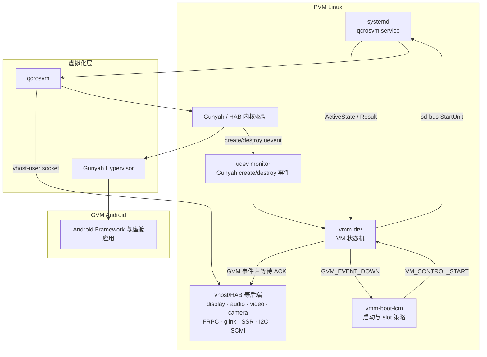
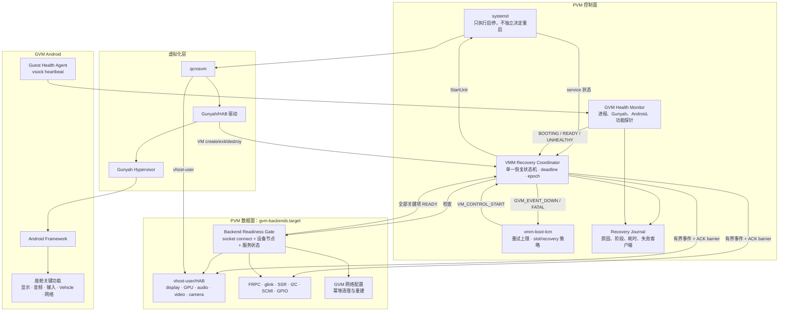
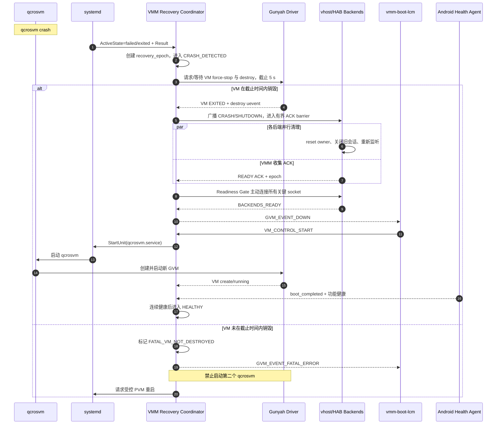
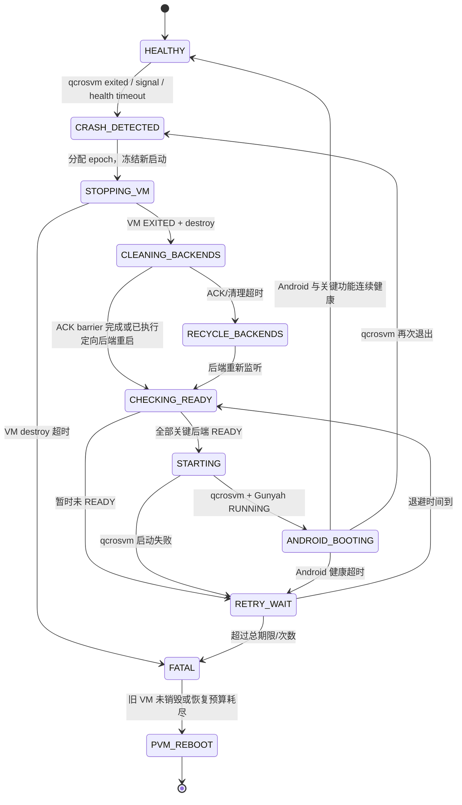

# qcrosvm 异常退出后自动恢复方案

> 文档状态：方案设计，待实施与目标机验证  
> 适用平台：Qualcomm SA8797 / IVI8397  
> 系统架构：PVM Linux + Gunyah + qcrosvm + GVM Android  
> 源码基线：`/home/ethen/workspace/voyah/projects/8397/code/linux/apps/apps_proc`  
> 编写日期：2026-08-10

---

## 1. 摘要

当前 `qcrosvm` 异常退出后不会由 systemd 自动重启；即使人工执行 `systemctl start qcrosvm.service`，也可能因为旧 GVM 尚未销毁、HAB/vhost 后端仍在清理、Unix socket 尚未重新监听等原因再次失败。

源码分析表明，这不是一个单纯缺少 `Restart=on-failure` 的问题。现有恢复链中存在多个没有超时的同步等待：VMM 等待 Gunyah destroy uevent、VMM 等待客户端 ACK、vhost-user 等待 HAB READY、HAB 驱动等待全部 vchan 主动关闭、Gunyah 驱动等待 VM 进入 `EXITED`。任意一个环节不返回，VMM 状态机便无法发出 `GVM_EVENT_DOWN`，`vmm-boot-lcm` 也就不会重新启动 GVM。

本方案采用以下总体策略：

1. 保持 VMM/boot-LCM 为 GVM 唯一生命周期控制者，避免 systemd 与 VMM 双重拉起。
2. 将所有无限等待改为有界等待，并建立明确的超时升级路径。
3. 重启 qcrosvm 前，确认旧 VM 已销毁且所有关键后端已经重新监听。
4. 对 qcrosvm 启动实施有界退避重试，而不是两次连续立即重试。
5. 以 Android 功能健康作为恢复成功标准，而不是只判断 qcrosvm 进程存在。
6. 当 Gunyah 无法确认旧 VM 已停止时，禁止创建第二个 GVM，升级为受控 PVM 重启。

该方案可以实现 qcrosvm crash 后自动、快速、可观测、不会破坏 Android 数据一致性的恢复。qcrosvm 异常退出后无法保留 Android RAM 运行态，因此恢复形态是一次受控的 GVM 冷启动。

---

## 2. 范围与术语

### 2.1 方案范围

本文覆盖：

- qcrosvm 进程异常退出、被信号杀死或启动失败；
- Gunyah VM 停止和销毁；
- VMM 状态机及其客户端通知/ACK；
- HAB、vhost-user、SCMI、FRPC、glink、SSR、I2C、GPIO、网络等后端恢复；
- systemd 服务编排；
- Android 冷启动后的功能健康验证；
- 连续失败时的降级和 PVM 重启兜底。

本文不承诺：

- qcrosvm crash 后保持 Android 内存、进程和前台 Activity 原样继续运行；
- 在 Gunyah 仍确认旧 VM 为运行态时强制创建同 VMID 的新实例；
- 未经业务定义就自动切换 Android boot slot 或清除 userdata。

### 2.2 术语

| 术语 | 含义 |
|---|---|
| PVM | Primary VM，运行 Linux、systemd、VMM 和各类后端服务 |
| GVM | Guest VM，本项目中运行 Android Automotive |
| qcrosvm | GVM 的用户态 VMM 进程 |
| VMM Service | `vmm-drv`，负责 VM 状态机、事件分发、systemd 和 udev 监控 |
| boot-LCM | `vmm-boot-lcm`，负责 GVM 启动策略、重试和 recovery 策略 |
| HAB | Qualcomm Hypervisor Abstraction，用于 PVM/GVM 间通信 |
| 后端 READY | 后端进程已完成旧会话清理，并且对应 socket 可以成功建立连接 |
| Android READY | Android 已启动完成，且座舱关键功能探针通过 |

---

## 3. 当前现状

### 3.1 当前软件架构



### 3.2 当前生命周期控制方式

`vm_config_la.xml` 中配置：

```xml
<vmid>52</vmid>
<systemd_service>qcrosvm.service</systemd_service>
<vmm_boot_lcm_enable>1</vmm_boot_lcm_enable>
<lcm_retry_count>7</lcm_retry_count>
```

因此，GVM 的设计控制者是 VMM/boot-LCM：

1. VMM 通过 sd-bus 监控 `qcrosvm.service`；
2. VMM 通过 udev 监控 Gunyah VM 的 create/destroy 事件；
3. qcrosvm 退出后，VMM 状态机通知各客户端清理；
4. 状态机进入 `VM_STOPPED` 后发出 `GVM_EVENT_DOWN`；
5. boot-LCM 收到 DOWN 后调用 `VM_CONTROL_START`；
6. VMM 再通过 systemd 启动 qcrosvm。

### 3.3 已确认的源码问题

| 编号 | 现状 | 源码位置 | 影响 |
|---|---|---|---|
| C1 | `qcrosvm.service` 没有 `Restart=` | `vendor/qcom/opensource/crosvm-gunyah/qcrosvm_sa8797.service:17-93` | systemd 不会自行拉起 qcrosvm |
| C2 | VMM 无限等待 Gunyah destroy uevent | `vendor/qcom/proprietary/vmm-service-noship/vmm-drv/src/vmm_sd_bus.c:562-570` | VM 未上报 destroy 时状态机永久停止 |
| C3 | VMM 顺序、阻塞等待所有客户端 ACK，无超时 | `vendor/qcom/proprietary/vmm-service-noship/vmm-drv/src/vmm_drv.c:606-648` | 任意后端异常都会阻塞全局恢复 |
| C4 | vhost-user VMM 回调无限等待状态变成 READY | `vendor/qcom/opensource/vhost-user/src/vhost_user_vmm.c:126-178` | 后端清理未完成时不会 ACK VMM |
| C5 | HAB 驱动每 999 ms 检查一次 vchan，直到全部主动关闭 | `vendor/qcom/opensource/mmhab-drv/hab_vchan.c:279-291` | 某个 HAB 客户端不关闭时永久阻塞 |
| C6 | `VHOST_RESET_OWNER` 调用上述无限等待 | `vendor/qcom/opensource/mmhab-drv/hypervisor/virtio/hab_vhost.c:586-617` | vhost-user 无法完成 deinit 和重新监听 |
| C7 | 源码注释明确指出 reset owner 阻塞会让 qcrosvm/VMM 永久等待 | `vendor/qcom/opensource/vhost-user/src/vhost_user.c:512-525` | 与现场“手工也拉不起”现象吻合 |
| C8 | Gunyah 驱动等待 VM `EXITED` 无超时 | `vendor/qcom/opensource/gunyah-drivers/drivers/virt/gunyah/gh_main.c:56-57,239-264` | qcrosvm fd 释放或 VM destroy 可能卡住 |
| C9 | boot-LCM 只进行两次连续立即启动请求 | `vendor/qcom/opensource/vmm-boot-lcm/src/vmm-boot-lcm.cpp:422-457` | 后端晚几秒恢复就错过启动机会 |
| C10 | HAB socket 最多重试约 2 秒，其他多类设备只连接一次 | `external/crosvm/devices/src/virtio/vhost/user/vmm/hab.rs:31-74` 及同目录设备实现 | qcrosvm 在后端未 READY 时快速退出 |
| C11 | `Requires=`/`After=` 只保证服务关系和启动顺序，不保证 socket 已可连接 | `vendor/qcom/opensource/crosvm-gunyah/qcrosvm_sa8797.service:3-11` | 服务显示 active 仍可能尚未具备接入条件 |
| C12 | VMM 的 UP 主要代表 qcrosvm/systemd 状态，不代表 Android 功能健康 | `vendor/qcom/proprietary/vmm-service-noship/vmm-drv/src/vmm_fsm.c:218-235` | 可能误报“已恢复”，但 Android 黑屏或关键服务未就绪 |

### 3.4 为什么人工启动仍可能失败

人工执行 `systemctl start qcrosvm.service` 时存在四类情况：

1. 旧 qcrosvm 或其内核释放路径仍卡在 Gunyah/HAB 等待中；
2. 旧 VM 尚未收到 Gunyah `EXITED/destroy`，VMID 和资源仍被占用；
3. vhost-user 进程正在执行 reset owner，socket 文件虽然存在但没有监听者；
4. qcrosvm 创建设备时连接 socket 失败，`ExecStart` 很快再次退出。

所以，问题通常不是 systemd 拒绝执行 start，而是启动条件没有恢复。直接反复 start 还可能形成启动风暴，增加旧 VM 资源未释放时的竞态风险。

---

## 4. 建设目标

### 4.1 功能目标

1. qcrosvm 异常退出后，无需人工干预即可自动恢复 GVM Android。
2. 任一恢复步骤都必须有截止时间，不允许无限等待。
3. 重新启动前必须确认旧 GVM 已停止且关键后端可连接。
4. 不允许两个 qcrosvm/GVM 实例同时访问 Android 可写分区。
5. 恢复成功必须同时满足 qcrosvm、Gunyah、Android 和座舱关键功能健康。
6. 每次失败都能明确定位到 VM、客户端、后端 socket 或 Android 健康阶段。
7. 超出安全恢复能力后自动升级为受控 PVM 重启，不能永久卡死或无限重启。

### 4.2 建议量化指标

以下指标需在目标机测量后校准：

| 指标 | 目标值 |
|---|---:|
| qcrosvm crash 检测 | ≤ 1 s |
| 旧 GVM 停止/销毁正常路径 | ≤ 5 s |
| 后端清理和重新监听 | ≤ 8 s |
| 发出新 qcrosvm 启动请求 | crash 后 ≤ 15 s，P95 |
| qcrosvm 重新进入 running | crash 后 ≤ 20 s，P95 |
| Android 完成功能健康检查 | crash 后 ≤ 90 s，P95，最终以实测冷启动时间为准 |
| 实验室连续注入 qcrosvm crash | 100 次全部恢复，无 VMID、fd、socket、iptables 规则泄漏 |
| 自动恢复风暴限制 | 10 分钟内最多 3 次完整 GVM 重启 |

### 4.3 非目标

- 本方案不提供 Android 内存态热迁移或进程续跑；
- PVM 断电、Hypervisor 自身不可用等硬故障由整机安全策略处理；
- Android 自身系统分区损坏仍由 AVB、A/B slot 和 recovery 机制处理。

---

## 5. 设计原则

1. **单一控制者**：只有 VMM Recovery Coordinator 有权决定何时启动 qcrosvm；systemd 只负责执行 start/stop。
2. **先清理、后启动**：只有 `VM_DESTROYED && BACKENDS_READY` 才能进入 STARTING。
3. **所有等待有界**：超时必须产生日志、指标和下一步动作。
4. **状态与事件带代次**：每次恢复分配 `recovery_epoch`，丢弃上一轮残留的迟到 ACK/uevent。
5. **关键与非关键后端分级**：关键后端失败阻止启动；非关键后端允许 Android 启动后再降级恢复。
6. **进程存活不等于功能健康**：Android READY 必须由 guest 信号和功能探针共同判定。
7. **数据安全优先**：无法证明旧 VM 已停止时，不启动第二实例。

---

## 6. 目标软件架构

### 6.1 总体架构



### 6.2 组件职责

| 组件 | 目标职责 |
|---|---|
| VMM Recovery Coordinator | 统一维护恢复状态、超时、epoch、客户端 ACK、后端 READY 和启动许可 |
| vmm-boot-lcm | 负责启动策略、次数限制和真正的 Android boot/slot recovery；不负责底层无限等待 |
| systemd | 执行服务启停、维护依赖；不与 VMM 并行自动拉起 qcrosvm |
| gvm-backends.target | 将 GVM 必需后端纳入统一编排，支持整体或定向重启 |
| Backend Readiness Gate | 主动连接 socket，验证后端具备接收新 qcrosvm 的能力 |
| GVM Health Monitor | 监测 qcrosvm、VM 状态、Android boot 和座舱关键功能 |
| Recovery Journal | 保存故障原因、阻塞客户端、恢复阶段、耗时和最终结果 |

---

## 7. 自动恢复流程

### 7.1 正常异常恢复时序



### 7.2 恢复状态机



---

## 8. 详细方案

### 8.1 确立单一生命周期控制者

推荐继续保留：

```xml
<vmm_boot_lcm_enable>1</vmm_boot_lcm_enable>
```

`qcrosvm.service` 显式设置 `Restart=no`，由 VMM/boot-LCM 统一决策。原因是 systemd 的 `Restart=on-failure` 不知道以下状态：

- Gunyah 中旧 VM 是否真正销毁；
- HAB/vhost 旧 owner 是否完成 reset；
- Android 可写分区是否仍被旧 VM 使用；
- 关键 socket 是否已经重新监听；
- boot-LCM 是否正在执行 slot/recovery 策略。

可以使用 `OnFailure=` 通知 Recovery Coordinator，但该通知单元只能上报事件，不能自行直接启动 qcrosvm。

建议的职责边界：

```ini
[Unit]
OnFailure=gvm-recovery-notify@%n.service
StartLimitIntervalSec=600
StartLimitBurst=3

[Service]
Restart=no
ExecStartPre=/usr/bin/gvm-backend-ready --vmid 52 --timeout-ms 10000
```

以上是目标配置示意，具体 helper 路径和 unit 依赖需在实现阶段确定。

### 8.2 crash 检测与恢复 epoch

VMM 同时使用以下事件源：

- systemd：`ActiveState`、`SubState`、`Result`、主进程退出码和信号；
- udev/Gunyah：VM create、running、exit、destroy 事件；
- Android health：heartbeat 丢失、boot 超时、关键功能异常；
- watchdog：VMM 自身事件循环和恢复阶段超时。

每轮恢复生成单调递增的 `recovery_epoch`。下发给 VMM 客户端的清理通知包含 epoch，ACK 也必须回传相同 epoch。上一轮延迟到达的 ACK、socket READY 或 uevent 只记录日志，不得推进当前状态机。

如果短期内无法修改 VMM 协议，可先在 VMM 内维护事件时间戳和当前状态，拒绝不符合当前状态的迟到事件；协议增加 epoch 作为第二阶段增强。

### 8.3 Gunyah 停止和销毁必须有截止时间

修改点：

- `vmm_sd_bus.c`：将等待 `vm_exited` 的 `pthread_cond_wait()` 改为基于 `CLOCK_MONOTONIC` 的 `pthread_cond_timedwait()`；
- `gh_main.c`：将 `gh_wait_for_vm_status(...EXITED)` 改成可超时等待，并上报明确错误；
- VMM 的 systemd StartUnit/StopUnit job 等待同样增加截止时间。

建议流程：

1. qcrosvm 异常退出后等待 Gunyah 正常 `EXITED/destroy`，上限 5 秒；
2. 若仍未退出，执行平台支持的 VM force-stop/reset；
3. force-stop 后再次等待短期限 destroy；
4. 若 Hypervisor 仍无法证明 VM 已停止，设置 `FATAL_VM_NOT_DESTROYED`；
5. 禁止继续创建 qcrosvm，保存最小诊断信息后受控重启 PVM。

不得在 VM 仍可能运行时直接释放其内存映射、设备 owner 或重新开放可写分区。内核等待增加超时的含义是“停止阻塞并升级故障”，不是伪造 VM 已经安全退出。

### 8.4 VMM 客户端 ACK 改为并行、有界 barrier

当前实现按照优先级列表逐个阻塞接收 ACK。目标实现使用 `poll/ppoll/epoll` 同时等待本优先级内所有客户端，避免一个客户端的超时预算乘以客户端数量。

建议规则：

1. 向当前优先级全部客户端发送通知；
2. 统一等待 ACK，单级 deadline 建议 3 秒，全局 backend barrier 不超过 5～8 秒；
3. 日志记录每个客户端的发送时间、ACK 时间、返回码、epoch；
4. 超时后输出未响应客户端名单；
5. 关键客户端超时：定向重启对应服务并重新执行 readiness；
6. 非关键客户端超时：允许降级启动，但向 Android 和诊断系统发布能力降级状态；
7. ramdump 使用独立且有上限的预算，不能永久阻塞 GVM 重启。

建议客户端状态至少包含：

```text
client_name, priority, criticality, socket_fd,
last_event, expected_epoch, ack_state, deadline, restart_unit
```

### 8.5 修复 HAB/vhost 无限等待

#### 8.5.1 HAB vchan

将 `hab_vchans_empty_wait_pchan()` 的永久轮询改成事件驱动的有界等待：

- vchan 删除时唤醒 wait queue；
- 日志列出未关闭 vchan 的 pchan、domid、vmid、owner pid 和 client name；
- 达到 deadline 后返回 `-ETIMEDOUT`，禁止继续静默等待；
- 先重启拥有该 vchan 的后端进程，利用进程退出关闭 fd；
- 只有确认 vchan 属于已销毁 GVM 的旧 epoch 时，才能执行针对该会话的强制清理。

禁止无差别清空全部 HAB channel，否则可能破坏 PVM 中其他 VM 或业务会话。

#### 8.5.2 vhost-user-q

将 `is_hab_ready_for_gvm_relaunch()` 的 `while + sleep(2)` 改为条件变量/事件通知和 deadline：

- 主线程完成 reset owner 并重新 bind/listen 后置 READY；
- VMM callback 在 deadline 内等待 READY；
- 超时返回 NACK/错误码，让 VMM 执行定向服务重启；
- 不使用未同步的 `volatile enum` 作为跨线程完成机制。

#### 8.5.3 其他后端

同样检查并修复以下等待：

- SCMI 等待 `vq_in_use == 0`；
- FRPC、glink 预编译后端的 VMM 回调和重连行为；
- display/audio/video/camera 后端的 HAB channel 关闭；
- SSR、I2C、GPIO、EAVB 的 socket 重新监听；
- 网络配置服务重复执行时是否幂等。

预编译后端无法通过当前源码完全确认，必须通过目标机 crash 注入和日志验证。

### 8.6 建立 `gvm-backends.target`

将所有 GVM 后端纳入统一 target，并在每个后端 unit 中声明：

```ini
[Unit]
PartOf=gvm-backends.target
Before=qcrosvm.service

[Service]
Restart=on-failure
RestartSec=500ms
```

关键说明：

- 后端服务可以由 systemd 自动重启，因为它们不是 GVM 生命周期的最终控制者；
- qcrosvm 本身保持 `Restart=no`；
- `Requires=` 和 `After=` 只能作为基础依赖，不能替代 readiness；
- 全量恢复时执行后端 target recycle；一般故障优先定向重启未 ACK 的后端，减少恢复时延和影响面。

后端分类建议：

| 级别 | 示例 | 策略 |
|---|---|---|
| Critical | misc/HAB 基础通道、显示、输入、Vehicle、系统盘相关后端 | 未 READY 不允许启动或不允许宣布恢复成功 |
| Important | audio、网络、FRPC、glink、SSR | 可依据产品要求决定阻止启动或短时降级 |
| Optional | camera/video/EAVB 等非开机立即必需能力 | 可在 Android 启动后继续恢复，但必须报告降级 |

最终分级必须由座舱功能安全和产品需求共同确认。

### 8.7 后端 Readiness Gate

`gvm-backend-ready` 不能只判断：

- systemd unit 为 `active`；
- socket 文件存在；
- 进程 PID 存在。

必须至少验证：

1. 对每个 Unix socket 执行真实 connect；
2. 必要时完成最小协议握手，确认后端不只是 accept backlog 存在；
3. 检查 Gunyah VMID 52 不存在旧实例；
4. 检查必需设备节点、分区 symlink、输入设备和网络 tap 已就绪；
5. 检查上一 epoch 的 socket owner/fd 已清除；
6. 输出未就绪项的服务名、socket、errno 和等待时长。

readiness helper 只做连接探测时不得消耗后端唯一连接。若现有后端一次只能接收一个 qcrosvm，需要增加专用 health/query 接口，或在 helper 探测断开后确认后端重新进入 listen 状态。

### 8.8 qcrosvm 启动加固

在 qcrosvm 内部提供统一的 `connect_with_retry()`：

- 所有 vhost-user 设备统一使用，而不是 HAB 重试、其他设备单次连接；
- 使用单调时钟和全局启动期限；
- 初始间隔 100～200 ms，指数退避并设置最大间隔；
- 总期限建议 8～10 秒；
- 失败时一次性列出所有未连接后端，返回结构化错误；
- 可恢复的连接错误不得触发 panic/assert。

推荐调整启动顺序：

```text
解析配置与校验分区
  → 后端 readiness/preflight
  → 创建 Gunyah VM
  → 创建 virtio/vhost 设备
  → 启动 vCPU
```

这样可以避免后端未 READY 时反复创建、销毁 Gunyah VM。

### 8.9 boot-LCM 有界退避重试

将当前两次连续立即请求改为带前置条件的退避重试，例如：

```text
第 1 次：立即
第 2 次：500 ms
第 3 次：1 s
第 4 次：2 s
第 5 次：4 s
```

每次重试前必须重新验证：

- `VM_DESTROYED=true`；
- `BACKENDS_READY=true`；
- 当前 epoch 未被新的 crash/stop 请求替换；
- 未触发整车关机、休眠或 PVM shutdown；
- 没有超过启动风暴限制。

需要把以下计数器分开：

| 计数器 | 用途 |
|---|---|
| `host_recovery_retry` | PVM 后端短暂未 READY、systemd start 暂时失败 |
| `gvm_boot_retry` | qcrosvm 已启动但 Android 未完成 boot |
| `slot_recovery_retry` | Android 镜像/slot 启动失败，允许切 slot/recovery |

PVM 后端临时故障不能消耗 Android slot recovery 次数，也不能错误写入 recovery 标志。

### 8.10 Android 功能健康门禁

建议在 Android GVM 中增加轻量 Guest Health Agent，通过 vsock 向 PVM 上报：

```text
ABL_STARTED
KERNEL_STARTED
ANDROID_INIT_STARTED
BOOT_COMPLETED
FRAMEWORK_READY
FUNCTIONS_READY
```

PVM Health Monitor 在收到 `BOOT_COMPLETED` 后执行座舱功能探针：

| 能力 | 建议检查项 |
|---|---|
| 显示 | SurfaceFlinger/HWC 存活、主屏有有效 layer/帧心跳 |
| 音频 | AudioFlinger、Audio HAL、关键输出路由可用 |
| 输入 | 触摸和虚拟电源键设备被 Android 正确枚举 |
| Vehicle | Vehicle HAL/HAB 关键通道在线，可读取基础车辆信号 |
| 网络 | vsock、GVM 网卡、默认路由及必要 PVM 服务可达 |
| Camera/Video | 产品定义的 camera/video 服务注册与基础调用成功 |
| 系统 | system_server 存活、核心 binder 服务已注册、无 bootloop |

建议连续 3 次、间隔 1 秒探针均通过后，状态才从 `ANDROID_BOOTING` 转为 `HEALTHY`。

若 qcrosvm 和 Gunyah 正常，但 Android 在 60～90 秒内未健康：

1. 保存 Android boot 阶段和关键日志；
2. 请求一次受控 GVM restart；
3. 在限定窗口内连续失败才进入 Android slot/recovery 策略；
4. 达到完整恢复预算后，升级 PVM 重启或整车故障策略。

### 8.11 分级恢复和最终兜底

| 级别 | 触发条件 | 动作 |
|---|---|---|
| R0：等待恢复 | 后端正在正常清理且未超时 | 在全局 deadline 内等待并执行 readiness |
| R1：定向后端恢复 | 某个客户端 ACK/READY 超时 | 重启对应后端服务，重新检查其 socket |
| R2：完整 GVM 恢复 | qcrosvm crash、多个后端失败、Android 不健康 | 确认 VM destroy，recycle `gvm-backends.target`，冷启动 GVM |
| R3：PVM 受控重启 | Gunyah 无法确认 VM 已销毁、内核 D 状态不可恢复、恢复风暴超限 | 保存最小诊断数据，受控重启 PVM |

R3 是保证数据安全和最终可恢复性的必要兜底。不可通过反复 `kill -9`、删除 socket 文件或重复 `systemctl start` 替代。

### 8.12 Ramdump 与快速恢复的协调

crash dump 不能成为无限恢复屏障：

- 第一阶段同步采集最小信息：退出码、signal、线程栈、Gunyah/HAB 状态、未 ACK 客户端；
- 大型 ramdump 使用独立有界预算，能够异步时优先异步；
- 达到 dump deadline 后继续安全恢复，并标记 dump incomplete；
- 不因快速恢复覆盖上一轮 crash 目录，目录以时间戳和 epoch 区分。

---

## 9. 建议代码与配置改动

| 优先级 | 文件/模块 | 建议改动 |
|---|---|---|
| P0 | `vmm_sd_bus.c` | destroy uevent、StartUnit/StopUnit job 改为 monotonic timed wait；超时进入明确 FSM 事件 |
| P0 | `vmm_drv.c` | ACK 改为并行有界 barrier；记录未响应客户端；支持 criticality、restart unit 和 epoch |
| P0 | `vhost_user_vmm.c` | READY 无限循环改为条件变量 + timeout；超时返回 NACK |
| P0 | `hab_vchan.c`, `hab_vhost.c` | vchan wait 增加 wakeup/deadline/owner 诊断；提供安全的旧 VM 会话清理路径 |
| P0 | `vmm-boot-lcm.cpp` | 两次立即重试改为 readiness 驱动的有界退避；拆分三类 retry counter |
| P0 | qcrosvm systemd unit | 明确 `Restart=no`；增加通知型 `OnFailure`、启动限流和 readiness precheck |
| P1 | qcrosvm vhost-user device 层 | 所有 socket 统一使用有界连接重试；结构化输出未就绪后端 |
| P1 | Gunyah `gh_main.c` | VM status wait 增加 deadline；超时只升级错误，不伪造 EXITED |
| P1 | 各后端 service | 纳入 `gvm-backends.target`，增加 `Restart=on-failure`、`PartOf`、正确 stop/relisten |
| P1 | PVM Health Monitor | 新增 Android vsock heartbeat 和座舱功能探针 |
| P2 | VMM 协议 | 事件和 ACK 增加 `recovery_epoch`、错误码、后端状态详情 |
| P2 | 诊断/遥测 | 恢复 journal、指标、故障注入工具和恢复报告 |

---

## 10. systemd 编排策略

### 10.1 qcrosvm service

原则：

- `Restart=no`，避免与 VMM/boot-LCM 双控制；
- `OnFailure` 仅通知 VMM Recovery Coordinator；
- `ExecStartPre` 执行 readiness gate；
- 设置合理 `TimeoutStartSec`；
- 保留现有 `ExecStop=vm_powerctl`，同时保证 abnormal crash 路径不依赖 ExecStop 才能清理；
- 限制短时间启动次数。

### 10.2 后端 service

原则：

- 可设置 `Restart=on-failure`；
- `ExecStop` 必须释放 HAB/vhost fd，并在规定时间内退出；
- 重新启动后必须重新 bind/listen；
- socket 路径创建和删除必须幂等；
- 避免“旧 socket 文件存在但没有 listener”的假 READY；
- 将关键后端的启动、停止和重启结果反馈给 Recovery Coordinator。

### 10.3 网络 service

现有 `pvm-vmtap-net-config.service` 已使用与 qcrosvm 的耦合关系，应继续验证：

- 重复 stop/start 不残留重复 iptables/nftables 规则；
- tap 名称、地址和路由不会重复创建；
- qcrosvm crash 后网络清理不会阻塞 VM destroy；
- 网络 READY 是主动检查结果，而不是仅依赖 unit active。

---

## 11. 恢复时延预算

建议采用全局 deadline，而不是给每个后端串行累加超时：

```text
T0      qcrosvm crash
T0+1s   systemd/VMM 完成异常检测
T0+5s   Gunyah 正常或 force-stop 后确认 destroy
T0+10s  后端并行清理、定向重启、重新监听
T0+15s  readiness 通过并发出 StartUnit
T0+20s  qcrosvm/Gunyah 进入 running
T0+90s  Android 与关键功能进入 HEALTHY（需按实测校准）
```

如果某一阶段提前完成，立即进入下一阶段，无需等待完整预算。任何阶段超过全局预算必须明确进入下一恢复级别。

---

## 12. 可观测性与故障诊断

### 12.1 每轮恢复必须记录

- recovery epoch、开始/结束时间和触发原因；
- qcrosvm exit code、signal、systemd Result；
- Gunyah VM 最后状态、stop/reset 返回值和 destroy 时间；
- 每个 VMM 客户端的通知、ACK、耗时和错误；
- 未关闭 HAB pchan/vchan 的 owner；
- 每个后端 socket connect 结果和 errno；
- systemd start/stop job 结果；
- Android 最后启动阶段、heartbeat 和失败功能探针；
- 本轮采取的 R0/R1/R2/R3 动作及最终结果。

### 12.2 建议日志关键字

```text
GVM_RECOVERY_BEGIN
GVM_VM_DESTROY_TIMEOUT
GVM_CLIENT_ACK_TIMEOUT client=<name>
GVM_BACKEND_NOT_READY socket=<path> errno=<n>
GVM_BACKEND_RECYCLE unit=<unit>
GVM_QCROSVM_START_FAILED
GVM_ANDROID_HEALTH_TIMEOUT stage=<stage>
GVM_RECOVERY_SUCCESS duration_ms=<n>
GVM_RECOVERY_ESCALATE level=R3
```

### 12.3 目标机现场定位命令

```bash
systemctl show qcrosvm.service \
  -p ActiveState -p SubState -p Result -p MainPID -p ExecMainCode -p ExecMainStatus

journalctl -b \
  -u qcrosvm.service \
  -u vmm_drv.service \
  -u vmm-boot-lcm.service

journalctl -k -b | grep -E 'gunyah|hab|vhost'
ss -xlpn
ps -eLo pid,tid,stat,wchan:32,comm,args
```

重点日志判定：

| 最后日志/状态 | 高概率阻塞位置 |
|---|---|
| `Wait ack at client XXX` | XXX 客户端没有 ACK |
| `wait for XXX socket ready` | vhost-user 未完成 reset/relisten |
| `waiting for vchan's sockets closure` | HAB vchan 未被后端关闭 |
| 无 Gunyah destroy uevent | VM stop/destroy 路径阻塞 |
| `vhost hab new failed`/`connection refused` | qcrosvm 启动早于后端 READY |
| qcrosvm 或内核线程长期 D 状态 | 内核等待不可被普通 signal 恢复，需升级处理 |

---

## 13. 测试与验收方案

### 13.1 故障注入矩阵

| 场景 | 注入方法 | 期望结果 |
|---|---|---|
| qcrosvm SIGSEGV | 测试版本触发 crash 或发送 SIGSEGV | 自动冷启动 GVM，Android 功能恢复 |
| qcrosvm SIGKILL | 发送 SIGKILL | 不依赖优雅退出也能完成 VM/backend 清理 |
| 单个 HAB 后端不关闭 vchan | 测试桩延迟/拒绝 close | VMM 指出客户端，超时后定向重启，不永久卡住 |
| 后端 socket 延迟监听 | 启动时延注入 1～8 秒 | readiness/退避生效，qcrosvm 不反复快速失败 |
| 后端进程 crash | 杀死 display/audio 等后端 | 后端由 systemd 恢复，按 criticality 决定 GVM 行为 |
| Gunyah destroy 丢失/延迟 | 故障注入屏蔽 uevent 或延迟状态 | deadline 生效；无法确认安全时进入 R3，不启动第二 VM |
| Android bootloop | Android 测试镜像触发 system_server 重启 | health timeout，按 GVM boot/slot 策略处理 |
| Android 局部功能失败 | 屏蔽音频/显示/Vehicle 服务 | 不误报 HEALTHY，输出具体失败能力 |
| 连续 crash 风暴 | 在启动后重复 crash | 启动限流和最终兜底生效，无无限循环 |
| STR/关机并发 crash | suspend/shutdown 过程中注入 crash | 关机/休眠意图优先，不错误重启 GVM |

### 13.2 每轮检查项

- 系统中最多只有一个 qcrosvm PID；
- Gunyah 中最多只有一个 VMID 52；
- 无残留 vhost/HAB owner、失效 fd 和旧 epoch channel；
- 所有关键 Unix socket 有真实 listener；
- GVM 网络规则和 tap 数量与基线一致；
- Android 可写分区无并发访问和新增文件系统错误；
- Android boot completed、显示、音频、输入、Vehicle、网络通过；
- PVM CPU、内存、fd、线程和内核对象无随恢复次数增长；
- 恢复日志能够还原每个阶段耗时。

### 13.3 验收标准

1. 连续 100 次 qcrosvm crash 注入全部完成自动恢复；
2. 正常路径不存在超过定义 deadline 的无日志等待；
3. 任一客户端超时均能在日志中定位到具体名称和 unit；
4. 旧 VM 未确认销毁时从不启动新 qcrosvm；
5. Android 功能检查全部通过后才上报恢复成功；
6. 达到恢复预算上限时能够确定性进入 R3，而不是永久卡死；
7. 100 次测试后 VMID、socket、fd、内存、网络规则无累积泄漏。

---

## 14. 实施步骤

### 阶段一：关闭永久阻塞，建立基本自动恢复

1. 给 VMM destroy wait、systemd job wait 和客户端 ACK 增加 timeout；
2. 给 HAB vchan/reset owner 和 vhost READY wait 增加 timeout；
3. 修复 boot-LCM 两次立即重试，增加退避和总期限；
4. 增加未响应客户端、socket 和 Gunyah 状态日志；
5. 完成 qcrosvm SIGSEGV/SIGKILL 基础恢复测试。

阶段一完成后，系统应从“可能永久卡死”变为“在规定时间内成功恢复或明确进入兜底”。

### 阶段二：后端编排与启动就绪门禁

1. 建立 `gvm-backends.target`；
2. 后端 unit 增加 restart、PartOf 和正确 stop/relisten；
3. 实现 `gvm-backend-ready`；
4. qcrosvm 全部 socket 连接统一采用有界重试；
5. 加入定向后端重启和恢复 epoch。

### 阶段三：Android 功能闭环

1. 实现 Android Guest Health Agent 和 PVM Health Monitor；
2. 接入显示、音频、输入、Vehicle、网络等功能探针；
3. 将 boot failure、host recovery failure 和 slot recovery 计数器解耦；
4. 接入量产诊断、埋点和故障上报。

### 阶段四：压力测试与参数标定

1. 完成故障注入矩阵；
2. 连续执行不少于 100 次 crash-recovery；
3. 测量各阶段 P50/P95/P99；
4. 根据实测调整 timeout、criticality 和 retry budget；
5. 验证 STR、关机、OTA、A/B slot 与 crash 恢复的并发行为。

---

## 15. 风险与约束

| 风险 | 控制措施 |
|---|---|
| systemd 与 VMM 同时重启 qcrosvm | qcrosvm 保持 `Restart=no`，启动许可只由 Recovery Coordinator 发出 |
| timeout 后错误释放仍运行 VM 的资源 | timeout 只触发升级，不伪造 EXITED；无法确认时 PVM 重启 |
| 定向重启后端影响 PVM 其他业务/VM | 按 vmid、epoch、owner 精确清理，禁止全局无差别 HAB reset |
| readiness 探测占用唯一连接 | 增加专用 health 接口或确认探测断开后已重新 listen |
| ramdump 拖慢恢复 | 最小信息同步、完整 dump 有界/异步 |
| Android 启动成功但座舱功能不完整 | 使用功能探针，不以 qcrosvm active 作为最终成功标准 |
| crash 风暴耗尽资源或反复写分区 | 10 分钟窗口限次，超过预算进入 R3 |
| 预编译 FRPC/glink 后端行为未知 | 通过目标机日志、线程栈和故障注入补充验证 |

---

## 16. 待目标机确认项

当前源码已经证明存在多条可永久阻塞的路径，但现场具体首先卡在哪一条，需要采集一次失败现场确认：

1. VMM 最后一个 `Wait ack at client` 的客户端名称；
2. vhost-user-q 是否停在 `wait for ... socket ready`；
3. 内核日志是否停在 `waiting for vchan's sockets closure`；
4. Gunyah 是否产生 VM `EXITED` 和 destroy uevent；
5. qcrosvm 人工 start 的准确 `ExecMainStatus` 和首个设备连接错误；
6. FRPC、glink 等预编译服务在 guest crash 后是否重新监听；
7. 实际 Android 冷启动时间和必须纳入验收的座舱功能列表。

这些确认项用于确定 P0 patch 的首要阻塞点和最终 timeout 数值，不影响总体架构结论。

---

## 17. 结论

qcrosvm crash 后无法自动恢复的根本原因，是现有生命周期链缺少自动重启配置，同时多个清理和 ACK 环节采用无限等待，boot-LCM 又只有两次立即重试。单独增加 `Restart=on-failure` 会绕过 Gunyah 和后端清理屏障，不能保证恢复成功，也可能引入双实例和 Android 数据一致性风险。

正确方案是由 VMM/boot-LCM 保持单一控制权，将 Gunyah、VMM ACK、HAB/vhost 清理、systemd job 全部改成有界状态机；通过后端 readiness gate 确认安全启动条件；使用退避重试重新拉起 qcrosvm；最后通过 Android guest health 和座舱功能探针确认恢复成功。若旧 GVM 无法确认销毁，则必须停止重试并升级到受控 PVM 重启。

该方案实施后，系统将具备“快速自动恢复、恢复结果可信、故障位置可诊断、极端故障有最终兜底”的完整闭环。
